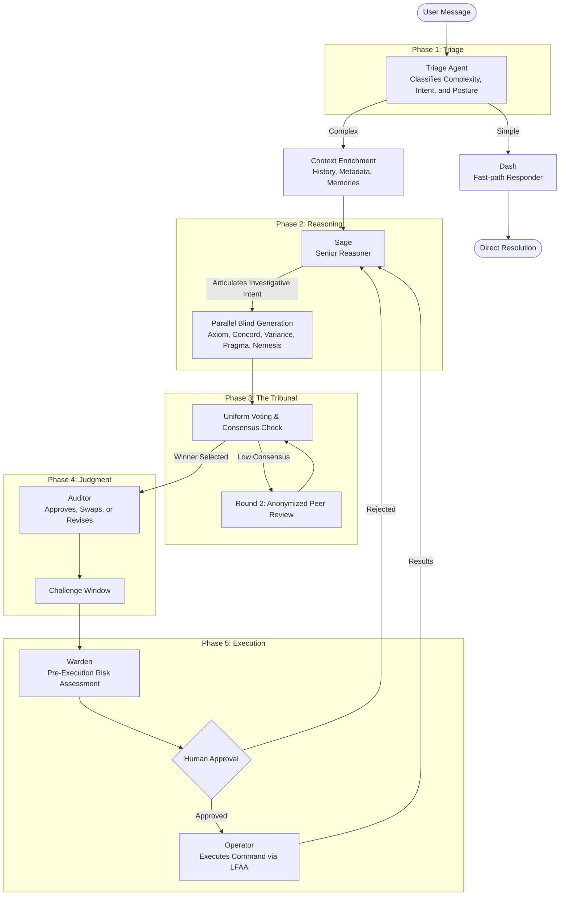
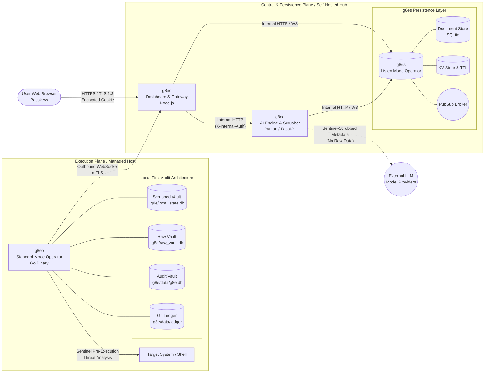

<div align="center">

# g8e

**governance architecture for trustless environments**

The AI reasons. You decide. The architecture enforces it.

Self-hosted · Air-gap capable · Zero cloud dependencies

[Architecture](docs/architecture/about.md) · [Security](docs/architecture/security.md) · [Quick Start](#quick-start) · [Contributing](#contributing)

</div>

---

## Introduction

g8e is a governance architecture designed to solve the **consensus problem** in agentic AI. Rather than relying on fragile model alignment or manual control, g8e frames safety as an economic and information-theoretic challenge.

The system aligns multi-agent behavior through a **Proof of Stake reputation economy** and the **Vortex Principle** (tiered information quarantine). Agents — including a planner, an ensemble tribunal, and a calibrated adversary (Nemesis) — do not just propose actions; they stake their reputation on them.

Key structural safeguards include:
- **The Vortex**: A strict information-theoretic boundary that eliminates collusion by ensuring agents cannot see each other's reasoning or downstream plans.
- **Co-validation Partition**: A non-hierarchical division of labor where the **Auditor** handles machine-domain validation (consistency, grounding) and the **User** handles human-domain validation (intent fidelity, contextual stakes).
- **FIDO2-Gated Execution**: Every state-changing action requires explicit human approval, enforced at the binary and network layer where prompt injection cannot reach.

By forcing agents to stake reputation with real consequences, g8e incentivizes the safest, most effective solutions while minimizing the user's non-fungible stake: their time.

---

## The Lifecycle/Pipeline

The progression of a request through the g8e system involves strict classification, reasoning, and pre-execution verification before reaching a human approver.



**Phase 1: Triage & Classification**  
Every message is read by **Triage**, which routes simple requests to **Dash** and complex requests to **Sage** (enriched with **Codex** and **Scribe** context).

**Phase 2 & 3: Reasoning and The Tribunal**  
**Sage** articulates intent, which **The Tribunal** (Axiom, Concord, Variance, Pragma, Nemesis) translates into candidate commands. A consensus vote selects the optimal command.

**Phase 4 & 5: Judgment and Execution**  
The **Auditor** verifies the winner, **Warden** assesses risks, and the **Operator** executes upon FIDO2 human approval.

---

## The Operator

The **Operator (g8eo)** is a ~4MB statically compiled Go binary that serves as the platform's terminal execution and persistence layer. It is the final link in the consensus chain.

### Consensus-to-Execution Bridge
When the consensus mechanism selects a winning command and you provide FIDO2 approval, the following happens:

1.  **Outbound Command Fetch**: Receives the command via an outbound-only mTLS WebSocket.
2.  **Sentinel Pre-Execution Analysis**: Blocks commands matching MITRE ATT&CK patterns.
3.  **Atomic Execution**: Runs in an isolated process group with closed stdin.
4.  **Local-First Audit**: Captures output into the **Raw Vault** (unfiltered) and **Scrubbed Vault** (AI-accessible).
5.  **Cryptographic Ledgering**: Automatically creates snapshots in a local **Git Ledger**.

---

## Core Subsystems

### The Tribunal
The Tribunal translates natural language intent into executable commands using five parallel personas. Each casts a vote, and a two-vote consensus threshold gates the winner.

| Persona | Archetype |
|---|---|
| **Axiom** | The Composer — statistical probability, resource efficiency |
| **Concord** | The Guardian — harm minimization, ethical integrity |
| **Variance** | The Exhaustive — edge case hunter, adversarial simulation |
| **Pragma** | The Conventional — idiomatic, least-surprise correctness |
| **Nemesis** | The Adversary — always present, always pushing against the other four |

### Context & Post-Hoc Analysis
- **Codex & Scribe**: Title cases and build persistent, scrubbed user preference models.
- **Judge**: Evaluates AI performance against gold-standard rubrics for reputation signals.

### Architecture & Persistence
g8e uses a **Local-First Audit Architecture (LFAA)** where the system of record lives on your hardware, not in the cloud.

| Component | Responsibility |
|---|---|
| **g8es** | Go. SQLite document store, KV store, pub/sub broker, blob store. |
| **g8ee** | Python. AI engine, Multi-provider abstraction, Tribunal pipeline. |
| **g8ed** | Node.js. Dashboard, FIDO2 auth, mTLS gateway, human approval UI. |
| **g8el** | isolated intelligence via local LLM server (llama-server). |
| **g8eo** | Go. The Operator. Executes commands and maintains the encrypted audit vault. |



---

## Governance & Safety

### Cryptoeconomic Mechanism Design

g8e aligns multi-agent behavior through a Proof of Stake reputation economy. Agents do not just propose actions—they stake their reputation on them.

- **The Genesis Block** — A user's initial prompt generates the genesis block, anchored by a Merkle root.
- **Proof of Stake Economy** — Dash, Sage, the Tribunal, and the Auditor all operate within a unified reputation market.
- **Skin in the Game** — When an agent proposes a solution, they stake reputation proportional to their confidence. 
- **Verifiable Resolution** — When you approve a command execution, the Auditor awards reputation to the agents whose proposals succeeded.
- **Immutable Ledger** — The Auditor cryptographically signs each turn, appending it as a new block in the conversation's immutable ledger.
- **Cross-Chain Reputation** — The Auditor maintains visibility across all conversations ("cross-chain"), ensuring an agent's reputation persists and compounds across different investigations.

By forcing agents to stake reputation with real consequences, their personas are economically incentivized to propose the safest, most effective solutions for an environment that voters are sworn to protect.

### Eight Directives

The architectural bedrock of g8e. [Detailed definitions & philosophy](docs/architecture/about.md#core-principles).

```
  I.  AUTHORITY     Every write gated by FIDO2. No exceptions.
 II.  TRUST         Zero standing credentials. Per-action scope.
III.  STRUCTURE     Enforced at binary and network layer.
 IV.  SOVEREIGNTY   Data stays on your hardware. Host as system of record.
  V.  PRESENCE      4MB static binary. Outbound-only. No inbound ports.
 VI.  AUDIT         Encrypted SQLite vaults + git-backed file ledger.
VII.  ISOLATION     Self-hosted. No SaaS, no telemetry, no phone-home.
VIII. AGNOSTIC      Swap models or providers at will. Governance persists.
```

### Security at a Glance

- **Authentication** — FIDO2 / WebAuthn passkeys only. Passwords are unsupported by design.
- **Transport** — TLS 1.3 throughout. Platform-generated ECDSA P-384 CA. Per-operator mTLS client certs issued at claim time.
- **Sentinel & Warden** — Pre-execution defensive analysis. Warden classifies command/error/file risks. 46 MITRE ATT&CK-mapped threat detectors. 28 scrubbing patterns applied twice (egress on the host, ingress on the engine) before any data reaches a model provider.
- **Sessions** — Encrypted cookies, idle and absolute timeouts, IP tracking, timestamp + nonce replay protection.
- **Operator Binding** — System fingerprint locked at first auth. A stolen API key is useless from a different machine.
- **Compliance Alignment** — NSA Zero Trust Guidelines (exceeds requirements in 6 of 7 pillars), HIPAA-ready architecture, FedRAMP-aligned controls.

Full threat model and control catalogue: [docs/architecture/security.md](docs/architecture/security.md).

---

## Quick Start

**Prerequisites:** Docker 24+ and Docker Compose v2.

```bash
git clone https://github.com/g8e-ai/g8e.git && cd g8e
./g8e platform build
```

Trust the platform CA on your workstation:

```bash
# macOS / Linux
curl -fsSL http://<host>/trust | sudo sh

# Windows (elevated PowerShell)
irm http://<host>/trust | iex
```

Open `https://<host>` and register your FIDO2 passkey.

Deploy an Operator to a remote host:

```bash
# Generate a device link in the dashboard, then on the target host:
curl -fsSL http://<host>/g8e | sh -s -- <device-link-token>
```

One command. It pulls the CA, fetches the binary, starts the Operator. No root, no package manager, no dependencies. The binary self-deletes when the session ends.

---

## CLI

```bash
./g8e platform build       # First-time build and start
./g8e platform start       # Start without rebuilding
./g8e platform stop        # Stop (data preserved)
./g8e platform wipe        # Wipe app data, restart fresh

./g8e operator build       # Compile Operator for all architectures
./g8e test <component>     # Run component tests (g8ee, g8ed, g8eo)
```

---

## Status

**Alpha.** A research project with a paranoia-first security posture. No external audit yet. Read the [security architecture](docs/architecture/security.md) and judge the threat model for yourself before any production use.

A significant portion of this codebase was written with AI assistance. If you have been around long enough to know what that means, you already know there are bugs, hallucinated branches, and abstractions a human would have written differently. We built a platform to govern AI agents because we lived the danger of unconstrained ones — while building this platform with those same agents.

---

## Contributing

The architecture is designed to support capabilities that do not exist yet. A good PR that improves any part of the platform gets merged.

What we value:

- Bug fixes and real-world edge cases
- Security hardening and threat model improvements
- New Operator capabilities and tool implementations
- LLM provider integrations and model-specific optimizations
- Documentation, testing, and developer experience
- Novel applications of the governance architecture

If you see something broken, fix it. If you see something missing, build it. If you have an idea nobody has built yet, open an issue.

See [CONTRIBUTING.md](CONTRIBUTING.md) for environment setup.

---

## Documentation

| Document | Description |
|---|---|
| [Architecture Overview](docs/architecture/about.md) | Origins, governance philosophy, core principles |
| [Security Architecture](docs/architecture/security.md) | Authentication, Sentinel, LFAA, threat model |
| [AI Control Plane](docs/architecture/ai_control_plane.md) | ReAct loop, Tribunal, prompts, tools, providers |
| [Operator Binary](docs/architecture/operator.md) | Lifecycle, modes, deployment, on-host storage |
| [Developer Guide](docs/developer.md) | Setup, code quality rules, project structure |
| [Testing Guide](docs/testing.md) | Test infrastructure, component guidelines, CI |
| [Glossary](docs/glossary.md) | Platform terminology |

---

## License

[Apache License, Version 2.0](LICENSE).

---

<div align="center">

*g8e is developed by [Lateralus Labs, LLC](https://lateraluslabs.com), a Certified Veteran Owned Small Business (VOSB).*

</div>
