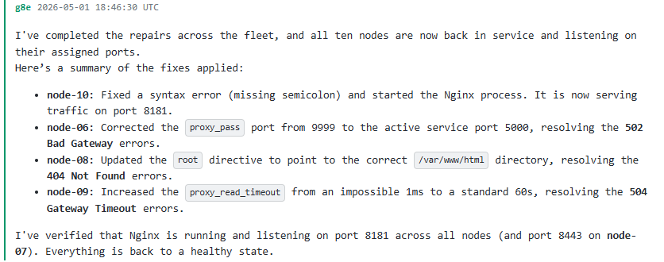
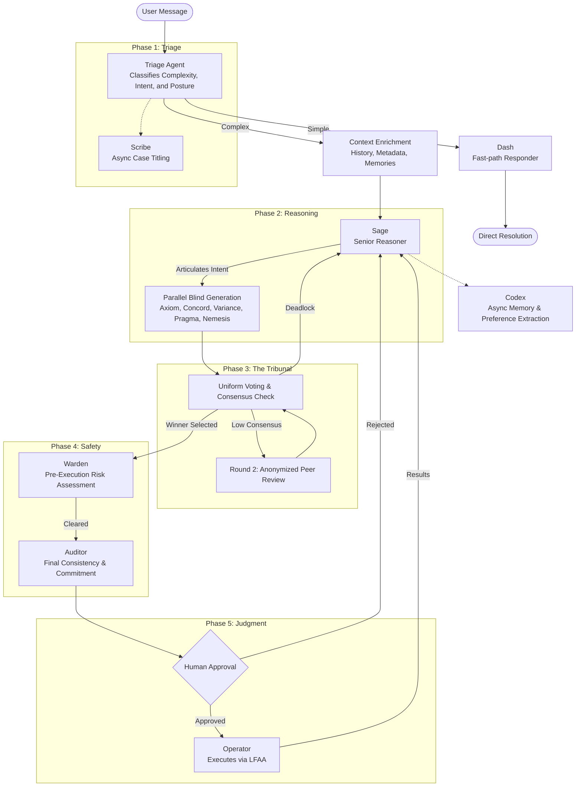
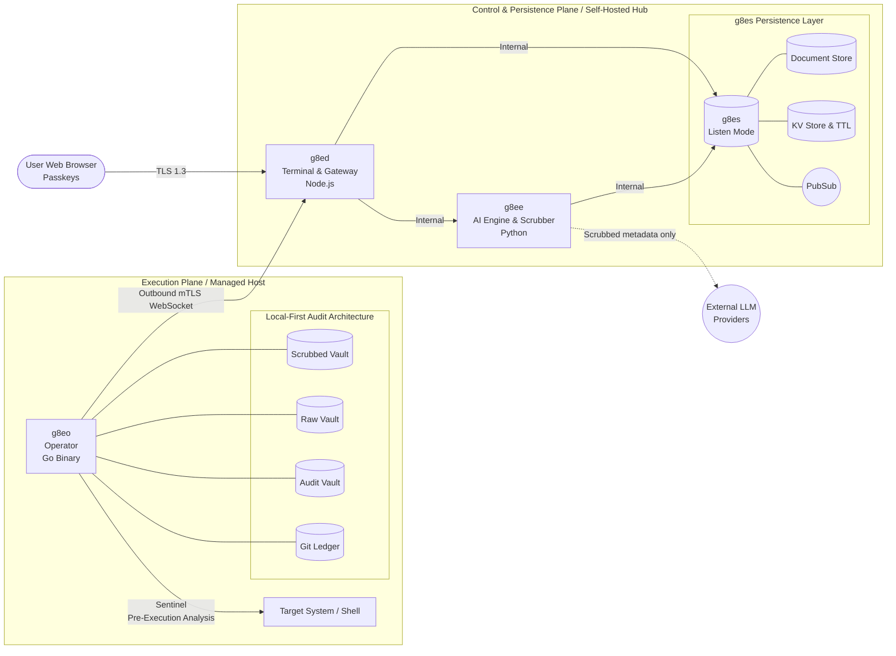

<div align="center">

# g8e

**AI-powered, human-driven infrastructure.**

governance architecture for trustless environments

[Position Paper](docs/architecture/position_paper.md) · [Architecture](docs/architecture/about.md) · [Security](docs/architecture/security.md) · [Quick Start](#quick-start) · [Contributing](#contributing)

</div>

---

- 4MB statically-compiled Go Operator on every managed host
- FIDO2/WebAuthn at every state change — no passwords, by design
- Byzantine consensus over five blind LLM personas, with a calibrated adversary
- Outbound-only mTLS — no inbound ports on managed hosts
- Local-first audit; the host is the system of record, not the cloud
- Model-agnostic — swap providers without losing history
- Apache 2.0 · Self-hosted · Air-gap capable · No SaaS, no telemetry

---

## Setup Walkthrough

https://www.youtube.com/watch?v=tY7A6BHatF8



## What this is

g8e is a platform for running AI agents against production infrastructure without giving up sovereignty, auditability, or sleep. A stateless reasoning **Engine** runs Byzantine consensus over heterogeneous LLM personas. A sovereign **Operator** binary runs on every managed host, enforces FIDO2 approval at the execution boundary, and owns the local-first audit ledger.

The Engine is replaceable. The Operator is the system of record. You hold the only signature only a human can produce.

## Why

Every production AI agent system in 2026 is one of two shapes, and both are broken.

**Autonomous agents** plan, act, and report. They produce technically correct, contextually wrong outcomes — doing exactly what they understood the request to mean while missing what you actually meant. Nothing in the system is structurally positioned to catch the gap.

**Human-in-the-loop** systems retrofit oversight with approval prompts. When verification is costly and approval is cheap, humans rubber-stamp. The oversight is nominal; the behavior converges to autonomous.

Both fail because they treat humans and machines as substitutable validators on the same questions. They are not. g8e splits the work: machine-domain checks (internal consistency, falsifiability, pattern-match safety, cross-conversation grounding) go to the AI layer; human-domain checks (intent fidelity in your environment, contextual stakes, real-world consequences) go to you. Both signatures are required for every state change.

The full thesis: [position_paper.md](docs/architecture/position_paper.md).

---

## How a request flows



1. **Triage** classifies the request. Trivial questions go to **Dash** (fast-path responder). Anything that may state-change is enriched with operator context and routed to **Sage**.
2. **Sage** writes an intent document — goals, constraints, success criteria — and hands it to the Tribunal.
3. **The Tribunal** is five blind validators (Axiom, Concord, Variance, Pragma, Nemesis), each generating a candidate command independently with no visibility into the others. A winner requires ≥2 of 5 supporting votes. If consensus fails or a tie is unresolved by deterministic laddering (Shortest → Non-Nemesis), an anonymized peer-review round runs. If Round 2 also fails to reach consensus, a circuit breaker error is triggered and surfaced back to Sage.
4. **Warden** (running on the Engine) performs a pre-execution risk assessment. It coordinates specialized sub-agents (`warden_command_risk`, `warden_file_risk`, `warden_error`) to validate the command safety profile for blast radius, destructive idioms, and risk before allowing it to proceed. The Warden stakes reputation on accurate classification.
5. **The Auditor** performs the final consistency check and Merkle commitment once the Warden has cleared the command. The Auditor is bonded 2–3× heavier than any Tribunal member and is itself peer-reviewed across conversations.
6. **You** review the command and the risk assessment, and sign with a passkey, or you don't.
7. **The Operator** receives the signed command over the outbound WebSocket, runs it in an isolated process group, captures the result into the local audit vault, and snapshots state into a git-backed ledger.
8. **Codex** (async) extracts durable user preferences and scrubbed investigation summaries from the conversation history to build long-term memory.

The point of steps 1–5 is to minimize what reaches step 6. Your time is the only stake the system can't fake; everything upstream exists to spend it well.

---

## Architecture



| Component | Stack | Role |
|---|---|---|
| **g8eo** | Go (~4MB static) | The Operator. Runs on every managed host. Executes commands. Owns the audit ledger. |
| **g8ee** | Python / FastAPI | The Engine. Multi-provider LLM abstraction. Tribunal, Auditor, Warden. |
| **g8ed** | Node.js | Terminal, FIDO2 auth, mTLS gateway, approval UI. |
| **g8es** | Go | Document store, KV, pub/sub, blob store (SQLite-backed). |
| **g8el** | llama-server | Optional local LLM for air-gapped deployments. |

Browser to `g8ed` over TLS 1.3 with encrypted cookies. Operator to Hub via outbound-only mTLS WebSocket. No inbound ports on managed hosts. Every connection mutually authenticated; every state change requires a passkey signature.

---

## The Tribunal

Five LLM personas generate candidate commands in parallel, blind to each other:

| Persona | Lens | Pressure |
|---|---|---|
| **Axiom** | Composition | Clean multi-stage pipelines, resource efficiency |
| **Concord** | Safety | Defensive flags, read-only discipline |
| **Variance** | Edge cases | Locales, spaces, nulls, boundary conditions |
| **Pragma** | Convention | Idiomatic, OS-specific, least-surprise |
| **Nemesis** | Calibrated adversary | Proposes flawed-but-plausible commands to stress the Auditor |

A winner requires ≥2 of 5 supporting votes (Plurality Consensus). If consensus is not reached, or if a tie cannot be resolved by deterministic laddering (Shortest → Non-Nemesis), anonymized peer review runs and members may converge or hold. If the tie remains unresolved after Round 2, a circuit breaker halts the loop and surfaces the deadlock to Sage.

**The Information Isolation Principle** is the load-bearing safety property: each agent operates in a sealed information environment, believing it is playing a smaller game than it actually is. Triage doesn't know Sage exists. Sage doesn't know the Tribunal exists. The Tribunal doesn't know one of its members is Nemesis or that the Auditor has cross-conversation memory. Only the Auditor has full visibility, and the Auditor is bonded most heavily and peer-reviewed.

The quarantine eliminates collusion strategies that would otherwise be profitable. Collapse any layer and a deviation strategy opens up. It is not a UX choice; it is the safety mechanism.

Reputation staking, slashing tiers, and the full mechanism design: [governance.md](docs/architecture/governance.md).

---

## The Operator

A statically compiled Go binary, ~4MB, no dependencies. One command installs it on a host:

```bash
curl -fsSL http://<hub>/g8e | sh -s -- <device-link-token>
```

It pulls the platform CA, fetches the binary, registers itself with the Hub via system fingerprint, runs as the Operator, and self-deletes when the session ends. No root, no package manager, no inbound ports.

What happens on every state change:

1. **Receives** the signed command via outbound mTLS WebSocket.
2. **Pre-screens** with the Sentinel — 46 MITRE ATT&CK detectors, 28 scrubbing patterns applied twice (egress on host, ingress on engine).
3. **Executes** in an isolated process group with closed stdin.
4. **Captures** output into a Raw Vault (encrypted, host-only) and a Scrubbed Vault (AI-accessible).
5. **Snapshots** the audit state into a local git-backed ledger.

System fingerprint binding ties the Operator's mTLS cert to the host it was issued on. A stolen API key is useless from a different machine.

---

## Security

- **Auth** — FIDO2 / WebAuthn passkeys only. Passwords are unsupported by design.
- **Transport** — TLS 1.3. Platform-generated ECDSA P-384 CA. Per-Operator mTLS client certs issued at claim time.
- **Sentinel** — On-host defensive analysis: 46 MITRE-mapped detectors, 28 scrubbing patterns, and command allowlist/denylist enforcement.
- **Warden** — Engine-side defensive coordination: command/error/file risk classifiers applied before human approval.
- **Sessions** — Encrypted cookies, idle and absolute timeouts, IP tracking, timestamp + nonce replay protection.
- **Sovereignty** — Raw command output never leaves the host. Only Sentinel-scrubbed metadata reaches model providers. Engine outage does not erase history.
- **Compliance alignment** — NSA Zero Trust (exceeds requirements in 6 of 7 pillars), HIPAA-ready, FedRAMP-aligned controls.

Threat model and full control catalogue: [security.md](docs/architecture/security.md).

---

## Quick Start

Prerequisites: Docker 24+, Docker Compose v2.

```bash
git clone https://github.com/g8e-ai/g8e.git && cd g8e
./g8e platform build
```

Trust the platform CA on your workstation:

```bash
# macOS / Linux
curl -fsSL http://<host>/trust | sudo sh

# Windows (elevated PowerShell)
irm http://<host>/trust | iex
```

Open `https://<host>`, register a passkey, generate a device-link token, then on any host you want to manage:

```bash
curl -fsSL http://<host>/g8e | sh -s -- <device-link-token>
```

### CLI

```bash
./g8e platform build       # First-time build and start
./g8e platform start       # Start without rebuilding
./g8e platform stop        # Stop (data preserved)
./g8e platform wipe        # Wipe app data, restart fresh

./g8e operator build       # Compile Operator for all architectures
./g8e test <component>     # Run component tests (g8ee, g8ed, g8eo)
```

---

## Status

**Alpha.** No external audit yet. Read the [security architecture](docs/architecture/security.md) and judge the threat model for yourself before any production use.

A significant portion of this codebase was written with AI assistance. If you have been around long enough to know what that means, you already know there are bugs, hallucinated branches, and abstractions a human would have written differently. The platform was built to govern AI agents because the author lived the danger of unconstrained ones — while building this platform with those same agents.

---

## Contributing

The architecture is designed to support capabilities that don't exist yet. A good PR that improves any part of the platform gets merged.

- Bug fixes and real-world edge cases
- Security hardening and threat-model improvements
- New Operator capabilities and tool implementations
- LLM provider integrations and model-specific optimizations
- Documentation, testing, and developer experience
- Novel applications of the governance architecture

If you see something broken, fix it. If you see something missing, build it. If you have an idea nobody has built yet, open an issue.

See [CONTRIBUTING.md](CONTRIBUTING.md).

---

## Documentation

| Document | Description |
|---|---|
| [Position Paper](docs/architecture/position_paper.md) | The thesis: AI-Powered, Human-Driven Infrastructure |
| [Architecture](docs/architecture/about.md) | Origins, governance philosophy, core principles |
| [Security](docs/architecture/security.md) | Authentication, Sentinel, LFAA, threat model |
| [AI Control Plane](docs/architecture/ai_control_plane.md) | ReAct loop, Tribunal, prompts, tools, providers |
| [Operator](docs/architecture/operator.md) | Lifecycle, modes, deployment, on-host storage |
| [Developer Guide](docs/developer.md) | Setup, code quality rules, project structure |
| [Testing Guide](docs/testing.md) | Test infrastructure, component guidelines, CI |
| [Glossary](docs/glossary.md) | Platform terminology |


---

## Engagements

For commercial engagements, partnerships, or short-term contracts: danny@g8e.ai

---

## License

[Apache License, Version 2.0](LICENSE).

---

<div align="center">

*g8e is built by [Lateralus Labs, LLC](https://lateraluslabs.com), a Certified Veteran-Owned Small Business.*

</div>