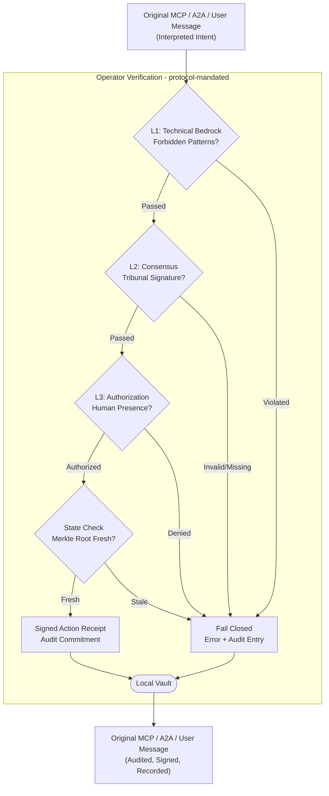
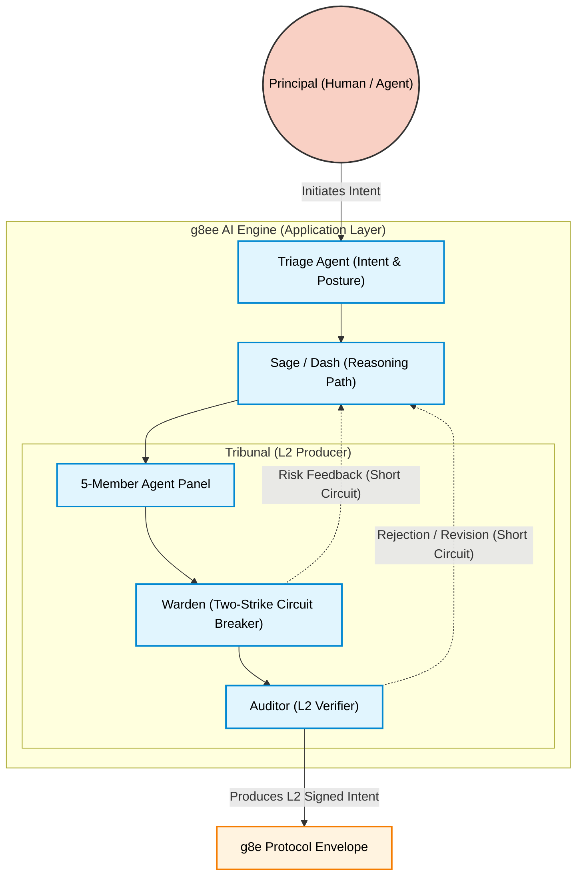

# g8e

**Byzantine Fault Tolerant (BFT) Governance Substrate for Agentic Infrastructure.**

g8e is a zero-trust execution substrate that forces AI tool calls into a governance envelope. It physically separates intent generation from execution, requiring a compliant agentic system to reach structural consensus before mutating state.

Designed for universal interoperability, g8e provides a mandatory security perimeter for standard JSON-based protocols like Anthropic's **Model Context Protocol (MCP)** and **Agent-to-Agent (A2A)**. While these protocols define the "what" (the payload), g8e serves as the **Admission Gate** - ensuring every transaction is typed, signed, and state-bound before it touches the host.

---

## Technical Architecture

The platform operates on a strict zero-trust model where components distrust each other. State changes require cryptographic proof of consensus.

### Zero-Trust Principles
The system is architected for universal distrust between all actors:
- **Principal / User:** Distrusts any single AI provider (enforces multi-model workflows) and any host running an Operator (verified via fingerprinting, mTLS, and device links).
- **Engine (g8ee):** Distrusts the User (blocks malicious operations) and the Operator (enforces scoped sessions and scrubs data before delivery to AI).
- **Operator (g8eo):** Distrusts both User and AI (enforces inbound-only communication via signed protocol envelopes, Sentinel gates, and mTLS).

*   **The Protocol (Wire Contract)**: A typed, signed, state-bound transaction layer. It is the single source of truth for all system mutations and the only mandatory component for interoperability. See [GovernanceEnvelope](protocol/proto/common.proto) (protojson).



*   **The Operator (Substrate)**: The host-resident binary (`g8eo`) running in `--listen` mode. It is the fail-closed execution boundary. It rejects commands lacking L2 structural consensus or L3 human authorization, enforces L1 hard-gates, and writes an immutable audit ledger (LFAA).
*   **The Engine (Optional App)**: A reference AI engine (`g8ee`) or any BYO agentic system consumes the protocol to articulate intent and produce verifiable transactions. It fulfills intent via a ReAct loop.



### Agentic Hierarchy & Fault Tolerance
The AI Engine employs a multi-layered agentic hierarchy to ensure high-fidelity intent translation and execution:

- **Triage & Dash:** Specialized agents for routing, posture assessment, and high-speed trivial responses.
- **Sage (Reasoning Engine):** Primary interpreter of user intent. Sage stakes reputation on proposals but **cannot execute**; it must submit intent to the Tribunal.
- **Tribunal (Consensus):** Isolated agents generating command proposals from unique perspectives. Requires consensus (2/5 or 5/5) to proceed. If consensus fails, it loops back to Sage for refinement.
- **Warden (Circuit Breaker):** Heuristic blocker that rejects "off-the-wall" proposals. Rejections trigger a loop back to Sage to improve intent translation.
- **Auditor (History & Grounding):** Final verification layer. Reviews the full investigation history to ensure progressive accuracy before signing the protocol envelope.
- **Nemesis (Adversary):** Embedded adversary designed to keep the hierarchy honest. Nemesis proposals are auto-recorded for audit but never executed; they are presented to the user for manual approval.

*   **The Principal (Intent)**: The entity requesting the action (e.g., a human via WebAuthn/Passkey or an upstream AI agent).

---

## 3-Layer Governance Summary

Every mutation must pass all three layers in sequence at the substrate boundary.

| Layer | Name | Mechanism | Responsibility |
|---|---|---|---|
| **L1** | **Technical Bedrock** | Static Analysis / Reflection | Forbidden patterns, regex threat matching, and policy enforcement. |
| **L2** | **Consensus** | Ed25519 Signatures | Cryptographic proof that an independent ensemble (Tribunal) co-validated the intent. |
| **L3** | **Authorization** | WebAuthn / FIDO2 | Hardware-bound proof of human presence for mutations. |

---

## Quick Start

Prerequisites: Go 1.22+, Python 3.12+ (for optional Engine).

```bash
git clone https://github.com/g8e-ai/g8e.git && cd g8e

# Start the mandatory Operator substrate
./g8e platform start

# (Optional) Start the reference AI Engine
./g8e apps start g8ee
```

1.  **Bootstrap**: Follow the CLI instructions to initialize the operator and generate a device-link token.
2.  **Login**: `./g8e login` to authenticate the CLI via mTLS.
3.  **Audit**: View real-time transaction logs in `.g8e/logs/operator-listen.log`.

---

## Documentation

*   [**Protocol Substrate**](docs/protocol.md): Wire format, transaction hashes, and L1/L2/L3 definitions.
*   [**Operator (g8eo)**](docs/g8eo.md): Execution boundary, listener modes, and host storage.
*   [**Engine (g8ee)**](docs/g8ee.md): Reference AI application and agentic orchestration.
*   [**Developer Troubleshooting**](docs/developer/troubleshooting.md): Common setup failures and recovery checks.
*   [**Contribution Guide**](CONTRIBUTING.md): Build instructions, testing workflows, and standards.

### Implementation Reference
- **Protocol Schemas**: `protocol/proto/*.proto`
- **Governance Logic**: `services/g8eo/internal/services/governance/`
- **Audit Storage**: `services/g8eo/internal/services/storage/audit_vault.go`

**License**: Apache 2.0
**Built by**: [Lateralus Labs](https://lateraluslabs.com)
