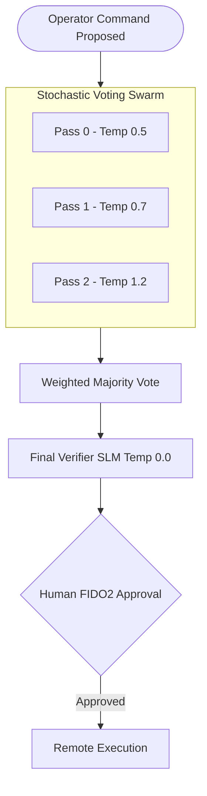
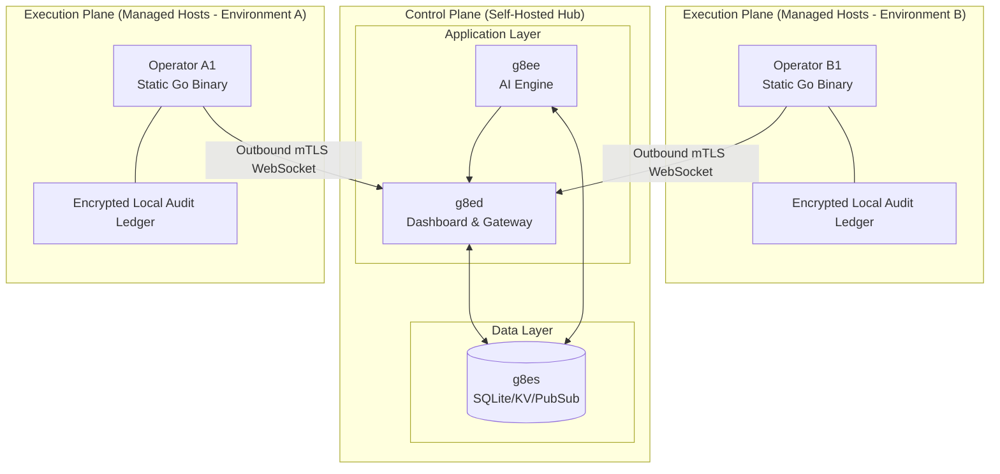

# g8e

**Self-Hosted Command-and-Control for AI-Assisted Infrastructure.**

[Website](https://g8e.ai) | [Architecture](docs/architecture/about.md) | [Security](SECURITY.md) | [Quick Start](#quick-start)

---

## What is g8e?

g8e is an open-source platform that lets AI safely investigate and manage your remote infrastructure. It operates on a strict zero-trust model: **The AI acts as an advisor; you are the final authority.**

The system securely binds your remote servers to a centralized web session. You tell the AI what you want to achieve. It fans out across your fleet, pulls context, reasons about the problem, and proposes terminal commands. **It cannot execute anything.** The architecture cryptographically guarantees that every state-changing action requires explicit human approval via FIDO2 WebAuthn. 

There are no LLM system prompt constraints doing the heavy lifting here—safety is enforced structurally at the binary and network layers.

### Key Engineering Properties

1. **Absolute Human Authority** — Execution and authorization are strictly separated. The AI proposes; a human approves. 
2. **Zero Standing Trust** — No long-lived execution credentials. Trust is mathematically bound to mTLS sessions and earned per action.
3. **Ephemeral Footprint** — The Operator is a ~4MB dependency-free static Go binary. Outbound-only mTLS. No inbound ports. No root required.
4. **Data Sovereignty** — The platform is 100% self-hosted. Raw operational data never leaves your hosts; the AI only receives heavily scrubbed, sanitized context.
5. **Universal Runtime** — Bring your own models (Anthropic, OpenAI, local Ollama) and deploy the Operator to any OS.

---

## Quick Start

**Prerequisites:** `docker` 24+ and `docker compose` v2.

1. **Build and start the platform:**
   ```bash
   git clone https://github.com/g8e-ai/g8e.git && cd g8e && ./g8e platform build
   ```

2. **Trust the platform CA certificate:**
   The platform generates its own CA certificate. You must trust it on your workstation before accessing the dashboard.
   
   **Primary method (recommended):** The platform auto-detects your OS and installs the CA:
   ```bash
   # macOS / Linux (replace <host> with your server's IP or hostname)
   curl -fsSL http://<host>/trust | sudo sh

   # Windows (PowerShell, run as Administrator)
   irm http://<host>/trust | iex
   ```
   
   **Alternative method:** Use the CLI wrapper:
   ```bash
   ./g8e security certs trust
   ```

3. **Access the dashboard:**
   Open `https://<host>` in your browser and follow the setup wizard to register your FIDO2 passkey.

---

## Core Components

| Service | Container | Language | Role |
|---------|-----------|----------|------|
| **g8es** | `g8es` | Go | Persistence (SQLite), KV store, pub/sub broker |
| **g8ee** | `g8ee` | Python | AI engine, LLM orchestration, ReAct loop |
| **g8ed** | `g8ed` | Node.js | Web UI, passkey auth, mTLS gateway |
| **g8ep** | `g8ep` | Multi | CLI runner, Operator build, SSL management |
| **Operator** | *(runs on target)* | Go | ~4MB Execution agent deployed to your fleet |

---

## How It Works

g8e uses a **Tribunal Refinement Pipeline** to ensure proposed commands are safe before they even reach a human for approval.

1. **Investigation:** The ReAct loop (`g8ee`) queries the remote Operator for context.
2. **Proposal:** An LLM proposes an action.
3. **The Swarm (Parallel Generation):** Three different LLMs at varying temperatures independently evaluate the proposal and generate alternatives.
4. **Consensus:** A weighted majority vote selects the best, safest command.
5. **Verification:** A final zero-temperature SLM verifies the winning command.
6. **Human Approval:** The command halts. You review and approve it via the dashboard.
7. **Execution:** The Operator executes the command locally, recording the output to an encrypted, append-only local ledger.



---

## Architecture & Security Plane

The Operator acts as the central data plane. On managed hosts, it maintains the authoritative system of record for all local operations (Raw Vault, Audit Vault, Git Ledger). 



- **Passkey Auth:** WebAuthn only. Passwords are not supported.
- **Sentinel Security:** 50+ threat detectors preemptively block dangerous commands; 20+ scrubbing patterns protect PII and secrets from being sent to the LLM.
- **Strict Isolation:** See [Security Architecture](docs/architecture/security.md) for a deep dive into our threat models.

---

## CLI Reference

Everything is managed through the `./g8e` wrapper script.

```bash
# Platform Management
./g8e platform setup    # First-time build and start
./g8e platform up       # Start existing containers
./g8e platform down     # Stop all containers
./g8e platform wipe     # Destroy all data and restart fresh

# Operator Deployment
./g8e operator build    # Compile the Operator binary
./g8e operator g8e <user@host> --endpoint <ip>  # Deploy via SSH

# Tests
./g8e test              # Run all component tests
```

---

## Project Status & Origins

**Status: Alpha.** This is a highly technical research project. While built with a paranoia-first security mindset, it has not undergone external audits. Use in production at your own risk.

**Origins:** g8e was built from scratch with the heavy assistance of AI coding agents. We built a platform to govern AI agents because we realized how dangerous unconstrained agents are while building this very platform. 

Read the full story in [Origins, Governance, and Philosophy](docs/architecture/about.md).

---

## Contributing

We explicitly welcome PRs that fix bugs, clean up smelly code, or remove tech debt. If you see something broken, fix it. See [CONTRIBUTING.md](CONTRIBUTING.md) for environment setup and guidelines.

## License

[Apache License, Version 2.0](LICENSE).
