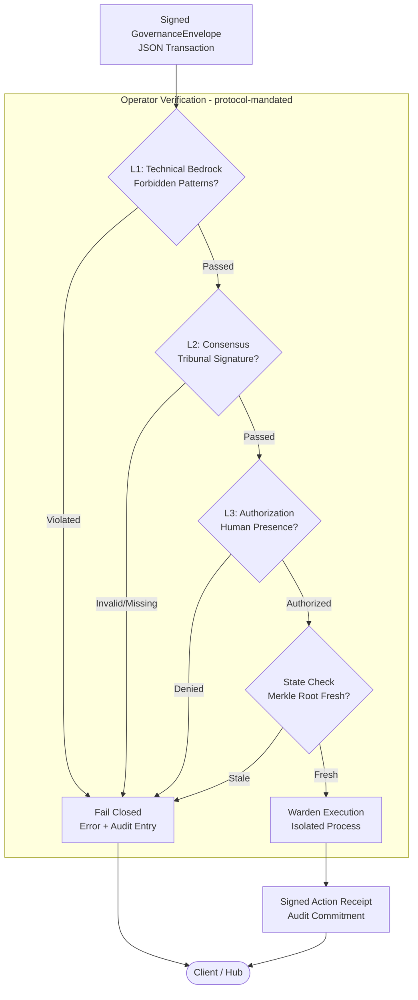
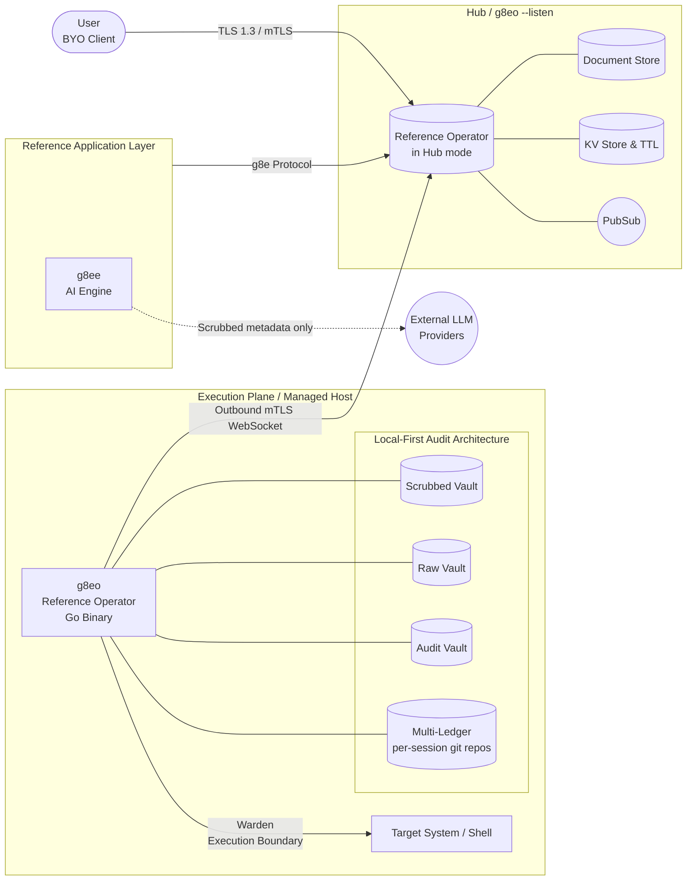

# g8e

**A governance-first protocol for trustless, human-verified action by autonomous systems.**

The **g8e Protocol** is the substrate: a wire contract that binds typed payloads, canonical event names, state roots, and a 3-layer governance hierarchy (L1/L2/L3) into a single signed `GovernanceEnvelope` (UAP JSON) transaction. It is not specific to any one domain. Anything that can express an intended action as a typed payload — infrastructure mutations, data writes, financial transfers, physical-world actuation, agent-to-agent calls — can be governed by it.

An **Operator** is any host-side implementation that speaks the g8e Protocol: it receives signed transactions, enforces L1/L2/L3 verification, executes through a defensive boundary, and emits signed receipts anchored to a local multi-ledger. The Operator is a role, not a specific binary.

This repository ships:

- The **g8e Protocol** (`protocol/proto`, `docs/architecture/protocol.md`) — the canonical wire contract.
- **g8eo** — a reference Operator implementation in Go. Sovereign, single-binary, runs as a satellite on managed hosts or as a hub in `--listen` mode.
- **g8ee** — an optional reference AI engine and reasoning layer.

If you want to build something else on the protocol — a different Operator, a different application, a different class of governed action — the contract is the same.

Self-hosted. Air-gap capable. Apache 2.0. Built for environments where nominal oversight is a failure state.

### Core Principles

These principles are properties of the protocol. The reference Operator and reference application illustrate them; any conforming implementation must preserve them.

- **Host Sovereignty.** The host that performs the action is the system of record. Every accepted mutation and its output are anchored to a local, append-only audit layer on that host. Raw data never has to leave the host for governance to function. The reference Operator implements this via a **Multi-Ledger Architecture** (LFAA) — each operator session owns an isolated, git-backed ledger — plus native SQLite vaults queryable with standard SQL and mapped to MITRE ATT&CK for SIEM/SOC integration.
- **Decoupled Reasoning.** Intent generation is separated from execution. Whatever produces an intent (an LLM ensemble, a human, another agent, a deterministic policy engine) is stateless from the Operator's perspective — only signed transactions cross the boundary. The reference application uses a swappable, stateless reasoning engine across Anthropic, Gemini, OpenAI, and local providers (Ollama, llama.cpp).
- **Operator Integrity.** The Operator is a verifiable-execution boundary, not a translator. Malformed, unsigned, or stale transactions are rejected, never coerced. The reference Operator adds Sentinel pre-execution analysis, hardware fingerprint binding, and outbound-only mTLS on top of the protocol's required L1/L2/L3 checks.
- **Consensus-Driven Safety.** L2 requires an independent consensus proof; the protocol does not care how that consensus is produced. The reference application produces it with a Tribunal of five specialized LLM personas under tiered information isolation, an adversarial co-validator (Nemesis), and reputation staking with automated slashing.

## Why

The g8e Protocol lets any agent — AI or human — investigate freely, but only governed, signed, auditable actions can change state.

Two architectures dominate agentic AI in 2026, and both fail wherever the cost of a wrong action is real.

**Autonomous agents** act without verifying contextual intent. They do exactly what they understood the request to mean while missing what the user actually meant. Every catastrophic agent failure has the same shape.

**Human-in-the-loop systems** retrofit oversight through approval prompts. When verification is costly and approval is cheap, humans rubber-stamp — autonomous behavior with the appearance of control.

Both treat the actors in the system as trustworthy by default and bolt verification on top. g8e inverts that: every actor assumes the others may be compromised and verifies accordingly.

The machine handles what is machine-checkable — consistency, grounding, falsifiability. The human handles what is only human-checkable — intent fidelity, contextual stakes, acceptance of consequences. Both signatures are required for every state change. Neither is trusted on its face.

Full treatment: [position paper](docs/architecture/position_paper.md).

## Protocol Transaction Flow

The g8e Protocol enforces safety at the point of execution. Every mutation reaches an Operator as a signed `GovernanceEnvelope` transaction. The diagram below shows the verification pipeline a conforming Operator must implement; the reference implementation is `g8eo`.



1. **L1 (Hard Gates)**: The Operator boundary enforces forbidden patterns (e.g., `sudo`, `su`) and system-level allowlists via reflected Protobuf options.
2. **L2 (Consensus)**: The transaction must carry a valid cryptographic signature from a trusted consensus panel (The Tribunal).
3. **L3 (Authorization)**: State-changing mutations require a hardware-bound signature (FIDO2/WebAuthn) or match an explicit auto-approval policy for benign diagnostics.
4. **State Freshness**: The `state_merkle_root` binds the command to the host state at generation time; the Operator rejects stale or replayed transactions.
5. **Warden Execution**: The Operator's on-host execution boundary performs the action and captures results into the session-scoped audit ledger. The reference implementation calls this the Warden and writes to the session's LFAA git-backed ledger (Multi-Ledger Architecture: one isolated git repo per operator session under `.g8e/data/ledger/sessions/<session_id>/`).
6. **Signed Receipt**: Every execution (success or failure) emits a signed `ActionReceipt` providing an immutable proof of the mutation.

---

## Protocol Foundation

The protocol is g8e. Operators, agents, and applications are interchangeable; the wire contract is not. Every interaction is governed by a single contract:

- **Canonical JSON (protojson)**: All client-facing surfaces (HTTP, PubSub, receipts) use JSON for maximum ecosystem compatibility (MCP, A2A, LLMs).
- **GovernanceEnvelope (UAP)**: A unified container binding identity, intent, state, and governance proofs.
- **Hash-Based Signing**: Signatures are computed over a deterministic transaction hash; wire encoding is irrelevant to the security invariant.
- **Internal Storage**: Protobuf bytes are used internally for high-performance persistence and audit vaults.

Full contract: [protocol.md](docs/architecture/protocol.md).

---

## Reference Architecture

This is one valid topology built on the protocol: the reference Operator (`g8eo`) running both as a sovereign satellite on a managed host and as a central hub, with the reference AI application (`g8ee`) attached as a BYO client.



| Component | Stack | Role |
|---|---|---|
| **g8eo** | Go | **Reference Operator implementation.** Provides persistence, PKI, messaging (PubSub), and governance enforcement. Runs as a sovereign satellite on managed hosts or as a hub in `--listen` mode. |
| **g8ee** | Python | **Optional AI Engine.** A reference reasoning layer that orchestrates the Tribunal and Auditor workflows for agentic infrastructure management. |

Every interaction with an Operator is mutually authenticated via TLS 1.3 and mTLS. State-changing workflows must pass through the L1/L2/L3 governance hierarchy, with hardware-bound passkey authorization as the default Layer 3 path.

---

## Reference Application: AI-Powered Infrastructure Management

The protocol is domain-agnostic. The reference application bundled in this repository demonstrates one concrete use case: AI agents proposing infrastructure mutations that humans verify and a sovereign Operator executes.

### g8ee (AI Engine)
A Python-based agentic reasoning engine. It is the reference L2 producer: it generates candidate commands, runs the **Tribunal** consensus model, and orchestrates multi-provider LLM calls. A different application could replace it entirely as long as the transactions it emits conform to the protocol.

The Tribunal uses five specialized LLM personas to generate candidate commands in parallel, blind to each other:

| Persona | Lens | Responsibility |
|---|---|---|
| **Axiom** | Composition | Clean multi-stage pipelines, resource efficiency. |
| **Concord** | Safety | Defensive flags, read-only discipline. |
| **Variance** | Edge cases | Robustness against spaces, locales, and nulls. |
| **Pragma** | Convention | Idiomatic, OS-specific "best practices". |
| **Nemesis** | Adversary | Calibrated stress-test; tries to trick the system. |

To start the platform with this application enabled, use `./g8e platform start --with-apps`.

---

## Governance Hierarchy

g8e uses a 3-layer command validation hierarchy to ensure safety and minimize click fatigue:

1. **L1 (Hard Gates)**: Forbidden patterns (`sudo`, `su`, etc.) and system-level allowlists. Always active.
2. **L2 (Consensus)**: The Tribunal ensemble must reach consensus on the command. Signature-verified by the Operator.
3. **L3 (Authorization)**: Human-in-the-loop by default. Benign diagnostic commands may be auto-approved, but only if they have already passed L1 and L2.


## The Reference Operator (g8eo)

`g8eo` is the reference Operator implementation: a single Go binary that can run in two modes — **Hub (`--listen`)** or **Satellite**. It is the canonical example of what an Operator does, not a privileged component of the protocol. Replace it with any implementation that preserves the same verification and audit invariants.

### Capabilities

- **Protocol Enforcement**: Verifies every inbound transaction against the L1/L2/L3 governance hierarchy before execution.
- **PKI Authority**: Owns the platform's Certificate Authority (CA). Handles CSR signing, certificate revocation (CRL/OCSP), and mTLS trust brokerage.
- **Identity & Access**: Manages hardware-bound device links, user registration, and WebAuthn/FIDO2 passkey brokerage for Layer 3 authorization.
- **Local-First Storage**: Provides a high-performance Document Store (SQLite), KV Store, and Blob storage for all platform components.
- **LFAA (Local-First Audit Architecture)**: Every mutation is anchored to a session-scoped, git-backed ledger on the host (Multi-Ledger: one isolated git repo per operator session), providing an immutable chain of custody.
- **Real-time Messaging**: A built-in PubSub broker and WebSocket gateway orchestrate traffic between satellites, hubs, and clients.
- **Sentinel Defense**: MITRE ATT&CK detectors and scrubbing patterns perform on-host pre-execution analysis of every command.

### Deployment Modes

- **Hub Mode (`--listen`)**: Acts as the central persistence and messaging backbone for a fleet. No inbound ports are required on satellite hosts.
- **Satellite Mode**: Runs on a managed host. It establishes an outbound-only mTLS connection to a Hub, receives signed transactions, verifies them against the protocol, and executes them in an isolated environment.

---

## Security

- **Auth** — Proof of Human Presence (PHP) via FIDO2 / WebAuthn passkeys. Hardware-bound approval is the default Layer 3 state for mutations; auto-approval is restricted to benign commands that already passed L1 and L2. Passwords are unsupported by design.
- **Transport** — TLS 1.3 for the Control Plane; outbound-only mTLS for Operators. Platform-generated ECDSA P-384 CA.
- **Sentinel** — On-host defensive analysis: MITRE-mapped detectors, scrubbing patterns, and command allowlist/denylist enforcement.
- **Warden** — Defensive execution: The on-host execution boundary inside the Operator that executes transactions, enforces state-root freshness, and emits signed ActionReceipts.
- **Sovereignty** — Raw command output never leaves the host. Only Sentinel-scrubbed metadata reaches model providers. Engine outage does not erase host-local history.
- **LFAA** — Local-First Audit Architecture. All state changes are committed to a session-scoped git ledger (Multi-Ledger: one isolated git repo per operator session) and SQLite vaults on the managed host.
- **Compliance** — NSA Zero Trust (exceeds requirements in 6 of 7 pillars), HIPAA-ready, FedRAMP-aligned controls.

Threat model and full control catalogue: [security.md](docs/architecture/security.md).

---

## Quick Start

Prerequisites: Go and curl available on the host. Python 3.12+ is only required for the optional Engine adapter.

```bash
git clone https://github.com/g8e-ai/g8e.git && cd g8e
./g8e platform start
```

1. **Trust the platform CA** on your workstation:
   - macOS / Linux: `curl -fsSL http://localhost/trust | sudo sh`
   - Windows: `irm http://localhost/trust | iex`
2. **Authenticate the CLI** with your email:
   - `./g8e login --email your@email.com`
3. **Install the Operator** on any host you want to manage:
   ```bash
   curl -fsSL http://<hub>/g8e | sh -s -- <device-link-token>
   ```

### CLI Reference

```bash
./g8e platform start       # Start Operator substrate only
./g8e platform start --with-apps  # Start Operator plus optional applications
./g8e apps start g8ee     # Start optional Engine adapter
./g8e platform status      # Show substrate health and optional app status
./g8e platform stop        # Stop Operator and optional apps
./g8e platform wipe        # Wipe app data, preserve SSL/settings
./g8e platform clean       # Remove all g8e processes and data

./g8e operator build       # Compile Operator for current host
./g8e operator deploy      # Deploy Operator to a remote host via SSH
./g8e test                 # Run Operator substrate tests
./g8e test g8eo            # Run Operator substrate tests
./g8e test g8ee            # Run optional Engine adapter tests
```

---

## Status

**Alpha.** No external audit yet. Read the [security architecture](docs/architecture/security.md) and judge the threat model for yourself before any production use.

A significant portion of this codebase was written with AI assistance. If you have been around long enough to know what that means, you already know there are bugs, hallucinated branches, and abstractions a human would have written differently. The platform was built to govern AI agents because the author lived the danger of unconstrained ones — while building this platform with those same agents.

---

## Contributing

The architecture is designed to support capabilities that don't exist yet. A good PR that improves any part of the platform gets merged.

- Bug fixes and real-world edge cases
- Security hardening and threat-model improvements
- New Operator capabilities and tool implementations
- LLM provider integrations and model-specific optimizations
- Documentation, testing, and developer experience
- Novel applications of the governance architecture

If you see something broken, fix it. If you see something missing, build it. If you have an idea nobody has built yet, open an issue.

See [CONTRIBUTING.md](CONTRIBUTING.md).

---

## Documentation

| Document | Description |
|---|---|
| [Position Paper](docs/architecture/position_paper.md) | The thesis: AI-Powered, Human-Driven Infrastructure |
| [Architecture](docs/architecture/about.md) | Origins, governance philosophy, core principles |
| [Protocol](docs/architecture/protocol.md) | Bedrock UAP JSON `GovernanceEnvelope` contract, typed operator payloads, and protocol-level governance enforcement |
| [Governance](docs/architecture/governance.md) | L1/L2/L3 validation hierarchy, Tribunal mechanics, and protocol binding |
| [Security](docs/architecture/security.md) | Authentication, Sentinel, LFAA, threat model |
| [AI Control Plane](docs/architecture/ai_control_plane.md) | ReAct loop, Tribunal, prompts, tools, providers |
| [Operator](docs/architecture/operator.md) | Lifecycle, modes, deployment, on-host storage |
| [Developer Guide](docs/developer.md) | Setup, code quality rules, project structure |
| [Testing Guide](docs/testing.md) | Test infrastructure, component guidelines, CI |
| [Glossary](docs/glossary.md) | Platform terminology |


---

## Engagements

For commercial engagements, partnerships, or short-term contracts: danny@g8e.ai

---

## License

[Apache License, Version 2.0](LICENSE).

---

<div align="center">

*g8e is built by [Lateralus Labs, LLC](https://lateraluslabs.com), a Certified Veteran-Owned Small Business.*

</div>