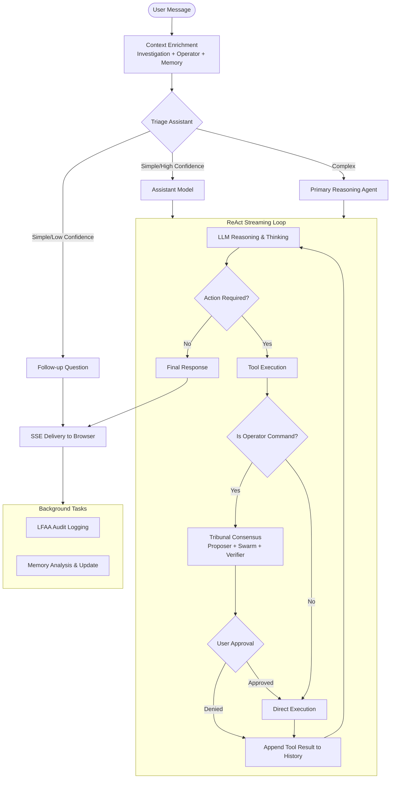
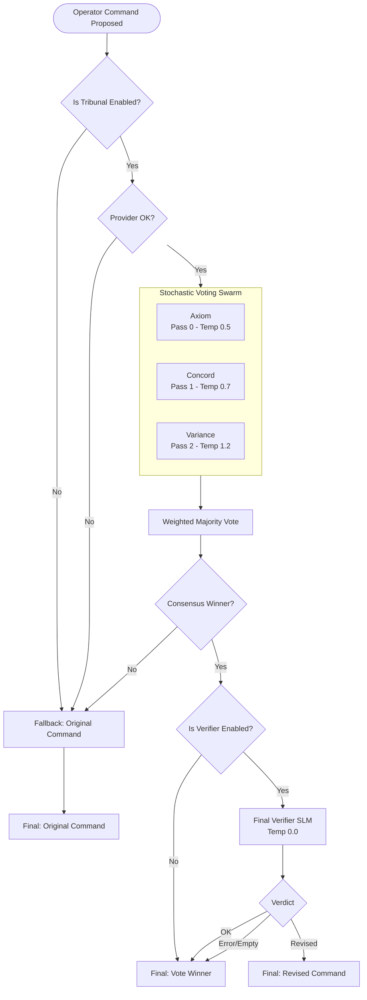
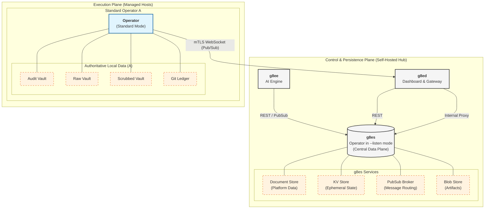

# g8e

**A self-hosted governance layer for AI agents.**

> Your AI is *gated.*
> **8 principles. 3 letters. 1 gate between AI and execution.**

## About g8e

**Premise:** Never trust AI. AI can be wrong. AI can be adversarial. Every architectural decision in this platform starts from that assumption.

g8e is a self-hosted governance layer for AI agents. Nothing executes on your infrastructure without your explicit approval. Source available, model agnostic, one binary.

**Key highlights from the [About Page](docs/architecture/about.md):**
- **4MB Ghost Binary:** A dependency-free, ephemeral execution agent.
- **Backend Backbone:** The Operator itself runs the entire platform data plane (SQLite, KV cache, pub/sub).
- **Zero-Trust Stealth:** Outbound-only connectivity with zero listening ports.
- **Human-in-the-Loop:** Securely executes human intent with mandatory approval for every action.

Read more about the [Origins, Governance, and Philosophy](docs/architecture/about.md).

---

## Quick Start

**Prerequisites:** Docker 24+, docker compose v2

```bash
git clone https://github.com/g8e-ai/g8e.git && cd g8e && ./g8e platform setup
```

### Access
1. Open `https://127.0.0.1` (or `https://<server-ip>`) in your browser.
2. **Trust the platform CA certificate (Mandatory).**
3. Continue to the secure setup page.

*Trust CA via terminal:* `./g8e security certs trust`

---

## Core Components

g8e is a security-first, self-hosted platform for AI-augmented infrastructure operations.

1.  **The Operator (g8eo):** A ~4MB static Go binary. No installation, no inbound ports. Runs locally as the invoking user; raw output stays in encrypted local vaults.
2.  **The Engine (g8ee):** Python agent orchestrating investigations and LLM interactions. Multi-agent consensus ensures command safety.
3.  **The Dashboard (g8ed):** Central management console. Passkey-only (FIDO2) auth, mTLS gateway, and human-in-the-loop approval interface.

See [docs/architecture/about.md](docs/architecture/about.md) for philosophy, governance, and origins.

---

## Architecture



### Tribunal Refinement Pipeline



| Service | Container | Language | Role |
|---------|-----------|----------|------|
| **g8es** | `g8es` | Go | Persistence (SQLite), KV store, pub/sub broker |
| **g8ee** | `g8ee` | Python | AI engine, LLM orchestration, tool calling |
| **g8ed** | `g8ed` | Node.js | Web UI, auth, mTLS gateway, TLS termination |
| **g8ep** | `g8ep` | Multi | CLI runner, Operator build, SSL management |
| **Operator** | *(runs on target)* | Go | Execution agent on managed systems |

Detailed documentation in [docs/architecture/](docs/architecture/) and [docs/components/](docs/components/).

---

## Data Plane Architecture

The Operator is the central data plane for the entire platform. In `--listen` mode (g8es), it provides the persistence and messaging backbone for g8ee and g8ed. On managed hosts, the Operator (Standard mode) maintains the authoritative system of record for all local operations.



---

## The GATE-8

**G**overnanc**e** Architecture for Trustless **E**nvironments

1. **Human authority** — AI proposes, you decide, nothing executes without your explicit approval. Human judgment is the security model.
2. **Earned authority** — Standing trust is a liability. Trust is scoped to sessions, earned per-action, and never self-granted. No component can escalate its own privileges — execution and authorization are separated by design.
3. **Layered enforcement** — No single control is relied upon. Governance is enforced at every boundary — Sentinel, Tribunal, approval, audit — so a failure at one layer doesn't compromise the others.
4. **Source available** — Security through obscurity is false security. The enforcement logic, threat detection, approval mechanisms, and encryption are readable, auditable, and criticizable by anyone. You don't take our word for it — you read the code.
5. **Local-first audit** — An append-only, encrypted audit trail is maintained at the site of execution. Accountability lives where the action happened, not in the cloud.
6. **Data sovereignty** — Sensitive data is scrubbed before AI sees it. Raw output never leaves the operator. Only sanitized context crosses component boundaries.
7. **Minimal footprint** — Outbound-only. No root required. No dependencies. No install. A single process — kill it and it's gone. What stays behind is the audit trail, by design.
8. **Universal runtime** — Any model, any provider, any OS. The platform has no opinion about your AI, your infrastructure, or your architecture. Governance is the constant; everything else is your choice.

---

## Won't / Will

**Won't:**
- Prioritize shipping capability over maintaining human control
- Ship autonomous execution without robust approval mechanisms
- Build for workforce elimination
- Compromise on governance to move faster
- Store raw operational data in the cloud
- Allow the AI to chain tool calls through auto-approve

**Will:**
- Run on your hardware, with your LLM, under your control
- Surface every action for informed human decision-making
- Keep the source available and auditable by anyone
- Scrub sensitive data before it ever reaches an LLM
- Trace every execution back to a deliberate human act
- Kill with a single keystroke — it's a process, not a dependency

---

## Security & Governance

Human agency is a first-class architectural property. Every enforcement mechanism ensures that the platform remains fully in service of your intent.

- **Human-in-the-Loop:** Mandatory approval for all state-changing operations. No autonomous execution.
- **Passkey Auth:** FIDO2/WebAuthn only; no passwords.
- **Sentinel Security:** 50+ threat detectors block dangerous commands; 20+ scrubbing patterns protect PII/secrets.
- **Data Sovereignty:** Raw output is stored in local encrypted vaults, never transmitted to the platform or cloud.
- **Zero-Trust:** mTLS for all Operator and service communication.

Read the [Security Architecture](docs/architecture/security.md) for more details.

---

## CLI Reference

Everything is managed through `./g8e`. Run `./g8e --help` for full reference.

### Platform Management
```bash
./g8e platform setup    # Full first-time setup (no-cache build, start platform)
./g8e platform rebuild  # Rebuild with layer cache and restart
./g8e platform up       # Start existing platform
./g8e platform down     # Stop all containers
./g8e platform wipe     # Wipe data and restart fresh
```

### Operator Deployment
```bash
./g8e operator build    # Rebuild Operator binary
./g8e operator g8e <user@host> --endpoint <ip>  # Deploy to remote host
```

### Tests & Diagnostics
```bash
./g8e test              # Run all component tests
./g8e security status   # Check TLS certificate status
```

Full CLI documentation: [docs/architecture/scripts.md](docs/architecture/scripts.md)

---

## Contributing

We welcome contributions to improve code quality, testing, and documentation.

- **Alpha Quality:** This is a research project. Do not run in production without thorough review.
- **Focus:** Fixing tech debt, improving test coverage, and clarifying documentation are high-value.

See [CONTRIBUTING.md](CONTRIBUTING.md) and [docs/developer.md](docs/developer.md).

---

## License

Licensed under the [Apache License, Version 2.0](LICENSE).

---

**[Website](https://g8e.ai)** | **[Docs](docs/index.md)** | **[Security](SECURITY.md)**
