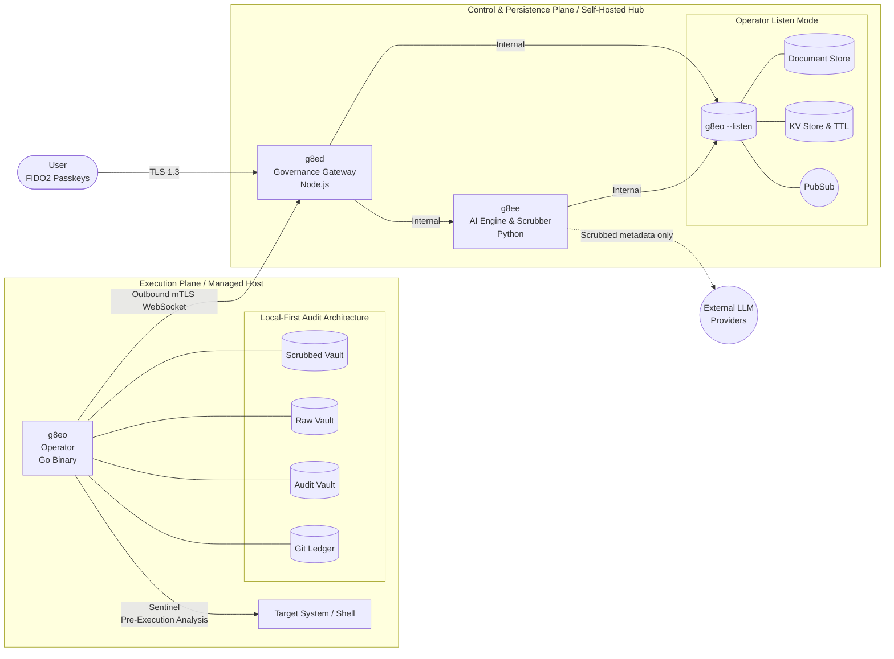

<div align="center">

# g8e

**AI-powered, human-driven infrastructure.**

governance architecture for trustless environments

[Position Paper](docs/architecture/position_paper.md) · [Architecture](docs/architecture/about.md) · [Protocol](docs/architecture/protocol.md) · [Security](docs/architecture/security.md) · [Quick Start](#quick-start) · [Contributing](#contributing)

</div>

## What this is

g8e is an agentic AI platform built on mutual adversarial assumption. Every actor — Engine, Operator, User — assumes the others may be compromised and verifies accordingly. No trusted component, no privileged path, no implicit consent.

The architecture is a host-authoritative governance substrate: Byzantine consensus with an adversarial co-validator, sovereign execution on customer hardware, and chain-of-custody audit. Its bedrock is the protocol: a Protobuf-first `UniversalEnvelope` contract that binds typed operator payloads to canonical event names, state roots, operator/session context, and L1/L2/L3 governance metadata. BFT applied to the agentic stack.

Self-hosted. Air-gap capable. Apache 2.0. Built for environments where nominal oversight is a failure state and the owner must own the ledger.

### Core Principles

- **Data sovereignty.** The managed host is the authoritative system of record. Every mutation and command output is anchored to a local, git-backed ledger (LFAA) in native SQLite vaults — queryable with standard SQL, mapped to MITRE ATT&CK for SIEM/SOC integration. Raw data never leaves your infrastructure.

- **LLM sovereignty.** A stateless reasoning engine decouples intent from execution. Context is ephemeral per request; providers never retain session state. Swap between Anthropic, Gemini, OpenAI, Ollama, or llama.cpp without losing continuity.

- **Operator sovereignty.** The Operator is a protocol for verifiable execution, not just a binary. Sentinel pre-execution analysis (46 threat detectors), hardware fingerprint binding, outbound-only mTLS, and Protobuf-first command envelopes carrying governance evidence. Legacy or malformed command bytes are rejected rather than translated.

- **Consensus integrity.** The Tribunal generates candidates under tiered information gating — agents cannot see each other's reasoning or downstream plans. An adversarial co-validator (Nemesis) is scored on a proper scoring rule alongside the honest panel. All eight core agent personas (Axiom, Concord, Variance, Pragma, Nemesis, Sage, Auditor, Warden) stake reputation on every turn; malfeasance or incompetence triggers automated slashing across tiered severity bands. Collusion is structurally unprofitable.

## Why

The user's time is the only stake the system can't fake. Everything upstream of human approval exists to spend it well.

Two architectures dominate agentic AI in 2026, and both fail at infrastructure scale.

**Autonomous agents** act without verifying contextual intent. They do exactly what they understood the request to mean while missing what the user actually meant. Every catastrophic agent failure has the same shape.

**Human-in-the-loop systems** retrofit oversight through approval prompts. When verification is costly and approval is cheap, humans rubber-stamp — autonomous behavior with the appearance of control.

Both treat the actors in the system as trustworthy by default and bolt verification on top. g8e inverts that: every actor assumes the others may be compromised and verifies accordingly.

The machine handles what is machine-checkable — consistency, grounding, falsifiability. The human handles what is only human-checkable — intent fidelity, contextual stakes, acceptance of consequences. Both signatures are required for every state change. Neither is trusted on its face.

Full treatment: [position paper](docs/architecture/position_paper.md).

## How a request flows


1. **Triage** classifies the request. Trivial questions go to **Dash** (fast-path responder). Anything that may state-change is enriched with operator context and routed to **Sage**.
2. **Sage** writes an intent document — goals, constraints, success criteria — and hands it to the Tribunal.
3. **The Tribunal** is five blind validators (Axiom, Concord, Variance, Pragma, Nemesis), each generating a candidate command independently with no visibility into the others. A winner requires ≥2 of 5 supporting votes. If consensus fails or a tie is unresolved by deterministic laddering (Shortest → Non-Nemesis), an anonymized peer-review round runs. If Round 2 also fails to reach consensus, a circuit breaker error is triggered and surfaced back to Sage.
4. **Warden** (running on the Engine) performs a pre-execution risk assessment. It coordinates specialized sub-agents (`warden_command_risk`, `warden_file_risk`, `warden_error`) to validate the command safety profile for blast radius, destructive idioms, and risk. The **Nemesis** actively tries to trick the Warden into allowing flawed commands.
5. **The Auditor** performs the final consistency check and Merkle commitment once the Warden has cleared the command. The Auditor is the only persona that cannot be tricked by the Nemesis; if a Nemesis command passes the Warden, the Auditor identifies the "attack," awards the Nemesis, but rejects the command.
6. **Proof of Human Presence (PHP)**: You review the command and risk assessment via the Governance Gateway and provide a hardware-bound signature using a FIDO2 passkey. When the flow is auto-approved, that is Layer 3 authorization state only; it never bypasses Layer 1 or Layer 2.
7. **The Operator** receives a serialized `UniversalEnvelope` over the pub/sub WebSocket path, rejects non-envelope command bytes, enforces reflected L1 forbidden-pattern rules, verifies the L2 Tribunal signature when configured, checks the state root when present, runs the typed payload in an isolated process group, captures the result into the local audit vault, and snapshots state into a git-backed ledger.
8. **Codex** (async) extracts durable user preferences and scrubbed investigation summaries from the conversation history to build long-term memory.

The point of steps 1–5 is to minimize what reaches step 6. Your time is the only stake the system can't fake; everything upstream exists to spend it well.

---

## Protocol Foundation

The protocol is the foundation layer of g8e. UI flows, agent workflows, and storage services can evolve, but operator command/result traffic is governed by a single wire contract:

```text
typed operator.proto payload
  -> UniversalEnvelope.payload
  -> serialized UniversalEnvelope bytes
  -> operator pub/sub data
```

Protocol-level enforcement is deliberately fail-closed:

- **No legacy fallback** — operator command paths use serialized `UniversalEnvelope` bytes. JSON command payloads are rejected rather than migrated.
- **Typed payload binding** — `event_type` selects the `operator.proto` payload type. Recognized request events are decoded before dispatch; unknown event types do not dispatch.
- **Layer 1 bedrock** — hard technical gates are represented in protocol metadata and enforced at the Operator boundary through reflected `forbidden_patterns` options on typed Protobuf fields.
- **Layer 2 commitment** — command envelopes carry `governance.l2.tribunal_signature`, an HMAC over `event_type || "\n" || payload_bytes`; `g8eo` rejects missing or invalid signatures when L2 verification is configured.
- **Layer 3 authorization state** — `governance.l3` carries human-signature or auto-approval evidence from the Governance Gateway. Auto-approval is L3 state only and never bypasses L1 or L2.
- **State freshness** — `state_merkle_root` binds a command to the fleet state observed at generation time; mismatches are rejected when the Operator has a comparable local root.

Full contract: [protocol.md](docs/architecture/protocol.md).

---

## Architecture



| Component | Stack | Role |
|---|---|---|
| **g8eo** | Go (~4MB static) | The Operator. Runs on managed hosts, executes commands, owns the audit ledger, and provides listen-mode persistence/pub/sub. |
| **g8ee** | Python / FastAPI | The Engine. Multi-provider LLM abstraction. Tribunal, Auditor, Warden. |
| **g8ed** | Node.js | The Dashboard. Governance Gateway: FIDO2 auth, mTLS broker, ledger synchronization. |

User to `g8ed` over TLS 1.3 with encrypted cookies. Operator to Gateway via outbound-only mTLS WebSocket. No inbound ports on managed hosts. Every connection is mutually authenticated; state-changing workflows pass through the L1/L2/L3 governance hierarchy, with hardware-bound passkey authorization as the default Layer 3 path.

---

## The Tribunal

Five LLM personas generate candidate commands in parallel, blind to each other:

| Persona | Lens | Pressure |
|---|---|---|
| **Axiom** | Composition | Clean multi-stage pipelines, resource efficiency |
| **Concord** | Safety | Defensive flags, read-only discipline |
| **Variance** | Edge cases | Locales, spaces, nulls, boundary conditions |
| **Pragma** | Convention | Idiomatic, OS-specific, least-surprise |
| **Nemesis** | Calibrated adversary | Tries to trick the Warden with flawed-but-plausible commands to stress the system. |

A winner requires ≥2 of 5 supporting votes (Plurality Consensus). If consensus is not reached, or if a tie cannot be resolved by deterministic laddering (Shortest → Non-Nemesis), anonymized peer review runs and members may converge or hold. If the tie remains unresolved after Round 2, a circuit breaker halts the loop and surfaces the deadlock to Sage.

**The Information Isolation Principle** is the load-bearing safety property: each agent operates in a sealed information environment, believing it is playing a smaller game than it actually is. Triage doesn't know Sage exists. Sage doesn't know the Tribunal exists. The Tribunal doesn't know one of its members is Nemesis or that the Auditor has cross-conversation memory. Only the Auditor has full visibility, and the Auditor is bonded most heavily and peer-reviewed.

The quarantine eliminates collusion strategies that would otherwise be profitable. Collapse any layer and a deviation strategy opens up. It is not a UX choice; it is the safety mechanism.

Reputation staking, slashing tiers, and the full mechanism design: [governance.md](docs/architecture/governance.md).

---

## The Operator

The **Operator** is a 4MB sovereign "Satellite Agent" designed for global-scale fleet management. It delivers remote execution anywhere in the world using only an outbound connection, managing hundreds or thousands of devices within a single conversation context. A single command installs it on any host:

```bash
curl -fsSL http://<hub>/g8e | sh -s -- <device-link-token>
```

What happens on every state change:

1. **Context Injection**: Bundles a signed snapshot of host state (OS, shell, hardware, history) into the reasoning loop.
2. **Receives** the typed `UniversalEnvelope` command via outbound mTLS WebSocket.
3. **Pre-screens** with the Sentinel — 46 MITRE ATT&CK detectors, 28 scrubbing patterns.
4. **Executes** in an isolated process group with closed stdin.
5. **Captures** output into a Raw Vault (host-only) and a Scrubbed Vault (AI-accessible).
6. **Snapshots** state into a local git-backed ledger for immutable audit.

System fingerprint binding ties the Operator's mTLS cert to the host it was issued on. A stolen API key is useless from a different machine.

---

## Security

- **Auth** — Proof of Human Presence (PHP) via FIDO2 / WebAuthn passkeys. Hardware-bound approval is the default Layer 3 state for mutations; auto-approval is restricted to benign commands that already passed L1 and L2. Passwords are unsupported by design.
- **Transport** — TLS 1.3. Platform-generated ECDSA P-384 CA. Per-Operator mTLS client certs issued at claim time.
- **Sentinel** — On-host defensive analysis: 46 MITRE-mapped detectors, 28 scrubbing patterns, and command allowlist/denylist enforcement.
- **Warden** — Engine-side defensive coordination: command/error/file risk classifiers applied before human approval.
- **Sessions** — Encrypted cookies, idle and absolute timeouts, IP tracking, timestamp + nonce replay protection.
- **Sovereignty** — Raw command output never leaves the host. Only Sentinel-scrubbed metadata reaches model providers. Engine outage does not erase history.
- **Compliance alignment** — NSA Zero Trust (exceeds requirements in 6 of 7 pillars), HIPAA-ready, FedRAMP-aligned controls.

Threat model and full control catalogue: [security.md](docs/architecture/security.md).

---

## Quick Start

Prerequisites: Go, Node.js/npm, Python, and curl available on the host.

```bash
git clone https://github.com/g8e-ai/g8e.git && cd g8e
./g8e platform start
```

Trust the platform CA on your workstation:

```bash
# macOS / Linux
curl -fsSL http://<host>/trust | sudo sh

# Windows (elevated PowerShell)
irm http://<host>/trust | iex
```

**Hostname Usage:**
- If g8e is running on your local workstation: use `localhost`
- If g8e is running on a remote system: use `g8e.local` (add to /etc/hosts pointing to the server IP)

Open `https://<host>`, register a passkey, generate a device-link token, then on any host you want to manage:

```bash
curl -fsSL http://<host>/g8e | sh -s -- <device-link-token>
```

### CLI

```bash
./g8e platform start       # Start all platform components
./g8e platform status      # Show component health and versions
./g8e platform restart     # Restart all platform components
./g8e platform stop        # Stop all platform components
./g8e platform wipe        # Wipe app data, preserve platform settings and SSL
./g8e platform reset       # Reset application data, preserve SSL
./g8e platform clean       # Remove all g8e processes and data

./g8e operator build       # Compile Operator for the current host architecture
./g8e operator build-all   # Compile Operator for all supported architectures
./g8e test <component>     # Run component tests (g8ee, g8ed, g8eo)
```

---

## Status

**Alpha.** No external audit yet. Read the [security architecture](docs/architecture/security.md) and judge the threat model for yourself before any production use.

A significant portion of this codebase was written with AI assistance. If you have been around long enough to know what that means, you already know there are bugs, hallucinated branches, and abstractions a human would have written differently. The platform was built to govern AI agents because the author lived the danger of unconstrained ones — while building this platform with those same agents.

---

## Contributing

The architecture is designed to support capabilities that don't exist yet. A good PR that improves any part of the platform gets merged.

- Bug fixes and real-world edge cases
- Security hardening and threat-model improvements
- New Operator capabilities and tool implementations
- LLM provider integrations and model-specific optimizations
- Documentation, testing, and developer experience
- Novel applications of the governance architecture

If you see something broken, fix it. If you see something missing, build it. If you have an idea nobody has built yet, open an issue.

See [CONTRIBUTING.md](CONTRIBUTING.md).

---

## Documentation

| Document | Description |
|---|---|
| [Position Paper](docs/architecture/position_paper.md) | The thesis: AI-Powered, Human-Driven Infrastructure |
| [Architecture](docs/architecture/about.md) | Origins, governance philosophy, core principles |
| [Protocol](docs/architecture/protocol.md) | Bedrock Protobuf `UniversalEnvelope` contract, typed operator payloads, and protocol-level governance enforcement |
| [Governance](docs/architecture/governance.md) | L1/L2/L3 validation hierarchy, Tribunal mechanics, and protocol binding |
| [Security](docs/architecture/security.md) | Authentication, Sentinel, LFAA, threat model |
| [AI Control Plane](docs/architecture/ai_control_plane.md) | ReAct loop, Tribunal, prompts, tools, providers |
| [Operator](docs/architecture/operator.md) | Lifecycle, modes, deployment, on-host storage |
| [Developer Guide](docs/developer.md) | Setup, code quality rules, project structure |
| [Testing Guide](docs/testing.md) | Test infrastructure, component guidelines, CI |
| [Glossary](docs/glossary.md) | Platform terminology |


---

## Engagements

For commercial engagements, partnerships, or short-term contracts: danny@g8e.ai

---

## License

[Apache License, Version 2.0](LICENSE).

---

<div align="center">

*g8e is built by [Lateralus Labs, LLC](https://lateraluslabs.com), a Certified Veteran-Owned Small Business.*

</div>