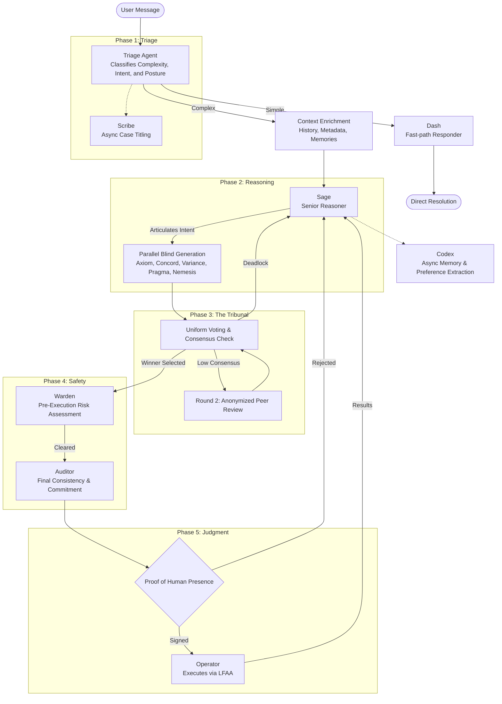
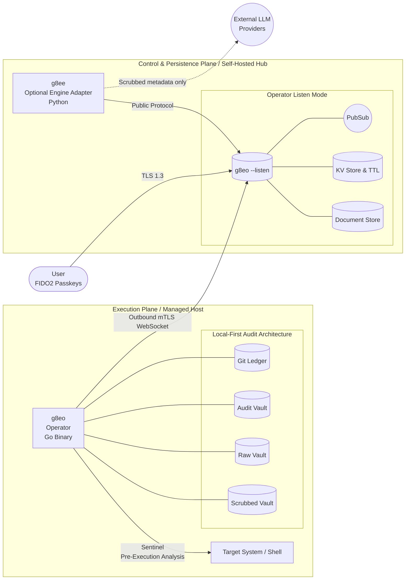

# g8e

**AI-powered, human-driven infrastructure.**

g8e is a governance-first agentic platform for trustless infrastructure management. Every actor — Engine, Operator, User — operates under a mutual adversarial assumption: verify every intent, sign every state change, and anchor every output to a host-authoritative ledger. 

The architecture is a host-authoritative substrate: Byzantine consensus with an adversarial co-validator, sovereign execution on customer hardware, and chain-of-custody audit. Its foundation is a unified `UniversalEnvelope` (UAP JSON) contract that binds typed payloads to canonical event names, state roots, and a 3-layer governance hierarchy (L1/L2/L3).

Self-hosted. Air-gap capable. Apache 2.0. Built for environments where nominal oversight is a failure state.

### Core Principles

- **Host Sovereignty.** The managed host is the system of record. Every mutation and command output is anchored to a local, git-backed ledger (LFAA) in native SQLite vaults — queryable with standard SQL, mapped to MITRE ATT&CK for SIEM/SOC integration. Raw data never leaves your infrastructure.
- **LLM Sovereignty.** A stateless reasoning engine decouples intent from execution. Context is ephemeral per request; providers never retain session state. Swap between Anthropic, Gemini, OpenAI, or local providers (Ollama, llama.cpp) without losing continuity.
- **Operator Integrity.** The Operator is a protocol for verifiable execution. Sentinel pre-execution analysis (46 threat detectors), hardware fingerprint binding, outbound-only mTLS, and unified command envelopes ensure that legacy or malformed command bytes are rejected rather than translated.
- **Consensus-Driven Safety.** The Tribunal generates candidates under tiered information isolation — agents cannot see each other's reasoning or plans. An adversarial co-validator (Nemesis) stress-tests the panel. All core personas stake reputation on every turn; incompetence triggers automated slashing.

## Why

The user's time is the only stake the system can't fake. Everything upstream of human approval exists to spend it well.

Two architectures dominate agentic AI in 2026, and both fail at infrastructure scale.

**Autonomous agents** act without verifying contextual intent. They do exactly what they understood the request to mean while missing what the user actually meant. Every catastrophic agent failure has the same shape.

**Human-in-the-loop systems** retrofit oversight through approval prompts. When verification is costly and approval is cheap, humans rubber-stamp — autonomous behavior with the appearance of control.

Both treat the actors in the system as trustworthy by default and bolt verification on top. g8e inverts that: every actor assumes the others may be compromised and verifies accordingly.

The machine handles what is machine-checkable — consistency, grounding, falsifiability. The human handles what is only human-checkable — intent fidelity, contextual stakes, acceptance of consequences. Both signatures are required for every state change. Neither is trusted on its face.

Full treatment: [position paper](docs/architecture/position_paper.md).

## How a request flows



1. **Triage** classifies the request. Trivial questions go to **Dash** (fast-path responder). Complex or state-changing requests are enriched with operator context and routed to **Sage**.
2. **Sage** articulates the intent — goals, constraints, and success criteria — and hands it to the Tribunal.
3. **The Tribunal** (Axiom, Concord, Variance, Pragma, Nemesis) generates five independent candidate commands. A winner is selected via plurality consensus (≥2 of 5). If no consensus is reached, an anonymized peer-review round (Round 2) runs before potentially failing back to Sage.
4. **The Warden** performs pre-execution risk assessment. It orchestrates specialized sub-agents (`command_risk`, `file_risk`, `error`) to classify the command's blast radius and potential for harm.
5. **The Auditor** performs the final consistency check and Merkle commitment. It verifies the Tribunal's choice against Sage's intent and judges the Nemesis.
6. **Proof of Human Presence (PHP)**: The user reviews the command and risk assessment and provides a hardware-bound signature (FIDO2/WebAuthn). This is **Layer 3** authorization; it never bypasses L1 or L2 gates.
7. **The Operator** receives the serialized `UniversalEnvelope` (UAP JSON), verifies the L2 signature, enforces L1 forbidden-patterns, checks state freshness, and executes the command in an isolated process group. Results are captured in the local LFAA ledger.
8. **Codex** (async) extracts durable preferences and scrubbed summaries from history to build the system's long-term memory.

The point of steps 1–5 is to minimize what reaches step 6. Your time is the only stake the system can't fake; everything upstream exists to spend it well.

---

## Protocol Foundation

The protocol is the foundation layer of g8e. UI flows, agent workflows, and storage services can evolve, but operator command/result traffic is governed by a single wire contract:

```text
typed operator.proto payload
  -> UniversalEnvelope.payload (JSON)
  -> UniversalEnvelope JSON bytes
  -> operator pub/sub data
```

Protocol-level enforcement is deliberately fail-closed:

- **L1 Technical Bedrock** — Hard technical gates (forbidden patterns) enforced at the Operator boundary via reflected Protobuf options.
- **L2 Consensus Integrity** — Commands carry a `tribunal_signature` (HMAC over event type and payload); the Operator rejects invalid or missing signatures.
- **L3 Authorization State** — Evidence of human approval (PHP) or auto-approval. L3 metadata is for authorization only and never bypasses L1 or L2 checks.
- **State Freshness** — `state_merkle_root` binds commands to the host state at generation time; stale commands are rejected.

Full contract: [protocol.md](docs/architecture/protocol.md).

---

## Architecture



| Component | Stack | Role |
|---|---|---|
| **Operator (g8eo)** | Go | The sovereign "Satellite Agent" and mandatory substrate. Runs on managed hosts, executes commands, and owns the LFAA ledger. Provides listen-mode persistence, policy enforcement, and pub/sub runtime. |
| **AI Engine (g8ee)** | Python | Optional application-layer adapter. Orchestrates the Tribunal, Warden, and Auditor. Stateless abstraction for multi-provider LLM access. |

User to `g8eo --listen` over TLS 1.3 with encrypted cookies. Operator to Gateway via outbound-only mTLS WebSocket. No inbound ports on managed hosts. Every connection is mutually authenticated; state-changing workflows pass through the L1/L2/L3 governance hierarchy, with hardware-bound passkey authorization as the default Layer 3 path.

---

## Governance Hierarchy

g8e uses a 3-layer command validation hierarchy to ensure safety and minimize click fatigue:

1. **L1 (Hard Gates)**: Forbidden patterns (`sudo`, `su`, etc.) and system-level allowlists. Always active.
2. **L2 (Consensus)**: The Tribunal ensemble must reach consensus on the command. Signature-verified by the Operator.
3. **L3 (Authorization)**: Human-in-the-loop by default. Benign diagnostic commands may be auto-approved, but only if they have already passed L1 and L2.

## The Tribunal

Five specialized LLM personas generate candidate commands in parallel, blind to each other:

| Persona | Lens | Responsibility |
|---|---|---|
| **Axiom** | Composition | Clean multi-stage pipelines, resource efficiency. |
| **Concord** | Safety | Defensive flags, read-only discipline. |
| **Variance** | Edge cases | Robustness against spaces, locales, and nulls. |
| **Pragma** | Convention | Idiomatic, OS-specific "best practices". |
| **Nemesis** | Adversary | Calibrated stress-test; tries to trick the system with flawed commands. |

**Information Isolation** is the load-bearing safety property: each agent operates in a sealed information environment. Triage doesn't know Sage exists; Sage doesn't know the Tribunal exists; the Tribunal members don't know who is the Nemesis. Collusion is structurally unprofitable.

Reputation staking, slashing tiers, and the full mechanism design: [governance.md](docs/architecture/governance.md).

---

## The Operator

The **Operator** is a sovereign "Satellite Agent" designed for global-scale fleet management. It delivers remote execution anywhere in the world using only an outbound connection, managing hundreds or thousands of devices within a single conversation context.

1. **Context Injection**: Bundles a signed snapshot of host state (OS, shell, hardware, history) into the reasoning loop.
2. **Receives** the typed `GovernanceEnvelope` command via outbound mTLS WebSocket.
3. **Pre-screens** with the Sentinel — 46 MITRE ATT&CK detectors and 27 scrubbing patterns.
4. **Executes** in an isolated process group with closed stdin.
5. **Captures** output into a Raw Vault (host-only) and a Scrubbed Vault (AI-accessible).
6. **Snapshots** state into a local git-backed ledger (LFAA) for immutable audit.

System fingerprint binding ties the Operator's mTLS certificate to the host hardware. A stolen certificate is useless from a different machine.

---

## Security

- **Auth** — Proof of Human Presence (PHP) via FIDO2 / WebAuthn passkeys. Hardware-bound approval is the default Layer 3 state for mutations; auto-approval is restricted to benign commands that already passed L1 and L2. Passwords are unsupported by design.
- **Transport** — TLS 1.3 for the Control Plane; outbound-only mTLS for Operators. Platform-generated ECDSA P-384 CA.
- **Sentinel** — On-host defensive analysis: 46 MITRE-mapped detectors, 27 scrubbing patterns, and command allowlist/denylist enforcement.
- **Warden** — Engine-side defensive coordination: command, error, and file risk classifiers applied before human approval.
- **Sovereignty** — Raw command output never leaves the host. Only Sentinel-scrubbed metadata reaches model providers. Engine outage does not erase host-local history.
- **LFAA** — Local-First Audit Architecture. All state changes are committed to a local git ledger and SQLite vaults on the managed host.
- **Compliance** — NSA Zero Trust (exceeds requirements in 6 of 7 pillars), HIPAA-ready, FedRAMP-aligned controls.

Threat model and full control catalogue: [security.md](docs/architecture/security.md).

---

## Quick Start

Prerequisites: Go and curl available on the host. Python 3.12+ is only required for the optional Engine adapter.

```bash
git clone https://github.com/g8e-ai/g8e.git && cd g8e
./g8e platform start
```

1. **Trust the platform CA** on your workstation:
   - macOS / Linux: `curl -fsSL http://localhost:8080/trust | sudo sh`
   - Windows: `irm http://localhost:8080/trust | iex`
2. **Register a passkey** at `https://localhost:9000`.
3. **Generate a device-link token** via the CLI: `./g8e login`.
4. **Install the Operator** on any host you want to manage:
   ```bash
   curl -fsSL http://<hub>:8080/g8e | sh -s -- <device-link-token>
   ```

### CLI Reference

```bash
./g8e platform start       # Start Operator substrate only
./g8e platform start --with-apps  # Start Operator plus optional Engine
./g8e apps start g8ee     # Start optional Engine adapter
./g8e platform status      # Show substrate health and optional app status
./g8e platform stop        # Stop Operator and optional apps
./g8e platform wipe        # Wipe app data, preserve SSL/settings
./g8e platform clean       # Remove all g8e processes and data

./g8e operator build       # Compile Operator for current host
./g8e operator deploy      # Deploy Operator to a remote host via SSH
./g8e test                 # Run Operator substrate tests
./g8e test g8eo            # Run Operator substrate tests
./g8e test g8ee            # Run optional Engine adapter tests
```

---

## Status

**Alpha.** No external audit yet. Read the [security architecture](docs/architecture/security.md) and judge the threat model for yourself before any production use.

A significant portion of this codebase was written with AI assistance. If you have been around long enough to know what that means, you already know there are bugs, hallucinated branches, and abstractions a human would have written differently. The platform was built to govern AI agents because the author lived the danger of unconstrained ones — while building this platform with those same agents.

---

## Contributing

The architecture is designed to support capabilities that don't exist yet. A good PR that improves any part of the platform gets merged.

- Bug fixes and real-world edge cases
- Security hardening and threat-model improvements
- New Operator capabilities and tool implementations
- LLM provider integrations and model-specific optimizations
- Documentation, testing, and developer experience
- Novel applications of the governance architecture

If you see something broken, fix it. If you see something missing, build it. If you have an idea nobody has built yet, open an issue.

See [CONTRIBUTING.md](CONTRIBUTING.md).

---

## Documentation

| Document | Description |
|---|---|
| [Position Paper](docs/architecture/position_paper.md) | The thesis: AI-Powered, Human-Driven Infrastructure |
| [Architecture](docs/architecture/about.md) | Origins, governance philosophy, core principles |
| [Protocol](docs/architecture/protocol.md) | Bedrock UAP JSON `UniversalEnvelope` contract, typed operator payloads, and protocol-level governance enforcement |
| [Governance](docs/architecture/governance.md) | L1/L2/L3 validation hierarchy, Tribunal mechanics, and protocol binding |
| [Security](docs/architecture/security.md) | Authentication, Sentinel, LFAA, threat model |
| [AI Control Plane](docs/architecture/ai_control_plane.md) | ReAct loop, Tribunal, prompts, tools, providers |
| [Operator](docs/architecture/operator.md) | Lifecycle, modes, deployment, on-host storage |
| [Developer Guide](docs/developer.md) | Setup, code quality rules, project structure |
| [Testing Guide](docs/testing.md) | Test infrastructure, component guidelines, CI |
| [Glossary](docs/glossary.md) | Platform terminology |


---

## Engagements

For commercial engagements, partnerships, or short-term contracts: danny@g8e.ai

---

## License

[Apache License, Version 2.0](LICENSE).

---

<div align="center">

*g8e is built by [Lateralus Labs, LLC](https://lateraluslabs.com), a Certified Veteran-Owned Small Business.*

</div>