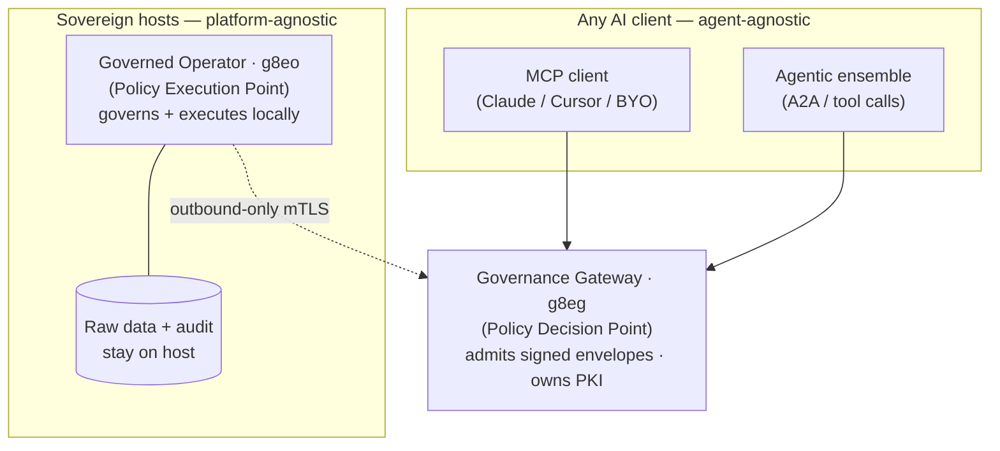

<div align="left">

# g8e

**Verify, then execute.**

g8e is a ~20MB, zero-dependency binary that provides agentic governance and state-mutation control. It functions as both the **control plane** (host-local policy decision) and the **data plane** (exclusive mutation executor). 

It dials out via mTLS and listens on nothing. Every AI-proposed action clears a fail-closed gauntlet on the host and is committed to a git-backed ledger before execution. Only scrubbed projections leave the host; raw data never crosses the wire.


[](LICENSE)
[](https://go.dev)
[](#status-v100--core-substrate)
[](docs/core/position_paper.md)

[Getting Started](docs/guides/getting_started.md) · [The two roles](#the-two-roles) · [Mental Model](#the-mental-model) · [Protocol](#the-protocol-invariants) · [Docs](#documentation)

</div>

---

## QuickStart

Get g8e online in under 60 seconds.

```bash
# 1. Start the Governance Gateway (g8eg)
./g8e platform start

# 2. Initialize the first user and certificates
./g8e auth bootstrap

# 3. Verify the status
./g8e platform status
```

See the [Full QuickStart Guide](docs/guides/getting_started.md) for mTLS, enrollment, and CLI configuration.

---

## The two roles

g8e is one binary. Run it in Gateway mode or Operator mode — same artifact, copied wherever it's needed. Everything else is detail.

- **As the Gateway (g8eg)**, it's the meeting point. Your agents and clients submit signed work here. It issues the identity everything else authenticates against, enforces freshness and replay defense, scopes sessions, and keeps the network-side record. And it's deliberately powerless where it counts: it can't reach into a host, can't open a connection to an Operator, and can't decide what's safe to run on a machine it isn't sitting on. It admits work and hands it out. It does not execute, and its say-so is not final.
- **As the Operator (g8eo)**, it's the authority. Run on the host, it dials out to the Gateway, pulls down signed work, and makes up its own mind — re-verifying every proof against its own local state and trusting nothing upstream, the Gateway included. It's the only thing on that box allowed to change state, the only place raw data ever lives, and the local, git-backed record of everything that happened. Decision and execution, both on the host, in one binary.

**The split is the entire point**: the Gateway proposes, the Operator disposes. A compromised Gateway can lie about what to run; it can't make a host run it. The binding go/no-go always happens on the machine that owns the consequences — locally, against local state, recorded before the side effect. There is no trusted middle to compromise, because nothing in the middle has the final word.

---

## The mental model

g8e follows standard MCP topology with integrated BFT governance.


```mermaid
graph TD
    subgraph Clients ["Any AI client — agent-agnostic"]
        C1["MCP client<br/>(Claude / Cursor / BYO)"]
        C2["Agentic ensemble<br/>(A2A / tool calls)"]
    end

    GW["Governance Gateway · g8eg<br/>(Policy Decision Point)<br/>admits signed envelopes · owns PKI"]

    subgraph Fleet ["Sovereign hosts — platform-agnostic"]
        O1["Governed Operator · g8eo<br/>(Policy Execution Point)<br/>governs + executes locally"]
        D1[("Raw data + audit<br/>stay on host")]
        O1 --- D1
    end

    C1 --> GW
    C2 --> GW
    O1 -. "outbound-only mTLS" .-> GW
```

---

## Governance Layers

Every mutation passes through sequential verification layers at the Operator boundary. Failed transactions are rejected and audited immediately.

| Layer | Name | Mechanism | What it proves |
| :---: | --- | --- | --- |
| **L1** | **Doctrine** | Forbidden patterns + MITRE heuristics | No hard gate violations (privesc, destruction). |
| **L2** | **Consensus** | Ed25519 k-of-n over transaction hash | Independent model ensemble co-signed intent. |
| **L3** | **Notary** | WebAuthn / mTLS cert fingerprint | Human authorized *this exact* transaction hash. |
| **L4** | **Warden** | Fail-closed pre-dispatch gate | Hash, freshness, state root, and signer trust. |
| **L5** | **Actuator** | Atomic dispatch + signed receipt | The only code path allowed to mutate the host. |

---

## The Protocol Invariants

- **GovernanceEnvelope**: The single canonical container for every mutation.
- **Hash-based Integrity**: `id == SHA-256(canonical_fields)`. Wire format is canonical JSON (protojson).
- **Zero Ambient Context**: Session IDs and identity are body-embedded; no implicit authority.
- **Outbound-Only mTLS**: Operators dial out; zero inbound ports required on the host.
- **Sovereignty Boundary**: Automated scrubbing/rehydration ensures raw data never leaves the host.
- **No Backward Compatibility**: Rip and replace. Stale formats or unsigned inputs are rejected.

---

## Status: v1.0.0 — Core Substrate

g8e is the mandatory governance substrate. The Engine (g8ee) and Dashboard (g8ed) are optional application-layer adapters.

**Operational Today**
- **Universal Protocol Translation**: Intercept MCP/A2A tool calls into signed envelopes.
- **BFT Governance**: Fail-closed L1/L2/L4 verification paths.
- **Sovereign Execution**: Git-backed ledger and host-local audit vault.
- **mTLS Reverse Tunnels**: Secure connectivity for firewalled/air-gapped hosts.
- **Data Sovereignty**: Automated PII scrubbing and local forensic persistence.

**In Development**
- **L3 Notary**: Hardware-bound WebAuthn/FIDO2 support.
- **RBAC**: Granular role-based access control.
- **Complex Policy**: Dynamic intent allowlisting and advanced L1 heuristics.
- **Multi-tenancy**: Organization partitioning and tenant isolation.

---

## Documentation

- **[Getting Started](docs/guides/getting_started.md)** · **[Position Paper](docs/core/position_paper.md)**
- **[Protocol](docs/architecture/protocol.md)** · **[Operator (g8eo)](docs/architecture/operator.md)** · **[Gateway (g8eg)](docs/architecture/gateway.md)**
- **[Guides](docs/guides/)** · **[Reference](docs/reference/)** · **[Contributing](CONTRIBUTING.md)**

---

## License

Apache 2.0. See [LICENSE](LICENSE). Built by [Lateralus Labs](https://lateraluslabs.com).
