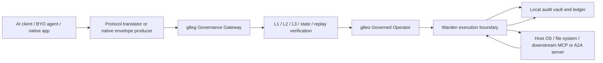

# g8e

Zero-trust execution substrate for agentic infrastructure.

g8e gives AI systems a governed way to touch real machines. It treats every state-changing action as a typed, signed, state-bound transaction, forces that transaction through independent verification, and executes only at a sovereign host boundary.

The core contract is the `GovernanceEnvelope`, serialized as canonical JSON (protojson), carrying:

- **Typed intent** - a protobuf action payload, encoded inside the envelope, with no untyped execution fallback.
- **L1 technical evidence** - deterministic hard gates, reflected forbidden-pattern checks, allow/deny policy, and Sentinel threat analysis.
- **L2 consensus evidence** - a cryptographic proof that an independent producer, typically a heterogeneous Tribunal, co-validated the intent.
- **L3 authorization evidence** - WebAuthn/FIDO2 proof of human presence for mutations, or explicit policy for benign auto-approved verbs after L1 and L2 pass.
- **State binding** - nonce, expiry, transaction hash, and Merkle state root, so stale or replayed instructions are rejected before dispatch.
- **Receipt binding** - Warden-signed `ActionReceipt`s, anchored to host-local audit state before and after execution.

MCP, A2A, OpenAI tool calls, LangChain tools, and future agent protocols are payload formats. g8e is the execution governance envelope around those payloads.

---

## Why this exists

Agentic systems are moving from content generation into infrastructure mutation. The risk profile changes immediately:

- **Model output is probabilistic** - a single autoregressive loop can preserve and compound a false premise across an entire action chain.
- **Provider dependence is a supply-chain risk** - a poisoned, degraded, unavailable, or policy-shifted model provider can become a control-plane failure.
- **Tool protocols standardize capability** - they rarely provide host-state binding, replay protection, BFT consensus, local audit authority, or hardware-bound human proof.
- **Human approval fatigue is predictable** - a confirmation dialog without machine-verifiable context moves liability to the operator without reducing blast radius.
- **SaaS control planes centralize sensitive state** - raw logs, credentials, file diffs, and forensic context should remain under host and customer control.

g8e makes host execution a verification problem governed by protocol invariants.

---

## Platform shape

g8e is built around a small number of strict roles:

- **Protocol substrate** - the public wire contract, schemas, transaction rules, and L1/L2/L3 verification model.
- **Governance Gateway (`g8eg`)** - the reference policy decision point, mTLS API, pub/sub broker, PKI authority, state-root provider, suspension service, and governance admission boundary.
- **Governed Operator (`g8eo`)** - the reference host-side policy execution point, MCP server, Warden execution boundary, Sentinel scrubber, audit vault, and local ledger owner.
- **Applications and agents** - optional producers and consumers, including the reference Engine (`g8ee`), BYO frontends, BYO agents, MCP clients, A2A clients, and native g8e applications.

No bundled application receives a privileged bypass. Every conforming client pays the same admission cost.

---

## What is unique to g8e

- **Host execution boundary** - the host-side Operator independently verifies the envelope before any handler, shell, filesystem path, cloud API, or downstream tool server is invoked.
- **Protocol agnostic at ingress and egress** - MCP JSON-RPC, A2A JSON/HTTP, OpenAI-style tool calls, and future tool protocols can be normalized into the same governance transaction, then serialized back to the required downstream format after verification.
- **BFT framing for AI automation** - g8e models state-changing agent work as a Byzantine Fault Tolerant decision, with L2 consensus evidence carried as part of the transaction.
- **Heterogeneous model ensembles** - L2 producers can mix model families, providers, local inference, specialized agents, and adversarial reviewers, reducing single-model and single-provider failure modes.
- **Local-first audit architecture** - the authoritative audit vault and file ledger live at the execution site. Scrubbed projections leave the host; raw operational truth remains local.
- **Warden as the mutation boundary** - accepted transactions are signed into the audit vault before execution, dispatched through Warden, then finalized with a signed receipt and post-state root.
- **Human proof bound to the transaction** - L3 WebAuthn/FIDO2 signs the same transaction hash the machines verify, binding human authorization to exact intent and state.
- **Fail-closed by construction** - malformed envelopes, unknown signers, missing proofs, expired transactions, replayed nonces, stale state roots, and payload decode failures are rejected before execution.

---

## Native g8e applications

Protocol translation is the adoption bridge. Native g8e is the end state.

A translated MCP or A2A request becomes safe only after it is normalized into a `GovernanceEnvelope` and verified by the substrate. A native g8e application emits that envelope directly, with governance metadata present at the moment intent is produced.

Native applications inherit the substrate properties without rebuilding them:

- **Built-in governance metadata** - L1, L2, L3, transaction hash, expiry, nonce, and state root travel with the intent.
- **Single transaction semantics** - the same identifier binds payload, proofs, state, audit receipt, and downstream result.
- **Consensus-native automation** - AI actions are represented as co-validated transactions rather than ungoverned tool calls.
- **Sovereign execution** - the host retains final admission authority, local audit custody, and fail-closed dispatch.
- **Interoperable control plane** - any conforming producer can submit envelopes; any conforming Operator can verify them.

For teams building agentic systems in 2026, native g8e is the direct path to governed autonomy: bring your own frontend, bring your own agents, bring your own models, speak the envelope.

---

## Transaction path


```mermaid
flowchart LR
    Client["AI client / BYO agent / native app"]
    Ingress["Protocol translator or native envelope producer"]
    Gateway["g8eg Governance Gateway"]
    Verify["L1 / L2 / L3 / state / replay verification"]
    Operator["g8eo Governed Operator"]
    Warden["Warden execution boundary"]
    Vault["Local audit vault and ledger"]
    Target["Host OS / file system / downstream MCP or A2A server"]

    Client --> Ingress
    Ingress --> Gateway
    Gateway --> Verify
    Verify --> Operator
    Operator --> Warden
    Warden --> Vault
    Warden --> Target
    Target --> Warden
    Warden --> Vault
```

Admission order:

1. **Normalize** - parse the incoming protocol payload or accept a native `GovernanceEnvelope`.
2. **Bind** - compute the deterministic transaction hash over normalized envelope fields.
3. **Verify** - enforce integrity, payload type, L1 hard gates, expiry, nonce, state root, L2 signer trust, and L3 proof.
4. **Suspend if needed** - hold transactions that require out-of-band WebAuthn approval rather than weakening policy.
5. **Vault** - write and sign the executing-state receipt before mutation.
6. **Dispatch** - Warden invokes the host action or downstream tool server.
7. **Finalize** - scrub output, compute post-state, sign the final receipt, and return a protocol-native response.

---

## Local data model

The Operator treats the managed host as the source of truth:

- **Audit vault** - encrypted SQLite record of accepted, blocked, executing, completed, and failed transactions.
- **File ledger** - per-session git-backed ledger for file mutations, with before/after hashes and restore support.
- **Scrubbed vault** - metadata-safe context available to AI systems.
- **Raw vault** - unsanitized forensic record, retained locally for customer-controlled access.
- **Sentinel boundary** - pre-execution threat analysis and post-execution redaction for secrets, tokens, PII, and credential-bearing material.

External systems receive reasoning context. Raw operational state stays local.

---

## Quick start

Prerequisites:

- **Go** - 1.22+
- **Python** - 3.12+, only required for optional Python application components

```bash
git clone https://github.com/g8e-ai/g8e.git
./g8e platform start
./g8e login
```

Optional reference Engine:

```bash
./g8e apps start g8ee
```

MCP gateway helpers:

```bash
./g8e mcp status
./g8e mcp test
./g8e mcp config
./g8e mcp serve
```

---

## Documentation

- **[Protocol](docs/protocol.md)** - wire contract, `GovernanceEnvelope`, transaction lifecycle, L1/L2/L3, receipts, and session rules.
- **[Governance Gateway](docs/g8eg.md)** - reference gateway, mTLS API, PKI, pub/sub, suspension, state roots, and admission services.
- **[Operator](docs/operator.md)** - host execution boundary, Warden, Sentinel, local audit vault, ledger, identity, and lifecycle.
- **[Position paper](docs/position_paper.md)** - architectural thesis for BFT governance at the AI execution boundary.
- **[Testing](docs/testing.md)** - local validation and CI workflows.
- **[Troubleshooting](docs/troubleshooting.md)** - operational recovery and setup checks.
- **[Contribution guide](CONTRIBUTING.md)** - development standards and project workflow.

---

## Implementation reference

- **Schemas** - `protocol/proto/*.proto`
- **Constants** - `protocol/constants/*.json`
- **Governance verification** - `services/g8eo/internal/services/governance/`
- **MCP gateway services** - `services/g8eo/internal/services/mcp/`
- **Audit storage** - `services/g8eo/internal/services/storage/audit_vault.go`
- **Workload identity** - `protocol/workload_identity.go`

---

## License

Apache 2.0

Built by [Lateralus Labs](https://lateraluslabs.com).
