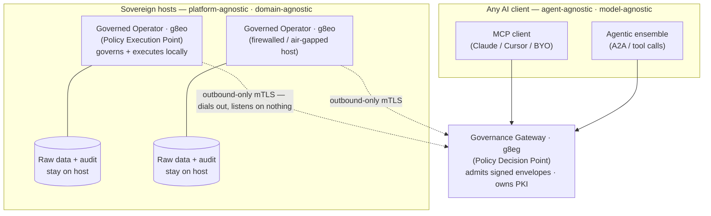
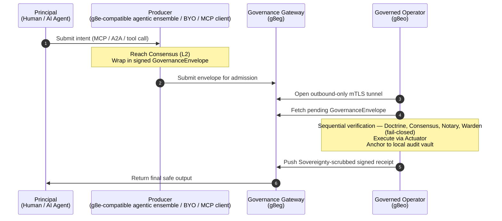
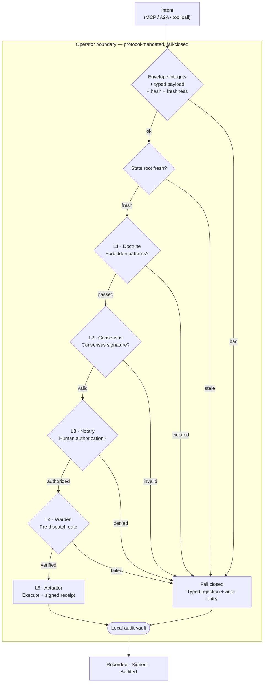

<div align="left">

# g8e

**Runtime Governance Substrate for Autonomous Execution**

g8e is a zero-trust execution substrate for agentic infrastructure. It defines a protocol for typed, signed, state-bound transactions; a Governance Gateway (`g8eg`) for admission and PKI management; and a Governed Operator (`g8eo`) for host-local verification and execution.

The architecture extends standard Model Context Protocol (MCP) and Agent-to-Agent (A2A) topologies with a fail-closed governance gauntlet. The Operator serves as the execution boundary, requiring cryptographic evidence of technical bedrock (L1), model consensus (L2), and human authorization (L3) before mutating state. g8e is the underlying substrate that secures agentic ensembles against production environments.

[](LICENSE)
[](https://go.dev)
[](#status-v100--core-substrate)
[](docs/reference/position_paper.md)

[Getting Started](docs/guides/getting_started.md) · [Mental model](#the-mental-model) · [The Operator](#the-governed-operator) · [How it works](#how-it-works) · [Docs](#documentation)

</div>

---

## The problem

AI agents now hold write access to terminals, cloud APIs, CI/CD, source control, and databases — usually wired in through MCP or function calls. Those protocols establish **capability**: they prove an agent *can* act. They say nothing about **authority**: whether a given action, right now, on this host, is safe to execute.

g8e is the missing admission boundary. Every state-changing action arrives as a signed `GovernanceEnvelope` and must clear a fail-closed gauntlet *at the host* before it runs. Anything stale, unsigned, unauthorized, or off-policy is dropped at the boundary and recorded. The default is closed.

```
The mandatory invariant:
A state-changing action reaches the host only as a typed, signed, state-bound
transaction; the host verifies that transaction before it executes.
```

---

## The mental model

g8e follows standard MCP topology with integrated governance and data sovereignty.

| Reference | g8e Role | Implementation |
| --- | --- | --- |
| **MCP server** | **Governed Operator (`g8eo`)** | Provides a tool-calling facade where every execution clears the host-local governance gauntlet. Listens on no inbound ports; runs on remote, private, or air-gapped hosts. |
| **MCP gateway** | **Governance Gateway (`g8eg`)** | Admits signed, state-bound envelopes and dispatches them to remote Operators. Maintains PKI and provides a centralized audit authority without raw data exposure. |

The substrate is **agent-agnostic, model-agnostic, platform-agnostic, and domain-agnostic**. The governance layer verifies the envelope integrity and proofs regardless of the proposing agent, signing model, or target operating system.


```mermaid
graph TD
    subgraph Clients ["Any AI client — agent-agnostic · model-agnostic"]
        C1["MCP client<br/>(Claude / Cursor / BYO)"]
        C2["Agentic ensemble<br/>(A2A / tool calls)"]
    end

    GW["Governance Gateway · g8eg<br/>(Policy Decision Point)<br/>admits signed envelopes · owns PKI"]

    subgraph Fleet ["Sovereign hosts — platform-agnostic · domain-agnostic"]
        O1["Governed Operator · g8eo<br/>(Policy Execution Point)<br/>governs + executes locally"]
        D1[("Raw data + audit<br/>stay on host")]
        O2["Governed Operator · g8eo<br/>(firewalled / air-gapped host)"]
        D2[("Raw data + audit<br/>stay on host")]
        O1 --- D1
        O2 --- D2
    end

    C1 --> GW
    C2 --> GW
    O1 -. "outbound-only mTLS — dials out, listens on nothing" .-> GW
    O2 -. "outbound-only mTLS" .-> GW
```

---

## The Governed Operator

The Operator is the primary execution boundary—a protocol-aware MCP server that enforces local verification before host mutation.

The reference implementation, **`g8eo`**, is a single statically compiled Go binary — **~7MB compressed, zero standing dependencies** — and how you start it decides what it is:

```bash
# Host-side MCP server (Policy Execution Point).
# Point any MCP client at it; every tool call is governed before it executes.
g8eo --mcp-serve

# The exact same binary as the Governance Gateway (Policy Decision Point).
# Admits envelopes, owns the PKI, fans transactions out to remote Operators.
g8eo --notary        # or --consensus / --doctrine to set the posture
```

**One binary, two roles.** No second package to deploy, no runtime to patch, no interpreter to audit.

**A drop-in MCP server.** It exposes standard MCP (and A2A) interfaces, so any BYO client connects with no changes. It hides the entire `GovernanceEnvelope` machinery — transaction hashing, L2/L3 signature collection, replay defense — behind a normal tool-calling facade and maps each JSON-RPC call to a governed `ActionType` mutation.

**It listens on nothing.** The Operator opens an mTLS reverse tunnel *out* to the Gateway and pulls pending work. No inbound ports, no NAT holes, nothing to port-scan. This is what lets it govern execution on hosts that are firewalled, air-gapped, or otherwise unreachable.

**It is the source of truth.** Every mutation is recorded to a host-local, git-backed vault *before* the side effect occurs. Raw data and forensic context never leave the host — only Sovereignty-scrubbed projections cross the wire.

---

## Protocol first, implementation second

> The **g8e Protocol** — the `GovernanceEnvelope`, the hash binding, the L1/L2/L3 contract — is the normative standard. `g8eo` (Operator) and `g8eg` (Gateway) are the **reference implementation** of those roles, not the protocol itself.

Any conforming implementation, in any language, that enforces the invariants is a valid g8e Operator or Gateway. The binary you run today is one implementation of a spec anyone can build against. **g8e-compatible agentic ensembles** are likewise optional producers that implement the protocol to emit signed envelopes carrying L2 consensus evidence — the protocol is the only mandatory part of the system.

---

## Governance Layers

Every mutation passes through sequential verification layers at the Operator boundary. Each layer produces cryptographic evidence that travels inside the envelope. Failed transactions are rejected and audited immediately.

| Layer | Name | Mechanism | What it proves |
| :---: | --- | --- | --- |
| **L1** | **Doctrine** | Reflected `forbidden_patterns` + MITRE ATT&CK heuristics | The action trips no hard gate (reverse shells, privilege escalation, destructive disk ops). |
| **L2** | **Consensus** | Ed25519 k-of-n over the transaction hash | An independent, heterogeneous model ensemble co-signed the intent. |
| **L3** | **Notary** | mTLS certificate fingerprint (CLI) | A human authorized *this exact* transaction hash — not a session. |
| **L4** | **Warden** | Pre-dispatch verification gate | Hash, freshness, state binding, and signer trust all hold. |
| **L5** | **Actuator** | Single fail-closed dispatch path | The only code path that mutates the host; emits a signed `ActionReceipt`. |

Before L5 runs, the **L4 Warden** enforces, in order:

- **Integrity** — `id == transaction_hash == SHA-256(canonical_fields)`. Wire format is canonical JSON (protojson); the signing basis is a deterministic hash of normalized fields.
- **Freshness** — `expires_at` is in the future and the `nonce` is unseen in the active replay window.
- **State binding** — the envelope's `state_merkle_root` matches the host's current ledger root. Stale state is rejected.
- **Quorum** — L1/L2/L3 proofs satisfy the active **governance posture** (`doctrine`, `consensus`, or `notary`).

The split between L2 and L3 is the point: one model can't unilaterally move the host (L2 needs an independent quorum), and a stolen session can't either (L3 binds a human signature to the specific transaction hash). Neither proof alone is sufficient.

---

## How it works

A producer forms intent and reaches consensus; the Operator pulls the envelope over its outbound tunnel, runs local verification layers, executes through the Actuator, and pushes back a scrubbed, signed receipt.


```mermaid
sequenceDiagram
    autonumber
    participant Principal as Principal<br/>(Human / AI Agent)
    participant Ensemble as Producer<br/>(g8e-compatible agentic ensemble / BYO / MCP client)
    participant Gateway as Governance Gateway<br/>(g8eg)
    participant Operator as Governed Operator<br/>(g8eo)

    Principal->>Ensemble: Submit intent (MCP / A2A / tool call)
    Note over Ensemble: Reach Consensus (L2)<br/>Wrap in signed GovernanceEnvelope
    Ensemble->>Gateway: Submit envelope for admission

    Operator->>Gateway: Open outbound-only mTLS tunnel
    Operator->>Gateway: Fetch pending GovernanceEnvelope

    Note over Operator: Sequential verification — Doctrine, Consensus, Notary, Warden<br/>(fail-closed)<br/>Execute via Actuator<br/>Anchor to local audit vault

    Operator->>Gateway: Push Sovereignty-scrubbed signed receipt
    Gateway->>Principal: Return final safe output
```

The verification path itself, end to end:


```mermaid
graph TD
    Start["Intent<br/>(MCP / A2A / tool call)"]

    subgraph Operator ["Operator boundary — protocol-mandated, fail-closed"]
        direction TB
        Pre{"Envelope integrity<br/>+ typed payload<br/>+ hash + freshness"}
        State{"State root fresh?"}
        L1{"L1 · Doctrine<br/>Forbidden patterns?"}
        L2{"L2 · Consensus<br/>Consensus signature?"}
        L3{"L3 · Notary<br/>Human authorization?"}
        L4{"L4 · Warden<br/>Pre-dispatch gate"}
        Fail["Fail closed<br/>Typed rejection + audit entry"]
        Act["L5 · Actuator<br/>Execute + signed receipt"]
        Vault([Local audit vault])

        Pre -- ok --> State
        State -- fresh --> L1
        L1 -- passed --> L2
        L2 -- valid --> L3
        L3 -- authorized --> L4
        L4 -- verified --> Act

        Pre -- bad --> Fail
        State -- stale --> Fail
        L1 -- violated --> Fail
        L2 -- invalid --> Fail
        L3 -- denied --> Fail
        L4 -- failed --> Fail

        Act --> Vault
        Fail --> Vault
    end

    Start --> Pre
    Vault --> Done["Recorded · Signed · Audited"]
```

---

## The protocol

The `GovernanceEnvelope` is the single canonical container for every mutation. It binds identity, intent, state, and governance proofs into one verifiable unit.

- **Canonical JSON wire format.** All client-facing surfaces (HTTP, WSS pub/sub, receipts, audit exports) carry the envelope as protojson. Binary protobuf is reserved for internal storage.
- **Hash-based signing.** A deterministic `transaction_hash` is computed from normalized fields; `id == transaction_hash == SHA-256(canonical_fields)` is enforced on every transaction.
- **Body-embedded context.** Session identifiers (`operator_session_id`, `cli_session_id`, `web_session_id`) and operator identity live inside the envelope as typed fields — no ambient context.
- **SPIFFE identity over mTLS.** Workloads carry SPIFFE URI SANs (`spiffe://g8e.local/operator/...`, `.../cli/...`). Revocation is checked on every handshake.
- **Signed receipts.** Every execution emits an `ActionReceipt` signed by a host-unique Ed25519 key, with `state_root_before` / `state_root_after` captured around a two-phase, git-backed ledger commit.
- **No backward compatibility.** Legacy formats, HMAC fallbacks, and unsigned inputs are rejected. The Operator enforces the current strict protocol, period.

MCP, A2A, and OpenAI-style tool calls normalize into this one envelope. g8e doesn't compete with those standards — it wraps them.

---

## Architecture: PDP / PEP

The same reference binary plays both sides of the boundary.

| Role | Mode | Function |
| --- | --- | --- |
| **Governance Gateway** (`g8eg`) — Policy Decision Point | `--doctrine` / `--consensus` / `--notary` | Admission (`POST /api/governance/envelope`), mTLS/PKI root CA, replay defense, state-root distribution, pub/sub fan-out, audit authority. |
| **Governed Operator** (`g8eo`) — Policy Execution Point | `--mcp-serve` (host agent) | Sovereign MCP server, local audit vault, Sovereignty Boundary, the L5 Actuator execution boundary. Outbound-only. |

Governance posture sets what's enforced vs. merely audited: **Doctrine** (L1 enforced), **Consensus** (L1/L2 enforced), **Notary** (L1/L2/L3 strictly enforced).

---

## Zero-trust architecture

Every component distrusts the others. Execution authority is never ambient.

| Actor | Distrusts | Enforced by |
| --- | --- | --- |
| **Principal** | Any single AI provider; any host | Heterogeneous consensus; mTLS; device fingerprinting |
| **Gateway (g8eg)** | The producer and the client | Scoped sessions; replay protection; envelope verification |
| **Operator (g8eo)** | User, AI, transport, and stale state | Doctrine and Notary gates; outbound-only mTLS; state-root binding |
| **Output** | All downstream readers | The Sovereignty Boundary scrubs secrets and PII before exposure |

The Operator also holds **zero standing privileges**: no permanent admin credentials. Permissions are minted just-in-time from the verified intent in the envelope, scoped to a single action, and dissolved on completion. A compromised session can't exfiltrate persistent credentials — there are none.

---

## Status: v1.0.0 — Core Substrate

**g8e is in active development. Use at your own risk.**

v1.0.0 completes the "substrate-first" decoupling. Originally a monolith (Dashboard + Engine + Operator), the platform has been refactored down to the **g8e Core**: the protocol, the Governance Gateway (`g8eg`), and the Governed Operator (`g8eo`). The Engine and everything that rode along with it are gone — what's left is the substrate that governs whatever engine you bring.

**Working today**
- **Universal Protocol Translation** — Fully functional MCP and A2A gateway that intercepts standard tool calls and normalizes them into a signed, state-bound `GovernanceEnvelope`.
- **Standalone Governance Gateway (PDP)** — Reference binary running in Gateway mode (`--notary`, `--consensus`, `--doctrine`) to admit envelopes, own PKI, and manage distribution.
- **Sovereign Governed Operator (PEP)** — Host-side MCP server that enforces local verification before host mutation; pre-compiled binary with zero standing dependencies.
- **Zero-Trust Posture** — Absolute distrust of all upstream inputs; every mutation must clear the 5-layer gauntlet at the host boundary before execution.
- **Outbound-Only mTLS Connectivity** — Operators dial out to the Gateway via secure mTLS reverse tunnels; requires zero inbound ports on the host.
- **Fail-Closed 5-Layer Gauntlet** — Sequential verification of technical bedrock (L1), model consensus (L2), and pre-dispatch (L4) gates is fully operational.
- **Local-First Audit Vault** — Mandatory host-local, git-backed ledger and SQLite audit vault that records mutations and signed receipts *before* side effects occur.
- **Sovereignty Boundary** — Automated scrubbing and rehydration of sensitive data context, ensuring raw data and forensic context never leave the host.
- **Deterministic Hash Binding** — Enforced integrity where `id == transaction_hash == SHA-256(canonical_fields)` across all wire formats and signing operations.
- **Statically Compiled Go Binary** — Single ~7MB binary with zero external dependencies (no Python, no Node, no shared libs), suitable for air-gapped or high-security environments.
- **Host-Unique Signing** — Every `ActionReceipt` is cryptographically signed by a host-unique Ed25519 key, providing non-repudiable proof of execution.

**Not yet supported — read before you deploy**
- **RBAC** — no granular role-based access control yet; session scoping is basic. [#84](https://github.com/g8e-ai/g8e/issues/84)
- **L3 Notary** — Human authorization is enforced via CLI-based mTLS certificate approval. Hardware-bound WebAuthn/FIDO2 support is in development. [#85](https://github.com/g8e-ai/g8e/issues/85)
- **Multi-tenant isolation** — single-organization only; no tenant partitioning. [#86](https://github.com/g8e-ai/g8e/issues/86)
- **Complex policy engine** — L1 Doctrine is limited to static pattern matching and basic reflection. Intent allowlisting is not yet integrated. [#87](https://github.com/g8e-ai/g8e/issues/87)
- **Unified Diff Patching** — file `patch` operations are not yet implemented; use `replace` or `write` instead. [#88](https://github.com/g8e-ai/g8e/issues/88)
- **Downstream Circuit Breaking** — A2A protocol translation lacks circuit breakers for downstream service failures. [#89](https://github.com/g8e-ai/g8e/issues/89)
- **Advanced MCP/A2A Features** — resource listing/reading, prompt management, and intent grant/revoke actions are defined in the protocol but not yet implemented in the Operator. [#90](https://github.com/g8e-ai/g8e/issues/90)
- **CLI Approval** — CLI `approve` command for signing suspended transactions is missing. [#91](https://github.com/g8e-ai/g8e/issues/91)
- **Execution Boundary** — Warden should be the absolute execution boundary to achieve true zero-trust. [#93](https://github.com/g8e-ai/g8e/issues/93)
- **Sovereignty Persistence** — TokenStore needs persistence for rehydration across restarts. [#94](https://github.com/g8e-ai/g8e/issues/94)
- **State-Root Sync** — Dynamic distribution of the authoritative state root across Operators. [#95](https://github.com/g8e-ai/g8e/issues/95)
- **PKI Consistency** — Reconcile conflicting signer path resolution in Operator configuration. [#96](https://github.com/g8e-ai/g8e/issues/96)

---

## Outbound-Only Deployment Patterns

The outbound-only mTLS model enables several secure infrastructure patterns where a signed envelope reaches a sovereign host, clears local verification, and produces a tamper-evident receipt.

- **Distributed fleet operations.** Operators across on-prem, VPCs, and edge all dial out to one Gateway. A single signed command fans out to every host — no inbound ports, no VPNs.
- **Incident response on firewalled hosts.** A production box sits behind a corporate firewall. An AI proposes a fix, the consensus panel validates it, you authorize via CLI/mTLS, and the Operator executes locally.
- **Data-sovereign analysis.** The Operator runs analysis on-host; the Sovereignty Boundary scrubs the output so the model sees only a safe projection. Raw data never leaves.
- **Queued execution for offline hosts.** Submit an envelope with an expiry and expected state root. When the Operator reconnects, it re-verifies freshness and state before executing.
- **Two-phase commit across environments.** A transaction hash promotes from dev to staging to prod. Each host independently verifies it against its own local Merkle root.

---

## Reference implementation

g8e provides the core substrate; the protocol is the only mandatory part.

- **Gateway (`g8eg`)** — Policy Decision Point: admission, mTLS/PKI, replay protection, distribution.
- **Operator (`g8eo`)** — Policy Execution Point and sovereign boundary: MCP server, local audit, Sovereignty Boundary, execution.
- **g8e-compatible agentic ensembles** — optional producers that emit signed envelopes with L2 consensus evidence.

**Code pointers**
`protocol/proto/g8e/` · `internal/services/governance/` (l1–l5) · `internal/services/mcp/gateway.go` · `internal/services/storage/audit_vault.go`

---

## Self-hosting & air-gap

g8e runs entirely inside your perimeter. The Operator has no inbound gateway, so there's nothing to expose and nothing to scan. The single static binary supports fully air-gapped deployment — no runtime, no package manager, no outbound dependency beyond the one mTLS tunnel it opens to your own Gateway.

---

## Documentation

- **[Getting Started](docs/guides/getting_started.md)** — stand up g8e in minutes via the unified CLI.
- **[Position Paper](docs/reference/position_paper.md)** — full design rationale, threat model, and BFT analysis.
- **[Protocol](docs/architecture/protocol.md)** — wire format, transaction hash, and the Doctrine / Consensus / Notary definitions.
- **[Operator (g8eo)](docs/architecture/operator.md)** — execution boundary, gateway modes, and host storage.
- **[Gateway (g8eg)](docs/architecture/gateway.md)** — Governance Gateway architecture and modes.
- **[g8e-Compatible Applications](docs/guides/g8e-compatible-apps.md)** — building conforming producers and consumers.
- **[Guides](docs/guides/)** · **[Reference](docs/reference/)** · **[Contributing](CONTRIBUTING.md)**

---

## License

Apache 2.0. See [LICENSE](LICENSE).

Built by [Lateralus Labs](https://lateraluslabs.com).
