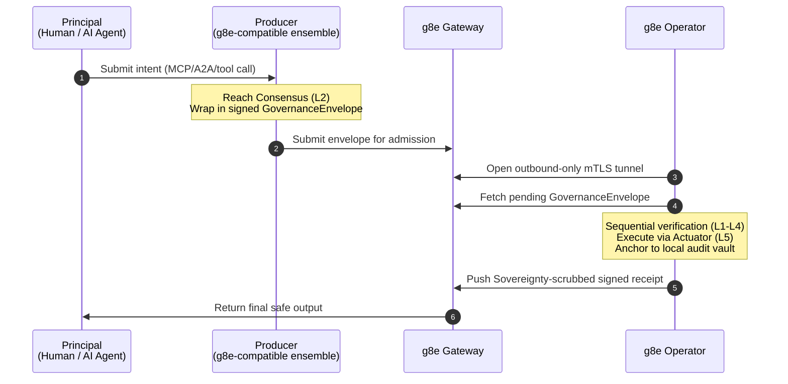

<div align="left">

# g8e

## Enterprise-Grade MCP/A2A for Fleets

[](LICENSE) [](https://go.dev) [](https://github.com/g8e-ai/g8e/actions/workflows/build-and-test.yml) [](https://goreportcard.com/report/github.com/g8e-ai/g8e) [](https://github.com/g8e-ai/g8e/releases) [](#status-v107--core-platform) [](docs/reference/compliance-alignment.md) [](docs/protocols/mcp/mcp.md) [](docs/architecture/g8e.md)

<style>
img[alt="License"], img[alt="Go"], img[alt="CI"], img[alt="Go Report Card"], img[alt="Latest Release"], img[alt="Status"], img[alt="Compliance"], img[alt="Secure MCP"], img[alt="Protocol g8e"] {
  height: 28px;
}
</style>

The "move fast and break things" era is costing organizations a fortune in wasted tokens, broken infrastructure, and unaccountable AI actions. SaaS vendors offer "governance" control planes that are little more than token spend dashboards, open-sourcing client tools simply to lock you into their proprietary backends. Cloud provider lock-in, protocol gaps in MCP/A2A, and the structural vulnerability of single-model self-reflection have left agentic systems dangerously exposed.

**g8e is the missing admission boundary.** It enforces a typed, signed, state-bound transaction that must clear a fail-closed verification pipeline **directly on the host** before any side effect occurs.

Start the g8e Gateway on your local machine, point your AI tools at it, and every action is governed—hardware-bound, just-in-time provisioned, secured via mutual TLS, and anchored to a local ledger.

[Getting Started](docs/guides/getting_started.md) · [Architecture](docs/architecture/gateway.md) · [Protocol](docs/architecture/g8e.md) · [Docs](docs/)

</div>

## The Problem: Capability does not equal Authority

Agents now hold write access to terminals, cloud APIs, CI/CD, source control, and databases. Standard protocols like MCP and A2A establish **capability** (proof an agent *can* act). They say nothing about **authority** (whether *this* action, *right now*, on *this* host, against *this* state, is safe to run).

The industry has responded with flawed, single-point solutions:

* **Token spend dashboards:** Counting what you spent, not blocking what you shouldn't have executed.
* **Single-model self-reflection:** The same weights that produce an action produce its justification. A prompt injection doesn’t defeat the verifier; it *becomes* the verifier.
* **Human-in-the-loop at scale:** Routing every action through a human decays into approval fatigue.
* **Vendor "open source" clients:** Free tools requiring proprietary backends, acting as trojan horses for vendor lock-in.

The fundamental error is assuming a single validator can certify two orthogonal properties: technical consistency and human intent.

---

## The g8e Differentiators

g8e fixes this by enforcing a strict invariant: **A state-changing action reaches the host only as a typed, signed, state-bound transaction, and the host verifies that transaction before it executes.**

* **Structural Consensus over Single-Model Reflection:** Authority to mutate requires the *conjunction* of two independent proofs. Machine **consistency** (a heterogeneous model quorum agreeing the payload is safe) **+** Human **intent** (a person authorizing the exact transaction hash). Neither signature alone is sufficient.
* **Hardware-Bound & Zero Standing Privileges:** Permissions are minted just-in-time, scoped to a single action, and dissolved on completion. The g8e Operator is outbound-only—it requires no new inbound ports, no dependencies, and no root access.
* **Local-First Data Sovereignty:** Every mutation is written to a host-local, git-backed ledger *before* execution. Raw data and forensic context never leave the host; only scrubbed projections cross the wire. The platform vendor is reduced to a stateless relay.
* **One Binary, Two Roles, Total Fleet Control:** A single 15MB statically compiled artifact runs as either the **g8e Gateway** (Policy Decision Point) or **g8e Operator** (Policy Execution Point) across Windows, macOS, and Linux. Deploy via SSH and execute fan-out operations across your entire fleet simultaneously.
* **Free and Open, by Design:** Runtime governance and audit for agents are public goods. A governance layer you cannot inspect or self-host is a contradiction to zero-trust. g8e is Apache-2.0, single-binary, and air-gap-capable—and it stays that way.

---

## QuickStart

The platform is a single g8e Node. No runtime, no interpreter, no sidecar.

**Quick launch (Linux)**

```bash
curl -fsSL https://g8e.ai/g8e-linux-amd64 -o g8e && chmod +x g8e && ./g8e gw start
```

**Quick launch (macOS)**

```bash
curl -fsSL https://g8e.ai/g8e-darwin-amd64 -o g8e && chmod +x g8e && ./g8e gw start
```

**Quick launch (Windows)**

```powershell
iwr https://g8e.ai/g8e-windows-amd64.exe -outf g8e.exe && .\g8e.exe gw start
```

**Deploy operators to remote hosts via SSH**

```bash
# Using your existing SSH config, deploy Operators across your fleet
./g8e Operator deploy --hosts host1,host2,host3

# Tool calls accept a list of hosts for simultaneous fan-out execution
```

*See the [full QuickStart](docs/guides/getting_started.md) for mTLS, Operator enrollment, and client configuration.*

---

## Architecture & Governance Layers

g8e follows standard MCP topology, but folds in strict governance and data sovereignty. Any conforming implementation that enforces our `GovernanceEnvelope` invariant is a valid g8e Operator or Gateway.

* **g8e Gateway (MCP Gateway):** Admits signed, state-bound envelopes, manages the PKI, and provides central audit authority without exposing raw data.
* **g8e Operator (MCP Server):** A tool-calling facade that listens on *no inbound ports*, dialing out to pull pending work. It executes the governance gauntlet locally.

### The Host-Local Gauntlet (L1-L5)

Every mutation passes through sequential verification layers at the Operator boundary. Compromising any single layer is not enough to cause an unauthorized mutation.

| Layer | Name | Mechanism | Proof Objective |
| --- | --- | --- | --- |
| **L1** | **Doctrine** | Reflected `forbidden_patterns` + MITRE ATT&CK heuristics | The action trips no hard gate (e.g., reverse shells, destructive disk ops). |
| **L2** | **Consensus** | Ed25519 k-of-n over the transaction hash | An independent, heterogeneous model ensemble co-signed the intent. |
| **L3** | **Notary** | WebAuthn / mTLS cert fingerprint | A human authorized *this exact transaction hash*, not just a session. |
| **L4** | **Warden** | Pre-dispatch verification gate | Hash integrity, temporal freshness, state binding, and signer trust hold true. |
| **L5** | **Actuator** | Single fail-closed dispatch path | Mutates the host and emits a signed, Sovereignty-scrubbed `ActionReceipt`. |


```mermaid
sequenceDiagram
    autonumber
    participant Principal as Principal<br/>(Human / AI Agent)
    participant Ensemble as Producer<br/>(g8e-compatible ensemble)
    participant Gateway as g8e Gateway
    participant Operator as g8e Operator

    Principal->>Ensemble: Submit intent (MCP/A2A/tool call)
    Note over Ensemble: Reach Consensus (L2)<br/>Wrap in signed GovernanceEnvelope
    Ensemble->>Gateway: Submit envelope for admission

    Operator->>Gateway: Open outbound-only mTLS tunnel
    Operator->>Gateway: Fetch pending GovernanceEnvelope

    Note over Operator: Sequential verification (L1-L4)<br/>Execute via Actuator (L5)<br/>Anchor to local audit vault

    Operator->>Gateway: Push Sovereignty-scrubbed signed receipt
    Gateway->>Principal: Return final safe output

```

---

## The Stance

We hold this without hedging: **runtime governance and audit for AI agents are public goods, and gating them behind a paywall is incompatible with a safe AI-powered world.**

If safety is a premium SKU, the cheapest path to shipping an agent is always the ungoverned one. For governance to be the default, it must be free. As agents grow more capable, the baseline for real-world infrastructure mutations must be heterogeneous consensus plus a cryptographic human signoff upstream.

g8e is not an agent. It is the mandatory, open-source substrate agents must run on to be viable in production infrastructure.

---

## Status: v1.0.7 — Core Platform

**Operational today:**

* Universal protocol translation (MCP/A2A intercepted into signed envelopes).
* Fail-closed verification (L1, L2, L4).
* L3 Notary (WebAuthn / mTLS human authorization).
* Sovereign execution (git-backed ledger & local vault) with data sovereignty (PII/secret scrubbing).
* Outbound-only mTLS for firewalled/air-gapped hosts.
* SSH deployment & Fan-out execution across remote fleets.
* Native Windows support parity.

**In development:**

* RBAC & Multi-tenancy.
* Complex policy (dynamic intent allowlisting).
* Gateway federation & agentic mesh gossiping.

---

## Example: GovernanceEnvelope with MCP Payload

Below is a complete example of a `GovernanceEnvelope` wrapping an MCP tool call (`fs_read`), demonstrating all fields including L1/L2/L3 governance proofs:

```json
{
  "id": "a1b2c3d4e5f6a1b2c3d4e5f6a1b2c3d4e5f6a1b2c3d4e5f6a1b2",
  "timestamp": "2026-06-02T18:27:00Z",
  "expiresAt": "2026-06-02T18:32:00Z",
  "sourceComponent": "COMPONENT_CLIENT",
  "operatorId": "op-prod-12345",
  "operatorSessionId": "sess-abc-789",
  "webSessionId": "web-xyz-456",
  "cliSessionId": "",
  "eventType": "g8e.v1.operator.mcp.call.requested",
  "payload": "CgZmc19yZWFkEglleGVjLTIwMzUSCgoZmlsZTovLy9ob21lL3VzZXIvcmVhZG1lLm1kGgZzY3J1Yg==",
  "intentData": {
    "tool": "fs_read",
    "path": "/home/user/readme.md",
    "reason": "Read deployment documentation"
  },
  "actionType": "MCP_CALL",
  "targetResource": "file:///home/user/readme.md",
  "stateMerkleRoot": "abc123def456abc123def456abc123def456abc123def456abc123def456abc1",
  "nonce": "nonce-1717358820000-abc123",
  "transactionHash": "a1b2c3d4e5f6a1b2c3d4e5f6a1b2c3d4e5f6a1b2c3d4e5f6a1b2",
  "protocolVersion": "1.0",
  "governance": {
    "l1": {
      "validated": true,
      "violations": []
    },
    "l2": {
      "consensusSignature": "4a5b6c7d8e9f0a1b2c3d4e5f6a1b2c3d4e5f6a1b2c3d4e5f6a1b2c3d4e5f6a1b2...c3d4e5f6a1b2c3d4e5f6a1b2c3d4e5f6a1b2c3d4e5f6a1b2c3d4e5f6a1b2",
      "agentIds": ["agent-ensemble-1", "agent-ensemble-2", "agent-ensemble-3"],
      "keyId": "key-ensemble-prod-abc123"
    },
    "l3": {
      "proof": {
        "clientDataJson": "{\"challenge\":\"a1b2c3d4e5f6\",\"origin\":\"https://g8e.ai\",\"type\":\"webauthn.get\"}",
        "authenticatorData": "SZYN5YgOjGh0NBcPZHZgW4_krrmihjLHmVzzuoMdl2NFAAAAAQ",
        "signature": "MEUCIQDWn3x4e5f6a1b2c3d4e5f6a1b2c3d4e5f6a1b2c3d4e5f6a1b2c3d4e5f6a1b2IgE5f6a1b2c3d4e5f6a1b2c3d4e5f6a1b2c3d4e5f6a1b2c3d4e5f6a1b2c3d4e5f6a1b2",
        "credentialId": "abc123def456abc123def456abc123def456abc123def456abc123def456abc1",
        "mtlsCertFingerprint": "",
        "cliSignature": ""
      },
      "autoApproved": false
    },
    "gatewaySigned": false
  },
  "caseId": "case-deploy-456",
  "investigationId": "",
  "taskId": "task-readme-789",
  "systemFingerprint": "fp-linux-amd64-abc123",
  "tenantId": "tenant-prod-xyz",
  "bindingPersona": "default"
}
```

The `payload` field contains base64-encoded protobuf bytes of the `McpCallRequested` message, which includes the tool name (`fs_read`) and JSON arguments specifying the file path.

---

## Documentation

* [Getting Started](docs/guides/getting_started.md)
* [Architecture: Operator](docs/architecture/operator.md) · [Gateway](docs/architecture/gateway.md) · [Auth](docs/architecture/auth.md) · [Local Translation](docs/architecture/g8e_local_translation.md)
* [Protocol Specification](docs/architecture/g8e.md) · [API Reference](docs/reference/)
* [Build a g8e Operator](docs/guides/build_operator.md)

---

*Built by Lateralus Labs. Licensed Apache 2.0.*