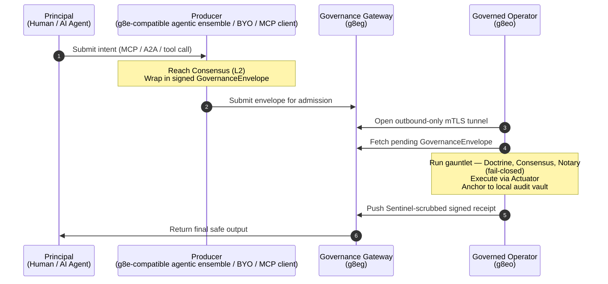
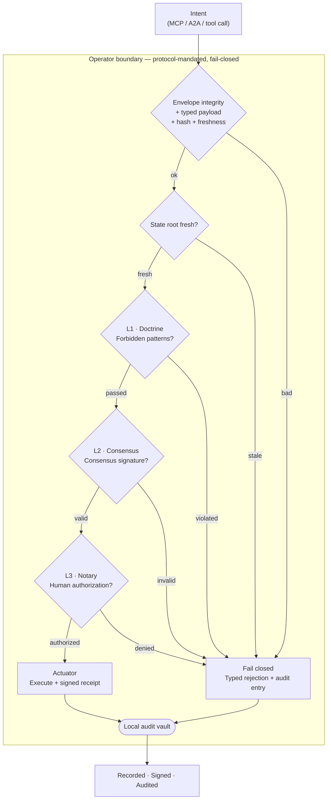

<div align="center">

<!-- INSERT: logo here (recommend a small wordmark or the g8e gate glyph, ~120px tall) -->

# g8e

**Byzantine Fault Tolerant governance for AI agents that touch real infrastructure.**

g8e is a zero-trust execution protocol and outbound-only gateway that forces every AI tool call to prove itself — current, consensus-backed, human-authorized, and locally auditable — before it is allowed to change anything on the host.

[](LICENSE)
[](https://go.dev)
[](#status)
[](docs/concepts/position_paper.md)

[Quickstart](docs/quickstart/) · [How it works](#how-it-works) · [Self-hosting](#self-hosting--air-gap) · [Docs](#documentation) · [Paper](docs/concepts/position_paper.md)

</div>

---

<!-- ============================================================= -->
<!-- INSERT: HERO DEMO (video or GIF) — this is the money shot.    -->
<!-- Capture one governed mutation moving end to end:              -->
<!--   intent (MCP/tool call) → Consensus co-sign → Notary tap →      -->
<!--   Actuator executes → signed receipt in the audit log.        -->
<!-- 10–20s, terminal + the WebAuthn prompt. Put it right here.    -->
<!-- ============================================================= -->

> *Insert hero demo video/GIF above.*

---

## Why

AI agents now hold write access to your terminals, cloud APIs, CI/CD, source control, and databases — usually wired in through MCP or function calls. Those protocols prove an agent **can** do something. They say nothing about whether it **should**.

g8e is the missing admission boundary. Every state-changing action arrives as a signed `GovernanceEnvelope` and has to clear a three-layer gauntlet at the host before it executes. Anything stale, unsigned, unauthorized, or off-policy is dropped at the boundary and recorded. The default is closed.

```
The mandatory invariant:
A state-changing action reaches the host only as a typed, signed, state-bound
transaction — and the host verifies that transaction before it executes.
```

---

## Key properties

- **Outbound-only by design.** The Operator opens an mTLS reverse tunnel to the Gateway and listens on nothing. No inbound ports, NAT and firewall traversal for free, and zero remote attack surface on the one component that holds execution authority.
- **One ~4MB binary, zero standing dependencies.** The reference Operator is a single statically compiled Go binary that serves dual purposes: daemon mode (Governance Gateway/Operator) and CLI mode (platform management). No runtime to patch, no interpreter to exploit, no package tree to audit. Air-gapped deployment is the normal case.
- **Multi-model Byzantine consensus.** The consensus layer (Consensus) is provider-agnostic. Heterogeneous models — Anthropic, OpenAI, local — independently co-sign every mutation, so no single model's hallucination or poisoning gets through.
- **Local-first audit with instant rollback.** Every decision, accepted or blocked, is written to a host-local vault *before* the side effect. A two-phase Git-backed commit architecture gives tamper-evident history and one-command rollback.
- **Fail-closed, in order.** Doctrine → Consensus → Notary, enforced at the host boundary. Each layer has to pass before the next is even reached.
- **Protocol-native.** MCP, A2A, and OpenAI-style tool calls all normalize into one signed envelope. The Operator is itself an MCP server.

---

## The gauntlet

Every mutation passes three layers in sequence at the host boundary. Each one produces cryptographic evidence that travels inside the envelope.

| Layer | Name | Mechanism | What it proves |
| :---: | --- | --- | --- |
| **L1** | **Doctrine** | Static analysis / reflection | The action violates no hard technical policy or forbidden pattern. |
| **L2** | **Consensus** | Ed25519 over k-of-n consensus | An independent, heterogeneous ensemble co-validated the intent. |
| **L3** | **Notary** | WebAuthn / FIDO2 | A human authorized **this exact transaction**, using its hash as the challenge. |

Before any of these run, the envelope is checked for integrity, typed-payload decode, hash binding (`id == SHA-256(canonical_fields)`), freshness (nonce + expiry), and state binding (expected Merkle root vs. current local root). Only a transaction that clears the whole chain reaches the **Actuator** — the single fail-closed dispatch path through which any change to the host has to pass.

<!-- ============================================================= -->
<!-- INSERT: SCREENSHOT — the Notary step: the WebAuthn / FIDO2     -->
<!-- hardware-key prompt at the moment of human approval. Very      -->
<!-- tangible; shows the human-in-the-loop is real and hardware-bound. -->
<!-- ============================================================= -->

> *Insert screenshot of the Notary (WebAuthn/FIDO2) approval prompt here.*

---

## How it works

A producer forms intent and reaches consensus; the Operator pulls the envelope over its outbound tunnel, runs the gauntlet locally, executes through the Actuator, and pushes back a scrubbed, signed receipt.


```mermaid
sequenceDiagram
    autonumber
    participant Principal as Principal<br/>(Human / AI Agent)
    participant Ensemble as Producer<br/>(g8e-compatible agentic ensemble / BYO / MCP client)
    participant Gateway as Governance Gateway<br/>(g8eg)
    participant Operator as Governed Operator<br/>(g8eo)

    Principal->>Ensemble: Submit intent (MCP / A2A / tool call)
    Note over Ensemble: Reach Consensus (L2)<br/>Wrap in signed GovernanceEnvelope
    Ensemble->>Gateway: Submit envelope for admission

    Operator->>Gateway: Open outbound-only mTLS tunnel
    Operator->>Gateway: Fetch pending GovernanceEnvelope

    Note over Operator: Run gauntlet — Doctrine, Consensus, Notary<br/>(fail-closed)<br/>Execute via Actuator<br/>Anchor to local audit vault

    Operator->>Gateway: Push Sentinel-scrubbed signed receipt
    Gateway->>Principal: Return final safe output
```

The verification path itself, end to end:


```mermaid
graph TD
    Start["Intent<br/>(MCP / A2A / tool call)"]

    subgraph Operator ["Operator boundary — protocol-mandated, fail-closed"]
        direction TB
        Pre{"Envelope integrity<br/>+ typed payload<br/>+ hash + freshness"}
        State{"State root fresh?"}
        L1{"L1 · Doctrine<br/>Forbidden patterns?"}
        L2{"L2 · Consensus<br/>Consensus signature?"}
        L3{"L3 · Notary<br/>Human authorization?"}
        Fail["Fail closed<br/>Typed rejection + audit entry"]
        Act["Actuator<br/>Execute + signed receipt"]
        Vault([Local audit vault])

        Pre -- ok --> State
        State -- fresh --> L1
        L1 -- passed --> L2
        L2 -- valid --> L3
        L3 -- authorized --> Act

        Pre -- bad --> Fail
        State -- stale --> Fail
        L1 -- violated --> Fail
        L2 -- invalid --> Fail
        L3 -- denied --> Fail

        Act --> Vault
        Fail --> Vault
    end

    Start --> Pre
    Vault --> Done["Recorded · Signed · Audited"]
```

---

## Zero-trust by design

Every component distrusts every other. Execution authority is never ambient.

| Actor | Distrusts | Enforced by |
| --- | --- | --- |
| **Principal** | Any single AI provider; any host | Heterogeneous Consensus; mTLS + device fingerprinting |
| **Gateway (g8eg)** | The producer and the client | Scoped sessions; replay protection; envelope verification |
| **Operator (g8eo)** | User, AI, transport, and stale state | Doctrine + Notary gates; outbound-only mTLS; state-root binding |
| **Output** | All downstream readers | Sentinel scrubs secrets, PII, and tokens before exposure |

---

## Potential uses

The outbound-only Operator architecture enables governed execution on hosts that are otherwise unreachable, untrusted, or sensitive. Each use case is a variation on the same pattern: a signed envelope reaches a sovereign host through an outbound tunnel, clears the verification gauntlet locally, and produces a tamper-evident receipt.

- **Distributed fleet operations.** Deploy Operators across heterogeneous infrastructure — on-prem servers, locked VPCs, remote edge devices, home NAS. All hosts dial out to a single Gateway. A single signed command fans out to every Operator; no VPN, bastion, inbound ports, or per-host credential management required.

- **Incident response on firewalled hosts.** When a production host is behind a corporate firewall that blocks SSH, an AI proposes a fix, the Tribunal validates consensus, you authorize via WebAuthn from a mobile device, and the Operator executes locally. Raw logs remain on-host; only a scrubbed receipt returns. Human-present remediation into unreachable infrastructure with hardware-bound authentication and forensic locality.

- **Data-sovereign analysis.** Point an AI at a directory containing PHI, financial data, or proprietary source. The Operator runs analysis on-host, Sentinel scrubs the output, and the model receives only a safe projection. Raw data and model execution never touch. The Operator enforces the data boundary; the AI reasons through a keyhole rather than over the dataset.

- **Queued execution for offline hosts.** Submit a governed envelope at the Gateway with an expiry and expected state root. When the Operator next connects, it retrieves the pending job, re-verifies freshness and that local state has not drifted, then executes — or fails closed if reality has changed. Task machines that are not currently online; the host refuses execution if state has moved.

- **Two-phase commit across environments.** AI builds a change against a dev Operator; you approve once. The exact same transaction hash promotes to staging, then production. Each host independently verifies against its own Merkle root. Git-backed audit vault provides per-host instant rollback. Signed intent travels; trust is re-earned locally at each hop rather than inherited from the pipeline.

- **Distributed quorum enforcement.** Require receipts from Operators on two different hosts — production and disaster recovery, or two administrators' laptops — before a mutation executes. The Gateway releases execution only after both sign. Distributed human/host consensus enforced by protocol, not by process.

- **State-locked execution.** Envelopes carry expiry and expected state root, enabling "approve now, execute only if state unchanged" semantics. AI stages a migration; if anything drifts before authorization, the transaction fails at the boundary. Useful for scheduled or delegated changes where approval occurs without immediate visibility.

- **Ephemeral governance in CI.** Spin up the Operator inside a CI runner, govern exactly what the job may mutate, then terminate. Zero standing dependencies enables governance for throwaway compute that otherwise lacks durable identity for policy attachment.

- **Customer-hosted deployment for regulated industries.** Ship the binary to an enterprise customer. Their data, their host, their audit vault. Your platform orchestrates but is structurally incapable of viewing raw data or mutating without local Operator consent. Sovereignty is architectural, not contractual.

---

## Reference implementation

g8e ships a full reference stack, but the protocol is the only mandatory part — any conforming producer can emit a valid envelope.

- **Gateway (`g8eg`)** — reference policy decision point: admission APIs, mTLS/PKI, replay protection, state-root distribution, fan-out to Operators.
- **Operator (`g8eo`)** — reference enforcement point and sovereign boundary: local audit authority, Sentinel scrubber, Actuator, MCP server. The 4MB binary.

**g8e-compatible agentic ensembles** are optional producers that implement the protocol to emit signed envelopes with L2 consensus evidence.

**Code pointers:**
`protocol/proto/*.proto` · `internal/services/governance/` · `internal/services/storage/audit_vault.go`

---

## Self-hosting & air-gap

g8e is built to run entirely inside your perimeter. The Operator has no inbound gateway, so there is nothing to expose and nothing to scan. The single static binary supports fully air-gapped deployment — no runtime, no package manager, no outbound dependency beyond the one mTLS tunnel it opens to your own Gateway. Raw data, forensic context, and execution history never leave the host; only Sentinel-scrubbed projections cross the wire.

<!-- ============================================================= -->
<!-- INSERT: SCREENSHOT (optional but strong) — the audit vault:    -->
<!-- a blocked transaction's rejection reason, or a rollback        -->
<!-- showing before/after content hashes and the Git-backed history. -->
<!-- ============================================================= -->

> *Optional: insert screenshot of the audit vault / rollback view here.*

---

## Documentation

- **[Quickstart](docs/quickstart/)** — get started with g8e in minutes using the unified CLI.
- **[Position Paper](docs/concepts/position_paper.md)** — the full design rationale, threat model, and BFT analysis.
- **[Protocol](docs/concepts/protocol.md)** — wire format, transaction hash, and the Doctrine / Consensus / Notary definitions.
- **[Operator (g8eo)](docs/concepts/operator.md)** — execution boundary, gateway modes, and host storage.
- **[Gateway (g8eg)](docs/concepts/g8eg.md)** — Governance Gateway architecture and modes.
- **[g8e-Compatible Applications](docs/concepts/g8e-compatible-apps.md)** — how to build conforming producers and consumers.
- **[Guides](docs/guides/)** — operational guides for testing, evals, demos, and troubleshooting.
- **[Reference](docs/reference/)** — glossary, constants, and protocol references.
- **[Contributing](CONTRIBUTING.md)** — build instructions, testing workflows, and standards.

---

## Status

Active development, pre-1.0. The protocol and the reference Operator are functional; APIs may change before the 1.0 cut. Issues and PRs welcome — see [CONTRIBUTING.md](CONTRIBUTING.md).

---

## License

Apache 2.0 — see [LICENSE](LICENSE).

Built by [Lateralus Labs](https://lateraluslabs.com).
