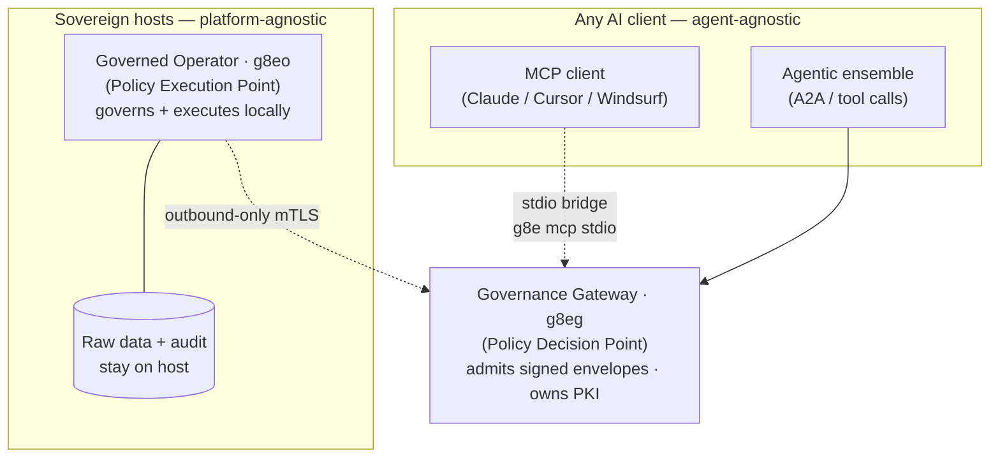
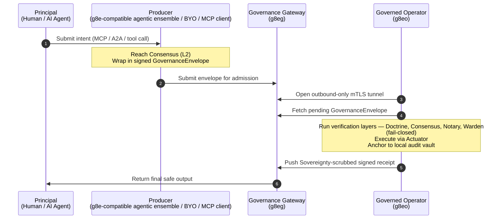
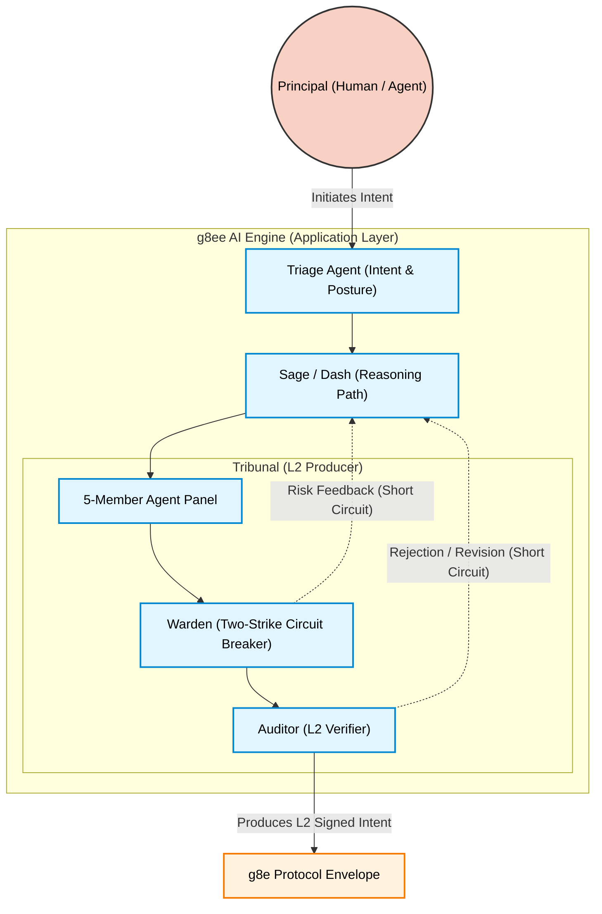

<div align="left">

# g8e

**Verify, then execute.**

g8e is a ~20MB, zero-dependency binary that provides agentic governance and state-mutation control. It functions as both the **control plane** (host-local policy decision) and the **data plane** (exclusive mutation executor). 

It dials out via mTLS and listens on nothing. Every AI-proposed action clears a fail-closed verification pipeline on the host and is committed to a git-backed ledger before execution. Only scrubbed projections leave the host; raw data never crosses the wire.


[](LICENSE)
[](https://go.dev)
[](#status-v102--core-platform)
[](docs/core/position_paper.md)

[Getting Started](docs/guides/getting_started.md) · [The two roles](#the-two-roles) · [Mental Model](#the-mental-model) · [Protocol](#the-protocol-invariants) · [Docs](#documentation)

</div>

---

## QuickStart

Get g8e online in under 60 seconds.

```bash
# 1. Clone the repository
git clone https://github.com/g8e-ai/g8e.git
cd g8e

# 2. Build the binary
make build

# 3. Start the Governance Gateway (g8eg)
./g8e gw start

# 4. Authenticate (first login automatically bootstraps the platform)
./g8e auth login

# 5. Verify the status
./g8e gw status
```

See the [Full QuickStart Guide](docs/guides/getting_started.md) for mTLS, enrollment, and CLI configuration.

---

## The two roles

g8e is one binary. Run it in Gateway mode or Operator mode — same artifact, copied wherever it's needed. Everything else is detail.

- **As the Gateway (g8eg)**, it's the meeting point. Your agents and clients submit signed work here. It issues the identity everything else authenticates against, enforces freshness and replay defense, scopes sessions, and keeps the network-side record. And it's deliberately powerless where it counts: it can't reach into a host, can't open a connection to an Operator, and can't decide what's safe to run on a machine it isn't sitting on. It admits work and hands it out. It does not execute, and its say-so is not final.
- **As the Operator (g8eo)**, it's the authority. Run on the host, it dials out to the Gateway, pulls down signed work, and makes up its own mind — re-verifying every proof against its own local state and trusting nothing upstream, the Gateway included. It's the only thing on that box allowed to change state, the only place raw data ever lives, and the local, git-backed record of everything that happened. Decision and execution, both on the host, in one binary.

**The split is the entire point**: the Gateway proposes, the Operator disposes. A compromised Gateway can lie about what to run; it can't make a host run it. The binding go/no-go always happens on the machine that owns the consequences — locally, against local state, recorded before the side effect. There is no trusted middle to compromise, because nothing in the middle has the final word.

---

## The mental model

g8e follows standard MCP topology with integrated BFT governance.


```mermaid
graph TD
    subgraph Clients ["Any AI client — agent-agnostic"]
        C1["MCP client<br/>(Claude / Cursor / Windsurf)"]
        C2["Agentic ensemble<br/>(A2A / tool calls)"]
    end

    GW["Governance Gateway · g8eg<br/>(Policy Decision Point)<br/>admits signed envelopes · owns PKI"]

    subgraph Fleet ["Sovereign hosts — platform-agnostic"]
        O1["Governed Operator · g8eo<br/>(Policy Execution Point)<br/>governs + executes locally"]
        D1[("Raw data + audit<br/>stay on host")]
        O1 --- D1
    end

    C1 -. "stdio bridge<br/>g8e mcp stdio" .-> GW
    C2 --> GW
    O1 -. "outbound-only mTLS" .-> GW
```

### Execution Flow

The sequence of a governed transaction execution:


```mermaid
sequenceDiagram
    autonumber
    participant Principal as Principal<br/>(Human / AI Agent)
    participant Ensemble as Producer<br/>(g8e-compatible agentic ensemble / BYO / MCP client)
    participant Gateway as Governance Gateway<br/>(g8eg)
    participant Operator as Governed Operator<br/>(g8eo)

    Principal->>Ensemble: Submit intent (MCP / A2A / tool call)
    Note over Ensemble: Reach Consensus (L2)<br/>Wrap in signed GovernanceEnvelope
    Ensemble->>Gateway: Submit envelope for admission

    Operator->>Gateway: Open outbound-only mTLS tunnel
    Operator->>Gateway: Fetch pending GovernanceEnvelope

    Note over Operator: Run verification layers — Doctrine, Consensus, Notary, Warden<br/>(fail-closed)<br/>Execute via Actuator<br/>Anchor to local audit vault

    Operator->>Gateway: Push Sovereignty-scrubbed signed receipt
    Gateway->>Principal: Return final safe output
```

---

## Governance Layers

Every mutation passes through sequential verification layers at the Operator boundary. Failed transactions are rejected and audited immediately.


```mermaid
graph TD
    Start["Signed GovernanceEnvelope<br/>(Incoming Transaction)"]

    subgraph Verification ["Operator Verification - protocol-mandated"]
        direction TB
        L1{"L1: Technical Bedrock<br/>Forbidden Patterns?"}
        L2{"L2: Consensus<br/>Tribunal Signature?"}
        L3{"L3: Authorization<br/>Human Presence?"}
        State{"State Check<br/>Merkle Root Fresh?"}
        L4{"L4: Warden<br/>Pre-dispatch Gate"}
        
        FailClosed["Fail Closed<br/>Typed Rejection + Audit Entry"]
        Actuator["L5: Actuator<br/>Execute + Signed Receipt"]
        LocalVault([Local Audit Vault])

        L1 -- "Passed" --> L2
        L1 -- "Violated" ----> FailClosed
        
        L2 -- "Passed" --> L3
        L2 -- "Invalid/Missing" ---> FailClosed
        
        L3 -- "Authorized" --> State
        L3 -- "Denied" --> FailClosed
        
        State -- "Fresh" --> L4
        State -- "Stale" --> FailClosed

        L4 -- "Verified" --> Actuator
        L4 -- "Failed" --> FailClosed

        Actuator --> LocalVault
        FailClosed --> LocalVault
    end

    LocalVault --> Done["Recorded · Signed · Audited"]

    Start --> L1
```

| Layer | Name | Mechanism | What it proves |
| :---: | --- | --- | --- |
| **L1** | **L1Doctrine** | Forbidden patterns + MITRE heuristics | No hard gate violations (privesc, destruction). |
| **L2** | **L2Consensus** | Ed25519 k-of-n over transaction hash | Independent model ensemble co-signed intent. |
| **L3** | **L3Notary** | WebAuthn / mTLS cert fingerprint | Human authorized *this exact* transaction hash. |
| **L4** | **L4Warden** | Fail-closed pre-dispatch gate | Hash, freshness, state root, and signer trust. |
| **L5** | **L5Actuator** | Atomic dispatch + signed receipt | The only code path allowed to mutate the host. |

---

## Optional AI Engine (g8ee)

The reference AI Engine (`g8ee`) is an optional application-layer adapter that produces signed GovernanceEnvelope transactions. It implements a multi-layered agentic hierarchy for high-fidelity intent translation.


```mermaid
graph TD
    classDef principal fill:#f9d0c4,stroke:#333,stroke-width:2px,color:#000;
    classDef engine fill:#e1f5fe,stroke:#0288d1,stroke-width:2px,color:#000;
    classDef protocol fill:#fff3e0,stroke:#f57c00,stroke-width:2px,color:#000;

    Principal(("Principal (Human / Agent)")):::principal

    subgraph Engine ["g8ee AI Engine (Application Layer)"]
        direction TB
        Triage["Triage Agent (Intent & Posture)"]:::engine
        Reasoner["Sage / Dash (Reasoning Path)"]:::engine
        
        subgraph Tribunal ["Tribunal (L2 Producer)"]
            direction TB
            Panel["5-Member Agent Panel"]:::engine
            Warden["Warden (Two-Strike Circuit Breaker)"]:::engine
            Auditor["Auditor (L2 Verifier)"]:::engine
            
            Panel --> Warden
            Warden --> Auditor
        end
        
        Triage --> Reasoner
        Reasoner --> Panel
        
        %% Short Circuits (Feedback Loops)
        Warden -. "Risk Feedback (Short Circuit)" .-> Reasoner
        Auditor -. "Rejection / Revision (Short Circuit)" .-> Reasoner
    end

    Principal -- "Initiates Intent" --> Triage
    Auditor -- "Produces L2 Signed Intent" --> Protocol["g8e Protocol Envelope"]:::protocol
```

**Agentic Hierarchy Components:**
- **Triage & Dash:** Specialized agents for routing, posture assessment, and high-speed trivial responses.
- **Sage (Reasoning Engine):** Primary interpreter of user intent. Sage stakes reputation on proposals but **cannot execute**; it must submit intent to the Tribunal.
- **Tribunal (Consensus):** Isolated agents generating command proposals from unique perspectives. Requires consensus (2/5 or 5/5) to proceed. If consensus fails, it loops back to Sage for refinement.
- **Warden (Circuit Breaker):** Heuristic blocker that rejects "off-the-wall" proposals. Rejections trigger a loop back to Sage to improve intent translation.
- **Auditor (History & Grounding):** Final verification layer. Reviews the full investigation history to ensure progressive accuracy before signing the protocol envelope.

---

## The Protocol Invariants

- **GovernanceEnvelope**: The single canonical container for every mutation.
- **Hash-based Integrity**: `id == SHA-256(canonical_fields)`. Wire format is canonical JSON (protojson).
- **Zero Ambient Context**: Session IDs and identity are body-embedded; no implicit authority.
- **Outbound-Only mTLS**: Operators dial out; zero inbound ports required on the host.
- **Sovereignty Boundary**: Automated scrubbing/rehydration ensures raw data never leaves the host.
- **No Backward Compatibility**: Rip and replace. Stale formats or unsigned inputs are rejected.

---

## Status: v1.0.3 — Core Platform

g8e is the mandatory governance platform. Agent ensembles and Dashboard (g8ed) are optional application-layer adapters.

**Operational Today**
- **Universal Protocol Translation**: Intercept MCP/A2A tool calls into signed envelopes.
- **BFT Governance**: Fail-closed L1/L2/L3/L4 verification paths.
- **Sovereign Execution**: Git-backed ledger and host-local audit vault.
- **mTLS Reverse Tunnels**: Secure connectivity for firewalled/air-gapped hosts.
- **L3 Notary**: Out-of-band human-in-the-loop authorization (CLI/WebAuthn).
- **Data Sovereignty**: Automated PII scrubbing and local forensic persistence.

**In Development**
- **RBAC**: Granular role-based access control.
- **Complex Policy**: Dynamic intent allowlisting and advanced L1 heuristics.
- **Multi-tenancy**: Organization partitioning and tenant isolation.

---

## Documentation

- **[Getting Started](docs/guides/getting_started.md)** · **[Position Paper](docs/core/position_paper.md)**
- **[Protocol](docs/architecture/g8e.md)** · **[Operator (g8eo)](docs/architecture/operator.md)** · **[Gateway (g8eg)](docs/architecture/gateway.md)**
- **[Guides](docs/guides/)** · **[Reference](docs/reference/)** · **[Contributing](CONTRIBUTING.md)**

---

## License

Apache 2.0. See [LICENSE](LICENSE). Built by [Lateralus Labs](https://lateraluslabs.com).
