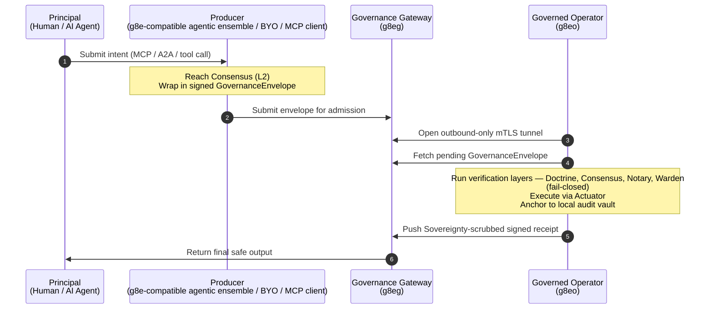
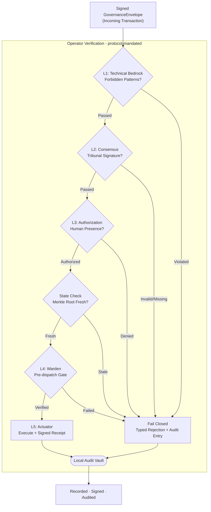
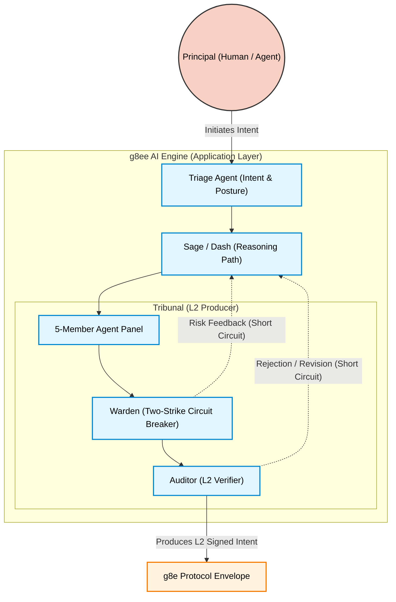

<div align="left">

# g8e

**Verify, then execute.**

g8e is a statically-compiled binary that provides agentic governance and state-mutation control. Binary sizes vary by platform and build option:
- **Standard build** (`make build`): 35-38MB per platform
- **Compressed build** (`make build-compressed`): 15-17MB per platform (Linux/Windows AMD64/ARM64); 35-38MB for macOS and Windows ARM64

The platform functions as the control plane (host-local policy decision) and the data plane (exclusive mutation executor). It utilizes mTLS for outbound communication and does not listen on inbound ports. Every action clears a fail-closed verification pipeline on the host and is committed to a git-backed ledger before execution. Raw data remains on the host; only scrubbed projections are transmitted.


[](LICENSE)
[](https://go.dev)
[](#status-v103---core-platform)
[](docs/core/position_paper.md)

[Getting Started](docs/guides/getting_started.md) · [Platform Roles](#platform-roles) · [Mental Model](#the-mental-model) · [Protocol](#the-protocol-invariants) · [Docs](#documentation)

</div>

---

## QuickStart

Installation and bootstrap instructions.

**Linux/macOS:**
```bash
# 1. Clone the repository
git clone https://github.com/g8e-ai/g8e.git
cd g8e

# 2. Build the binary
make build

# Or build with compression (smaller binaries)
make build-compressed

# 3. Start the Governance Gateway (g8eg)
./g8e gw start

# 4. Authenticate (first login automatically bootstraps the platform)
./g8e auth login

# 5. Verify the status
./g8e gw status
```

**Windows:**
```powershell
# 1. Clone the repository
git clone https://github.com/g8e-ai/g8e.git
cd g8e

# 2. Build the binary
.\build.ps1

# 3. Start the Governance Gateway (g8eg)
.\g8e.exe gw start

# 4. Authenticate (first login automatically bootstraps the platform)
.\g8e.exe auth login

# 5. Verify the status
.\g8e.exe gw status
```

See the [Full QuickStart Guide](docs/guides/getting_started.md) for mTLS, enrollment, and CLI configuration.

---

## Platform Roles

The g8e platform utilizes a single binary that operates in either Gateway mode or Operator mode.

- **g8e Gateway (g8eg)**: The central coordinator and Policy Decision Point (PDP). It manages the platform PKI, issues workload identities, enforces freshness, and provides replay defense. The gateway admits signed envelopes and manages the network-side record. It does not possess execution authority on managed hosts and cannot initiate connections to operators.
- **g8e Operator (g8eo)**: The host-resident authority and Policy Execution Point (PEP). It initiates outbound mTLS connections to the gateway to fetch pending envelopes. The operator performs local verification of all proofs against host state and serves as the exclusive executor of state mutations. It maintains a git-backed local audit ledger of all host activity.

The architectural separation ensures that the gateway proposes mutations while the operator executes them. Verification occurs on the host that maintains the consequences of the execution. This model removes the requirement for a trusted central authority to possess final execution power.

*Learn more: [Gateway Architecture](docs/architecture/gateway.md) · [Operator Architecture](docs/architecture/operator.md) · [Auth Architecture](docs/architecture/auth.md)*

---

## The mental model

g8e follows standard MCP topology with integrated BFT governance.


```mermaid
graph TD
    subgraph Clients ["Any AI client — agent-agnostic"]
        C1["MCP client<br/>(Claude / Cursor / Windsurf)"]
        C2["Agentic ensemble<br/>(A2A / tool calls)"]
    end

    GW["Governance Gateway · g8eg<br/>(Policy Decision Point)<br/>admits signed envelopes · owns PKI"]

    subgraph Fleet ["Sovereign hosts — platform-agnostic"]
        O1["Governed Operator · g8eo<br/>(Policy Execution Point)<br/>governs + executes locally"]
        D1[("Raw data + audit<br/>stay on host")]
        O1 --- D1
    end

    C1 -. "HTTP/mTLS<br/>universal endpoint" .-> GW
    C2 --> GW
    O1 -. "outbound-only mTLS" .-> GW
```

### Execution Flow

The sequence of a governed transaction execution:


```mermaid
sequenceDiagram
    autonumber
    participant Principal as Principal<br/>(Human / AI Agent)
    participant Ensemble as Producer<br/>(g8e-compatible agentic ensemble / BYO / MCP client)
    participant Gateway as Governance Gateway<br/>(g8eg)
    participant Operator as Governed Operator<br/>(g8eo)

    Principal->>Ensemble: Submit intent (MCP / A2A / tool call)
    Note over Ensemble: Reach Consensus (L2)<br/>Wrap in signed GovernanceEnvelope
    Ensemble->>Gateway: Submit envelope for admission

    Operator->>Gateway: Open outbound-only mTLS tunnel
    Operator->>Gateway: Fetch pending GovernanceEnvelope

    Note over Operator: Run verification layers — Doctrine, Consensus, Notary, Warden<br/>(fail-closed)<br/>Execute via Actuator<br/>Anchor to local audit vault

    Operator->>Gateway: Push Sovereignty-scrubbed signed receipt
    Gateway->>Principal: Return final safe output
```

*Learn more: [Protocol Specification](docs/architecture/g8e.md) · [MCP Protocol](docs/protocols/mcp/mcp.md) · [A2A Protocol](docs/protocols/a2a/a2a.md)*

---

## Governance Layers

Every mutation passes through sequential verification layers at the operator boundary. Transactions that fail verification are rejected and audited.


```mermaid
graph TD
    Start["Signed GovernanceEnvelope<br/>(Incoming Transaction)"]

    subgraph Verification ["Operator Verification - protocol-mandated"]
        direction TB
        L1{"L1: Technical Bedrock<br/>Forbidden Patterns?"}
        L2{"L2: Consensus<br/>Tribunal Signature?"}
        L3{"L3: Authorization<br/>Human Presence?"}
        State{"State Check<br/>Merkle Root Fresh?"}
        L4{"L4: Warden<br/>Pre-dispatch Gate"}
        
        FailClosed["Fail Closed<br/>Typed Rejection + Audit Entry"]
        Actuator["L5: Actuator<br/>Execute + Signed Receipt"]
        LocalVault([Local Audit Vault])

        L1 -- "Passed" --> L2
        L1 -- "Violated" ----> FailClosed
        
        L2 -- "Passed" --> L3
        L2 -- "Invalid/Missing" ---> FailClosed
        
        L3 -- "Authorized" --> State
        L3 -- "Denied" --> FailClosed
        
        State -- "Fresh" --> L4
        State -- "Stale" --> FailClosed

        L4 -- "Verified" --> Actuator
        L4 -- "Failed" --> FailClosed

        Actuator --> LocalVault
        FailClosed --> LocalVault
    end

    LocalVault --> Done["Recorded · Signed · Audited"]

    Start --> L1
```

| Layer | Name | Mechanism | Verification Target |
| :---: | --- | --- | --- |
| **L1** | **L1Doctrine** | Forbidden patterns and MITRE heuristics | Technical policy compliance and threat detection. |
| **L2** | **L2Consensus** | Ed25519 k-of-n signatures | Multi-agent consensus over transaction intent. |
| **L3** | **L3Notary** | WebAuthn or mTLS certificate | Explicit human authorization for the transaction hash. |
| **L4** | **L4Warden** | Pre-dispatch verification gate | Structural integrity, hash validity, and state freshness. |
| **L5** | **L5Actuator** | Atomic dispatch and signed receipt | Execution of the mutation and production of an immutable receipt. |

*Learn more: [Governance Protocol](docs/architecture/g8e.md) · [Constants Reference](docs/reference/constants.md) · [Glossary](docs/reference/glossary.md)*

---

## AI Engine (g8ee)

The AI Engine (g8ee) is an application-layer adapter that generates signed `GovernanceEnvelope` transactions. This component was removed from the core g8e platform and is currently in development as a separate repository. It implements an agentic hierarchy for intent translation.


```mermaid
graph TD
    classDef principal fill:#f9d0c4,stroke:#333,stroke-width:2px,color:#000;
    classDef engine fill:#e1f5fe,stroke:#0288d1,stroke-width:2px,color:#000;
    classDef protocol fill:#fff3e0,stroke:#f57c00,stroke-width:2px,color:#000;

    Principal(("Principal (Human / Agent)")):::principal

    subgraph Engine ["g8ee AI Engine (Application Layer)"]
        direction TB
        Triage["Triage Agent (Intent & Posture)"]:::engine
        Reasoner["Sage / Dash (Reasoning Path)"]:::engine
        
        subgraph Tribunal ["Tribunal (L2 Producer)"]
            direction TB
            Panel["5-Member Agent Panel"]:::engine
            Warden["Warden (Two-Strike Circuit Breaker)"]:::engine
            Auditor["Auditor (L2 Verifier)"]:::engine
            
            Panel --> Warden
            Warden --> Auditor
        end
        
        Triage --> Reasoner
        Reasoner --> Panel
        
        %% Short Circuits (Feedback Loops)
        Warden -. "Risk Feedback (Short Circuit)" .-> Reasoner
        Auditor -. "Rejection / Revision (Short Circuit)" .-> Reasoner
    end

    Principal -- "Initiates Intent" --> Triage
    Auditor -- "Produces L2 Signed Intent" --> Protocol["g8e Protocol Envelope"]:::protocol
```

**Hierarchy Components:**
- **Triage and Dash**: Agents for routing, posture assessment, and high-speed responses.
- **Sage (Reasoning Engine)**: Primary interpreter of user intent. Sage proposes actions but cannot execute them; it must submit intent to the Tribunal.
- **Tribunal (Consensus)**: Independent agents that generate command proposals. Execution requires a quorum (2/5 or 5/5).
- **Warden (Circuit Breaker)**: Heuristic filter that rejects proposals violating security constraints.
- **Auditor (History and Grounding)**: Verification layer that reviews the investigation history before signing the protocol envelope.

*Learn more: [Build Applications](docs/guides/build_apps.md) · [Connect Apps to Gateway](docs/guides/connect_apps_to_gateway.md) · [Developer Docs](docs/devs/)*

---

## The Protocol Invariants

- **GovernanceEnvelope**: The single canonical container for every mutation.
- **Hash-based Integrity**: `id == SHA-256(canonical_fields)`. Wire format is canonical JSON (protojson).
- **Zero Ambient Context**: Session IDs and identity are body-embedded; no implicit authority.
- **Outbound-Only mTLS**: Operators dial out; zero inbound ports required on the host.
- **Sovereignty Boundary**: Automated scrubbing/rehydration ensures raw data never leaves the host.
- **No Backward Compatibility**: Rip and replace. Stale formats or unsigned inputs are rejected.

*Learn more: [Protocol Specification](docs/architecture/g8e.md) · [API Reference](docs/reference/api/) · [Constants](docs/reference/constants.md)*

---

## Status: v1.0.3 - Core Platform

g8e is the mandatory governance platform. Agent ensembles and Dashboard (g8ed) are optional application-layer adapters.

**Operational Today**
- **Universal Protocol Translation**: Intercept MCP/A2A tool calls into signed envelopes.
- **BFT Governance**: Fail-closed L1/L2/L3/L4 verification paths.
- **Sovereign Execution**: Git-backed ledger and host-local audit vault.
- **mTLS Reverse Tunnels**: Secure connectivity for firewalled/air-gapped hosts.
- **L3 Notary**: Out-of-band human-in-the-loop authorization (CLI/WebAuthn).
- **Data Sovereignty**: Automated PII scrubbing and local forensic persistence.

**In Development**
- **RBAC**: Granular role-based access control.
- **Complex Policy**: Dynamic intent allowlisting and advanced L1 heuristics.
- **Multi-tenancy**: Organization partitioning and tenant isolation.

---

## Documentation

- **[Getting Started](docs/guides/getting_started.md)** · **[Position Paper](docs/core/position_paper.md)**
- **[Protocol](docs/architecture/g8e.md)** · **[Operator (g8eo)](docs/architecture/operator.md)** · **[Gateway (g8eg)](docs/architecture/gateway.md)** · **[Auth](docs/architecture/auth.md)**
- **[MCP Protocol](docs/protocols/mcp/mcp.md)** · **[A2A Protocol](docs/protocols/a2a/a2a.md)**
- **[CLI Guide](docs/guides/cli.md)** · **[Air Gap Deployment](docs/guides/air_gap.md)**
- **[Build Gateway](docs/guides/build_gateway.md)** · **[Build Operator](docs/guides/build_operator.md)**
- **[Connect Apps to Gateway](docs/guides/connect_apps_to_gateway.md)** · **[Connect Operator to Gateway](docs/guides/connect_operator_to_gateway.md)**
- **[Glossary](docs/reference/glossary.md)** · **[Constants](docs/reference/constants.md)** · **[API Reference](docs/reference/api/)**
- **[Developer Docs](docs/devs/)** · **[Contributing](CONTRIBUTING.md)**

---

## License

Apache 2.0. See [LICENSE](LICENSE). Built by [Lateralus Labs](https://lateraluslabs.com).
