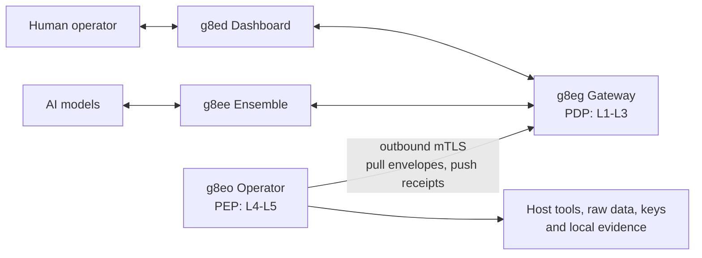

<!-- Generated by scripts/generate_readme.py. Do not edit README.md directly. Source: docs/templates/README.md.tmpl and docs/evidence/readme/current/. -->
# g8e

**Govern AI data. Verify AI execution. Keep custody at the edge.**

[](LICENSE) [](https://github.com/g8e-ai/g8e/actions/workflows/build-and-test.yml) [](docs/reference/fips140-3.md) [](protocol/docs/mcp.md)

g8e is an AI data and execution governance suite. It places a fail-closed control plane between AI systems and the infrastructure they use, so models can reason over governed context without receiving direct authority over hosts, raw data, or long-lived credentials.

Every governed mutation is a typed, signed, state-bound `GovernanceEnvelope`. The Gateway admits it, the Operator independently verifies it, the Actuator executes it at the data owner’s boundary, and the platform records signed evidence of the result.

[Get started](docs/guides/getting_started.md) · [Run the full suite](docs/guides/unified_stack.md) · [Architecture](docs/architecture/overview.md) · [Proof-backed compliance](docs/reference/compliance-evidence.md) · [Protocol](protocol/docs/spec.md)

## Proof, not promises

g8e separates measured evidence from architecture claims. Published results remain scoped to the exact artifacts, versions, environments, and trust inputs that produced them.

| Proof | Published result | Boundary |
| --- | --- | --- |
| [Clean offline compliance verification](docs/release_notes/v2.1.x/v2.1.7-offline-acceptance.md) | A fresh network-disabled, read-only container reproduced a signed compliance bundle and passed all 10 verification checks. Four protected-source, renderer, and signature mutations failed closed. | One v2.1.7 candidate and one point-in-time assessment scope. This is not certification or recurring operating effectiveness. |
| [Current public eval snapshot](#current-public-eval-snapshot) | Two complete five-task runs retain all 10 terminal attempts and produce a 7/10 verified deterministic result. | A curated instruction-following diagnostic on one local operator environment. It contains no receipt-bearing mutation or governance evidence. |
| [Compliance evidence model](docs/reference/compliance-evidence.md) | 13 typed control assertions, 14 evidence-grade scenarios, and 131 explicitly classified FedRAMP 20x and NIST SP 800-53 controls, including 97 unsupported controls. | Catalog and verifier coverage do not imply customer compliance, authorization, or external attestation. |
| [Live CI](https://github.com/g8e-ai/g8e/actions/workflows/build-and-test.yml) | Build and test status is published as a live external signal. | Live CI is not frozen release evidence. |

The repository does not publish a zero-leakage, certification, broad model-quality, or production-suitability claim without evidence that supports that exact statement.

## Run the suite

The unified stack starts the four components, enrolls the first owner, and walks through workload approval.

```bash
make build
./g8e docker build
./g8e docker start --full
```

The default deployment exposes the Gateway API and console, g8ee API, and g8ed dashboard. Workloads remain unready until the owner approves their exact enrollment requests. See the [Unified Docker Stack guide](docs/guides/unified_stack.md) for prerequisites, ports, non-default topology, and manual enrollment.

## Four components, one governance boundary

| Component | Responsibility | Trust position |
| --- | --- | --- |
| **g8eg, Governance Gateway** | Policy Decision Point for identity, PKI, policy admission, L1 Doctrine, L2 Consensus, L3 Notary, routing, and platform APIs. | Core. Coordinates governance but cannot bypass Operator verification. |
| **g8eo, Governed Operator** | Policy Execution Point on each managed host. Pulls work over outbound mTLS, runs L4 Warden and L5 Actuator, and stores local receipts and state evidence. | Core. Sole authority for mutation at the data owner’s boundary. |
| **g8ee, Agentic Ensemble** | First-party multi-agent reasoning application. Converts requests into governed intent, uses separated reasoning and command-generation stages, and publishes typed progress and results. | Untrusted application. Proposes actions but never authorizes or executes them directly. |
| **g8ed, Dashboard** | First-party browser interface for passkey authentication and live platform events, with UI modules for chat, approvals, audit, settings, and operator workflows. | Untrusted interface. Observes and requests through Gateway surfaces without execution authority. |

g8eg and g8eo share one statically linked Go binary running in separate modes. g8ee is a Python service, and g8ed is a framework-free JavaScript application served by Node.js. All four ship in this repository and run through the same root deployment workflow.

## How it works


```mermaid
flowchart LR
    Human["Human operator"] <--> Dashboard["g8ed Dashboard"]
    Models["AI models"] <--> Ensemble["g8ee Ensemble"]
    Dashboard <--> Gateway["g8eg Gateway\nPDP: L1-L3"]
    Ensemble <--> Gateway
    Operator["g8eo Operator\nPEP: L4-L5"] -- "outbound mTLS\npull envelopes, push receipts" --> Gateway
    Operator --> Data["Host tools, raw data, keys\nand local evidence"]
```

1. A user, AI client, application, or g8ee submits intent through an authenticated Gateway surface.
2. g8eg binds identity, state, replay controls, and the active governance posture to the transaction.
3. L1 Doctrine always applies. L2 Consensus and L3 Notary become required gates when the selected posture requires them.
4. g8eo pulls the envelope over outbound mTLS and re-verifies its hash, signatures, nonce, expiry, state root, and required proofs.
5. L5 executes through the single Actuator boundary, rehydrates protected values on-host, and persists signed execution and final receipts.

Read the [governance architecture](docs/architecture/governance.md) for posture semantics and the [protocol specification](protocol/docs/spec.md) for the canonical wire contract.

## What the boundary enforces

- **Data custody stays local.** Raw data, vault keys, execution state, and authoritative audit evidence remain with the Operator host. Models receive scrubbed projections and commitments.
- **Execution is host-authorized.** The Gateway proposes admitted work; the Operator independently re-verifies it before any side effect.
- **Operators are outbound-only.** g8eo opens an mTLS connection to g8eg and listens on no inbound management port.
- **Mutations are state-bound and replay-resistant.** Envelopes bind typed intent to identity, target, state root, nonce, expiry, and policy evidence.
- **Human approval is transaction-bound.** Required L3 approvals use WebAuthn or signed CLI proofs over the transaction hash.
- **Receipts precede and follow execution.** The Actuator signs and persists execution evidence before dispatch and records the final outcome with durable-persistence evidence.

The boundary governs operations that traverse g8e. It does not sandbox an AI client or govern native tools and side channels that remain enabled outside the platform. See [AI agents and the governance boundary](docs/architecture/agents.md).

## Bring your own AI

g8ee is the first-party ensemble, not a Gateway dependency. g8eg also accepts compatible clients and services through:

- [MCP](protocol/docs/mcp.md) for governed tools, resources, prompts, and supported coding-agent launch flows.
- [A2A](protocol/docs/a2a.md) for typed agent-to-agent skill invocation.
- [Native applications](docs/guides/connect_apps_to_gateway.md) using workload identity and canonical envelopes.
- [The Go and Python protocol libraries](docs/architecture/protocol.md) for shared schemas, constants, and identity helpers.

## Deploy where the data lives

The Gateway can run in the cloud, on-premises, or in a hybrid topology. Operators run beside the systems they govern and support Linux, macOS, and Windows targets on amd64 and arm64. The repository includes Docker deployment, remote Operator enrollment, air-gap workflows, deterministic demonstrations, and the evidence pipeline used for compliance reporting.

| Start here | Purpose |
| --- | --- |
| [Unified stack](docs/guides/unified_stack.md) | Run g8eg, g8eo, g8ee, and g8ed together. |
| [Gateway](docs/architecture/gateway.md) | Understand policy admission, identity, PKI, and client surfaces. |
| [Operator](docs/architecture/operator.md) | Understand outbound execution, host tools, and local evidence. |
| [g8ee](docs/ensemble/index.md) | Configure and evaluate the first-party agentic ensemble. |
| [g8ed](docs/dashboard/index.md) | Run and extend the first-party dashboard. |
| [Compliance evidence](docs/reference/compliance-evidence.md) | Inspect assertions, evidence levels, scenarios, verification, and claim boundaries. |
| [Sovereignty Gauntlet](docs/guides/sovereignty_gauntlet.md) | Reproduce the evidence-oriented demonstration workflow. |

## Current public eval snapshot

The following section is generated from the checksum-bound public snapshot in `docs/evidence/readme/current/`. The generator validates artifact checksums, schemas, relationships, eligibility, and closed claim labels before rendering. It refuses to turn missing or contradictory evidence into a pass.

<details>
<summary>Inspect machine-generated eval evidence and reproduction details</summary>

### Evidence Identity

**Stage 2: Reproduction and provenance.** This snapshot compares the complete original diagnostic with one fresh, separately invoked reproduction and binds the reproduction to a versioned campaign profile, deterministic source inclusion manifest, component and image digests, and public environment identities. The original run remains Stage 1. Both executions used the same local operator environment, so this establishes independent execution state rather than independent hardware, organizational control, trust roots, or external audit. No causal or statistical attribution is supported.

| Property | Value |
| --- | --- |
| Evidence cutoff | 2026-09-07T13:03:14.209059Z |
| Platform version | 2.1.6 |
| Publication schema | 3.0.0 |
| README evidence version | 3.0.0 |
| Eval schema version | 1.40.0 |
| Suite version | 5eee4bb14500 |
| Selected eval runs | 53af9df7-2d37-4d76-9d1d-4a5a6687874a, e4e947da-b48f-49eb-9211-898cbe747018 |
| Selected demo runs |  |
| Source revision | (not populated) |
| Source tree hash | (not populated) |
| Dataset hash | 5eee4bb145007b67e3fe38899fc18a49a8b29b1d6ad844c76a160795bc9b6d37 |
| Grader hash | 943ae5f7268138a30034bc466aeae76a3f493e000e1791be0066aaa3d83c6092 |
| Prompt hash | bb1e3aa6ac6d43703b765ba67975a30c7124232cee0105d90e0b4f5c5d3ff62d |
| Model cohort | assistant=ollama/gemma4:e4b; lite=ollama/gemma4:e2b; primary=ollama/gemma4:12b |
| Receipt verifier scope | canonical receipt signatures and final-persistence attestations |

#### Configured and Observed Model Roles

Configured role mappings come from the public manifest. A role is labeled observed only when retained provider-boundary stage telemetry matches its configured provider and model.

| Role | Provider | Model | Endpoint class | Observation | Sources |
| --- | --- | --- | --- | --- | --- |
| primary | ollama | gemma4:12b | self-hosted-lan | Observed model call | [manifest.json](docs/evidence/readme/current/eval/runs/e4e947da-b48f-49eb-9211-898cbe747018/manifest.json); [stages.jsonl](docs/evidence/readme/current/eval/runs/e4e947da-b48f-49eb-9211-898cbe747018/stages.jsonl) |
| assistant | ollama | gemma4:e4b | self-hosted-lan | Observed model call | [manifest.json](docs/evidence/readme/current/eval/runs/e4e947da-b48f-49eb-9211-898cbe747018/manifest.json); [stages.jsonl](docs/evidence/readme/current/eval/runs/e4e947da-b48f-49eb-9211-898cbe747018/stages.jsonl) |
| lite | ollama | gemma4:e2b | self-hosted-lan | Observed model call | [manifest.json](docs/evidence/readme/current/eval/runs/e4e947da-b48f-49eb-9211-898cbe747018/manifest.json); [stages.jsonl](docs/evidence/readme/current/eval/runs/e4e947da-b48f-49eb-9211-898cbe747018/stages.jsonl) |

#### Configured and Observed Model Roles

Configured role mappings come from the public manifest. A role is labeled observed only when retained provider-boundary stage telemetry matches its configured provider and model.

| Role | Provider | Model | Endpoint class | Observation | Sources |
| --- | --- | --- | --- | --- | --- |
| primary | ollama | gemma4:12b | self-hosted-lan | Observed model call | [manifest.json](docs/evidence/readme/current/eval/runs/53af9df7-2d37-4d76-9d1d-4a5a6687874a/manifest.json); [stages.jsonl](docs/evidence/readme/current/eval/runs/53af9df7-2d37-4d76-9d1d-4a5a6687874a/stages.jsonl) |
| assistant | ollama | gemma4:e4b | self-hosted-lan | Observed model call | [manifest.json](docs/evidence/readme/current/eval/runs/53af9df7-2d37-4d76-9d1d-4a5a6687874a/manifest.json); [stages.jsonl](docs/evidence/readme/current/eval/runs/53af9df7-2d37-4d76-9d1d-4a5a6687874a/stages.jsonl) |
| lite | ollama | gemma4:e2b | self-hosted-lan | Observed model call | [manifest.json](docs/evidence/readme/current/eval/runs/53af9df7-2d37-4d76-9d1d-4a5a6687874a/manifest.json); [stages.jsonl](docs/evidence/readme/current/eval/runs/53af9df7-2d37-4d76-9d1d-4a5a6687874a/stages.jsonl) |

#### Stage 2 Reproduction Comparison

The fixed profile is recorded in [campaign-profile.json](docs/evidence/readme/current/stage2/campaign-profile.json), reproduction source and runtime provenance in [provenance.json](docs/evidence/readme/current/stage2/provenance.json), and the complete task-level comparison in [comparison.json](docs/evidence/readme/current/stage2/comparison.json). No causal or statistical attribution is made for observed differences.

| Execution | Maturity | Run ID | Deterministic result | Population |
| --- | --- | --- | --- | --- |
| Original | Stage 1 | e4e947da-b48f-49eb-9211-898cbe747018 | 4/5 | Complete five-task population |
| Reproduction | Stage 2 | 53af9df7-2d37-4d76-9d1d-4a5a6687874a | 3/5 | Complete five-task population |

Reproduction source state: `53b0135b0cb6965f27a25d94487f0d2b7f314dac301208a9366dadc4fb2ea054`. Bound components: 2. Bound images: 4. Same local operator environment: yes.

### Eval Metrics

Metrics aggregate eligible, verified observations from the selected eval runs. Values link to the metrics artifact in `docs/evidence/readme/current/`.

| Metric | Version | Arm | Unit | Value | Denominator | Rate | Status | Tasks |
| --- | --- | --- | --- | --- | --- | --- | --- | --- |
| [ifeval_subset_verifier](docs/evidence/readme/current/eval/runs/e4e947da-b48f-49eb-9211-898cbe747018/metrics.jsonl) | 1.0.0 | doctrine | boolean | 7 | 10 | 70.0% | verified | 10 |

The following candidate metrics are absent from the selected evidence and are omitted: receipt_integrity, protocol_chain, policy_outcome, final_state_accuracy, canary_scrubbing, independent_state_accuracy, model_boundary_raw_secret_rate, exact_local_rehydration, secret_detection_precision, secret_detection_recall, unauthorized_mutation.

#### Attempt Outcomes

| Status | Count |
| --- | --- |
| completed | 10 |

Assigned task definitions: [tasks.jsonl](docs/evidence/readme/current/eval/runs/e4e947da-b48f-49eb-9211-898cbe747018/tasks.jsonl). Population and terminal outcomes: [attempts.jsonl](docs/evidence/readme/current/eval/runs/e4e947da-b48f-49eb-9211-898cbe747018/attempts.jsonl). Observed model-call telemetry: [stages.jsonl](docs/evidence/readme/current/eval/runs/e4e947da-b48f-49eb-9211-898cbe747018/stages.jsonl). Derived orientation summary: [summary.json](docs/evidence/readme/current/eval/runs/e4e947da-b48f-49eb-9211-898cbe747018/summary.json). Private-evidence hash metadata: [evidence-index.jsonl](docs/evidence/readme/current/eval/runs/e4e947da-b48f-49eb-9211-898cbe747018/evidence-index.jsonl).

### Receipt Verification

**Receipt evidence is unavailable for this Stage 2 comparison.** The answer-only tasks produced zero receipts, so this evidence supports no receipt-signature, mutation, persistence, or state claim.


### Governance and State Proof

**Governance and state evidence is unavailable for this Stage 2 comparison.** The answer-only evidence contains no eligible receipt-bound mutation, persistence, independently observed state, or compliance evidence.


### Independently Verified Demonstrations

No demo verification reports in the selected snapshot.


### CI and Reproducibility

CI status is a live external signal, not a frozen pass claim.

| Link | Kind |
| --- | --- |
| [CI](https://github.com/g8e-ai/g8e/actions/workflows/build-and-test.yml) | workflow_status |
| [Latest Release](https://github.com/g8e-ai/g8e/releases) | release_link |

The portable Stage 2 profile is recorded in [campaign-profile.json](docs/evidence/readme/current/stage2/campaign-profile.json) and its executed substitutions and provenance bindings are recorded in [reproduction-manifest.json](docs/evidence/readme/current/eval/runs/53af9df7-2d37-4d76-9d1d-4a5a6687874a/reproduction-manifest.json). Set `OLLAMA_ENDPOINT`, `PRIMARY_MODEL`, `ASSISTANT_MODEL`, and `LITE_MODEL` to values reachable by the process running `g8e-evals`; substitutions remain comparable only when recorded and are not byte-identical model reproductions.

Local verification commands:

```bash
# Regenerate the README from the selected proof snapshot
make readme

# Check that README.md is up to date without modifying files
make readme-check

# Run platform unit and integration tests
./g8e test unit
./g8e test integration

# Run eval tests
make evals-test-unit
make evals-test-integration

# Run lint
make lint
```

**Evidence caveats**
- The original run remains Stage 1; stronger source, component, image, and environment provenance applies only to the fresh Stage 2 reproduction.
- The two complete five-task populations support a deterministic reproduction comparison, not causal attribution, statistical significance, broad model quality, or independent external validation.
- Both executions used the same local operator environment; independent execution state does not establish independent hardware, organizational control, trust roots, or audit.
- Both answer-only campaigns produced zero receipts and support no receipt, mutation, persistence, state, governance, or compliance claim.

</details>

## Build and contribute

```bash
./g8e test unit
./g8e test integration
make ensemble-test
make dashboard-test
make readme-check
```

See [CONTRIBUTING.md](.github/CONTRIBUTING.md) and the [developer guide](docs/devs/devs.md). The root README is generated by `scripts/generate_readme.py`; stable narrative changes belong in this template, and reviewed evidence changes belong in `docs/evidence/readme/current/`.

## Pilots and partnerships

Lateralus Labs works with teams evaluating governed AI execution, sovereign data workflows, and proof-backed compliance reporting. Contact [danny@lateraluslabs.com](mailto:danny@lateraluslabs.com).

---

Business Source License 1.1. Converts to Apache 2.0 on 2030-08-18. Built by Lateralus Labs.
