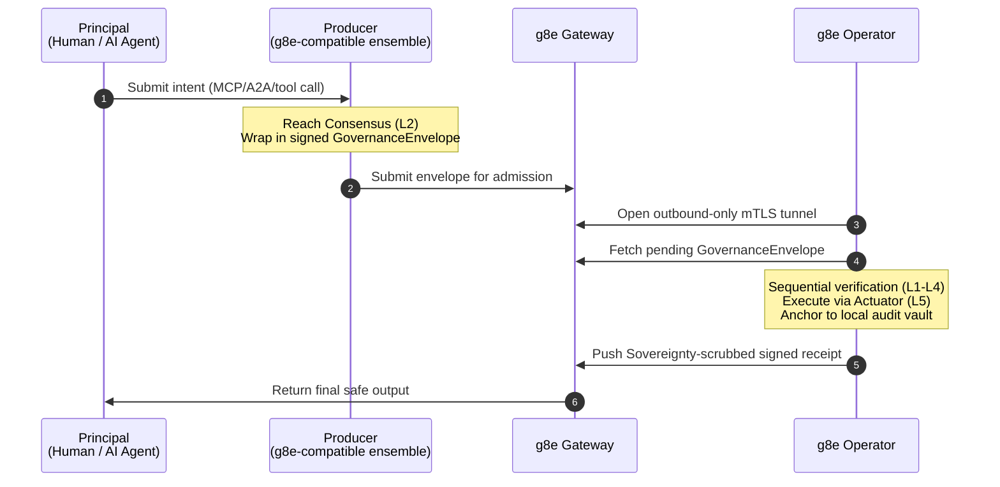

<div align="left">

# g8e

## Governance Architecture for Autonomous Agents in Trustless Environments

[](LICENSE) [](https://go.dev) [](https://github.com/g8e-ai/g8e/actions/workflows/build-and-test.yml) [](https://goreportcard.com/report/github.com/g8e-ai/g8e) [](https://github.com/g8e-ai/g8e/releases) [](#status-v1010--core-platform) [](docs/reference/compliance-alignment.md) [](docs/protocols/mcp/mcp.md) [](docs/architecture/protocol.md)

</div>

**g8e** is a provider-agnostic and domain-agnostic protocol, gateway, and client delivered in a single ~20MB binary. It cryptographically binds JSON payloads to local state with immutable audit trails and protocol-level policy controls. The platform implements Byzantine consensus where the user, AI, and operator sovereignly manage their respective roles under a verify-then-execute trust model.

### Platform Invariants

* **Cryptographic Binding**: Binds JSON payloads to local host state with immutable audit trails.
* **Structural Consensus**: Structural consensus provided by a third-party agentic system.
* **Human Authorization**: WebAuthn and FIDO2 signing for authoritative human sign-off.
* **Just-in-Time Security**: Narrowly defined JIT scope with mTLS enforcement across all communication.
* **Data Sovereignty**: All data remains local; the platform saves no identifying information.
* **Provider Agnostic**: Supports switching AI providers without context loss through cryptographically provable chain sections.
* **Zero-Dependency Operators**: Remote operators are pre-compiled binaries with no dependencies, running on Linux, macOS, and Windows.
* **Outbound-Only Connectivity**: Operators connect to the gateway via outbound-only mTLS tunnels; no inbound ports or root privileges are required.
* **Multi-Host Orchestration**: All native tools support multi-host execution, enabling AI agents to run MCP tools across remote fleets without client installation or increased host-level security risk.

[Position Paper](docs/core/position_paper.md) · [MCP Protocol](docs/protocols/mcp/mcp.md) · [A2A Protocol](docs/protocols/a2a/a2a.md) · [Architecture](docs/architecture/gateway.md) · [Compliance](docs/reference/compliance-alignment.md) · [Quickstart](#quickstart)

</div>

## The Problem: Capability vs. Authority

Standard protocols establish **capability** (an agent *can* act) but ignore **authority** (whether an action is *safe* to run on a specific host). Traditional solutions like token dashboards or single-model reflection fail because they lack state-awareness, structural independence, and hardware-backed verification.

## QuickStart

g8e is a single-binary platform. No runtime, no interpreter, no sidecar.

### 1. Install & Start Gateway

Use the auto-detecting setup command or OS-specific scripts:

```bash
# Auto-detect and setup
./g8e setup

# OR manual build
make build
./g8e gw start
```

**Platform Setup Scripts:**
* **Linux**: `./scripts/linux-setup.sh`
* **macOS**: `./scripts/macos-setup.sh`
* **Windows**: `pwsh -ExecutionPolicy Bypass -File scripts/windows-setup.ps1`

### 2. Deploy Operators

Deploy to remote hosts via SSH. Operators dial *back* to your gateway; no inbound firewall changes required.

```bash
# Deploy to your fleet using existing SSH config
./g8e operator deploy --hosts host1,host2,host3
```

*See the [full QuickStart](docs/guides/getting_started.md) for mTLS configuration and enrollment.*

---

## Architecture: One Binary, Two Roles

g8e folds protocol translation, governance, and execution into a single statically-linked artifact (~20MB) with no external dependencies.

*   **g8e Gateway**: The **Policy Decision Point**. It admits signed envelopes, manages PKI, and provides a central audit view. Use it locally as a **Sovereign MCP Server** to bridge AI tools to local state.
*   **g8e Operator**: The **Policy Execution Point**. Deployed via SSH to remote fleets, it listens on *no inbound ports*, dialing out to the Gateway via mTLS. It maintains **LFAA (Log File Audit Availability)**—ensuring a high-fidelity audit trail remains at the site of execution.

### The Host-Local Gauntlet (L1-L5)

Every mutation passes through sequential verification layers at the Operator boundary. Compromising any single layer is not enough to cause an unauthorized mutation.

| Layer | Name | Mechanism | Proof Objective |
| --- | --- | --- | --- |
| **L1** | **Doctrine** | Reflected `forbidden_patterns` + MITRE ATT&CK heuristics | The action trips no hard gate (e.g., reverse shells, destructive disk ops). |
| **L2** | **Consensus** | Ed25519 k-of-n over the transaction hash | An independent, heterogeneous model ensemble co-signed the intent. |
| **L3** | **Notary** | WebAuthn (web sessions) / mTLS cert fingerprint (CLI/operator sessions) | A human authorized *this exact transaction hash*, not just a session. |
| **L4** | **Warden** | Pre-dispatch verification gate | Hash integrity, temporal freshness, state binding, and signer trust hold true. |
| **L5** | **Actuator** | Single fail-closed dispatch path | Mutates the host and emits a signed, Sovereignty-scrubbed `ActionReceipt`. |


```mermaid
sequenceDiagram
    autonumber
    participant Principal as Principal<br/>(Human / AI Agent)
    participant Ensemble as Producer<br/>(g8e-compatible ensemble)
    participant Gateway as g8e Gateway
    participant Operator as g8e Operator

    Principal->>Ensemble: Submit intent (MCP/A2A/tool call)
    Note over Ensemble: Reach Consensus (L2)<br/>Wrap in signed GovernanceEnvelope
    Ensemble->>Gateway: Submit envelope for admission

    Operator->>Gateway: Open outbound-only mTLS tunnel
    Operator->>Gateway: Fetch pending GovernanceEnvelope

    Note over Operator: Sequential verification (L1-L4)<br/>Execute via Actuator (L5)<br/>Anchor to local audit vault

    Operator->>Gateway: Push Sovereignty-scrubbed signed receipt
    Gateway->>Principal: Return final safe output

```

---

## The Stance

We hold this without hedging: **runtime governance and audit for AI agents are public goods, and gating them behind a paywall is incompatible with a safe AI-powered world.**

If safety is a premium SKU, the cheapest path to shipping an agent is always the ungoverned one. For governance to be the default, it must be free. As agents grow more capable, the baseline for real-world infrastructure mutations must be heterogeneous consensus plus a cryptographic human signoff upstream.

g8e is not an agent. It is the mandatory, open-source substrate agents must run on to be viable in production infrastructure.

---

## Status: v1.0.11 - Multi-Industry Demo Suite Release

**Operational today:**

* Universal protocol translation (MCP/A2A intercepted into signed envelopes).
* Fail-closed verification (L1, L2, L4).
* L3 Notary (WebAuthn / mTLS human authorization).
* Sovereign execution (git-backed ledger & local vault) with data sovereignty (PII/secret scrubbing).
* Outbound-only mTLS for firewalled/air-gapped hosts.
* SSH deployment & Fan-out execution across remote fleets.
* Native Windows support parity.

**In development:**

* RBAC & Multi-tenancy.
* Complex policy (dynamic intent allowlisting).
* Gateway federation & agentic mesh gossiping.

---

## Example: GovernanceEnvelope with MCP Payload

Below is a complete example of a `GovernanceEnvelope` wrapping an MCP tool call (`fs_read`), demonstrating all fields including L1/L2/L3 governance proofs:

```json
{
  "id": "a1b2c3d4e5f6a1b2c3d4e5f6a1b2c3d4e5f6a1b2c3d4e5f6a1b2",
  "timestamp": "2026-06-02T18:27:00Z",
  "expiresAt": "2026-06-02T18:32:00Z",
  "sourceComponent": "COMPONENT_CLIENT",
  "operatorId": "op-prod-12345",
  "operatorSessionId": "sess-abc-789",
  "webSessionId": "web-xyz-456",
  "cliSessionId": "",
  "eventType": "g8e.v1.operator.mcp.call.requested",
  "payload": "CgZmc19yZWFkEglleGVjLTIwMzUSCgoZmlsZTovLy9ob21lL3VzZXIvcmVhZG1lLm1kGgZzY3J1Yg==",
  "intentData": {
    "tool": "fs_read",
    "path": "/home/user/readme.md",
    "reason": "Read deployment documentation"
  },
  "actionType": "MCP_CALL",
  "targetResource": "file:///home/user/readme.md",
  "stateMerkleRoot": "abc123def456abc123def456abc123def456abc123def456abc123def456abc1",
  "nonce": "nonce-1717358820000-abc123",
  "transactionHash": "a1b2c3d4e5f6a1b2c3d4e5f6a1b2c3d4e5f6a1b2c3d4e5f6a1b2",
  "protocolVersion": "1.0",
  "governance": {
    "l1": {
      "validated": true,
      "violations": []
    },
    "l2": {
      "consensusSignature": "4a5b6c7d8e9f0a1b2c3d4e5f6a1b2c3d4e5f6a1b2c3d4e5f6a1b2c3d4e5f6a1b2...c3d4e5f6a1b2c3d4e5f6a1b2c3d4e5f6a1b2c3d4e5f6a1b2c3d4e5f6a1b2",
      "agentIds": ["agent-ensemble-1", "agent-ensemble-2", "agent-ensemble-3"],
      "keyId": "key-ensemble-prod-abc123"
    },
    "l3": {
      "proof": {
        "clientDataJson": "{\"challenge\":\"a1b2c3d4e5f6\",\"origin\":\"https://g8e.ai\",\"type\":\"webauthn.get\"}",
        "authenticatorData": "SZYN5YgOjGh0NBcPZHZgW4_krrmihjLHmVzzuoMdl2NFAAAAAQ",
        "signature": "MEUCIQDWn3x4e5f6a1b2c3d4e5f6a1b2c3d4e5f6a1b2c3d4e5f6a1b2c3d4e5f6a1b2IgE5f6a1b2c3d4e5f6a1b2c3d4e5f6a1b2c3d4e5f6a1b2c3d4e5f6a1b2c3d4e5f6a1b2",
        "credentialId": "abc123def456abc123def456abc123def456abc123def456abc123def456abc1",
        "mtlsCertFingerprint": "",
        "cliSignature": ""
      },
      "autoApproved": false
    },
    "gatewaySigned": false
  },
  "caseId": "case-deploy-456",
  "investigationId": "",
  "taskId": "task-readme-789",
  "systemFingerprint": "fp-linux-amd64-abc123",
  "tenantId": "tenant-prod-xyz",
  "bindingPersona": "default"
}
```

The `payload` field contains base64-encoded protobuf bytes of the `McpCallRequested` message, which includes the tool name (`fs_read`) and JSON arguments specifying the file path.

---

## Documentation

* [Getting Started](docs/guides/getting_started.md)
* [Architecture: Operator](docs/architecture/operator.md) · [Gateway](docs/architecture/gateway.md) · [Auth](docs/architecture/auth.md) · [Local Translation](docs/architecture/network.md)
* [Protocol Specification](docs/architecture/protocol.md) · [API Reference](docs/reference/)
* [Build a g8e Operator](docs/guides/build_operator.md)

---

*Built by Lateralus Labs. Licensed Apache 2.0.*
