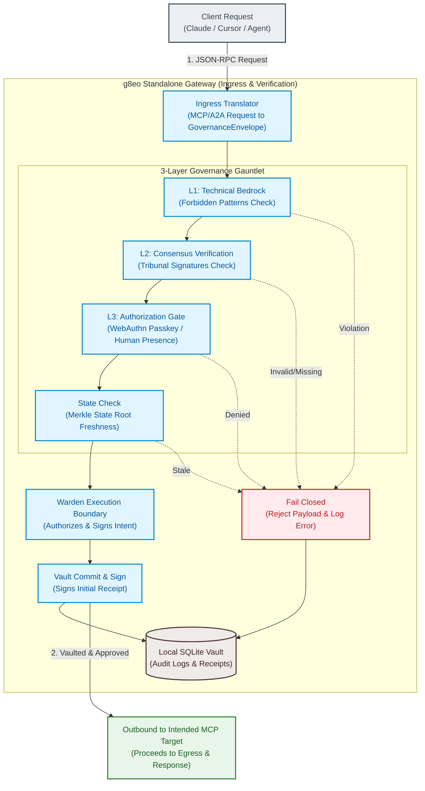
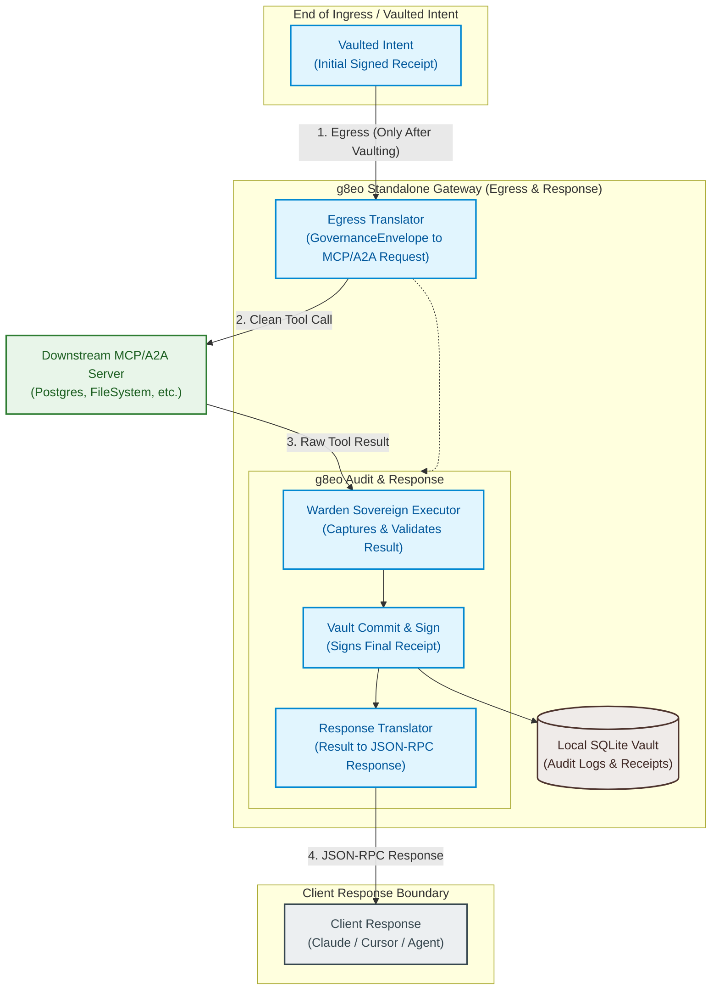
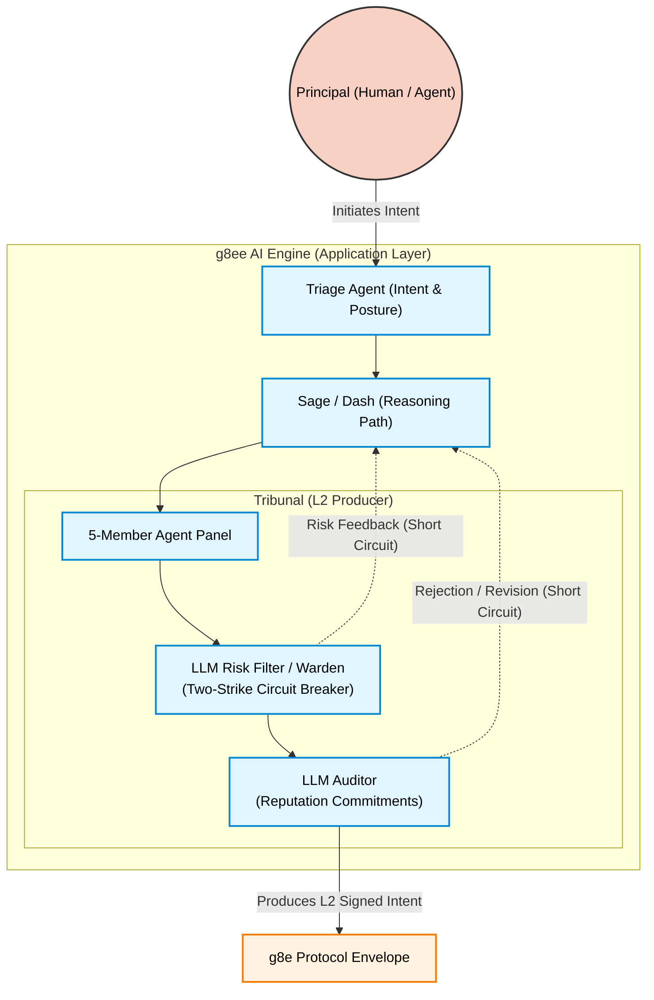

g8e: The Zero-Trust Substrate for Agentic Infrastructure
What is g8e?
g8e is a universal, zero-trust execution boundary and BFT protocol for AI agents. At its core, g8e physically separates an AI's intent generation from actual host execution. It is deployed as a tiny, sovereign Operator binary (g8eo) that drops onto any host, runs an isolated execution boundary, and dials out to the platform.

Instead of replacing emerging AI tool-calling standards like Anthropic's Model Context Protocol (MCP) or A2A, g8e acts as the Universal Translator and Security Envelope.

The Payload is Malleable: Any standard JSON-RPC tool request (like MCP) acts as the payload.

The Protocol is Absolute: g8e wraps that payload in a canonical UAP JSON GovernanceEnvelope.

Before a single bit moves on the host OS, the g8eo Operator strictly verifies this envelope—enforcing hardcoded L1 technical gates, L2 BFT consensus signatures, and an L3 hardware-bound human authorization. It never fails open.

Why g8e?
The industry's current trajectory for agentic automation is structurally broken. Giving a single LLM direct access to production is gross negligence, but relying on "Human-in-the-Loop" alert fatigue is operational suicide. Furthermore, bringing AI to secure environments typically requires punching massive, dangerous inbound holes through enterprise firewalls.

g8e solves this completely, offering unprecedented superpowers to both developers and SecOps:

Outbound-Only, Zero-Trust Access (Bypass the Firewall)
Because the g8eo Operator dials out, it requires zero inbound open ports. You can drop the binary onto an air-gapped retail edge node, a strict corporate VPC, or a compromised forensic server. Suddenly, you have a secure, bi-directional tunnel for Claude Desktop or your custom agent to debug production without violating SecOps policies.

Multi-Model Sovereignty & Provider Agnosticism
Relying on a single foundational model is a supply-chain vulnerability; if a model is poisoned, biased, or experiences an outage, your automation fails. g8e is entirely provider-agnostic. Because the L2 Tribunal resolves intent via Byzantine Fault Tolerant (BFT) consensus, you can power the independent voting agents using a heterogeneous ensemble (e.g., mixing Anthropic, OpenAI, and local open-source models). If one model hallucinates or is compromised, the diverse ensemble outvotes it, ensuring mathematical resilience against single-provider failures.

Strict Local Data Sovereignty
SaaS-based agent architectures pull your authoritative, sensitive state into their cloud. g8e inverts this. Raw operational data, credentials, and forensic logs are quarantined locally on the managed host in an encrypted Local-First Audit Architecture (LFAA). The AI and external platforms only ever receive scrubbed, metadata-safe context after it passes through the host's Sentinel Guard.

The Universal Protocol Translator
The AI landscape is fracturing into a protocol war. g8e makes you immune. The sovereign `g8eo` Operator operates as a standalone gateway that intercepts Model Context Protocol (MCP) and Agent-to-Agent (A2A) calls:
- **Zero-Trust Interception**: Integrates natively with standard clients (Claude Desktop, Cursor, generic LLMs) using standard JSON-RPC (MCP) or HTTP (A2A), parsing payloads into canonical protojson governance envelopes before any downstream execution occurs.
- **L2 Consensus via Local Gateway Policy**: For clients unable to generate Tribunal signatures, `g8eo` provides an *Implicit L2* signature under a configured local gateway policy.
- **L3 Out-of-Band Suspension & WebAuthn Approval**: Mutations are held in suspension, returning a local WebAuthn long-polling/OOB approval challenge URL so users can co-validate and approve actions securely without specialized IDE plugins.
- **Warden Downstream Dispatch**: Once verified, Warden commits an initial "intent to execute" receipt to the local SQLite vault. Only after successful vaulting is the egress translator used to forward the command to the downstream server. Warden then captures the JSON-RPC response, commits the final signed action receipt to the SQLite vault, and returns the response.

True Proof of Human Presence (PHP)
The machine handles what is machine-checkable; the human handles intent. The Operator halts state mutations until the envelope carries an explicit, hardware-bound WebAuthn/Passkey signature from a human co-validator.

The End-Game: Native Agentic Governance
While g8e serves as the ultimate secure tunnel for today's MCP and A2A payloads, its architecture inevitably drives a paradigm shift.

Developers who start by tunneling standard tools through the g8e Gateway quickly realize the power of the protocol. If you build an application that speaks native g8e—outputting canonical JSON (protojson) GovernanceEnvelopes directly—your agentic system is mathematically governed from the ground up.

A native g8e application inherits:

Immunity to single-agent hallucination loops via L2 Tribunal Consensus.

Instant protection against MITRE ATT&CK vectors via L1 Hard Gates.

State-bound execution that mathematically rejects stale commands via Merkle state roots.

g8e is not just how you safely use today's AI tools; it is the definitive wire contract for how autonomous systems will interact with physical infrastructure tomorrow.

---

## Technical Architecture

The platform operates on a strict zero-trust model where components distrust each other. State changes require cryptographic proof of consensus.

### Zero-Trust Principles
The system is architected for universal distrust between all actors:
- **Principal / User:** Distrusts any single AI provider (enforces multi-model workflows) and any host running an Operator (verified via fingerprinting, mTLS, and device links).
- **Engine (g8ee):** Distrusts the User (blocks malicious operations) and the Operator (enforces scoped sessions and scrubs data before delivery to AI).
- **Operator (g8eo):** Distrusts both User and AI (enforces inbound-only communication via signed protocol envelopes, Sentinel gates, and mTLS).

*   **The Protocol (Wire Contract)**: A typed, signed, state-bound transaction layer. It is the single source of truth for all system mutations and the only mandatory component for interoperability. See [GovernanceEnvelope](protocol/proto/common.proto) (protojson).

#### Standalone Gateway: Ingress & Verification Gauntlet
Before any action is executed, the `g8eo` standalone gateway intercepts the request, wraps it in a `GovernanceEnvelope`, and subjects it to the 3-Layer Governance Gauntlet. If any check fails, it fails closed and logs the error. If all checks pass, the Warden authorizes and vaults the intent.


```mermaid
graph TD
    classDef client fill:#eceff1,stroke:#37474f,stroke-width:2px,color:#37474f;
    classDef gate fill:#e1f5fe,stroke:#0288d1,stroke-width:2px,color:#01579b;
    classDef fail fill:#ffebee,stroke:#c62828,stroke-width:2px,color:#b71c1c;
    classDef vault fill:#efebe9,stroke:#4e342e,stroke-width:2px,color:#3e2723;
    classDef target fill:#e8f5e9,stroke:#2e7d32,stroke-width:2px,color:#1b5e20;

    ClientReq["Client Request<br/>(Claude / Cursor / Agent)"]:::client

    subgraph g8eo_ingress ["g8eo Standalone Gateway (Ingress & Verification)"]
        direction TB

        TranslatorIn["Ingress Translator<br/>(MCP/A2A Request to GovernanceEnvelope)"]:::gate

        subgraph Verification ["3-Layer Governance Gauntlet"]
            direction TB
            L1["L1: Technical Bedrock<br/>(Forbidden Patterns Check)"]:::gate
            L2["L2: Consensus Verification<br/>(Tribunal Signatures Check)"]:::gate
            L3["L3: Authorization Gate<br/>(WebAuthn Passkey / Human Presence)"]:::gate
            State["State Check<br/>(Merkle State Root Freshness)"]:::gate

            L1 --> L2
            L2 --> L3
            L3 --> State
        end

        WardenRequest["Warden Execution Boundary<br/>(Authorizes & Signs Intent)"]:::gate
        VaultCommitPre["Vault Commit & Sign<br/>(Signs Initial Receipt)"]:::gate

        FailClosed["Fail Closed<br/>(Reject Payload & Log Error)"]:::fail
        LocalVault[("Local SQLite Vault<br/>(Audit Logs & Receipts)")]:::vault

        TranslatorIn --> L1
        State --> WardenRequest
        WardenRequest --> VaultCommitPre
    end

    OutboundMCP["Outbound to Intended MCP Target<br/>(Proceeds to Egress & Response)"]:::target

    ClientReq -- "1. JSON-RPC Request" --> TranslatorIn

    L1 -. "Violation" .-> FailClosed
    L2 -. "Invalid/Missing" .-> FailClosed
    L3 -. "Denied" .-> FailClosed
    State -. "Stale" .-> FailClosed

    FailClosed --> LocalVault
    VaultCommitPre --> LocalVault
    VaultCommitPre -- "2. Vaulted & Approved" --> OutboundMCP
    VaultCommitPre ~~~ OutboundMCP
    LocalVault ~~~ OutboundMCP
```

#### Standalone Gateway: Egress & Audit Response Flow
Once the intent is securely vaulted in the local SQLite database, the egress path initiates. The verified `GovernanceEnvelope` is translated back into the native client protocol (MCP/A2A) and routed to the downstream server. Upon completion, Warden captures the result, signs a final receipt, vaults the outcome, and translates the response back to the client.


```mermaid
graph TD
    classDef client fill:#eceff1,stroke:#37474f,stroke-width:2px,color:#37474f;
    classDef gate fill:#e1f5fe,stroke:#0288d1,stroke-width:2px,color:#01579b;
    classDef vault fill:#efebe9,stroke:#4e342e,stroke-width:2px,color:#3e2723;
    classDef target fill:#e8f5e9,stroke:#2e7d32,stroke-width:2px,color:#1b5e20;

    subgraph IngressEnd ["End of Ingress / Vaulted Intent"]
        VaultCommitPre["Vaulted Intent<br/>(Initial Signed Receipt)"]:::gate
    end

    subgraph g8eo_egress ["g8eo Standalone Gateway (Egress & Response)"]
        direction TB

        TranslatorOut["Egress Translator<br/>(GovernanceEnvelope to MCP/A2A Request)"]:::gate

        subgraph g8eo_response ["g8eo Audit & Response"]
            direction TB
            WardenResponse["Warden Sovereign Executor<br/>(Captures & Validates Result)"]:::gate
            VaultCommitPost["Vault Commit & Sign<br/>(Signs Final Receipt)"]:::gate
            TranslatorResponse["Response Translator<br/>(Result to JSON-RPC Response)"]:::gate

            WardenResponse --> VaultCommitPost
            VaultCommitPost --> TranslatorResponse
        end

        LocalVault[("Local SQLite Vault<br/>(Audit Logs & Receipts)")]:::vault
        TranslatorOut -.-> g8eo_response
        VaultCommitPost --> LocalVault
    end

    Target["Downstream MCP/A2A Server<br/>(Postgres, FileSystem, etc.)"]:::target

    subgraph ClientResponseBoundary ["Client Response Boundary"]
        ClientRes["Client Response<br/>(Claude / Cursor / Agent)"]:::client
    end

    VaultCommitPre -- "1. Egress (Only After Vaulting)" --> TranslatorOut
    TranslatorOut -- "2. Clean Tool Call" --> Target
    Target -- "3. Raw Tool Result" --> WardenResponse
    TranslatorResponse -- "4. JSON-RPC Response" --> ClientRes
```

The **Operator (`g8eo`)** is the host-resident execution boundary. It enforces a **hard admission gate** where only strictly compliant `UniversalEnvelope` (protojson) events are allowed to pass. Any malformed JSON, missing signatures, or unauthorized payloads are rejected before dispatch, ensuring the host remains insulated from unverified intent. It acts as a universal protocol translator, converting standard client payloads into canonical governance envelopes and executing verified operations against downstream servers.

### g8ee: A Reference Agentic System
**g8ee** is our reference implementation of an agentic system with structural reasoning built on the g8e protocol. It translates high-level user intent into verifiable protocol transactions, utilizing a multi-layered hierarchy and a continuous **ReAct loop** to decompose requests into atomic actions. It functions as a **protocol-native producer**, generating the cryptographic proofs (L2 signatures) required to clear the operator's fail-closed gates.


```mermaid
graph TD
    classDef principal fill:#f9d0c4,stroke:#333,stroke-width:2px,color:#000;
    classDef engine fill:#e1f5fe,stroke:#0288d1,stroke-width:2px,color:#000;
    classDef protocol fill:#fff3e0,stroke:#f57c00,stroke-width:2px,color:#000;

    Principal(("Principal (Human / Agent)")):::principal

    subgraph Engine ["g8ee AI Engine (Application Layer)"]
        direction TB
        Triage["Triage Agent (Intent & Posture)"]:::engine
        Reasoner["Sage / Dash (Reasoning Path)"]:::engine
        
        subgraph Tribunal ["Tribunal (L2 Producer)"]
            direction TB
            Panel["5-Member Agent Panel"]:::engine
            WardenFilter["LLM Risk Filter / Warden<br/>(Two-Strike Circuit Breaker)"]:::engine
            Auditor["LLM Auditor<br/>(Reputation Commitments)"]:::engine
            
            Panel --> WardenFilter
            WardenFilter --> Auditor
        end
        
        Triage --> Reasoner
        Reasoner --> Panel
        
        %% Short Circuits (Feedback Loops)
        WardenFilter -. "Risk Feedback (Short Circuit)" .-> Reasoner
        Auditor -. "Rejection / Revision (Short Circuit)" .-> Reasoner
    end

    Principal -- "Initiates Intent" --> Triage
    Auditor -- "Produces L2 Signed Intent" --> Protocol["g8e Protocol Envelope"]:::protocol
```

### Agentic Hierarchy & Fault Tolerance
The AI Engine employs a multi-layered agentic hierarchy to ensure high-fidelity intent translation:

- **Triage & Dash:** Agents for routing, posture assessment, and high-speed responses.
- **Sage:** Primary interpreter of user intent. Sage stakes reputation on proposals but **cannot execute**; it must submit intent to the Tribunal.
- **Tribunal:** Isolated agents generating command proposals. Requires consensus (2/5 or 5/5) to proceed. If consensus fails, it loops back to Sage for refinement.
- **LLM Risk Filter (Warden Filter):** Heuristic prompt-level filter that evaluates candidate commands for safety and policy risks before a transaction envelope is created. Rejections trigger a loop back to Sage to improve intent translation.
- **LLM Auditor:** Final consensus validation layer. Swaps, revises, or validates candidate commands and commits cryptographic Merkle root commitments over the agent reputation scoreboard.
- **Nemesis:** Adversary designed to test the hierarchy. Nemesis proposals are recorded for audit but never executed; they are presented to the user for manual approval.

*   **The Principal (Intent)**: The entity requesting the action (e.g., a human via WebAuthn/Passkey or an upstream AI agent).

---

## 3-Layer Governance Summary

Every mutation must pass all three layers in sequence at the substrate boundary.

| Layer | Name | Mechanism | Responsibility |
|---|---|---|---|
| **L1** | **Technical Bedrock** | Static Analysis / Reflection | Forbidden patterns, regex threat matching, and policy enforcement. |
| **L2** | **Consensus** | Ed25519 Signatures | Cryptographic proof that an independent ensemble (Tribunal) co-validated the intent. |
| **L3** | **Authorization** | WebAuthn / FIDO2 | Hardware-bound proof of human presence for mutations. |

---

## Quick Start

Prerequisites: Go 1.22+, Python 3.12+ (for optional Engine).

```bash
git clone https://github.com/g8e-ai/g8e.git && cd g8e

# Start the mandatory Operator substrate
./g8e platform start

# (Optional) Start the reference AI Engine
./g8e apps start g8ee
```

1.  **Bootstrap**: Follow the CLI instructions to initialize the operator and generate a device-link token.
2.  **Login**: `./g8e login` to authenticate the CLI via mTLS.
3.  **Audit**: View real-time transaction logs in `.g8e/logs/operator-listen.log`.

### Standing up the MCP Gateway

g8e can act as a standalone, zero-trust gateway for any standard MCP client:

1. **Configure downstream servers**: Define your target downstream MCP server URL using the `G8E_MCP_DOWNSTREAM_URL` environment variable or configuration files.
2. **Interact with the Gateway CLI**:
   ```bash
   # Check the health of your MCP gateway and connection
   ./g8e mcp status

   # Run a test query against tools/list and tools/call
   ./g8e mcp test

   # Start the stdio proxy bridge for tools like Claude Desktop
   ./g8e mcp serve
   ```
3. **Claude Desktop / Client Setup**: Automatically generate your client configuration using `./g8e mcp config`. This generates the settings block pointing to the secure stdio bridge.

---

## Documentation

*   [**Protocol Substrate**](docs/protocol.md): Wire format, transaction hashes, and L1/L2/L3 definitions.
*   [**Operator (g8eo)**](docs/g8eo.md): Execution boundary, listener modes, and host storage.
*   [**Engine (g8ee)**](docs/g8ee.md): Reference AI application and agentic orchestration.
*   [**Contribution Guide**](CONTRIBUTING.md): Build instructions, testing workflows, and standards.

### Implementation Reference
- **Protocol Schemas**: `protocol/proto/*.proto`
- **Governance Logic**: `services/g8eo/internal/services/governance/`
- **MCP/A2A Gateway**: `services/g8eo/internal/services/mcp/`
- **Audit Storage**: `services/g8eo/internal/services/storage/audit_vault.go`

**License**: Apache 2.0
**Built by**: [Lateralus Labs](https://lateraluslabs.com)