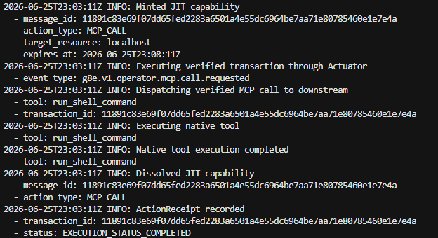
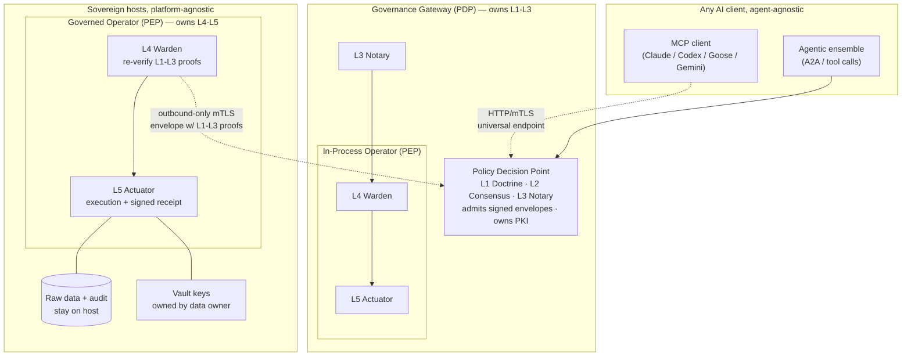
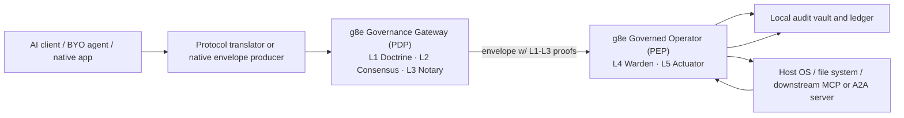
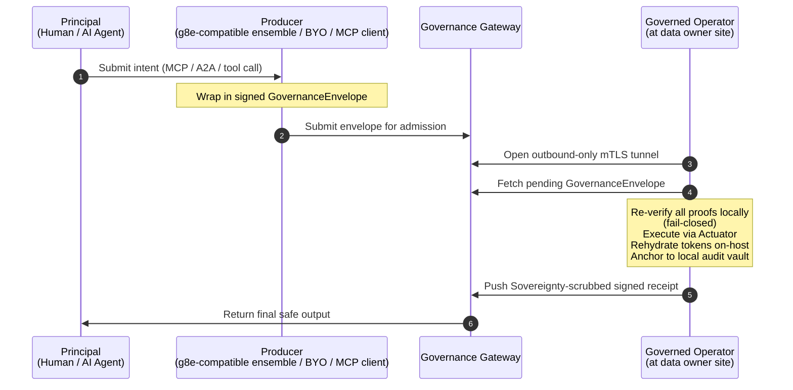
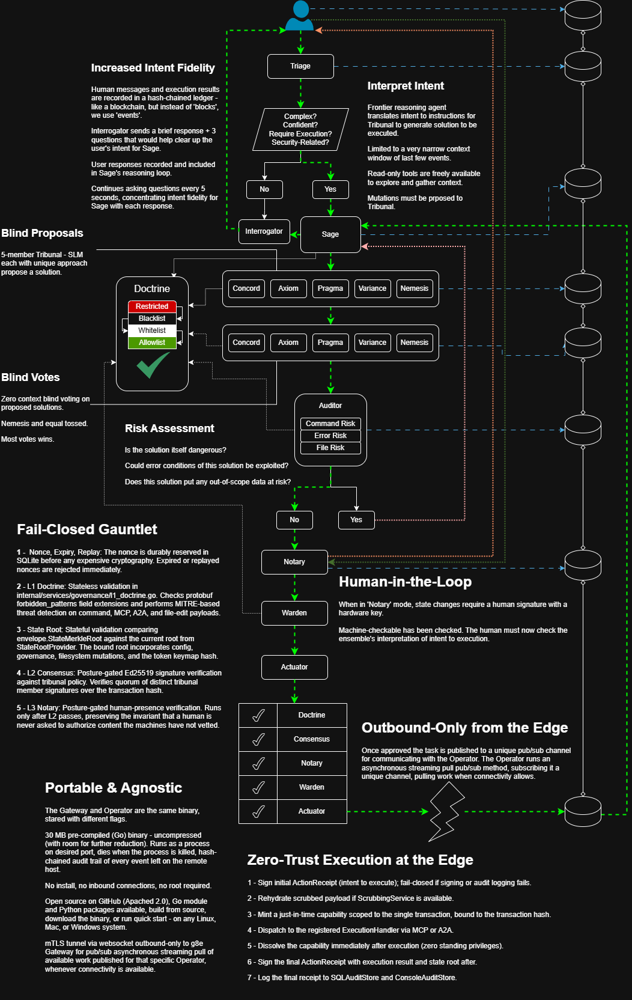

<div align="left">

# g8e

[](LICENSE) [](https://go.dev) [](https://github.com/g8e-ai/g8e/actions/workflows/build-and-test.yml) [](protocol/python/tests/) [](protocol/conformance/) [](https://github.com/gitleaks/gitleaks) [](https://github.com/google/go-licenses) [](https://github.com/sigstore/cosign) [](https://github.com/g8e-ai/g8e/releases) [](#status) [](docs/reference/compliance-alignment.md) [](protocol/docs/mcp.md) [](protocol/docs/spec.md)

</div>

g8e is a sovereign execution platform that delivers frontier AI reasoning to the edge without surrendering data custody. It reduces cloud providers to stateless co-processors: the model reasons over commitments, while state, keys, and raw data remain on the host that owns them. The platform is implemented as a single static Go binary. All dependencies are resolved at build time; the compiled binary is statically linked with zero external library dependencies. OS-level services (filesystem, optional OS keyring) are used at runtime.

<p align="center">
  
</p>

**Quick Links** · [Getting Started](docs/guides/getting_started.md) · [Position Paper](docs/core/position_paper.md) · [Protocol Spec](protocol/docs/spec.md) · [Build Gateway](docs/guides/build_gateway.md) · [MCP Integration](protocol/docs/mcp.md) · [Compliance](docs/reference/compliance-alignment.md)

## The Sovereignty Inversion

Every contemporary agent architecture makes the same trade: give the cloud custody of your data to get frontier reasoning. g8e inverts this. The cloud model functions as a reasoning co-processor that receives tokenized projections and cryptographic commitments. It never holds state, accumulates context, or takes custody of data.

The gateway can live in the cloud. The operator lives at the site of the data owner. The data owner trusts nobody: not the cloud provider, not the gateway, not the network between them. The operator opens a single outbound mTLS tunnel to the gateway, listens on no ports, and requires no installation beyond a single binary. It re-derives every proof from scratch against its own local state before any mutation occurs.

This architecture resolves the forced choice between frontier reasoning and data sovereignty. The model thinks in the cloud. The host remembers, verifies, and acts. The boundary between them carries proofs in one direction and commitments in the other, never custody. See the [Position Paper](docs/core/position_paper.md) for the full argument.

## Core Differentiators

### Cloud as Stateless Co-Processor

The cloud reasoning layer possesses zero custody of underlying data. Context is composed locally from the hash-chained ledger and live host state. Before any intent material crosses the sovereignty boundary, it is tokenized and scrubbed: secrets and regulated data are replaced with opaque tokens. The transaction hash is computed over the tokenized payload. The model upstream reasons over a safe projection of reality. Rehydration to real values happens only at the L5 Actuator, at the instant of execution, on the host where the data already lives. See [Data Sovereignty](docs/architecture/encryption.md) for details.

### State Remains Local

Canonical state resides within the [Local-First Audit Architecture (LFAA)](docs/architecture/storage.md) on the host. The cloud provider is restricted to viewing commitments: transaction hashes, state roots, and tokenized projections. Real state is maintained on the host and updated per transaction, with each update cryptographically superseding the previous state. The hash-chained ledger serves as a state history. Settlement is performed through execution at the L5 layer and verified against the latest committed state.

### Keys Owned by Data Owners

Vault keys are generated, imported, and controlled by the data owner. All sensitive data at rest is encrypted with AES-256-GCM using keys that never leave the host in plaintext. The platform vendor, the cloud provider, and the gateway are all reduced to stateless relays. A compromised cloud or gateway cannot decrypt host data because the keys were never shared. See [Encryption Architecture](docs/architecture/encryption.md).

### Outbound-Only Operator

The operator initiates a single outbound mTLS connection to the gateway. It listens on no ports. It accepts no inbound connections. It can sit behind NAT, firewalls, or air gaps. The gateway cannot reach into the operator; the operator pulls work when it chooses. This eliminates the attack surface that inbound-listening agents create and removes the need to open firewall rules or configure port forwarding on managed hosts. See [Network Architecture](docs/architecture/network.md).

### Zero Standing Privileges

The operator holds no permanent administrative credentials. Permissions are minted just-in-time from the verified intent inside the governance envelope, scoped to a single action, and dissolved on completion. A compromise of any layer cannot exfiltrate persistent credentials because none exist. See [Governance](docs/architecture/governance.md).

### Unified Context and Control Plane

The platform integrates the control plane and the data plane into a single system. The hash-chained ledger that governs execution also serves as the context substrate. Every admitted action writes a signed receipt to a host-local, git-backed, hash-chained ledger before the side effect is executed. Agents derive context from this chain and verify it against live host state through governed tools. Context delivery and action governance are performed as a single operation on the same object. An agent whose actions are gated by cryptographic proof and whose beliefs are derived from a verifiable ledger has no trusted storage to poison. See [Storage Architecture](docs/architecture/storage.md).

### Proof of Human Presence

High-risk mutations require a WebAuthn/FIDO2 passkey assertion computed over the transaction hash. The approval is bound to one action, forever: it cannot be transplanted to a different action, replayed against a later request, or harvested from a live session. The human signs the exact bytes of one transaction. See [Authentication](docs/architecture/auth.md).

## Architectural Model

The platform operates as two modes of the same static binary:

- **Governance Gateway (`g8e gw`)**: Serves as the Policy Decision Point (PDP). The Gateway owns policy decision layers L1-L3 (Doctrine, Consensus, Notary) and serves as the platform's PKI authority, persistence layer, and pub/sub broker. An in-process Operator substrate (PEP) handles L4-L5 (Warden, Actuator) locally for operations targeting the gateway host. The Gateway admits signed `GovernanceEnvelope` transactions, manages the platform PKI (mTLS, SPIFFE workload identities), and enforces freshness and replay defense. The gateway relays envelopes to operators and does not possess privileged bypass or execution authority. It does not initiate connections to operators. The gateway can run in the cloud or on-premises. See [Gateway Architecture](docs/architecture/gateway.md).

- **Governed Operator (`g8e operator`)**: Serves as the Policy Execution Point (PEP). It initiates outbound-only mTLS connections to the gateway and does not listen on any ports. It handles L4-L5 (Warden, Actuator) locally, re-verifying L1-L3 proofs from the Gateway against its internal state, and is the only component authorized to mutate the host. The operator runs at the site of the data owner. See [Operator Architecture](docs/architecture/operator.md).

g8e is actor-agnostic and governs actions rather than actors. AI agents, human users, CI/CD pipelines, and scheduled tasks submit actions through the same admission API. Any component that produces a conformant `GovernanceEnvelope` is treated as a principal. See [Connecting Applications](docs/guides/connect_apps_to_gateway.md) for integration examples.


```mermaid
graph TD
    subgraph Clients ["Any AI client, agent-agnostic"]
        C1["MCP client<br/>(Claude / Codex / Goose / Gemini)"]
        C2["Agentic ensemble<br/>(A2A / tool calls)"]
    end

    subgraph GW_Box ["Governance Gateway (PDP) — owns L1-L3"]
        GW["Policy Decision Point<br/>L1 Doctrine · L2 Consensus · L3 Notary<br/>admits signed envelopes · owns PKI"]
        subgraph GW_PEP ["In-Process Operator (PEP)"]
            GW_L4["L4 Warden"]
            GW_L5["L5 Actuator"]
            GW_L4 --> GW_L5
        end
        L3["L3 Notary"] --> GW_L4
    end

    subgraph Fleet ["Sovereign hosts, platform-agnostic"]
        subgraph O1_Box ["Governed Operator (PEP) — owns L4-L5"]
            O1_L4["L4 Warden<br/>re-verify L1-L3 proofs"]
            O1_L5["L5 Actuator<br/>execution + signed receipt"]
            O1_L4 --> O1_L5
        end
        D1[("Raw data + audit<br/>stay on host")]
        K1["Vault keys<br/>owned by data owner"]
        O1_L5 --- D1
        O1_L5 --- K1
    end

    C1 -. "HTTP/mTLS<br/>universal endpoint" .-> GW
    C2 --> GW
    O1_L4 -. "outbound-only mTLS<br/>envelope w/ L1-L3 proofs" .-> GW
```

## System Architecture

g8e integrates action and context planes into a single architectural model.


```mermaid
flowchart LR
    Client["AI client / BYO agent / native app"]
    Ingress["Protocol translator or native envelope producer"]
    Gateway["g8e Governance Gateway (PDP)<br/>L1 Doctrine · L2 Consensus · L3 Notary"]
    Operator["g8e Governed Operator (PEP)<br/>L4 Warden · L5 Actuator"]
    Vault["Local audit vault and ledger"]
    Target["Host OS / file system / downstream MCP or A2A server"]

    Client --> Ingress
    Ingress --> Gateway
    Gateway -- "envelope w/ L1-L3 proofs" --> Operator
    Operator --> Vault
    Operator --> Target
    Target --> Operator
    Operator --> Vault
```

### Action Plane

Every mutation must clear a five-layer admission pipeline at the host before execution. The system drops and records any actions that are stale, unsigned, unauthorized, or non-compliant with policy. The default state is closed. See [Admission Pipeline](#admission-pipeline) below and [Protocol Specification](protocol/docs/spec.md).

### Context Plane

Every admitted action writes a signed `ActionReceipt` to a host-local, git-backed, hash-chained ledger called the [Local-First Audit Architecture (LFAA)](docs/architecture/storage.md). This occurs before the side effect is executed. The ledger provides a cryptographically provable chain of intent, interpretation, and outcome. Agents derive context from this chain and verify it against live host state through [governed tools](protocol/docs/mcp.md).


```mermaid
sequenceDiagram
    autonumber
    participant Principal as Principal<br/>(Human / AI Agent)
    participant Ensemble as Producer<br/>(g8e-compatible ensemble / BYO / MCP client)
    participant Gateway as Governance Gateway
    participant Operator as Governed Operator<br/>(at data owner site)

    Principal->>Ensemble: Submit intent (MCP / A2A / tool call)
    Note over Ensemble: Wrap in signed GovernanceEnvelope
    Ensemble->>Gateway: Submit envelope for admission

    Operator->>Gateway: Open outbound-only mTLS tunnel
    Operator->>Gateway: Fetch pending GovernanceEnvelope

    Note over Operator: Re-verify all proofs locally<br/>(fail-closed)<br/>Execute via Actuator<br/>Rehydrate tokens on-host<br/>Anchor to local audit vault

    Operator->>Gateway: Push Sovereignty-scrubbed signed receipt
    Gateway->>Principal: Return final safe output
```

## Admission Pipeline

The admission pipeline consists of five layers with independent failure domains:

<p align="center">
  
</p>

1. **L1 Doctrine** — Gateway (PDP): Deterministic static analysis. Enforces rules against forbidden patterns and MITRE ATT&CK indicators. Active for every action. See [Gateway Postures](docs/guides/build_gateway.md#gateway-mode-flags).
2. **L2 Consensus** — Gateway (PDP): Multi-agent deliberation. An enrolled Tribunal service evaluates the envelope and produces signed votes over the canonical SHA-256 transaction hash. The gateway delegates L2 deliberation to the Tribunal and never self-signs. See [Consensus Layer](protocol/docs/spec.md#l2-consensus).
3. **L3 Notary** — Gateway (PDP): Hardware-bound human authorization. Utilizes WebAuthn/FIDO2 passkey assertions computed over the transaction hash. See [Authentication](docs/architecture/auth.md).
4. **L4 Warden** — Operator (PEP): Fail-closed verification authority. Re-verifies all proofs against local state, signatures, freshness, and the state Merkle root. See [Warden Layer](protocol/docs/spec.md#l4-warden).
5. **L5 Actuator** — Operator (PEP): Single dispatch path. Handles tool invocation, rehydrates scrubbed tokens on-host, and enforces data sovereignty at the execution boundary. See [Actuator Layer](protocol/docs/spec.md#l5-actuator).

## Data Sovereignty

The platform enforces data sovereignty through several mechanisms:
- Raw data remains on the host. Tokenization and scrubbing occur before intent material crosses the boundary. See [Encryption](docs/architecture/encryption.md).
- The transaction hash is computed over the tokenized payload.
- Transport credentials function as evidence within the envelope rather than bypass mechanisms.
- The audit record is written before any side effect occurs.
- Vault keys are owned by the data owner and never shared with the gateway or cloud provider.
- All sensitive data at rest is encrypted with AES-256-GCM. Services fail to initialize without an unlocked vault.

## Domain Applications

The gateway-operator architecture is domain-agnostic. The same binary, the same protocol, and the same verification pipeline governs actions across industries with different doctrine configurations. The data owner configures doctrine rules, target data, and posture to match their regulatory and operational requirements.

| Domain | What the operator governs | What the cloud never sees |
| --- | --- | --- |
| **Healthcare (HIPAA)** | PHI scrubbing, prior authorization workflows, clinical AI actions on EHR systems | Patient records, PHI, clinical notes |
| **Government (CUI/Classified)** | Classification markings, exfiltration prevention, CMMC compliance rules | Classified documents, controlled unclassified information |
| **Financial Services** | Trade limits, dual-control triggers, algorithmic trading guardrails | Trading positions, ledger data, counterparty information |
| **Defense (Tactical Edge)** | GPS spoofing defense, weapons safety, cross-cue validation, disconnected ops | Sensor data, RF environment, payload manifests |
| **Homeland Security** | USPER PII minimization, cross-domain release authority, sovereign destruction | Coalition feeds, intelligence sources, partner-nation data |
| **Data Migration** | Chain-of-custody receipts, bypass prevention, cross-tenant leak detection | Source and destination storage contents |
| **Critical Infrastructure** | Process control actions, safety interlocks, configuration changes | SCADA data, operational telemetry, facility configurations |

In each domain, the operator runs at the site of the data owner. The gateway can run in the cloud, on-premises, or in a hybrid configuration. The data owner retains custody of all raw data, audit history, and encryption keys. The cloud model reasons over tokenized projections and returns commitments. The operator rehydrates tokens locally, executes the verified action, and records the result in a tamper-evident ledger that never leaves the host.

## Quick Start

The binary is available for linux, darwin, and windows on amd64 and arm64 architectures. It can also be built from source. See [Getting Started](docs/guides/getting_started.md) for detailed setup instructions.

```bash
# Start the Gateway
./g8e gw start

# Start with the interactive onboarding wizard
./g8e gw start --interactive

# Authenticate the CLI
./g8e auth enroll

# Deploy an Operator to remote hosts
./g8e operator deploy --hosts <host1,host2> --background

# Check Gateway status
./g8e gw status

# Query the audit vault
./g8e gw data audit list --operator-session-id <session-id>
```

For complete CLI usage, see the [Getting Started Guide](docs/guides/getting_started.md).

### Use the Protocol Library

If you only need the g8e wire protocol for your own client or service, consume the published packages without building the full platform:

**Go module** (requires Go 1.26+):

```bash
go get github.com/g8e-ai/g8e@v1.6.3
```

**Python package** (requires Python 3.10+):

```bash
pip install g8e
```

See the [Protocol Library documentation](docs/architecture/protocol.md) for the full API reference.

### Posture Configurations

The gateway supports three posture configurations:

| Posture | L1 Doctrine | L2 Consensus | L3 Notary |
| --- | --- | --- | --- |
| `doctrine` | enforced | audited | audited |
| `consensus` | enforced | enforced | audited |
| `notary` | enforced | enforced | enforced |

L4 Warden and L5 Actuator layers are always active in all configurations. See [Governance Postures](docs/guides/getting_started.md#governance-postures) for setup details.

## Compliance and Standards

The g8e platform is designed for environments requiring zero trust architecture as defined in NIST 800-207. It aligns with NIST AI RMF, CMMC, FedRAMP, ISO 42001, and SOC 2 requirements. The LFAA ledger provides a continuous evidence trail for these frameworks. See [Compliance Alignment](docs/reference/compliance-alignment.md) for detailed mapping.

## Contributing

We welcome contributions of all kinds — bug reports, feature ideas, documentation improvements, protocol conformance tests, and code changes. Whether you're fixing a typo or adding a new admission layer, we'd love your help making g8e better. See [CONTRIBUTING.md](.github/CONTRIBUTING.md) for guidelines on getting started.

## Documentation

### Platform Documentation (`docs/`)

#### Guides
- [Getting Started](docs/guides/getting_started.md)
- [Build Gateway](docs/guides/build_gateway.md)
- [Build Operator](docs/guides/build_operator.md)
- [Build Applications](docs/guides/build_apps.md)
- [Connect Applications to Gateway](docs/guides/connect_apps_to_gateway.md)
- [Connect Operator to Gateway](docs/guides/connect_operator_to_gateway.md)
- [Air Gap Deployment](docs/guides/air_gap.md)
- [Docker Gateway](docs/guides/docker_gateway.md)
- [Cloudflare Tunnel Integration](docs/guides/cloudflare_tunnel.md)
- [Lovable Frontend Integration](docs/guides/lovable.md)
- [Build a g8e-Compatible Frontend](docs/guides/build_frontend.md)
- [Live Swarm Demo](demos/live-swarm/README.md)

#### Architecture
- [Gateway Architecture](docs/architecture/gateway.md)
- [Operator Architecture](docs/architecture/operator.md)
- [Security Model](docs/architecture/auth.md)
- [Encryption](docs/architecture/encryption.md)
- [Storage Architecture](docs/architecture/storage.md)
- [Network Model](docs/architecture/network.md)
- [Server-Sent Events](docs/architecture/sse.md)
- [Governance](docs/architecture/governance.md)
- [Tribunal](docs/architecture/tribunal.md)
- [AI Agents](docs/architecture/agents.md)
- [Protocol Library](docs/architecture/protocol.md)
- [Scripts](docs/architecture/scripts.md)

#### Reference
- [Compliance Alignment](docs/reference/compliance-alignment.md)
- [Glossary](docs/reference/glossary.md)

#### Core
- [Position Paper](docs/core/position_paper.md)
- [About](docs/core/about.md)

### Protocol Reference (`protocol/docs/`)

- [Protocol Specification](protocol/docs/spec.md)
- [MCP Integration](protocol/docs/mcp.md)
- [A2A Protocol](protocol/docs/a2a.md)
- [Constants Reference](protocol/docs/constants.md)
- [MCP JSON-RPC Schema](protocol/docs/mcp_jsonrpc_schema.json)
- [API Reference](protocol/docs/reference/)

---

Apache 2.0. Built by Lateralus Labs.
