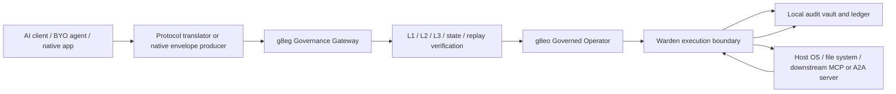
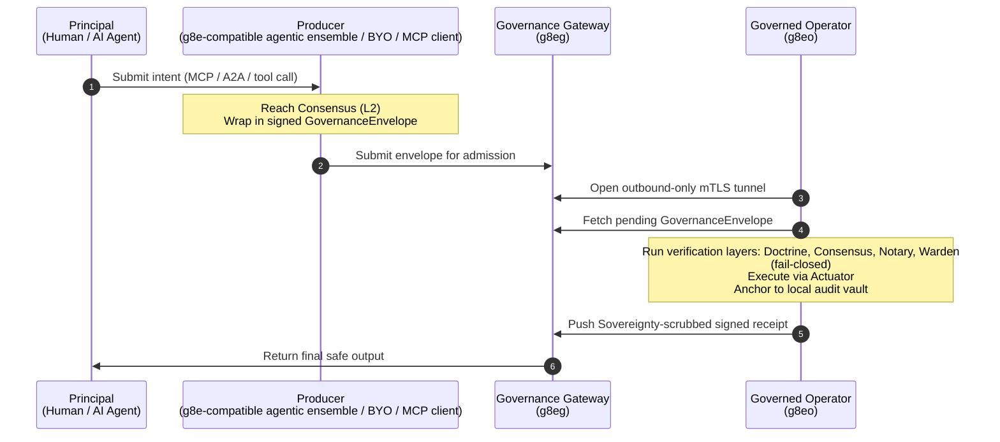

<div align="left">

# g8e

[](LICENSE) [](https://go.dev) [](https://github.com/g8e-ai/g8e/actions/workflows/build-and-test.yml) [](https://goreportcard.com/report/github.com/g8e-ai/g8e) [](https://github.com/g8e-ai/g8e/releases) [](#status) [](docs/reference/compliance-alignment.md) [](protocol/docs/mcp.md) [](protocol/docs/spec.md)

</div>

g8e is a reference monitor for agentic infrastructure that provides a fail-closed admission boundary and a sovereign context plane. It is implemented as a single static Go binary. The platform governs state-changing actions on a host and maintains a tamper-evident record of those actions for agent context.

<p align="center">
  
</p>

**Quick Links** · [Getting Started](docs/guides/getting_started.md) · [Position Paper](docs/core/position_paper.md) · [Protocol Spec](protocol/docs/spec.md) · [CLI Reference](docs/guides/cli.md) · [MCP Integration](protocol/docs/mcp.md) · [Compliance](docs/reference/compliance-alignment.md)

## Architectural Model

The g8e platform treats cloud providers as stateless inference utilities. The cloud model functions as a reasoning coprocessor rather than a stateful execution environment. This design ensures that canonical state resides within the [Local-First Audit Architecture (LFAA)](docs/architecture/storage.md) on the host. See the [Position Paper](docs/core/position_paper.md) for deeper analysis.

Context is composed locally from the hash-chained ledger and live host state accessed through [governed tools](protocol/docs/mcp.md). Only tokenized and scrubbed intent material crosses the sovereignty boundary to the cloud. Payload rehydration occurs at the L5 Actuator layer on the host where the data resides. The model reasons over references while the underlying data remains on the host. See [Data Sovereignty](docs/architecture/encryption.md) for details.

This approach integrates the control plane and data plane into a single system. The proof chain that governs execution also serves as the context substrate. Context delivery and action governance are performed as a single operation on the same object.

### State Settlement and Sovereignty

The platform operates as a context settlement layer where the cloud reasoning layer possesses zero custody of underlying data. The cloud provider is restricted to viewing commitments, such as tokenized payloads, transaction hashes, and state roots. Real state is maintained on the host and updated per transaction, with each update cryptographically superseding the previous state. See [Storage Architecture](docs/architecture/storage.md) for implementation details.

The hash-chained ledger serves as a state history. Settlement is performed through execution at the L5 layer and verified against the latest committed state. The system enforces state freshness through the L4 Warden, which rejects any envelope bound to a stale Merkle root. See [Protocol Specification](protocol/docs/spec.md) for the complete verification flow.

The platform maintains an asymmetric trust topology where the host is sovereign and the cloud is an untrusted utility. Trust is not extended to the cloud; instead, cloud exposure is limited to cryptographic commitments and dispute resolution. See [Security Model](docs/architecture/auth.md) for identity and trust management.

## Technical Overview

The g8e platform operates as a reference monitor that is tamper-evident, always invoked, and verifiable. It is built as a pure-Go static binary with zero external dependencies. The system functions in two primary roles:

- **Governance Gateway (`g8e gw`)**: This role serves as the Policy Decision Point. It admits signed `GovernanceEnvelope` transactions, manages the platform PKI (mTLS, SPIFFE workload identities), and enforces freshness and replay defense. The gateway relays envelopes to operators and does not possess privileged bypass or execution authority. It does not initiate connections to operators. See [Gateway Architecture](docs/architecture/gateway.md).

- **Governed Operator (`g8e operator`)**: This role serves as the Policy Execution Point. It initiates outbound-only mTLS connections to the gateway and does not listen on any ports. It re-verifies every proof locally against its internal state and is the only component authorized to mutate the host. See [Operator Architecture](docs/architecture/operator.md).

g8e is actor-agnostic and governs actions rather than actors. AI agents, human users, CI/CD pipelines, and scheduled tasks submit actions through the same admission API. Any component that produces a conformant `GovernanceEnvelope` is treated as a principal. See [Connecting Applications](docs/guides/connect_apps_to_gateway.md) for integration examples.


```mermaid
graph TD
    subgraph Clients ["Any AI client, agent-agnostic"]
        C1["MCP client<br/>(Claude / Cursor / Windsurf)"]
        C2["Agentic ensemble<br/>(A2A / tool calls)"]
    end

    GW["Governance Gateway · g8eg<br/>(Policy Decision Point)<br/>admits signed envelopes · owns PKI"]

    subgraph Fleet ["Sovereign hosts, platform-agnostic"]
        O1["Governed Operator · g8eo<br/>(Policy Execution Point)<br/>governs + executes locally"]
        D1[("Raw data + audit<br/>stay on host")]
        O1 --- D1
    end

    C1 -. "HTTP/mTLS<br/>universal endpoint" .-> GW
    C2 --> GW
    O1 -. "outbound-only mTLS" .-> GW
```

## System Architecture

g8e integrates action and context planes into a single architectural model.


```mermaid
flowchart LR
    Client["AI client / BYO agent / native app"]
    Ingress["Protocol translator or native envelope producer"]
    Gateway["g8eg Governance Gateway"]
    Verify["L1 / L2 / L3 / state / replay verification"]
    Operator["g8eo Governed Operator"]
    Warden["Warden execution boundary"]
    Vault["Local audit vault and ledger"]
    Target["Host OS / file system / downstream MCP or A2A server"]

    Client --> Ingress
    Ingress --> Gateway
    Gateway --> Verify
    Verify --> Operator
    Operator --> Warden
    Warden --> Vault
    Warden --> Target
    Target --> Warden
    Warden --> Vault
```

### Action Plane
Every mutation must clear a five-layer admission pipeline at the host before execution. The system drops and records any actions that are stale, unsigned, unauthorized, or non-compliant with policy. The default state is closed. See [Admission Pipeline](#admission-pipeline) below and [Protocol Specification](protocol/docs/spec.md).

### Context Plane
Every admitted action writes a signed `ActionReceipt` to a host-local, git-backed, hash-chained ledger called the [Local-First Audit Architecture (LFAA)](docs/architecture/storage.md). This occurs before the side effect is executed. The ledger provides a cryptographically provable chain of intent, interpretation, and outcome. Agents derive context from this chain and verify it against live host state through [governed tools](protocol/docs/mcp.md).


```mermaid
sequenceDiagram
    autonumber
    participant Principal as Principal<br/>(Human / AI Agent)
    participant Ensemble as Producer<br/>(g8e-compatible agentic ensemble / BYO / MCP client)
    participant Gateway as Governance Gateway<br/>(g8eg)
    participant Operator as Governed Operator<br/>(g8eo)

    Principal->>Ensemble: Submit intent (MCP / A2A / tool call)
    Note over Ensemble: Reach Consensus (L2)<br/>Wrap in signed GovernanceEnvelope
    Ensemble->>Gateway: Submit envelope for admission

    Operator->>Gateway: Open outbound-only mTLS tunnel
    Operator->>Gateway: Fetch pending GovernanceEnvelope

    Note over Operator: Run verification layers: Doctrine, Consensus, Notary, Warden<br/>(fail-closed)<br/>Execute via Actuator<br/>Anchor to local audit vault

    Operator->>Gateway: Push Sovereignty-scrubbed signed receipt
    Gateway->>Principal: Return final safe output
```

## Admission Pipeline

The admission pipeline consists of five layers with independent failure domains:


```mermaid
graph TD
    Start["Signed GovernanceEnvelope<br/>(Incoming Transaction)"]

    subgraph Verification ["Operator Verification - protocol-mandated"]
        direction TB
        L1{"L1: Technical Bedrock<br/>Forbidden Patterns?"}
        L2{"L2: Consensus<br/>Tribunal Signature?"}
        L3{"L3: Authorization<br/>Human Presence?"}
        State{"State Check<br/>Merkle Root Fresh?"}
        L4{"L4: Warden<br/>Pre-dispatch Gate"}
        
        FailClosed["Fail Closed<br/>Typed Rejection + Audit Entry"]
        Actuator["L5: Actuator<br/>Execute + Signed Receipt"]
        LocalVault([Local Audit Vault])

        L1 -- "Passed" --> L2
        L1 -- "Violated" ----> FailClosed
        
        L2 -- "Passed" --> L3
        L2 -- "Invalid/Missing" ---> FailClosed
        
        L3 -- "Authorized" --> State
        L3 -- "Denied" --> FailClosed
        
        State -- "Fresh" --> L4
        State -- "Stale" --> FailClosed

        L4 -- "Verified" --> Actuator
        L4 -- "Failed" --> FailClosed

        Actuator --> LocalVault
        FailClosed --> LocalVault
    end

    LocalVault --> Done["Recorded · Signed · Audited"]

    Start --> L1
```

1. **L1 Doctrine**: Deterministic static analysis. It enforces rules against forbidden patterns and MITRE ATT&CK indicators. This layer is active for every action. See [Doctrine Configuration](docs/guides/cli.md#doctrine-configuration).
2. **L2 Consensus**: Tribunal deliberation. An enrolled Tribunal service evaluates the envelope and produces signed L2 votes over the canonical SHA-256 transaction hash. The gateway delegates L2 deliberation to the Tribunal under both `consensus` and `notary` postures via the `/tribunal/v1/deliberate` endpoint. The gateway never self-signs L2 votes. See [Consensus Layer](protocol/docs/spec.md#l2-consensus).
3. **L3 Notary**: Hardware-bound human authorization. It utilizes WebAuthn/FIDO2 passkey assertions computed over the transaction hash. See [Authentication](docs/architecture/auth.md).
4. **L4 Warden**: Fail-closed verification authority. It re-verifies all proofs against local state, signatures, freshness, and the state Merkle root. See [Warden Layer](protocol/docs/spec.md#l4-warden).
5. **L5 Actuator**: Single dispatch path. It handles tool invocation and enforces data sovereignty. See [Actuator Layer](protocol/docs/spec.md#l5-actuator).

## Data Sovereignty

The platform enforces data sovereignty through several mechanisms:
- Raw data remains on the host. Tokenization and scrubbing occur before intent material crosses the boundary. See [Encryption](docs/architecture/encryption.md).
- The transaction hash is computed over the tokenized payload.
- Transport credentials function as evidence within the envelope rather than bypass mechanisms.
- The audit record is written before any side effect occurs.

## Quick Start

The binary is available for linux, darwin, and windows on amd64 and arm64 architectures. It can also be built from source. See [Getting Started](docs/guides/getting_started.md) for detailed setup instructions.

```bash
# Start the Gateway
./g8e gw start

# Authenticate the CLI
./g8e auth enroll

# Deploy an Operator to remote hosts
./g8e operator deploy --hosts <host1,host2> --background

# Check Gateway status
./g8e gw status

# Query the audit vault
./g8e gw data audit list --operator-session-id <session-id>
```

For complete CLI usage, see the [CLI Reference](docs/guides/cli.md).

### Posture Configurations

The gateway supports three posture configurations:

| Posture | L1 Doctrine | L2 Consensus | L3 Notary |
| --- | --- | --- | --- |
| `doctrine` | enforced | audited | audited |
| `consensus` | enforced | enforced | audited |
| `notary` | enforced | enforced | enforced |

L4 Warden and L5 Actuator layers are always active in all configurations. See [Posture Configuration](docs/guides/cli.md#posture-configuration) for setup details.

## Compliance and Standards

The g8e platform is designed for environments requiring zero trust architecture as defined in NIST 800-207. It aligns with NIST AI RMF, CMMC, FedRAMP, ISO 42001, and SOC 2 requirements. The LFAA ledger provides a continuous evidence trail for these frameworks. See [Compliance Alignment](docs/reference/compliance-alignment.md) for detailed mapping.

## Status

**v1.2.4**: Current release. Includes core protocol, gateway and operator roles, five-layer pipeline with Tribunal-based L2 consensus, PKI/mTLS identity, WebAuthn notary, MCP/A2A protocol translation, LFAA audit vault, native tools, JIT execution capabilities, bound vs observed state tiering, and multi-platform support. The gateway delegates L2 deliberation to an enrolled Tribunal service under consensus and notary postures. The L4 Warden verifies L2 consensus before L3 notary. The g8e Console SPA provides a browser-based dashboard for passkey management, interactive L3 transaction approval, and real-time SSE audit streaming. Dual-auth browser passkey endpoints and hybrid TLS/mTLS enforcement enable secure web browser access without client certificates. Auto-approval and intent grant/revoke subsystems have been removed.

## Documentation

### Platform Documentation (`docs/`)

#### Guides
- [Getting Started](docs/guides/getting_started.md)
- [CLI Reference](docs/guides/cli.md)
- [Build Gateway](docs/guides/build_gateway.md)
- [Build Operator](docs/guides/build_operator.md)
- [Build Applications](docs/guides/build_apps.md)
- [Connect Applications to Gateway](docs/guides/connect_apps_to_gateway.md)
- [Connect Operator to Gateway](docs/guides/connect_operator_to_gateway.md)
- [Build Agentic Systems](docs/guides/build_agentic_system.md)
- [Air Gap Deployment](docs/guides/air_gap.md)
- [Docker Gateway](docs/guides/docker_gateway.md)

#### Architecture
- [Gateway Architecture](docs/architecture/gateway.md)
- [Operator Architecture](docs/architecture/operator.md)
- [Security Model](docs/architecture/auth.md)
- [Encryption](docs/architecture/encryption.md)
- [Storage Architecture](docs/architecture/storage.md)
- [Network Model](docs/architecture/network.md)
- [Server-Sent Events](docs/architecture/sse.md)
- [Governance](docs/architecture/governance.md)

#### Reference
- [Compliance Alignment](docs/reference/compliance-alignment.md)
- [Glossary](docs/reference/glossary.md)

#### Core
- [Position Paper](docs/core/position_paper.md)
- [About](docs/core/about.md)

### Protocol Reference (`protocol/docs/`)

- [Protocol Specification](protocol/docs/spec.md)
- [MCP Integration](protocol/docs/mcp.md)
- [A2A Protocol](protocol/docs/a2a.md)
- [Constants Reference](protocol/docs/constants.md)
- [MCP JSON-RPC Schema](protocol/docs/mcp_jsonrpc_schema.json)

---

Apache 2.0. Built by Lateralus Labs.
