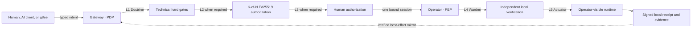

# g8e

**Give AI systems a governed path to real infrastructure—without giving them direct authority over it.**

[](LICENSE) [](https://github.com/g8e-ai/g8e/actions/workflows/build-and-test.yml) [](docs/reference/fips140-3.md) [](protocol/docs/mcp.md)

g8e is a zero-trust execution and evidence platform for AI agents, operators, and the systems they act on. An AI client proposes intent. A central **Gateway** authenticates the request and applies policy. A host-side **Operator** independently verifies the exact transaction before it executes anything, then records signed evidence at the execution boundary.

> **The short version:** the model can ask, but it cannot directly act. The machine that owns the data keeps final control.

[Quick start](#quick-start) · [How it works](#how-g8e-works) · [Explore the suite](#the-suite) · [Architecture](docs/architecture/overview.md) · [Documentation](#find-your-next-step) · [Roadmap](ROADMAP.md) · [Protocol](protocol/docs/spec.md)

## Why g8e exists

Most agent integrations collapse four different responsibilities into one process: reasoning, authorization, execution, and logging. That makes a prompt, application approval, or model decision dangerously close to a production side effect.

g8e separates those responsibilities:

- **AI systems express intent; they do not authorize mutation.** Model output, g8ee Tribunal votes, application approvals, memory, and events remain outside protocol authorization.
- **The Gateway decides whether work may proceed.** It is the Policy Decision Point for identity, PKI, current state, and the L1-L3 policy layers.
- **The target Operator decides whether work may execute there.** It is the sovereign Policy Execution Point for its own runtime and independently re-verifies every required proof.
- **Evidence stays anchored where execution happened.** The executing Operator owns the authoritative local receipt and audit record; a Gateway copy is a verified, best-effort mirror.
- **Managed hosts need no inbound control port.** Remote Operators initiate outbound-only mTLS connections and pull work from session-specific channels.

The boundary governs operations that traverse g8e. It does not sandbox an AI process or govern native tools, direct network access, or other side channels that remain enabled outside the platform.

## The suite

The repository is a polyglot platform, not a single agent or dashboard.

| Part | What it does | Trust position |
| --- | --- | --- |
| **g8eg · Governance Gateway** | Authenticates ingress, owns PKI and platform coordination state, constructs or admits canonical transactions, applies L1-L3 policy, exposes MCP/A2A and platform APIs, and brokers work to exact Operator sessions. It also contains an embedded Operator for actions against the Gateway runtime itself. | Core Policy Decision Point. It coordinates work but cannot bypass a remote Operator's verification. |
| **g8eo · Governed Operator** | Runs beside the resources it governs, opens an outbound-only mTLS connection, re-runs or verifies L1-L4, performs L5 execution, and stores authoritative local evidence. The same Go binary can run as a data, inference, observer, or provenance Operator with explicit capabilities. | Core Policy Execution Point and sole g8e authority for mutation in its own runtime. |
| **g8ee · Agentic Ensemble** | Provides conversational triage, model selection, ReAct tool loops, the five-member Tribunal, command generation, cases, investigations, memory, and model telemetry. | Optional, untrusted first-party application. Its reasoning and approvals never replace protocol L2 or L3. |
| **g8ed · Dashboard** | Serves a framework-free browser application and enrolls a separate dashboard workload identity. | Optional, untrusted interface. The current in-tree runtime is a limited static host, not a complete operations backend; see [Browser surfaces](#browser-surfaces). |
| **g8e Protocol** | Publishes protobuf contracts, canonical protojson models, constants, receipt verification, workload identities, and Go/Python packages for compatible clients and services. | Canonical wire contract shared by the suite. |
| **Evaluation and evidence tools** | Exercise the real Gateway/Operator boundary, orchestrate governed model campaigns, verify content-addressed evidence, and publish allowlisted public projections. | Verification tooling; it measures specific artifacts and deployments rather than granting execution authority. |

The Gateway and Operator are modes of one statically linked Go binary. g8ee is a Python 3.12/FastAPI service. g8ed is a JavaScript application served by Node.js 22/Express 5.

## How g8e works


```mermaid
flowchart LR
    Client[Human, AI client, or g8ee] -->|typed intent| Gateway[Gateway · PDP]
    Gateway -->|L1 Doctrine| L1[Technical hard gates]
    L1 -->|L2 when required| L2[K-of-N Ed25519 authorization]
    L2 -->|L3 when required| L3[Human authorization]
    L3 -->|one bound session| Operator[Operator · PEP]
    Operator -->|L4 Warden| Verify[Independent local verification]
    Verify -->|L5 Actuator| Target[Operator-visible runtime]
    Target --> Receipt[Signed local receipt and evidence]
    Receipt -.->|verified best-effort mirror| Gateway
```

A governed mutation follows one transaction path:

1. A human, AI client, application, or g8ee submits typed intent through an authenticated Gateway surface.
2. The Gateway binds principal identity, target, typed payload, current state root, nonce, expiry, and policy evidence into a canonical `GovernanceEnvelope`.
3. The active governance posture determines whether machine authorization at L2 and human authorization at L3 are required.
4. The Gateway routes work to one exact Operator session. Work is never broadcast.
5. That Operator recomputes the transaction hash, re-runs L1, verifies required L2/L3 proofs, checks expiry, replay state, target identity, and state binding, then either rejects the transaction or passes it to the Actuator.
6. Before a side effect, the Actuator signs and persists an `EXECUTING` receipt and commitment. It executes with a transaction-bound, short-lived capability, then signs and persists the final outcome and durability attestation.

The Gateway's embedded Operator executes only against the Gateway process's runtime. A remote Operator executes only against the runtime visible to that Operator process. In the root Docker Compose stack, the Gateway and Data Operator are separate containers; neither can inspect or mutate the Docker host unless a deployment explicitly grants that access.

### The five-layer interlock

| Layer | Owner | Purpose |
| --- | --- | --- |
| **L1 · Doctrine** | Gateway and Operator | Typed payload validation, forbidden-pattern rules, and MITRE ATT&CK-oriented threat detection. Always enforced. |
| **L2 · Consensus** | Gateway decision, Operator verification | K-of-N Ed25519 votes from enrolled members over the exact transaction hash and decision. This is protocol authorization, not Byzantine consensus or model voting. |
| **L3 · Notary** | Gateway decision, Operator verification | Transaction-bound human authorization through WebAuthn or a signed CLI proof for mutations when required. |
| **L4 · Warden** | Operator | Final fail-closed check of hash integrity, target, expiry, nonce replay, state root, typed payload, doctrine, and posture-required proofs. |
| **L5 · Actuator** | Operator | The singular execution boundary: pre-execution receipt, commitment, JIT capability, dispatch, final receipt, and persistence attestation. |

### Governance postures

| Posture | L1 Doctrine | L2 Consensus | L3 Notary for mutations | Typical use |
| --- | --- | --- | --- | --- |
| `doctrine` (default) | Enforced | Audited | Audited | Local development and CI |
| `consensus` | Enforced | Enforced | Audited | Automated workflows requiring cryptographic multi-member authorization |
| `ratify` | Enforced | Audited | Enforced | Human-authorized workflows without required L2 quorum |
| `notary` | Enforced | Enforced | Enforced | Workflows requiring both L2 quorum and human authorization |

Transaction hash integrity, nonce replay protection, expiry, state-root validation, action typing, payload decoding, and L1 Doctrine fail closed in every posture. Read-only actions do not require L3. See [Governance](docs/architecture/governance.md) for exact semantics.

## Quick start

The recommended first run is the two-phase Docker Compose deployment. It starts the Gateway, lets you enroll the first owner, then starts the Operator, g8ee, and g8ed as owner-approved workloads.

### Requirements

- Docker 24.0+ with Docker Compose v2
- A browser with WebAuthn support for interactive owner enrollment
- Ports 8080, 8443, 8000, 3000, 8081, 8082, and 5173 available

### 1. Start the unified stack

```bash
git clone https://github.com/g8e-ai/g8e.git
cd g8e
cp .env.example .env
docker compose up -d --build
docker compose cp g8e-gateway:/g8e ./g8e && cp ./g8e bin/g8e
```

The unified stack starts all 5 core services (Gateway, Data Operator, Inference Operator, ensemble, dashboard) together. Workloads automatically submit platform enrollment requests and wait for owner approval.

### 2. Enroll the first owner

```bash
# Host CLI (interactive passkey):
./g8e auth enroll user -e localhost

# Or pure Docker (headless inside container):
docker compose exec g8e-gateway /g8e auth enroll user --headless -e localhost
```

This creates the first owner, issues CLI mTLS credentials, installs the Gateway root CA with consent, and opens the passkey ceremony. For an mTLS-only CLI without browser enrollment, add `--headless`.

### 3. Approve the suite workloads

```bash
# Host CLI:
./g8e auth enroll pending

./g8e auth enroll approve <operator-request-id> --yes
./g8e auth enroll approve <dashboard-request-id> --yes
./g8e auth enroll approve <ensemble-request-id> --yes
./g8e auth enroll approve <inference-operator-request-id> --yes

# Or pure Docker:
docker compose exec g8e-gateway /g8e auth enroll pending
docker compose exec g8e-gateway /g8e auth enroll approve <request-id> --yes
```

Each workload generates its own key material and remains unready until the owner approves that exact enrollment request. Compare component identity and fingerprints before approval.

### 4. Check the deployment

```bash
docker compose ps
./g8e gw status
./g8e operator list
```

| Surface | Default address | Purpose |
| --- | --- | --- |
| Gateway discovery | `http://localhost:8080` | Health, trust discovery, bootstrap, and enrollment |
| Gateway API and MCP | `https://localhost:8443` | Authenticated platform API; MCP is at `/mcp` |
| Gateway Console | `https://localhost:8443/console/` | Operational passkey, approval, enrollment, and audit UI |
| g8ee API | `http://localhost:8000` | First-party agentic application API |
| g8ed | `http://localhost:3000` | Limited first-party static dashboard runtime |

For prerequisites, non-default ports, automated bootstrap, evaluation profiles, enrollment order, and troubleshooting, use the [Getting Started guide](docs/guides/getting_started.md) and [Unified Docker Stack guide](docs/guides/unified_stack.md).

## Choose your path

### Connect an AI agent

The Gateway exposes standard MCP and A2A ingress. The managed launcher configures supported coding agents with a short-lived delegated identity and g8e as their MCP server:

```bash
./g8e mcp agent list
./g8e mcp agent run claude
```

Named launchers attempt to disable native tools where the client supports reliable controls. Any native tools, direct filesystem access, other MCP servers, or unrestricted network paths that remain enabled are outside g8e's boundary. See [AI agents and the g8e boundary](docs/architecture/agents.md).

### Govern a remote runtime

Run an Operator on the machine or runtime that owns the target resources:

```bash
./g8e operator start --endpoint <gateway-host>
```

The Operator needs outbound access to Gateway ports 8080 and 8443 and opens no inbound management listener. After owner approval, bind or target its exact session and dispatch governed work:

```bash
./g8e operator list
./g8e operator bind <operator-session-id>
./g8e operator run <operator-session-id> --cmd "uname -a"
```

Read [Connect an Operator](docs/guides/connect_operator_to_gateway.md) before remote deployment; endpoint, certificate identity, runtime directory, and visible filesystem determine the real execution boundary.

### Build an application

Choose the integration surface by who must construct proofs:

| Surface | Best for | Important behavior |
| --- | --- | --- |
| **MCP** | Standard tool-capable AI clients | Gateway constructs the envelope, coordinates configured L2, and manages L3 suspension. |
| **A2A** | Governed downstream skills | Same posture-aware Gateway construction path as MCP. |
| **CLI Operator dispatch** | Owner automation across explicit Operator sessions | Gateway constructs envelopes and waits for each target's terminal result. |
| **`CommandIntent` relay** | First-party-style app dispatch under a compatible posture | Gateway binds target and state, but the relay does not synthesize missing L2 votes or L3 proofs. |
| **Direct envelope** | Privileged protocol clients that already possess every proof | Caller submits complete canonical protojson; app certificates are rejected from this route. |

Start with [Build Apps](docs/guides/build_apps.md), then use the [protocol specification](protocol/docs/spec.md) and [MCP contract](protocol/docs/mcp.md).

### Use the protocol packages

```bash
go get github.com/g8e-ai/g8e/v2@v2.1.13
pip install g8e==2.1.13
```

The Go module and Python package provide generated protobuf types, canonical models and constants, SPIFFE identity helpers, transaction hashing, and receipt verification. Both share the platform release version. See [Protocol Library](docs/architecture/protocol.md).

## Browser surfaces

g8e has three distinct browser architectures. They are not interchangeable.

| Surface | Audience | Authentication | Current role |
| --- | --- | --- | --- |
| **Gateway Console** | Platform owner | WebAuthn and Gateway HttpOnly session cookie | Canonical operational UI for passkeys, approvals, workload enrollment, recovery, and audit streaming. |
| **Owner-local observe frontend** | Authenticated owner | Browser connects directly to the private Gateway | Build with the audited `dashboard/g8e-adapter`, which owns absolute Gateway URLs, credentials, allowlisted reads, WebAuthn, SSE, and typed state. |
| **Public spectator** | Anonymous visitors | None | Reads only allowlisted, signed projections and public proof artifacts from a separate mirror. Public browsers never connect to the private Gateway. |

The in-tree **g8ed** runtime is not currently a complete operational control plane. Its static host and workload enrollment work, and the browser can restore or end an existing Gateway session, but its chat, Operator, approval, audit, settings, terminal, and standard SSE paths are not fully wired in the deployed host. Use the Gateway Console for administration and the audited adapter for new owner-local observe frontends. See [Dashboard architecture](docs/dashboard/architecture.md), [Build a frontend](docs/guides/build_frontend.md), and [Public Spectator architecture](docs/architecture/public_spectator.md).

## Evaluation, evidence, and public results

g8e includes verification programs because architectural claims and measured evidence are different things.

### Native execution-boundary evaluation

```bash
./g8e eval boundary run
./g8e eval boundary verify <run-id>
./g8e eval boundary show <run-id>
```

The native suite selects one exact remote Operator, performs one allowed governed mutation, sends the doctrine-prohibited equivalent through the same ingress, and verifies effect counts, target identity, receipts, durability, protocol-chain evidence, and rejection. It does not use g8ee, a model provider, or a synthetic compatibility layer.

### Governed model campaigns

Model campaigns use the production g8ee chat path, a Data Operator, an Inference Operator, and optional provider-side Observer and Provenance Operators. These are separate sessions and evidence owners: the inference executor does not attest its own GPU telemetry or model-weight integrity.

```bash
./g8e eval models freeze \
  --campaign-id eval-genesis-homogeneous \
  --output .g8e/eval/model-inventory.json

./g8e eval campaign start --model qwen3:4b \
  --publish --daemon --verify \
  --require-provider-observation \
  --require-model-provenance
```

Scored inference reaches the approved remote Ollama provider only through the governed Inference Operator path. See [Evaluations](docs/architecture/evals.md), [Model Provenance](docs/architecture/model-provenance.md), and the [Unified Docker Stack guide](docs/guides/unified_stack.md).

### Proof, not promises

Published results remain scoped to the exact artifacts, versions, environments, and trust inputs that produced them.

| Proof | Published result | Boundary |
| --- | --- | --- |
| [Native core execution-boundary evaluation](docs/architecture/evals.md) | The Go-native suite passed 10/10 required invariants against the unified Docker stack, and an independent `g8e eval boundary verify` invocation returned valid with zero failures. | One doctrine-posture deployment, one exact remote Operator session, one controlled target, and one networkless observer. |
| [Clean offline compliance verification](docs/release_notes/v2.1.x/v2.1.7-offline-acceptance.md) | A fresh network-disabled, read-only container reproduced a signed compliance bundle and passed all 10 verification checks. Four protected-source, renderer, and signature mutations failed closed. | One v2.1.7 candidate and one point-in-time assessment scope. This is not certification or recurring operating effectiveness. |
| [Compliance evidence model](docs/reference/compliance-evidence.md) | Typed assertions, evidence-grade scenarios, explicit control classifications, and fail-closed verification. | Catalog and verifier coverage do not imply customer compliance, authorization, or external attestation. |
| [Live CI](https://github.com/g8e-ai/g8e/actions/workflows/build-and-test.yml) | Build and test status is published as a live external signal. | Live CI is not frozen release evidence. |

The project does not claim zero leakage, certification, broad model quality, or production suitability without evidence supporting that exact statement.

## What the boundary provides

- **Independent execution control:** the Gateway admits work, but the target Operator independently decides whether that exact transaction may execute.
- **State-bound, replay-resistant transactions:** the envelope binds typed intent to principal, target, state root, nonce, expiry, and policy evidence.
- **Transaction-bound authorization:** L2 signs the exact transaction decision; required L3 approval is bound to the transaction hash.
- **Outbound-only managed runtimes:** Operators connect to the Gateway and listen on no inbound management port.
- **Local-first evidence:** the executing Operator retains authoritative signed receipts, commitments, state roots, and host-local audit data.
- **Explicit identity:** TLS 1.3, Gateway-owned PKI, and SPIFFE workload identities bind transport principals to sessions and targets.
- **Disclosure boundaries:** scrubbing limits returned data, selected persisted fields are encrypted, and the public mirror exports only a closed allowlist.

These properties do not mean every byte in every store is encrypted, every model-provider action is attested, every client side channel is blocked, or every UI module in the repository is operational. The architecture documentation records those limits directly.

## Repository map

```text
cmd/                  g8e CLI entry point
internal/             Gateway, Operator, governance, storage, evaluation, and CLI implementation
protocol/             Protobuf schemas, constants, generated bindings, and protocol docs
ensemble/             g8ee Python/FastAPI agentic application
dashboard/            g8ed and the audited browser integration adapter
evaluation-explorer/  Public evaluation explorer
eval/                 Evaluation fixtures and public examples
demos/                Healthcare, finance, DHS, and FedRAMP demonstration environments
docs/                 Architecture, guides, component docs, references, and release notes
```

## Find your next step

| Goal | Start here |
| --- | --- |
| Understand the system in plain architecture terms | [Architecture Overview](docs/architecture/overview.md), [Governance](docs/architecture/governance.md), [Gateway](docs/architecture/gateway.md), and [Operator](docs/architecture/operator.md) |
| Install or run the suite | [Getting Started](docs/guides/getting_started.md) and [Unified Docker Stack](docs/guides/unified_stack.md) |
| Connect a managed runtime | [Connect an Operator](docs/guides/connect_operator_to_gateway.md) and [Operator Architecture](docs/architecture/operator.md) |
| Connect an AI client or build an app | [AI Agent Boundary](docs/architecture/agents.md), [Build Apps](docs/guides/build_apps.md), [MCP](protocol/docs/mcp.md), and [A2A](protocol/docs/a2a.md) |
| Build a browser experience | [Build a Frontend](docs/guides/build_frontend.md), [Observe Frontend](docs/guides/build_observe_frontend.md), and [Dashboard Architecture](docs/dashboard/architecture.md) |
| Understand identity, transport, and data ownership | [Authentication](docs/architecture/auth.md), [Network](docs/architecture/network.md), [Encryption](docs/architecture/encryption.md), and [Storage](docs/architecture/storage.md) |
| Run or inspect evaluations | [Evaluations](docs/architecture/evals.md), [Model Provenance](docs/architecture/model-provenance.md), and [Evaluation Data Layout](eval/examples/README.md) |
| Review public or compliance evidence | [Public Spectator](docs/architecture/public_spectator.md), [Compliance Evidence](docs/reference/compliance-evidence.md), and [Compliance Alignment](docs/reference/compliance-alignment.md) |
| Develop and contribute | [Contributing](.github/CONTRIBUTING.md), [Developer Guide](docs/devs/devs.md), [Code Map](docs/devs/codemap.md), and [Testing](docs/devs/tests.md) |

## Build and contribute

```bash
make build
./g8e test unit
./g8e test integration
./g8e test lint
make ensemble-test
make dashboard-test
```

Use the project test wrapper for platform tests; do not invoke `go test` directly. See the [contribution guide](.github/CONTRIBUTING.md), [developer guidelines](docs/devs/devs.md), and [documentation guide](docs/devs/docs.md).

## Support OpenDevOps.ai

[OpenDevOps.ai](https://opendevops.ai) is a fully independent, verifiable LLM benchmarking project. I am completely self-funded and refuse to take venture capital. If this data helps you, please [sponsor the work on GitHub](https://github.com/sponsors/Badoot) to help keep the servers running and the pipeline unbiased.

## Pilots and partnerships

Lateralus Labs works with teams evaluating governed AI execution, sovereign data workflows, and proof-backed compliance reporting. Contact [danny@lateraluslabs.com](mailto:danny@lateraluslabs.com), [schedule a call](https://calendly.com/danny-lateraluslabs/quick_discovery), or connect on [LinkedIn](https://www.linkedin.com/in/dannybarbour/).

---

Business Source License 1.1. Converts to Apache 2.0 on 2030-08-18. Built by Lateralus Labs.
