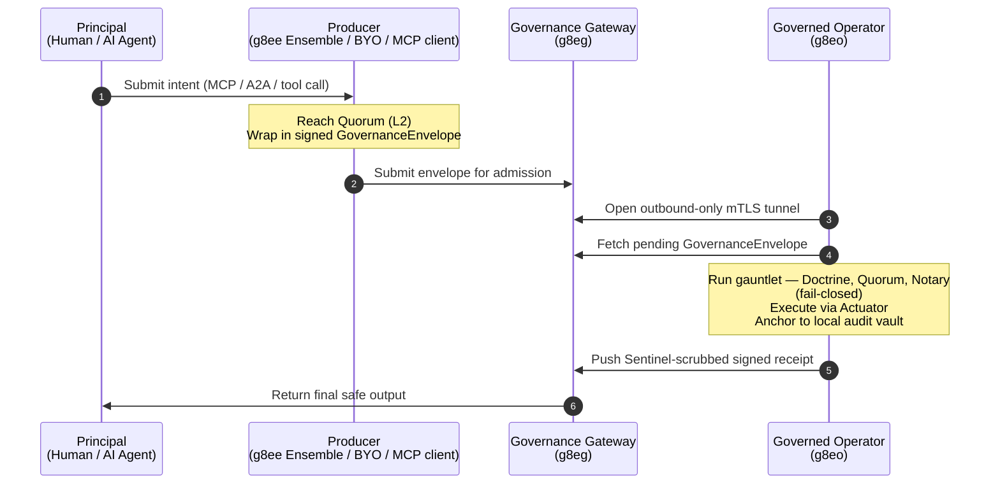

<div align="center">

<!-- INSERT: logo here (recommend a small wordmark or the g8e gate glyph, ~120px tall) -->

# g8e

**Byzantine Fault Tolerant governance for AI agents that touch real infrastructure.**

g8e is a zero-trust execution protocol and outbound-only gateway that forces every AI tool call to prove itself — current, consensus-backed, human-authorized, and locally auditable — before it is allowed to change anything on the host.

[](LICENSE)
[](https://go.dev)
[](#status)
[](docs/position-paper.md)

[Quickstart](#quickstart) · [How it works](#how-it-works) · [Self-hosting](#self-hosting--air-gap) · [Docs](#documentation) · [Paper](docs/position-paper.md)

</div>

---

<!-- ============================================================= -->
<!-- INSERT: HERO DEMO (video or GIF) — this is the money shot.    -->
<!-- Capture one governed mutation moving end to end:              -->
<!--   intent (MCP/tool call) → Quorum co-sign → Notary tap →      -->
<!--   Actuator executes → signed receipt in the audit log.        -->
<!-- 10–20s, terminal + the WebAuthn prompt. Put it right here.    -->
<!-- ============================================================= -->

> *Insert hero demo video/GIF above.*

---

## Why

AI agents now hold write access to your terminals, cloud APIs, CI/CD, source control, and databases — usually wired in through MCP or function calls. Those protocols prove an agent **can** do something. They say nothing about whether it **should**.

g8e is the missing admission boundary. Every state-changing action arrives as a signed `GovernanceEnvelope` and has to clear a three-layer gauntlet at the host before it executes. Anything stale, unsigned, unauthorized, or off-policy is dropped at the boundary and recorded. The default is closed.

```
The mandatory invariant:
A state-changing action reaches the host only as a typed, signed, state-bound
transaction — and the host verifies that transaction before it executes.
```

---

## Key properties

- **Outbound-only by design.** The Operator opens an mTLS reverse tunnel to the Gateway and listens on nothing. No inbound ports, NAT and firewall traversal for free, and zero remote attack surface on the one component that holds execution authority.
- **One ~4MB binary, zero standing dependencies.** The reference Operator is a single statically compiled Go binary. No runtime to patch, no interpreter to exploit, no package tree to audit. Air-gapped deployment is the normal case.
- **Multi-model Byzantine consensus.** The consensus layer (Quorum) is provider-agnostic. Heterogeneous models — Anthropic, OpenAI, local — independently co-sign every mutation, so no single model's hallucination or poisoning gets through.
- **Local-first audit with instant rollback.** Every decision, accepted or blocked, is written to a host-local vault *before* the side effect. A two-phase Git-backed commit architecture gives tamper-evident history and one-command rollback.
- **Fail-closed, in order.** Doctrine → Quorum → Notary, enforced at the host boundary. Each layer has to pass before the next is even reached.
- **Protocol-native.** MCP, A2A, and OpenAI-style tool calls all normalize into one signed envelope. The Operator is itself an MCP server.

---

## Quickstart

**Prerequisites:** Go 1.22+ · Python 3.12+ (only for the optional reference Ensemble)

```bash
git clone https://github.com/g8e-ai/g8e.git && cd g8e

# Start the mandatory Operator gateway
./g8e platform start

# (Optional) Start the reference g8e-Compliant Agentic Ensemble
./g8e apps start g8ee
```

1. **Bootstrap** — follow the CLI to initialize the Operator and generate a device-link token.
2. **Login** — `./g8e login` authenticates the CLI over mTLS.
3. **Audit** — watch live transaction logs in `.g8e/logs/operator-listen.log`.

<!-- ============================================================= -->
<!-- INSERT: SCREENSHOT — `./g8e platform start` running, with the -->
<!-- live audit log streaming a couple of transactions. Proves     -->
<!-- it's real and self-hosted. -->
<!-- ============================================================= -->

> *Insert screenshot of the running Operator + live audit log here.*

---

## The gauntlet

Every mutation passes three layers in sequence at the host boundary. Each one produces cryptographic evidence that travels inside the envelope.

| Layer | Name | Mechanism | What it proves |
| :---: | --- | --- | --- |
| **L1** | **Doctrine** | Static analysis / reflection | The action violates no hard technical policy or forbidden pattern. |
| **L2** | **Quorum** | Ed25519 over k-of-n consensus | An independent, heterogeneous ensemble co-validated the intent. |
| **L3** | **Notary** | WebAuthn / FIDO2 | A human authorized **this exact transaction**, using its hash as the challenge. |

Before any of these run, the envelope is checked for integrity, typed-payload decode, hash binding (`id == SHA-256(canonical_fields)`), freshness (nonce + expiry), and state binding (expected Merkle root vs. current local root). Only a transaction that clears the whole chain reaches the **Actuator** — the single fail-closed dispatch path through which any change to the host has to pass.

<!-- ============================================================= -->
<!-- INSERT: SCREENSHOT — the Notary step: the WebAuthn / FIDO2     -->
<!-- hardware-key prompt at the moment of human approval. Very      -->
<!-- tangible; shows the human-in-the-loop is real and hardware-bound. -->
<!-- ============================================================= -->

> *Insert screenshot of the Notary (WebAuthn/FIDO2) approval prompt here.*

---

## How it works

A producer forms intent and reaches consensus; the Operator pulls the envelope over its outbound tunnel, runs the gauntlet locally, executes through the Actuator, and pushes back a scrubbed, signed receipt.


```mermaid
sequenceDiagram
    autonumber
    participant Principal as Principal<br/>(Human / AI Agent)
    participant Ensemble as Producer<br/>(g8ee Ensemble / BYO / MCP client)
    participant Gateway as Governance Gateway<br/>(g8eg)
    participant Operator as Governed Operator<br/>(g8eo)

    Principal->>Ensemble: Submit intent (MCP / A2A / tool call)
    Note over Ensemble: Reach Quorum (L2)<br/>Wrap in signed GovernanceEnvelope
    Ensemble->>Gateway: Submit envelope for admission

    Operator->>Gateway: Open outbound-only mTLS tunnel
    Operator->>Gateway: Fetch pending GovernanceEnvelope

    Note over Operator: Run gauntlet — Doctrine, Quorum, Notary<br/>(fail-closed)<br/>Execute via Actuator<br/>Anchor to local audit vault

    Operator->>Gateway: Push Sentinel-scrubbed signed receipt
    Gateway->>Principal: Return final safe output
```

The verification path itself, end to end:


```mermaid
graph TD
    Start["Intent<br/>(MCP / A2A / tool call)"]

    subgraph Operator ["Operator boundary — protocol-mandated, fail-closed"]
        direction TB
        Pre{"Envelope integrity<br/>+ typed payload<br/>+ hash + freshness"}
        State{"State root fresh?"}
        L1{"L1 · Doctrine<br/>Forbidden patterns?"}
        L2{"L2 · Quorum<br/>Consensus signature?"}
        L3{"L3 · Notary<br/>Human authorization?"}
        Fail["Fail closed<br/>Typed rejection + audit entry"]
        Act["Actuator<br/>Execute + signed receipt"]
        Vault([Local audit vault])

        Pre -- ok --> State
        State -- fresh --> L1
        L1 -- passed --> L2
        L2 -- valid --> L3
        L3 -- authorized --> Act

        Pre -- bad --> Fail
        State -- stale --> Fail
        L1 -- violated --> Fail
        L2 -- invalid --> Fail
        L3 -- denied --> Fail

        Act --> Vault
        Fail --> Vault
    end

    Start --> Pre
    Vault --> Done["Recorded · Signed · Audited"]
```

---

## Zero-trust by design

Every component distrusts every other. Execution authority is never ambient.

| Actor | Distrusts | Enforced by |
| --- | --- | --- |
| **Principal** | Any single AI provider; any host | Heterogeneous Quorum; mTLS + device fingerprinting |
| **Gateway (g8eg)** | The producer and the client | Scoped sessions; replay protection; envelope verification |
| **Operator (g8eo)** | User, AI, transport, and stale state | Doctrine + Notary gates; outbound-only mTLS; state-root binding |
| **Output** | All downstream readers | Sentinel scrubs secrets, PII, and tokens before exposure |

---

## Reference implementation

g8e ships a full reference stack, but the protocol is the only mandatory part — any conforming producer can emit a valid envelope.

- **Ensemble (`g8ee`)** — optional reference g8e-Compliant Agentic Ensemble. A ReAct loop over an agent hierarchy: **Triage/Dash** (routing + fast path), **Sage** (reasoner; proposes but cannot execute), a five-seat **Tribunal** (k-of-n consensus), **Warden** (heuristic circuit breaker), **Auditor** (history grounding + signs L2), and **Nemesis** (embedded adversary; recorded, never executed).
- **Gateway (`g8eg`)** — reference policy decision point: admission APIs, mTLS/PKI, replay protection, state-root distribution, fan-out to Operators.
- **Operator (`g8eo`)** — reference enforcement point and sovereign boundary: local audit authority, Sentinel scrubber, Actuator, MCP server. The 4MB binary.

**Code pointers:**
`protocol/proto/*.proto` · `services/g8eo/internal/services/governance/` · `services/g8eo/internal/services/storage/audit_vault.go`

---

## Self-hosting & air-gap

g8e is built to run entirely inside your perimeter. The Operator has no inbound gateway, so there is nothing to expose and nothing to scan. The single static binary supports fully air-gapped deployment — no runtime, no package manager, no outbound dependency beyond the one mTLS tunnel it opens to your own Gateway. Raw data, forensic context, and execution history never leave the host; only Sentinel-scrubbed projections cross the wire.

<!-- ============================================================= -->
<!-- INSERT: SCREENSHOT (optional but strong) — the audit vault:    -->
<!-- a blocked transaction's rejection reason, or a rollback        -->
<!-- showing before/after content hashes and the Git-backed history. -->
<!-- ============================================================= -->

> *Optional: insert screenshot of the audit vault / rollback view here.*

---

## Documentation

- **[Position Paper](docs/position-paper.md)** — the full design rationale, threat model, and BFT analysis.
- **[Protocol](docs/protocol.md)** — wire format, transaction hash, and the Doctrine / Quorum / Notary definitions.
- **[Operator (g8eo)](docs/g8eo.md)** — execution boundary, gateway modes, and host storage.
- **[Ensemble (g8ee)](docs/g8ee.md)** — reference g8e-Compliant Agentic Ensemble and agentic orchestration.
- **[Troubleshooting](docs/developer/troubleshooting.md)** — common setup failures and recovery checks.
- **[Contributing](CONTRIBUTING.md)** — build instructions, testing workflows, and standards.

---

## Status

Active development, pre-1.0. The protocol and the reference Operator are functional; APIs may change before the 1.0 cut. Issues and PRs welcome — see [CONTRIBUTING.md](CONTRIBUTING.md).

---

## License

Apache 2.0 — see [LICENSE](LICENSE).

Built by [Lateralus Labs](https://lateraluslabs.com).
