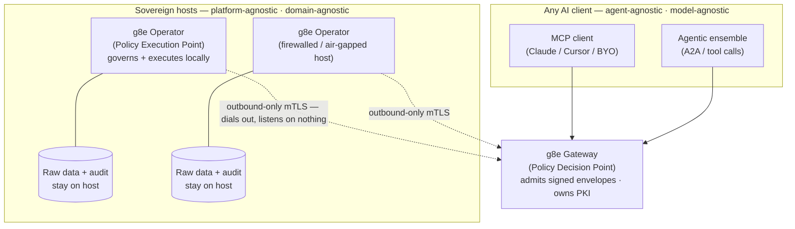
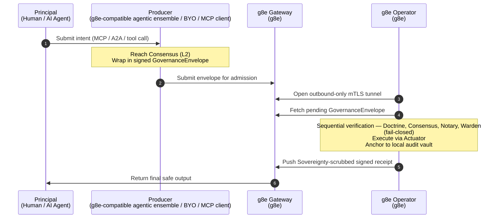
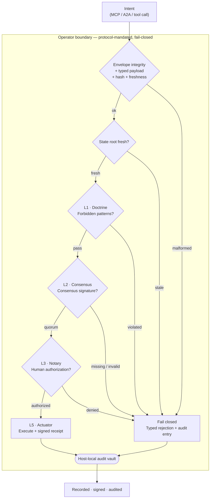

<div align="left">

# g8e

**Self-Hosted Data and Execution Control Plane for Military-Grade MCP**

The "move fast and break things" era is costing organizations a fortune in wasted tokens, broken infrastructure, and unaccountable AI actions. SaaS vendors are positioning themselves as the solution — offering "governance" and "control planes" that are little more than token spend dashboards, then open-sourcing the client tools to lock you into their expensive services. Cloud provider lock-in, MCP and A2A protocol gaps, and single-model self-reflection have created a structural vulnerability in agentic systems.

g8e is the missing admission boundary: a typed, signed, state-bound transaction that must clear a fail-closed verification pipeline **on the host** before any side effect occurs. One tiny pre-compiled g8e Node serves as either g8e Gateway (Policy Decision Point) or g8e Operator (Policy Execution Point). Start the g8e Gateway on your local machine, point your AI tools at it, and every action is governed — hardware-bound, just-in-time provisioned, mutual TLS secured, and anchored to a local ledger.

[](LICENSE)
[](https://go.dev)
[](#status-v106--core-platform)
[](docs/core/position_paper.md)

[Getting Started](docs/guides/getting_started.md) · [Why g8e](#the-problem) · [Architecture](#the-architecture) · [The Operator](#the-governed-operator) · [Protocol](#protocol-invariants) · [Docs](#documentation)

</div>

---

## The problem

Agents now hold write access to terminals, cloud APIs, CI/CD, source control, and databases — typically wired through MCP, A2A, or function calls. These protocols establish **capability**: proof an agent *can* act. They say nothing about **authority**: whether *this* action, *right now*, on *this* host, against *this* state, is safe to run.

The industry response has been a parade of single-point solutions:

- **Token spend dashboards** marketed as "governance platforms" — they count what you spent, not what you should have blocked
- **Single-model self-reflection** — the same weights that produced the action produce its justification; a prompt injection doesn't defeat the verifier, it *becomes* the verifier
- **Human-in-the-loop at scale** — route every action through a person and approvals decay to reflex; the signature that meant "I vouch for this" comes to mean nothing
- **Vendor "open source" clients** — free tools that require proprietary backends, creating a trojan horse for lock-in

All of these treat human and machine validators as interchangeable, pick one, and inherit its failure mode. The fundamental error is assuming a single validator can certify two orthogonal properties: technical consistency and human intent.

```
The invariant:
A state-changing action reaches the host only as a typed, signed, state-bound
transaction, and the host verifies that transaction before it executes.
Anything stale, unsigned, unauthorized, or off-policy is dropped at the
boundary and recorded. The default is closed.
```

---

## What makes g8e different

**Structural consensus over single-model reflection.** Authority to mutate is the *conjunction* of two independent proofs — machine **consistency** (a heterogeneous model quorum agreed the payload is a faithful, safe realization of intent) **∧** human **intent** (a person authorized this exact transaction hash) — bound cryptographically to one transaction and verified locally. Neither signature alone is sufficient. This is a woven, not layered, architecture that takes advantage of the best and worst of both humans and machines into perfectly uncorrelated overlapping solutions.

**Hardware-bound, just-in-time, zero standing privileges.** Permissions are minted just-in-time from verified intent, scoped to a single action, and dissolved on completion. A compromise can't exfiltrate credentials that never stand. The Operator is outbound-only, can use any port you already have open, requires no new ports, no dependencies, and no root access.

**Local-first audit and sovereignty.** Every mutation is written to a host-local, git-backed ledger *before* the side effect occurs. Raw data and forensic context never leave the host — only scrubbed projections cross the wire. The platform vendor is reduced to a stateless relay. You own your audit trail, your data, and your execution authority.

**One g8e Node, two roles, everywhere.** The same statically compiled artifact runs as g8e Gateway (PDP) or g8e Operator (PEP) on Windows, macOS, and Linux. Deploy operators via SSH using your existing SSH config. Every native tool accepts a list of hosts for fan-out execution across many MCP servers simultaneously. No runtime, no interpreter, no sidecar — the attack surface is the g8e Node you can read.

**Free and open, by design.** Runtime governance and audit for agents are public goods. A governance layer you can't inspect or self-host is an unaudited authority in the most sensitive seat in the stack — exactly the trusted third party zero-trust exists to abolish. An auditing system that is itself unauditable is a contradiction. g8e is Apache-2.0, single-binary, and air-gap-capable, and it stays that way.

---

## QuickStart

The platform is a single g8e Node. The same artifact runs as the g8e Gateway or as a g8e Operator, selected by flags. Standard builds are **35–38MB** per platform; compressed builds are **15–17MB** (Linux/Windows AMD64/ARM64). No runtime, no interpreter, no sidecar.

**Quick launch (Linux)**
```bash
curl -fsSL https://g8e.ai/g8e-linux-amd64 -o g8e && chmod +x g8e && ./g8e gw start
```

**Quick launch (macOS)**
```bash
curl -fsSL https://g8e.ai/g8e-darwin-amd64 -o g8e && chmod +x g8e && ./g8e gw start
```

**Quick launch (Windows)**
```powershell
iwr https://g8e.ai/g8e-windows-amd64.exe -outf g8e.exe && .\g8e.exe gw start
```

**Linux / macOS (build from source)**
```bash
git clone https://github.com/g8e-ai/g8e.git && cd g8e

make build                 # or: make build-compressed
./g8e gw start             # start the g8e Gateway (g8e)
./g8e auth login           # first login bootstraps the platform
./g8e gw status            # verify
```

**Windows**
```powershell
git clone https://github.com/g8e-ai/g8e.git; cd g8e

.\build.ps1
.\g8e.exe gw start
.\g8e.exe auth login
.\g8e.exe gw status
```

**Deploy operators to remote hosts via SSH**
```bash
# Using your existing SSH config
./g8e Operator deploy --hosts host1,host2,host3

# Tool calls now accept a list of hosts for fan-out execution
# Every native tool supports multi-host execution
```

See the [full QuickStart](docs/guides/getting_started.md) for mTLS, Operator enrollment, and CLI/MCP client configuration.

---

## The architecture

g8e follows standard MCP topology with governance and data sovereignty folded in. If you know MCP, you already know the shape — g8e just makes every execution earn its way through a host-local gauntlet first.

| Reference | g8e role | What it is |
| --- | --- | --- |
| **MCP server** | **g8e Operator** | A tool-calling facade where every execution clears the host-local governance gauntlet. Listens on no inbound ports; runs on remote, private, or air-gapped hosts. Deploy via SSH. |
| **MCP gateway** | **g8e Gateway** | Admits signed, state-bound envelopes and dispatches them to remote Operators. Owns the PKI; provides a central audit authority with no raw-data exposure. |

The substrate is **agent-agnostic, model-agnostic, platform-agnostic, and domain-agnostic** — the verifier checks the envelope's proofs against current state, never the provenance of who proposed it. Agnosticism isn't a feature for reach; it's the consequence of a trust model that checks mathematics instead of vendors. There is no privileged channel because the whole point is that none exists.


```mermaid
graph TD
    subgraph Clients ["Any AI client — agent-agnostic · model-agnostic"]
        C1["MCP client<br/>(Claude / Cursor / BYO)"]
        C2["Agentic ensemble<br/>(A2A / tool calls)"]
    end

    GW["g8e Gateway<br/>(Policy Decision Point)<br/>admits signed envelopes · owns PKI"]

    subgraph Fleet ["Sovereign hosts — platform-agnostic · domain-agnostic"]
        O1["g8e Operator<br/>(Policy Execution Point)<br/>governs + executes locally"]
        D1[("Raw data + audit<br/>stay on host")]
        O2["g8e Operator<br/>(firewalled / air-gapped host)"]
        D2[("Raw data + audit<br/>stay on host")]
        O1 --- D1
        O2 --- D2
    end

    C1 --> GW
    C2 --> GW
    O1 -. "outbound-only mTLS — dials out, listens on nothing" .-> GW
    O2 -. "outbound-only mTLS" .-> GW
```

---

## The g8e Operator

The g8e Operator is the center of gravity — a protocol-aware MCP server that enforces local verification before it ever mutates the host. The reference implementation, **`g8e`**, is a single statically compiled g8e Node with zero standing dependencies, and how you start it decides what it is:

```bash
# Host-side MCP server (Policy Execution Point).
# Point any MCP client at it; every tool call is governed before it executes.
g8e

# The exact same g8e Node as the g8e Gateway (Policy Decision Point).
# Admits envelopes, owns the PKI, fans transactions out to remote Operators.
g8e --notary        # or --consensus / --doctrine to set the posture
```

**One g8e Node, two roles.** No second package to deploy, no runtime to patch, no interpreter to audit. The attack surface is the g8e Node you can read.

**A drop-in MCP server.** It exposes standard MCP (and A2A) interfaces, so any BYO client connects with no changes. It hides the entire `GovernanceEnvelope` machinery — transaction hashing, L2/L3 signature collection, replay defense — behind a normal tool-calling facade and maps each JSON-RPC call to a governed `ActionType` mutation.

**It listens on nothing.** The Operator opens an mTLS reverse tunnel *out* to the Gateway and pulls pending work. No inbound ports, no NAT holes, nothing to port-scan. That's what lets it govern execution on hosts that are firewalled, air-gapped, or otherwise unreachable.

**Fan-out execution.** Every native tool accepts a list of hosts for simultaneous execution across many MCP servers. Deploy operators via SSH using your existing config, then execute governed actions across your entire fleet with a single tool call.

**It is the source of truth.** Every mutation is written to a host-local, git-backed vault *before* the side effect occurs. Raw data and forensic context never leave the host — only Sovereignty-scrubbed projections cross the wire.

---

## Protocol first, implementation second

> The **g8e Protocol** — the `GovernanceEnvelope`, the hash binding, the L1/L2/L3 contract — is the normative standard. `g8e` (g8e Operator) and `g8e` (g8e Gateway) are the **reference implementation** of those roles, not the protocol itself.

Any conforming implementation, in any language, that enforces the invariants is a valid g8e Operator or Gateway. The g8e Node you run today is one implementation of a spec anyone can build against. **g8e-compatible agentic ensembles** are likewise optional producers that implement the protocol to emit signed envelopes carrying L2 consensus evidence — the protocol is the only mandatory part of the system.

---

## Governance Layers

Every mutation passes through sequential verification layers at the Operator boundary. Each layer produces cryptographic evidence that travels inside the envelope; failed transactions are rejected and audited immediately.

| Layer | Name | Mechanism | What it proves |
| :---: | --- | --- | --- |
| **L1** | **Doctrine** | Reflected `forbidden_patterns` + MITRE ATT&CK heuristics | The action trips no hard gate (reverse shells, privilege escalation, destructive disk ops). |
| **L2** | **Consensus** | Ed25519 k-of-n over the transaction hash | An independent, heterogeneous model ensemble co-signed the intent. |
| **L3** | **Notary** | WebAuthn (web) / mTLS cert fingerprint (CLI) | A human authorized *this exact* transaction hash — not a session. |
| **L4** | **Warden** | Pre-dispatch verification gate | Hash, freshness, state binding, and signer trust all hold. |
| **L5** | **Actuator** | Single fail-closed dispatch path | The only code path that mutates the host; emits a signed `ActionReceipt`. |

Before L5 runs, the **L4 Warden** enforces, in order:

- **Integrity** — `id == transaction_hash == SHA-256(canonical_fields)`. Wire format is canonical JSON (protojson); the signing basis is a deterministic hash of normalized fields.
- **Freshness** — `expires_at` is in the future and the `nonce` is unseen in the active replay window.
- **State binding** — the envelope's `state_merkle_root` matches the host's current ledger root. Stale state is rejected.
- **Quorum** — L1/L2/L3 proofs satisfy the active **governance posture** (`doctrine`, `consensus`, or `notary`).

The split between L2 and L3 is the point: one model can't unilaterally move the host (L2 needs an independent quorum), and a stolen session can't either (L3 binds a human signature to the specific transaction hash). This is the trustless dependency chain — each layer depends on the previous for *inputs* but not for *trust*, so an attacker has to defeat orthogonal, independently audited proofs simultaneously. Compromising any single layer is not enough to cause an unauthorized mutation.

### How it works

A producer forms intent and reaches consensus; the Operator pulls the envelope over its outbound tunnel, runs local verification layers, executes through the Actuator, and pushes back a scrubbed, signed receipt.


```mermaid
sequenceDiagram
    autonumber
    participant Principal as Principal<br/>(Human / AI Agent)
    participant Ensemble as Producer<br/>(g8e-compatible agentic ensemble / BYO / MCP client)
    participant Gateway as g8e Gateway<br/>(g8e)
    participant Operator as g8e Operator<br/>(g8e)

    Principal->>Ensemble: Submit intent (MCP / A2A / tool call)
    Note over Ensemble: Reach Consensus (L2)<br/>Wrap in signed GovernanceEnvelope
    Ensemble->>Gateway: Submit envelope for admission

    Operator->>Gateway: Open outbound-only mTLS tunnel
    Operator->>Gateway: Fetch pending GovernanceEnvelope

    Note over Operator: Sequential verification — Doctrine, Consensus, Notary, Warden<br/>(fail-closed)<br/>Execute via Actuator<br/>Anchor to local audit vault

    Operator->>Gateway: Push Sovereignty-scrubbed signed receipt
    Gateway->>Principal: Return final safe output
```

The verification path itself, end to end:


```mermaid
graph TD
    Start["Intent<br/>(MCP / A2A / tool call)"]

    subgraph Operator ["Operator boundary — protocol-mandated, fail-closed"]
        direction TB
        Pre{"Envelope integrity<br/>+ typed payload<br/>+ hash + freshness"}
        State{"State root fresh?"}
        L1{"L1 · Doctrine<br/>Forbidden patterns?"}
        L2{"L2 · Consensus<br/>Consensus signature?"}
        L3{"L3 · Notary<br/>Human authorization?"}
        Actuator["L5 · Actuator<br/>Execute + signed receipt"]
        Reject["Fail closed<br/>Typed rejection + audit entry"]
        Vault([Host-local audit vault])

        Pre -- "ok" --> State
        Pre -- "malformed" --> Reject
        State -- "fresh" --> L1
        State -- "stale" --> Reject
        L1 -- "pass" --> L2
        L1 -- "violated" --> Reject
        L2 -- "quorum" --> L3
        L2 -- "missing / invalid" --> Reject
        L3 -- "authorized" --> Actuator
        L3 -- "denied" --> Reject
        Actuator --> Vault
        Reject --> Vault
    end

    Start --> Pre
    Vault --> Done["Recorded · signed · audited"]
```

*Learn more: [Operator Architecture](docs/architecture/operator.md) · [Protocol Specification](docs/architecture/g8e.md)*

---

## Protocol Invariants

- **GovernanceEnvelope** — the single canonical container for every mutation; binds identity, intent, state, and governance proofs into one transaction.
- **Hash-based integrity** — `id == SHA-256(canonical_fields)`. Wire format is canonical JSON (protojson).
- **Zero ambient context** — session IDs and identity are body-embedded; no implicit authority.
- **Outbound-only mTLS** — Operators dial out; zero inbound ports required on the host. Works through any existing open port.
- **Zero standing privileges** — permissions are minted just-in-time from verified intent, scoped to one action, and dissolved on completion. No credential exists to steal.
- **Sovereignty boundary** — automated scrubbing/rehydration ensures raw data never leaves the host; the model upstream sees a safe projection of reality, never reality itself.
- **Fail-closed, no fallbacks** — stale formats, unsigned inputs, expired transactions, and reused nonces are rejected before execution.
- **Fan-out execution** — every native tool accepts a list of hosts for simultaneous governed execution across your fleet.

*Learn more: [Protocol Specification](docs/architecture/g8e.md) · [API Reference](docs/reference/api/) · [Constants](docs/reference/constants.md)*

---

## The stance

We hold this without hedging: **runtime governance and audit for AI agents are public goods, and gating them behind a paywall is incompatible with a safe AI-powered, human-driven world.**

The benefit of an agent *not* mutating reality recklessly is non-excludable — it accrues to everyone downstream, not just whoever paid for the governance layer. Goods like that are under-provided by markets that try to sell them. If safety is a premium SKU, the cheapest path to shipping an agent is always the ungoverned one, and economics selects for it. **For governance to be the default, governance must be free.**

The trajectory is explicit: as agents grow more capable, single agents will not be permitted to make state changes. The floor for any mutation that touches real infrastructure becomes heterogeneous consensus *plus* a human signoff upstream — not a configurable nicety, the baseline. The right to verify belongs to everyone.

> g8e is not an agent. It is the substrate agents must run on to be viable in production infrastructure — and it must be free for that infrastructure to be safe.

Read the full argument in the [Position Paper](docs/core/position_paper.md).

---

## Status: v1.0.7 — Core Platform

g8e is the mandatory governance platform. Agent ensembles and the Dashboard (g8ed) are optional application-layer adapters.

**Operational today**
- **Universal protocol translation** — MCP/A2A tool calls intercepted into signed envelopes.
- **Fail-closed verification** — L1 (Doctrine), L2 (Consensus), and L4 (Warden) enforced on every transaction.
- **L3 Notary** — out-of-band human authorization (WebAuthn / mTLS).
- **Sovereign execution** — git-backed ledger and host-local audit vault.
- **Outbound-only mTLS** — reverse tunnels for firewalled and air-gapped hosts; works through any existing open port.
- **Data sovereignty** — automated PII/secret scrubbing with local forensic persistence.
- **Native Windows support** — filesystem, process, and service parity (v1.0.6).
- **SSH deployment** — leverage existing SSH config to deploy operators across your fleet.
- **Fan-out execution** — every native tool accepts a list of hosts for simultaneous governed execution.

**In development**
- **RBAC** — granular role-based access control.
- **Complex policy** — dynamic intent allowlisting and advanced L1 heuristics.
- **Multi-tenancy** — organization partitioning and tenant isolation.
- **Gateway federation** — gateway-to-gateway PKI and operator-to-operator consensus.
- **Agentic mesh of gossiping federated gateways** — decentralized coordination and state synchronization across distributed gateway nodes.

---

## Documentation

- [Getting Started](docs/guides/getting_started.md)
- [Position Paper](docs/core/position_paper.md)
- [Operator Architecture](docs/architecture/operator.md) · [Gateway Architecture](docs/architecture/gateway.md)
- [Protocol Specification](docs/architecture/g8e.md) · [API Reference](docs/reference/api/)
- [Build a g8e Operator](docs/guides/build_operator.md)

---

*Built by Lateralus Labs. Licensed Apache 2.0.*
