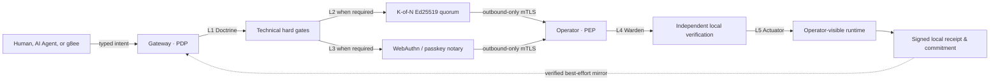

# g8e

**Give AI systems a governed path to real infrastructure—without giving them direct authority over it.**

[](LICENSE) [](https://github.com/g8e-ai/g8e/actions/workflows/build-and-test.yml) [](VERSION) [](docs/reference/fips140-3.md) [](protocol/docs/mcp.md)

g8e is a zero-trust execution and evidence platform for AI agents, human operators, and distributed target runtimes. An AI client or operator proposes typed intent. A central **Gateway** authenticates the ingress, binds identity and state roots, and screens policy. A host-side **Operator** on the target machine independently verifies the exact transaction before executing anything, mints a short-lived capability, and records signed cryptographic receipts and commitment chains at the local execution boundary.

> **The core principle:** the model can ask, but it cannot directly act. The machine that owns the data retains sovereign execution authority.

[Quick Start](#quick-start) · [How It Works](#how-it-works) · [Platform Architecture](#the-platform-suite) · [Capabilities](#what-the-platform-can-do) · [Workflows](#common-operational-workflows) · [Documentation](#find-your-next-step) · [Position Paper](docs/core/position_paper.md) · [Protocol Spec](protocol/docs/spec.md)

---

## Why g8e exists

Traditional AI agent frameworks collapse four separate responsibilities into a single process: reasoning, authorization, execution, and audit logging. Giving an LLM or autonomous agent direct shell access, long-lived API keys, or unrestricted MCP tools turns every prompt, heuristic, or model decision into an unverified production side effect.

g8e enforces a strict separation of concerns across distributed trust boundaries:

- **AI systems express intent; they do not authorize mutation.** Model output, prompt chains, agentic ensemble debates, memory states, and application approvals remain strictly outside protocol authorization.
- **The Gateway governs admission.** Acting as the central Policy Decision Point (PDP), the Gateway authenticates principals, manages platform PKI, enforces L1 Doctrine screening, coordinates L2 Consensus deliberation, and manages L3 Notary approval suspensions.
- **The target Operator governs execution.** Acting as the sovereign Policy Execution Point (PEP) on the managed machine, the Operator independently re-runs L1, verifies required L2 and L3 proofs at its L4 Warden, and controls execution through its L5 Actuator. Gateway admission cannot force execution on a remote host.
- **Evidence anchors at the execution boundary.** The executing Operator owns the authoritative local SQLite audit database, signed action receipts, and tamper-evident commitment chains. Gateway copies are best-effort coordination projections.
- **Target hosts require zero inbound control ports.** Remote Operators connect to the Gateway over outbound-only mTLS WebSockets and pull work strictly from session-specific channels.
- **Explicit disclosure and data boundaries.** Bounded scrubbing masks sensitive tokens before transport, and registered secrets are rehydrated only at the local L5 Actuator execution boundary.

The g8e boundary governs operations that traverse the platform. It does not sandbox external client processes or block unmanaged side channels outside g8e.

---

## How it works

### The transaction pipeline


```mermaid
flowchart LR
    Client[Human, AI Agent, or g8ee] -->|typed intent| Gateway[Gateway · PDP]
    Gateway -->|L1 Doctrine| L1[Technical hard gates]
    L1 -->|L2 when required| L2[K-of-N Ed25519 quorum]
    L1 -->|L3 when required| L3[WebAuthn / passkey notary]
    L2 & L3 -->|outbound-only mTLS| Operator[Operator · PEP]
    Operator -->|L4 Warden| Verify[Independent local verification]
    Verify -->|L5 Actuator| Target[Operator-visible runtime]
    Target --> Receipt[Signed local receipt & commitment]
    Receipt -.->|verified best-effort mirror| Gateway
```

Every governed mutation traverses a deterministic, fail-closed transaction lifecycle:

1. **Ingress:** A client submits typed intent via MCP (`POST /mcp` or stdio), A2A (`POST /a2a`), governed HTTP command relay, or direct protobuf envelope.
2. **Canonical Envelope:** The Gateway binds the principal identity (SPIFFE URI), target Operator session, typed payload, current state Merkle root, cryptographic nonce, expiration, and governance metadata into a canonical `GovernanceEnvelope` (protocol version 2) with a deterministic SHA-256 transaction hash.
3. **PDP Screening:** The Gateway evaluates L1 Doctrine rules. If the active posture requires machine consensus (L2), member deliberators evaluate the transaction and sign `<tx_hash>|<decision>`. If human authorization (L3) is required for a mutation, the transaction suspends awaiting WebAuthn passkey assertion or signed CLI proof.
4. **Session-Bound Routing:** The Gateway dispatches the verified envelope over an outbound-only mTLS WebSocket to the exact session channel `cmd:<operator_id>:<operator_session_id>`. Transactions are never broadcast.
5. **L4 Warden Verification:** The target Operator pulls the envelope, reserves the nonce in durable storage to prevent replay races, checks expiration, decodes the typed protobuf payload, independently re-runs L1 Doctrine, recomputes the transaction hash (`tx_hash == envelope.id == recomputed_hash`), verifies the state Merkle root against the Gateway, and verifies posture-required L2 and L3 cryptographic proofs.
6. **L5 Actuator Execution:** Before invoking any handler, the Actuator signs and persists an initial `EXECUTING` receipt, appends a signed commitment to the SQLite chain, rehydrates scrubbed secret tokens at the local site, and mints a short-lived, transaction-bound capability. It dispatches the handler, dissolves the capability, captures the post-execution state root, and persists a final signed `COMPLETED` or `FAILED` receipt with durability attestation before mirroring it to the Gateway.

### The five-layer interlock

| Layer | Owner | Responsibility |
| --- | --- | --- |
| **L1 · Doctrine** | Gateway and Operator | Technical hard gates: typed payload validation, forbidden-pattern detection, and MITRE ATT&CK-oriented threat heuristics (reverse shells, privilege escalation, destructive disk operations, credential theft). Screened on Gateway admission and independently re-evaluated locally by the executing Operator. |
| **L2 · Consensus** | Gateway coordination, Operator verification | K-of-N Ed25519 multi-signature cryptographic authorization over `<tx_hash>\|<decision>` from enrolled member keys. Evaluates deterministic policy compliance; distinct from LLM voting or distributed Byzantine consensus. |
| **L3 · Notary** | Gateway coordination, Operator verification | Transaction-bound human authorization for mutations. Gateway workflows suspend for WebAuthn/FIDO2 hardware passkeys; remote Operator CLI workflows verify signed Ed25519 approval proofs bound to the transaction hash. Read-only actions bypass L3. |
| **L4 · Warden** | Executing Operator | Sovereign pre-dispatch verification gate. Reserves nonces against replay, verifies expiry, decodes typed payloads, runs local L1 Doctrine, validates state Merkle roots, recomputes transaction hashes, and verifies posture-required L2/L3 proofs. Rejections fail closed and release the nonce. |
| **L5 · Actuator** | Executing Operator | The singular execution boundary. Signs and persists `EXECUTING` receipts, appends signed commitments to the SQLite ledger, rehydrates scrubbed secrets locally, mints short-lived transaction capabilities, dispatches typed handlers, dissolves capabilities, and signs final `COMPLETED` or `FAILED` receipts with persistence attestations. |

### Governance postures

The platform operates under one of four immutable governance postures, configured at Gateway startup via `--posture`:

| Posture | L1 Doctrine | L2 Consensus | L3 Notary (Mutations) | Intended Environment |
| --- | --- | --- | --- | --- |
| `doctrine` (default) | Enforced | Audited | Audited | Local development, testing, and automated CI pipelines |
| `consensus` | Enforced | Enforced | Audited | Multi-agent autonomous workflows requiring cryptographic quorum |
| `ratify` | Enforced | Audited | Enforced | Human-supervised operations requiring WebAuthn/passkey sign-off |
| `notary` | Enforced | Enforced | Enforced | Regulated production systems requiring both cryptographic quorum and human sign-off |

Fail-closed universal gates enforced across every posture: transaction hash integrity, nonce replay prevention, timestamp expiration, state Merkle root validation, action type validation, and L1 Doctrine screening. See [Governance Architecture](docs/architecture/governance.md) for full specifications.

---

## The platform suite

g8e is a polyglot platform combining a single statically linked Go binary with first-party Python, JavaScript, and protocol modules:

| Component | Implementation | Primary Role | Trust Boundary |
| --- | --- | --- | --- |
| **g8eg · Governance Gateway** | Go (`g8e gw start`) | Policy Decision Point (PDP). Exposes REST, MCP, and A2A APIs, manages the 4-tier PKI hierarchy, enforces L1-L3 policies, brokers outbound-only pub/sub channels, and hosts an embedded Operator for Gateway-local actions. | Core PDP. Coordinates policy and routes work, but cannot bypass a remote Operator's verification gates. |
| **g8eo · Governed Operator** | Go (`g8e operator start`) | Policy Execution Point (PEP). Runs directly on the target host, opens an outbound-only mTLS connection to the Gateway, executes the L4 Warden and L5 Actuator pipeline, and owns sovereign local audit storage. Supports specialized roles (`data`, `inference`, `provenance`, `observer`). | Core PEP. The sole authority for mutation and audit truth within its own operating runtime. |
| **g8ee · Agentic Ensemble** | Python 3.12 / FastAPI (`ensemble/`) | First-party conversational triage, multi-provider model routing, ReAct tool execution loops, five-member Tribunal deliberation, and case/investigation management. | Untrusted application tier. Enrolls an app workload identity; its reasoning and application approvals never replace protocol L2 or L3 gates. |
| **g8ed · Dashboard** | Node.js 22 / Vanilla JS (`dashboard/`) | Static web host serving the operator browser interface on port 3000. Authenticates to the Gateway directly via WebAuthn passkeys. | Untrusted interface. Serves browser assets and provides workload enrollment; operational tasks use the Gateway Console. |
| **g8e Tactical Console (TUI)** | Go (`g8e tui`) | Real-time terminal UI streaming over Gateway SSE. Visualizes L1-L5 execution stages, L2 consensus deliberations, and the sovereign audit ledger. | Authenticated operator client. Displays live pipeline events and historical records. |
| **g8e Protocol** | Protobuf v3 / Go / Python (`protocol/`) | Defines canonical protobuf contracts, deterministic canonical protojson serialization, constants registries, workload identities, and receipt verifiers. | Shared wire contract across all suite services and external integrations. |
| **Evaluation & Evidence Tools** | Go CLI (`g8e eval`, `g8e compliance`) | Native execution-boundary test suites, governed model campaign runners, provider-side witness verifiers, and FedRAMP 20x KSI evidence engines. | Verification tooling. Measures and proves runtime invariants against frozen criteria. |

---

## What the platform can do

### 1. Governed AI agent integrations (MCP & A2A)
Connect autonomous agents and AI coding assistants to real infrastructure through a governed reverse proxy:
- **Universal MCP Server:** Run g8e as a local stdio MCP server (`g8e mcp stdio`) or stream over HTTP (`POST /mcp`) to expose 32 governed system tools to any MCP-compliant client.
- **Built-in Agent Launchers:** Configure and run popular coding agents with owner-approved application identities using `g8e mcp agent run <claude|codex|devin|gemini|goose>`.
- **MCP Proxy & Tool Governance:** Attach third-party MCP servers to the Gateway as downstream egress (`--mcp-downstream-cmd` / `--mcp-downstream-args` for a stdio subprocess, or `--mcp-downstream-url`), subjecting arbitrary tools to L1-L5 verification.
- **Agent-to-Agent (A2A) Routing:** Expose structured JSON-RPC endpoints (`POST /a2a`) that wrap downstream agent skill invocations inside canonical `GovernanceEnvelope` transactions.
- See [AI Agents and the g8e Boundary](docs/architecture/agents.md) and [MCP Specification](protocol/docs/mcp.md).

### 2. Distributed multi-operator execution & specialized roles
Deploy lightweight, outbound-only Operators across distributed environments with role-based segregation:
- **Zero Inbound Attack Surface:** Operators initiate outbound TLS 1.3 mTLS connections to the Gateway and listen on no inbound network ports.
- **Multi-Operator Coexistence:** Multiple Operator instances run safely on the same physical host, isolated by composite SHA-256 system fingerprints (`os`, `arch`, `local_dir`, `account`, `port`, `operator_role`).
- **Four Specialized Operator Roles:**
  - `Data Operator`: Executes governed system tools, database queries, and shell commands; maintains the execution vault and local audit ledger.
  - `Inference Operator` (`g8ellama`): Manages local/remote LLM backends (Ollama), model registry synchronization, and model residency.
  - `Provenance Operator`: Read-only storage witness attesting content-addressed model weight files. Hard-rejects mutating commands.
  - `Observer Operator`: Read-only hardware witness monitoring GPU telemetry, power, temperatures, and memory residency. Hard-rejects mutating commands.
- See [Operator Architecture](docs/architecture/operator.md) and [Connect an Operator](docs/guides/connect_operator_to_gateway.md).

### 3. Native catalog of 32 governed system tools
The Go binary compiles a native registry of 32 typed tools in `internal/services/mcp/native_tool_registry.go`, giving agents structured, governed visibility into host systems:

| Category | Native Tools | Operational Capabilities |
| --- | --- | --- |
| **Databases** | `db_discover_topology`, `db_query_validate`, `db_isolated_read`, `db_index_triage` | Discovers database schemas, validates query safety, runs read-only queries with row limits, and inspects index performance across PostgreSQL, MySQL, and SQLite. |
| **System & Host** | `sys_info`, `sys_oom_detect`, `sys_env_vars`, `sys_service_status`, `sys_container_status`, `sys_time_clock`, `proc_metric_top`, `proc_signal_safe`, `proc_tree` | Inspects OS details, detects OOM events, sanitizes environment variables, checks systemd/container health, inspects process trees, and dispatches safe POSIX signals. |
| **Network & TLS** | `net_socket_audit`, `net_endpoint_ping`, `net_http_probe`, `net_dns_resolve`, `tls_cert_inspect`, `net_ssh_known_hosts` | Audits open listening sockets, pings IP/host endpoints, tests HTTP endpoints, resolves DNS records, inspects TLS certificate chains/expirations, and audits SSH known hosts. |
| **Filesystem & Git** | `fs_disk_profile`, `fs_disk_usage`, `fs_file_checksum`, `file_read`, `git_ops`, `config_diff_mask` | Profiles directory disk usage, checks filesystem space, computes file SHA-256 digests, reads bounded text files, runs read-only Git operations, and computes masked diffs. |
| **Cloud & K8s** | `cloud_metadata`, `k8s_inspect` | Safely queries cloud instance metadata (AWS, GCP, Azure) and inspects Kubernetes cluster pods, deployments, services, and nodes. |
| **Execution & Audit** | `run_shell_command`, `operator_deploy`, `audit_receipt_list`, `audit_receipt_get` | Runs bounded shell commands under L1-L5 screening, coordinates remote operator deployment, and queries local signed action receipts. |

### 4. Agentic Ensemble (g8ee) & The Five-Member Tribunal
The first-party Python service provides high-level reasoning and triage while maintaining strict zero-trust boundaries:
- **Five-Member Tribunal:** Deliberates on incoming user inquiries across five distinct specialist personas: **Architect**, **Security**, **SRE**, **QA**, and **Lead**, generating risk evaluations and command recommendations.
- **Multi-Provider LLM Integration:** Connects to local/remote Ollama instances, Anthropic Claude, OpenAI, Google Gemini, and AWS Bedrock.
- **ReAct Execution Loops:** Orchestrates multi-turn triage, investigations, and tool execution loops with automatic context management.
- **Protected State Mutation:** Dispatches all host commands and application-record changes through the Gateway's governed endpoints (`POST /api/v1/operators/commands` and `POST /api/v1/governance/envelopes`).
- See [Ensemble Architecture](docs/architecture/ensemble.md) and [Getting Started with g8ee](docs/ensemble/getting-started.md).

### 5. Zero-trust security, PKI, and cryptographic vaults
- **Strict mTLS & TLS 1.3:** All inter-service and control communications enforce mutual TLS with ECDSA P-256 certificates.
- **Four-Tier PKI Hierarchy:** Dedicated Gateway Root CA, Hub Intermediate CA, Operator Intermediate CA, and Gateway Peer Intermediate CA with per-request CRL revocation checks.
- **SPIFFE Workload Identities:** Every workload and session is bound to a structured SPIFFE URI (e.g. `spiffe://g8e.local/operator/...`, `spiffe://g8e.local/app/g8ee`).
- **WebAuthn / Passkeys:** Human authorization (L3 Notary) uses hardware-backed FIDO2 passkeys for interactive browser sessions, with headless mTLS options for automated CLIs.
- **Three-Tier Per-Runtime Vault:** Protects sensitive audit records, stdout/stderr, and diffs using AES-256-GCM (Master Key → HKDF-derived KEK → wrapped DEK).
- **Sensitive Token Scrubbing & Rehydration:** Outbound tool outputs are scrubbed of credentials and sensitive tokens; registered secrets are securely rehydrated only at the local L5 Actuator boundary prior to execution.
- **FIPS 140-3 Cryptographic Module:** Compatible with the Go Cryptographic Module v1.0.0 (CMVP Cert #5247) via `GOFIPS140=v1.0.0`. See [FIPS 140-3 Reference](docs/reference/fips140-3.md).

### 6. Local-First Audit Architecture (LFAA) & Verifiable Evidence
- **Authoritative Host Storage:** Each Operator persists its own local SQLite audit database (`.g8e/data/g8e.db`), retaining sovereignty over execution records.
- **Cryptographic Action Receipts:** The L5 Actuator signs Ed25519 receipts before dispatch (`EXECUTING`) and upon completion (`COMPLETED` or `FAILED`), attaching deterministic stage evidence and signed persistence attestations.
- **Commitment Chains & Git Ledgers:** Consecutive executions are linked in an append-only, hash-chained SQLite commitment ledger; file mutations are recorded in an optional Git-backed file ledger.
- **Replay Protection:** Nonces are durably reserved in persistent storage before validation to prevent replay attacks across reboots.
- **Deterministic CSV Reports:** Export flat, verified CSV evidence files across all platform stores with cryptographic proof checks (`g8e report all`, `g8e report verify`).
- See [Storage Architecture](docs/architecture/storage.md) and [Compliance Evidence](docs/reference/compliance-evidence.md).

### 7. Compliance framework & FedRAMP 20x KSI
- **FedRAMP 20x KSI Evaluation:** Built-in engine evaluates platform runtime state against FedRAMP 20x Key Security Indicators (KSIs) with historical snapshots (`g8e compliance ksi`).
- **Multi-Framework Crosswalks:** Maps platform evidence to FedRAMP, NIST AI RMF, SOC 2, HIPAA, and ISO 27001 controls with COSAiS overlay catalogs.
- **Reproducible Evidence Bundles:** Offline verification commands (`g8e compliance demo-run verify`) validate signed manifests, scenario definitions, receipts, and artifact hashes.
- See [Compliance Alignment Reference](docs/reference/compliance-alignment.md).

### 8. Turnkey demo environments & air-gapped deployments
- **Domain-Specific Demos:** Sealed, isolated Docker Compose environments demonstrating end-to-end governance in regulated scenarios:
  - `healthcare`: Clinical record governance and HIPAA safeguards.
  - `finance`: Transaction controls and SOX compliance evidence.
  - `dhs`: Critical mission safeguards and threat detection.
  - `fedramp`: Baseline cloud security and KSI continuous monitoring.
- **Air-Gapped Tooling:** Pre-pull, export, and import all container images to tar archives for secure air-gapped installations (`g8e demos export`, `g8e demos import`).
- See [Air Gap Guide](docs/guides/air_gap.md).

### 9. Multi-tier observer interfaces & Tactical Console (TUI)
- **Tactical Governance Console (TUI):** Run `g8e tui` to launch a real-time terminal UI streaming live L1-L5 execution stages, L2 consensus deliberations, and ledger events.
- **Gateway Console:** Access the operational web UI at `https://localhost:8443/console/` for WebAuthn passkey management, approval queues, workload enrollment, and audit logs.
- **Evaluation Explorer:** Real-time web application on port 5173 for tracking model evaluation runs, residency verifications, and benchmark telemetry.
- **Public Spectator Mirror:** Isolated, read-only mirror service on port 8082 serving allowlisted public projections and proof artifacts without direct access to the private Gateway. See [Public Spectator Architecture](docs/architecture/public_spectator.md).

---

## Quick start

The standard deployment uses the root Docker Compose stack, starting the Gateway, Data Operator, Inference Operator, Agentic Ensemble, and Dashboard together.

### Prerequisites

- Docker 24.0+ with Docker Compose v2 plugin
- A modern browser with WebAuthn support (or use `--headless` for terminal-only enrollment)
- Ports `8080`, `8443`, `8000`, `3000`, `5173`, `8081`, and `8082` available

### 1. Start the unified stack

```bash
git clone https://github.com/g8e-ai/g8e.git
cd g8e
cp .env.example .env
docker compose up -d --build
```

### 2. Install the host CLI binary

Copy the compiled `g8e` binary from the gateway container to your host:

```bash
docker compose cp g8e-gateway:/g8e ./g8e && chmod +x ./g8e
```

*(Alternatively, download it directly over HTTP from `http://<gateway-host>:8080/.well-known/g8e/bin/g8e-linux-amd64`)*

### 3. Enroll the first owner

```bash
# Interactive enrollment (opens browser for WebAuthn passkey registration):
./g8e auth enroll user -e localhost

# Or headless enrollment (CLI mTLS credentials without browser ceremony):
./g8e auth enroll user --headless -e localhost
```

This creates the first platform owner, installs the Gateway Root CA in your local trust store (interactive mode), issues mTLS client credentials, and configures the CLI.

### 4. Approve pending workload enrollments

List pending platform workloads and approve them using your authenticated owner identity:

```bash
./g8e auth enroll pending

# Approve each workload (Data Operator, Ensemble, Dashboard, Inference Operator):
./g8e auth enroll approve <operator-request-id> --yes
./g8e auth enroll approve <dashboard-request-id> --yes
./g8e auth enroll approve <ensemble-request-id> --yes
./g8e auth enroll approve <inference-operator-request-id> --yes
```

Each workload generates its own cryptographic keys on startup and remains unready until explicitly approved by an enrolled owner.

### 5. Verify the deployment

```bash
docker compose ps
./g8e gw status
./g8e operator list
./g8e tui
```

### Platform network surfaces

| Service | Port / Protocol | Auth Mode | Purpose |
| --- | --- | --- | --- |
| **Gateway Discovery** | `http://localhost:8080` | Public / Token | PKI discovery, health, binary bootstrap, and enrollment |
| **Gateway API & MCP** | `https://localhost:8443` | mTLS / Route-Gated | Authenticated platform API; MCP endpoint is at `/mcp` |
| **Gateway Console** | `https://localhost:8443/console/` | WebAuthn Cookie | Operational web UI for passkeys, approvals, and audit logs |
| **Agentic Ensemble (g8ee)** | `http://localhost:8000` | mTLS to Gateway | First-party Python agentic chat and triage API |
| **Dashboard (g8ed)** | `http://localhost:3000` | Direct to Gateway | Static web host serving the operator browser interface |
| **Evaluation Explorer** | `http://localhost:5173` | Direct / Local | Live campaign telemetry and model evaluation explorer |
| **Public Spectator Mirror** | `http://localhost:8082` | Anonymous | Read-only public mirror for allowlisted projections |

See the [Getting Started Guide](docs/guides/getting_started.md) and [Unified Docker Stack Guide](docs/guides/unified_stack.md) for full configuration details.

---

## Common operational workflows

### Connect an AI coding agent via MCP

Launch supported AI coding assistants with g8e as their governed tool provider:

```bash
# List supported agents (Claude, Codex, Devin, Gemini, Goose)
./g8e mcp agent list

# Launch Claude Code with governed g8e tools
./g8e mcp agent run claude

# Run an MCP stdio server proxying through the Gateway
./g8e mcp stdio

# Govern an external MCP server via Gateway downstream egress
./g8e serve gateway --mcp-downstream-cmd npx --mcp-downstream-args '-y,@modelcontextprotocol/server-filesystem,/tmp'
```

See [AI Agents and the g8e Boundary](docs/architecture/agents.md).

### Govern a remote host with an Operator

Deploy an Operator on any remote machine to govern its local resources:

```bash
# On the remote machine: download g8e and start the Operator
curl -fSLO http://<gateway-host>:8080/.well-known/g8e/bin/g8e-linux-amd64
chmod +x g8e-linux-amd64 && mv g8e-linux-amd64 g8e
./g8e operator start --endpoint <gateway-host>

# On the administrator workstation: approve the remote enrollment
./g8e auth enroll pending
./g8e auth enroll approve <remote-operator-request-id> --yes

# Bind the remote session and dispatch governed commands
./g8e operator list
./g8e operator bind <remote-operator-session-id>
./g8e operator run <remote-operator-session-id> --cmd "df -h"
```

See [Connect an Operator to Gateway](docs/guides/connect_operator_to_gateway.md).

### Generate compliance reports and verify evidence

```bash
# Evaluate FedRAMP 20x Key Security Indicators
./g8e compliance ksi

# Export flat CSV evidence across all persistent stores and verify integrity
./g8e report all

# Verify Gateway audit event hash chains and receipt signatures
./g8e audit verify
./g8e audit receipts
```

See [Compliance Evidence Reference](docs/reference/compliance-evidence.md).

### Run native boundary evaluations and model campaigns

```bash
# Run the native execution boundary evaluation suite (10/10 invariants, no models)
./g8e eval boundary run
./g8e eval boundary verify <run-id>

# Freeze the model catalog and create an evaluation campaign
./g8e eval models freeze
./g8e eval campaigns create eval-qwen3-4b qwen3:4b
./g8e eval runs start eval-qwen3-4b --publish --daemon --verify --require-witness
```

See [Evaluations Architecture](docs/architecture/evals.md) and [Model Provenance](docs/architecture/model-provenance.md).

### Launch sealed domain demo environments

```bash
# List available environments (dhs, fedramp, finance, healthcare)
./g8e demos list

# Start the healthcare demo environment
./g8e demos start healthcare

# Export demo images for air-gapped transport
./g8e demos export --output ./g8e-demo-images.tar
```

See [Air Gap Guide](docs/guides/air_gap.md).

### Developer SDKs

Integrate with the g8e protocol in Go or Python:

```bash
# Go module (canonical protobuf bindings, models, hashing, and verifiers)
go get github.com/g8e-ai/g8e/v2@v2.2.6

# Python package (FastAPI clients, envelope models, and receipt validation)
pip install g8e==2.2.6
```

See [Protocol Library](docs/architecture/protocol.md).

---

## Repository map

```text
cmd/g8e/              Unified CLI binary entry point
internal/cli/cmd/     CLI command implementations (gw, operator, auth, mcp, compliance, eval, demos, report, etc.)
internal/services/    Core services (gateway, operator, governance, consensus, storage, network, vault, sse, pubsub)
protocol/             Protobuf contracts (proto/g8e/), constants registries, generated Go/Python/TS code
ensemble/             g8ee Python 3.12 / FastAPI agentic application (Tribunal, ReAct loops, multi-provider LLMs)
dashboard/            g8ed Node.js static host and framework-free JavaScript operator interface
evaluation-explorer/  Evaluation Explorer frontend for live model campaign inspection
eval/                 Evaluation fixtures, campaign schemas, and benchmark datasets
demos/                Healthcare, finance, DHS, and FedRAMP demo environment configurations
docs/                 Comprehensive platform documentation (architecture, guides, reference, devs)
```

---

## Find your next step

| What you want to do | Recommended documentation |
| --- | --- |
| **Understand core architecture & governance** | [Architecture Overview](docs/architecture/overview.md) · [Governance Architecture](docs/architecture/governance.md) · [Gateway Architecture](docs/architecture/gateway.md) · [Operator Architecture](docs/architecture/operator.md) · [Consensus Architecture](docs/architecture/consensus.md) |
| **Deploy and operate the platform** | [Getting Started](docs/guides/getting_started.md) · [Unified Docker Stack](docs/guides/unified_stack.md) · [Connect an Operator](docs/guides/connect_operator_to_gateway.md) · [Docker Gateway Guide](docs/guides/docker_gateway.md) |
| **Connect AI agents or build applications** | [AI Agents & Governance Boundary](docs/architecture/agents.md) · [Build Applications](docs/guides/build_apps.md) · [MCP Protocol Guide](protocol/docs/mcp.md) · [A2A Protocol Guide](protocol/docs/a2a.md) · [Protocol Spec](protocol/docs/spec.md) |
| **Explore the Agentic Ensemble (g8ee)** | [Ensemble Architecture](docs/architecture/ensemble.md) · [Getting Started with g8ee](docs/ensemble/getting-started.md) · [Ensemble Agents](docs/ensemble/agents.md) · [LLM Providers](docs/ensemble/llm-providers.md) |
| **Build frontend & spectator experiences** | [Build a Frontend](docs/guides/build_frontend.md) · [Build an Observe Frontend](docs/guides/build_observe_frontend.md) · [Dashboard Architecture](docs/dashboard/architecture.md) · [Public Spectator Architecture](docs/architecture/public_spectator.md) |
| **Security, identity & cryptographic storage** | [Authentication & Identity](docs/architecture/auth.md) · [Network & PKI](docs/architecture/network.md) · [Encryption & Vault](docs/architecture/encryption.md) · [Storage Architecture](docs/architecture/storage.md) · [FIPS 140-3](docs/reference/fips140-3.md) |
| **Compliance, evidence & evaluations** | [Compliance Evidence](docs/reference/compliance-evidence.md) · [Compliance Alignment](docs/reference/compliance-alignment.md) · [Evaluations Architecture](docs/architecture/evals.md) · [Model Provenance](docs/architecture/model-provenance.md) · [Glossary](docs/reference/glossary.md) |
| **Air-gap & sovereignty validation** | [Air Gap Guide](docs/guides/air_gap.md) · [Sovereignty Gauntlet](docs/guides/sovereignty_gauntlet.md) · [Position Paper](docs/core/position_paper.md) · [About g8e](docs/core/about.md) |
| **Developer guides & testing** | [Developer Guidelines](docs/devs/devs.md) · [Code Map](docs/devs/codemap.md) · [Testing Guide](docs/devs/tests.md) · [Documentation Guide](docs/devs/docs.md) · [Contributing](.github/CONTRIBUTING.md) |

---

## Build and test

```bash
# Build the unified g8e binary
make build

# Run platform test suites
./g8e test unit
./g8e test integration
./g8e test lint

# Run first-party service test suites
make ensemble-test
make dashboard-test
```

Always use `./g8e test <suite>` rather than running `go test` directly, to ensure required environment flags and FIPS configurations are applied. See the [Testing Guide](docs/devs/tests.md) and [Developer Guidelines](docs/devs/devs.md).

---

## Support OpenDevOps.ai

[OpenDevOps.ai](https://opendevops.ai) is a fully independent, verifiable LLM benchmarking and governance project. It operates without venture capital funding to remain unbiased and reproducible. If this platform helps your organization, please [sponsor the work on GitHub](https://github.com/sponsors/Badoot) to support open-source development and infrastructure testing.

## Pilots and partnerships

Lateralus Labs collaborates with engineering and security teams deploying governed AI agents, zero-trust infrastructure boundaries, and cryptographic compliance reporting. To evaluate g8e for your environment, contact [danny@lateraluslabs.com](mailto:danny@lateraluslabs.com), [schedule a discovery call](https://calendly.com/danny-lateraluslabs/quick_discovery), or connect on [LinkedIn](https://www.linkedin.com/in/dannybarbour/).

---

Business Source License 1.1. Converts to Apache 2.0 on 2030-08-18. Built by Lateralus Labs.
