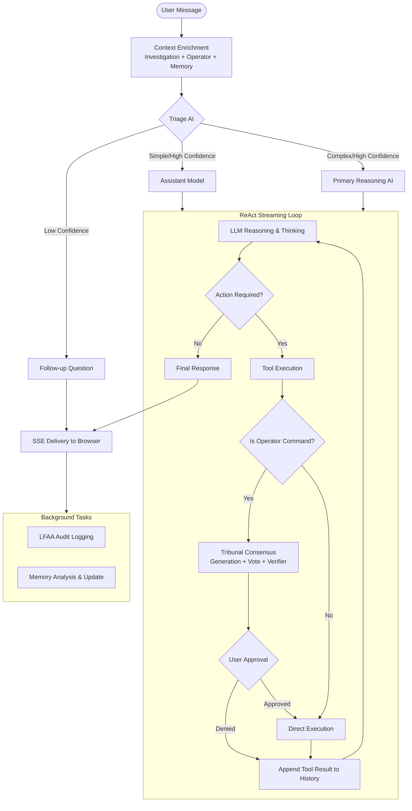
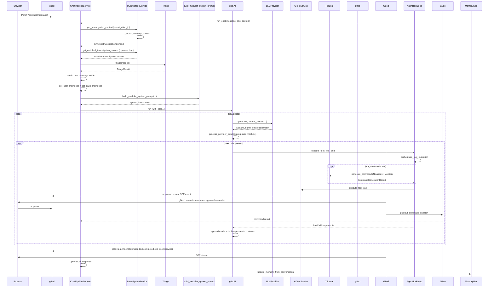
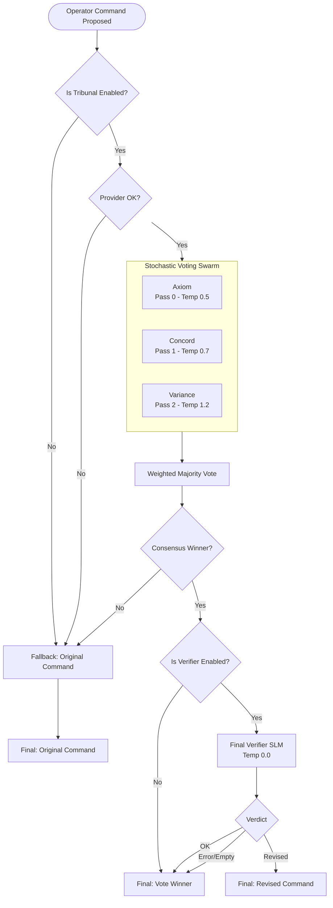

# g8e AI AIs — g8ee Deep Dive

g8ee AI AI architecture — investigation context, dynamic system prompts, memory, operation recording, chat turn flow, service breakdown, prompts, tools, LLM providers, and configuration.

---

## Hierarchy

```
Case
└── Investigation  (1:1 with Case today)
    ├── ConversationHistory  (array of ConversationHistoryMessage)
    └── InvestigationMemory  (AI-generated, per-investigation, persisted separately)
```

- **Case** — top-level issue container; owns `case_id`, title, description, priority, severity
- **Investigation** — the active chat session; owns conversation history, sentinel mode, operator binding state
- **ConversationHistory** — append-only message log; senders are `USER_CHAT`, `AI_PRIMARY`, `AI_ASSISTANT`, `USER_TERMINAL`, `SYSTEM`
- **InvestigationMemory** — AI-extracted preferences and summaries; keyed by `investigation_id`; injected into the system prompt on each turn

---

## High-Level Overview

The g8ee AI is a high-reasoning ReAct streaming loop. Each user message goes through a fixed pipeline orchestrated by `ChatPipelineService`:



1. **Context assembly** — `InvestigationService` resolves the investigation, enriches it with bound operator metadata, retrieved memory, and triage classification.
2. **LLM Proposer call** — The **High Reasoning AI** (Primary model) or **Assistant AI** performs the turn based on triage complexity.
3. **Tool execution** — Tool calls are dispatched sequentially through `execute_turn_tool_calls` in `agent_tool_loop.py`. 
4. **Tribunal Refinement** — `run_commands_with_operator` tool calls pass through the Tribunal (Voting Swarm + Verifier) in `agent_tool_loop.py` before execution.
5. **SSE delivery** — Chunks are translated via `deliver_via_sse` and forwarded to the browser via g8ed in real time.
6. **Persistence** — Results are saved to g8es via `_persist_ai_response` in `chat_pipeline.py`; background memory update tasks are fired.

All state-changing operator actions require explicit user approval. The platform is stateless between turns — all session data lives in g8es (KV) or on the Operator (g8eo via LFAA). All platform-side interactions with g8es are strictly authenticated via the `X-Internal-Auth` shared secret.

---

## Investigation Context

### Pull and Enrichment

`InvestigationService` (`components/g8ee/app/services/investigation/investigation_service.py`) is the single entry point for building the context object the AI receives on every turn. It orchestrates `InvestigationDataService`, `OperatorDataService`, and `MemoryDataService` to assemble a complete picture of the current state.

**Step 1 — fetch:** `get_investigation_context` resolves the `InvestigationModel` via `InvestigationDataService` by `investigation_id` (preferred) or by `case_id` (falls back to the most-recently-created investigation). Lookup retries up to `INVESTIGATION_LOOKUP_MAX_RETRIES` times (default 3) with configurable per-attempt delays (100ms, 200ms, 300ms) to handle propagation lag.

**Step 2 — memory attach:** `_attach_memory_context` fetches the `InvestigationMemory` document for the investigation via `MemoryDataService` and attaches it to the `EnrichedInvestigationContext`.

**Step 3 — operator enrichment:** `get_enriched_investigation_context` iterates `g8e_context.bound_operators` from `G8eHttpContext`, loads each `OperatorDocument` via `OperatorDataService` (only `BOUND` status operators), and populates `operator_documents`.

**Step 4 — operator context extraction:** `extract_all_operators_context` (which uses `_extract_single_operator_context`) maps `OperatorDocument` records to a list of typed `OperatorContext` objects — OS, hostname, architecture, CPU, memory, public IP, username, shell, working directory, timezone, container environment, init system, and cloud-specific fields (type, subtype, intents).

The resulting `EnrichedInvestigationContext` carries:
- `operator_documents` — list of live `OperatorDocument` records from the cache.
- `memory` — the attached `InvestigationMemory` (or `None`).
- `bound_operators` — `BoundOperator` instances from `G8eHttpContext`.
- `operator_session_token` — transient operator session token for authorization validation.

### Security

`get_investigation_context` logs a security warning if `user_id` is not provided — all user-facing queries must be scoped by `user_id` for tenant isolation.

---

## Dynamic System Prompts

`build_modular_system_prompt` (`components/g8ee/app/llm/prompts.py`) assembles the system prompt from independently loaded sections each turn. The composition varies based on `AgentMode` (resolved in `load_mode_prompts`) and runtime state.

### Core Sections (always included)

| Section | File | Description |
|---|---|---|
| `identity` | `prompts_data/core/identity.txt` | AI persona, role, core directives |
| `safety` | `prompts_data/core/safety.txt` | Hard safety constraints, approval requirements |

### Mode Sections (loaded by `load_mode_prompts`)

`AgentMode` is determined by `operator_bound` and `is_cloud_operator`. `load_mode_prompts` (in `prompts_data/loader.py`) loads sections from `AGENT_MODE_PROMPT_FILES`:

| Mode | Loaded When |
|---|---|
| `OPERATOR_BOUND` | Standard operator connected |
| `CLOUD_OPERATOR_BOUND` | Cloud operator connected (AWS/GCP/Azure/g8ep) |
| `OPERATOR_NOT_BOUND` | No operator connected (advisor mode) |

When `OPERATOR_NOT_BOUND` and `g8e_web_search_available` is false, it loads `_no_search` variants of capabilities and execution prompts.

Each mode provides sections: `capabilities`, `execution`, and `tools`. The `tools` section is included if `operator_bound` or `g8e_web_search_available` is true.

### Dynamic Sections (runtime-injected)

**`<system_context>`** — built inline in `build_modular_system_prompt`. In multi-operator scenarios, each operator is wrapped in `<operator index="N">` tags. Includes operator type (System vs Cloud), OS, hostname, username (with UID), working directory, container/init-system status, and any extra model fields from `OperatorContext`. Cloud operators include `granted_intents`.

**`sentinel_mode`** — `prompts_data/system/sentinel_mode.txt` is appended when `investigation.sentinel_mode is True`.

**`<investigation_context>`** — built by `build_investigation_context_section`; injects case title, description, status, priority, severity, and a summary of bound operators (id, hostname, os, arch, type, session prefix).

**`response_constraints`** — `prompts_data/system/response_constraints.txt` is appended to guide AI self-limiting.

**`<learned_context>`** — built by `build_learned_context_section` from `user_memories` and `case_memories`; injects preferences (communication, technical, style, approach, interaction) and previous investigation summaries.

### Section Order

```
1. core/identity.txt
2. core/safety.txt
3. modes/<mode>/capabilities.txt
4. modes/<mode>/execution.txt
5. modes/<mode>/tools.txt          (conditional)
6. <system_context>                (when operator present)
7. system/sentinel_mode.txt        (when sentinel_mode=True)
8. <investigation_context>         (when investigation present)
9. system/response_constraints.txt
10. <learned_context>              (when memories exist)
```

---

## Memory

### InvestigationMemory Fields

| Field | Description |
|---|---|
| `investigation_summary` | What was investigated and outcome — no hostnames, IPs, or identifiers |
| `communication_preferences` | How the user likes to receive information |
| `technical_background` | Inferred skill level and domain expertise |
| `response_style` | Preferred verbosity, tone, format |
| `problem_solving_approach` | How the user approaches debugging / troubleshooting |
| `interaction_style` | Level of autonomy the user prefers |

### Update Lifecycle

1. After the AI response is persisted to DB, `_persist_ai_response` (`chat_pipeline.py`) calls `MemoryGenerationService.update_memory_from_conversation`.
2. `MemoryGenerationService.update_memory_from_conversation` fetches or creates the `InvestigationMemory` document, then calls `_ai_update_memory`.
3. `_ai_update_memory` takes the conversation history, sends it with the memory analysis persona from `agents.json`. The assistant model returns a `MemoryAnalysis` JSON object validated against the Pydantic schema.
4. Non-null fields from the AI response overwrite the existing memory fields; existing values are preserved when the AI returns null.
5. The updated `InvestigationMemory` is saved via `MemoryDataService` through `CacheAsideService` (write-through to g8es KV).

### Injection on the Next Turn

`chat_pipeline._prepare_chat_context` fetches both:
- `get_user_memories(user_id)` — all memories for the user
- `get_case_memories(case_id, user_id)` — all memories for the case (excluding `NEW_CASE_ID`)

User memories contribute preference fields. Case memories contribute `investigation_summary`. Both are injected into the system prompt inside `<learned_context>` tags.

---

## Operation Actions — How They Are Recorded

Every operator-bound action produces an audit trail via LFAA (Local-First Audit Architecture). The audit path runs through `OperatorCommandService.send_lfaa_audit_event`.

### User Message Audit

Before the LLM call, for every bound operator, an `OPERATOR_AUDIT_USER_RECORDED` event is sent carrying the raw user message, `operator_id`, `operator_session_id`, `web_session_id`, `case_id`, and `investigation_id`. This event travels to g8eo via pub/sub and is written to the local audit log on the operator machine.

### AI Response Audit

After the AI response is persisted, an `OPERATOR_AUDIT_AI_RECORDED` event is sent for each bound operator carrying the full response text. Same routing as the user audit.

### Command Execution Audit

When the AI proposes a command via `run_commands_with_operator`, the tool routes through the Tribunal in `agent_tool_loop.py`, then dispatches an approval request to the user via g8ed SSE. The `execution_id` (format: `cmd_<12-char-hex>_<unix-ts>`) is stamped on the tool call before dispatch. On user approval, g8eo executes the command locally, audits the result, and returns it through g8ed back to G8EE. The result is then fed back into the AI's ReAct loop as a function response. `OperatorLFAAService` handles direct terminal execution audits (`OPERATOR_AUDIT_DIRECT_COMMAND_RECORDED`).

---

## Chat Turn Flow



---

## SSE Event Flow Architecture

The SSE (Server-Sent Events) system provides real-time event delivery from g8ee to the browser through g8ed. The flow is unidirectional: g8ee → g8ed → Frontend.

### End-to-End Flow

```mermaid
flowchart LR
    subgraph g8ee [g8ee Component]
        A[ChatPipelineService / AI] --> B[deliver_via_sse]
        B --> C[EventService.publish_investigation_event]
        C --> D[HTTP POST to g8ed /internal/sse/push]
    end

    subgraph g8ed [g8ed Component]
        D --> E[internal_sse_routes.js]
        E --> F{Special Event?}
        F -- OPERATOR_PANEL_LIST_UPDATED --> G[OperatorService.getUserOperators]
        G --> H[Replace with full operator list]
        F -- LLM_CHAT_ITERATION_CITATIONS_RECEIVED --> I[normalizeCitationNums]
        I --> J[Normalize citation numbers]
        F -- Other --> K[G8eePassthroughEvent wrapper]
        H --> L[SSEService.publishEvent]
        J --> L
        K --> L
        L --> M[SSE connection sendToLocal]
    end

    subgraph Frontend [Browser]
        M --> N[SSEConnectionManager.onmessage]
        N --> O[handleSSEEvent]
        O --> P{Infrastructure Event?}
        P -- Yes --> Q[Silently consumed]
        P -- No --> R[_validateEventPayload]
        R --> S{Valid?}
        S -- No --> T[Log error, drop event]
        S -- Yes --> U[eventBus.emit]
        U --> V[Component handlers]
    end
```



### g8ee Event Publishing

g8ee publishes events using `EventType` constants defined in `components/g8ee/app/constants/events.py`. Events are published via:

**`deliver_via_sse`** (`components/g8ee/app/services/ai/AI_sse.py`)
- Translates `StreamChunkFromModel` objects into g8ed EventService pub/sub calls
- Maps stream chunk types to EventType constants:
  - `TEXT` → `LLM_CHAT_ITERATION_TEXT_CHUNK_RECEIVED`
  - `THINKING` → `LLM_CHAT_ITERATION_THINKING_STARTED`
  - `TOOL_CALL` → Tool-specific events (e.g., `LLM_TOOL_G8E_WEB_SEARCH_REQUESTED`)
  - `COMPLETE` → `LLM_CHAT_ITERATION_TEXT_COMPLETED` or `LLM_CHAT_ITERATION_FAILED`

**`EventService.publish_investigation_event`** (`components/g8ee/app/services/infra/g8ed_event_service.py`)
- HTTP POST to g8ed internal endpoint `/internal/sse/push`
- Payload includes: `web_session_id`, `user_id`, `event_type`, `payload`, routing fields (`case_id`, `investigation_id`)

### g8ed Event Receiving and Transformation

**`internal_sse_routes.js`** (`components/g8ed/routes/internal/internal_sse_routes.js`)
- Internal HTTP endpoint that receives SSE push requests from g8ee
- Applies special transformations for specific event types:

| Event Type | Transformation | Purpose |
|---|---|---|
| `OPERATOR_PANEL_LIST_UPDATED` | Replaces g8ee's single-operator payload with g8ed's full operator list via `OperatorService.getUserOperators()` | Frontend needs complete operator panel state, not just the changed operator |
| `LLM_CHAT_ITERATION_CITATIONS_RECEIVED` | Normalizes `citation_num` values to sequential 1-based integers via `normalizeCitationNums()` | g8ee may emit non-sequential citation numbers; frontend requires sequential display |

- Fallback behavior: If operator list fetch fails, logs error and falls back to original g8ee event (prevents silent data loss)
- Wraps all other events in `G8eePassthroughEvent` for passthrough delivery

**`SSEService.publishEvent`** (`components/g8ed/services/platform/sse_service.js`)
- Publishes events to local SSE connections
- Fire-and-forget design: returns `true` even when no connection exists
- Logs warning when no active SSE connection exists for a session (includes event type for debugging)

### Frontend Event Handling

**`SSEConnectionManager`** (`components/g8ed/public/js/utils/sse-connection-manager.js`)
- Establishes SSE connection to g8ed `/sse/events` endpoint
- Receives events via `EventSource.onmessage`
- Parses JSON and calls `handleSSEEvent(data)`

**`handleSSEEvent`** processing:
1. Validates event type is present and is a string
2. Checks if event is infrastructure event (`PLATFORM_SSE_CONNECTION_ESTABLISHED`, `PLATFORM_SSE_KEEPALIVE_SENT`) — silently consumed
3. Drops events with no `data` field (logs warning with event type)
4. **Validates payload** via `_validateEventPayload()`:
   - Ensures payload is an object
   - For known event types, validates required fields exist
   - Returns error message if validation fails
5. Emits validated events to event bus

**Payload validation** (`_validateEventPayload` and `_getRequiredFieldsForEventType`):
- Validates required fields for g8ee chat pipeline events:
  - `LLM_CHAT_ITERATION_TEXT_CHUNK_RECEIVED`: `web_session_id`, `content`
  - `LLM_CHAT_ITERATION_TEXT_COMPLETED`: `web_session_id`
  - `LLM_CHAT_ITERATION_CITATIONS_RECEIVED`: `web_session_id`, `grounding_metadata`
  - `LLM_TOOL_G8E_WEB_SEARCH_REQUESTED`: `web_session_id`, `execution_id`, `query`
  - `OPERATOR_NETWORK_PORT_CHECK_REQUESTED`: `web_session_id`, `execution_id`, `port`
- Unknown event types pass through without validation (forward compatibility)
- Validation failures are logged with event type and error details, event is dropped

### Event Type Constants

**Single source of truth**: `shared/constants/events.json`
- g8ee loads from `components/g8ee/app/constants/events.py` (Python `EventType` enum)
- g8ed loads from `components/g8ed/constants/events.js` (via `shared.js` → `events.json`)
- Frontend loads from `components/g8ed/public/js/constants/events.js`
- All components use identical event type strings

### Frontend Event Handlers

**`chat-sse-handlers.js`** (`components/g8ed/public/js/components/chat-sse-handlers.js`)
- Mixin that registers event bus listeners for all g8ee chat pipeline events
- Maps each event type to a handler method:
  - `LLM_CHAT_ITERATION_TEXT_CHUNK_RECEIVED` → `handleAITextChunk`
  - `LLM_CHAT_ITERATION_TEXT_COMPLETED` → `handleResponseComplete`
  - `LLM_CHAT_ITERATION_CITATIONS_RECEIVED` → `handleCitationsReady`
  - `LLM_CHAT_ITERATION_FAILED` → `handleChatError`
  - `LLM_TOOL_G8E_WEB_SEARCH_REQUESTED` → `handleSearchWebIndicator`
  - `OPERATOR_NETWORK_PORT_CHECK_REQUESTED` → `handleNetworkPortCheckIndicator`

**`thinking.js`** (`components/g8ed/public/js/components/thinking.js`)
- Handles `LLM_CHAT_ITERATION_THINKING_STARTED` events
- Displays thinking indicator in the UI

### Error Handling and Resilience

**g8ee side**:
- `deliver_via_sse` catches exceptions during streaming:
  - `CancelledError`: Publishes `LLM_CHAT_ITERATION_FAILED` with fixed error message, re-raises
  - `G8eError` subclasses (OperationError, NetworkError, RateLimitError): Populates `payload.error` with `str(e)`
  - Generic `Exception`: Logs error, publishes `LLM_CHAT_ITERATION_FAILED`, does not re-raise
- Retry loop for transient errors (429, 503) with exponential backoff

**g8ed side**:
- `internal_sse_routes.js`: Returns 500 on publish failures, logs error details
- `SSEService.publishEvent`: Fire-and-forget design — logs warning when no connection exists
- Fallback for operator list fetch: Logs error, sends original event to prevent data loss

**Frontend side**:
- `SSEConnectionManager`: Validates payloads before emitting to event bus
- Drops malformed events with error logging (includes event type)
- Infrastructure events are silently consumed (not errors)
- Reconnection logic with exponential backoff for connection failures

### Testing

**g8ee integration tests** (`components/g8ee/tests/integration/test_sse_event_contract_integration.py`):
- Verifies g8ee events match shared fixture structures
- Tests event contract compliance for all g8ee chat pipeline events
- Validates routing fields (`web_session_id`, `investigation_id`, `case_id`)

**g8ed unit tests** (`components/g8ed/test/unit/routes/internal/internal_sse_routes.unit.test.js`):
- Tests citation normalization for `LLM_CHAT_ITERATION_CITATIONS_RECEIVED`
- Tests operator list replacement for `OPERATOR_PANEL_LIST_UPDATED`
- Tests fallback behavior when operator list fetch fails
- Tests malformed event payload handling

**Frontend unit tests** (`components/g8ed/test/unit/frontend/sse/sse-connection-manager.unit.test.js`):
- Tests event payload validation for all g8ee chat pipeline event types
- Tests infrastructure event handling
- Tests malformed payload rejection
- Tests event bus dispatch fidelity

---

## Service Breakdown

| Service | File | Responsibility |
|---|---|---|
| `ChatPipelineService` | `components/g8ee/app/services/ai/chat_pipeline.py` | Top-level orchestrator — assembles context, calls AI, persists results |
| `ChatTaskManager` | `components/g8ee/app/services/ai/chat_task_manager.py` | Owns asyncio task tracking and cancellation for in-flight AI chat processing |
| `g8eEngine` | `components/g8ee/app/services/ai/agent.py` | ReAct streaming loop — retry logic, function loop, SSE delivery |
| `InvestigationService` | `components/g8ee/app/services/investigation/investigation_service.py` | (Domain Layer) Investigation fetch, operator enrichment, memory attachment, history orchestration |
| `InvestigationDataService` | `components/g8ee/app/services/investigation/investigation_data_service.py` | (Data Layer) Pure CRUD for investigations and chat message persistence |
| `AIToolService` | `components/g8ee/app/services/ai/tool_service.py` | Tool registration, declaration building, tool call dispatch |
| `MemoryGenerationService` | `components/g8ee/app/services/ai/memory_generation_service.py` | AI-backed memory analysis and update |
| `MemoryDataService` | `components/g8ee/app/services/investigation/memory_data_service.py` | (Data Layer) Pure CRUD for InvestigationMemory |
| `TriageAgent.triage` | `components/g8ee/app/services/ai/triage.py` | Route to main vs assistant model via intent and complexity classification. Persona loaded from `agents.json`. |
| `process_provider_turn` | `components/g8ee/app/services/ai/agent_turn.py` | Thinking state machine, chunk parsing, TurnResult assembly. |
| `execute_turn_tool_calls` | `components/g8ee/app/services/ai/agent_tool_loop.py` | Sequential tool call dispatch via `orchestrate_tool_execution` + grounding merge; `ToolCallResult.tribunal_result` surfaces the full `CommandGenerationResult`. |
| `execute_tool_call` | `components/g8ee/app/services/ai/tool_service.py` | Single function dispatch via `_tool_handlers` dict — returns `ToolResult`. |
| `deliver_via_sse` | `components/g8ee/app/services/ai/agent_sse.py` | StreamChunkFromModel → g8ed SSE event translation. |
| `generate_command` | `components/g8ee/app/services/ai/command_generator.py` | Tribunal: N generation passes + weighted vote + verifier. Persona templates in `agents.json`. |
| `EventService` | `components/g8ee/app/services/infra/g8ed_event_service.py` | g8ee → g8ed HTTP event push. |
| `AIRequestBuilder` | `components/g8ee/app/services/ai/request_builder.py` | `build_contents_from_history`, generation config, attachment parts. |
| `AIGenerationConfigBuilder` | `components/g8ee/app/services/ai/generation_config_builder.py` | Provider-specific generation config construction. |
| `AIResponseAnalyzer` | `components/g8ee/app/services/ai/response_analyzer.py` | Post-generation response classification and metadata extraction (risk, error, file safety). |
| `EvalJudge` | `components/g8ee/app/services/ai/eval_judge.py` | AI Accuracy Evaluation Judge — grades AI performance against gold standard using persona in `agents.json`. |
| `BenchmarkJudge` | `components/g8ee/app/services/ai/benchmark_judge.py` | Deterministic AI Benchmark Judge — regex-matches tool call payloads for binary pass/fail grading with Tribunal delta tracking. |
| `OperatorLFAAService` | `components/g8ee/app/services/operator/lfaa_service.py` | LFAA audit event publishing for direct operator terminal commands. |

---

## AI Persona Registry

Every AI in the platform has a first-class persona definition in `shared/constants/AIs.json` under `AI.metadata`. The schema ensures every AI is fully self-describing for runtime introspection, UI rendering, and prompt engineering.

### Persona Schema

| Field | Type | Description |
|---|---|---|
| `id` | `string` | Unique AI identifier (kebab-case) |
| `display_name` | `string` | Human-readable name for UI display |
| `icon` | `string` | Lucide icon name for UI rendering |
| `description` | `string` | One-line functional summary |
| `role` | `string` | Functional role (`classifier`, `reasoner`, `responder`, `arbitrator`, `validator`, `summarizer`, `tribunal_member`) |
| `model_tier` | `string` | LLM tier used at runtime (`primary` = high-reasoning model, `assistant` = fast/lightweight model) |
| `temperature` | `number \| null` | Fixed temperature value, or `null` for user-configurable |
| `tools` | `string[]` | List of tool names available to this AI (empty for non-tool-calling AIs) |
| `identity` | `string` | Deep persona description — who the AI is, how it thinks, its behavioral characteristics |
| `purpose` | `string` | Specific mission statement — what the AI does and the standards it must meet |
| `autonomy` | `string` | Autonomy level (`fully_autonomous` = no human approval needed, `human_approved` = requires explicit user consent for state-changing actions) |

### AI Registry

| AI | Role | Model Tier | Temp | Tools | Autonomy |
|---|---|---|---|---|---|
| **Triage** | classifier | primary | null (configurable) | none | fully_autonomous |
| **Primary** | reasoner | primary | null (configurable) | full tool set | human_approved |
| **Assistant** | responder | assistant | null (configurable) | full tool set | human_approved |
| **Tribunal** | arbitrator | assistant | null (composite) | none | fully_autonomous |
| **Verifier** | validator | assistant | 0.0 | none | fully_autonomous |
| **Title Generator** | summarizer | assistant | 0.7 | none | fully_autonomous |
| **Axiom** | tribunal_member | assistant | 0.0 | none | fully_autonomous |
| **Concord** | tribunal_member | assistant | 0.4 | none | fully_autonomous |
| **Variance** | tribunal_member | assistant | 0.8 | none | fully_autonomous |

### Contract Tests

Both g8ed and g8ee have contract tests that validate every AI metadata entry has all required persona fields with correct types:

- **g8ed**: `components/g8ed/test/contracts/shared-AI-constants.test.js`
- **g8ee**: `components/g8ee/tests/unit/utils/test_shared_AI_constants.py`

### Model Definitions

Each AI that has a distinct request/response contract also has a JSON schema in `shared/models/AIs/`:

| AI | File |
|---|---|
| Triage | `shared/models/AIs/triage.json` |
| Primary | `shared/models/AIs/primary.json` |
| Assistant | `shared/models/AIs/assistant.json` |
| Tribunal | `shared/models/AIs/tribunal.json` |
| Verifier | `shared/models/AIs/verifier.json` |
| Title Generator | `shared/models/AIs/title_generator.json` |

Tribunal members (Axiom, Concord, Variance) share the Tribunal model definition — they are roles within the Tribunal, not independent AIs.

---

## Prompts

### Architecture

Prompts are plain text files loaded at runtime by `components/g8ee/app/prompts_data/loader.py`. Nothing is hardcoded in Python except the composition logic in `build_modular_system_prompt`. The `PromptFile` enum maps logical names to file paths. `load_prompt` reads and caches by filename. `load_mode_prompts` loads all sections for the resolved mode directory.

### Prompt Files

```
components/g8ee/app/prompts_data/
  core/
    identity.txt              — AI persona and role
    safety.txt                — hard safety constraints and approval rules
  system/
    response_constraints.txt  — response length and formatting guidance
    sentinel_mode.txt         — PII/secret scrubbing instructions
  modes/
    operator_bound/           — standard operator connected mode
    cloud_operator_bound/     — cloud operator (AWS/GCP/Azure) mode
    operator_not_bound/       — advisory-only mode, no command execution
  tools/
    run_commands_with_operator.txt
    file_create_on_operator.txt
    file_write_on_operator.txt
    file_read_on_operator.txt
    file_update_on_operator.txt
    list_files_and_directories_with_detailed_metadata.txt
    check_port_status.txt
    g8e_web_search.txt
    read_file_content.txt
    grant_intent_permission.txt
    revoke_intent_permission.txt
    fetch_execution_output.txt
    fetch_session_history.txt
    fetch_file_history.txt
    fetch_file_diff.txt
    restore_file.txt
```

Function prompt files are used as `FunctionDeclaration.description` values passed directly to the LLM in the tool schema.

### Memory Analysis Prompts

Memory analysis uses the `memory_generator` persona defined in `shared/constants/agents.json`. The AI is instructed to distill conversation patterns into structured fields (summary, communication, technical, style, approach, interaction).

### Triage Prompt

Triage uses the `triage` persona defined in `shared/constants/agents.json`. It classifies messages by complexity (simple/complex) and intent (information/action/unknown). The prompt is loaded via `get_agent_persona("triage")` in `triage.py`.

---

## Tools

`AIToolService` (`components/g8ee/app/services/ai/tool_service.py`) registers all tools at construction time. Each tool is a pair of `(FunctionDeclaration, executor)` stored in `_tool_declarations` and `_tool_executors` dicts keyed by `OperatorToolName`.

### Tool Dispatch Mechanism

Tool execution uses a dispatch table pattern:
- `_tool_handlers` (dict[str, Callable]) built by `_build_tool_handlers()` maps tool names to handler coroutines
- Each tool has a `_handle_*` method with uniform signature: `(self, tool_args, investigation, g8e_context, request_settings) -> ToolResult`
- Handler lookup: `self._tool_handlers.get(tool_name)`
- This replaces the previous long if/elif chain for better maintainability

`OPERATOR_TOOLS` is a `frozenset` constant in `components/g8ee/app/constants/status.py` containing all operator tool values, imported by both `tool_service.py` and `agent_tool_loop.py`.

Tool declarations are served to the LLM via `get_tools(AI_mode, model_name)`. Models that do not support tools (checked via `get_model_config`) receive an empty list.

### Tool Set by Workflow

**`OPERATOR_NOT_BOUND`** — `query_investigation_context` + `search_web` (when `VERTEX_SEARCH_ENABLED` is set and credentials are present).

**`OPERATOR_BOUND`** — all operator tools plus `query_investigation_context` and `search_web` when configured.

**`CLOUD_OPERATOR_BOUND`** — all operator tools plus `query_investigation_context` and `search_web` when configured.

### Tool Reference

| Tool (`OperatorToolName`) | Category | Description |
|---|---|---|
| `run_commands_with_operator` | Execution | Run a shell command on the bound operator — passes through Tribunal + user approval |
| `file_create_on_operator` | File ops | Create a new file with content |
| `file_write_on_operator` | File ops | Overwrite an existing file |
| `file_read_on_operator` | File ops | Read file content from the operator |
| `file_update_on_operator` | File ops | Find-and-replace edit within a file |
| `list_files_and_directories_with_detailed_metadata` | File ops | List directory contents with metadata |
| `check_port_status` | Network | TCP port reachability check — always available when operator is bound |
| `grant_intent_permission` | Cloud | Grant a least-privilege cloud API intent to a cloud operator |
| `revoke_intent_permission` | Cloud | Revoke a previously granted cloud API intent |
| `fetch_file_history` | File ops | Retrieve the version history of a file on the operator |
| `fetch_file_diff` | File ops | Retrieve a diff between two versions of a file on the operator |
| `g8e_web_search` | Search | Web search via Vertex AI Search — available in both bound and unbound workflows when configured |
| `query_investigation_context` | General | Query investigation state (conversation history, status, history trail, operator actions) — universal tool available in all workflows |

Additional tools in `OPERATOR_TOOLS` (registered but less commonly used):
- `read_file_content` — Read file content (alternative to file_read_on_operator)
- `fetch_execution_output` — Fetch output of a previously executed command
- `fetch_session_history` — Fetch session history
- `restore_file` — Restore a file to a previous version

### `search_web` Tool

`search_web` is conditionally registered. At startup, `AIToolService.__init__` checks whether a `WebSearchProvider` was injected. If `VERTEX_SEARCH_ENABLED` is set and GCP credentials are present, `WebSearchProvider` is constructed and passed in; otherwise the tool is omitted entirely.

After `search_web` executes, `AI_tool_loop` calls `web_search_provider.build_search_web_grounding` to construct a `GroundingMetadata` object. If `grounding_used` is true, it is merged into the turn's grounding metadata and emitted as a `CITATIONS` chunk at the end of the turn.

### Tool and Function Call Semantics

g8ee distinguishes between **Tool Declarations** (the schema provided to the LLM) and **Tool Calls** (the request from the LLM to execute a tool).

- **ToolDeclaration** (`app.llm.llm_types.ToolDeclaration`) — A container for one or more `ToolDeclarations` (function schemas) and built-in capabilities like `google_search`. This aligns with the Google GenAI SDK `types.Tool` structure.
- **ToolDeclarations** (`app.llm.llm_types.ToolDeclarations`) — The definition of a specific function, including its name, description, and JSON schema parameters.
- **ToolCall** (`app.llm.llm_types.ToolCall`) — An instance of a model requesting a tool execution, containing the tool `name`, `args`, and a unique `id` (crucial for Gemini 3 multi-turn reliability).

### `run_commands` and the Tribunal

When the LLM calls `run_commands_with_operator`, `execute_tool_call` intercepts it. The command passes through the Tribunal (`components/g8ee/app/services/ai/command_generator.py`) to ensure syntactic precision and cross-model consensus.

#### Target Operator Resolution

Before Tribunal processing, the system resolves the target operator for command generation using `extract_operator_context_by_target()`. The `target_operator` parameter can be:

- **Operator ID** (e.g., "op-linux") - Exact match on operator identifier
- **Hostname** (e.g., "server-01") - Match on operator hostname  
- **Index** (e.g., "0", "1", "2") - Position in bound operators list
- **Unspecified** - Falls back to first operator (backward compatibility)

The resolved operator's OS context (OS name, shell, working directory) is passed to the Tribunal for command refinement, ensuring the generated command is appropriate for the target system. Event broadcasting also uses the resolved operator_id and operator_session_id for accurate audit trails.

#### Tribunal Model Resolution

The Tribunal resolves its own (provider, model) pair via `_resolve_provider_and_model`. The model is chosen via the fallback chain (assistant_model -> primary_model -> provider default). The provider is then **sourced from the `assistant_provider` setting** (falling back to `primary_provider`) if the chosen model is the assistant model. This decouples the Tribunal model from the primary chat provider: e.g. a user with `primary_provider=gemini` and `assistant_provider=ollama` with `assistant_model=gemma4:e4b` will route Tribunal calls to the Ollama endpoint, not Gemini.

The Tribunal implements a **Stochastic Multi-AI Consensus** pattern using three distinct roles:



#### 1. The Proposer (Primary AI)
- **Role**: Heavy lifting, generating initial complex code or architectural plans.
- **Thinking Level**: Set to high for deep logical exploration.
- **Temperature**: Governed by platform defaults (typically 1.0) to allow optimal pathfinding.

#### 2. The Voting Swarm (Validators / Skeptics)
- **Role**: Inducing sampling diversity to catch hallucinations and edge cases.
- **Thinking Level**: Set to lowest supported (minimal/low) to save compute/latency while relying on aggregate accuracy.
- **Temperature**: Spanned across the swarm to induce diversity, sourced from shared/constants/AIs.json:
    - **Axiom** (Pass 0): 0.5 (Fully deterministic, statistical probability and resource efficiency)
    - **Concord** (Pass 1): 0.7 (Moderate determinism with ethical flexibility)
    - **Variance** (Pass 2): 1.2 (High creativity and intentional unpredictability)

#### 3. The Final Verifier (Consensus Orchestrator)
- **Role**: Deterministic arbitration and final verdict formatting.
- **Thinking Level**: Set to low or off to avoid overthinking penalties.
- **Temperature**: Strictly **0.0** (greedy decoding) for absolute reliability.

#### Configuration

| Setting | DB Key | Default | Description |
|---|---|---|---|
| `LLM_COMMAND_GEN_ENABLED` | `llm_command_gen_enabled` | `true` | Master switch — `false` skips the Tribunal entirely |
| `LLM_COMMAND_GEN_PASSES` | `llm_command_gen_passes` | `3` | Number of parallel generation passes |
| `LLM_COMMAND_GEN_VERIFIER` | `llm_command_gen_verifier` | `true` | Enable/disable the verifier pass |

#### Pipeline Stages

**Stage 1 — Generation (`_run_generation_stage` / `_run_generation_pass`)**

`LLM_COMMAND_GEN_PASSES` coroutines are launched concurrently. Each pass assigns a Tribunal member (Axiom, Concord, or Variance) with its specific temperature. The assistant SLM is instructed to return only the exact command string — no explanation, no markdown fences.

Raw output is normalised by `_normalise_command`: strips surrounding whitespace, trailing newlines, and any ` ```bash `, ` ```shell `, ` ```sh `, or ` ``` ` fences. Each pass emits a `TRIBUNAL_VOTING_PASS_COMPLETED` SSE event carrying the `pass_index`, the normalised candidate (or `None`), and a `success` flag.

Thinking is enabled for models that support it but forced to the lowest available level (`get_lowest_thinking_level`) with `include_thoughts=False` — minimises latency on this fast-path.

**Stage 2 — Weighted Majority Vote (`_run_voting_stage` / `_weighted_vote`)**

```
weight[candidate] += 1 / (pass_index + 1)
```

Each pass `i` (0-indexed) contributes `1/(i+1)` to its candidate's aggregate weight. This means:
- Pass 0 contributes `1.0`
- Pass 1 contributes `0.5`
- Pass 2 contributes `0.333`

Candidates that are identical (after normalisation) accumulate weight. The string with the highest aggregate weight is the vote winner. The normalised score is `winner_weight / total_weight` — a value between 0 and 1 representing how dominant the winner was.

If all passes produce unique strings, every candidate has equal weight and the earliest pass (pass 0) wins by tiebreak (Python `max` with stable ordering). If no candidates were produced (all passes failed), `_weighted_vote` returns `(None, 0.0)` and the pipeline falls back.

A `TRIBUNAL_VOTING_CONSENSUS_REACHED` SSE event is emitted carrying `vote_winner`, `vote_score`, `num_candidates`, and `original_command`.

**Stage 3 — Verification (`_run_verification_stage` / `_run_verifier`)**

Skipped when `LLM_COMMAND_GEN_VERIFIER=false`. Otherwise, a single SLM call at temperature `0.0` evaluates the vote winner against `_VERIFIER_PROMPT_TEMPLATE`. The verifier receives the intent, OS, and the candidate command, and must respond with exactly one of:

- `ok` — command is syntactically correct and fulfils the intent
- A corrected command string — if there is a syntax error, wrong quoting, wrong escaping, or a missing flag

The verifier emits `TRIBUNAL_VOTING_REVIEW_STARTED` before the call and `TRIBUNAL_VOTING_REVIEW_COMPLETED` after, carrying a `VerifierReason`:

| `VerifierReason` | Meaning |
|---|---|
| `ok` | Verifier returned `"ok"` — command approved as-is |
| `revised` | Verifier returned a different command — revision adopted |
| `empty_response` | Verifier returned nothing — raises `TribunalVerifierFailedError` |
| `no_valid_revision` | Verifier returned non-ok but revision equals original or is empty — raises `TribunalVerifierFailedError` |
| `verifier_error` | Verifier call threw an exception — raises `TribunalVerifierFailedError` |

Verifier failures raise `TribunalVerifierFailedError` and halt command execution.

**Stage 4 — Outcome**

The `CommandGenerationResult` carries `original_command`, `final_command`, `outcome`, `candidates`, `vote_winner`, `vote_score`, `verifier_passed`, and optionally `verifier_revision`.

| `CommandGenerationOutcome` | Condition |
|---|---|
| `VERIFIED` | Verifier enabled and approved the vote winner |
| `VERIFICATION_FAILED` | Verifier enabled and produced a revision — `final_command` is the verifier's output |
| `CONSENSUS` | Verifier disabled — `final_command` is the vote winner |
| `FALLBACK` | Provider unavailable, all passes failed (non-system), or no vote winner — `final_command` is `original_command` unchanged |
| `DISABLED` | Tribunal disabled via `LLM_COMMAND_GEN_ENABLED=false` |
| `SYSTEM_ERROR` | All generation passes failed due to system errors (auth, network, config) — command execution is **halted**, not silently fallen back |

If `final_command != original_command` the tribunal refined the command. `AI_tool_loop` updates `tool_args["command"]` with the refined value before passing to `AIToolService.execute_tool_call`.

A `TRIBUNAL_SESSION_COMPLETED` SSE event (or `TRIBUNAL_SESSION_FALLBACK_TRIGGERED`) is emitted at the end of every pipeline run.

#### Fallback and Error Reasons

| Type | Reason | Trigger |
|---|---|---|
| Fallback | `disabled` | `LLM_COMMAND_GEN_ENABLED=false` |
| Fallback | `all_passes_failed` | Every generation pass returned `None` (non-system errors) |
| Error | `provider_unavailable` | No LLM Provider configuration — raises `TribunalProviderUnavailableError` |
| Error | `all_passes_failed` | Every generation pass failed (non-system) — raises `TribunalGenerationFailedError` |
| Error | `verifier_failed` | Verifier malfunction (empty, no revision, exception) — raises `TribunalVerifierFailedError` |
| Error | `system_error` | All passes failed due to system errors (401, connection refused, DNS, SSL, etc.) — raises `TribunalSystemError` |

#### Tribunal Error Handling

Tribunal exception handlers in `orchestrate_tool_execution` use a shared `_tribunal_error_result(tool_name, original_command, error_msg)` helper to return consistent error results for all Tribunal failure modes. This helper creates a `ToolCallResult` with a `CommandExecutionResult` containing the error message and `EXECUTION_ERROR` type.

The `TribunalFallbackPayload` includes `pass_errors: list[str] | None` for diagnostic visibility into individual pass failure messages.

The `execution_id` (format: `cmd_<12-char-hex>_<unix-ts>`) is attached to the function args before dispatch. This ID is used for `fetch_execution_output` lookups and audit correlation.

---

## LLM Providers

The provider abstraction lives in `components/g8ee/app/llm/provider.py` (`LLMProvider` ABC). The factory (`components/g8ee/app/llm/factory.py`) constructs a fresh provider per request from the resolved `LLMSettings`. All providers translate between g8ee's canonical `llm_types` and their SDK-native types.

> **Model Configuration Registry:** All supported models, their capabilities (thinking levels, tool support, context windows), and constraints are defined in `components/g8ee/app/models/model_configs.py`. See the [g8ee component documentation](../components/g8ee.md#llm-configuration) for a complete list of supported models across all providers.

### Gemini (`components/g8ee/app/llm/providers/gemini.py`)

- **SDK:** `google-genai`
- **Provider value:** `gemini`
- **Key:** `GEMINI_API_KEY`
- **Recommended models:** `gemini-3.1-pro-preview` (primary), `gemini-3.1-flash-lite-preview` (high-performance), `gemini-3-flash-preview` (assistant)
- **Thinking API:** Gemini 3 and 3.1 use `thinking_config` (`include_thoughts` + `thinking_level`). The provider applies the correct API shape based on model generation.
- **Thought signatures:** Required on every `tool_call` Part (400 if omitted). Stored as base64 string in canonical types; inbound SDK bytes are encoded on receipt.
- **Function Calling:** Gemini 3 requires unique `id` mapping for `function_call` and `function_response` parts. Tool/Function response parts are mapped to the `user` role for multi-turn reliability.
- **Temperature:** Default 1.0 (strongly recommended for Gemini 3).
- **SSL/TLS:** Uses `certifi` CA bundle for secure connection to Google APIs.
- **Retry:** Uses `tenacity` with `AsyncRetrying`, exponential backoff, `retry_if_exception` for transient errors (500, 503, 429).

### Anthropic (`components/g8ee/app/llm/providers/anthropic.py`)

- **SDK:** `anthropic`
- **Provider value:** `anthropic`
- **Key:** `ANTHROPIC_API_KEY`
- **Recommended models:** `claude-opus-4-6` (primary), `claude-sonnet-4-6` (assistant), `claude-haiku-4-5` (lite)
- **Message translation:** `_contents_to_anthropic` maps `model` role → `assistant`, `user` role → `user`. Thinking parts emit `{"type": "thinking", "thinking": ..., "signature": ...}`. Tool calls emit `tool_use` blocks; tool responses emit `tool_result` blocks.
- **System prompt:** Passed as a top-level `system` parameter, not embedded in the messages array.

### OpenAI (`components/g8ee/app/llm/providers/open_ai.py`)

- **SDK:** `openai` (AsyncOpenAI)
- **Provider value:** `openai`
- **Key:** `OPENAI_API_KEY`
- **Endpoint:** `OPENAI_ENDPOINT` - `https://api.openai.com/v1` by default
- **Recommended models:** `gpt-4o` (primary), `gpt-4o-mini` (assistant)
- **Message translation:** `_contents_to_messages` injects system instructions as the first `{"role": "system"}` message. Tool calls become `tool_calls` arrays on `assistant` messages. Function responses become `{"role": "tool"}` messages.
- **SSL strategy:** Cloud providers (Gemini, Anthropic, OpenAI) use `certifi` (Mozilla's public CA bundle) to bypass the global `G8E_SSL_CERT_FILE` env var that points to the internal platform CA. Internal endpoints use the platform CA cert via `ca_cert_path`. The factory passes `ca_cert_path` only to providers that may use internal endpoints; each provider's `_is_internal_endpoint()` selects the correct verify source.

---

## Using `scripts/tools/setup-llm.sh`

`setup-llm.sh` configures the LLM provider for G8EE. It writes settings directly to the platform DB via `manage-g8es.py settings` running inside the `g8ep` container. Settings take effect on the next platform restart — no rebuild required.

Run via the `g8e` CLI:

```bash
./g8e llm setup       # interactive
```

### Interactive Mode

Running without arguments launches an interactive prompt. The script reads the current provider and model from the platform DB and presents them as defaults.

```
1) Gemini       (Google — recommended, most tested)
2) Anthropic    (Claude)
3) OpenAI       (GPT)
4) Ollama       (remote Ollama server)
```

Each provider prompts for its required credentials and model names.

### Non-Interactive Mode

Pass `--provider` to bypass prompts. All flags:

| Flag | Required By | Description |
|---|---|---|
| `--provider` | all | `gemini` \| `anthropic` \| `openai` \| `ollama` \| `vllm` |
| `--model` | all | Primary model name |
| `--asst-model` | optional | Assistant model name (defaults to provider default) |
| `--gemini-key` | Gemini | `GEMINI_API_KEY` |
| `--anthropic-key` | Anthropic | `ANTHROPIC_API_KEY` |
| `--api-key` | OpenAI (required), vLLM (optional) | `LLM_API_KEY` |
| `--endpoint` | Ollama, vLLM | API base URL |

Examples:

```bash
# Gemini
./g8e llm setup --provider gemini --gemini-key AIza...

# Anthropic
./g8e llm setup --provider anthropic --anthropic-key sk-ant-...

# OpenAI
./g8e llm setup --provider openai --api-key sk-... --model gpt-4o --asst-model gpt-4o-mini

# Ollama (remote)
./g8e llm setup --provider ollama --endpoint https://your-ollama-host:11434/v1 --model gemma4:e4b --asst-model gemma4:e4b

# vLLM (self-hosted)
./g8e llm setup --provider vllm --endpoint https://your-host:443/v1 --model your-model
```

### What Gets Written to DB

The script calls `manage-g8es.py settings set` inside the running `g8ep` container with these keys:

| DB Key | Maps To |
|---|---|
| `llm_provider` | `LLM_PROVIDER` (`gemini`, `anthropic`, `openai`, or `ollama`) |
| `llm_model` | `LLM_MODEL` |
| `llm_assistant_model` | `LLM_ASSISTANT_MODEL` |
| `llm_endpoint` | `LLM_ENDPOINT` (OpenAI, Ollama, and vLLM) |
| `llm_api_key` | `LLM_API_KEY` (OpenAI and vLLM; Ollama uses placeholder) |
| `gemini_api_key` | `GEMINI_API_KEY` (Gemini only) |
| `anthropic_api_key` | `ANTHROPIC_API_KEY` (Anthropic only) |

If the platform is running, the script writes via the g8ed internal API. If g8ed is unavailable, it falls back to writing directly to g8es. If the platform is not running at all, the DB write is skipped and a warning is printed.

Apply settings without a full rebuild:

```bash
./g8e platform restart
```

---

## Configuring Command Validation (Whitelist/Blacklist)

Command validation controls which commands the AI is allowed to execute on operators. These settings are configured **per-user** and provide an additional layer of safety beyond the Tribunal and human approval gates.

### Configuration Options

Command validation is controlled via the `command_validation` field in user settings:

| Setting | Type | Default | Purpose |
|---------|------|---------|---------|
| `enable_whitelisting` | bool | `false` | Restrict AI to only pre-approved commands |
| `enable_blacklisting` | bool | `false` | Block commands matching dangerous patterns |

### How to Configure

Users can configure command validation through:

1. **Settings UI** — Navigate to Settings → Command Validation to enable/disable whitelist and blacklist
2. **API** — Update user settings via the `/api/settings/user` endpoint with the `command_validation` field

### How It Works

- **Whitelist mode** — When enabled, the AI can only execute commands that are explicitly allowed. All other commands are blocked before reaching the approval prompt.
- **Blacklist mode** — When enabled, commands matching dangerous patterns (e.g., `rm -rf`, destructive operations) are blocked before reaching the approval prompt.
- **Tribunal awareness** — The AI is informed of active command constraints via the `get_command_constraints` tool, ensuring the Tribunal considers these rules during command generation.

> **Note:** Command validation is a per-user setting. Each user can configure their own whitelist/blacklist preferences independently. For full details on the security model and enforcement layers, see [Security Architecture — Command Allowlist and Denylist](security.md#command-allowlist-and-denylist).

Apply settings without a full rebuild:

```bash
./g8e platform restart
```
