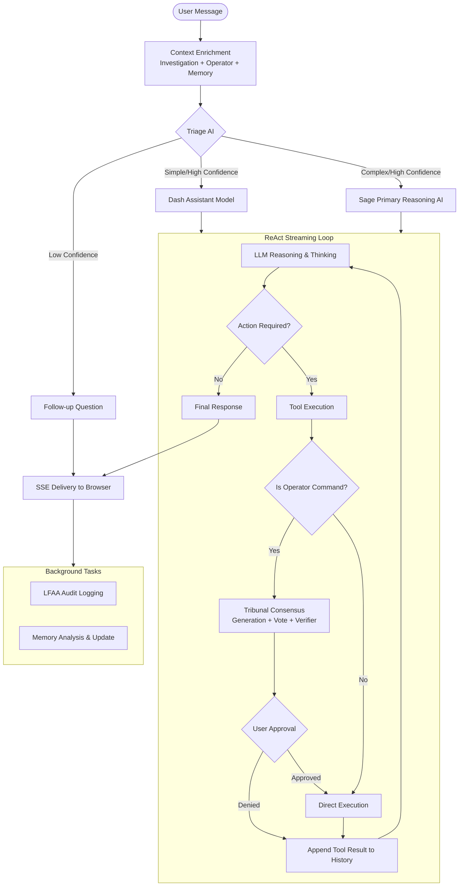
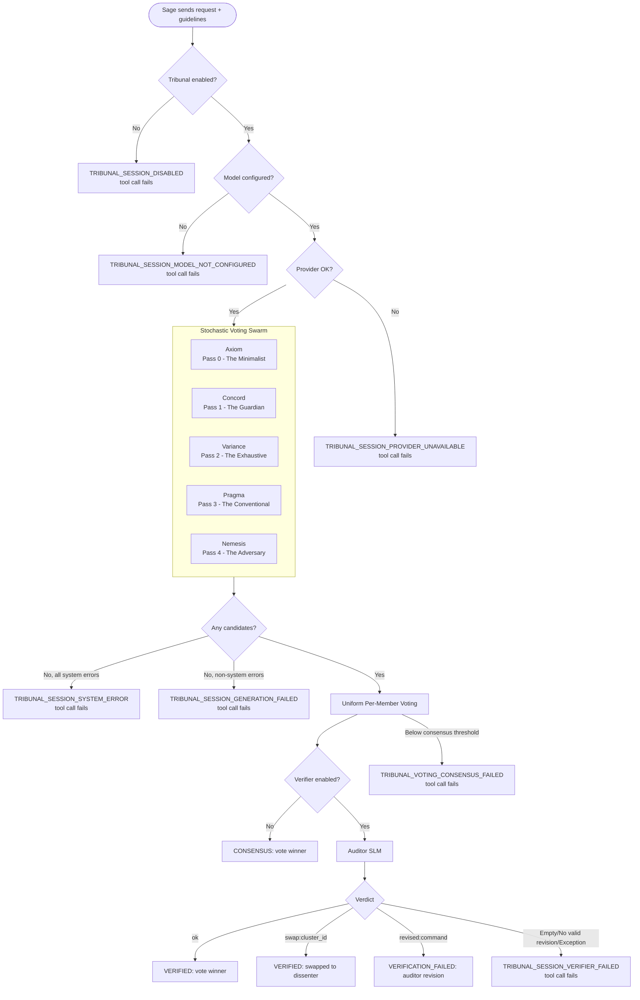

# g8e AI AIs — g8ee Deep Dive

g8ee AI AI architecture — investigation context, dynamic system prompts, memory, operation recording, chat turn flow, service breakdown, prompts, tools, LLM providers, and configuration.

---

## Hierarchy

```
Case
└── Investigation  (1:1 with Case today)
    ├── ConversationHistory  (array of ConversationHistoryMessage)
    └── InvestigationMemory  (AI-generated, per-investigation, persisted separately)
```

- **Case** — top-level issue container; owns `case_id`, title, description, priority, severity
- **Investigation** — the active chat session; owns conversation history, sentinel mode, operator binding state
- **ConversationHistory** — append-only message log; senders are `USER_CHAT`, `AI_PRIMARY`, `AI_ASSISTANT`, `USER_TERMINAL`, `SYSTEM`
- **InvestigationMemory** — AI-extracted preferences and summaries; keyed by `investigation_id`; injected into the system prompt on each turn

---

## High-Level Overview

The g8ee AI is a high-reasoning ReAct streaming loop. Each user message goes through a fixed pipeline orchestrated by `ChatPipelineService`:



1. **Context assembly** — `InvestigationService` resolves the investigation, enriches it with bound operator metadata, retrieved memory, and triage classification.
2. **LLM Proposer call** — The **High Reasoning AI** (Sage) or **Assistant AI** (Dash) performs the turn based on triage complexity.
3. **Tool execution** — Tool calls are dispatched sequentially through `execute_turn_tool_calls` in `agent_tool_loop.py`. 
4. **Tribunal Refinement** — `run_commands_with_operator` tool calls pass through the Tribunal (Voting Swarm + Auditor) in `agent_tool_loop.py` before execution. The reasoning agent sends a natural-language **request** plus optional **guidelines** — never a command string. Five parallel generation passes (Axiom, Concord, Variance, Pragma, Nemesis) each translate intent into a candidate; uniform per-member voting selects a winner with deterministic tie-breaking; the Auditor verifies the winner against the intent using anonymized cluster IDs and one of three modes (unanimous, majority, tied). See the [Tribunal Pipeline](#run_commands-and-the-tribunal) section for the full flow, including `CONSENSUS_FAILED` handling and Auditor swap authority.
5. **SSE delivery** — Chunks are translated via `deliver_via_sse` and forwarded to the browser via g8ed in real time.
6. **Persistence** — Conversation history is written incrementally: each ReAct iteration's pre-tool commentary is persisted as a `MessageSender.AI_PRIMARY` row through an `on_iteration_text` callback wired by `_run_chat_impl`, and the final segment (with aggregate `token_usage` and `grounding_metadata`) is written by `_persist_ai_response` in `chat_pipeline.py` after the stream closes. Background memory update tasks are then fired.

All state-changing operator actions require explicit user approval. The platform is stateless between turns — all session data lives in g8es (KV) or on the Operator (g8eo via LFAA). All platform-side interactions with g8es are strictly authenticated via the `X-Internal-Auth` shared secret.

---

## Tribunal Prefix Cache Optimization

The Tribunal pipeline uses static-prefix-first template ordering to maximize llama.cpp KV cache reuse effectiveness. Per-session-stable sections (`<constraints>`, `<system_context>`, `<operator_context>`) precede per-turn dynamic sections (`<guidelines>`, `<request>`, `{auditor_context}`).

**Required llama.cpp configuration** for this optimization to be effective:
- `--cache-reuse 256` — enables KV cache reuse up to 256 tokens
- `--keep -1` — keeps the KV cache between requests (default is to clear)
- `--parallel <n_slots ≥ 6>` — Tribunal emits 5 parallel members + 1 auditor in a round; without sufficient parallel slots, cache reuse is defeated by sequential processing

These flags should be configured in the g8el entrypoint script. See `docs/components/g8el.md` for full configuration details.

Without these flags, the prefix cache optimization buys nothing measurable — the structural ordering is correct but llama.cpp clears the cache after each request or processes sequentially, negating the benefit.

---

## Investigation Context

### Pull and Enrichment

`InvestigationService` (`components/g8ee/app/services/investigation/investigation_service.py`) is the single entry point for building the context object that Triage (The Gatekeeper) and Sage (The Architect) receive on every turn. It orchestrates `InvestigationDataService`, `OperatorDataService`, and `MemoryDataService` to assemble a complete picture of the current state.

**Step 1 — fetch:** `get_investigation_context` resolves the `InvestigationModel` via `InvestigationDataService` by `investigation_id` (preferred) or by `case_id` (falls back to the most-recently-created investigation). Lookup retries up to `INVESTIGATION_LOOKUP_MAX_RETRIES` times (default 3) with configurable per-attempt delays (100ms, 200ms, 300ms) to handle propagation lag.

**Step 2 — memory attach:** `_attach_memory_context` fetches the `InvestigationMemory` document for the investigation via `MemoryDataService` and attaches it to the `EnrichedInvestigationContext`. No memory is a valid state; Triage (The Gatekeeper) and Sage (The Architect) proceed without it.

**Step 3 — operator enrichment:** `get_enriched_investigation_context` iterates `g8e_context.bound_operators` from `G8eHttpContext`, loads each `OperatorDocument` via `OperatorDataService` (only `BOUND` status operators), and populates `operator_documents`.

**Step 4 — operator context extraction:** `extract_all_operators_context` (which uses `_extract_single_operator_context`) maps `OperatorDocument` records to a list of typed `OperatorContext` objects — OS, hostname, architecture, CPU, memory, public IP, username, shell, working directory, timezone, container environment, init system, and cloud-specific fields (type, subtype, intents).

**Step 5 — conversation history:** The `InvestigationModel` (and thus `EnrichedInvestigationContext`) includes a `conversation_history` field containing all user and AI messages for the investigation. During chat pipeline preparation (`ChatPipelineService._prepare_chat_context`), conversation history is fetched separately via `get_chat_messages` and converted to LLM contents via `build_contents_from_history`. This ensures Triage (The Gatekeeper) and Sage (The Architect) receive the full conversation context on every turn. Conversation history can also be retrieved on-demand by Sage, Dash, or other agents via the `query_investigation_context` tool with `data_type="conversation_history"`.

The resulting `EnrichedInvestigationContext` carries:
- `operator_documents` — list of live `OperatorDocument` records from the cache.
- `memory` — the attached `InvestigationMemory` (or `None`).
- `bound_operators` — `BoundOperator` instances from `G8eHttpContext`.
- `operator_session_token` — transient operator session token for authorization validation.
- `conversation_history` — list of `ConversationHistoryMessage` containing all user, AI, and system messages. Every ReAct iteration's pre-tool AI text is persisted as its own `AI_PRIMARY` row via `add_chat_message` (driven by the `on_iteration_text` callback in `deliver_via_sse`), and the closing segment is persisted by `_persist_ai_response` after the stream completes. The chronological shape is `user_chat → ai_primary (iter 1) → system (approval.*) → user_terminal (result) → ai_primary (iter 2) → … → ai_primary (final)`. Aggregate `token_usage` and `grounding_metadata` for the whole stream are attached only to the final row.

### Security

`get_investigation_context` logs a security warning if `user_id` is not provided — all user-facing queries must be scoped by `user_id` for tenant isolation.

---

## Dynamic System Prompts

`build_modular_system_prompt` (`components/g8ee/app/llm/prompts.py`) assembles the system prompt from independently loaded sections each turn. The composition varies based on `AgentMode` (resolved in `load_mode_prompts`) and runtime state.

### Core Sections (always included)

| Section | File | Description |
|---|---|---|
| `identity` | `prompts_data/core/identity.txt` | AI persona, role, core directives |
| `safety` | `prompts_data/core/safety.txt` | Hard safety constraints, approval requirements |
| `loyalty` | `prompts_data/core/loyalty.txt` | Mission-over-moment doctrine, prioritizing user intent |
| `dissent` | `prompts_data/core/dissent.txt` | Warning protocol, denial memory, escalation response |

### Mode Sections (loaded by `load_mode_prompts`)

`AgentMode` is determined by `operator_bound` and `is_cloud_operator`. `load_mode_prompts` (in `prompts_data/loader.py`) loads sections from `AGENT_MODE_PROMPT_FILES`:

| Mode | Loaded When |
|---|---|
| `OPERATOR_BOUND` | Standard (system) Operator connected |
| `CLOUD_OPERATOR_BOUND` | Cloud Operator connected (AWS/GCP/Azure/g8ep) |
| `OPERATOR_NOT_BOUND` | No Operator connected (advisor mode) |

When `OPERATOR_NOT_BOUND` and `g8e_web_search_available` is false, it loads `_no_search` variants of capabilities and execution prompts.

Each mode provides sections: `capabilities`, `execution`, and `tools`. The `tools` section is included if `operator_bound` or `g8e_web_search_available` is true.

### Dynamic Sections (runtime-injected)

**`<system_context>`** — built inline in `build_modular_system_prompt`. In multi-operator scenarios, each operator is wrapped in `<operator index="N">` tags. Includes operator type (System vs Cloud), OS, hostname, username (with UID), working directory, container/init-system status, and any extra model fields from `OperatorContext`. Cloud operators include `granted_intents`.

**`sentinel_mode`** — `prompts_data/system/sentinel_mode.txt` is appended when `investigation.sentinel_mode is True`.

**`<investigation_context>`** — built by `build_investigation_context_section`; injects case title, description, status, priority, severity, and a summary of bound operators (id, hostname, os, arch, type, session prefix).

**`response_constraints`** — `prompts_data/system/response_constraints.txt` is appended to guide AI self-limiting.

**`<learned_context>`** — built by `build_learned_context_section` from `user_memories` and `case_memories`; injects preferences (communication, technical, style, approach, interaction) and previous investigation summaries.

**`<triage_context>`** — built by `build_triage_context_section` from `TriageResult`; injects `request_posture` (normal/escalated/adversarial/confused) and `intent_summary` to calibrate downstream agent behavior based on the user's state.

### Section Order

```
1. core/identity.txt
2. core/safety.txt
3. core/loyalty.txt
4. core/dissent.txt
5. modes/<mode>/capabilities.txt
6. modes/<mode>/execution.txt
7. modes/<mode>/tools.txt          (conditional)
8. <system_context>                (when operator present)
9. system/sentinel_mode.txt        (when sentinel_mode=True)
10. <triage_context>              (when triage_result available)
11. <investigation_context>       (when investigation present)
12. system/response_constraints.txt
13. <learned_context>              (when memories exist)
```

---

## Memory

### InvestigationMemory Fields

| Field | Description |
|---|---|
| `investigation_summary` | What was investigated and outcome — no hostnames, IPs, or identifiers |
| `communication_preferences` | How the user likes to receive information |
| `technical_background` | Inferred skill level and domain expertise |
| `response_style` | Preferred verbosity, tone, format |
| `problem_solving_approach` | How the user approaches debugging / troubleshooting |
| `interaction_style` | Level of autonomy the user prefers |

### Update Lifecycle

1. After the AI response is persisted to DB, `_persist_ai_response` (`chat_pipeline.py`) calls `MemoryGenerationService.update_memory_from_conversation`.
2. `MemoryGenerationService.update_memory_from_conversation` fetches or creates the `InvestigationMemory` document, then calls `_ai_update_memory`.
3. `_ai_update_memory` takes the conversation history, sends it with the memory analysis persona from `agents.json`. The assistant model returns a `MemoryAnalysis` JSON object validated against the Pydantic schema.
4. Non-null fields from the AI response overwrite the existing memory fields; existing values are preserved when the AI returns null.
5. The updated `InvestigationMemory` is saved via `MemoryDataService` through `CacheAsideService` (write-through to g8es KV).

> **Known limitation.** `_persist_ai_response` passes `ctx.conversation_history`, which is the snapshot taken in `_prepare_chat_context` *before* the LLM stream began. It includes the user message and prior turns but does **not** include the per-iteration `AI_PRIMARY` rows written by `on_iteration_text` during the stream, nor the final segment written moments earlier by `_persist_ai_response` itself. Memory analysis therefore does not see the agent's running commentary or final answer from the current turn. If memory quality matters for tool-heavy sessions, the snapshot must be re-fetched (or appended to in-memory) before the memory call.

### Injection on the Next Turn

`chat_pipeline._prepare_chat_context` fetches both:
- `get_user_memories(user_id)` — all memories for the user
- `get_case_memories(case_id, user_id)` — all memories for the case (excluding `NEW_CASE_ID`)

User memories contribute preference fields. Case memories contribute `investigation_summary`. Both are injected into the system prompt inside `<learned_context>` tags.

---

## Operation Actions — How They Are Recorded

Every operator-bound action produces an audit trail via LFAA (Local-First Audit Architecture). The audit path runs through `OperatorCommandService.send_lfaa_audit_event`.

### User Message Audit

Before the LLM call, for every bound operator, an `OPERATOR_AUDIT_USER_RECORDED` event is sent carrying the raw user message, `operator_id`, `operator_session_id`, `web_session_id`, `case_id`, and `investigation_id`. This event travels to g8eo via pub/sub and is written to the local audit log on the operator machine.

### AI Response Audit

After the AI response is persisted, an `OPERATOR_AUDIT_AI_RECORDED` event is sent for each bound operator carrying the full response text. Same routing as the user audit.

### Command Execution Audit

When the AI calls `run_commands_with_operator`, the tool routes through the Tribunal in `agent_tool_loop.py`, then dispatches an approval request to the user via g8ed SSE. The reasoning agent does **not** propose a command — it provides an intent (`request` + optional `guidelines`). The Tribunal uses five independent AI passes — Axiom (The Composer), Concord (The Guardian), Variance (The Exhaustive), Pragma (The Conventional), and Nemesis (The Adversary) — to translate intent into a candidate command. Nemesis is always present as adversarial pressure. The `execution_id` (format: `cmd_<12-char-hex>_<unix-ts>`) is stamped on the tool call before dispatch. On user approval, g8eo executes the command locally, audits the result, and returns it through g8ed back to G8EE. The result is then fed back into the AI's ReAct loop as a function response. `OperatorLFAAService` handles direct terminal execution audits (`OPERATOR_AUDIT_DIRECT_COMMAND_RECORDED`).

### Tool Call ID Propagation

For models like Anthropic Claude that require tool call IDs for multi-turn reliability, the `ToolCallResponse` dataclass includes a `tool_call_id` field. This field is populated in `execute_turn_tool_calls` from the function call's `id` and passed through to `Part.from_tool_response` in the ReAct loop. This ensures that tool result blocks in subsequent LLM calls reference the correct tool call IDs, preventing Anthropic 400 errors like "unexpected tool_use_id in tool_result blocks".

### Agent Continue Approval

When the ReAct loop exceeds `AGENT_MAX_TOOL_TURNS` (default: 25), the agent requests user approval to continue or stop. This prevents runaway tool loops while allowing legitimate multi-step investigations to proceed. The `ApprovalService.request_agent_continue_approval` method emits an `AGENT_CONTINUE` approval request with a justification message describing how many turns have completed and asking the user to approve continuation or stop the agent. If approved, the turn counter resets and the loop continues; if denied or no approval service is available, the loop stops cleanly with finish reason `stopped_by_operator`.

---

## Chat Turn Flow

When you send a message, the AI processes it through a multi-stage pipeline that adapts to the complexity of your request and the current investigation state.

### Turn Overview

1. **Context Assembly** — The platform gathers everything the AI needs to understand your request: the investigation history, bound operator details, prior memories, and conversation context.

2. **Triage** — A classifier analyzes your message to determine:
   - **Complexity**: Simple questions get routed to a fast assistant model; complex tasks go to the high-reasoning primary model.
   - **Intent**: What you're trying to accomplish.
   - **Confidence**: If triage is uncertain, it may ask a follow-up question instead of proceeding.

3. **AI Response** — The selected model generates a response using a ReAct (Reasoning + Acting) loop:
   - The AI thinks through your request and streams its reasoning in real-time.
   - If it needs to take action (search the web, run a command, read a file), it calls a tool.
   - Tool results are fed back into the AI's thinking process.
   - This loop continues until the AI has enough information to provide a complete answer.

4. **Operator Actions** — For commands that run on your operators:
   - The AI articulates its intent as natural language; it never writes a shell command directly.
   - The intent goes through the Tribunal: five AI members (Axiom, Concord, Variance, Pragma, Nemesis) translate intent into candidate commands in parallel, a uniform per-member vote selects a winner, and the Auditor verifies against the intent using anonymized cluster IDs.
   - You must approve the verified command before it executes.
   - The command runs on the operator and results are returned to the AI.
   - The AI incorporates the results into its response.

5. **Persistence** — After the AI finishes, the response is saved to the investigation history, and an AI analysis updates the investigation memory for future turns.

### Multi-Turn Investigations

Each turn builds on the previous ones. The conversation history grows with every exchange, giving the AI full context of what has been discussed, what tools were used, and what outcomes were achieved. Investigation memory (preferences, technical background, communication style) is extracted from conversations and injected into future turns to personalize responses.

### Real-Time Streaming

You see the AI's response as it generates:
- Text chunks appear word-by-word.
- Thinking indicators show when the AI is reasoning.
- Tool call indicators show when the AI is taking actions.
- Citations appear when web search grounding is used.

All events flow through g8ed to your browser via Server-Sent Events (SSE), ensuring low-latency delivery.

---

## SSE Event Flow Architecture

The SSE (Server-Sent Events) system provides real-time event delivery from g8ee to the browser through g8ed. The flow is unidirectional: g8ee → g8ed → Frontend.

### End-to-End Flow

```mermaid
flowchart LR
    subgraph g8ee [g8ee Component]
        A[ChatPipelineService / AI] --> B[deliver_via_sse]
        B --> C[EventService.publish_investigation_event]
        C --> D[HTTP POST to g8ed /internal/sse/push]
    end

    subgraph g8ed [g8ed Component]
        D --> E[internal_sse_routes.js]
        E --> F{Special Event?}
        F -- LLM_CHAT_ITERATION_CITATIONS_RECEIVED --> I[normalizeCitationNums]
        I --> J[Normalize citation numbers]
        F -- Other --> K[G8eePassthroughEvent wrapper]
        J --> L[SSEService.publishEvent]
        K --> L
        L --> M[SSE connection sendToLocal]
    end

    subgraph Frontend [Browser]
        M --> N[SSEConnectionManager.onmessage]
        N --> O[handleSSEEvent]
        O --> P{Infrastructure Event?}
        P -- Yes --> Q[Silently consumed]
        P -- No --> R[_validateEventPayload]
        R --> S{Valid?}
        S -- No --> T[Log error, drop event]
        S -- Yes --> U[eventBus.emit]
        U --> V[Component handlers]
    end
```



### g8ee Event Publishing

g8ee publishes events using `EventType` constants defined in `components/g8ee/app/constants/events.py`. Events are published via:

**`deliver_via_sse`** (`components/g8ee/app/services/ai/agent_sse.py`)
- Translates `StreamChunkFromModel` objects into g8ed `EventService` pub/sub calls
- Maps stream chunk types to EventType constants (full table in [components/g8ee.md → SSE Delivery Pipeline](../components/g8ee.md#sse-delivery-pipeline)):
  - `TEXT` → `LLM_CHAT_ITERATION_TEXT_CHUNK_RECEIVED` (per chunk) and accumulates into `AgentStreamState.response_text`
  - `THINKING` / `THINKING_END` → `LLM_CHAT_ITERATION_THINKING_STARTED` (with `action_type` of `START`/`UPDATE`/`END`)
  - `RETRY` → `LLM_CHAT_ITERATION_RETRY`
  - `TOOL_CALL` → `LLM_CHAT_ITERATION_TOOL_CALL_STARTED` (always) plus tool-specific events (e.g. `LLM_TOOL_G8E_WEB_SEARCH_REQUESTED`)
  - `TOOL_RESULT` → `LLM_CHAT_ITERATION_TOOL_CALL_COMPLETED` (always) and `LLM_CHAT_ITERATION_COMPLETED` (turn tick); also flushes the iteration's accumulated text via the optional `on_iteration_text` persistence callback before clearing the buffer
  - `CITATIONS` → `LLM_CHAT_ITERATION_CITATIONS_RECEIVED` (only when `grounding_used=True`)
  - `COMPLETE` → stores `token_usage` and `finish_reason` on the context; `LLM_CHAT_ITERATION_TEXT_COMPLETED` is emitted once after the stream closes (suppressed if an `ERROR` chunk was seen)
  - `ERROR` → `LLM_CHAT_ITERATION_FAILED` (suppresses the post-loop `LLM_CHAT_ITERATION_TEXT_COMPLETED`)

**`EventService.publish_investigation_event`** (`components/g8ee/app/services/infra/g8ed_event_service.py`)
- HTTP POST to g8ed internal endpoint `/internal/sse/push`
- Payload includes: `web_session_id`, `user_id`, `event_type`, `payload`, routing fields (`case_id`, `investigation_id`)

### g8ed Event Receiving and Transformation

**`internal_sse_routes.js`** (`components/g8ed/routes/internal/internal_sse_routes.js`)
- Internal HTTP endpoint that receives SSE push requests from g8ee
- Applies special transformations for specific event types:

| Event Type | Transformation | Purpose |
|---|---|---|
| `LLM_CHAT_ITERATION_CITATIONS_RECEIVED` | Normalizes `citation_num` values to sequential 1-based integers via `normalizeCitationNums()` | g8ee may emit non-sequential citation numbers; frontend requires sequential display |

- `OPERATOR_PANEL_LIST_UPDATED` is emitted exclusively by g8ed (attached to SSE keepalive frames) and carries the full operator list; g8ee does not publish this event.
- Wraps all other events in `G8eePassthroughEvent` for passthrough delivery

**`SSEService.publishEvent`** (`components/g8ed/services/platform/sse_service.js`)
- Publishes events to local SSE connections
- Fire-and-forget design: returns `true` even when no connection exists
- Logs warning when no active SSE connection exists for a session (includes event type for debugging)

### Frontend Event Handling

**`SSEConnectionManager`** (`components/g8ed/public/js/utils/sse-connection-manager.js`)
- Establishes SSE connection to g8ed `/sse/events` endpoint
- Receives events via `EventSource.onmessage`
- Parses JSON and calls `handleSSEEvent(data)`

**`handleSSEEvent`** processing:
1. Validates event type is present and is a string
2. Checks if event is infrastructure event (`PLATFORM_SSE_CONNECTION_ESTABLISHED`, `PLATFORM_SSE_KEEPALIVE_SENT`) — silently consumed
3. Drops events with no `data` field (logs warning with event type)
4. **Validates payload** via `_validateEventPayload()`:
   - Ensures payload is an object
   - For known event types, validates required fields exist
   - Returns error message if validation fails
5. Emits validated events to event bus

**Payload validation** (`_validateEventPayload` and `_getRequiredFieldsForEventType`):
- Validates required fields for g8ee chat pipeline events:
  - `LLM_CHAT_ITERATION_TEXT_CHUNK_RECEIVED`: `web_session_id`, `content`
  - `LLM_CHAT_ITERATION_TEXT_COMPLETED`: `web_session_id`
  - `LLM_CHAT_ITERATION_CITATIONS_RECEIVED`: `web_session_id`, `grounding_metadata`
  - `LLM_TOOL_G8E_WEB_SEARCH_REQUESTED`: `web_session_id`, `execution_id`, `query`
  - `OPERATOR_NETWORK_PORT_CHECK_REQUESTED`: `web_session_id`, `execution_id`, `port`
- Unknown event types pass through without validation (forward compatibility)
- Validation failures are logged with event type and error details, event is dropped

### Event Type Constants

**Single source of truth**: `shared/constants/events.json`
- g8ee loads from `components/g8ee/app/constants/events.py` (Python `EventType` enum)
- g8ed loads from `components/g8ed/constants/events.js` (via `shared.js` → `events.json`)
- Frontend loads from `components/g8ed/public/js/constants/events.js`
- All components use identical event type strings

### Frontend Event Handlers

**`chat-sse-handlers.js`** (`components/g8ed/public/js/components/chat-sse-handlers.js`)
- Mixin that registers event bus listeners for all g8ee chat pipeline events
- Maps each event type to a handler method:
  - `LLM_CHAT_ITERATION_TEXT_CHUNK_RECEIVED` → `handleAITextChunk`
  - `LLM_CHAT_ITERATION_TEXT_COMPLETED` → `handleResponseComplete`
  - `LLM_CHAT_ITERATION_CITATIONS_RECEIVED` → `handleCitationsReady`
  - `LLM_CHAT_ITERATION_FAILED` → `handleChatError`
  - `LLM_TOOL_G8E_WEB_SEARCH_REQUESTED` → `handleSearchWebIndicator`
  - `OPERATOR_NETWORK_PORT_CHECK_STARTED` → `handleNetworkPortCheckIndicator`
    (note: `OPERATOR_NETWORK_PORT_CHECK_REQUESTED` is intentionally NOT
    subscribed; `STARTED` owns the port-check indicator lifecycle — the
    REQUESTED event is emitted by agent_sse for backward compatibility and
    is used elsewhere as the MCP dispatch event to the operator, and would
    arrive after STARTED/COMPLETED in the stream, orphaning its indicator.)

**`thinking.js`** (`components/g8ed/public/js/components/thinking.js`)
- Handles `LLM_CHAT_ITERATION_THINKING_STARTED` events
- Displays thinking indicator in the UI

### Error Handling and Resilience

**g8ee side**:
- `deliver_via_sse` catches exceptions during streaming:
  - `asyncio.CancelledError`: Publishes `LLM_CHAT_ITERATION_FAILED` with `"AI processing stopped"`, then re-raises so the cancellation propagates
  - In-stream `ERROR` chunk (provider returned an error): Publishes `LLM_CHAT_ITERATION_FAILED` with the provider error message, sets `error_occurred=True`, breaks the loop, and suppresses the post-loop `LLM_CHAT_ITERATION_TEXT_COMPLETED`
  - Any other uncaught `Exception`: Logs the error, publishes `LLM_CHAT_ITERATION_FAILED` with `str(e)`, and does not re-raise so the SSE channel remains usable
- `g8eEngine.stream_response` retries transient provider errors (e.g. 429, 503) with exponential backoff, but only while `streaming_started=False` — once any `TEXT` chunk has been yielded the error is surfaced immediately as an `ERROR` chunk

**g8ed side**:
- `internal_sse_routes.js`: Returns 500 on publish failures, logs error details
- `SSEService.publishEvent`: Fire-and-forget design — logs warning when no connection exists
- Fallback for operator list fetch: Logs error, sends original event to prevent data loss

**Frontend side**:
- `SSEConnectionManager`: Validates payloads before emitting to event bus
- Drops malformed events with error logging (includes event type)
- Infrastructure events are silently consumed (not errors)
- Reconnection logic with exponential backoff for connection failures

### Testing

**g8ee integration tests** (`components/g8ee/tests/integration/test_sse_event_contract_integration.py`):
- Verifies g8ee events match shared fixture structures
- Tests event contract compliance for all g8ee chat pipeline events
- Validates routing fields (`web_session_id`, `investigation_id`, `case_id`)

**g8ed unit tests** (`components/g8ed/test/unit/routes/internal/internal_sse_routes.unit.test.js`):
- Tests citation normalization for `LLM_CHAT_ITERATION_CITATIONS_RECEIVED`
- Tests passthrough of `OPERATOR_PANEL_LIST_UPDATED` (no transformation — keepalive provides the full list)
- Tests malformed event payload handling

**Frontend unit tests** (`components/g8ed/test/unit/frontend/sse/sse-connection-manager.unit.test.js`):
- Tests event payload validation for all g8ee chat pipeline event types
- Tests infrastructure event handling
- Tests malformed payload rejection
- Tests event bus dispatch fidelity

---

## Service Breakdown

| Service | File | Responsibility |
|---|---|---|
| `ChatPipelineService` | `components/g8ee/app/services/ai/chat_pipeline.py` | Top-level orchestrator — assembles context, calls AI, persists results |
| `BackgroundTaskManager` | `components/g8ee/app/services/ai/chat_task_manager.py` | Owns asyncio task tracking and cancellation for in-flight AI chat processing |
| `g8eEngine` | `components/g8ee/app/services/ai/agent.py` | ReAct streaming loop — retry logic, function loop, SSE delivery |
| `InvestigationService` | `components/g8ee/app/services/investigation/investigation_service.py` | (Domain Layer) Investigation fetch, operator enrichment, memory attachment, history orchestration |
| `InvestigationDataService` | `components/g8ee/app/services/investigation/investigation_data_service.py` | (Data Layer) Pure CRUD for investigations and chat message persistence |
| `AIToolService` | `components/g8ee/app/services/ai/tool_service.py` | Tool registration, declaration building, tool call dispatch |
| `MemoryGenerationService` | `components/g8ee/app/services/ai/memory_generation_service.py` | AI-backed memory analysis and update using the `codex` persona. |
| `MemoryDataService` | `components/g8ee/app/services/investigation/memory_data_service.py` | (Data Layer) Pure CRUD for InvestigationMemory |
| `TriageAgent.triage` | `components/g8ee/app/services/ai/triage.py` | Route to primary vs lite model via intent and complexity classification. Persona loaded from `agents.json` (`triage`). Uses the lite tier for all triage operations. **WIP (Phase 1.1):** a four-route refactor (`SIMPLE`, `NEEDS_CLARIFICATION`, `READY_FOR_REASONING`, `CONTINUATION`) is planned per `docs/.projects/tribunal-voting.md`. Current `TriageResult` still uses the `complexity` + `intent` + `request_posture` axes documented below. |
| `process_provider_turn` | `components/g8ee/app/services/ai/agent_turn.py` | Thinking state machine, chunk parsing, TurnResult assembly. Handles thinking state transitions (INACTIVE → ACTIVE → INACTIVE), consolidates model parts, normalizes finish reasons, and extracts token usage. Emits THINKING/THINKING_END chunks for models with thinking capabilities. |
| `TribunalInvoker` | `components/g8ee/app/services/ai/agent_tool_loop.py` | Encapsulates Tribunal pipeline invocation for `run_commands_with_operator`. Converts the Sage-facing `SageOperatorRequest` (intent-only: `request`, `guidelines`, target/timeout fields) into an executor-facing `ExecutorCommandArgs` (`command` required) by running the Tribunal pipeline. Fetches command constraints (whitelist/blacklist) and emits SSE events. |
| `execute_turn_tool_calls` | `components/g8ee/app/services/ai/agent_tool_loop.py` | Sequential tool call dispatch via `orchestrate_tool_execution` + grounding merge; `ToolCallResult.tribunal_result` surfaces the full `CommandGenerationResult` (`request`, `guidelines`, `final_command`, `outcome`, `vote_winner`, `vote_score`, `vote_breakdown`, `auditor_passed`, `auditor_revision`, `auditor_reason`, `candidates`). This field is populated for `run_commands_with_operator` tools after Tribunal succeeds, and is `None` for non-command tools, Tribunal errors, or when the request is missing. |
| `execute_tool_call` | `components/g8ee/app/services/ai/tool_service.py` | Single function dispatch via `_tool_handlers` dict — returns `ToolResult`. |
| `deliver_via_sse` | `components/g8ee/app/services/ai/agent_sse.py` | StreamChunkFromModel → g8ed SSE event translation. |
| `generate_command` | `components/g8ee/app/services/ai/generator.py` | Tribunal pipeline orchestrator: five generation passes + uniform per-member voting (`voter.py`) + three-mode Auditor verification (`auditor_service.py`). Persona templates in `agents.json`. |
| `EventService` | `components/g8ee/app/services/infra/g8ed_event_service.py` | g8ee → g8ed HTTP event push. |
| `AIRequestBuilder` | `components/g8ee/app/services/ai/request_builder.py` | `build_contents_from_history`, generation config, attachment parts. |
| `AIGenerationConfigBuilder` | `components/g8ee/app/services/ai/generation_config_builder.py` | Provider-specific generation config construction. |
| `AIResponseAnalyzer` | `components/g8ee/app/services/ai/response_analyzer.py` | Post-generation response classification and metadata extraction (risk, error, file safety). |
| `EvalJudge` | `components/g8ee/app/services/ai/eval_judge.py` | AI Accuracy Evaluation Judge — grades AI performance against gold standard using persona in `agents.json`. |
| `BenchmarkJudge` | `components/g8ee/app/services/ai/benchmark_judge.py` | Deterministic AI Benchmark Judge — regex-matches tool call payloads for binary pass/fail grading with Tribunal delta tracking. |
| `OperatorLFAAService` | `components/g8ee/app/services/operator/lfaa_service.py` | LFAA audit event publishing for direct operator terminal commands. |

---

## AI Persona Registry

Every AI in the platform has a first-class persona definition in `shared/constants/agents.json` under `agent.metadata`. The schema ensures every AI is fully self-describing for runtime introspection, UI rendering, and prompt engineering.

### Persona Schema

| Field | Type | Description |
|---|---|---|
| `id` | `string` | Unique AI identifier (kebab-case) |
| `display_name` | `string` | Human-readable name for UI display |
| `icon` | `string` | Lucide icon name for UI rendering |
| `description` | `string` | One-line functional summary |
| `role` | `string` | Functional role (`classifier`, `reasoner`, `responder`, `arbitrator`, `auditor`, `evaluator`, `summarizer`, `tribunal_member`, `defender`) |
| `model_tier` | `string` | LLM tier used at runtime (`primary` = high-reasoning model, `lite` = fast/lightweight model, `assistant` = deprecated) |
| `tools` | `string[]` | List of tool names available to this AI (empty for non-tool-calling AIs) |
| `identity` | `string` | Deep persona description — who the AI is, how it thinks, its behavioral characteristics |
| `purpose` | `string` | Specific mission statement — what the AI does and the standards it must meet |
| `autonomy` | `string` | Empowering directive prose addressed to the agent. Affirms the agent's maximum agency within its role. |
| `persona` | `string` | The full prompt template for the agent |

### AI Registry

| AI | Role | Model Tier | Temp | Tools |
|---|---|---|---|---|
| **Triage** | classifier | primary | null (configurable) | none |
| **Sage (Primary)** | reasoner | primary | null (configurable) | full tool set |
| **Dash (Assistant)** | responder | assistant | null (configurable) | full tool set |
| **Tribunal** | arbitrator | assistant | null (composite) | none |
| **Auditor (Verifier)** | validator | assistant | null (model default) | none |
| **Scribe (Title Generator)** | summarizer | assistant | null (model default) | none |
| **Codex (Memory Analyzer)** | analyzer | assistant | null (model default) | none |
| **Judge (EvalJudge)** | evaluator | primary | null (model default) | none |
| **Warden (Defender)** | defender | assistant | null (model default) | none |
| **Axiom** | tribunal_member | assistant | null (model default) | none |
| **Concord** | tribunal_member | assistant | null (model default) | none |
| **Variance** | tribunal_member | assistant | null (model default) | none |
| **Pragma** | tribunal_member | assistant | null (model default) | none |
| **Nemesis** | tribunal_member | assistant | null (model default) | none |

Each agent's `autonomy` field is a per-agent empowering directive; see `shared/constants/agents.json`. Governance (human approval for state-changing operator actions) is enforced structurally by the platform, not by this field.

### Contract Tests

Both g8ed and g8ee have contract tests that validate every agent metadata entry has all required persona fields with correct types:

- **g8ed**: `components/g8ed/test/contracts/shared-agents-constants.test.js`
- **g8ee**: `components/g8ee/tests/unit/utils/test_shared_agents_constants.py`

> **WIP (Phase 1.14).** A parameterized persona contract test that walks every persona in `agent.metadata` and asserts required fields, valid `model_tier`, and that every `tools` entry resolves in the tool registry is planned per `docs/.projects/tribunal-voting.md`. The existing contract tests cover metadata shape but not tool-registry alignment.

### Model Definitions

Each agent that has a distinct request/response contract also has a JSON schema in `shared/models/agents/`:

| Agent | File |
|---|---|
| Triage | `shared/models/agents/triage.json` |
| Primary | `shared/models/agents/primary.json` |
| Assistant | `shared/models/agents/assistant.json` |
| Tribunal | `shared/models/agents/tribunal.json` |
| Auditor | `shared/models/agents/auditor.json` |
| Title Generator | `shared/models/agents/title_generator.json` |

Tribunal members (Axiom, Concord, Variance, Pragma, Nemesis) share the Tribunal model definition — they are roles within the Tribunal, not independent AIs.

---

## Prompts

### Architecture

Prompts are plain text files loaded at runtime by `components/g8ee/app/prompts_data/loader.py`. Nothing is hardcoded in Python except the composition logic in `build_modular_system_prompt`. The `PromptFile` enum maps logical names to file paths. `load_prompt` reads and caches by filename. `load_mode_prompts` loads all sections for the resolved mode directory.

### Prompt Files

```
components/g8ee/app/prompts_data/
  core/
    identity.txt              — AI persona and role
    safety.txt                — hard safety constraints and approval rules
    loyalty.txt               — mission-over-moment doctrine (loyal-friction principles)
    dissent.txt               — warning protocol, denial memory, escalation response
  system/
    response_constraints.txt  — response length and formatting guidance
    sentinel_mode.txt         — PII/secret scrubbing instructions
  modes/
    operator_bound/           — standard operator connected mode
    cloud_operator_bound/     — cloud operator (AWS/GCP/Azure) mode
    operator_not_bound/       — advisory-only mode, no command execution
  tools/
    run_commands_with_operator.txt
    file_create_on_operator.txt
    file_write_on_operator.txt
    file_read_on_operator.txt
    file_update_on_operator.txt
    list_files_and_directories_with_detailed_metadata.txt
    check_port_status.txt
    g8e_web_search.txt
    grant_intent_permission.txt
    revoke_intent_permission.txt
    fetch_file_history.txt
    fetch_file_diff.txt
```

Function prompt files are used as `FunctionDeclaration.description` values passed directly to the LLM in the tool schema.

### Memory Analysis Prompts

Memory analysis uses the `codex` persona defined in `shared/constants/agents.json`. The AI is instructed to distill conversation patterns into structured fields (summary, communication, technical, style, approach, interaction).

### Triage Prompt

Triage uses the `triage` persona defined in `shared/constants/agents.json`. It is the gatekeeper: it classifies every user message by three axes and emits a structured JSON result the downstream pipeline reads.

- **complexity**: `simple` | `complex` — routes to Assistant vs Primary model tier.
- **intent**: `information` | `action` | `unknown` — shapes tool selection and follow-up behavior.
- **request_posture**: `normal` | `escalated` | `adversarial` | `confused` — calibrates how the responding agent applies the dissent and denial-memory protocols.

> **WIP (Phase 1.1 / Phase 6).** `docs/.projects/tribunal-voting.md` calls for collapsing the triple-axis output into a single four-route classification (`SIMPLE`, `NEEDS_CLARIFICATION`, `READY_FOR_REASONING`, `CONTINUATION`) that also routes ambiguous messages to a dedicated Interrogator agent. That refactor is not yet landed; the three-axis output above remains the source of truth in code.

`request_posture` is the loyal-friction signal. A `normal` message gets default behavior; an `escalated` message tightens prose without weakening safety work; an `adversarial` message (which requires prior context — first-turn messages cannot be adversarial) triggers full denial-memory; a `confused` message requires naming the contradiction before acting. The posture is injected as a `<triage_context>` tag in the Primary/Assistant system prompt by `build_triage_context_section` in `components/g8ee/app/llm/prompts.py`. The prompt is loaded via `get_agent_persona("triage")` in `triage.py`.

### Loyalty Doctrine & Dissent Protocol

Every Primary/Assistant system prompt loads two core doctrine files immediately after `core/safety.txt`:

1. **`core/loyalty.txt`** — four principles of loyal friction: *mission over moment*, *frustration is data*, *memory of refusal*, *dissent is visible*. These define when and how the agent pushes back.
2. **`core/dissent.txt`** — the operational protocol: when to emit a one-sentence `<warning>` block before a tool call, how to handle denial memory across turns, how to adjust behavior per posture (`escalated` / `adversarial` / `confused`), and the shape of explicit disagreement with the user.

Together they replace sycophantic compliance with guarded service: the agent remains the user's guard — executing within the user's authority — while keeping the user's long-term outcome as the north star.

---

## Tools

`AIToolService` (`components/g8ee/app/services/ai/tool_service.py`) registers all tools at construction time, driven by the single declarative registry in `components/g8ee/app/services/ai/tool_registry.py`. Each tool is a pair of `(FunctionDeclaration, executor)` stored in `_tool_declarations` and `_tool_executors` dicts keyed by `OperatorToolName`.

### Tool Registry (`tool_registry.py`)

`TOOL_SPECS` is a tuple of `ToolSpec` entries. Each spec declares, in one place, everything the platform needs to know about a tool:

- `name` — the `OperatorToolName` enum value
- `scope` — `UNIVERSAL` or `OPERATOR_GATED` (the latter gates the bound-operator auth check in `execute_tool_call` and Tribunal routing in `agent_tool_loop`)
- `agent_modes` — the set of `AgentMode` values in which the tool is advertised to the LLM
- `builder_attr` / `handler_attr` — method names on `AIToolService` that build the declaration and dispatch execution
- `display_label` — human-readable label for UI display (e.g., "Executing command")
- `display_icon` — Lucide icon name for UI rendering (e.g., "terminal")
- `display_category` — UI category for grouping (e.g., `ToolDisplayCategory.EXECUTION`)
- `requires_web_search` — conditional registration gate (used only by `g8e_web_search`)

`OPERATOR_TOOLS` and `AI_UNIVERSAL_TOOLS` are **derived** from `TOOL_SPECS` (they are no longer hand-maintained in `status.py`). `AIToolService.__init__`, `get_tools`, and the per-tool handler dispatch table are all populated by iterating `TOOL_SPECS`, so adding a new tool means adding exactly one `ToolSpec` entry plus the corresponding `_build_*` and `_handle_*` methods.

### Tool Dispatch Mechanism

Tool execution uses a dispatch table pattern:
- `_tool_handlers` (dict[str, Callable]) is populated in `__init__` from `spec.handler_attr` for each registered tool
- Each tool has a `_handle_*` method with uniform signature: `(self, tool_args, investigation, g8e_context, request_settings) -> ToolResult`
- Handler lookup: `self._tool_handlers.get(tool_name)`

At startup, `AIToolService._assert_tool_registry_invariants()` enforces that every `OPERATOR_TOOLS` / required `AI_UNIVERSAL_TOOLS` entry has a registered `ToolDeclaration` and that no registered declaration is unclassified — a safety net against module-level monkeypatching and future refactors.

Tool declarations are served to the LLM via `get_tools(AI_mode, model_name)`, which filters `TOOL_SPECS` by `agent_mode in spec.agent_modes`. Models that do not support tools (checked via `get_model_config`) receive an empty list.

### Tool Set by Workflow

**`OPERATOR_NOT_BOUND`** — universal tools only: `query_investigation_context`, `get_command_constraints`, and `g8e_web_search` (when `VERTEX_SEARCH_ENABLED` is set and credentials are present).

**`OPERATOR_BOUND`** — universal tools plus all operator-gated tools.

**`CLOUD_OPERATOR_BOUND`** — universal tools plus all operator-gated tools.

### Tool Reference

| Tool (`OperatorToolName`) | Category | Description |
|---|---|---|
| `run_commands_with_operator` | Execution | Run a shell command on the bound operator — passes through Tribunal + user approval |
| `file_create_on_operator` | File ops | Create a new file with content |
| `file_write_on_operator` | File ops | Overwrite an existing file |
| `file_read_on_operator` | File ops | Read file content from the operator |
| `file_update_on_operator` | File ops | Find-and-replace edit within a file |
| `list_files_and_directories_with_detailed_metadata` | File ops | List directory contents with metadata |
| `check_port_status` | Network | TCP port reachability check — always available when operator is bound |
| `grant_intent_permission` | Cloud | Grant a least-privilege cloud API intent to a cloud operator |
| `revoke_intent_permission` | Cloud | Revoke a previously granted cloud API intent |
| `fetch_file_history` | File ops | Retrieve the version history of a file on the operator |
| `fetch_file_diff` | File ops | Retrieve a diff between two versions of a file on the operator |
| `g8e_web_search` | Search | Web search via Vertex AI Search — available in both bound and unbound workflows when configured |
| `query_investigation_context` | General | Query investigation state (conversation history, status, history trail, operator actions) — universal tool available in all workflows |

The `OperatorToolName` enum also defines values that are **not** currently exposed as AI tool declarations (`read_file_content`, `fetch_execution_output`, `fetch_session_history`, `restore_file`). These values exist because they are wire-protocol identifiers used by g8eo LFAA pub/sub events and UI display metadata; they are deliberately excluded from `OPERATOR_TOOLS` and have no corresponding `ToolDeclaration`. If a future change wires one of them into `AIToolService`, it must be added to `OPERATOR_TOOLS` at the same time — the startup assertion in `_assert_tool_registry_invariants()` will fail otherwise.

### `search_web` Tool

`search_web` is conditionally registered. At startup, `AIToolService.__init__` checks whether a `WebSearchProvider` was injected. If `VERTEX_SEARCH_ENABLED` is set and GCP credentials are present, `WebSearchProvider` is constructed and passed in; otherwise the tool is omitted entirely.

After `search_web` executes, `AI_tool_loop` calls `web_search_provider.build_search_web_grounding` to construct a `GroundingMetadata` object. If `grounding_used` is true, it is merged into the turn's grounding metadata and emitted as a `CITATIONS` chunk at the end of the turn.

### Tool and Function Call Semantics

g8ee distinguishes between **Tool Declarations** (the schema provided to the LLM) and **Tool Calls** (the request from the LLM to execute a tool).

- **ToolDeclaration** (`app.llm.llm_types.ToolDeclaration`) — A container for one or more `ToolDeclarations` (function schemas) and built-in capabilities like `google_search`. This aligns with the Google GenAI SDK `types.Tool` structure.
- **ToolDeclarations** (`app.llm.llm_types.ToolDeclarations`) — The definition of a specific function, including its name, description, and JSON schema parameters.
- **ToolCall** (`app.llm.llm_types.ToolCall`) — An instance of a model requesting a tool execution, containing the tool `name`, `args`, and a unique `id` (crucial for Gemini 3 multi-turn reliability).

### `run_commands` and the Tribunal

When the LLM calls `run_commands_with_operator`, `execute_tool_call` intercepts it. The reasoning agent passes a `SageOperatorRequest` containing a natural-language **`request`** and optional **`guidelines`** — it does **not** write a shell command. The intent passes through the Tribunal pipeline, orchestrated by `generate_command` in `components/g8ee/app/services/ai/generator.py` with voting logic in `voter.py` and Auditor verification in `auditor_service.py`. The Tribunal translates intent into a command with cross-persona consensus and three-mode Auditor verification.

#### Target Operator Resolution

Before Tribunal processing, the system resolves the target operator for command generation using `extract_operator_context_by_target()`. The `target_operator` parameter can be:

- **Operator ID** (e.g., "op-linux") - Exact match on operator identifier
- **Hostname** (e.g., "server-01") - Match on operator hostname  
- **Index** (e.g., "0", "1", "2") - Position in bound operators list
- **Unspecified** - Falls back to first operator (backward compatibility)

The resolved operator's OS context (OS name, shell, working directory) is passed to the Tribunal for command refinement, ensuring the generated command is appropriate for the target system. Event broadcasting also uses the resolved operator_id and operator_session_id for accurate audit trails.

#### Tribunal Model Resolution

The Tribunal resolves its own (provider, model) pair via `_resolve_provider_and_model` in `generator.py`. The model is chosen via the fallback chain (`assistant_model` → `primary_model` → provider default). The provider is sourced from the `assistant_provider` setting (falling back to `primary_provider`) if the chosen model is the assistant model. This decouples the Tribunal model from the primary chat provider: a user with `primary_provider=gemini` and `assistant_provider=anthropic` with an Anthropic assistant model will route Tribunal calls to Anthropic, not Gemini.

> **WIP (Ollama fallback removal).** Per `docs/.projects/tribunal-voting.md`, implicit Ollama defaults have been removed from `LLMSettings` and the Tribunal no longer falls back silently to Ollama when provider configuration is incomplete. Tests aligning with the explicit-provider contract are still being reconciled.

The Tribunal implements a **Stochastic Multi-AI Consensus** pattern using five distinct roles:



#### 1. The Intent Source (Sage or Dash)
- **Role**: Articulates investigative intent as a natural-language `request` plus optional `guidelines`. The intent source is the senior engineer who has forgotten shell syntax but knows the investigation completely — it describes goals, information targets, known state, and signal discipline without ever naming a tool or writing a flag.
- **Schema**: `SageOperatorRequest` in `app/models/agent.py`. There is no `command` field — this invariant is structural, enforced by the tool schema in `tool_service.py`.
- **Thinking Level**: Inherits the reasoning agent's model config (primary for Sage, assistant for Dash).

#### 2. The Voting Swarm (Five Tribunal Members)
- **Role**: Each member translates the same intent into a candidate command, blind to the other members' outputs. Amnesia is structural — members cannot coordinate, soften, or blend.
- **Pass count**: Always five. `LLM_COMMAND_GEN_PASSES` defaults to `5` and Nemesis is always present at pass index 4.
- **Thinking Level**: Set to lowest supported (minimal/low) to save compute/latency while relying on aggregate accuracy.
- **Temperature**: Every pass uses the configured model's `default_temperature` (resolved via `get_model_config`, falling back to `LLM_DEFAULT_TEMPERATURE`). Per-pass temperature spreads are **not** hardcoded — some providers (e.g. Gemini 3+) require a fixed temperature of 1.0, so forcing per-member values would break them.
- **Diversity Source**: Distinct personas, not distinct temperatures. Each pass loads a different Tribunal member persona from `shared/constants/agents.json` via `_member_for_pass` in `generator.py`:
    - **Axiom** (Pass 0) — The Composer. Translates intent into the most coherent composed command that fulfills the full intent in one invocation; pressure against fragmentation.
    - **Concord** (Pass 1) — The Guardian. Defensive discipline, tightest scope the intent allows.
    - **Variance** (Pass 2) — The Exhaustive. Handles edge cases a naive translation misses.
    - **Pragma** (Pass 3) — The Conventional. Idiomatic, community-standard patterns for the target OS/shell.
    - **Nemesis** (Pass 4) — The Adversary. Always present. Produces a plausibly-flawed command or honestly abstains when no attack surface exists. Flaws are correctness-only — Nemesis never produces anything Sentinel would block.

> **WIP (Phase 4).** Per `docs/.projects/tribunal-voting.md`, Nemesis-participation tracking (`nemesis_slot`, `nemesis_candidate`, `nemesis_abstained`, `verifier_selected_nemesis`) on `CommandGenerationResult` and the `TRIBUNAL_NEMESIS_PARTICIPATED` / `_DETECTED` / `_MISSED` SSE events are planned but not yet implemented. Always-present Nemesis (the structural change) is in place.

#### 3. The Auditor (Dissent-Aware Verifier)
- **Role**: Final checkpoint before human approval. Evaluates the vote winner against the articulated intent with dissent awareness and anonymized cluster evaluation. Can accept, revise, or swap to a dissenting cluster.
- **Anonymization**: Candidates are presented as opaque cluster IDs (`cluster_a`, `cluster_b`, …) with per-round shuffled assignment. The Auditor cannot see which member produced which cluster; judgment rests on the command against the intent, not on persona reputation.
- **Three modes** (selected by consensus strength):
    - **Unanimous (5/5)**: one cluster, one candidate. Accept with `ok` or propose a revision with `revised:<command>`. Swap is not possible — nothing to swap to.
    - **Majority (3-4 supporters)**: winner plus 1-2 dissenting clusters. Accept the winner (`ok`), revise (`revised:<command>`), or swap to a dissenter (`swap:<cluster_id>`).
    - **Tied (2/2/1 or similar)**: tied clusters shown. Must swap or revise — `ok` is rejected because there is no unique winner to accept.
- **Thinking Level**: Low or off.
- **Temperature**: The configured model's `default_temperature`. Convergent behavior is enforced through the persona (`get_agent_persona("auditor")`) and the strict wire contract, not through temperature manipulation.

#### Configuration

| Setting | DB Key | Default | Description |
|---|---|---|---|
| `LLM_COMMAND_GEN_ENABLED` | `llm_command_gen_enabled` | `true` | Master switch — `false` skips the Tribunal entirely |
| `LLM_COMMAND_GEN_PASSES` | `llm_command_gen_passes` | `5` | Number of parallel generation passes |
| `LLM_COMMAND_GEN_VERIFIER` | `llm_command_gen_verifier` | `true` | Enable/disable the verifier pass |

#### Pipeline Stages

**Stage 1 — Generation (`_run_generation_stage` / `_run_generation_pass`)**

`LLM_COMMAND_GEN_PASSES` coroutines are launched concurrently. Each pass assigns a Tribunal member persona (Axiom, Concord, Variance, Pragma, or Nemesis) via `_member_for_pass`, cycling through the five members. All passes use the configured model's `default_temperature` (resolved through `_temperature_for_pass` → `get_model_config`); diversity comes from the member personas, not per-pass temperature overrides. The assistant SLM is instructed to return only the exact command string — no explanation, no markdown fences.

The `TribunalInvoker` fetches command constraints (whitelist/blacklist) via `_fetch_command_constraints` before invoking the Tribunal pipeline. These constraints are formatted into a `command_constraints_message` that is injected into each Tribunal member's prompt via the `{command_constraints_message}` template variable. This ensures the Tribunal respects user-configured command restrictions during generation.

Raw output is normalised by `_normalise_command`: strips surrounding whitespace, trailing newlines, and any ` ```bash `, ` ```shell `, ` ```sh `, or ` ``` ` fences. Each pass emits a `TRIBUNAL_VOTING_PASS_COMPLETED` SSE event carrying the `pass_index`, the normalised candidate (or `None`), and a `success` flag.

Thinking is enabled for models that support it but forced to the lowest available level (`get_lowest_thinking_level`) with `include_thoughts=False` — minimises latency on this fast-path.

**Stage 2 — Uniform Per-Member Voting (`voter.weighted_vote`)**

Each member contributes exactly 1 vote per candidate. Candidates that are identical (after normalisation) accumulate votes. The string with the highest vote count is the vote winner. The normalised score is `winner_votes / total_members` — a value between 0 and 1 representing consensus strength.

**Consensus threshold.** `TRIBUNAL_MIN_CONSENSUS = 2`. If the winner's vote count is below threshold, the voter returns `None` and the pipeline emits `TRIBUNAL_VOTING_CONSENSUS_FAILED` with the full candidate breakdown, raising `TribunalConsensusFailedError` so Sage can rephrase or abort per its persona.

Tie-breaking ladder (when multiple candidates have the same highest vote count):
1. Shortest command wins (compositional pressure; smaller attack surface)
2. Non-Nemesis cluster wins over Nemesis-including cluster
3. Alphabetical fallback (deterministic)

The emitted `VoteBreakdown` carries `candidates_by_member`, `candidates_by_command`, `winner`, `winner_supporters`, `dissenters_by_command`, `consensus_strength`, `tie_broken`, and `tie_break_reason`. A `ConsensusConfidence` qualitative descriptor is derived from the breakdown (`unanimous_verified`, `strong_verified`, `majority_with_intervention`, `tied_verifier_resolved`, `consensus_failed`, etc.).

A `TRIBUNAL_VOTING_CONSENSUS_REACHED` SSE event is emitted carrying the `request`, the full `VoteBreakdown`, and the `ConsensusConfidence`. One `TRIBUNAL_DISSENT_RECORDED` event is emitted per losing cluster, carrying the losing command, dissenting member IDs, winner, and breakdown.

> **WIP (Phase 5).** A `fewest_operations` tie-breaker (between *shortest* and *non-Nemesis*) is declared as an enum value in `agents.json` but not yet wired into `voter.py`. The logical-operation counter and Sentinel bare-`;` detector are planned per `docs/.projects/tribunal-voting.md`.

**Stage 3 — Auditor Verification (`auditor_service`)**

Skipped when `LLM_COMMAND_GEN_VERIFIER=false`. Otherwise, a single SLM call evaluates the vote winner against the articulated intent using anonymized cluster IDs and the three-mode contract described in the Auditor section above. The Auditor receives the `request`, `guidelines`, operator context, forbidden patterns, and the cluster-ID view of candidates — never persona names.

The Auditor must respond with exactly one of:

- `ok` — winner stands (unanimous and majority modes only)
- `revised:<command>` — winner replaced by a freshly-written command
- `swap:<cluster_id>` — winner replaced by a dissenter's cluster (majority and tied modes only)

Malformed responses (e.g., `ok` in tied mode, unparseable output) trigger a single retry. Persistent failure falls back to `CONSENSUS_FAILED`.

The Auditor emits `TRIBUNAL_AUDITOR_STARTED` before the call and `TRIBUNAL_AUDITOR_COMPLETED` after, carrying an `AuditorReason`:

| `AuditorReason` | Meaning |
|---|---|
| `ok` | Auditor returned `ok` — winner approved as-is |
| `revised` | Auditor returned a revised command — treated as `VERIFICATION_FAILED` outcome |
| `revised_from_dissent` | Auditor revised after seeing a dissenting cluster (majority/tied mode) |
| `swapped_to_dissenter` | Auditor swapped to a dissenter's cluster — treated as `VERIFIED` |
| `whitelist_violation` | Candidate violated the user's command whitelist; Auditor rejected |
| `empty_response` | Auditor returned nothing — raises `TribunalAuditorFailedError` |
| `no_valid_revision` | Auditor produced a non-`ok` response whose revision equals the original or is empty |
| `auditor_error` | Auditor call threw an exception — raises `TribunalAuditorFailedError` |

Auditor failures raise `TribunalAuditorFailedError` and halt command execution.

**Stage 4 — Outcome**

The `CommandGenerationResult` carries `request`, `guidelines`, `final_command`, `outcome`, `candidates`, `vote_winner`, `vote_score`, `vote_breakdown`, `auditor_passed`, `auditor_revision`, and `auditor_reason`. There is **no `original_command` field** — intent is the only caller-facing contract.

Successful and terminal outcomes carried on `CommandGenerationResult.outcome`:

| `CommandGenerationOutcome` | Condition |
|---|---|
| `CONSENSUS` | Verifier disabled — `final_command` is the vote winner |
| `VERIFIED` | Verifier enabled and accepted the winner (`ok`) or swapped to a dissenter (`swapped_to_dissenter`) |
| `VERIFICATION_FAILED` | Verifier enabled and produced a revision — `final_command` is the Auditor's output |
| `CONSENSUS_FAILED` | No two members agreed, or post-safety validation rejected the final command — `final_command` is `None` and `TribunalConsensusFailedError` is raised |

There is no silent fallback. Sage never proposes a command, so a Tribunal that cannot reach a successful outcome has no candidate to fall back to — `CONSENSUS_FAILED` surfaces the full candidate breakdown to Sage (via `TribunalConsensusFailedError`) so Sage can decide whether to rephrase, clarify, or abort per its persona. All other error classes raise the typed terminal events below.

On success, `TRIBUNAL_SESSION_COMPLETED` is emitted and `agent_tool_loop` builds `ExecutorCommandArgs` with `final_command` before dispatching to `AIToolService.execute_tool_call`.

#### Terminal Failure States

Each scenario is its own event type — the event type is the discriminator, not a shared `reason` enum.

| Event | Raised exception | Trigger |
|---|---|---|
| `TRIBUNAL_SESSION_DISABLED` | `TribunalDisabledError` | `LLM_COMMAND_GEN_ENABLED=false` — refusal, no work attempted |
| `TRIBUNAL_SESSION_MODEL_NOT_CONFIGURED` | `TribunalModelNotConfiguredError` | Neither `assistant_model` nor `primary_model` is set for the Tribunal's provider |
| `TRIBUNAL_SESSION_PROVIDER_UNAVAILABLE` | `TribunalProviderUnavailableError` | LLM provider failed to initialize (bad credentials, unsupported provider) |
| `TRIBUNAL_SESSION_SYSTEM_ERROR` | `TribunalSystemError` | All generation passes failed with system-class errors (401, connection refused, DNS, SSL) |
| `TRIBUNAL_SESSION_GENERATION_FAILED` | `TribunalGenerationFailedError` | All generation passes failed for non-system reasons (refusals, hallucinations, rate limits) |
| `TRIBUNAL_VOTING_CONSENSUS_FAILED` | `TribunalConsensusFailedError` | No two members agreed on any candidate, or post-vote safety validation rejected the final command — Sage receives the full breakdown and chooses rephrase / clarify / abort |
| `TRIBUNAL_VOTING_DISSENT_RECORDED` | — (informational) | One event per losing cluster; carries losing command, dissenting member IDs, winner, vote breakdown |
| `TRIBUNAL_SESSION_VERIFIER_FAILED` | `TribunalAuditorFailedError` | Auditor returned empty, produced no valid revision, or threw — no trusted command produced |

#### Tribunal Error Handling

Tribunal exception handlers in `orchestrate_tool_execution` emit the matching terminal event, then build a `ToolCallResult` via the shared `_tribunal_error_result(tool_name, request, error_msg)` helper. The result carries a `CommandExecutionResult` with `EXECUTION_ERROR` so the agent loop surfaces the failure to Sage.

The system-error and generation-failed payloads both carry `pass_errors: list[str]` for diagnostic visibility into individual pass failure messages.

The `execution_id` (format: `cmd_<12-char-hex>_<unix-ts>`) is attached to the function args before dispatch. This ID is used for `fetch_execution_output` lookups and audit correlation.

---

## LLM Providers

The provider abstraction lives in `components/g8ee/app/llm/provider.py` (`LLMProvider` ABC). The factory (`components/g8ee/app/llm/factory.py`) constructs a fresh provider per request from the resolved `LLMSettings`. All providers translate between g8ee's canonical `llm_types` and their SDK-native types.

> **Model Configuration Registry:** All supported models, their capabilities (thinking levels, tool support, context windows), and constraints are defined in `components/g8ee/app/models/model_configs.py`. See the [g8ee component documentation](../components/g8ee.md#llm-configuration) for a complete list of supported models across all providers.

### Gemini (`components/g8ee/app/llm/providers/gemini.py`)

- **SDK:** `google-genai`
- **Provider value:** `gemini`
- **Key:** `GEMINI_API_KEY`
- **Recommended models:** `gemini-3.1-pro-preview` (primary), `gemini-3.1-flash-lite-preview` (high-performance), `gemini-3-flash-preview` (assistant)
- **Thinking API:** Gemini 3 and 3.1 use `thinking_config` (`include_thoughts` + `thinking_level`). The provider applies the correct API shape based on model generation.
- **Thought signatures:** Required on every `tool_call` Part (400 if omitted). Stored as base64 string in canonical types; inbound SDK bytes are encoded on receipt.
- **Function Calling:** Gemini 3 requires unique `id` mapping for `function_call` and `function_response` parts. Tool/Function response parts are mapped to the `user` role for multi-turn reliability.
- **Temperature:** Default 1.0 (strongly recommended for Gemini 3).
- **SSL/TLS:** Uses `certifi` CA bundle for secure connection to Google APIs.
- **Retry:** Uses `tenacity` with `AsyncRetrying`, exponential backoff, `retry_if_exception` for transient errors (500, 503, 429).

### Anthropic (`components/g8ee/app/llm/providers/anthropic.py`)

- **SDK:** `anthropic`
- **Provider value:** `anthropic`
- **Key:** `ANTHROPIC_API_KEY`
- **Recommended models:** `claude-opus-4-6` (primary), `claude-sonnet-4-6` (assistant), `claude-haiku-4-5` (lite)
- **Message translation:** `_contents_to_anthropic` maps `model` role → `assistant`, `user` role → `user`. Thinking parts emit `{"type": "thinking", "thinking": ..., "signature": ...}`. Tool calls emit `tool_use` blocks; tool responses emit `tool_result` blocks.
- **System prompt:** Passed as a top-level `system` parameter, not embedded in the messages array.

### OpenAI (`components/g8ee/app/llm/providers/open_ai.py`)

- **SDK:** `openai` (AsyncOpenAI)
- **Provider value:** `openai`
- **Key:** `OPENAI_API_KEY`
- **Endpoint:** `OPENAI_ENDPOINT` - `https://api.openai.com/v1` by default
- **Recommended models:** `gpt-4o` (primary), `gpt-4o-mini` (assistant)
- **Message translation:** `_contents_to_messages` injects system instructions as the first `{"role": "system"}` message. Tool calls become `tool_calls` arrays on `assistant` messages. Function responses become `{"role": "tool"}` messages.
- **SSL strategy:** Cloud providers (Gemini, Anthropic, OpenAI) use `certifi` (Mozilla's public CA bundle) to bypass the global `G8E_SSL_CERT_FILE` env var that points to the internal platform CA. Internal endpoints use the platform CA cert via `ca_cert_path`. The factory passes `ca_cert_path` only to providers that may use internal endpoints; each provider's `_is_internal_endpoint()` selects the correct verify source.

---

## Using `scripts/tools/setup-llm.sh`

`setup-llm.sh` configures the LLM provider for G8EE. It writes settings directly to the platform DB via `manage-g8es.py settings` running inside the `g8ep` container. Settings take effect on the next platform restart — no rebuild required.

Run via the `g8e` CLI:

```bash
./g8e llm setup       # interactive
```

### Interactive Mode

Running without arguments launches an interactive prompt. The script reads the current provider and model from the platform DB and presents them as defaults.

```
1) Gemini       (Google — recommended, most tested)
2) Anthropic    (Claude)
3) OpenAI       (GPT)
4) Ollama       (remote Ollama server)
```

Each provider prompts for its required credentials and model names.

### Non-Interactive Mode

Pass `--provider` to bypass prompts. All flags:

| Flag | Required By | Description |
|---|---|---|
| `--provider` | all | `gemini` \| `anthropic` \| `openai` \| `ollama` \| `vllm` |
| `--model` | all | Primary model name |
| `--asst-model` | optional | Assistant model name (defaults to provider default) |
| `--gemini-key` | Gemini | `GEMINI_API_KEY` |
| `--anthropic-key` | Anthropic | `ANTHROPIC_API_KEY` |
| `--api-key` | OpenAI (required), vLLM (optional) | `LLM_API_KEY` |
| `--endpoint` | Ollama, vLLM | API base URL |

Examples:

```bash
# Gemini
./g8e llm setup --provider gemini --gemini-key AIza...

# Anthropic
./g8e llm setup --provider anthropic --anthropic-key sk-ant-...

# OpenAI
./g8e llm setup --provider openai --api-key sk-... --model gpt-4o --asst-model gpt-4o-mini

# Ollama (remote)
./g8e llm setup --provider ollama --endpoint your-ollama-host:11434 --model gemma4:e4b --asst-model gemma4:e4b

# vLLM (self-hosted)
./g8e llm setup --provider vllm --endpoint https://your-host:443/v1 --model your-model
```

### What Gets Written to DB

The script calls `manage-g8es.py settings set` inside the running `g8ep` container with these keys:

| DB Key | Maps To |
|---|---|
| `llm.primary_provider` | `LLM_PROVIDER` (`gemini`, `anthropic`, `openai`, or `ollama`) |
| `llm.primary_model` | `LLM_MODEL` |
| `llm.assistant_model` | `LLM_ASSISTANT_MODEL` |
| `llm.openai_endpoint` | `LLM_ENDPOINT` (OpenAI, Ollama, and vLLM) |
| `llm.openai_api_key` | `LLM_API_KEY` (OpenAI and vLLM; Ollama uses placeholder) |
| `llm.gemini_api_key` | `GEMINI_API_KEY` (Gemini only) |
| `llm.anthropic_api_key` | `ANTHROPIC_API_KEY` (Anthropic only) |

If the platform is running, the script writes via the g8ed internal API. If g8ed is unavailable, it falls back to writing directly to g8es. If the platform is not running at all, the DB write is skipped and a warning is printed.

Apply settings without a full rebuild:

```bash
./g8e platform restart
```

---

## Configuring Command Validation (Whitelist/Blacklist)

Command validation controls which commands the AI is allowed to execute on operators. These settings are configured **per-user** and provide an additional layer of safety beyond the Tribunal and human approval gates.

### Configuration Options

Command validation is controlled via the `command_validation` field in user settings:

| Setting | Type | Default | Purpose |
|---------|------|---------|---------|
| `enable_whitelisting` | bool | `false` | Restrict AI to only pre-approved commands |
| `enable_blacklisting` | bool | `false` | Block commands matching dangerous patterns |

### How to Configure

Users can configure command validation through:

1. **Settings UI** — Navigate to Settings → Command Validation to enable/disable whitelist and blacklist
2. **API** — Update user settings via the `/api/settings/user` endpoint with the `command_validation` field

### How It Works

- **Whitelist mode** — When enabled, the AI can only execute commands that are explicitly allowed. All other commands are blocked before reaching the approval prompt.
- **Blacklist mode** — When enabled, commands matching dangerous patterns (e.g., `rm -rf`, destructive operations) are blocked before reaching the approval prompt.
- **Tribunal awareness** — The AI is informed of active command constraints via the `get_command_constraints` tool, ensuring the Tribunal considers these rules during command generation.

> **Note:** Command validation is a per-user setting. Each user can configure their own whitelist/blacklist preferences independently. For full details on the security model and enforcement layers, see [Security Architecture — Command Allowlist and Denylist](security.md#command-allowlist-and-denylist).

Apply settings without a full rebuild:

```bash
./g8e platform restart
```
