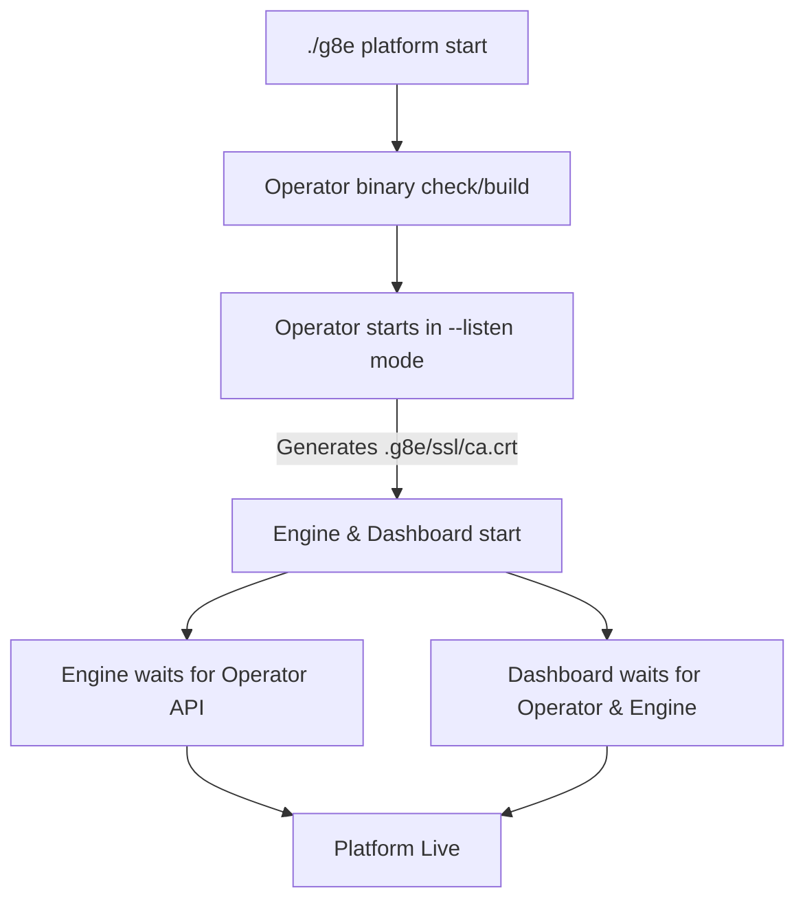

# Builds, Dependencies, and Startup Sequence

Last Updated: 2026-05-12
Version: v0.2.4

This document explains the g8e component dependency chain, the lifecycle of a build, and the host-native startup sequence that establishes the platform's root of trust.

---

## Architecture Philosophy

g8e is architected as a clean split between a mandatory **Substrate** and an optional **Application Layer**.

- **Substrate (Mandatory)**: The Operator (`g8eo`) in `--listen` mode is the foundational service. It generates the platform CA and internal auth tokens and provides the protocol API.
- **Application Layer (Optional)**: Optional adapters like the Dashboard (`g8ed`) and Engine (`g8ee`) consume the substrate's protocol surface.
- **Host-Native Execution**: Core components run as native processes on the host.
- **Zero-Config Discovery**: Services use a standardized local runtime directory (`.g8e/`) for discovery and configuration sharing.

---

## Core Components

| Component | Role | Runtime Environment | Build Strategy |
| :--- | :--- | :--- | :--- |
| **Operator (g8eo)** | **Substrate**: Persistence, Pub/Sub, Root of Trust | Host Go binary | Native Go build via `Makefile` |
| **Engine (g8ee)** | **Optional Adapter**: AI Backend & Workflow Orchestration | Python 3.12 Venv | `pip install` into local `.venv` |
| **Dashboard (g8ed)** | **Optional Adapter**: Web Gateway & GUI | Node 22 | `npm install` for local `node_modules` |

---

## The Host-Native Startup Lifecycle

The `./g8e platform start` command (invoked via `scripts/core/build.sh`) manages the sequence of operations:

### 1. Root of Trust Generation
On the first boot (or after a `clean`), the Operator in listen mode generates:
- **ECDSA P-384 CA**: A unique, self-signed Certificate Authority stored in `.g8e/ssl/ca.crt`.
- **Internal Auth Token**: A cryptographically secure token (`internal_auth_token`) used for service-to-service authentication.
- **Server Certificates**: Leaf certificates for the API and Dashboard.

### 2. Service Initialization (Optional)
- **Engine (g8ee)**: Starts using its local Python virtual environment. It reads the `internal_auth_token` and trusts the `ca.crt` to communicate with the Operator's internal HTTPS API.
- **Dashboard (g8ed)**: Starts using Node.js. It requires `cap_net_bind_service` on the `node` binary to bind to privileged ports (80/443).

### 3. Asynchronous Convergence
Services do not hard-fail if dependencies are missing at launch. Instead, they poll the internal health-check endpoints:
- Engine polls `https://localhost:9000/health`.
- Dashboard polls both Engine and Operator health endpoints.

---

## The Operator Build Pipeline

The Operator is responsible for distributing its own binaries to remote nodes. The build pipeline is managed natively:

- **`./g8e operator build`**: Compiles the `linux/amd64` binary and uploads it to the Operator's internal blob store at `/api/internal/blob/operator-binary/linux-amd64`.
- **`./g8e operator build-all`**: Cross-compiles for `amd64`, `arm64`, and `386`, applies UPX compression, and syncs all architectures to the blob store.

This "self-hosting" binary model ensures that `operator deploy` can always pull the correct architecture binary directly from the local platform.

---

## Data & Volume Strategy

Data is organized within the `.g8e/` directory to balance persistence with the ability to "reset" the application state.

| Path | Purpose | Wipe Policy |
| :--- | :--- | :--- |
| **`.g8e/ssl/`** | CA cert, server keys, internal auth token | **Preserved** by `reset` and `wipe`. |
| **`.g8e/data/`** | SQLite DB (`g8e.db`) and blob storage | Wiped by `reset`. |
| **`.g8e/logs/`** | Service logs (rotated automatically) | Cleared by `clean`. |
| **`.g8e/pids/`** | Process ID files for lifecycle management | Cleared on `stop`. |

- **`./g8e platform wipe`**: Clears application data (cases, users, operators) via the API but preserves platform settings and SSL state.
- **`./g8e platform reset`**: Deletes the database and data directory, but keeps the CA cert so client trust is maintained.
- **`./g8e platform clean`**: Destructive removal of the entire `.g8e/` directory and all running processes.

---

## Trust & Networking

- **The Trust Portal**: Served on port 80. Users visit `http://localhost` (or `http://g8e.local`) to download and trust the platform CA.
- **Port Bindings**:
    - `80`: HTTP Trust Portal (Dashboard)
    - `443`: HTTPS Dashboard (Dashboard)
    - `8443`: Internal Engine API (HTTPS)
    - `9000`: Internal Operator API (HTTPS)
    - `9001`: Internal Operator Pub/Sub (WSS)
