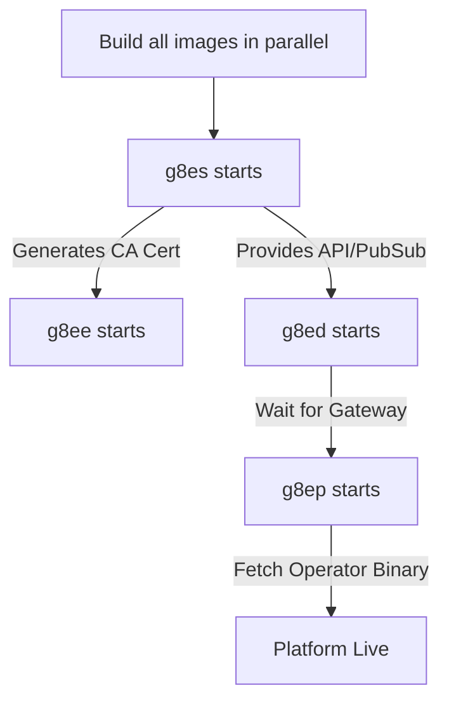

# Builds, Dependencies, and Startup Sequence

Last Updated: 5-6-2026
Version: v.0.2.0

This document explains the g8e component dependency chain, the lifecycle of a build, and the startup sequence that establishes the platform's root of trust.

---

## Architecture Philosophy

g8e is designed for speed and reliability. Every component is containerized and follows these principles:

- **Parallel Builds**: All component images build in parallel with no build-time dependencies on each other.
- **Runtime Discovery**: Component dependencies are enforced at runtime via Docker health checks.
- **Root of Trust**: `g8es` (the Operator in `--listen` mode) generates the platform CA on first boot, which all other services mount read-only.
- **Lean Sidecars**: Runtime containers like `g8ep` do not ship with compilers (Go/Node/Python-dev). They fetch binary artifacts from the `g8es` blob store.

---

## Core Components

| Component | Role | Runtime Environment | Build Strategy |
| :--- | :--- | :--- | :--- |
| **g8es** | Persistence & Pub/Sub | Alpine / Go binary | Multi-stage Go (cross-compiles all arches) |
| **g8ee** | AI Backend | Python 3.12-slim / FastAPI | Multi-stage Python (pip-install builder) |
| **g8ed** | Web Gateway | Node 22-alpine / Express | Multi-stage Node (npm-install builder) |
| **g8ep** | Tooling Sidecar | Python 3.13-alpine | Supervisor-managed processes |
| **g8el** | Local Inference | llama.cpp server | Optional profile (`--profile g8el`) |

---

## The Build & Startup Lifecycle

Docker Compose enforces the following dependency graph via `condition: service_healthy`:

### 1. Image Compilation
The `g8es` build is the most intensive. It cross-compiles the `g8e.operator` binary for `amd64`, `arm64`, and `386`, applies UPX compression, and bakes them into the image. These binaries are used both for running `g8es` itself and for distribution to other components.

### 2. g8es Initialization
On first start, `g8es` generates a self-signed ECDSA P-384 CA and writes it to the `g8es-ssl` volume. It then:
- Opens the SQLite document store.
- Starts the HTTPS API (port 9000) and WSS Pub/Sub broker (port 9001).
- Background-uploads the baked operator binaries to its internal blob store.

### 3. Service Convergence
`g8ee` and `g8ed` wait for `g8es` to be healthy. They mount `g8es-ssl` read-only to establish mTLS trust and authenticate via the `X-Internal-Auth` token. 

### 4. Sidecar Activation
`g8ep` starts only after `g8ed` is healthy. It uses a `supervisord` PID 1 to manage the local operator process. Since `g8ep` contains no Go compiler, it downloads the appropriate `g8e.operator` binary from the `g8es` blob store on first boot.

---

## The Operator Pipeline

While `g8es` bakes default binaries, developers can force fresh builds without rebuilding the entire platform:

- **`./g8e operator build`**: Invokes `g8eo-test-runner` (the Go toolchain container) to compile a fresh `amd64` binary and upload it to the `g8es` blob store.
- **`./g8e operator build-all`**: Compiles and uploads all three architectures with UPX compression.

This ensures that the `g8ep` sidecar (and any remote operators) can always pull the latest binary via a simple service restart or re-authentication.

---

## Data & Volume Strategy

g8e splits data across two primary volumes to balance persistence with the ability to "reset" the application state.

| Volume | Purpose | Wipe Policy |
| :--- | :--- | :--- |
| **`g8es-ssl`** | CA cert, server keys, internal auth token | **Never wiped** by `reset` or `wipe`. |
| **`g8es-data`** | SQLite DB (users, cases, settings, blobs) | Wiped by `reset`. Preserved by `wipe`. |
| **`g8ee/d-data`**| Component-specific application state | Wiped by `reset`. |

- **`./g8e platform wipe`**: Clears domain data (cases, operators) via the API but preserves `platform_settings` and SSL.
- **`./g8e platform reset`**: Deletes the database volume and rebuilds images, but keeps the CA cert so users don't have to re-trust the platform.

---

## CLI Reference

The `./g8e platform` command is the primary entry point for lifecycle management:

- **`setup`**: Full first-time install (build + start).
- **`rebuild`**: Updates images using layer cache (data is preserved).
- **`status`**: Shows container health and component versions.
- **`clean`**: Destructive removal of all managed Docker resources (containers, images, volumes).
- **`test <component>`**: Lazily builds a dedicated `<component>-test-runner` image and executes its test suite.
