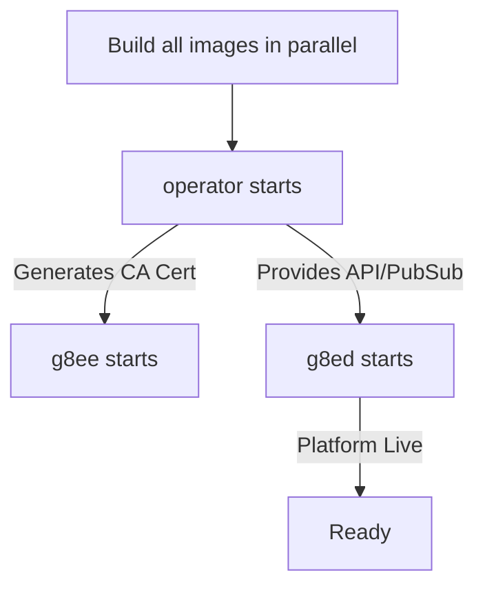

# Builds, Dependencies, and Startup Sequence

Last Updated: 2026-05-07
Version: v0.2.0

This document explains the g8e component dependency chain, the lifecycle of a build, and the startup sequence that establishes the platform's root of trust.

---

## Architecture Philosophy

g8e is designed for speed and reliability. Every component runs host-native and follows these principles:

- **Parallel Builds**: All components build in parallel with no build-time dependencies on each other.
- **Runtime Discovery**: Component dependencies are enforced at runtime via health checks.
- **Root of Trust**: Operator in `--listen` mode generates the platform CA on first boot, which all other services read from `.g8e/ssl`.
- **Lean Services**: Runtime processes do not ship with unnecessary compilers. They fetch binary artifacts from the Operator blob store.

---

## Core Components

| Component | Role | Runtime Environment | Build Strategy |
| :--- | :--- | :--- | :--- |
| **operator** | Persistence & Pub/Sub | Alpine / Go binary | Multi-stage Go (cross-compiles all arches) |
| **g8ee** | AI Backend | Python 3.12-slim / FastAPI | Multi-stage Python (pip-install builder) |
| **g8ed** | Web Gateway | Node 22-alpine / Express | Multi-stage Node (npm-install builder) |

---

## The Build & Startup Lifecycle

Docker Compose enforces the following dependency graph via `condition: service_healthy`:

### 1. Image Compilation
The `operator` build is the most intensive. It cross-compiles the `g8e.operator` binary for `amd64`, `arm64`, and `386`, applies UPX compression, and bakes them into the image. These binaries are used both for running `operator` itself and for distribution to other components.

### 2. Operator Initialization
On first start, Operator in listen mode generates a self-signed ECDSA P-384 CA and writes it to `.g8e/ssl`. It then:
- Opens the SQLite document store at `.g8e/data/g8e.db`.
- Starts the HTTPS API (port 9000) and WSS Pub/Sub broker (port 9001).
- Background-uploads the operator binaries to its internal blob store.

### 3. Service Convergence
`g8ee` and `g8ed` wait for Operator listen mode to be healthy. They read `.g8e/ssl` to establish mTLS trust and authenticate via the `X-Internal-Auth` token. 

---

## The Operator Pipeline

While `operator` bakes default binaries, developers can force fresh builds without rebuilding the entire platform:

- **`./g8e operator build`**: Invokes `g8eo-test-runner` (the Go toolchain container) to compile a fresh `amd64` binary and upload it to the `operator` blob store.
- **`./g8e operator build-all`**: Compiles and uploads all three architectures with UPX compression.

This ensures that the `g8ep` sidecar (and any remote operators) can always pull the latest binary via a simple service restart or re-authentication.

---

## Data & Volume Strategy

g8e splits data across two primary volumes to balance persistence with the ability to "reset" the application state.

| Volume | Purpose | Wipe Policy |
| :--- | :--- | :--- |
| **`operator-ssl`** | CA cert, server keys, internal auth token | **Never wiped** by `reset` or `wipe`. |
| **`operator-data`** | SQLite DB (users, cases, settings, blobs) | Wiped by `reset`. Preserved by `wipe`. |
| **`g8ee/d-data`**| Component-specific application state | Wiped by `reset`. |

- **`./g8e platform wipe`**: Clears domain data (cases, operators) via the API but preserves `platform_settings` and SSL.
- **`./g8e platform reset`**: Deletes the database volume, but keeps the CA cert so users don't have to re-trust the platform.

---

## CLI Reference

The `./g8e platform` command is the primary entry point for lifecycle management:

- **`status`**: Shows process health and component versions.
- **`clean`**: Destructive removal of all managed processes and data.
- **`test <component>`**: Executes the test suite for the specified component using native toolchains.d component using native toolchains.
