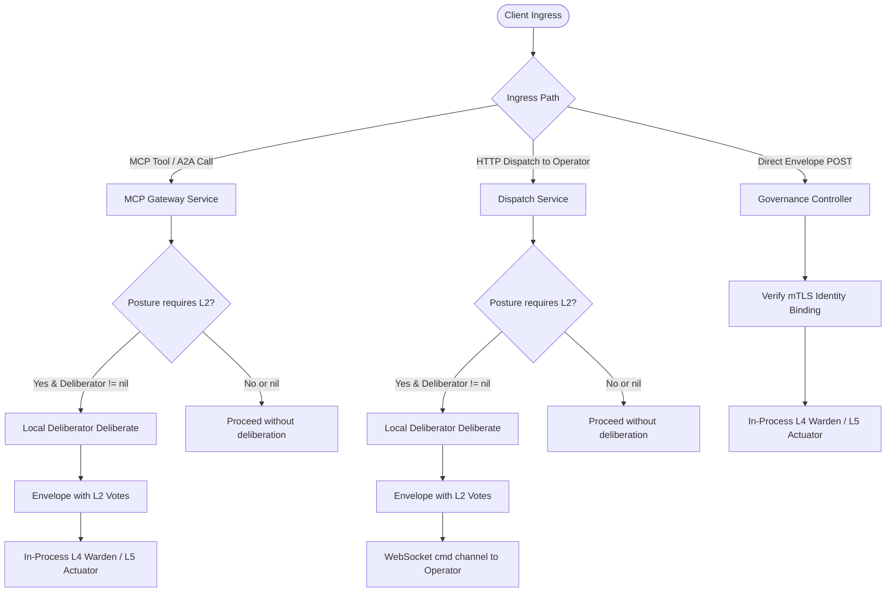

# Consensus Architecture

## Purpose

Documents g8e's Layer 2 (L2) machine consensus architecture: multi-member Ed25519 signature policies, deterministic deliberation mechanics, key custody models, declarative startup bootstrap, L4 Warden verification, and L5 Actuator receipt evidence. L2 Consensus operates as a deterministic K-of-N threshold authorization gate within the five-layer governance interlock, ensuring that machine transactions are verified against an enrolled body of trusted member signers before execution.

## Quick index

- [Purpose](#purpose)
- [Quick index](#quick-index)
- [Invariants](#invariants)
- [Owned surfaces](#owned-surfaces)
- [Procedures](#procedures)
  - [Place in the five-layer interlock](#place-in-the-five-layer-interlock)
  - [Policy schema and validation model](#policy-schema-and-validation-model)
  - [Vote production and deliberation mechanics](#vote-production-and-deliberation-mechanics)
  - [Gateway ingress deliberation routing](#gateway-ingress-deliberation-routing)
  - [Key custody and declarative bootstrap](#key-custody-and-declarative-bootstrap)
  - [Administrative enrollment and lifecycle](#administrative-enrollment-and-lifecycle)
  - [L4 Warden verification and quorum evaluation](#l4-warden-verification-and-quorum-evaluation)
  - [Receipt evidence and deterministic stages](#receipt-evidence-and-deterministic-stages)
- [Anti-patterns](#anti-patterns)
- [Links out](#links-out)

Key invariant groups: [Policy and Membership](#policy-and-membership-inv-con-pol), [Vote Production and Deliberation](#vote-production-and-deliberation-inv-con-vote), [L4 Verification and Authorization](#l4-verification-and-authorization-inv-con-ward), [Receipt and Audit Evidence](#receipt-and-audit-evidence-inv-con-rcpt).

## Invariants

Ids are stable. Append the next free number within each group; do not renumber.

### Policy and Membership (`INV-CON-POL`)

| ID | Rule |
| --- | --- |
| INV-CON-POL-01 | Consensus policy identifiers MUST be non-empty and contain only ASCII alphanumeric characters, hyphens, and underscores (`isValidConsensusID`). |
| INV-CON-POL-02 | Quorum MUST satisfy `1 <= Quorum <= len(member_app_ids)`. Any policy creation request with quorum less than 1 or exceeding the member count MUST fail closed with `ErrConstraintViolation`. |
| INV-CON-POL-03 | Every listed `member_app_id` MUST resolve to an enabled `TrustedSigner` in the Gateway's signer store at policy write time. Writes referencing unresolvable or disabled signers MUST be rejected. |
| INV-CON-POL-04 | New consensus policies MUST be created with `enabled=true`. Overwriting an existing policy while `enabled=true` MUST be rejected with `ErrAlreadyExists`. Disabling a policy requires submitting the same policy ID with `enabled=false`. |
| INV-CON-POL-05 | `member_app_ids` MUST contain only unique, non-empty identifiers. Duplicate member application IDs within a single policy MUST be rejected with `ErrConstraintViolation`. |

### Vote Production and Deliberation (`INV-CON-VOTE`)

| ID | Rule |
| --- | --- |
| INV-CON-VOTE-01 | The Deliberator MUST recompute the canonical transaction hash from envelope fields (`governance.GenerateMessageID`). If `envelope.Id` does not match the recomputed hash, deliberation MUST reject the envelope with `ErrConsensusHashMismatch`. |
| INV-CON-VOTE-02 | Every member vote signature MUST be an Ed25519 signature over the canonical UTF-8 payload `<transaction_hash>|<decision>`, where `<decision>` is `true` or `false`, encoded as a lowercase hex string. |
| INV-CON-VOTE-03 | Consensus members MUST evaluate payload safety deterministically using `L1Doctrine.AnalyzeCommand`. Any signal with `BlockRecommended=true` MUST result in a `decision=false` vote. If `L1Doctrine` is nil, members MUST fail closed with `decision=false`. |
| INV-CON-VOTE-04 | Deliberation MUST produce at least one signed vote from available member private keys. If no member keys are resolvable, deliberation MUST return `ErrConsensusNoSigningMembers`. |
| INV-CON-VOTE-05 | The mTLS deliberation endpoint (`POST /consensus/v1/deliberate`) MUST be registered on the Gateway HTTP router only when the active governance posture requires L2 consensus (`consensus` or `notary`). |

### L4 Verification and Authorization (`INV-CON-WARD`)

| ID | Rule |
| --- | --- |
| INV-CON-WARD-01 | The L4 Warden MUST verify member signatures against the recomputed transaction hash rather than trusting the envelope's declared identifier. |
| INV-CON-WARD-02 | When `require_distinct` is true in the policy, duplicate member key IDs within the vote set MUST reject the transaction fail closed under an L2-enforcing posture with `ErrTxL2DuplicateSigner`. |
| INV-CON-WARD-03 | Quorum evaluation MUST count only affirmative (`decision=true`) votes signed by enabled `TrustedSigner` keys belonging to enrolled policy members. Negative votes (`decision=false`) authenticate dissent but do not count toward quorum. |
| INV-CON-WARD-04 | Bootstrap action types (`actionType.IsBootstrapAction()`) MUST be exempt from L2 gating across all postures, permitting initial enrollment transactions to succeed before consensus signers exist. |
| INV-CON-WARD-05 | Under `consensus` and `notary` postures, missing L2 votes, disabled policies, or unmet quorums MUST reject the transaction with a fatal error. Under `doctrine` and `ratify` postures, L2 votes are evaluated for deterministic audit evidence without gating transaction admission. |

### Receipt and Audit Evidence (`INV-CON-RCPT`)

| ID | Rule |
| --- | --- |
| INV-CON-RCPT-01 | The L5 ActionReceipt `L2Status` field MUST record `L2_STATUS_REQUIRED_VALID` when L2 is required and verified, `L2_STATUS_REQUIRED_FAILED` when required and failed, or `L2_STATUS_NOT_REQUIRED` when the posture does not require L2. |
| INV-CON-RCPT-02 | L4 verification MUST produce `DeterministicStageEvidence` for protocol L2 recording stage outcome (`VERIFIED`, `FAILED`, or `NOT_REQUIRED`) and the SHA-256 `L2SignatureDigest` over the vote set. |

## Owned surfaces

| Claim | Path | Verify |
| --- | --- | --- |
| Consensus policy model | `protocol/models/consensus.json`, `internal/models/auth.go` | Schema validation and `internal/services/gateway/consensus_store_service_test.go` |
| Consensus policy document store | `internal/services/gateway/consensus_store_service.go` | Unit tests in `internal/services/gateway/consensus_store_service_test.go` |
| Consensus service and deliberator | `internal/services/consensus/service.go`, `internal/services/consensus/member.go` | Unit tests in `internal/services/consensus/service_test.go` |
| Consensus factory and key providers | `internal/services/consensus/factory.go` | Unit tests in `internal/services/consensus/factory_test.go` |
| L4 Warden L2 verification | `internal/services/governance/l2_consensus.go`, `internal/services/governance/l4_warden.go` | Integration tests in `internal/services/governance/l4_warden_consensus_test.go` |
| L5 Actuator receipt evidence | `internal/services/governance/l5_actuator.go` | Receipt tests in `internal/services/governance/l4_warden_test.go` |
| Deliberation HTTP endpoint | `internal/services/gateway/governance_controller.go`, `internal/services/gateway/gateway_http_router.go` | Router tests in `internal/services/gateway/gateway_http_test.go` |
| Administrative consensus API | `internal/services/gateway/admin_controller.go` | Admin tests in `internal/services/gateway/admin_controller_test.go` |
| Declarative startup bootstrap | `internal/cli/serve/gateway.go` | Bootstrap tests in `internal/cli/serve/consensus_bootstrap_test.go` |
| Ingress deliberation integration | `internal/services/mcp/gateway.go`, `internal/services/gateway/dispatch_service.go` | End-to-end tests in `test/l2_consensus_integration_test.go` |

## Procedures

### Place in the five-layer interlock

L2 Consensus is the second layer in the g8e five-layer governance interlock:

1. **L1 Doctrine**: Decodes the typed payload and validates field constraints, forbidden patterns, and MITRE ATT&CK threat signals.
2. **L2 Consensus**: Verifies cryptographic member signatures over the exact transaction hash against an enabled K-of-N threshold policy.
3. **L3 Notary**: Verifies human authorization proofs (WebAuthn passkeys or CLI mTLS sessions) when mutation actions require it.
4. **L4 Warden**: Executes pre-dispatch verification, checking transaction expiry, replay protection, hash binding, state root, L1 doctrine, L2 consensus, and L3 notary.
5. **L5 Actuator**: Executes admitted transactions and produces signed, non-repudiable execution receipts.

The active posture determines whether L2 verification is an admission gate:

| Posture | L2 Gate Status | Receipt `L2Status` Value | Deterministic Stage Outcome |
| --- | --- | --- | --- |
| `doctrine` | Non-gating (audited only) | `L2_STATUS_NOT_REQUIRED` | `DETERMINISTIC_STAGE_OUTCOME_VERIFIED` (if valid) or `NOT_REQUIRED` |
| `consensus` | Strictly required for non-bootstrap transactions | `L2_STATUS_REQUIRED_VALID` | `DETERMINISTIC_STAGE_OUTCOME_VERIFIED` |
| `ratify` | Non-gating (audited only) | `L2_STATUS_NOT_REQUIRED` | `DETERMINISTIC_STAGE_OUTCOME_VERIFIED` (if valid) or `NOT_REQUIRED` |
| `notary` | Strictly required for non-bootstrap transactions | `L2_STATUS_REQUIRED_VALID` | `DETERMINISTIC_STAGE_OUTCOME_VERIFIED` |

### Policy schema and validation model

Consensus policies are persisted in the Gateway's canonical SQLite document store under the `"consensus"` collection (`constants.CollectionConsensus`). The schema is defined in [protocol/models/consensus.json](../../protocol/models/consensus.json) and mirrored in Go by `models.ConsensusPolicy` (`internal/models/auth.go`):

```json
{
  "id": "fedramp-consensus",
  "member_app_ids": ["fedramp-csp-auditor", "fedramp-3pao", "fedramp-jab"],
  "quorum": 2,
  "require_distinct": true,
  "enabled": true,
  "created_at": "2026-09-28T00:00:00Z",
  "updated_at": "2026-09-28T00:00:00Z"
}
```

The storage layer (`ConsensusStoreService` in `internal/services/gateway/consensus_store_service.go`) validates policies fail closed on write:
- **Identifier format**: Validated via `isValidConsensusID`; must contain only alphanumeric characters, hyphens, and underscores.
- **Quorum range**: Quorum must be at least 1 and cannot exceed the length of `member_app_ids`.
- **Member distinctness**: No empty member strings and no duplicate member application IDs.
- **Signer verification**: Every `member_app_id` must resolve to an enabled `TrustedSigner` in `SignerStoreService` at write time.
- **Overwrite prevention**: New policies must have `enabled=true`. Overwriting an existing policy with `enabled=true` returns `ErrAlreadyExists`. Existing policies can only be updated by setting `enabled=false` (the disable workflow).

The L4 Warden consumes policies through the generic `governance.L2ConsensusPolicyStore` interface, decoupling verification logic from Gateway-specific storage implementations.

### Vote production and deliberation mechanics

The bundled `ConsensusService` (`internal/services/consensus/service.go`) is the reference vote producer. It manages enrolled member identities (`ConsensusMember`), each possessing an application ID and an Ed25519 private key.

During deliberation (`Deliberate`):
1. **Hash Verification**: Recomputes the expected transaction hash using `governance.GenerateMessageID(env)`. If `env.Id` does not match, deliberation fails immediately with `ErrConsensusHashMismatch`.
2. **Payload Extraction**: Extracts command data from `env.IntentData` if structured intent fields exist, otherwise falling back to `string(env.Payload)`.
3. **Safety Evaluation**: For each member with an available private key, executes `evaluateSafety`, running `L1Doctrine.AnalyzeCommand(cmdData)`. If any threat signal flags `BlockRecommended=true`, the member votes `isSafe=false`. If `L1Doctrine` is nil, evaluation fails closed (`isSafe=false`).
4. **Cryptographic Signing**: Signs the UTF-8 string `<transaction_hash>|<decision>` using the member's Ed25519 private key (`signDecision`), returning a lowercase hex-encoded signature.
5. **Vote Assembly**: Assembles `commonv1.L2Vote` records (`signer_key_id`, `consensus_signature`, `decision`). If zero votes were produced (no member keys available), deliberation returns `ErrConsensusNoSigningMembers`.
6. **Envelope Decoration**: Sets `env.Governance.L2.ConsensusSetId` to the policy ID and attaches the vote slice to `env.Governance.L2.Votes`.

Deliberation produces member votes; it does not authorize the transaction. Authorization is solely evaluated at L4 verification time by the Warden.

### Gateway ingress deliberation routing

The reference Gateway integrates deliberation into its ingress workflows via `consensus.LocalDeliberator`, an in-process adapter implementing `mcp.L2ConsensusDeliberator` and `dispatch.L2ConsensusDeliberator`:



- **MCP Tools, Resources, Prompts, and A2A Calls** (`internal/services/mcp/gateway.go`): Under `consensus` and `notary`, `prepareEnvelope` passes the constructed envelope bytes to `g.l2ConsensusDeliberator.Deliberate` before local dispatch.
- **Governed HTTP Command Dispatch** (`internal/services/gateway/dispatch_service.go`): When a client dispatches a command to an outbound Operator via `POST /api/v1/operators/{operator_id}/commands`, `DispatchService` constructs the envelope, runs `d.l2Deliberator.Deliberate(ctx, wire)` under L2 postures, and publishes the deliberated envelope over the WebSocket `cmd:<operator_id>:<operator_session_id>` channel. If `d.l2Deliberator` is nil, the envelope proceeds without votes and fails closed at the remote Operator's L4 Warden.
- **Direct Governance Envelope Ingress** (`POST /api/v1/governance/envelopes` in `internal/services/gateway/governance_controller.go`): Validates mTLS identity binding and injects posture, but does not run automatic deliberation. Direct callers must submit envelopes already populated with valid L2 vote sets.
- **HTTP Deliberation Endpoint** (`POST /consensus/v1/deliberate`): Handled by `governanceController.handleConsensusDeliberate`. Requires an enrolled mTLS identity, limits request bodies to 1 MiB, and is mounted only when the active posture requires L2 consensus.

### Key custody and declarative bootstrap

In single-binary deployments, the Gateway manages consensus member key custody through `consensus.FileKeyProvider` (`internal/services/consensus/factory.go`). Member key seeds are stored as hex-encoded files in the runtime secrets directory:

```text
.g8e/secrets/consensus_member_<consensus_id>_<member_app_id>.key
```

When constructing the local deliberator during Gateway initialization (`internal/services/gateway/gateway_service.go`):
1. The factory looks up the member seed via `FileKeyProvider.GetMemberKey(appID)`.
2. If absent and `appID` matches the Gateway's Actuator key ID, it falls back to the Actuator private key.
3. If still unresolvable, the member is included in the policy without a private key (it cannot sign local votes).

#### Declarative bootstrap file

The `--consensus-bootstrap` CLI flag (or `G8E_CONSENSUS_BOOTSTRAP` environment variable) seeds a consensus policy and member signing keys during Gateway startup:

```json
{
  "consensus_id": "fedramp-consensus",
  "member_app_ids": ["fedramp-csp-auditor", "fedramp-3pao", "fedramp-jab"],
  "quorum": 2,
  "member_seeds": {
    "fedramp-csp-auditor": "a1b2c3...",
    "fedramp-3pao": "d4e5f6...",
    "fedramp-jab": "7890ab..."
  },
  "seed_hex": "optional_shared_fallback_seed..."
}
```

Bootstrap key resolution follows strict precedence (`internal/cli/serve/gateway.go`):
1. **Per-Member Seeds (`member_seeds`)**: Precedence 1. Requires an exact seed entry for every listed member application ID. Public keys are registered as `TrustedSigner` records, and private seeds are saved to `.g8e/secrets/` with restricted permissions (`0600`).
2. **Shared Seed (`seed_hex`)**: Precedence 2. Derives a single Ed25519 key pair registered across all listed member identities.
3. **Generated Fallback**: Precedence 3. If neither seed configuration is provided, the Gateway generates a fresh Ed25519 key pair and registers it across all members.

Bootstrap creates an enabled policy with `RequireDistinct: true`. Bootstrap execution is idempotent: if the consensus ID already exists in the store, startup skips signer registration and policy insertion.

### Administrative enrollment and lifecycle

Enrolled administrators (restricted to the platform's first enrolled user) manage consensus policies dynamically over the mTLS API:

- `POST /api/v1/admin/consensus`: Creates a new consensus policy. Member signers must already exist in the trusted signer store. Reject overwrites if the policy already exists and is enabled.
- `GET /api/v1/admin/consensus`: Lists all configured consensus policies and their quorum configurations.
- `DELETE /api/v1/admin/consensus/{id}`: Deletes a consensus policy by ID.
- **Disabling a Policy**: Submitted via `POST /api/v1/admin/consensus` with the target `id` and `enabled: false`.

Runtime deliberators are assembled at Gateway startup. Dynamically creating or disabling a policy in the store does not rebuild the running in-process `ConsensusService`. However, policy changes take immediate effect at L4 verification because the Warden queries `L2ConsensusPolicyStore` dynamically for every transaction.

### L4 Warden verification and quorum evaluation

During pre-dispatch verification (`verifyL2Posture` in `internal/services/governance/l2_consensus.go`), the L4 Warden evaluates candidate L2 votes:

```mermaid
flowchart TD
    Start([L4 Warden: verifyL2Posture]) --> CheckBootstrap{Is Bootstrap Action?}
    CheckBootstrap -->|Yes| Exempt[Bypass L2 gate; evaluate audit evidence only]
    CheckBootstrap -->|No| CheckVotes{Votes present in envelope?}
    
    CheckVotes -->|No| CheckReqA{Posture requires L2?}
    CheckReqA -->|Yes| FailNoVotes[Fail: ErrTxL2SignatureMissing]
    CheckReqA -->|No| PassNonGating[Return l2Valid=false, err=nil]
    
    CheckVotes -->|Yes| CheckStores{Stores configured?}
    CheckStores -->|No| CheckReqB{Posture requires L2?}
    CheckReqB -->|Yes| FailNoStores[Fail: ErrTxL2SignerStoreNotConfigured]
    CheckReqB -->|No| PassNonGating
    
    CheckStores -->|Yes| LoadPolicy[Load policy by l2.ConsensusSetId]
    LoadPolicy --> CheckPolicy{Policy found and enabled?}
    CheckPolicy -->|No| CheckReqC{Posture requires L2?}
    CheckReqC -->|Yes| FailPolicy[Fail: ErrTxL2ConsensusNotConfigured]
    CheckReqC -->|No| PassNonGating
    
    CheckPolicy -->|Yes| LoopVotes[Iterate through votes]
    LoopVotes --> MemberCheck{Is vote.SignerKeyId in policy.MemberKeyIDs?}
    MemberCheck -->|No| NextVote[Skip vote]
    MemberCheck -->|Yes| SeenCheck{SignerKeyId already seen?}
    
    SeenCheck -->|Yes & RequireDistinct=true| DupFail[Fail: ErrTxL2DuplicateSigner]
    SeenCheck -->|Yes & RequireDistinct=false| NextVote
    
    SeenCheck -->|No| VerifySig{Verify Ed25519 signature over hash|decision}
    VerifySig -->|Invalid| NextVote
    VerifySig -->|Valid| RecordSeen[Mark seen=true]
    RecordSeen --> DecisionCheck{vote.Decision == true?}
    DecisionCheck -->|Yes| IncQuorum[affirmative++]
    DecisionCheck -->|No| RecordDissent[Dissent authenticated; do not increment]
    
    IncQuorum --> NextVote
    RecordDissent --> NextVote
    NextVote --> QuorumCheck{affirmative >= policy.Quorum?}
    
    QuorumCheck -->|Yes| Success[Return l2Valid=true, err=nil]
    QuorumCheck -->|No| CheckReqD{Posture requires L2?}
    CheckReqD -->|Yes| FailQuorum[Fail: ErrTxL2QuorumNotMet]
    CheckReqD -->|No| PassNonGating
```

1. **Bootstrap Exemption**: If `actionType.IsBootstrapAction()` is true (e.g. platform enrollment transactions), the transaction is exempt from L2 gating under all postures.
2. **Presence Checks**: Under `consensus` and `notary`, missing votes, an unconfigured signer store, or an unconfigured policy store immediately fail closed (`ErrTxL2SignatureMissing`, `ErrTxL2SignerStoreNotConfigured`, `ErrTxL2ConsensusNotConfigured`).
3. **Policy Resolution**: Loads the policy via `consensusPolicyStore.GetConsensusPolicy(l2.ConsensusSetId)`. The policy must exist and have `Enabled=true`.
4. **Member Verification**: Iterates over `l2.Votes`. Ignores votes from keys not listed in `policy.MemberKeyIDs`.
5. **Distinctness Enforcement**: If a signer key was already evaluated and `policy.RequireDistinct` is true, verification aborts fail closed with `ErrTxL2DuplicateSigner`.
6. **Signature Check**: Looks up the Ed25519 public key in `signerStore.GetTrustedSigner(vote.SignerKeyId)`. Verifies the signature over `fmt.Sprintf("%s|%v", computedHash, vote.Decision)`.
7. **Quorum Count**: Increments the affirmative counter only when `vote.Decision` is `true`. Valid negative votes authenticate member dissent without counting toward quorum.
8. **Threshold Evaluation**: If `affirmative < policy.Quorum`, returns `ErrTxL2QuorumNotMet` under an enforcing posture.

### Receipt evidence and deterministic stages

When L4 verification concludes, the Warden emits deterministic stage evidence, and the L5 Actuator embeds the final L2 outcome into the signed `ActionReceipt` (`internal/services/governance/l5_actuator.go`):

- **Deterministic Stage Evidence**: A stage record with `DeterministicStageKind_DETERMINISTIC_STAGE_KIND_PROTOCOL_L2` is added to the transaction evidence. The stage outcome is recorded as `DETERMINISTIC_STAGE_OUTCOME_VERIFIED` when L2 is satisfied, `DETERMINISTIC_STAGE_OUTCOME_FAILED` on verification errors, or `DETERMINISTIC_STAGE_OUTCOME_NOT_REQUIRED` under non-enforcing postures without valid votes.
- **L2 Signature Digest**: `L2SignatureDigest` computes a SHA-256 digest over the concatenation of all member signatures in the vote set (`l2SignatureDigest`), binding the exact signature proofs into the cryptographic audit trail.
- **Receipt Status**: The signed `ActionReceipt` sets `L2Status`:
  - `operatorv1.L2Status_L2_STATUS_REQUIRED_VALID`: Posture requires L2 and quorum was verified.
  - `operatorv1.L2Status_L2_STATUS_REQUIRED_FAILED`: Posture requires L2 and verification failed.
  - `operatorv1.L2Status_L2_STATUS_NOT_REQUIRED`: Posture does not enforce L2 (even if valid votes were audited).

## Anti-patterns

- **Equating L2 Consensus with Distributed BFT or State Machine Replication**: Treating L2 Consensus as a Raft or Paxos leader-election engine. L2 is strictly a multi-agent threshold cryptographic signature policy over an immutable transaction hash.
- **Hardcoding or Sharing Private Keys in Production Bootstrap**: Relying on the `seed_hex` or generated fallback modes in production deployments. Fallback modes satisfy quorum algorithms but forfeit independent key custody. Production configurations must supply independent `member_seeds`.
- **Assuming Dynamic Admin Policy Changes Hot-Reload In-Process Deliberation**: Updating or disabling a consensus policy via `/api/v1/admin/consensus` and expecting the in-process deliberator to immediately switch keys without a process restart. Deliberator assembly occurs at Gateway startup.
- **Bypassing the L2 Deliberator for Direct Envelope Ingress**: Submitting an unpopulated envelope to `POST /api/v1/governance/envelopes` under `consensus` posture and expecting the Gateway to auto-generate votes. Direct submission requires pre-deliberated envelopes.
- **Using Negative Votes to Satisfy Quorum**: Counting negative member decisions (`decision=false`) toward the quorum threshold. Negative votes provide cryptographic proof of dissent but cannot satisfy affirmative authorization requirements.
- **Trusting the Declared Envelope ID during Deliberation or Verification**: Validating or signing envelopes without recomputing the SHA-256 transaction hash via `governance.GenerateMessageID`. Any modification to bound fields must invalidate all signatures.

## Links out

- [Governance Architecture](governance.md): Five-layer governance interlock, posture definitions, and receipt validation.
- [Gateway Architecture](gateway.md): Gateway initialization, service wiring, and in-process execution.
- [Operator Architecture](operator.md): Outbound pub/sub execution, L4 Warden verification, and L5 Actuator receipts.
- [Authentication and Authorization Architecture](auth.md): SPIFFE workload identities, trusted signers, and L3 human proofs.
- [Storage Architecture](storage.md): Canonical SQLite document store and encrypted persistence boundaries.
- [Network Architecture](network.md): TLS 1.3, mTLS enforcement, and WebSocket pub/sub routing.
- [Build a Gateway](../guides/build_gateway.md): Gateway startup options and configuration flags.
