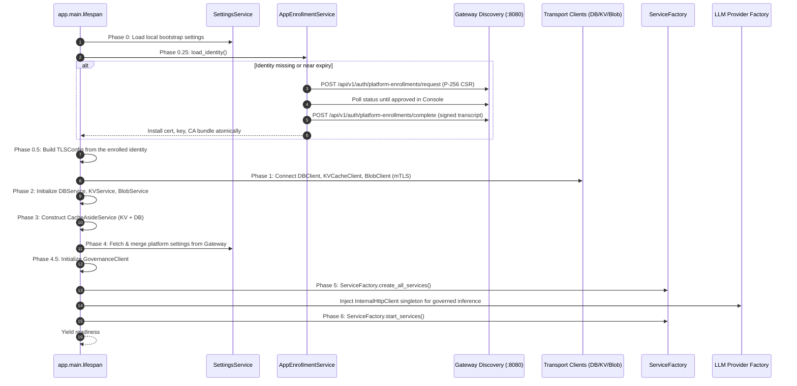
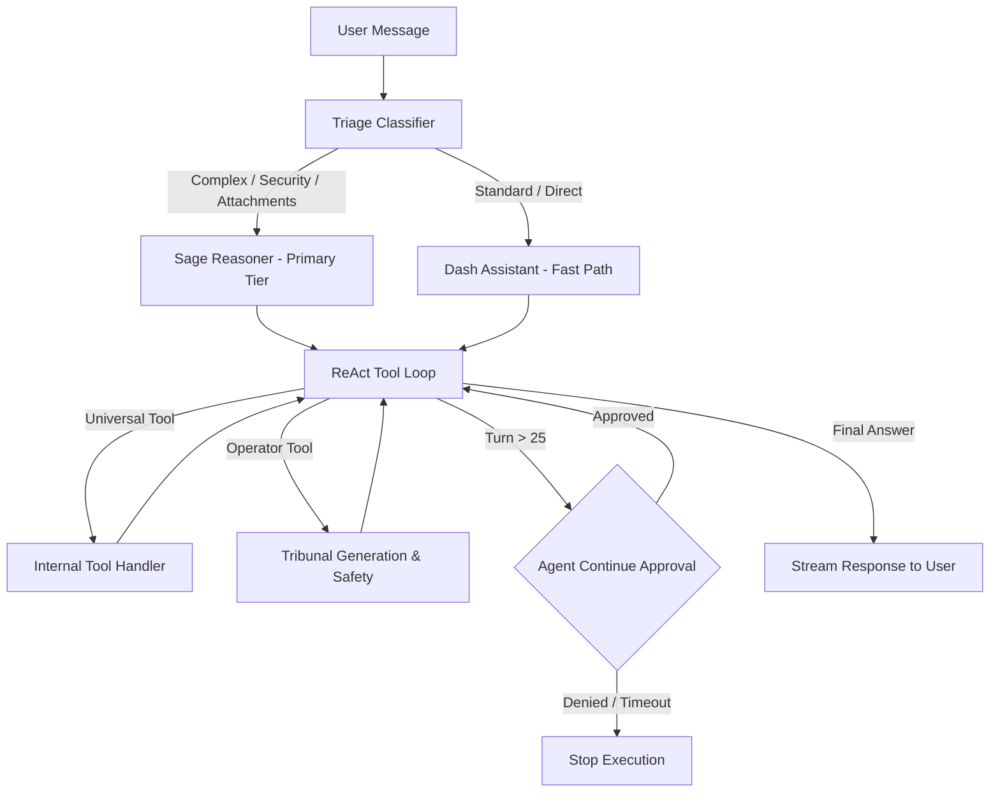
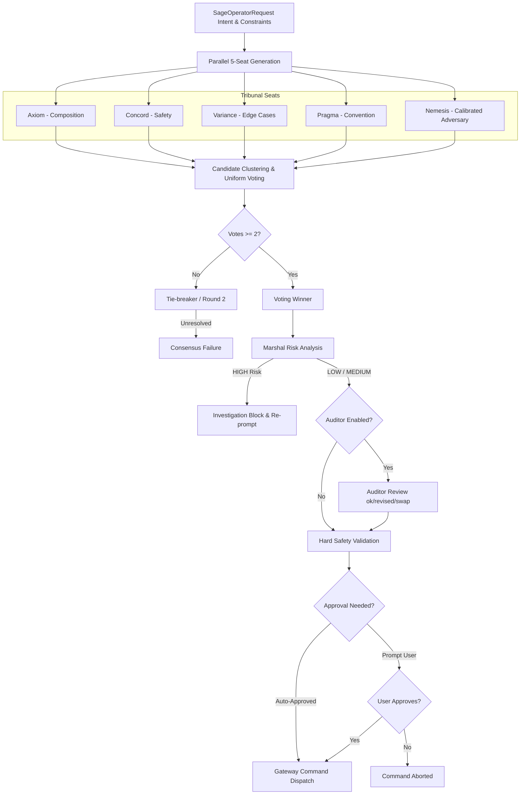
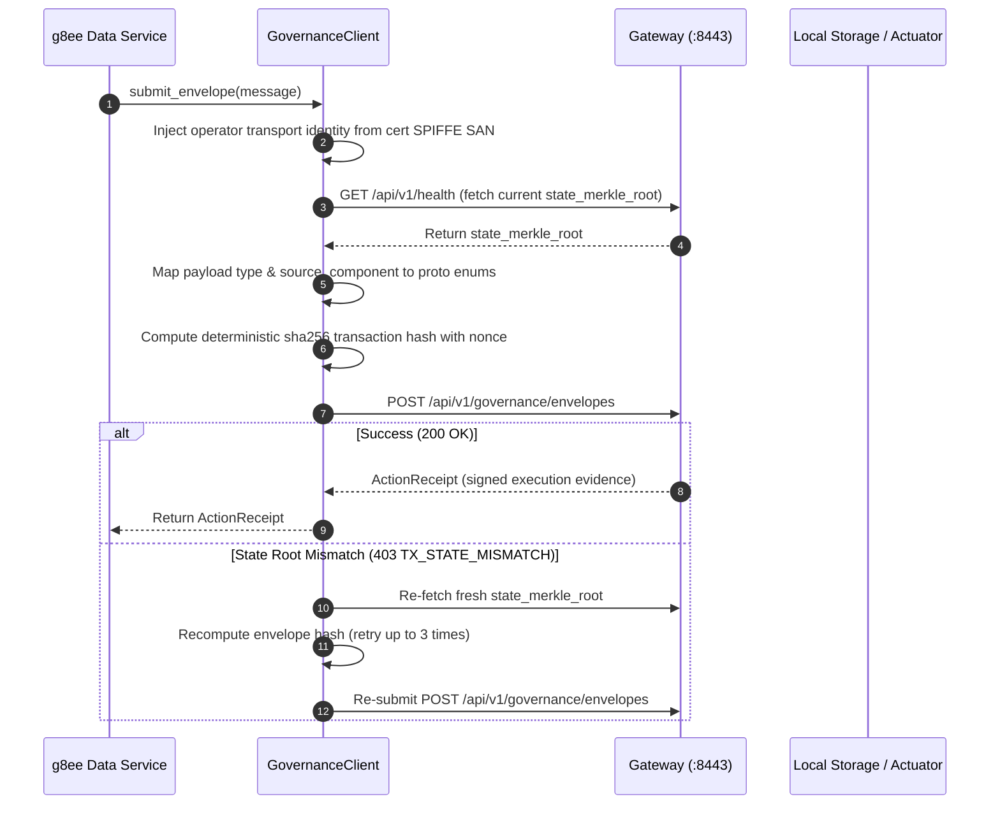
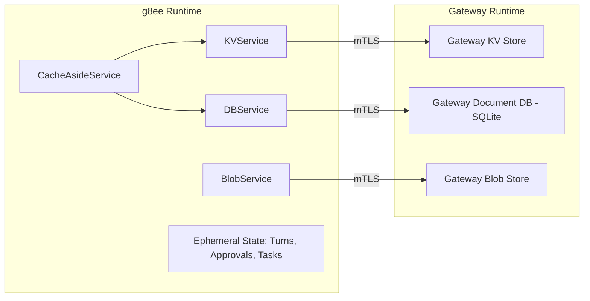
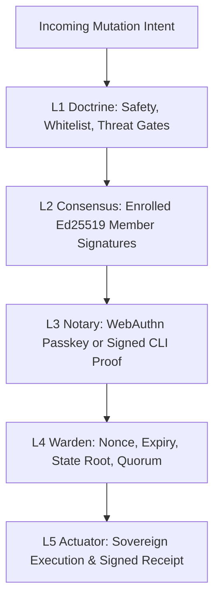

# Ensemble Architecture (g8ee)

## Purpose

Documents the first-party g8e Agentic Ensemble (`g8ee`) architecture: its Python 3.12/FastAPI runtime, startup sequence, trust boundaries, multi-model tool execution loops, Tribunal command generation pipeline, application approvals, Gateway-backed persistence, and governed dispatch mechanisms. The ensemble provides interactive conversational reasoning, triage classification, case and investigation management, and operator tool orchestration. This document maps architecture to implementation across `ensemble/` and establishes its operational constraints within the g8e zero-trust governance model.

## Quick index

- [Purpose](#purpose)
- [Quick index](#quick-index)
- [Invariants](#invariants)
- [Owned surfaces](#owned-surfaces)
- [Procedures](#procedures)
  - [Runtime, Container, and Networking Topology](#runtime-container-and-networking-topology)
  - [API Router Architecture and Endpoint Taxonomy](#api-router-architecture-and-endpoint-taxonomy)
  - [Trust Boundaries and Client Hierarchy](#trust-boundaries-and-client-hierarchy)
  - [Startup Sequence and App Identity Enrollment](#startup-sequence-and-app-identity-enrollment)
  - [Conversation Pipeline and ReAct Tool Loop](#conversation-pipeline-and-react-tool-loop)
  - [Tribunal Command Generation, Validation, and Risk Analysis](#tribunal-command-generation-validation-and-risk-analysis)
  - [Governed Application-Record Mutation Flow](#governed-application-record-mutation-flow)
  - [Persistence, Cache-Aside Architecture, and State Ownership](#persistence-cache-aside-architecture-and-state-ownership)
  - [The Five-Layer Governance Interlock and Boundary Guarantees](#the-five-layer-governance-interlock-and-boundary-guarantees)
- [Anti-patterns](#anti-patterns)
- [Links out](#links-out)

Key invariant groups: [Trust and Boundary](#trust-and-boundary-inv-ens-bnd), [Startup and Identity](#startup-and-identity-inv-ens-id), [Storage and State Ownership](#storage-and-state-ownership-inv-ens-data), [Dispatch and Communication](#dispatch-and-communication-inv-ens-comm).

## Invariants

Ids are stable. Append the next free number within each group; do not renumber.

### Trust and Boundary (`INV-ENS-BND`)

| ID | Rule |
| --- | --- |
| INV-ENS-BND-01 | External AI clients, persona models, multi-seat Tribunal agreements, Marshal risk evaluations, and application approvals remain strictly outside the trusted execution boundary. Model output, reasoning traces, and application state never authorize platform or host mutations. |
| INV-ENS-BND-02 | An operation becomes executable on a host only after entering the platform as a typed intent or canonical `GovernanceEnvelope` and satisfying the five-layer verification pipeline (L1-L5) under the active posture. Tribunal agreement does not produce protocol L2 consensus votes, and g8ee application approvals or mTLS cert fingerprints do not satisfy protocol L3 notary ratification. |
| INV-ENS-BND-03 | The ensemble container possesses no host execution boundary and performs no direct host mutations. Host operations target a separately enrolled Operator via Gateway HTTP dispatch (`POST /api/v1/operators/commands`), where the Gateway enforces PDP validation and dispatches to the Operator PEP. |

### Startup and Identity (`INV-ENS-ID`)

| ID | Rule |
| --- | --- |
| INV-ENS-ID-01 | g8ee authenticates to Gateway internal services exclusively using an enrolled mTLS client certificate carrying the SPIFFE URI SAN `spiffe://g8e.local/app/g8ee`. On startup, if credentials are missing, expired, or within 1 day of expiration, g8ee executes owner-approved platform enrollment against the Gateway's discovery surface and does not report readiness until approval completes and credentials are installed. |
| INV-ENS-ID-02 | Application private keys, certificates, and enrollment state are stored with 0600 permissions in g8ee's dedicated runtime volume (`g8e-ensemble-data`), isolated from Gateway and Operator storage. |
| INV-ENS-ID-03 | In unified deployments, `/operator-state` supplies only read-only bootstrap material (such as the audit HMAC key and secret paths). It is never a general host mount and does not expose the host filesystem to g8ee. |

### Storage and State Ownership (`INV-ENS-DATA`)

| ID | Rule |
| --- | --- |
| INV-ENS-DATA-01 | g8ee maintains no local durable database. The Gateway owns all durable application documents, KV entries, and blob objects in its own runtime storage. g8ee accesses these services via mTLS clients orchestrated by `CacheAsideService`. |
| INV-ENS-DATA-02 | The g8ee process owns only ephemeral coordination state (active model turns, pending application approvals, background task tracking, and command-result correlations). This state does not survive container restarts. |
| INV-ENS-DATA-03 | The Gateway is the sole authoritative owner of the Operator domain (documents, sessions, bindings, lifecycle states including heartbeat-driven `stale` transitions, command dispatch, results, and heartbeat snapshots). g8ee maintains no Operator service and queries or dispatches via Gateway protocol endpoints. |

### Dispatch and Communication (`INV-ENS-COMM`)

| ID | Rule |
| --- | --- |
| INV-ENS-COMM-01 | Protected application mutations (cases, investigations, memories, settings) must be submitted via `GovernanceClient` to `POST /api/v1/governance/envelopes` with deterministic transaction hashes, nonces, and current state roots. State root mismatches (`TX_STATE_MISMATCH`) must be retried up to 3 times by re-fetching the state root from `GET /api/v1/health`. |
| INV-ENS-COMM-02 | Session and background events are published to the Gateway SSE push endpoint (`POST /api/v1/sse/push`). Events lacking both `web_session_id` and `cli_session_id` must be skipped before dispatch to prevent Gateway 400 rejections and downstream circuit breaker trips. |
| INV-ENS-COMM-03 | When configured with `LLMProvider.G8E`, inference requests are routed through Gateway endpoint `POST /api/v1/inference/dispatch` via `InternalHttpClient` over mTLS, running generation through the full L1-L5 gauntlet on an Inference Node. |

## Owned surfaces

| Claim | Path | Verify |
| --- | --- | --- |
| FastAPI Application & Lifespan | `ensemble/app/main.py` | Startup sequence, client init, service factory binding |
| App Identity & Enrollment | `ensemble/app/services/infra/app_enrollment_service.py` | Resumable platform enrollment and mTLS key/cert lifecycle |
| API Router Groups & Paths | `ensemble/app/routers/`, `ensemble/app/constants/api_paths.json` | Health, Chat, and Internal API route registration |
| Gateway Operator Client | `ensemble/app/clients/gateway_operator_client.py` | Operator protocol dispatch and audit record ingest |
| Governed Application Client | `ensemble/app/clients/governance_client.py` | Canonical envelope construction and retry on state root mismatch |
| Gateway Data Transport | `ensemble/app/clients/db_client.py`, `kv_cache_client.py`, `blob_client.py` | mTLS transport clients for Gateway-backed persistence |
| Cache-Aside Orchestrator | `ensemble/app/services/cache/cache_aside.py` | Unified KV caching and DB persistence coordination |
| Declarative Tool Registry | `ensemble/app/services/ai/tool_registry.py` | Universal and operator-gated tool definitions |
| Tribunal & Safety Pipeline | `ensemble/app/services/ai/tribunal/`, `generator.py` | Multi-seat candidate generation, clustering, voting, and validation |
| Operator Execution & Approval | `ensemble/app/services/operator/execution_service.py`, `approval_service.py` | Command execution dispatch and application approval lifecycle |
| Governed LLM Provider | `ensemble/app/llm/providers/g8e.py` | Routing inference through Gateway governed dispatch |
| Compose Deployment | `docker-compose.yml`, `ensemble/Dockerfile` | Container configuration, volume mounts, and network ports |

## Procedures

### Runtime, Container, and Networking Topology

The root Docker Compose stack runs `g8ee` as the `ensemble` service in the default profile (`docker compose up -d`). The container image is built from `ensemble/Dockerfile` using Python 3.12-slim in a multi-stage build that compiles in-tree protocol constants and Python packages:

- **Ports**: Exposes container port 8000, published to the host as port 8000 (a literal in `docker-compose.yml`).
- **Volumes**:
  - `g8e-ensemble-data` mounted at `/root/.g8e`: Stores the ensemble's mTLS certificate, private key, trusted CA bundle, and pending enrollment state.
  - `g8e-operator-data` mounted read-only at `/operator-state`: Provides bootstrap materials including audit HMAC keys and secret paths at `/operator-state/secrets`.
  - `g8e-shared-tmp` mounted at `/tmp`: Shared temporary volume for inter-service artifacts.
- **Network**: Connects to the internal bridge network `g8e-net` (subnet `172.28.0.0/16`), routing internal traffic to the Gateway (`g8e.local` or `g8eg`) on port 8080 (plain HTTP discovery) and port 8443 (mTLS HTTPS).
- **Healthcheck**: Uses `python3 -c "import urllib.request; urllib.request.urlopen('http://localhost:8000/health')"` running every 10 seconds with a 15-second startup grace period.

The ensemble container does not execute host commands directly. It possesses no host bind mounts or elevated privileges; host operations target a separately enrolled Operator container or remote host over the Gateway HTTP dispatch channel.

### API Router Architecture and Endpoint Taxonomy

The FastAPI application registers three router groups across root and internal prefixes:

1. **Health Router (`ensemble/app/routers/health_router.py`)**:
   - `GET /health`: Basic unauthenticated health check returning `{"status": "ok"}` for load balancers and Compose health checks.
   - `GET /health/live`: Internal process liveness probe returning `{"status": "alive", "service": "g8ee"}`.
   - `GET /health/details`: Detailed component health reporting status for `cache_aside_service`, `operator_kv`, `internal_http_client`, `operator_command_service`, and `chat_pipeline`.

2. **Chat Router (`ensemble/app/routers/chat_router.py`)**:
   - `POST /chat/triage/answer`: Submits a user response to a triage clarifying question.
   - `POST /chat/triage/skip`: Records that the user skipped triage clarification questions.
   - `POST /chat/triage/timeout`: Records that triage clarifying questions timed out.
   - `GET /chat/sessions/{web_session_id}`: Retrieves chat session metadata and active status.
   - `GET /chat/cases/{case_id}/latest-session`: Retrieves the most recent chat session with conversation history for a specific case.

3. **Internal API Router (`ensemble/app/routers/internal_router.py`)**:
   Mounted under prefix `/api/v1` via `InternalAPIPaths.PREFIX`:
   - **Chat and Triage**: `POST /api/v1/chat`, `POST /api/v1/chat/stop`, `POST /api/v1/chat/triage/answer`, `POST /api/v1/chat/triage/skip`, `POST /api/v1/chat/triage/timeout`.
   - **Cases**: `POST /api/v1/case/get`, `PATCH /api/v1/case`, `POST /api/v1/case/delete`.
   - **Investigations**: `POST /api/v1/investigation/get`, `POST /api/v1/investigations/query`.
   - **Approvals**: `GET /api/v1/operator/approval/pending`, `POST /api/v1/operator/approval/respond`.
   - **Direct Command Relay**: `POST /api/v1/operator/direct-command`.
   - **Operator Lifecycle Proxying**: `POST /api/v1/operators/bind`, `POST /api/v1/operators/unbind`, `POST /api/v1/operators/stop`, `POST /api/v1/operators/terminate`, `POST /api/v1/operators/claim-slot`, `POST /api/v1/operators/create-slot`, `POST /api/v1/operators/device-link/register`, `POST /api/v1/operators/gateway-session-auth`, `POST /api/v1/operators/authenticate`, `POST /api/v1/operators/session/refresh`, `POST /api/v1/operators/session/validate`, `POST /api/v1/operators/update-api-key`.
   - **Auth and Credentials**: `POST /api/v1/auth/api-key/generate`, `POST /api/v1/auth/certificate/revoke`.
   - **Settings**: `POST /api/v1/settings/sync`, `POST /api/v1/settings/user/get`, `PATCH /api/v1/settings/user`.
   - **Evaluation Traces**: `GET /api/v1/evaluation/trace/{assignment_id}/{evaluation_attempt_id}`.
   - **Health**: `GET /api/v1/health`.

All chat, investigation, case, and settings endpoints require authenticated context via `require_authenticated_context`, extracting user identity from validated `G8eHttpContext` dependencies.

### Trust Boundaries and Client Hierarchy

| Relationship | Purpose | Boundary and Identity Requirements |
| --- | --- | --- |
| Client to g8ee | Starts/resumes chat sessions, answers triage or approvals, reads case/investigation state. | Request must supply authentication validated by `AuthService` into a `G8eHttpContext`. g8ee does not trust arbitrary caller headers. |
| g8ee to Gateway Data Services | Reads/writes platform settings, user settings, documents, KV entries, and blobs. | g8ee connects over mTLS using its enrolled app certificate via `DBClient`, `KVCacheClient`, and `BlobClient`. Gateway owns durable storage. |
| g8ee to Gateway Event Bridge | Publishes typed chat, approval, command, and reputation events. | `EventService` posts events to Gateway SSE push API (`POST /api/v1/sse/push`). Events without a `web_session_id` or `cli_session_id` are skipped. |
| g8ee to Governed Dispatch | Dispatches host operations to an enrolled Operator and receives correlated results. | `GatewayOperatorClient.dispatch()` sends a registered `event_type` and base64-encoded protobuf payload to `POST /api/v1/operators/commands` over mTLS. |
| g8ee to Governance Endpoint | Writes protected records (cases, investigations, memories, reputation, stake resolutions). | `GovernanceClient` submits canonical `GovernanceEnvelope`s to `POST /api/v1/governance/envelopes` over HTTPS using mTLS and Operator session bearer tokens. |
| g8ee to Governed Inference | Routes model inference to an enrolled Inference Node. | `InternalHttpClient` dispatches model requests to `POST /api/v1/inference/dispatch` over mTLS when using provider `LLMProvider.G8E`. |

The Gateway acts as the Policy Decision Point (PDP). The remote Operator is the Policy Execution Point (PEP) for its own host runtime and verifies the envelope independently before L5 actuator invocation.

### Startup Sequence and App Identity Enrollment

The FastAPI lifespan in `ensemble/app/main.py` executes a deterministic 10-phase startup sequence:

If the certificate and key are present but the CA bundle is missing, startup first fetches the bundle from the Gateway discovery surface and reloads the identity, and falls back to enrollment only when that fails.

Platform enrollment (`AppEnrollmentService`) follows a 9-step resumable sequence:
1. Inspects existing credentials in `/root/.g8e`. If valid, not expired, and beyond the 1-day renewal threshold (`_RENEWAL_THRESHOLD_DAYS = 1`), loads them immediately.
2. If an unexpired pending attempt exists on disk, resumes polling.
3. Otherwise, generates an ECDSA P-256 private key and CSR for component `g8ee` and kind `ensemble`, submits to Gateway discovery endpoint `POST /api/v1/auth/platform-enrollments/request` over plain HTTP, and writes pending state to disk with 0600 permissions.
4. Logs non-secret approval instructions (request ID, approval URL `/console/`, CSR fingerprint).
5. Polls enrollment status with bounded exponential backoff (2s to 30s) and jitter.
6. Upon approval, signs the canonical `PlatformEnrollmentCompletionTranscript` protobuf bytes with the P-256 private key and posts to `/api/v1/auth/platform-enrollments/complete`.
7. Validates the issued certificate against the pinned CA bundle, expected SPIFFE URI SAN `spiffe://g8e.local/app/g8ee`, public key, and component kind.
8. Writes certificate, key, and CA bundle atomically using temp-file-plus-rename, then removes pending state.
9. Returns the verified `AppIdentity`. The FastAPI process does not become ready while enrollment is pending.

### Conversation Pipeline and ReAct Tool Loop

When a user turn enters `POST /api/v1/chat`, the request context is validated, and user settings, investigation history, memories, and referenced attachments are loaded.

- **Triage Classification**: The `triage` persona (`lite` tier) evaluates complexity, intent, and posture. Requests involving credentials, permissions, authentication, user management, file attachments, or empty messages automatically escalate to `complex`.
- **Reasoning Personas**:
  - `sage` (`primary` tier): Handles complex turns, plans multi-step investigations, interprets tool output, and formats user responses. Emits `SageOperatorRequest` containing natural language intent and constraints without raw shell commands.
  - `dash` (`assistant` tier): Fast path for direct queries; escalates to Sage when deeper analysis is required.
- **Tool Registry**: Defined declaratively in `ensemble/app/services/ai/tool_registry.py` via `TOOL_SPECS`:
  - **Universal Scope** (`ToolScope.UNIVERSAL`): Requires no bound operator. Includes `query_investigation_context`, `get_command_constraints`, `list_ssh_inventory`, `stream_operator_to_ssh_fleet`, and `g8e_web_search`.
  - **Operator-Gated Scope** (`ToolScope.OPERATOR_GATED`): Requires an authenticated, bound operator. Includes `run_commands_with_operator`, `file_create_on_operator`, `file_write_on_operator`, `file_read_on_operator`, `file_update_on_operator`, `list_files_and_directories_with_detailed_metadata`, `recursive_grep_search`, `fetch_file_history`, `fetch_file_diff`, `grant_intent_permission`, `revoke_intent_permission`, and `check_port_status`.
- **Loop Limits**: The ReAct loop tracks turns against `AGENT_MAX_TOOL_TURNS` (default `25`). Exceeding this limit triggers an `agent.continue` application approval prompt. Approval resets the counter; denial or timeout terminates the turn.

### Tribunal Command Generation, Validation, and Risk Analysis

Host command requests (`run_commands_with_operator`) generated by Sage or Dash do not enter execution directly. They pass through the Tribunal pipeline:

1. **Independent Seats**: The Tribunal consists of five generation seats (`llm_command_gen_passes = 5`):
   - `axiom`: Generates complete, composable command pipelines.
   - `concord`: Favors read-only, bounded, defensive invocations with explicit scoping.
   - `variance`: Accounts for spaces, symlinks, missing directories, and environment hazards.
   - `pragma`: Employs idiomatic shell syntax, flags, and ecosystem conventions.
   - `nemesis`: Introduces plausible non-destructive edge cases or emits honest commands.
2. **Clustering and Voting**: Each seat generates a candidate in parallel. Candidates are normalized and clustered. A candidate requires at least 2 votes (`TRIBUNAL_MIN_CONSENSUS = 2`). Ties trigger deterministic tie-breakers (shortest command, non-Nemesis) or a second round.
3. **Marshal Risk Analysis**: Analyzes command blast radius, reversibility, and failure consequence (`LOW`, `MEDIUM`, `HIGH`). A `HIGH` classification blocks the command and re-prompts the model. Two consecutive blocks trigger an agent conflict event requiring human intervention.
4. **Auditor Review**: When enabled (`llm_command_gen_auditor`), a `primary`-tier model inspects anonymized candidate clusters against the intent. Decisions include `ok`, `revised`, or `swap`. Approvals generate an application reputation commitment for stake resolution.
5. **Deterministic Command Validation**: Evaluates command syntax, blacklist violations, whitelist rules, and restricted argument patterns.
6. **Application Approval Service**: Evaluates auto-approval rules against risk tiers. Auto-approved commands skip user interaction only if hard safety gates pass. Unapproved commands issue an application approval event (`command`, `file.edit`, `intent`, `stream`, or `agent.continue`).
7. **Gateway Dispatch**: `OperatorExecutionService` serializes the typed payload to protobuf bytes and calls `GatewayOperatorClient.dispatch()` to `POST /api/v1/operators/commands`. The Gateway PDP builds the canonical `GovernanceEnvelope` and routes to the selected remote Operator PEP.

### Governed Application-Record Mutation Flow

When g8ee mutates protected application records (cases, investigations, memories, settings), it must submit canonical envelopes directly to the Gateway governance endpoint:

- **Payload Translation**: `PAYLOAD_TYPE_MAPPING` maps internal names to canonical protocol schemas (e.g. `document_update` -> `DocumentUpdateRequested`, `command` -> `CommandRequested`).
- **Source Component Translation**: Internal component strings map to proto enum value names (`g8ee` -> `COMPONENT_AGENT`, `client` -> `COMPONENT_CLIENT`). Unknown components fail closed.
- **Identity Binding**: Resolves `operator_id` and `operator_session_id` from the client certificate's SPIFFE URI SAN (`spiffe://g8e.local/operator/<org>/<id>/<session>`), ensuring stamped metadata matches transport identity.
- **State Root Verification & Retry**: Fetches the current `state_merkle_root` from `GET /api/v1/health`. If concurrent writes trigger a `403 Forbidden` with `TX_STATE_MISMATCH`, `GovernanceClient` retries up to 3 times by re-fetching the state root and re-signing the envelope under its internal submission lock.

### Persistence, Cache-Aside Architecture, and State Ownership

g8ee operates entirely without a local database. Data durability is governed by strict ownership boundaries:

1. **Gateway-Owned Stores**: The Gateway owns all persistent storage for application documents (cases, investigations, memories, user settings), key-value cache entries, and binary blobs.
2. **Cache-Aside Orchestration**: `CacheAsideService` provides read-through caching and write-through/invalidation over `KVService` and `DBService`. Read operations check KV cache before falling back to the Gateway document service; write operations update the document service and invalidate or refresh KV cache keys.
3. **Operator Domain Exclusivity**: The Gateway is the sole owner of Operator documents, sessions, bindings, lifecycle states, command dispatch records, and heartbeat state (`latest_heartbeat_snapshot` and the Gateway-stamped `last_heartbeat_at`, from which the Gateway derives `stale`; g8ee defines no staleness threshold of its own and reads the status the Gateway returns). g8ee never subscribes to Operator pub/sub or persists Operator records.
4. **Ephemeral Coordination**: The ensemble process retains only active in-memory turns, background task handles, pending application approvals, and command correlation IDs. A container restart cleanly drops ephemeral state while persistent application data remains safe in the Gateway.

### The Five-Layer Governance Interlock and Boundary Guarantees

Every mutation traversing g8e must satisfy the five-layer verification pipeline. The active posture dictates the required evidence:

- **L1 Doctrine**: Validates payload schemas, command structure, whitelists, and threat patterns. Tribunal safety rules and deterministic command validation support L1 preparation, but the Gateway independently validates L1 rules.
- **L2 Consensus**: Verifies Ed25519 multi-member threshold signatures. Multi-seat Tribunal model agreement is application-level reasoning and does not produce L2 votes.
- **L3 Notary**: Verifies cryptographic human authorization (WebAuthn passkeys or signed CLI tokens). g8ee application approvals and mTLS certificate fingerprints are application intent and transport telemetry; they do not satisfy L3 requirements.
- **L4 Warden**: Verifies transaction hashes, state Merkle roots, nonces, timestamps, and evidence bundles before admitting the transaction.
- **L5 Actuator**: Executes the operation within an isolated environment using a transaction-bound capability and generates signed execution evidence (`ActionReceipt`).

## Anti-patterns

- **Equating Tribunal agreement or application approvals with protocol governance**: Treating model voting as L2 Consensus or application approval prompts as L3 Notary authorization bypasses security architecture; mutations fail closed when posture requires protocol signatures.
- **Publishing targetless SSE events**: Emitting session events lacking both `web_session_id` and `cli_session_id` causes Gateway 400 errors and trips the HTTP circuit breaker, blocking all downstream SSE communication.
- **Maintaining local persistent databases in the ensemble container**: Introducing a local SQLite database or persisting operator records inside `g8ee` violates storage ownership and causes state divergence on restart.
- **Hard-coding Operator auth credentials or bypassing Gateway protocol endpoints**: Attempting to manage operator lifecycle or directly issue commands without Gateway dispatch violates identity binding and bypasses L1-L4 verification.
- **Suppressing state Merkle root retries on TX_STATE_MISMATCH**: Failing immediately on state root mismatch rather than re-fetching the state root causes intermittent mutation failures under concurrent turn execution.
- **Relying on unauthenticated caller headers**: Using caller-supplied identity headers instead of validated `G8eHttpContext` dependencies breaks identity binding and security invariants.

## Links out

- [AI Agents and the g8e Governance Boundary](agents.md): Comprehensive agent integration models, trust boundaries, and MCP bridge mechanics.
- [Gateway Architecture](gateway.md): Gateway services, Policy Decision Point coordination, and local execution.
- [Operator Architecture](operator.md): Outbound transport, independent verification, and L5 actuator execution.
- [Consensus Architecture](consensus.md): Multi-member Ed25519 signature policies, deliberation mechanics, and L4 quorum verification.
- [Governance Architecture](governance.md): Five-layer verification sequence and posture state transitions.
- [Authentication and Authorization](auth.md): Workload platform enrollment, mTLS identities, and human WebAuthn authorization.
- [Network Architecture](network.md): TLS/mTLS topology, SPIFFE identity issuance, and port assignments.
- [SSE Streaming](sse.md): Gateway event push delivery and session targeting.
- [Storage Architecture](storage.md): Platform database layout and encryption boundaries.
- [Ensemble Agents](../ensemble/agents.md): Persona models, Tribunal seats, prompt templates, and evaluation judges.
- [Ensemble Storage](../ensemble/storage.md): Gateway-backed application storage layout and restart semantics.
- [Unified Docker Stack](../guides/unified_stack.md): Compose topology, service profiles, and platform enrollment procedures.
- [Documentation Guide](../devs/docs.md): Documentation invariants, audit procedures, and ownership rules.
