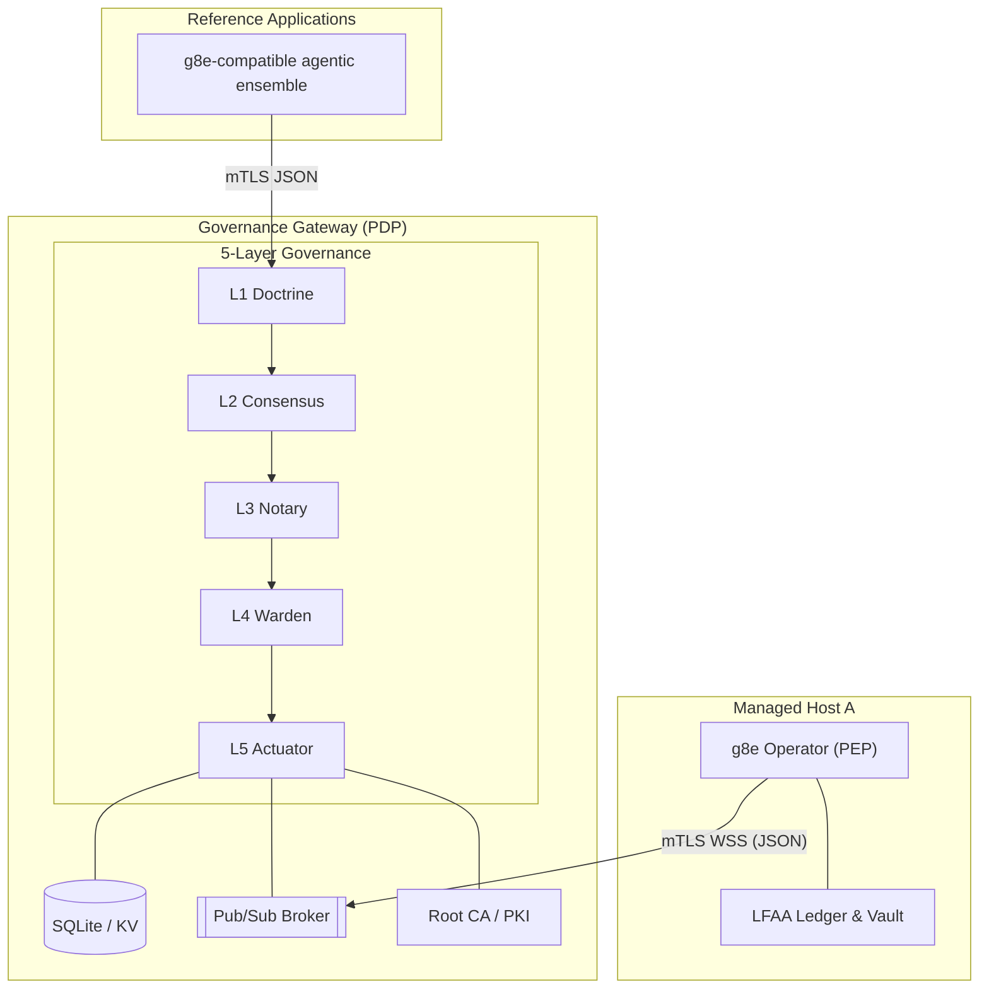

# g8e Gateway - Governance Gateway

The g8e Protocol substrate is composed of two logically distinct roles, both implemented by the reference `g8e` binary:

1.  **Governance Gateway** (Policy Decision Point / PDP): Serves as the central, BFT-governed coordinator for the platform.
2.  **g8e Operator** (Policy Execution Point / PEP): Runs on target hosts as the sovereign execution boundary and MCP server.

---

## Core Principles

- **5-Layer Governance Bedrock**: Every transaction must pass through five mandatory, fail-closed layers:
    - **L1 Doctrine**: Technical bedrock (Hard Gates, threat detection).
    - **L2 Consensus**: Multi-agent verification (Ed25519 signatures from independent consensus agents).
    - **L3 Notary**: Human-in-the-loop authorization (WebAuthn/Passkey).
    - **L4 Warden**: Pre-dispatch verification gate (Hash, Expiry, Nonce, State Root).
    - **L5 Actuator**: Execution boundary (Single fail-closed dispatch path, signed ActionReceipts).
- **mTLS-Everywhere**: All communication is strictly gated by Gateway-owned mutual TLS. No inbound ports are required on managed hosts.
- **Local-First Audit (LFAA)**: The target host remains the source of truth for command history and file mutations, stored in a tamper-evident local ledger.
- **Canonical JSON (GovernanceEnvelope)**: Every mutation action is governed by a canonical JSON `GovernanceEnvelope`. This is the single canonical container for all g8e mutations, binding identity, intent, state, and governance proofs into one transaction.
- **Transaction Invariants**: Every transaction is identified by a deterministic `transaction_hash` computed from its content. The envelope `id` must match this hash for the transaction to be valid.
- **Protocol vs Implementation**: The protocol is the Gateway. Conforming implementations of the Governance Gateway and g8e Operator enforce these invariants.
- **Sovereign Authority (PKI)**: The Governance Gateway owns the platform's PKI and is the only entity permitted to sign certificates.
- **CSR-Based Enrollment**: Participants enroll by submitting a Certificate Signing Request (CSR) to the Governance Gateway. Identities are encoded as SPIFFE URI SANs.

---

## Architecture Overview

The g8e platform is built on the g8e Protocol. Conforming gateway and operator implementations are what make that protocol live.

- **Governance Gateway (PDP)**: The `g8e` binary run in **Gateway mode** (`--doctrine`, `--consensus`, or `--notary`). It acts as the platform's backbone - protocol hub, policy decision point, persistence layer (SQLite), pub/sub broker, root CA, and audit authority.
- **g8e Operator (PEP)**: The `g8e` binary run in **Standard Mode** or **MCP Mode** (`--mcp-serve`). It acts as the sovereign tool execution boundary on a managed host, executing actions only after they carry a valid, signed gateway lease.

---

## Operating Modes: Gateway Mode (PDP)

By passing `--doctrine`, `--consensus`, or `--notary`, the binary transforms into the platform's central backbone.

- **Role**: Reference hub for the bundled deployment.
- **Governance Posture**:
    - **Doctrine** (`--doctrine`): L1 enforced, L2/L3 audited.
    - **Consensus** (`--consensus`): L1/L2 enforced, L3 audited.
    - **Notary** (`--notary`): L1/L2/L3 strictly enforced.
- **Capabilities**:
    - **Gateway API** - `POST /api/governance/envelope` is the only customer-facing mutation entry point.
    - **Document Store** - JSON document CRUD on a Collection/ID pattern.
    - **KV Store** - TTL-aware ephemeral state with `GLOB` pattern scanning.
    - **Blob Store** - Binary persistence for attachments and certificate material.
    - **Pub/Sub Broker** - High-performance WebSocket fan-out. Mutation channels (`cmd:*`) are governed.
    - **Root CA / PKI** - Issues mTLS certificates via CSR-based enrollment with SPIFFE URI SAN identity.
    - **Audit Authority** - Append-only encrypted log of every event and signed `ActionReceipt`.

### Port Topology

The Governance Gateway exposes two logical protocol surfaces. To maintain the mTLS execution boundary, surfaces with different TLS requirements **must not** share a port.

Default ports are sourced from `internal/constants/ports.go`:

| Surface | Port (default) | Auth | Purpose |
|---|---|---|---|
| **mTLS API + Pub/Sub** | `8440` (mTLS) | mTLS + URI SAN | `/api/governance/envelope`, `/db/*`, `/kv/*`, `/blob/*`, `/pubsub/publish`, and `/ws/pubsub` real-time fan-out. |
| **Public Port** | `8443` (TLS) | Web session (passkey) | Login challenge/verify, web-session API, PKI discovery for browser/BYO bootstrap. |

#### Port Constraints

- **mTLS Surface** (`8440`): Requires `tls.RequireAndVerifyClientCert`. This is the primary execution boundary.
- **Public Surface** (`8443`): Serves TLS with WebAuthn/Passkey authentication for browser-based access.
- **Collision Prevention**: The gateway fails startup if incompatible surfaces (e.g., mTLS and Public) are assigned to the same port, as this would force a downgrade to `VerifyClientCertIfGiven`.

---

## 5-Layer Verification Sequence

Every transaction submitted to `POST /api/governance/envelope` must pass through the following layers:

### L1 Doctrine (Hard Gates)
The technical bedrock. Enforces forbidden patterns (e.g., `sudo`, `rm -rf /`), blacklists, and whitelists. It also performs MITRE threat detection on incoming payloads.

### L2 Consensus
A Byzantine Fault Tolerant consensus layer where independent agents verify the intent and safety of the command. In Gateway mode, this can be configured to require Ed25519 signatures from trusted consensus agents. The specific consensus implementation (e.g., Tribunal) is an application-layer concern.

### L3 Notary (Human Authorization)
The human-in-the-loop layer. Requires a cryptographic proof of human intent.
- **BYO Clients**: Use WebAuthn/Passkey proofs.
- **CLI Sessions**: Use mTLS certificate fingerprints bound to the session.

### L4 Warden (Pre-Dispatch Verification)
The final pre-execution check. Verifies:
- **Transaction Hash**: `envelope.id` must match computed hash of content.
- **Expiry**: `expires_at` must be in the future.
- **Nonce/Replay**: `nonce` must not have been used previously (sliding-window protection).
- **State Root**: `state_merkle_root` (if provided) must match the Gateway's current state root.
- **Signer Trust**: Verifies L2/L3 signatures against trusted keys.

### L5 Actuator (Execution Boundary)
The single fail-closed dispatch path.
- **Execution**: Dispatches the verified payload to the downstream execution handler (e.g., MCP server).
- **Audit**: Persists a `console_audit` record and a signed `ActionReceipt`.
- **Receipt**: Generates a deterministic, signed receipt containing the result and state transitions.

---

## Out-of-Band (OOB) Suspension & WebAuthn Approval Flow

When a standard AI client (e.g., Claude, Cursor) requests a mutation, it typically cannot generate an L3 human signature.

1.  **Suspension**: The gateway detects missing L3 proof and suspends the transaction in the SQLite `suspended_transactions` store.
2.  **Challenge**: The gateway returns an OOB WebAuthn challenge URL to the AI client.
3.  **Approval**: The human opens the URL, authenticates with a passkey, and approves the specific transaction.
4.  **Resumption**: The gateway attaches the resulting WebAuthn proof to the envelope and resumes the L4/L5 flow.

---

## JWT Authentication & JIT User Provisioning

The Gateway provides a robust JWT authentication and Just-In-Time (JIT) user provisioning flow that fully isolates the downstream Operator from Identity Providers (IdP). The Gateway acts as the authentication brain, while the Operator receives a pre-validated, enriched payload via the pub/sub pipe.

### 4-Step JWT Flow

**Step 1: Inbound HTTP Handshake & JWT Verification**
The Gateway intercepts inbound `Authorization: Bearer <JWT>` tokens on public MCP endpoints before routing to downstream execution logic. The middleware cryptographically verifies the JWT signature using JWKS or static public keys, validates `exp` and `iss` claims, and extracts identity claims (`sub`, `tenant_id`, `roles`).

**Step 2: Edge Validation & JIT Account Management**
Following successful token validation, the Gateway ensures the user exists locally and maps their roles:
- **JIT Provisioning**: Checks the SQLite `users` collection for the `sub` (User ID). If the user does not exist, dynamically creates their user account record with default active status.
- **Persona Mapping**: Loads declarative Persona manifests (e.g., YAML definitions representing `security-analyst`, `admin`). Evaluates the JWT `roles` against these manifests to determine the active `binding_persona`.
- **Context Injection**: Stores the resolved `binding_persona` and `tenant_id` into the request context.

**Step 3: Enriched Pub/Sub Handoff (GovernanceEnvelope)**
The Gateway strips the heavy JWT and injects the evaluated security requirements directly into the canonical mutation envelope before passing it to the pub/sub broker:
- The `GovernanceEnvelope` carries `tenant_id` and `binding_persona` as typed fields.
- The pub/sub payload is strictly a canonical `GovernanceEnvelope` carrying typed payloads (e.g., `McpCallRequested`) alongside the validated security metadata.
- The heavy JWT is discarded, reducing payload size.

**Step 4: Native Execution & Data Scrubbing (Operator)**
When the outbound Operator pulls the message off the pub/sub queue, it acts natively on the injected security metadata without second-guessing the Gateway:
- The Operator decodes the `GovernanceEnvelope` and extracts `tenant_id` and `binding_persona`.
- These fields propagate into the execution context.
- Native tool isolation applies column masks or data redaction (e.g., stripping `password_hash`, masking emails) directly based on the Persona before returning results.

### Operator Isolation from IdP

This architecture ensures the Operator never requires outbound internet access to verify tokens or manage user state. The Gateway handles all IdP communication, JWT validation, and user lifecycle management. The Operator receives only the pre-validated, enriched security metadata needed for execution.

---

## Session Types

| Session Type | Identifier | Purpose | Authentication |
|---|---|---|---|
| **Operator Session** | `operator_session_id` | Authenticates a specific **g8e Operator** (PEP). | mTLS (Operator Cert) |
| **CLI Session** | `cli_session_id` | Authenticates a **BYO/CLI client**. | mTLS (CLI Cert) |
| **Web Session** | `web_session_id` | Authenticates a **browser-based client**. | Passkey (WebAuthn) |
| **JWT Session** | `sub` (User ID) | Authenticates via external IdP JWT. | JWT (validated at Gateway) |

---

## Implementation Reference

| Concern | File |
|---|---|
| Gateway mode entry | `/home/bob/g8e/cmd/g8eo/main.go` (runGatewayMode) |
| Gateway service | `/home/bob/g8e/internal/services/gateway/gateway_service.go` |
| Coordination Store | `/home/bob/g8e/internal/services/gateway/gateway_db.go` |
| Pub/Sub broker | `/home/bob/g8e/internal/services/gateway/gateway_pubsub.go` |
| L1 Doctrine | `/home/bob/g8e/internal/services/governance/l1_doctrine.go` |
| L2 Consensus | `/home/bob/g8e/internal/services/governance/l2_consensus.go` |
| L3 Notary | `/home/bob/g8e/internal/services/governance/l3_notary.go` |
| L4 Warden | `/home/bob/g8e/internal/services/governance/l4_warden.go` |
| L5 Actuator | `/home/bob/g8e/internal/services/governance/l5_actuator.go` |
| PKI / CertStore | `/home/bob/g8e/internal/services/gateway/gateway_certs.go` |
| Secret Manager | `/home/bob/g8e/internal/services/gateway/secret_manager.go` |
| Workload identity | `/home/bob/g8e/protocol/workload_identity.go` |
| Collections registry | `/home/bob/g8e/internal/constants/collections.go` |

---

## Canonical Collections

| Collection | Description |
|---|---|
| **Authentication & Sessions** | `users`, `web_sessions`, `operator_sessions`, `cli_sessions`, `bound_sessions`, `passkey_challenges` |
| **Organizations & Tenants** | `organizations` |
| **Audit & Security** | `login_audit`, `auth_admin_audit`, `account_locks`, `console_audit`, `revoked_certificates` |
| **Operators & Usage** | `operators`, `operator_usage` |
| **Cases & Investigations** | `cases`, `investigations`, `tasks` |
| **Governance & Reputation** | `reputation_state`, `reputation_commitments`, `stake_resolutions` |
| **AI & Context** | `memories`, `agent_activity_metadata` |
| **Configuration** | `settings` |

---

## Related Documentation

- [**g8e Protocol**](./protocol.md) - The wire contract and governance hierarchy.
- [**g8e Operator**](./operator.md) - Sovereign host-side execution agent and MCP server.
