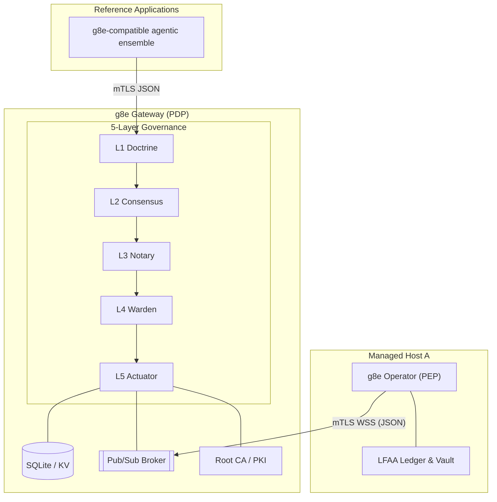

# g8e Gateway

The g8e Protocol platform is composed of two logically distinct roles, both implemented by the reference g8e Node:

1.  **g8e Gateway** (Policy Decision Point / PDP): Serves as the central, BFT-governed coordinator for the platform.
2.  **g8e Operator** (Policy Execution Point / PEP): Runs on target hosts as the sovereign execution boundary and MCP server.

---

## Core Principles

- **5-Layer Governance Bedrock**: Every transaction must pass through five mandatory, fail-closed layers sequentially:
    - **L1 Doctrine**: Technical Bedrock (Hard Gates) code pattern matching and threat analysis defined in `internal/services/governance/l1_doctrine.go`.
    - **L2 Consensus**: Multi-agent consensus signature verification using Ed25519 cryptography defined in `internal/services/governance/l2_consensus.go`.
    - **L3 Notary**: Human-in-the-loop authorization (utilizing WebAuthn or cryptographically signed CLI proofs) defined in `internal/services/governance/l3_notary.go`.
    - **L4 Warden**: Pre-dispatch verification gating (validating signatures, replay prevention, expiry, nonces, and state Merkle root) defined in `internal/services/governance/l4_warden.go`.
    - **L5 Actuator**: Isolated boundary tool dispatch (via MCP/A2A) and signed receipt production defined in `internal/services/governance/l5_actuator.go`.
- **mTLS-Everywhere**: All communication is strictly gated by Gateway-owned mutual TLS. No inbound ports are required on managed hosts. The platform uses `g8e.local` as its canonical SPIFFE trust domain for workload identities. See [Network Architecture](./network.md) for detailed mTLS enforcement, PKI hierarchy, and identity management.
- **Local-First Audit (LFAA)**: The target host remains the source of truth for command history and file mutations, stored in a tamper-evident local ledger.
- **Canonical JSON (GovernanceEnvelope)**: Every mutation action is governed by a canonical JSON `GovernanceEnvelope` (protojson). This is the single canonical container for all g8e mutations, binding identity, intent, state, and governance proofs into one transaction.
- **Transaction Invariants**: Every transaction is identified by a deterministic `transaction_hash` computed from its content. The envelope `id` must match this hash for the transaction to be valid.
- **Protocol vs Implementation**: The protocol is the Gateway. Conforming implementations of the g8e Gateway and g8e Operator enforce these invariants.
- **Sovereign Authority (PKI)**: The g8e Gateway owns the platform's PKI and is the only entity permitted to sign certificates. See [Network Architecture](./network.md) for the complete PKI hierarchy and certificate management.
- **CSR-Based Enrollment**: Participants enroll by submitting a Certificate Signing Request (CSR) to the g8e Gateway. Identities are encoded as SPIFFE URI SANs. See [Network Architecture](./network.md) for detailed enrollment procedures.

---

## Architecture Overview

The g8e platform is built on the g8e Protocol. Conforming gateway and Operator implementations make that protocol live.

- **g8e Gateway** (PDP): The g8e Node run in **Gateway mode** (`--doctrine`, `--consensus`, or `--notary`). It acts as the platform's backbone; protocol hub, policy decision point, persistence layer (SQLite), pub/sub broker, root CA, and audit authority.
- **g8e Operator** (PEP): The g8e Node run in **Standard Mode**. It acts as the sovereign tool execution boundary on a managed host, executing actions only after they carry a valid, signed gateway lease. Gateway mode operators automatically expose MCP endpoints.

---

## Operating Modes: Gateway Mode (PDP)

By passing `--doctrine`, `--consensus`, or `--notary`, the g8e Node transforms into the platform's central backbone.

- **Role**: Reference hub for the bundled deployment.
- **Governance Posture**:
    - **Doctrine** (`--doctrine`): L1 Doctrine enforced, L2 Consensus / L3 Notary audited.
    - **Consensus** (`--consensus`): L1 Doctrine / L2 Consensus enforced, L3 Notary audited.
    - **Notary** (`--notary`): L1 Doctrine / L2 Consensus / L3 Notary strictly enforced.
- **Capabilities**:
    - **Gateway API**: `POST /api/v1/governance/envelopes` is the only customer-facing mutation entry point.
    - **Document Store**: JSON document CRUD on a Collection/ID pattern via `/api/v1/db/*`.
    - **KV Store**: TTL-aware ephemeral state with `GLOB` pattern scanning via `/api/v1/kv/*`.
    - **Blob Store**:Node Node Binary persistence for attachments and certificate material via `/api/v1/blob/*`.
    - **Pub/Sub Broker**: High-performance WebSocket fan-out via `/ws/v1/pubsub`. Mutation channels (`cmd:*`) are governed.
    - **Root CA / PKI**: Issues mTLS certificates via CSR-based enrollment with SPIFFE URI SAN identity.
    - **Audit Authority**: Append-only encrypted log of every event and signed `ActionReceipt`.
    - **Unified MCP Endpoint**: Single-URL JSON-RPC dispatch contract for MCP protocol communication via `internal/services/mcp/mcp_endpoint.go`.

### Port Topology

The g8e Gateway exposes two logical protocol surfaces. To maintain the mTLS execution boundary, surfaces with different TLS requirements must not share a port. See [Network Architecture](./network.md) for detailed port topology, authentication requirements, and port constraints.

**MCP Endpoint Availability**: MCP endpoints are exclusively available on the HTTPS port (8443) with mTLS authentication (or JWT when JWKS is configured). MCP routes are NOT available on the HTTP bootstrap port (8080), which is limited to bootstrap enrollment and PKI discovery endpoints only.

---

## MCP Endpoint Architecture

The g8e Gateway (g8eg) implements a unified MCP (Model Context Protocol) endpoint defined in `internal/services/mcp/mcp_endpoint.go`. This endpoint provides a single-URL JSON-RPC dispatch contract that standard MCP clients expect.

### Unified Endpoint Contract

The unified endpoint accepts POST requests containing JSON-RPC 2.0 messages and dispatches by the `method` field. The per-method REST routes remain for backward compatibility. The endpoint implements the MCP protocol handshake via the `initialize` method and negotiates protocol version with clients.

### Supported Methods

The unified endpoint dispatches the following MCP methods:
- `initialize`: Protocol handshake and capability negotiation
- `ping`: Liveness probe
- `tools/list`: Tool catalog discovery
- `tools/call`: Tool execution
- `resources/list`: Resource catalog discovery
- `resources/templates/list`: Resource template discovery
- `resources/read`: Resource content retrieval
- `prompts/list`: Prompt catalog discovery
- `prompts/get`: Prompt content retrieval
- `a2a/call`: Agent-to-agent communication

### Native Tool Registry

The gateway maintains a centralized tool registry via `internal/services/mcp/registry.go`. The `ToolRegistry` provides thread-safe tool registration and lookup, enforcing tool name validation and input schema compliance. All native tools implement the `NativeTool` interface with `Name()`, `Description()`, `InputSchema()`, and `Execute()` methods.

### Input Validation Framework

The gateway implements a comprehensive input validation system in `internal/services/mcp/validation.go` with fail-closed security principles:
- **SQL Query Validation**: Rejects empty queries, trailing semicolons to prevent statement chaining
- **URL Validation**: Parses and validates URLs, restricting to http/https schemes, rejecting localhost and loopback addresses, and blocking private IP ranges to prevent SSRF attacks
- **Protocol Validation**: Validates protocol strings for filesystem operations to prevent path traversal

### Native Tool Ecosystem

The gateway provides a comprehensive set of native tools covering database operations, filesystem analysis, network diagnostics, process management, and system monitoring:

**Database Tools**:
- `db_discover_topology`: Database schema discovery
- `db_index_triage`: Index analysis and optimization recommendations
- `db_isolated_read`: Isolated database read operations with query validation
- `db_query_validate`: SQL query validation and analysis

**Filesystem Tools**:
- `fs_disk_profile`: Disk usage and filesystem profiling
- `log_stream_filter`: Log stream filtering and analysis

**Network Tools**:
- `net_endpoint_ping`: Network endpoint reachability testing
- `net_http_probe`: HTTP endpoint probing with SSRF protection
- `net_socket_audit`: Socket state auditing with protocol validation

**Process Tools**:
- `proc_metric_top`: Process resource metrics and top-like analysis
- `proc_signal_safe`: Safe process signal handling

**System Tools**:
- `sys_oom_detect`: Out-of-memory detection and analysis

---

## Incremental State Tracking

The gateway implements incremental state tracking to optimize performance by avoiding full state recomputation. The database schema in `internal/services/gateway/db/schema.sql` includes:

### State Version Table

A monotonically increasing counter (`state_version`) tracks changes across all data stores. Triggers automatically increment this counter on document, KV store, and blob mutations. This allows the gateway to detect when state has changed without scanning entire tables.

### Change Tracking Mechanisms

Triggers on the `documents`, `kv_store`, and `blobs` tables increment the state version on insert, update, and delete operations. The gateway queries the current version before performing expensive state root calculations, skipping computation when the version has not changed.

---

## Health Endpoint Consolidation

The health endpoint is unified across the gateway service and available on all protocol surfaces. The implementation in `internal/services/gateway/gateway_http.go` provides consistent health checking behavior:

### Health Check Logic

The health endpoint verifies:
- Service readiness via an optional `isReady` callback
- Platform settings document availability
- State root calculation success

The endpoint returns a `HealthResponse` containing status, mode, and version information. The health check is registered as a public route in the `PublicRouteRegistry` to bypass authentication middleware for monitoring purposes.

---

## 5-Layer Verification Sequence

Every transaction submitted to `POST /api/v1/governance/envelopes` must pass through the following layers sequentially:

### L1 Doctrine (Technical Bedrock)
Defined in `internal/services/governance/l1_doctrine.go`. Enforces forbidden patterns (such as `sudo` or `rm -rf /`), blacklists, and whitelists. It also performs MITRE threat detection on incoming payloads.

### L2 Consensus (Consensus Verification)
Defined in `internal/services/governance/l2_consensus.go`. Verifies multi-agent consensus signature using Ed25519 cryptography. In Gateway mode, this requires Ed25519 signatures from trusted consensus agents.

### L3 Notary (Human Authorization)
Defined in `internal/services/governance/l3_notary.go`. Enforces human-in-the-loop authorization using a cryptographic proof of human intent:
- **Web Sessions**: Use WebAuthn or Passkey proofs (FIDO2).
- **CLI Sessions**: Use mTLS certificate fingerprints or Ed25519 signatures bound to the session.
- **Operator Sessions**: Use mTLS certificate fingerprints only (passkey auth is not available for operators).

### L4 Warden (Pre-Dispatch Gating)
Defined in `internal/services/governance/l4_warden.go`. Enforces final pre-execution verification gates:
- **Transaction Hash**: The `envelope.id` must match the deterministic transaction hash computed from its content using `governance.GenerateMessageID`.
- **Expiry**: The `expires_at` timestamp must be in the future.
- **Nonce/Replay**: The `nonce` must not have been used previously (sliding-window protection) via the `ReplayStore`.
- **State Root**: The `state_merkle_root` (if provided) must match the current state root of the gateway.
- **Signer Trust**: Verifies L2 Consensus / L3 Notary signatures against trusted keys in the `SignerStore`.

### L5 Actuator (Execution and Receipt)
Defined in `internal/services/governance/l5_actuator.go`. Performs isolated boundary tool dispatch (via MCP/A2A) and signed receipt production:
- **Execution**: Dispatches the verified payload to the downstream execution handler (such as an MCP server).
- **Audit**: Persists a `console_audit` record and a signed `ActionReceipt`.
- **Receipt**: Generates a deterministic, signed receipt containing the result and state transitions.

---

## Out-of-Band (OOB) Suspension & WebAuthn Approval Flow

When a standard AI client (such as Claude or Cursor) requests a mutation, it typically cannot generate an L3 Notary human signature.

1.  **Suspension**: The gateway detects missing L3 Notary proof and suspends the transaction in the SQLite `suspended_transactions` store.
2.  **Challenge**: The gateway returns an OOB WebAuthn challenge URL to the AI client.
3.  **Approval**: The human opens the URL, authenticates with a passkey, and approves the specific transaction.
4.  **Resumption**: The gateway attaches the resulting WebAuthn proof to the envelope and resumes the L4 Warden and L5 Actuator flow.

---

## JWT Authentication & JIT User Provisioning

The g8e Gateway (g8eg) provides JWT authentication and Just-In-Time (JIT) user provisioning flows that fully isolate the downstream g8e Operator (g8eo) from Identity Providers (IdP). The g8e Gateway (g8eg) acts as the authentication brain, while the g8e Operator (g8eo) receives a pre-validated, enriched payload via the pub/sub pipe.

### 4-Step JWT Flow
The JWT authentication logic is implemented in `internal/services/gateway/gateway_auth.go:663`.

**Step 1: Inbound HTTP Handshake & JWT Verification**
The g8e Gateway (g8eg) intercepts inbound `Authorization: Bearer <JWT>` tokens on public MCP endpoints before routing to downstream execution logic. The middleware cryptographically verifies the JWT signature using JWKS or static public keys, validates `exp` and `iss` claims, and extracts identity claims (`sub`, `tenant_id`, `roles`).

**Step 2: Edge Validation & JIT Account Management**
Following successful token validation, the g8e Gateway (g8eg) ensures the user exists locally and maps their roles:
- **JIT Provisioning**: Checks the SQLite `users` collection for the `sub` (User ID) via `userSvc.GetOrCreateBySub`. If the user does not exist, dynamically creates their user account record with default active status.
- **Persona Mapping**: Loads declarative Persona manifests (e.g., YAML definitions representing `security-analyst`, `admin`). Evaluates the JWT `roles` against these manifests via `personaSvc.MapRolesToPersona` to determine the active `binding_persona`.
- **Context Injection**: Stores the resolved `binding_persona` and `tenant_id` into the request context.

**Step 3: Enriched Pub/Sub Handoff (GovernanceEnvelope)**
The g8e Gateway (g8eg) strips the heavy JWT and injects the evaluated security requirements directly into the canonical mutation envelope before passing it to the pub/sub broker:
- The `GovernanceEnvelope` carries `tenant_id` and `binding_persona` as typed fields.
- The pub/sub payload is strictly a canonical `GovernanceEnvelope` carrying typed payloads (e.g., `McpCallRequested`) alongside the validated security metadata.
- The heavy JWT is discarded, reducing payload size.

**Step 4: Native Execution & Data Scrubbing (g8e Operator)**
When the outbound g8e Operator (g8eo) pulls the message off the pub/sub queue, it acts natively on the injected security metadata without second-guessing the g8e Gateway (g8eg):
- The g8e Operator (g8eo) decodes the `GovernanceEnvelope` and extracts `tenant_id` and `binding_persona`.
- These fields propagate into the execution context.
- Native tool isolation applies column masks or data redaction (e.g., stripping `password_hash`, masking emails) directly based on the Persona before returning results.

### Operator Isolation from IdP

This architecture ensures the g8e Operator (g8eo) never requires outbound internet access to verify tokens or manage user state. The g8e Gateway (g8eg) handles all IdP communication, JWT validation, and user lifecycle management. The g8e Operator (g8eo) receives only the pre-validated, enriched security metadata needed for execution.

---

## Session Types

| Session Type | Identifier | Purpose | Authentication |
|---|---|---|---|
| **Operator Session** | `operator_session_id` | Authenticates a specific **g8e Operator (g8eo)** (PEP). | mTLS (Operator Cert) |
| **CLI Session** | `cli_session_id` | Authenticates a **BYO/CLI client**. | mTLS (CLI Cert) |
| **Web Session** | `web_session_id` | Authenticates a **browser-based client**. | Passkey (WebAuthn) |
| **JWT Session** | `sub` (User ID) | Authenticates via external IdP JWT. | JWT (validated at Gateway) |

---

## Implementation Reference

| Concern | File |
|---|---|
| Gateway service | `internal/services/gateway/gateway_service.go` |
| Gateway mode entry | `internal/services/gateway/gateway_service.go:543` (`GatewayModeService.Start`) |
| Coordination Store | `internal/services/gateway/gateway_db.go` |
| Pub/Sub broker | `internal/services/gateway/gateway_pubsub.go` |
| L1 Doctrine | `internal/services/governance/l1_doctrine.go` |
| L2 Consensus | `internal/services/governance/l2_consensus.go` |
| L3 Notary | `internal/services/governance/l3_notary.go` |
| L4 Warden | `internal/services/governance/l4_warden.go` |
| L5 Actuator | `internal/services/governance/l5_actuator.go` |
| PKI / CertStore | `internal/services/gateway/gateway_certs.go` |
| Secret Manager | `internal/services/gateway/secret_manager.go` |
| Network architecture | `./network.md` |
| Collections registry | `internal/constants/collections.go` |
| MCP unified endpoint | `internal/services/mcp/mcp_endpoint.go` |
| Native tool registry | `internal/services/mcp/registry.go` |
| Input validation | `internal/services/mcp/validation.go` |
| Database schema | `internal/services/gateway/db/schema.sql` |
| Native handlers | `internal/services/mcp/native_handlers.go` |

---

## Canonical Collections

| Collection | Description |
|---|---|
| **Authentication & Sessions** | `users`, `web_sessions`, `operator_sessions`, `cli_sessions`, `bound_sessions`, `passkey_challenges` |
| **Organizations & Tenants** | `organizations`, `invitations` |
| **Audit & Security** | `login_audit`, `auth_admin_audit`, `account_locks`, `console_audit`, `revoked_certificates` |
| **Operators & Usage** | `operators`, `operator_usage` |
| **Cases & Investigations** | `cases`, `investigations`, `tasks` |
| **Governance & Reputation** | `reputation_state`, `reputation_commitments`, `stake_resolutions`, `trusted_signers`, `app_policies` |
| **AI & Context** | `memories`, `agent_activity_metadata`, `personas` |
| **Configuration** | `settings` |
| **Testing** | `chaos_events` |

---

## Agent Integration

The g8e Gateway provides zero-config ingress for agentic CLI coding tools (Claude Code, Cursor, VS Code, Cline) through the agent wrapper and gov components.

### Agent Wrapper

The agent wrapper (`internal/cli/cmd/agent.go`) is a generic wrapper that:
- Detects tool binaries on the system
- Verifies gateway status before execution
- Checks CLI authentication status
- Injects G8E_* environment variables with MCP configuration
- Executes tools with proper process group management

The wrapper automatically configures MCP integration by setting:
- `G8E_MCP_CONFIG`: JSON configuration for stdio transport to g8e
- `G8E_GATEWAY_URL`: Gateway HTTPS endpoint for mTLS
- `G8E_CLIENT_CERT`/`G8E_CLIENT_KEY`: mTLS certificate paths
- `G8E_CA_BUNDLE`: Trust bundle path
- `G8E_OPERATOR_SESSION_ID`: Session identity
- `G8E_USER_ID`: User identity

### Stdio Proxy

The stdio proxy (`internal/cli/cmd/mcp.go`) bridges stdio MCP transport to the gateway mTLS HTTPS endpoint:
- Accepts JSON-RPC 2.0 requests over stdin/stdout
- Proxies requests to the gateway HTTPS endpoint with mTLS
- Detects L3 approval responses and polls for completion
- Auto-opens browser for L3 approval URLs
- Implements retry logic with configurable timeout (5 minutes default)

### L3 Approval Polling

When the gateway returns an L3 approval response, the stdio proxy:
1. Extracts the approval URL from the response (structured field or text content)
2. Opens the browser automatically using `internal/cli/platform/browser.go`
3. Polls the gateway every 10 seconds for up to 30 iterations
4. Returns the final result once approval is complete

The polling logic is implemented in `proxyToGatewayWithRetry` with constants:
- `l3ApprovalMaxIterations`: 30
- `l3ApprovalPollInterval`: 10 seconds
- `l3ApprovalTotalTimeout`: 5 minutes

### Browser Utility

The browser utility (`internal/cli/platform/browser.go`) provides cross-platform browser opening for L3 approval URLs, supporting macOS, Linux, and Windows.

---

## Related Documentation

- [**g8e Protocol**](./protocol.md) - The wire contract and governance hierarchy.
- [**g8e Operator**](./operator.md) - Sovereign host-side execution agent and MCP server.
- [**CLI Reference**](../guides/cli.md) - Complete CLI command documentation including agent integration.
