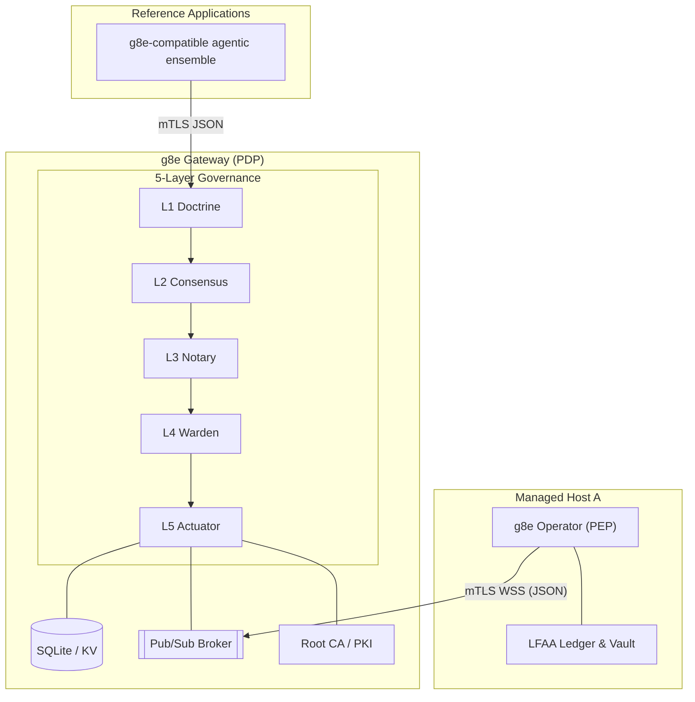

# g8e Gateway

Last Updated: 2026-07-14
Version: v1.2.4

The g8e Protocol platform is composed of two logically distinct roles, both implemented by the reference g8e Node:

1.  **g8e Gateway** (Policy Decision Point / PDP): Serves as the central, BFT-governed coordinator for the platform.
2.  **g8e Operator** (Policy Execution Point / PEP): Runs on target hosts as the sovereign execution boundary and MCP server.

---

## Core Principles

- **5-Layer Governance Bedrock**: Every transaction must pass through five mandatory, fail-closed layers sequentially:
    - **L1 Doctrine**: Technical Bedrock (Hard Gates) code pattern matching and threat analysis defined in `internal/services/governance/l1_doctrine.go`.
    - **L2 Consensus**: Tribunal-based deliberation producing L2 votes (Ed25519 signatures) over the transaction hash, defined in `internal/services/tribunal/service.go`. The gateway delegates L2 deliberation to an enrolled Tribunal rather than self-signing.
    - **L3 Notary**: Human-in-the-loop authorization (utilizing WebAuthn or cryptographically signed CLI proofs) defined in `internal/services/governance/l3_notary.go` with CLI session verification in `internal/services/gateway/cli_session_verifier.go`.
    - **L4 Warden**: Pre-dispatch verification gating (validating signatures, replay prevention, expiry, nonces, and state Merkle root) defined in `internal/services/governance/l4_warden.go`.
    - **L5 Actuator**: Isolated boundary tool dispatch (via MCP/A2A) and signed receipt production defined in `internal/services/governance/l5_actuator.go`.
- **mTLS-Everywhere**: All communication is strictly gated by Gateway-owned mutual TLS. No inbound ports are required on managed hosts. The platform uses `g8e.local` as its canonical SPIFFE trust domain for workload identities. See [Network Architecture](./network.md) for detailed mTLS enforcement, PKI hierarchy, and identity management.
- **Local-First Audit Architecture (LFAA)**: The target host remains the source of truth for command history and file mutations, stored in a tamper-evident local ledger and SQL audit store.
- **Canonical JSON (GovernanceEnvelope)**: Every mutation action is governed by a canonical JSON `GovernanceEnvelope` (protojson). This is the single canonical container for all g8e mutations, binding identity, intent, state, and governance proofs into one transaction.
- **Transaction Invariants**: Every transaction is identified by a deterministic `transaction_hash` computed from its content. The envelope `id` must match this hash for the transaction to be valid.
- **Protocol vs Implementation**: The protocol is the Gateway. Conforming implementations of the g8e Gateway and g8e Operator enforce these invariants.
- **Sovereign Authority (PKI)**: The g8e Gateway owns the platform's PKI and is the only entity permitted to sign certificates. See [Network Architecture](./network.md) for the complete PKI hierarchy and certificate management.
- **CSR-Based Enrollment**: Participants enroll by submitting a Certificate Signing Request (CSR) to the g8e Gateway. Identities are encoded as SPIFFE URI SANs. See [Network Architecture](./network.md) for detailed enrollment procedures.

---

## Architecture Overview

The g8e platform is built on the g8e Protocol. Conforming gateway and Operator implementations make that protocol live.

- **g8e Gateway** (PDP): The g8e Node run in **Gateway mode** (`--posture doctrine`, `--posture consensus`, or `--posture notary`). It acts as the platform's backbone; protocol hub, policy decision point, persistence layer (SQLite), pub/sub broker, root CA, and audit authority.
- **g8e Operator** (PEP): The g8e Node run in **Standard Mode**. It acts as the sovereign tool execution boundary on a managed host, executing actions only after they carry a valid, signed gateway lease. Gateway mode operators automatically expose MCP endpoints.

---

## Operating Modes: Gateway Mode (PDP)

By passing `--posture doctrine`, `--posture consensus`, or `--posture notary`, the g8e Node transforms into the platform's central backbone.

- **Role**: Reference hub for the bundled deployment.
- **Governance Posture**:
    - **Doctrine** (`--posture doctrine`): L1 Doctrine enforced, L2 Consensus / L3 Notary audited.
    - **Consensus** (`--posture consensus`): L1 Doctrine / L2 Consensus enforced, L3 Notary audited.
    - **Notary** (`--posture notary`): L1 Doctrine / L2 Consensus / L3 Notary strictly enforced.
- **Capabilities**:
    - **Gateway API**: `POST /api/v1/governance/envelopes` is the only customer-facing mutation entry point.
    - **Document Store**: JSON document CRUD on a Collection/ID pattern via `/api/v1/db/*`.
    - **KV Store**: TTL-aware ephemeral state with `GLOB` pattern scanning via `/api/v1/kv/*`.
    - **Blob Store**: Binary persistence for attachments and certificate material via `/api/v1/blob/*`.
    - **Pub/Sub Broker**: High-performance WebSocket fan-out via `/ws/v1/pubsub`. Mutation channels (`cmd:*`) are governed.
    - **Root CA / PKI**: Issues mTLS certificates via CSR-based enrollment with SPIFFE URI SAN identity.
    - **Audit Authority**: Append-only encrypted log of every event and signed `ActionReceipt`.
    - **Unified MCP Endpoint**: Single-URL JSON-RPC dispatch contract for MCP protocol communication via `internal/services/mcp/mcp_endpoint.go`.

### Port Topology

The g8e Gateway exposes two logical protocol surfaces. To maintain the mTLS execution boundary, surfaces with different TLS requirements must not share a port. See [Network Architecture](./network.md) for detailed port topology, authentication requirements, and port constraints.

**HTTP Port (8080)**: Plain HTTP for bootstrap enrollment and PKI discovery endpoints only. This port serves the platform trust scripts (e.g., `/bootstrap-ca`, `/bootstrap-ca-macos`, `/bootstrap-ca.ps1`) required for self-signed CA trust. No MCP routes are available on this port.

**HTTPS Port (8443)**: mTLS for all routes including API, public, enrollment, and MCP endpoints. MCP endpoints require mTLS authentication (or JWT when JWKS is configured). The public HTTPS router also serves Swagger UI at `/swagger/*` and the OpenAPI specification at `/swagger/doc.json`, providing interactive API documentation.

---

## HTTP Router Architecture

The gateway builds two distinct HTTP routers in `internal/services/gateway/gateway_http_router.go`, one per protocol surface. The `HTTPHandler` struct (`internal/services/gateway/gateway_http.go`) orchestrates both routers and their controllers.

### Bootstrap HTTP Router (`buildHTTPRouter`)

Served on the HTTP port (8080), this router handles only bootstrap and PKI discovery endpoints. It registers health, state, bootstrap enrollment, CSR signing, CA bundle discovery, trust script download, node binary download, and deploy script routes. All other requests are redirected to HTTPS with a `301 Moved Permanently` response. The redirect validates the host via `isSafeHost` to prevent open redirect vulnerabilities and normalizes path components to prevent path traversal. The router is wrapped with `pathTraversalGuard` and `rateLimitMiddleware`.

### Public HTTPS Router (`buildPublicRouter`)

Served on the HTTPS port (8443), this router handles all API, MCP, passkey, console, and management routes. It is wrapped with `pathTraversalGuard` and `auth.Middleware` at the outermost layer. The `PublicRouteRegistry` in `internal/services/gateway/gateway_auth.go` determines which routes bypass mTLS authentication.

The public HTTPS router registers the following route categories:

**Public Routes (no authentication)**: Health, state, Swagger UI (`/swagger/`, `/swagger/index.html`, `/swagger/doc.json`), CA bundle and fingerprint discovery, CRL, blob store, console SPA (`/console/`), landing page, login/logout, bootstrap enrollment, CLI and device enrollment, PKI apps and devices enrollment.

**MCP/A2A Routes**: Registered via `registerMCPRoutes` on the public mux. When JWKS is configured, MCP routes are wrapped with `JWTAuthMiddleware`; otherwise they rely on mTLS via the outer `auth.Middleware`. Registered paths include `/api/v1/mcp` (unified endpoint), `/api/v1/mcp/tools/list`, `/api/v1/mcp/tools/call`, `/api/v1/mcp/tools/call/sse`, `/api/v1/mcp/resources/list`, `/api/v1/mcp/resources/read`, `/api/v1/mcp/prompts/list`, `/api/v1/mcp/prompts/get`, and `/api/v1/a2a/call`.

**Passkey Console Routes (public, no auth)**: Browser-facing passkey registration and authentication under `/api/v1/auth/passkeys/console/*`. These routes use `passkeyHandlerConfig` with `sourceBrowserBootstrap`, `createWebSession`, and `setCookie` enabled. A CORS middleware wraps the passkey mux.

**JIT Passkey Routes (JWT-authenticated)**: When JWKS is configured, `/api/v1/auth/passkeys/jit/register/challenge` and `/api/v1/auth/passkeys/jit/register/verify` allow OIDC/JIT users with zero credentials to register their first passkey. These routes are wrapped with `JWTAuthMiddleware`.

**mTLS-Only Routes**: Data settings, operator management (list, terminate, bind, unbind, target, reauth), governance signers, app policies, tribunal deliberate, governance envelopes (rate-limited), audit receipts and events, SSE push/events/stream, database, KV store, pub/sub publish and stream, PKI management (CSR sign, apps delegated, certificates revoke, revocation bundle), user management, and passkey CLI status.

**WebSessionAuth-Protected Routes**: Browser-facing routes under `/api/v1/users/`, `/api/v1/auth/sessions/`, `/api/v1/approvals`, `/api/v1/auth/passkeys` are wrapped with `WebSessionAuth` middleware, requiring a valid web session cookie. These include user profile (`/api/v1/users/me`), web session info (`/api/v1/auth/sessions/me`), OOB approval actions and listing, and passkey credential listing and revocation.

**OOB Approval UI**: The `/approve/{txHash}` page route redirects to the console SPA with an approval hash fragment (`/console/#approve={txHash}`), enabling auto-trigger of the WebAuthn approval flow upon successful login.

### PublicRouteRegistry

The `PublicRouteRegistry` in `internal/services/gateway/gateway_auth.go` manages routes that bypass authentication. It maintains exact paths, public prefixes, and excluded prefixes. The `IsPublic` method checks exact matches first (highest priority), then excluded prefixes (mTLS-protected sub-paths under WebSessionAuth prefixes), and finally prefix matches. This ensures that broad public prefixes do not override more specific mTLS-protected sub-paths.

### Console SPA

The console SPA is an embedded single-page application served at `/console/` from `internal/services/gateway/console/console.go`. The SPA provides browser-based passkey registration, authentication, credential management, OOB transaction approval, and a live audit stream. The SPA auto-detects approval hash fragments in the URL and triggers the WebAuthn approval flow after successful authentication.

---

## MCP Endpoint Architecture

The g8e Gateway (g8eg) implements a unified MCP (Model Context Protocol) endpoint defined in `internal/services/mcp/mcp_endpoint.go`. This endpoint provides a single-URL JSON-RPC dispatch contract that standard MCP clients expect.

### Unified Endpoint Contract

The unified endpoint accepts POST requests containing JSON-RPC 2.0 messages and dispatches by the `method` field. The per-method REST routes remain for backward compatibility. The endpoint implements the MCP protocol handshake via the `initialize` method and negotiates protocol version with clients.

### Supported Methods

The unified endpoint dispatches the following MCP methods:
- `initialize`: Protocol handshake and capability negotiation
- `ping`: Liveness probe
- `tools/list`: Tool catalog discovery
- `tools/call`: Tool execution
- `resources/list`: Resource catalog discovery
- `resources/templates/list`: Resource template discovery
- `resources/read`: Resource content retrieval
- `prompts/list`: Prompt catalog discovery
- `prompts/get`: Prompt content retrieval
- `a2a/call`: Agent-to-agent communication

The endpoint also supports SSE (Server-Sent Events) via GET requests for streaming capabilities.

### Native Tool Registry

The gateway maintains a centralized tool registry via `internal/services/mcp/registry.go`. The `ToolRegistry` provides thread-safe tool registration and lookup, enforcing tool name validation and input schema compliance. All native tools implement the `NativeTool` interface with `Name()`, `Description()`, `InputSchema()`, and `Execute()` methods.

### Input Validation Framework

The gateway implements a comprehensive input validation system in `internal/services/mcp/validation.go` with fail-closed security principles:
- **SQL Query Validation**: Rejects empty queries, trailing semicolons to prevent statement chaining
- **URL Validation**: Parses and validates URLs, restricting to http/https schemes, rejecting localhost and loopback addresses, and blocking private IP ranges to prevent SSRF attacks
- **Protocol Validation**: Validates protocol strings for filesystem operations to prevent path traversal
- **Git Path Validation**: Validates repository paths and references to prevent path traversal and command injection
- **Kubernetes Validation**: Validates resource names and namespaces against K8s naming conventions
- **Cloud Metadata Validation**: Validates cloud metadata operation types
- **File Path Validation**: Validates file paths to prevent directory traversal and null byte injection
- **SSH Path Validation**: Validates SSH config and known hosts paths
- **Hostname Validation**: Validates hostnames to prevent shell injection
- **Operator Validation**: Validates operator binary paths and arguments to prevent command injection

### Native Tool Ecosystem

The gateway provides a comprehensive set of native tools covering database operations, filesystem analysis, network diagnostics, process management, and system monitoring. All tools are registered in `internal/services/mcp/native_tool_registry.go`.

**Database Tools**:
- `db_discover_topology`: Database schema discovery
- `db_index_triage`: Index analysis and optimization recommendations
- `db_isolated_read`: Isolated database read operations with query validation
- `db_query_validate`: SQL query validation and analysis

**Filesystem Tools**:
- `fs_disk_profile`: Disk usage and filesystem profiling
- `fs_disk_usage`: Disk usage analysis
- `fs_file_checksum`: File integrity verification via checksum
- `read_file`: Read file contents with validation
- `log_stream_filter`: Log stream filtering and analysis

**Network Tools**:
- `net_endpoint_ping`: Network endpoint reachability testing
- `net_http_probe`: HTTP endpoint probing with SSRF protection
- `net_socket_audit`: Socket state auditing with protocol validation
- `net_dns_resolve`: DNS resolution and query
- `net_ssh_known_hosts`: SSH known hosts management
- `tls_cert_inspect`: TLS certificate inspection and validation

**Process Tools**:
- `proc_metric_top`: Process resource metrics and top-like analysis
- `proc_signal_safe`: Safe process signal handling
- `proc_tree`: Process tree visualization and analysis

**System Tools**:
- `sys_oom_detect`: Out-of-memory detection and analysis
- `sys_info`: System information gathering
- `sys_env_vars`: Environment variable inspection
- `sys_service_status`: System service status checking
- `sys_container_status`: Container status monitoring
- `sys_time_clock`: System time and clock information

**Configuration Tools**:
- `config_diff_mask`: Configuration diffing with sensitive data masking

**Cloud Tools**:
- `cloud_metadata`: Cloud provider metadata retrieval

**Kubernetes Tools**:
- `k8s_inspect`: Kubernetes resource inspection

**Git Tools**:
- `git_ops`: Git repository operations

**Operator Tools**:
- `operator_deploy`: Operator deployment and management

**Execution Tools**:
- `run_shell_command`: Safe shell command execution

---

## Incremental State Tracking

The gateway implements incremental state tracking to optimize performance by avoiding full state recomputation. The database schema in `internal/services/gateway/db/schema.sql` includes:

### State Version Table

A monotonically increasing counter (`state_version`) tracks changes across all data stores. Triggers automatically increment this counter on document, KV store, and blob mutations. This allows the gateway to detect when state has changed without scanning entire tables.

### Change Tracking Mechanisms

Triggers on the `documents`, `kv_store`, and `blobs` tables increment the state version on insert, update, and delete operations. The gateway queries the current version before performing expensive state root calculations, skipping computation when the version has not changed.

---

## Health Endpoint Consolidation

The health endpoint is unified across the gateway service and available on all protocol surfaces. The implementation in `internal/services/gateway/gateway_http_health.go` provides consistent health checking behavior:

### Health Check Logic

The health endpoint verifies:
- Service readiness via an optional `isReady` callback
- Platform settings document availability
- State root calculation success

The endpoint returns a `HealthResponse` containing status, mode, and version information. The health check is registered as a public route in the `PublicRouteRegistry` to bypass authentication middleware for monitoring purposes.

---

## 5-Layer Verification Sequence

Every transaction submitted to `POST /api/v1/governance/envelopes` must pass through the following layers sequentially:

### L1 Doctrine (Technical Bedrock)
Defined in `internal/services/governance/l1_doctrine.go`. Enforces forbidden patterns (such as `sudo` or `rm -rf /`), blacklists, and whitelists. It also performs MITRE threat detection on incoming payloads.

### L2 Consensus (Tribunal Deliberation)
Defined in `internal/services/tribunal/service.go`. The gateway delegates L2 deliberation to an enrolled Tribunal service rather than self-signing votes. The Tribunal evaluates the transaction and produces `L2Vote` entries (Ed25519 signatures over the transaction hash) from its member agents. Under `consensus` posture, the gateway calls the Tribunal's `Deliberate` endpoint (via `LocalDeliberator` for in-process deliberation) and attaches the returned L2 votes to the envelope. The L4 Warden then verifies the quorum of valid signatures against the `TribunalPolicy` stored in the `TribunalStoreService`.

### L3 Notary (Human Authorization)
Defined in `internal/services/governance/l3_notary.go` with CLI session verification in `internal/services/gateway/cli_session_verifier.go`. The `outboundL3Notary` struct, created by `NewGatewayL3Notary`, enforces human-in-the-loop authorization using a cryptographic proof of human intent. It dispatches based on proof type: proofs with `mtls_cert_fingerprint` use the CLI verification path; all others delegate to the passkey verifier.
- **Web Sessions**: Use WebAuthn or Passkey proofs (FIDO2) via `internal/services/gateway/passkey_service.go`.
- **CLI Sessions**: Use mTLS certificate fingerprints and Ed25519 signatures bound to the session via `internal/services/gateway/cli_session_verifier.go`. The CLI `approve` command derives the Ed25519 public key from the approver's private key and sends it alongside the signature. The gateway stores this public key in the `suspended_transactions` table at approval time. `VerifyL3Proof` then calls `ed25519.Verify` against the stored public key to cryptographically prove the approver holds the private key — not merely that the stored signature value matches.
- **Operator Sessions**: Use mTLS certificate fingerprints only (passkey auth is not available for operators).
- **JWT Sessions**: Use JWT tokens validated at the gateway with JIT user provisioning.

### L4 Warden (Pre-Dispatch Gating)
Defined in `internal/services/governance/l4_warden.go`. Enforces final pre-execution verification gates:
- **Transaction Hash**: The `envelope.id` must match the deterministic transaction hash computed from its content using `governance.GenerateMessageID`.
- **Expiry**: The `expires_at` timestamp must be in the future.
- **Nonce/Replay**: The `nonce` must not have been used previously (sliding-window protection) via the `ReplayStore`.
- **State Root**: The `state_merkle_root` (if provided) must match the current state root of the gateway.
- **Signer Trust**: Verifies L2 Consensus / L3 Notary signatures against trusted keys in the `SignerStore`.

### L5 Actuator (Execution and Receipt)
Defined in `internal/services/governance/l5_actuator.go`. Performs isolated boundary tool dispatch (via MCP/A2A) and signed receipt production:
- **Execution**: Dispatches the verified payload to the downstream execution handler (such as an MCP server).
- **Audit**: Persists a `console_audit` record and a signed `ActionReceipt`.
- **Receipt**: Generates a deterministic, signed receipt containing the result and state transitions.

---

## Out-of-Band (OOB) Suspension & WebAuthn Approval Flow

When a standard AI client (such as Claude, Codex, or Cursor) requests a mutation, it typically cannot generate an L3 Notary human signature.

1.  **Suspension**: The gateway detects missing L3 Notary proof and suspends the transaction in the SQLite `suspended_transactions` store.
2.  **Challenge**: The gateway returns an OOB WebAuthn challenge URL to the AI client.
3.  **Approval**: The human opens the URL, authenticates with a passkey, and approves the specific transaction.
4.  **Resumption**: The gateway attaches the resulting WebAuthn proof to the envelope and resumes the L4 Warden and L5 Actuator flow.

---

## JWT Authentication & JIT User Provisioning

The g8e Gateway (g8eg) provides JWT authentication and Just-In-Time (JIT) user provisioning flows that fully isolate the downstream g8e Operator (g8eo) from Identity Providers (IdP). The g8e Gateway (g8eg) acts as the authentication brain, while the g8e Operator (g8eo) receives a pre-validated, enriched payload via the pub/sub pipe.

### 4-Step JWT Flow
The JWT authentication logic is implemented in `internal/services/gateway/gateway_auth.go` via the `JWTAuthMiddleware` function.

**Step 1: Inbound HTTP Handshake and JWT Verification**
The g8e Gateway (g8eg) intercepts inbound `Authorization: Bearer <JWT>` tokens on public MCP endpoints before routing to downstream execution logic. The middleware cryptographically verifies the JWT signature using JWKS or static public keys, validates `exp` and `iss` claims, and extracts identity claims (`sub`, `tenant_id`, `roles`).

**Step 2: Edge Validation and JIT Account Management**
Following successful token validation, the g8e Gateway (g8eg) ensures the user exists locally and maps their roles:
- **JIT Provisioning**: Checks the SQLite `users` collection for the `sub` (User ID) via `userSvc.GetBySub`. If the user does not exist, provisions the user account subject to platform owner authorization.
- **Persona Mapping**: Loads declarative Persona manifests (e.g., YAML definitions representing `security-analyst`, `admin`). Evaluates the JWT `roles` against these manifests via `personaSvc.MapRolesToPersona` to determine the active `binding_persona`.
- **Context Injection**: Stores the resolved `binding_persona` and `tenant_id` into the request context.

**Step 3: Enriched Pub/Sub Handoff (GovernanceEnvelope)**
The g8e Gateway (g8eg) strips the heavy JWT and injects the evaluated security requirements directly into the canonical mutation envelope before passing it to the pub/sub broker:
- The `GovernanceEnvelope` carries `tenant_id` and `binding_persona` as typed fields.
- The pub/sub payload is strictly a canonical `GovernanceEnvelope` carrying typed payloads (e.g., `McpCallRequested`) alongside the validated security metadata.
- The heavy JWT is discarded, reducing payload size.

**Step 4: Native Execution and Data Scrubbing (g8e Operator)**
When the outbound g8e Operator (g8eo) pulls the message off the pub/sub queue, it acts natively on the injected security metadata without second-guessing the g8e Gateway (g8eg):
- The g8e Operator (g8eo) decodes the `GovernanceEnvelope` and extracts `tenant_id` and `binding_persona`.
- These fields propagate into the execution context.
- Native tool isolation applies column masks or data redaction (e.g., stripping `password_hash`, masking emails) directly based on the Persona before returning results.

### Operator Isolation from IdP

This architecture ensures the g8e Operator (g8eo) never requires outbound internet access to verify tokens or manage user state. The g8e Gateway (g8eg) handles all IdP communication, JWT validation, and user lifecycle management. The g8e Operator (g8eo) receives only the pre-validated, enriched security metadata needed for execution.

---

## Session Types

| Session Type | Identifier | Purpose | Authentication |
|---|---|---|---|
| **Operator Session** | `operator_session_id` | Authenticates a specific **g8e Operator (g8eo)** (PEP). | mTLS (Operator Cert) |
| **CLI Session** | `cli_session_id` | Authenticates a **BYO/CLI client**. | mTLS (CLI Cert) |
| **Web Session** | `web_session_id` | Authenticates a **browser-based client**. | Passkey (WebAuthn) |
| **JWT Session** | `sub` (User ID) | Authenticates via external IdP JWT. | JWT (validated at Gateway) |

---

## Implementation Reference

| Concern | File |
|---|---|
| Gateway service | `internal/services/gateway/gateway_service.go` |
| Gateway mode entry | `internal/services/gateway/gateway_service.go` (see `Start` method) |
| Coordination Store (lifecycle) | `internal/services/gateway/gateway_db.go` |
| Document Store | `internal/services/gateway/document_store_service.go` |
| App Policy Store | `internal/services/gateway/app_policy_store_service.go` |
| Signer Store | `internal/services/gateway/signer_store_service.go` |
| State Root Service | `internal/services/gateway/state_root_service.go` |
| Replay Store | `internal/services/gateway/replay_store_service.go` |
| KV Store | `internal/services/gateway/kv_store_service.go` |
| SSE Event Store | `internal/services/gateway/sse_event_service.go` |
| Blob Store | `internal/services/gateway/blob_store_service.go` |
| Suspended Transaction Store | `internal/services/storage/suspended_transaction_store.go` |
| Pub/Sub broker | `internal/services/gateway/gateway_pubsub.go` |
| L1 Doctrine | `internal/services/governance/l1_doctrine.go` |
| L2 Consensus (Tribunal) | `internal/services/tribunal/service.go` |
| Tribunal Store | `internal/services/gateway/tribunal_store_service.go` |
| L3 Notary | `internal/services/governance/l3_notary.go` |
| CLI Session Verifier | `internal/services/gateway/cli_session_verifier.go` |
| HTTP Handler | `internal/services/gateway/gateway_http.go` |
| HTTP Router | `internal/services/gateway/gateway_http_router.go` |
| Public Route Registry | `internal/services/gateway/gateway_auth.go` |
| Passkey Service | `internal/services/gateway/passkey_service.go` |
| Passkey HTTP Handlers | `internal/services/gateway/passkey_service_http.go` |
| Console SPA | `internal/services/gateway/console/console.go` |
| OOB Approval Controller | `internal/services/gateway/auth_controller_approvals.go` |
| L4 Warden | `internal/services/governance/l4_warden.go` |
| L5 Actuator | `internal/services/governance/l5_actuator.go` |
| PKI / CertStore | `internal/services/gateway/gateway_certs.go` |
| Secret Manager | `internal/services/gateway/secret_manager.go` |
| Network architecture | `./network.md` |
| Collections registry | `internal/constants/collections.go` |
| MCP unified endpoint | `internal/services/mcp/mcp_endpoint.go` |
| Native tool registry | `internal/services/mcp/registry.go` |
| Native tool registration | `internal/services/mcp/native_tool_registry.go` |
| Input validation | `internal/services/mcp/validation.go` |
| Database schema | `internal/services/gateway/db/schema.sql` |
| Native handlers | `internal/services/mcp/native_handlers.go` |

---

## Canonical Collections

| Collection | Description |
|---|---|
| **Authentication & Sessions** | `users`, `web_sessions`, `operator_sessions`, `cli_sessions`, `bound_sessions`, `passkey_challenges` |
| **Organizations & Tenants** | `organizations` |
| **Audit & Security** | `login_audit`, `auth_admin_audit`, `account_locks`, `console_audit`, `revoked_certificates` |
| **Operators & Usage** | `operators`, `operator_usage` |
| **Cases & Investigations** | `cases`, `investigations`, `tasks` |
| **Governance & Reputation** | `reputation_state`, `reputation_commitments`, `stake_resolutions`, `trusted_signers`, `app_policies`, `tribunals` |
| **AI & Context** | `memories`, `agent_activity_metadata`, `personas` |
| **Configuration** | `settings` |

---

### Agent Integration

The g8e Gateway provides zero-config ingress for agentic CLI coding tools (Claude Code, Codex, Cursor, VS Code, Cline) through the MCP agent subcommands.

### Agent Subcommands

The agent integration is implemented in `internal/cli/cmd/mcp.go` with the following subcommands:

**`g8e mcp agent list`**: Lists all supported agent binaries that g8e supports for MCP integration, including Claude, Codex, Cursor, Devin, VS Code, Continue, Aider, Codeium, Tabby, Ollama, Gemini, Goose, and generic MCP-compatible agents.

**`g8e mcp agent show <agent>`**: Prints MCP client configuration for connecting to the g8e Gateway from local coding tools. Displays three configuration matrices:
- g8e.local (mTLS): For production environments with DNS configured
- IP Address (mTLS): For environments without DNS or direct IP access
- Stdio Transport: For direct native tool access without gateway

**`g8e mcp agent run [--url <url>] [-- <command> [args...]]`**: Launches an AI agent or wraps an external MCP server with g8e governance. Supports:
- Launching popular agents (claude, cursor, devin, aider, continue) with automatic MCP configuration
- Wrapping external MCP servers via HTTP or subprocess for governance reverse proxy
- Forwarding extra arguments to the agent binary

### Stdio Proxy

The stdio proxy (`internal/cli/cmd/mcp.go`) bridges stdio MCP transport to the gateway mTLS HTTPS endpoint:
- Accepts JSON-RPC 2.0 requests over stdin/stdout
- Proxies requests to the gateway HTTPS endpoint with mTLS
- Identity is carried in the delegated mTLS certificate's URI SANs (no session headers needed)
- Detects L3 approval responses and polls for completion
- Auto-opens browser for L3 approval URLs
- Implements retry logic with configurable timeout (5 minutes default)

### L3 Approval Polling

When the gateway returns an L3 approval response, the stdio proxy:
1. Extracts the approval URL from the response (structured field or text content)
2. Opens the browser automatically using `internal/cli/platform/browser.go`
3. Polls the gateway every 10 seconds for up to 30 iterations (total timeout: 300 seconds / 5 minutes)
4. Returns the final result once approval is complete

The polling logic is implemented in `proxySessionToGatewayWithRetry` with constants:
- `l3ApprovalMaxIterations`: 30
- `l3ApprovalPollInterval`: 10 seconds
- Total timeout: 30 x 10 seconds = 300 seconds (5 minutes)

### Browser Utility

The browser utility (`internal/cli/platform/browser.go`) provides cross-platform browser opening for L3 approval URLs, supporting macOS, Linux, and Windows.

---

## Related Documentation

- [**g8e Protocol**](../../protocol/docs/spec.md) - The wire contract and governance hierarchy.
- [**g8e Operator**](./operator.md) - Sovereign host-side execution agent and MCP server.
- [**CLI Reference**](../guides/cli.md) - Complete CLI command documentation including agent integration.
