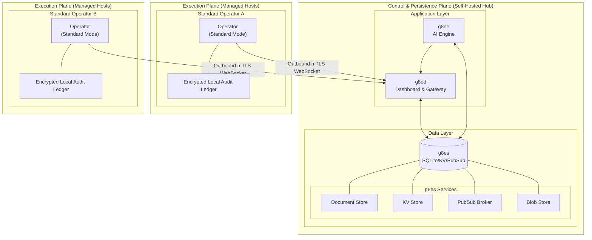

# g8e Operator Binary

The Operator (`g8e.operator`) is the language-agnostic, platform-agnostic execution binary for the g8e platform. The reference implementation is a statically compiled, self-contained Go binary — approximately **4 MB** — with no external runtime dependencies and no installation required. Deploy it on a host, run it, and the platform has a fully capable Operator. Any client that follows the g8e events protocol can act as an Operator.

What makes this remarkable is the scope of what that single binary does. Depending on how it is invoked:

- It is the **SSL certificate authority** for the entire platform — generating and signing the CA and all per-operator mTLS certificates at runtime on first start.
- It is the **entire backend storage layer** — the document store, KV store, and pub/sub broker that g8ee and g8ed depend on.
- It is the **execution environment** on every target host — running commands, editing files, and maintaining a local-first audit trail with LFAA, Sentinel, and the git Ledger.
- It is the **fleet deployment tool** — capable of streaming itself to hundreds of hosts in parallel over SSH.

No other component in the platform comes close to this scope. The AI, the web interface, and the backend services are all, at some level, orchestrating the Operator.

---

## Operating Modes

The binary has four distinct operating modes selected at launch. Each mode is mutually exclusive — only one runs per process invocation.

---

## Data Plane Architecture

The Operator is the central data plane for the entire platform. When running in `--listen` mode (g8es), it provides the persistence and messaging backbone for g8ee and g8ed. When running in Standard mode on target hosts, it maintains the authoritative system of record for all local operations.



---

### Standard Mode (default)

The primary operating mode. The Operator authenticates with the platform over HTTP, receives its session credentials and a per-operator mTLS certificate, connects to the platform pub/sub bus over WebSocket, and waits for commands from the AI.

**Startup sequence:**

1. Read environment and CLI flags
2. Resolve the working directory (`--working-dir` or process cwd at launch)
3. Load the platform CA certificate and install it as the trusted root for all subsequent TLS connections. The binary uses a **local-first** strategy — it checks well-known volume mount paths before attempting any network fetch:
   1. If `--ca-url` is **not** set, scan these paths in order: `/ssl/ca.crt`, `/g8es/ca.crt`, `/g8es/ssl/ca.crt`, `/data/ssl/ca.crt`. The first path that exists and contains a valid PEM certificate is used immediately — no network request is made. Inside the Docker network (e.g., the g8ep container), the `g8es-ssl` volume is mounted at `/g8es`, so the CA is discovered locally at `/g8es/ca.crt`.
   2. If no local file is found, fall back to an HTTPS fetch from `https://{endpoint}/ssl/ca.crt`. This uses the OS system trust store (Go's default `http.Client`) with a 15-second timeout. The response body is capped at 64 KB and validated as PEM before being accepted.
   3. If `--ca-url` **is** set, skip local discovery entirely and fetch from the provided URL with the same 15-second timeout and 64 KB response cap.
   4. If all paths fail (no local file, network unreachable, invalid PEM, non-200 response), the operator exits immediately with `ExitConfigError`.
4. Authenticate (see [Authentication](#authentication))
5. POST to `/api/auth/operator` — receive session credentials, bootstrap config, and per-operator mTLS certificate
6. Rebuild the HTTP transport with the issued mTLS client certificate — all subsequent connections use it
7. Initialize on-host storage: audit vault, scrubbed vault (AI-accessible), raw vault (local-only), and git ledger (see [On-Host Storage](#on-host-storage))
8. Connect to g8es over `wss://{endpoint}:{wss-port}` using mTLS
9. Subscribe to `cmd:{operator_id}:{operator_session_id}`
10. Send automatic heartbeat and stand by for commands

### Listen Mode (`--listen`)

Transforms the binary into the platform's entire backend. In listen mode, the Operator becomes the SSL certificate authority, the database server, the KV store, and the pub/sub broker that all other platform components depend on.

This is how g8es works — it is the Operator binary running with `--listen`, not a separate service.

**What runs in listen mode:**

- Generates the platform CA and server certificate on first start (ECDSA P-384, TLS 1.2 minimum); stored in the data volume and served to connecting operators at `GET /ssl/ca.crt`
- A SQLite-backed document store (`/db/`) — **Authenticated via `X-Internal-Auth`**
- A key-value store with TTL support (`/kv/`) — **Authenticated via `X-Internal-Auth`**
- An in-memory WebSocket pub/sub broker (`/ws/pubsub` and `POST /pubsub/publish`) — **Authenticated via `X-Internal-Auth`**
- A blob store with TTL support (`/blob/`) — stores file attachments, operator binaries (namespace `operator-binary`), and other large data. **Authenticated via `X-Internal-Auth`**
- A health check endpoint (`/health`) — Unauthenticated

**Bootstrap Secrets Management:**
In listen mode, the Operator is the authoritative generator and keeper of the platform's bootstrap secrets:
- `internal_auth_token`: Used for `X-Internal-Auth` header authentication.
- `session_encryption_key`: Used for AES-256 encryption of sensitive session fields.

These secrets are persisted in the SSL volume (`--ssl-dir`) as the authoritative source, and synchronized into the database (`settings/platform_settings` document) at startup. If a file is missing, the Operator generates a new random 32-byte hex value, writes it to the volume, and inserts it into the database. On subsequent starts, the file on disk takes precedence and the database copy is updated to match.

Two TLS servers run in parallel: one on `--wss-listen-port` (default: 443) for operator pub/sub connections, and one on `--http-listen-port` (default: 443) for internal g8ee/g8ed traffic and CA certificate distribution. Both use the same TLS configuration and handler. Graceful shutdown has a 10-second timeout — in-flight requests drain, pub/sub clients disconnect, and the database closes cleanly.

For the full storage schema and API details, see [docs/architecture/storage.md](storage.md).

### OpenClaw Mode (`--openclaw`) — Work in Progress

Connects the Operator to an OpenClaw Gateway as a standalone node host, completely independent of any g8e infrastructure. No g8ee, no g8ed, no bootstrap auth — the Operator connects directly to the Gateway via WebSocket using a shared-secret token and advertises two capabilities: `system.run` (execute a shell command, return stdout/stderr/exit code) and `system.which` (resolve binary paths on the host).

**OpenClaw integration is not yet complete.** The node host protocol is implemented and functional, but the full integration with the OpenClaw Gateway — including capability negotiation, session lifecycle, and result routing — is a work in progress. This mode is available for experimentation but should not be considered production-ready.

### Stream Mode (`stream` subcommand)

A fleet deployment utility built directly into the binary. It streams the compiled Operator binary to one or more remote Linux hosts over native SSH (pure Go `crypto/ssh` — no `ssh` binary required), injects it as a temporary file, makes it executable, registers a `trap 'rm -f "$B"' EXIT` so it self-deletes when the SSH session ends, and optionally starts it.

The binary is loaded into memory once and streamed to all target hosts concurrently. Hosts can be provided as positional arguments, via `--hosts <file>`, or piped via stdin (`--hosts -`). Duplicate entries are deduplicated silently.

Per-host JSON status events (`host`, `status`, `size_bytes`, `error`, `elapsed_ms`) are emitted to stdout. A final summary line includes aggregate totals. Human-readable progress goes to stderr.

---

## Operator Types

The `--cloud` and `--provider` flags determine the operator's type, which affects what cloud CLI tools are available and how the AI reasons about the environment.

| Type | Flags | Behavior |
|---|---|---|
| **System Operator** | `--cloud=false` | Cloud CLI tools (`aws`, `gcloud`, `az`, `gsutil`, `bq`, `cbt`, `azcopy`, `terraform`, `kubectl`, `helm`, `pulumi`, `ansible`, `eksctl`, `sam`, `cdk`) blocked before any process is spawned |
| **Cloud Operator** | `--cloud` (default) | Cloud CLI tools enabled; AI uses cloud-specific reasoning |
| **Cloud Operator for AWS** | `--cloud --provider aws` | Cloud CLI tools enabled; Zero Standing Privileges with intent-based IAM access |

Because `--cloud` defaults to `true`, every Operator starts as a Cloud Operator unless `--cloud=false` is explicitly passed.

---

## CLI Reference

### Core Flags

| Flag | Short | Default | Description |
|---|---|---|---|
| `--key` | `-k` | `$G8E_OPERATOR_API_KEY` | API key for authentication. If not set, the binary prompts interactively with echo disabled. |
| `--operator_session` | `-S` | `$G8E_OPERATOR_SESSION_ID` | Pre-authorized operator session ID (from device link auth) |
| `--device-token` | `-D` | `$G8E_DEVICE_TOKEN` | Device link token for automated and fleet deployments |
| `--endpoint` | `-e` | `$G8E_OPERATOR_ENDPOINT` | Platform endpoint — hostname or IP of the host running g8es |
| `--ca-url` | | | Override URL for hub CA certificate fetch (default: `https://{endpoint}/ssl/ca.crt`) |
| `--working-dir` | | process cwd | Working directory — all commands and storage are anchored here |
| `--wss-port` | | `443` | WSS port for pub/sub connection to g8es |
| `--http-port` | | `443` | HTTPS port for bootstrap auth via g8ed |
| `--cloud` | `-c` | `true` | Cloud Operator mode. Pass `--cloud=false` for System Operator (blocks all cloud CLI tools). |
| `--provider` | `-p` | | Cloud provider: `aws`, `gcp`, `azure`. Required for Cloud Operator for AWS. |
| `--local-storage` | `-s` | `true` | Enable on-host storage (audit vault, raw vault, scrubbed vault, ledger) |
| `--log` | `-l` | `info` | Log level: `info`, `error`, `debug` |
| `--no-git` | `-G` | `false` | Disable git-backed ledger |
| `--heartbeat-interval` | | `30s` | Override the default 30s heartbeat interval (e.g., `60s`, `2m`) |
| `--version` | `-v` | | Print version and exit |

### Listen Mode Flags

| Flag | Default | Description |
|---|---|---|
| `--listen` | | Enable listen mode |
| `--wss-listen-port` | `443` | TLS/WSS port for operator connections and pub/sub |
| `--http-listen-port` | `443` | TLS/HTTPS port for internal g8ee/g8ed traffic and CA distribution |
| `--data-dir` | `.g8e/data` in working dir | SQLite database and SSL certificate directory |
| `--ssl-dir` | `data-dir/ssl` | Directory for TLS certificates (override with --ssl-dir) |
| `--binary-dir` | `.g8e/bin` in working dir | Legacy flag — operator binaries are now served from the blob store |
| `--tls-cert` | | TLS certificate path (generated automatically if absent) |
| `--tls-key` | | TLS private key path (generated automatically if absent) |

### Vault Management Flags

| Flag | Description |
|---|---|
| `--rekey-vault` | Re-encrypt the vault DEK with a new API key (requires `--old-key`) |
| `--old-key` | Previous API key (required for `--rekey-vault`) |
| `--verify-vault` | Verify vault integrity by attempting DEK unwrap |
| `--reset-vault` | Destroy all vault data — requires typing `DESTROY` interactively to confirm |

### OpenClaw Flags

| Flag | Default | Description |
|---|---|---|
| `--openclaw` | | Enable OpenClaw node host mode |
| `--openclaw-url` | | WebSocket URL of the OpenClaw Gateway |
| `--openclaw-token` | `$OPENCLAW_GATEWAY_TOKEN` | Shared-secret auth token |
| `--openclaw-node-id` | hostname | Node ID advertised to the Gateway |
| `--openclaw-name` | node ID | Human-readable display name in OpenClaw UI |

### Stream Subcommand Flags

| Flag | Default | Description |
|---|---|---|
| `--arch` | `amd64` | Target architecture: `amd64`, `arm64`, `386` |
| `--hosts` | | File of target hosts (one per line) or `-` for stdin |
| `--concurrency` | `50` | Max parallel SSH sessions |
| `--timeout` | `60` | Per-host dial and inject timeout in seconds |
| `--endpoint` | | Platform endpoint — if set, starts the operator on each remote host after injection |
| `--device-token` | | Device link token for remote operators (`max_uses` supports fleet-scale deployment) |
| `--key` | | API key for remote operators |
| `--no-git` | | Disable ledger on remote operators |
| `--ssh-config` | `~/.ssh/config` | SSH config file path |
| `--binary-dir` | `/home/g8e` | Directory containing the operator binary (falls back to `<binary-dir>/linux-<arch>/g8e.operator` if not found directly) |

---

## Environment Variables

All environment variables are read once at startup. No code path calls `os.Getenv` outside the config loader.

| Variable | Description |
|---|---|
| `G8E_OPERATOR_API_KEY` | API key |
| `G8E_OPERATOR_SESSION_ID` | Pre-authorized operator session ID |
| `G8E_OPERATOR_ENDPOINT` | Platform endpoint |
| `G8E_DEVICE_TOKEN` | Device link token |
| `G8E_LOG_LEVEL` | Log level override (overrides default but not an explicit `--log` flag) |
| `G8E_DATA_DIR` | Override for vault and data directory |
| `G8E_IP_SERVICE` | URL for public IP detection |
| `G8E_IP_RESOLVER` | UDP target for local IP detection |
| `G8E_INTERNAL_AUTH_TOKEN` | Internal auth token for listen mode (X-Internal-Auth header) |
| `G8E_SSL_DIR` | SSL certificate directory override |
| `G8E_PUBSUB_CA_CERT` | PubSub CA certificate path override |
| `G8E_LOCAL_STORE_ENABLED` | Enable/disable local storage override |
| `G8E_LOCAL_DB_PATH` | Local database path override |
| `G8E_LOCAL_STORE_MAX_SIZE_MB` | Local storage max size override |
| `G8E_LOCAL_STORE_RETENTION_DAYS` | Local storage retention days override |
| `G8E_OPERATOR_PUBSUB_URL` | Operator pub/sub URL override |
| `OPENCLAW_GATEWAY_TOKEN` | OpenClaw Gateway auth token |
| `SHELL`, `LANG`, `TERM`, `TZ` | Passed through to command execution environment and heartbeat |
| `PATH` | Passed through to heartbeat and OpenClaw node advertisement |
| `SSH_AUTH_SOCK` | SSH agent socket (stream subcommand) |
| `USER` / `USERNAME` / `LOGNAME` | OS login name (device registration and stream auth) |

---

## Authentication

Authentication is always an HTTP exchange with the platform. It happens once at startup and produces the session credentials and mTLS certificate the Operator uses for everything thereafter.

### Methods

**API key** — Pass `--key` / `-k` or set `G8E_OPERATOR_API_KEY`. If neither is set, the binary prompts interactively with echo disabled. Sent as `Authorization: Bearer` on the bootstrap POST.

**Device link token** — Pass `--device-token` / `-D` or set `G8E_DEVICE_TOKEN`. The Operator first registers at `https://{endpoint}/auth/link/{token}/register`, sending its system fingerprint, hostname, OS, arch, and username. On success it receives a pre-authorized `operator_session_id` which is then used for the bootstrap POST. Device tokens support `max_uses` — a single token can authorize an entire fleet. Each registration claims one operator slot atomically.

**Pre-authorized session** — Pass `--operator_session` / `-S` or set `G8E_OPERATOR_SESSION_ID`. The session ID is passed directly in the bootstrap POST body with no `Authorization` header. This is the path taken automatically after a successful device link registration.

### Bootstrap POST

All auth methods converge on a single HTTP POST to `/api/auth/operator`. The platform responds with:

- `operator_session_id` — used as part of all subsequent pub/sub channel names
- `operator_id` — stable identifier for this operator slot
- Bootstrap config: `max_concurrent_tasks`, `max_memory_mb`, `heartbeat_interval_seconds`, feature flags
- `operator_cert` and `operator_cert_key` — per-operator mTLS client certificate (PEM) and private key issued by the platform CA

Once the bootstrap response is received, the Operator parses `operator_cert` + `operator_cert_key` with `tls.X509KeyPair` and rebuilds its HTTP transport with a TLS 1.3 client config that presents the per-operator certificate on every subsequent connection. If the pair fails to parse, the Operator logs a warning and continues with the embedded CA-trusted transport (no per-operator client cert). The API key is held only in process memory and never written to disk in any recoverable form. When the process exits, the key is gone.

### System Fingerprint

At startup, the Operator generates a stable system fingerprint by hashing: OS type, architecture, CPU count, machine ID, and hostname. This SHA-256 hex string identifies the host across restarts without depending on network addresses.

The machine ID is resolved in order from the most persistent source available:

1. `/etc/machine-id` — present on most Linux distributions and VMs
2. `/var/lib/dbus/machine-id` — older dbus-based systems
3. `/proc/sys/kernel/random/boot_id` — present on every Linux kernel regardless of bare metal, VM, or container environment; used when no persistent ID file exists (e.g. a minimal Docker container)

On macOS, the SystemConfiguration preferences plist is used. `boot_id` resets on container restart, so the fingerprint of a container changes across restarts — this is expected and correct, as each container instance is a distinct operator.

On first authentication, the platform permanently binds this fingerprint to the operator slot. Any subsequent connection from a different fingerprint is rejected — a stolen API key cannot be used from a different machine. See [docs/architecture/security.md](security.md) for full details.

---

## Pub/Sub Connectivity

After bootstrap, the Operator's sole connection to the platform is a WebSocket over mTLS to g8es. This is how commands arrive and results are returned.

**Channel naming:**

| Direction | Channel | Description |
|---|---|---|
| Inbound | `cmd:{operator_id}:{operator_session_id}` | g8ee publishes commands here |
| Outbound | `results:{operator_id}:{operator_session_id}` | Operator publishes results here |
| Outbound | `heartbeat:{operator_id}:{operator_session_id}` | Operator publishes heartbeats here |

On subscription, an automatic heartbeat is sent immediately. Reconnection uses exponential backoff (base 1s, max 30x) with a maximum of 3 attempts before giving up. A TLS certificate error during reconnect triggers a hard exit with code `7` rather than continued retry — the connection is never downgraded.

**Command dispatch** — all inbound messages are JSON with an `event_type` field. The operator routes on event type:

| Event Type | Action |
|---|---|
| `g8e.v1.operator.heartbeat.requested` | Send heartbeat on demand |
| `g8e.v1.operator.command.requested` | Execute a shell command |
| `g8e.v1.operator.command.cancel.requested` | Cancel an active execution by ID |
| `g8e.v1.operator.file.edit.requested` | Perform a file edit operation |
| `g8e.v1.operator.filesystem.list.requested` | List directory contents |
| `g8e.v1.operator.filesystem.read.requested` | Read file contents |
| `g8e.v1.operator.network.port.check.requested` | Check reachability of a remote host/port |
| `g8e.v1.operator.logs.fetch.requested` | Retrieve local execution logs |
| `g8e.v1.operator.history.fetch.requested` | Retrieve session history from the audit vault |
| `g8e.v1.operator.file.history.fetch.requested` | Retrieve git history for a specific file |
| `g8e.v1.operator.file.restore.requested` | Restore a file to a previous ledger state |
| `g8e.v1.operator.file.diff.fetch.requested` | Retrieve a diff between ledger snapshots |
| `g8e.v1.operator.audit.user.recorded` | Record user message to audit log |
| `g8e.v1.operator.audit.ai.recorded` | Record AI message to audit log |
| `g8e.v1.operator.audit.direct.command.recorded` | Record a direct terminal command to audit log |
| `g8e.v1.operator.audit.direct.command.result.recorded` | Record the result of a direct terminal command |
| `g8e.v1.operator.mcp.tools.call` | Call an MCP (Model Context Protocol) tool — translated to one of the inbound events above, then dispatched |
| `g8e.v1.operator.shutdown.requested` | Acknowledge shutdown |

**Note:** Only `g8e.v1.operator.mcp.tools.call` is accepted as an inbound MCP event. The related events `mcp.tools.result`, `mcp.resources.list`, `mcp.resources.read`, and `mcp.resources.result` are defined in the event constants for outbound responses (and future use) but are not dispatched by the pub/sub command handler. Similarly, `g8e.v1.operator.intent.approval.requested` is defined in the event constants but is not currently dispatched.

---

## Execution Engine

Commands run via `/bin/bash -c <command>` regardless of how they are specified, giving consistent shell behavior: variable expansion, tilde expansion, pipes, redirects, and all shell operators work as expected.

Before any command executes, Sentinel runs pre-execution threat analysis. Dangerous commands are blocked before any process is spawned — `ExecuteCommand` is never called. See [Security](#security) below and [docs/architecture/security.md](security.md) for details.

Inside the execution engine:

1. Cloud CLI gate — blocks cloud tools (`aws`, `gcloud`, `az`, `gsutil`, `bq`, `cbt`, `azcopy`, `terraform`, `kubectl`, `helm`, `pulumi`, `ansible`, `eksctl`, `sam`, `cdk`) if `--cloud=false` was set at startup
2. Concurrency semaphore acquired (max concurrent tasks from bootstrap config, default 25)
3. Timeout context created from the request's `timeout_seconds` (default 300s)
4. Process group set so the entire process tree can be killed atomically
5. `DEBIAN_FRONTEND=noninteractive`, `APT_KEY_DONT_WARN_ON_DANGEROUS_USAGE=1`, `CLOUDSDK_CORE_DISABLE_PROMPTS=1`, `CI=true`, `NONINTERACTIVE=1` injected to prevent tools from hanging on prompts
6. stdin explicitly closed so commands that attempt to read stdin get EOF immediately
7. stdout and stderr captured via streaming writers that log each complete line in real-time
8. On timeout or cancellation, `SIGKILL` sent to the entire process group
9. Result finalized: status, return code, duration, stdout, stderr, terminal output (last 50 lines), system and environment info

**Exit code semantics:**

| Code | Status |
|---|---|
| `0` | `completed` |
| `124` | `timeout` |
| `137` (SIGKILL) | `failed` (killed) |
| `126` + shell permission error in stderr | `failed` (permission_denied) |
| `127` + shell "not found" in stderr | `failed` (command_not_found) |
| Any other non-zero | `completed` (the command ran and returned a non-zero exit) |

Execution cancellation is available via `g8e.v1.operator.command.cancel.requested` — sends `SIGKILL` to the process group and marks the result as `cancelled`.

---

## Heartbeat

Heartbeats are sent on three triggers: automatically on pub/sub subscription, on schedule per the bootstrap-configured interval (default 30 seconds), and on demand in response to `g8e.v1.operator.heartbeat.requested`.

Each heartbeat payload includes:

- **Identity**: hostname, OS, architecture, working directory, current user, CPU count, memory MB
- **Network**: public IP, all network interfaces, connectivity status
- **Performance**: CPU%, memory%, disk%, network latency, memory used/total MB, disk used/total GB
- **Version**: operator version string, stability label
- **Uptime**: duration and seconds
- **Capability flags**: `local_storage_enabled`, `git_available`, `ledger_mirror_enabled`

A missed heartbeat chain (60 seconds with no heartbeat) triggers a stale status transition on the platform side.

---

## On-Host Storage

The Operator maintains four independent storage layers on the host under the working directory. These are the system of record for all operational data — raw output, session history, and file version history all live here, not in the cloud.

For full schema details, retention policies, and data flow documentation, see [docs/architecture/storage.md](storage.md).

### Storage Layout

```
{workdir}/
  .g8e/
    data/
      g8e.db        Audit Vault — append-only session history (encrypted at rest)
      ledger/           Git Ledger — cryptographic file version history
      vault.header      Vault header — metadata and wrapped DEK for encrypted vaults
    raw_vault.db        Raw Vault — unscrubbed command output (never transmitted)
    local_state.db      Scrubbed Vault — Sentinel-processed output (AI-accessible)
```

### Audit Vault

An append-only SQLite database at `.g8e/data/g8e.db`. Records every event in the session: user messages, AI messages, command executions (with stdout, stderr, exit code, duration), and file mutations. Sensitive fields are encrypted at rest using the vault DEK. 90-day retention, 2 GB max size.

The UI retrieves session history directly from this vault via the `operator.history.fetch.requested` pub/sub protocol — history lives on the host, not in a cloud database.

### Raw Vault

A SQLite database at `.g8e/raw_vault.db`. Stores the full, unmodified command output exactly as produced by the shell. This data **never leaves the host** and is never transmitted to the platform. It is the customer's unfiltered forensic record. 30-day retention, 2 GB max size.

### Scrubbed Vault

A SQLite database at `.g8e/local_state.db`. Stores command output and file diffs that have passed through Sentinel's scrubbing pipeline — credentials, PII, and secrets replaced with safe placeholders. This is the vault the AI reads from. 30-day retention, 1 GB max size.

### Ledger (git-backed file versioning)

A git repository at `.g8e/data/ledger/`. Every file the AI modifies gets a two-phase git commit: one capturing the file state before the change, one after. The resulting commit hashes are stored in the audit vault and serve as the basis for file history, diff, and restore operations. Requires a `git` binary on PATH; disabled via `--no-git` or when git is unavailable.

Anyone with access to `.g8e/data/ledger/` can run `git log` and see exactly what the AI changed and when, independently of the platform.

---

## Security

The Operator's security model is built around two principles: defense in depth, and the human is always in control. For the complete security reference, see [docs/architecture/security.md](security.md).

**At a high level, the Operator enforces:**

- **Outbound-only architecture** — the Operator opens no inbound ports. All communication is Operator-initiated: an outbound WebSocket to g8es on port 443. Works behind any NAT, firewall, or VPC without special network configuration.
- **mTLS on every connection** — both sides present certificates. The Operator will not connect to a server whose certificate isn't signed by the pinned platform CA. The server cannot be impersonated.
- **TLS kill switch** — if certificate verification fails for any reason, the Operator exits with code `7` (`ExitCertTrustFailure`). The connection is never downgraded, and the binary never retries insecurely. Resolution: install a new binary.
- **Sentinel pre-execution threat detection** — every command and file edit is analyzed against MITRE ATT&CK-mapped threat patterns before execution. Dangerous commands are blocked outright before any process is spawned. The AI cannot bypass Sentinel.
- **Sentinel post-execution output scrubbing** — before any command output reaches g8ee (and therefore any AI provider), Sentinel removes credentials, PII, API keys, and secrets. Raw output stays on the host in the Raw Vault.
- **In-memory credentials** — the API key and mTLS certificate are held only in process memory. Nothing sensitive is written to disk in recoverable form.
- **Human approval required** — every state-changing command requires explicit user consent in the UI. The AI proposes; the human decides.

---

## Deployment Script

The simplest way to deploy the operator on a remote Linux system. g8ed serves a POSIX shell script at `http://<host>/g8e` (port 80) that handles CA trust, binary download, and operator launch in a single command:

```bash
curl -fsSL http://<host>/g8e | sh -s -- <device-link-token>
```

The device link token is generated in the g8ed UI and authenticates both the binary download (as Bearer auth on the HTTPS download endpoint) and the operator session (passed as `--device-token`).

**Sequence:**
1. Script detects architecture via `uname -m` (supports `amd64`, `arm64`, `386`)
2. Fetches the platform CA certificate over plain HTTP from `/ca.crt`
3. Downloads the operator binary over HTTPS using the fetched CA for TLS verification
4. Cleans up the temp CA file, then `exec`s the operator binary

The script requires only `curl` or `wget` and a POSIX-compliant `/bin/sh`. No root access, no package installation, no persistent files beyond the operator binary itself.

See [g8ed — Operator Deployment Script](../components/g8ed.md#operator-deployment-script) for implementation details.

---

## SSH Stream Deployment

The `stream` subcommand uses pure Go `crypto/ssh` — no `ssh` binary is invoked.

**SSH config parsing** reads `HostName`, `User`, `Port`, and `IdentityFile` directives. Supports exact host matches and wildcard patterns (`*`, `?`) using OpenSSH glob semantics.

**Auth method priority**: SSH agent (via `SSH_AUTH_SOCK`) → explicit identity files from SSH config → default key paths (`~/.ssh/id_ed25519`, `~/.ssh/id_ecdsa`, `~/.ssh/id_rsa`).

**Host key verification**: uses `~/.ssh/known_hosts` when available. Falls back to accepting new host keys (equivalent to `StrictHostKeyChecking=accept-new`) when `known_hosts` is absent.

**Remote injection pattern**: a temporary file is created on the remote host, the binary is written to it via SSH stdin, it is made executable, `trap 'rm -f "$B"' EXIT` is registered, and the binary is run or left for manual startup in inject-only mode. When the SSH session ends, the temporary binary is automatically deleted.

**Copying a running operator**: an operator binary can be copied from one host to another while it is running — the binary itself has no open file locks that prevent copying. This means a savvy operator could copy a running binary to a new host using standard tools and have it operational immediately, without going through the stream deployment flow. This capability exists but is not yet integrated into the AI deployment logic.

---

## Listen Mode HTTP API

The full storage API reference is in [docs/architecture/storage.md](storage.md). Quick reference:

| Endpoint | Description |
|---|---|
| `GET /health` | Returns `{ "status": "ok", "mode": "listen", "version": "..." }` |
| `GET /ssl/ca.crt` | Platform CA certificate (fetched by connecting operators at startup) |
| `GET /db/{collection}/{id}` | Retrieve a document |
| `PUT /db/{collection}/{id}` | Create or replace a document |
| `PATCH /db/{collection}/{id}` | Merge-update a document |
| `DELETE /db/{collection}/{id}` | Delete a document |
| `POST /db/{collection}/_query` | Query documents in a collection |
| `GET /kv/{key}` | Retrieve a KV value |
| `PUT /kv/{key}` | Set a KV value with optional TTL |
| `DELETE /kv/{key}` | Delete a KV key |
| `POST /kv/_keys` | List keys matching a glob pattern |
| `POST /kv/_scan` | Paginated key scan |
| `POST /kv/_delete_pattern` | Delete all keys matching a pattern |
| `POST /pubsub/publish` | Publish a message to a named channel |
| `GET /ws/pubsub` | WebSocket upgrade for pub/sub subscription |
| `GET /blob/{ns}/{id}` | Retrieve a blob (operator binaries use namespace `operator-binary`) |
| `PUT /blob/{ns}/{id}` | Store a blob with optional TTL |
| `DELETE /blob/{ns}/{id}` | Delete a blob |
| `GET /blob/{ns}/{id}/meta` | Retrieve blob metadata |
| `DELETE /blob/{ns}` | Delete all blobs in a namespace |

---

## Working Directory

The working directory is the anchor point for everything the Operator does. It is captured at process startup before any flag parsing and can be overridden by `--working-dir`.

All storage paths are relative to it:

```
{workdir}/
  .g8e/data/          Audit vault, git ledger, and vault header
  .g8e/raw_vault.db   Raw (unscrubbed) command output
  .g8e/local_state.db Scrubbed (AI-accessible) command output
  .g8e/bin/           Legacy binary directory (operator binaries now stored in blob store)
```

Command execution also defaults to the working directory unless the request specifies a `working_directory` override.

---

## Exit Codes

| Code | Meaning |
|---|---|
| `0` | Normal exit |
| `1` | Unspecified error |
| `2` | Authentication failed (invalid/expired key, 401, deleted slot) |
| `3` | Filesystem permission error |
| `4` | Network connectivity failure (DNS, timeout, connection refused) |
| `5` | Configuration error (missing required values, invalid config) |
| `6` | Storage initialization failure (SQLite, git, disk full) |
| `7` | TLS certificate verification failed — binary must be updated |

The `g8e` host script maps these codes to human-readable error messages.

---

## Logging

Log output format:

```
{RFC3339 timestamp} {LEVEL}: {message}
  - key: value
  - key: value
```

Log levels: `info` (default), `error`, `debug`. Set via `--log`/`-l` or `G8E_LOG_LEVEL`. The environment variable overrides the default but not an explicit `--log` flag.

---

## Signal Handling

| Mode | On SIGINT / SIGTERM |
|---|---|
| **Standard** | 15-second graceful shutdown — kills active tasks, closes database connections |
| **Listen** | 10-second graceful shutdown — HTTP server drains, pub/sub clients disconnect, database closes |
| **OpenClaw** | Calls service stop then exits |
| **Stream** | Cancels context; all in-flight SSH sessions are abandoned |

---

## Version and Build Identity

Version information is injected at build time via linker flags:

- `version` — semantic version string
- `buildID` — CI build identifier
- `platform` — target platform string

`--version` / `-v` prints all three fields and exits.
