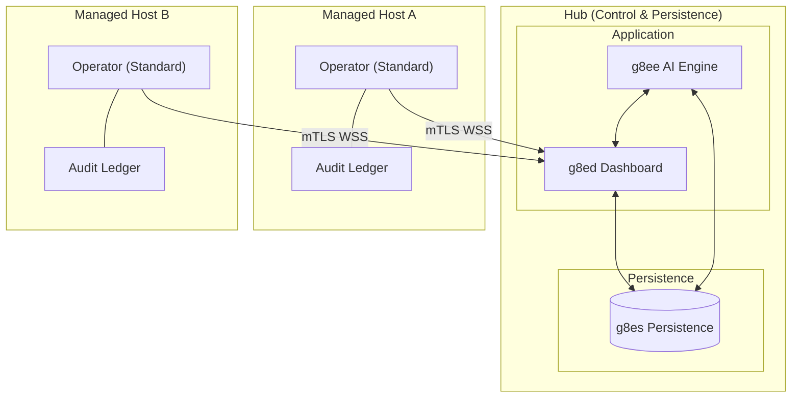

# g8e Operator

The Operator is the platform's data plane, execution engine, and persistence layer. It is implemented as a statically compiled Go binary (~4 MB) that provides the substrate for all g8e operations.

## Core Principles

- **Single Binary, Multi-Mode**: The same binary runs as the Hub (g8es), Target (Standard), and Fleet Utility (Stream).
- **Outbound-Only**: Target operators initiate all connections via mTLS; no inbound ports are required.
- **Local-First Audit**: The host is the single source of truth for command history and file mutations.
- **No Backwards Compatibility**: Stale keys or malformed data structures are rejected immediately to prevent integrity drift.

## Architecture Overview

The Operator functions as the data plane for the platform. In **Listen Mode (g8es)**, it provides persistence and messaging. In **Standard Mode**, it executes tasks on target hosts.

## Operating Modes

### 1. Standard Mode (Target)
The default mode for execution on target hosts. The operator initiates an outbound connection, authenticates, and waits for commands.

**Bootstrap Lifecycle:**
1. **Discovery**: Resolves environment and local CA certificates (checks `/ssl/ca.crt`, `/data/ssl/ca.crt`).
2. **Auth**: Authenticates via `POST /api/auth/operator` using an API key or Device Token.
3. **Upgrade**: Receives a per-operator mTLS certificate and upgrades the transport.
4. **Claim**: `g8ee` marks the pre-provisioned slot as `ACTIVE` and binds it to the current session.
5. **Steady State**: Connects to `g8es` via WSS and subscribes to `cmd:{operator_id}:{session_id}`.

### 2. Listen Mode (g8es)
Transforms the operator into the platform's persistence layer.

- **Storage**: SQLite-backed document store and TTL-aware KV store.
- **Messaging**: WebSocket-based Pub/Sub broker.
- **CA**: Acts as the platform's root Certificate Authority.
- **Blob Store**: Handles operator binary distribution and task attachments.

### 3. Stream Mode (Fleet)
A built-in utility for concurrent deployment over SSH. It streams itself into memory on remote hosts, injects a temporary binary, and optionally launches it with a `trap` for auto-cleanup.

### 4. OpenClaw Mode (WIP)
Connects to an OpenClaw Gateway as a standalone capability provider, independent of g8e Hub infrastructure.

## Operator Status & Lifecycle

The lifecycle is controlled by `g8ee` (the single writer for runtime state) and stored in `g8es`.

| Status | Meaning |
|---|---|
| `AVAILABLE` | Pre-provisioned slot ready for a new operator connection. |
| `ACTIVE` | Operator is connected, claimed by a session, and heartbeating. |
| `STALE` | Heartbeat missed for >60 seconds. |
| `OFFLINE` | Confirmed disconnection or prolonged staleness. |
| `TERMINATED` | Slot closed and reclaimed. |

**Reconciliation**: The `HeartbeatStaleMonitorService` in `g8ee` continuously monitors telemetry and triggers transitions to `STALE` or `OFFLINE`.

## Security & Invariants

### 1. Cryptographic Audit Trail (LFAA)
Every state change is recorded in an append-only `history_trail` using SHA-256 chaining:
- Each entry contains a `prev_hash` of the preceding entry.
- The `entry_hash` seals the current record's integrity.
- This ledger is stored on the host in `.g8e/data/g8e.db`.

The LFAA Audit Vault can be queried directly using SQLite for forensic analysis. See [Storage Architecture](storage.md#querying-the-lfaa-audit-vault) for raw SQL queries and the Python CLI tool reference.

### 2. System Fingerprinting
Operators generate a stable hardware fingerprint (machine-id, CPU count, OS) at startup.
- **Invariant**: Once an API key is used, it is permanently bound to that fingerprint.
- **Defense**: Stolen API keys cannot be reused on different hardware.

### 3. Sentinel Protection
- **Pre-execution**: Commands are analyzed against MITRE ATT&CK patterns before process spawn.
- **Post-execution**: Output is scrubbed of PII, credentials, and secrets before reaching the AI.

### 4. Zero Standing Privileges (ZSP)
Cloud Operators (AWS/GCP/Azure) run with minimal ambient permissions. Privileges are granted dynamically via **Intents** for specific task durations and revoked immediately upon completion.

## CLI Reference (High Level)

| Flag | Description |
|---|---|
| `-k, --key` | API key for authentication. |
| `-D, --device-token` | Token for automated fleet registration. |
| `-e, --endpoint` | Hub address (g8es/g8ed). |
| `-c, --cloud` | Enable cloud-specific tooling and AI reasoning. |
| `-p, --provider` | Specify cloud provider (aws, gcp, azure). |
| `-s, --local-storage` | Enable on-host LFAA storage. |

## Exit Codes

| Code | Meaning |
|---|---|
| `0` | Success / Graceful Shutdown |
| `2` | Auth Failure (Invalid/Expired Key) |
| `4` | Network Failure |
| `7` | **mTLS Trust Failure**: Certificate verification failed. Binary must be updated. |

---

*For detailed security specifications, see [Security Architecture](security.md).*
