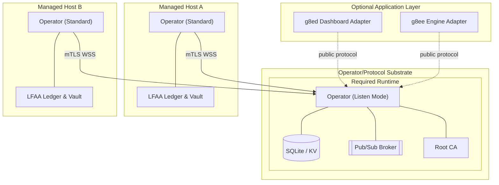

# g8e Operator

Last Updated: 2026-05-12
Version: v0.2.4

The Operator is the platform's data plane, execution engine, and persistence layer. It is a statically compiled Go binary that provides the substrate for all g8e operations, functioning as both the hub for persistence and the agent for execution.

## Core Principles

- **Single Binary, Multi-Mode**: The same binary runs as the Hub (Listen Mode), Target (Standard Mode), and Fleet Utility (Stream Mode).
- **Outbound-Only**: Target operators initiate all connections via mTLS; no inbound ports are required.
- **Local-First Audit (LFAA)**: The host is the single source of truth for command history and file mutations, stored in a tamper-evident ledger.
- **Protocol-First**: Every action is governed by serialized Protobuf `GovernanceEnvelope` bytes carrying typed `operator.proto` payloads.
- **3-Layer Governance**: Hard gates at the bedrock, consensus in the middle, and human authorization at the top.

## Architecture Overview

g8e now separates the mandatory **Operator/protocol substrate** from optional application-layer adapters. 

- **Substrate (Mandatory)**: `g8eo` in **Listen Mode** is the platform's backbone. It is the protocol hub, persistence layer, pub/sub broker, policy enforcer, and audit authority. It must be sufficient on its own to receive, verify, and execute protocol-governed transactions.
- **Application Layer (Optional)**: Optional adapters like the Dashboard (`g8ed`) and Engine (`g8ee`) consume the public Operator protocol surface. They have no substrate responsibilities and no private access channels.

## Operating Modes

### 1. Listen Mode (Hub)
Transforms the operator into the platform's backbone. It is started with the `--listen` flag.

- **Persistence**: A document-store and TTL-aware KV store backed by SQLite.
- **Messaging**: A high-performance WebSocket Pub/Sub broker for all internal and external events.
- **Identity (CA)**: Acts as the platform's root Certificate Authority, issuing mTLS certificates to components and targets.
- **Security**: Manages the platform's Encryption Vault and secret rotation.
- **Gateway**: Provides the public Operator HTTP/WSS protocol surface for bundled and BYO clients.

### 2. Standard Mode (Target)
The default mode for execution on target hosts. The operator initiates an outbound connection and waits for protocol-governed envelopes.

**Lifecycle:**
1. **Discovery**: Resolves environment and local CA certificates from `.g8e/pki`.
2. **Fingerprinting**: Generates a hardware-bound machine ID (CPU, OS, MachineID).
3. **Auth**: Authenticates via `POST /api/auth/operator` using an API key or Device Token. Device tokens are typically used for automated evaluation fleet deployment.
4. **Vault Unlock**: API key unlocks the local **Encryption Vault** to retrieve the Data Encryption Key (DEK).
5. **Upgrade**: Receives an mTLS certificate and upgrades the transport to WSS.
6. **Steady State**: Subscribes to `cmd:{operator_id}` for serialized `GovernanceEnvelope` commands.

### 3. Stream Mode (Fleet)
A utility for concurrent deployment over SSH. It streams itself into memory on remote hosts, injects a temporary binary, and manages the remote lifecycle via SSH.

### 4. OpenClaw Mode
Connects to an OpenClaw Gateway as a standalone capability provider, allowing g8e operators to be consumed by external OpenClaw-compliant orchestrators.

## Governance & Safety

The Operator enforces a 3-layer validation hierarchy for every command:

| Layer | Name | Mechanism | Role |
|---|---|---|---|
| **L1** | **Technical Bedrock** | Protobuf Reflection & `forbidden_patterns` | **Hard Gate**: Rejects `sudo`, `rm -rf /`, etc. at the protocol level. |
| **L2** | **Consensus** | Tribunal HMAC Signatures | **Verification**: Ensures the command was generated by agent consensus. |
| **L3** | **Authorization** | Human Approval / `auto_approved.json` | **Permission**: Human-in-the-loop or pre-authorized diagnostic shortcuts. |

**Invariant**: L3 (Auto-approval) **never** bypasses L1 or L2 gates. If a command matches a forbidden pattern, it is rejected even if "auto-approved."

## Local Storage & Persistence (LFAA)

When local storage is enabled (`-s`), the Operator maintains a **Local-First Audit Architecture** in the `.g8e` directory:

- **Audit Vault (`g8e.db`)**: An append-only, tamper-evident ledger. Every `CMD_EXEC` and `FILE_MUTATION` is hashed and chained to the previous entry.
- **Encryption**: Sensitive data (stdout, content) is encrypted at rest using the DEK.
- **File Ledger**: A git-backed versioning system tracks exact file mutations, allowing for cryptographic verification and point-in-time restoration.

## CLI Reference

| Flag | Description |
|---|---|
| `-k`, `--key` | API key for auth and Vault unlocking. |
| `-D`, `--device-token` | Device link token for automated registration. |
| `-e`, `--endpoint` | Hub endpoint address (IP or hostname). |
| `--listen` | Start in Listen Mode (Hub). |
| `--wss-listen-port` | Port for Pub/Sub connections (default: 443). |
| `--http-listen-port` | Port for Operator HTTP protocol traffic (default: 443). |
| `--data-dir` | Directory for persistence (default: `.g8e/data`). |
| `--pki-dir` | Directory for PKI hierarchy (default: `.g8e/pki`). |
| `--secrets-dir` | Directory for bootstrap secrets (default: `.g8e/secrets`). |
| `-s`, `--local-storage` | Enable local LFAA auditing (default: on). |
| `-G`, `--no-git` | Disable the file ledger (git-backed versioning). |

## Exit Codes

| Code | Meaning |
|---|---|
| `0` | Success / Graceful Shutdown |
| `2` | Auth Failure (Invalid/Expired Key) |
| `7` | **mTLS Trust Failure**: Certificate verification failed. |
| `10` | **Vault Error**: Failed to unlock or initialize the local audit vault. |

---

*For detailed security specifications, see [Security Architecture](security.md).*
