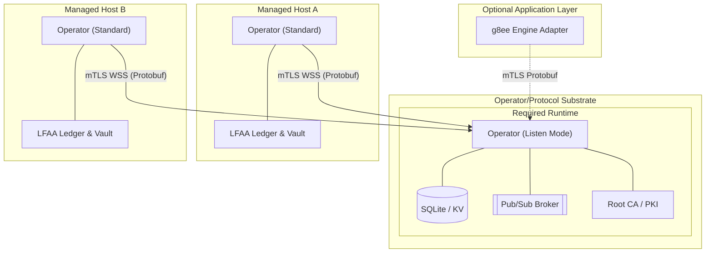

# g8e Operator

Last Updated: 2026-05-13
Version: v0.3.0

The Operator is the platform's mandatory **substrate**, data plane, execution engine, and persistence layer. It is a statically compiled Go binary that provides the core foundation for all g8e operations, functioning as both the protocol hub (Listen Mode) and the execution agent (Standard Mode).

## Core Principles

- **Single Binary, Multi-Mode**: The same binary runs as the Hub (Listen Mode), Target (Standard Mode), and Fleet Utility (Stream Mode).
- **mTLS-Everywhere**: All communication is outbound-only from the target and strictly gated by Operator-owned mutual TLS. No inbound ports are required on managed hosts.
- **Local-First Audit (LFAA)**: The host is the single source of truth for command history and file mutations, stored in a tamper-evident ledger.
- **UAP JSON-First (GovernanceEnvelope)**: Every mutation action is governed by a UAP JSON `GovernanceEnvelope`. This is the *only* canonical mutation envelope, ensuring transparency and flexibility for audit.
- **3-Layer Governance**: Hard gates at the bedrock (L1), consensus in the middle (L2), and human authorization at the top (L3).
- **Substrate vs Application**: g8e separates the mandatory Operator substrate from optional application-layer adapters (like the Engine).

## Architecture Overview

The g8e platform is built on the mandatory **Operator/protocol substrate**. 

- **Substrate (Mandatory)**: `g8eo` in **Listen Mode** is the platform's backbone. It is the protocol hub, persistence layer (SQLite), pub/sub broker, root CA, and audit authority. It is sufficient on its own to receive, verify, and execute protocol-governed transactions.
- **Application Layer (Optional)**: Optional adapters like the Engine (`g8ee`) consume the public Operator protocol surface. They have no privileged substrate responsibilities and no private access channels.

## Operating Modes

### 1. Listen Mode (Hub)
Transforms the operator into the platform's backbone. Started with the `--listen` flag.

- **Substrate Role**: Mandatory hub for all platform operations.
- **Persistence**: Document-store and TTL-aware KV store backed by SQLite.
- **Messaging**: High-performance WebSocket Pub/Sub broker using UAP JSON `GovernanceEnvelope` messages.
- **Identity (PKI)**: Acts as the platform's root Certificate Authority, issuing mTLS certificates via CSR-based enrollment.
- **Security**: Manages the platform's Encryption Vault and secret rotation.
- **Gateway**: Provides the public Operator HTTP/WSS protocol surface for all clients.

#### Four-Port Contract
Listen Mode exposes four distinct ports for different protocol surfaces:

| Port | Default | Purpose | Authentication |
|------|---------|---------|----------------|
| **WSS Port** | 9001 | Pub/Sub broker for operator connections | mTLS (operator session via URI SAN) |
| **HTTP Port** | 9000 | mTLS API for authenticated substrate operations | mTLS (operator session via URI SAN) |
| **Bootstrap Port** | 8080 | Device-link enrollment and CSR-based registration | Plain TLS (public) |
| **Public Port** | 8081 | Browser-based auth and BYO bootstrap | Plain TLS (public) |

- **mTLS Ports (WSS, HTTP)**: Require valid operator certificates with URI SAN binding to operator session IDs. Used for substrate operations and command dispatch.
- **Public Ports (Bootstrap, Public)**: Plain TLS endpoints for enrollment and browser-based flows. These are the sovereign entry points for new operators and BYO clients.

### 2. Standard Mode (Target)
The default mode for execution on target hosts. The operator initiates an outbound connection and waits for protocol-governed UAP JSON envelopes.

**Lifecycle:**
1. **Discovery**: Resolves environment and local CA certificates from `.g8e/pki` or the Hub's PKI endpoint.
2. **Fingerprinting**: Generates a hardware-bound machine ID.
3. **Enrollment**: Authenticates via `POST /api/auth/operator` using a Device Token for initial CSR signing.
4. **mTLS Upgrade**: Receives an mTLS certificate and upgrades the transport to secure WSS.
5. **Vault Unlock**: API key unlocks the local **Encryption Vault** to retrieve the Data Encryption Key (DEK).
6. **Steady State**: Subscribes to its dedicated command channel for UAP JSON `GovernanceEnvelope` mutation commands.

### 3. Stream Mode (Fleet)
A utility for concurrent deployment over SSH. It streams itself into memory on remote hosts and manages the remote lifecycle via SSH.

### 4. OpenClaw Mode
Connects to an OpenClaw Gateway as a standalone capability provider, allowing g8e operators to be consumed by external OpenClaw-compliant orchestrators.

## Governance & Safety

The Operator enforces a 3-layer validation hierarchy for every command. The **Warden** service acts as the final execution boundary.

| Layer | Name | Mechanism | Role |
|---|---|---|---|
| **L1** | **Technical Bedrock** | Protobuf Reflection & `forbidden_patterns` | **Hard Gate**: Rejects `sudo`, `rm -rf /`, etc. at the protocol level before dispatch. |
| **L2** | **Consensus** | Tribunal Signatures | **Verification**: Ensures the command was generated by agent consensus (Tribunal). |
| **L3** | **Authorization** | Human Approval (WebAuthn) | **Permission**: Human-in-the-loop sovereign authority for mutations. |

**Invariants:**
- **Fail-Closed**: If the `TransactionVerifier` or `Warden` encounters an error, the command is rejected immediately.
- **Execution Boundary**: All mutations *must* pass through the Warden. No service executes code without Warden authorization.
- **L3 never bypasses L1/L2**: Even if "auto-approved" (for diagnostic commands), L1 and L2 gates remain active.

## Local Storage & Persistence (LFAA)

When local storage is enabled (`-s`), the Operator maintains a **Local-First Audit Architecture** in the `.g8e` directory:

- **Audit Vault (`g8e.db`)**: An append-only, tamper-evident ledger. Every UAP transaction result is recorded with its associated proof.
- **Encryption**: Sensitive data is encrypted at rest using the DEK retrieved from the Encryption Vault.
- **File Ledger**: A git-backed versioning system tracks exact file mutations, allowing for cryptographic verification and point-in-time restoration.

## CLI Reference

| Flag | Description |
|---|---|
| `-k`, `--key` | API key for auth and Vault unlocking. |
| `-D`, `--device-token` | Device link token for automated registration and CSR signing. |
| `-e`, `--endpoint` | Hub endpoint address (IP or hostname). |
| `--listen` | Start in Listen Mode (Substrate Hub). |
| `--wss-listen-port` | Port for Pub/Sub connections (default: 9001). |
| `--http-listen-port` | Port for mTLS API (default: 9000). |
| `--bootstrap-listen-port` | Port for device-link enrollment (default: 8080). |
| `--public-listen-port` | Port for browser/BYO bootstrap (default: 8081). |
| `--data-dir` | Directory for persistence (default: `.g8e/data`). |
| `--pki-dir` | Directory for PKI hierarchy (default: `.g8e/pki`). |
| `--secrets-dir` | Directory for platform secrets (default: `.g8e/secrets`). |
| `-s`, `--local-storage` | Enable local LFAA auditing (default: on). |
| `-G`, `--no-git` | Disable the file ledger (git-backed versioning). |
| `--working-dir` | Anchor for all commands and storage (default: launch dir). |
| `--log` | Log level: info, error, debug (default: info). |

## Exit Codes

| Code | Meaning |
|---|---|
| `0` | Success / Graceful Shutdown |
| `2` | Auth Failure (Invalid/Expired Key) |
| `7` | **mTLS Trust Failure**: Certificate verification failed. |
| `10` | **Vault Error**: Failed to unlock or initialize the local audit vault. |

---

*For detailed security specifications, see [Security Architecture](security.md).*
