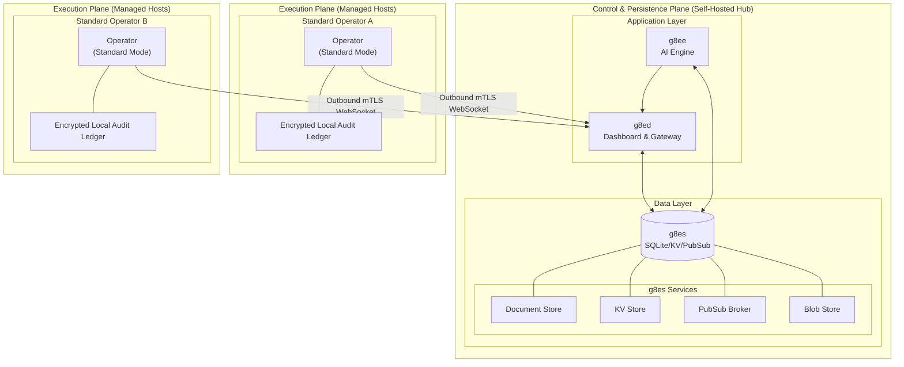

# g8e Operator

The Operator is the platform's execution and persistence layer, implemented as a statically compiled Go binary (~4 MB). It operates in four distinct modes, each serving a different role in the platform architecture.

## Why a Single Binary?

The Operator consolidates responsibilities that would typically require multiple services:

- **Execution Engine**: Runs commands, edits files, maintains local audit trails
- **Persistence Layer**: When in listen mode, provides SQLite storage, KV store, and pub/sub messaging
- **Certificate Authority**: Generates and manages platform TLS certificates
- **Fleet Deployment**: Streams itself to remote hosts over SSH

This design minimizes operational complexity — a single binary deployment provides the full platform stack.

## Architecture Overview

The Operator is the data plane for the entire platform. In listen mode (g8es), it provides persistence and messaging for g8ee and g8ed. In standard mode on target hosts, it maintains the authoritative record for all local operations.



## Operating Modes

The Operator runs in one of four mutually exclusive modes.

### Standard Mode

The default execution mode. The Operator initiates an outbound connection to the platform, authenticates, and waits for commands over WebSocket.

**Lifecycle:**

1. Load configuration from CLI flags and environment variables
2. Resolve working directory (launch directory or `--working-dir`)
3. Load platform CA certificate (local-first: checks volume mounts before HTTPS fetch)
4. Authenticate with platform via POST to `/api/auth/operator` using API key
5. Receive bootstrap config, operator ID, and per-operator mTLS certificate
6. Upgrade HTTP transport to use per-operator mTLS for all subsequent connections
7. Initialize local storage (audit vault, scrubbed vault, raw vault, git ledger)
8. Connect to g8es over WebSocket using mTLS
9. Subscribe to command channel: `cmd:{operator_id}:{operator_session_id}`
10. Send heartbeat and stand by for commands

**Key invariants:**
- Outbound-only architecture — no inbound ports required
- mTLS on every connection — both sides present certificates
- Local-first CA discovery — checks `/ssl/ca.crt`, `/g8es/ca.crt`, `/g8es/ssl/ca.crt`, `/data/ssl/ca.crt` before network fetch
- System fingerprint binding — stolen API keys cannot be used from different machines

### Listen Mode

Transforms the Operator into the platform's persistence layer (g8es). This is how the platform's backend services run — the same binary, different mode.

**What it provides:**

- Certificate authority: Generates platform CA and server certificates (ECDSA P-384, TLS 1.2+)
- Document store: SQLite-backed with REST API
- KV store: Key-value storage with TTL support
- Pub/sub broker: WebSocket-based messaging
- Blob store: File storage with TTL (operator binaries, attachments)
- Internal authentication: `X-Internal-Auth` header for service-to-service communication

**Bootstrap secrets:**
- `internal_auth_token`: Generated at first start, persisted to SSL volume
- `session_encryption_key`: AES-256 key for encrypting sensitive session fields

Secrets are stored in the SSL volume as the authoritative source and synchronized to the database at startup.

**Dual TLS servers:**
- `--wss-listen-port` (default 443): Operator pub/sub connections
- `--http-listen-port` (default 443): Internal g8ee/g8ed traffic and CA distribution

Graceful shutdown drains in-flight requests, disconnects pub/sub clients, and closes the database within 10 seconds.

### OpenClaw Mode

Connects the Operator to an OpenClaw Gateway as a standalone node host, independent of g8e infrastructure. The Operator connects via WebSocket using a shared-secret token and advertises capabilities:
- `system.run`: Execute shell commands
- `system.which`: Resolve binary paths

**Status:** Protocol implemented, but full Gateway integration (capability negotiation, session lifecycle, result routing) is a work in progress. Available for experimentation, not production-ready.

### Stream Mode

Fleet deployment utility built into the binary. Streams the Operator binary to remote Linux hosts over SSH (pure Go `crypto/ssh`, no external `ssh` binary required).

**Deployment pattern:**
1. Load binary into memory once
2. Stream concurrently to all target hosts
3. Inject as temporary file, make executable
4. Register `trap 'rm -f "$B"' EXIT` for auto-cleanup
5. Optionally start the Operator on remote host

Hosts specified via positional arguments, `--hosts <file>`, or stdin (`--hosts -`). Duplicates deduplicated silently. JSON status events to stdout, human-readable progress to stderr.

## Operator Types

The `--cloud` and `--provider` flags determine the Operator's security posture and available tooling.

| Type | Flags | Behavior |
|---|---|---|
| **System Operator** | `--cloud=false` | Cloud CLI tools blocked before process spawn |
| **Cloud Operator** | `--cloud` (default) | Cloud CLI tools enabled, cloud-specific AI reasoning |
| **Cloud Operator for AWS** | `--cloud --provider aws` | Cloud CLI enabled, Zero Standing Privileges with intent-based IAM |

Cloud CLI tools blocked for System Operators: `aws`, `gcloud`, `az`, `gsutil`, `bq`, `cbt`, `azcopy`, `terraform`, `kubectl`, `helm`, `pulumi`, `ansible`, `eksctl`, `sam`, `cdk`.

---

## Authentication

Authentication occurs once at startup via HTTP to the platform, producing session credentials and a per-operator mTLS certificate used for all subsequent connections.

### Authentication Methods

**API key**: Pass `--key` / `-k` or set `G8E_OPERATOR_API_KEY`. If unset, prompts interactively with echo disabled. Sent as `Authorization: Bearer` on the bootstrap POST.

**Device link token**: Pass `--device-token` / `-D` or set `G8E_DEVICE_TOKEN`. The Operator registers at `https://{endpoint}/auth/link/{token}/register` with system fingerprint, hostname, OS, arch, and username. On success, receives an API key and per-operator certificate directly. This key is then used for the standard bootstrap POST. Device tokens support `max_uses` for fleet-scale deployment — g8ed pre-provisions operator slots, each registration claims one atomically.

### Bootstrap Exchange

All auth methods converge on POST `/api/auth/operator` using API key authentication. The platform responds with:

- `operator_session_id`: Unique identifier for the current process session; used in all pub/sub channel names
- `operator_id`: Stable identifier for this operator slot
- Bootstrap config: `max_concurrent_tasks`, `max_memory_mb`, `heartbeat_interval_seconds`, feature flags
- `operator_cert` and `operator_cert_key`: Per-operator mTLS client certificate and private key (PEM) issued by platform CA

The Operator rebuilds its HTTP transport with TLS 1.3 presenting the per-operator certificate. The API key is held only in process memory and never written to disk.

### System Fingerprint Binding

At startup, the Operator generates a stable SHA-256 fingerprint from: OS type, architecture, CPU count, machine ID, and hostname. This identifies the host across restarts without network dependencies.

Machine ID resolution order (most persistent first):
1. `/etc/machine-id` (most Linux distributions)
2. `/var/lib/dbus/machine-id` (older dbus systems)
3. `/proc/sys/kernel/random/boot_id` (fallback for containers without persistent ID)

On macOS, uses SystemConfiguration preferences plist. `boot_id` resets on container restart — expected behavior, as each container instance is a distinct operator.

On first authentication, the platform permanently binds the fingerprint to the operator slot. Subsequent connections from different fingerprints are rejected — stolen API keys cannot be used from different machines.

### Retry Logic

Authentication uses exponential backoff: 5 attempts, base 1s delay, max 30s delay. 4xx client errors (except 429) are not retried. TLS certificate trust failures exit immediately with code 7 (non-retryable stale CA).

---

## Pub/Sub Connectivity

After bootstrap, the Operator's sole connection to the platform is a WebSocket over mTLS to g8es. Commands arrive and results are returned via this channel.

### Channel Naming

| Direction | Channel | Purpose |
|---|---|---|
| Inbound | `cmd:{operator_id}:{operator_session_id}` | g8ee publishes commands |
| Outbound | `results:{operator_id}:{operator_session_id}` | Operator publishes results |
| Outbound | `heartbeat:{operator_id}:{operator_session_id}` | Operator publishes heartbeats |

### Connection Behavior

Automatic heartbeat sent on subscription. Reconnection uses exponential backoff (base 1s, max 30x) with maximum 3 attempts before giving up. TLS certificate error during reconnect triggers hard exit with code 7 — connection is never downgraded.

### Event Dispatch

All inbound messages are JSON with an `event_type` field. The Operator routes on event type:

| Event Type | Action |
|---|---|
| `g8e.v1.operator.heartbeat.requested` | Send heartbeat on demand |
| `g8e.v1.operator.command.requested` | Execute shell command |
| `g8e.v1.operator.command.cancel.requested` | Cancel active execution by ID |
| `g8e.v1.operator.file.edit.requested` | Perform file edit operation |
| `g8e.v1.operator.filesystem.list.requested` | List directory contents |
| `g8e.v1.operator.filesystem.read.requested` | Read file contents |
| `g8e.v1.operator.network.port.check.requested` | Check reachability of remote host/port |
| `g8e.v1.operator.logs.fetch.requested` | Retrieve local execution logs |
| `g8e.v1.operator.history.fetch.requested` | Retrieve session history from audit vault |
| `g8e.v1.operator.file.history.fetch.requested` | Retrieve git history for specific file |
| `g8e.v1.operator.file.restore.requested` | Restore file to previous ledger state |
| `g8e.v1.operator.file.diff.fetch.requested` | Retrieve diff between ledger snapshots |
| `g8e.v1.operator.audit.user.recorded` | Record user message to audit log |
| `g8e.v1.operator.audit.ai.recorded` | Record AI message to audit log |
| `g8e.v1.operator.audit.direct.command.recorded` | Record direct terminal command to audit log |
| `g8e.v1.operator.audit.direct.command.result.recorded` | Record result of direct terminal command |
| `g8e.v1.operator.shutdown.requested` | Acknowledge shutdown |

**Note:** The operator command channel accepts native g8e event types directly. MCP (Model Context Protocol) is a translator-only concern at the g8ee gateway layer for external MCP-speaking clients — the core operator protocol uses native g8e events end-to-end. `g8e.v1.operator.intent.approval.requested` is defined in event constants but not currently dispatched.

---

## Execution Engine

Commands run via `/bin/bash -c <command>` for consistent shell behavior: variable expansion, tilde expansion, pipes, redirects, and all shell operators.

### Pre-Execution Security

Before any command executes, Sentinel runs pre-execution threat analysis. Dangerous commands are blocked before process spawn — `ExecuteCommand` is never called. Threat patterns mapped to MITRE ATT&CK framework: reverse shell, privilege escalation, credential access, data exfiltration, cryptomining, persistence, defense evasion, reconnaissance.

### Execution Flow

1. Cloud CLI gate — blocks cloud tools if `--cloud=false` set at startup
2. Concurrency semaphore acquired (max concurrent tasks from bootstrap config, default 25)
3. Timeout context created from request's `timeout_seconds` (default 300s)
4. Process group set for atomic process tree termination
5. Non-interactive environment variables injected: `DEBIAN_FRONTEND=noninteractive`, `APT_KEY_DONT_WARN_ON_DANGEROUS_USAGE=1`, `CLOUDSDK_CORE_DISABLE_PROMPTS=1`, `CI=true`, `NONINTERACTIVE=1`
6. Stdin explicitly closed (commands attempting to read stdin get EOF immediately)
7. Stdout and stderr captured via streaming writers logging each complete line in real-time
8. On timeout or cancellation, `SIGKILL` sent to entire process group
9. Result finalized: status, return code, duration, stdout, stderr, terminal output (last 50 lines), system and environment info

### Exit Code Semantics

| Code | Status |
|---|---|
| `0` | `completed` |
| `124` | `timeout` |
| `137` (SIGKILL) | `failed` (killed) |
| `126` + shell permission error in stderr | `failed` (permission_denied) |
| `127` + shell "not found" in stderr | `failed` (command_not_found) |
| Any other non-zero | `completed` (command ran and returned non-zero exit) |

Execution cancellation available via `g8e.v1.operator.command.cancel.requested` — sends `SIGKILL` to process group and marks result as `cancelled`.

---

## Heartbeat

Heartbeats sent on three triggers: automatically on pub/sub subscription, on schedule per bootstrap-configured interval (default 30 seconds), and on demand in response to `g8e.v1.operator.heartbeat.requested`.

**Heartbeat payload includes:**
- Identity: hostname, OS, architecture, working directory, current user, CPU count, memory MB
- Network: public IP, all network interfaces, connectivity status
- Performance: CPU%, memory%, disk%, network latency, memory used/total MB, disk used/total GB
- Version: operator version string, stability label
- Uptime: duration and seconds
- Capability flags: `local_storage_enabled`, `git_available`, `ledger_mirror_enabled`

A missed heartbeat chain (60 seconds with no heartbeat) triggers stale status transition on the platform side.

---

## Local-First Audit Architecture (LFAA)

The Operator maintains four independent storage layers on the host under the working directory. These are the system of record for all operational data — raw output, session history, and file version history all live here, not in the cloud.

### Storage Layout

```
{workdir}/
  .g8e/
    data/
      g8e.db        Audit Vault — append-only session history (encrypted at rest)
      ledger/           Git Ledger — cryptographic file version history
      vault.header      Vault header — metadata and wrapped DEK for encrypted vaults
    raw_vault.db        Raw Vault — unscrubbed command output (never transmitted)
    local_state.db      Scrubbed Vault — Sentinel-processed output (AI-accessible)
```

### Audit Vault

Append-only SQLite database at `.g8e/data/g8e.db`. Records every event in the session: user messages, AI messages, command executions (with stdout, stderr, exit code, duration), and file mutations. Sensitive fields encrypted at rest using vault DEK. 90-day retention, 2 GB max size.

The UI retrieves session history directly from this vault via the `operator.history.fetch.requested` pub/sub protocol — history lives on the host, not in a cloud database.

### Raw Vault

SQLite database at `.g8e/raw_vault.db`. Stores full, unmodified command output exactly as produced by the shell. This data never leaves the host and is never transmitted to the platform. It is the customer's unfiltered forensic record. 30-day retention, 2 GB max size.

### Scrubbed Vault

SQLite database at `.g8e/local_state.db`. Stores command output and file diffs that have passed through Sentinel's scrubbing pipeline — credentials, PII, and secrets replaced with safe placeholders. This is the vault the AI reads from. 30-day retention, 1 GB max size.

### Ledger (Git-Backed File Versioning)

Git repository at `.g8e/data/ledger/`. Every file the AI modifies gets a two-phase git commit: one capturing the file state before the change, one after. The resulting commit hashes are stored in the audit vault and serve as the basis for file history, diff, and restore operations. Requires a `git` binary on PATH; disabled via `--no-git` or when git is unavailable.

Anyone with access to `.g8e/data/ledger/` can run `git log` and see exactly what the AI changed and when, independently of the platform.

---

## Security

The Operator's security model is built around two principles: defense in depth, and the human is always in control. For the complete security reference, see [docs/architecture/security.md](security.md).

**At a high level, the Operator enforces:**

- **Outbound-only architecture** — the Operator opens no inbound ports. All communication is Operator-initiated: an outbound WebSocket to g8es on port 443. Works behind any NAT, firewall, or VPC without special network configuration.
- **mTLS on every connection** — both sides present certificates. The Operator will not connect to a server whose certificate isn't signed by the pinned platform CA. The server cannot be impersonated.
- **TLS kill switch** — if certificate verification fails for any reason, the Operator exits with code `7` (`ExitCertTrustFailure`). The connection is never downgraded, and the binary never retries insecurely. Resolution: install a new binary.
- **Sentinel pre-execution threat detection** — every command and file edit is analyzed against MITRE ATT&CK-mapped threat patterns before execution. Dangerous commands are blocked outright before any process is spawned. The AI cannot bypass Sentinel.
- **Sentinel post-execution output scrubbing** — before any command output reaches g8ee (and therefore any AI provider), Sentinel removes credentials, PII, API keys, and secrets. Raw output stays on the host in the Raw Vault.
- **In-memory credentials** — the API key and mTLS certificate are held only in process memory. Nothing sensitive is written to disk in recoverable form.
- **Human approval required** — every state-changing command requires explicit user consent in the UI. The AI proposes; the human decides.

---

## CLI Reference

### Core Flags

| Flag | Short | Default | Description |
|---|---|---|---|
| `--key` | `-k` | `$G8E_OPERATOR_API_KEY` | API key for authentication. Prompts interactively if unset. |
| `--device-token` | `-D` | `$G8E_DEVICE_TOKEN` | Device link token for automated and fleet deployments |
| `--endpoint` | `-e` | `$G8E_OPERATOR_ENDPOINT` | Platform endpoint — hostname or IP of host running g8es |
| `--ca-url` | | | Override URL for hub CA certificate fetch (default: `http://{endpoint}/ca.crt`) |
| `--working-dir` | | process cwd | Working directory — all commands and storage anchored here |
| `--wss-port` | | `443` | WSS port for pub/sub connection to g8es |
| `--http-port` | | `443` | HTTPS port for bootstrap auth via g8ed |
| `--cloud` | `-c` | `true` | Cloud Operator mode. Pass `--cloud=false` for System Operator. |
| `--provider` | `-p` | | Cloud provider: `aws`, `gcp`, `azure`. |
| `--local-storage` | `-s` | `true` | Enable on-host storage (audit vault, raw vault, scrubbed vault, ledger) |
| `--log` | `-l` | `info` | Log level: `info`, `error`, `debug` |
| `--no-git` | `-G` | `false` | Disable git-backed ledger |
| `--heartbeat-interval` | | `30s` | Override default 30s heartbeat interval (e.g., `60s`, `2m`) |
| `--version` | `-v` | | Print version and exit |

### Listen Mode Flags

| Flag | Default | Description |
|---|---|---|
| `--listen` | | Enable listen mode |
| `--wss-listen-port` | `443` | TLS/WSS port for operator connections and pub/sub |
| `--http-listen-port` | `443` | TLS/HTTPS port for internal g8ee/g8ed traffic and CA distribution |
| `--data-dir` | `.g8e/data` in working dir | SQLite database and SSL certificate directory |
| `--ssl-dir` | `data-dir/ssl` | Directory for TLS certificates |
| `--tls-cert` | | TLS certificate path (auto-generated if absent) |
| `--tls-key` | | TLS private key path (auto-generated if absent) |

### Vault Management Flags

| Flag | Description |
|---|---|
| `--rekey-vault` | Re-encrypt vault DEK with new API key (requires `--old-key`) |
| `--old-key` | Previous API key (required for `--rekey-vault`) |
| `--verify-vault` | Verify vault integrity by attempting DEK unwrap |
| `--reset-vault` | Destroy all vault data — requires typing `DESTROY` interactively |

### OpenClaw Flags

| Flag | Default | Description |
|---|---|---|
| `--openclaw` | | Enable OpenClaw node host mode |
| `--openclaw-url` | | WebSocket URL of the OpenClaw Gateway |
| `--openclaw-token` | `$OPENCLAW_GATEWAY_TOKEN` | Shared-secret auth token |
| `--openclaw-node-id` | hostname | Node ID advertised to the Gateway |
| `--openclaw-name` | node ID | Human-readable display name in OpenClaw UI |

### Stream Subcommand Flags

| Flag | Default | Description |
|---|---|---|
| `--arch` | `amd64` | Target architecture: `amd64`, `arm64`, `386` |
| `--hosts` | | File of target hosts (one per line) or `-` for stdin |
| `--concurrency` | `50` | Max parallel SSH sessions |
| `--timeout` | `60` | Per-host dial and inject timeout in seconds |
| `--endpoint` | | Platform endpoint — starts operator on remote host after injection |
| `--device-token` | | Device link token for remote operators |
| `--key` | | API key for remote operators |
| `--no-git` | | Disable ledger on remote operators |
| `--ssh-config` | `~/.ssh/config` | SSH config file path |
| `--binary-dir` | `/home/g8e` | Directory containing operator binary |

### Environment Variables

All environment variables read once at startup.

| Variable | Description |
|---|---|
| `G8E_OPERATOR_API_KEY` | API key |
| `G8E_OPERATOR_ENDPOINT` | Platform endpoint |
| `G8E_DEVICE_TOKEN` | Device link token |
| `G8E_LOG_LEVEL` | Log level override (overrides default but not explicit `--log` flag) |
| `G8E_DATA_DIR` | Override for vault and data directory |
| `G8E_IP_SERVICE` | URL for public IP detection |
| `G8E_IP_RESOLVER` | UDP target for local IP detection |
| `G8E_INTERNAL_AUTH_TOKEN` | Internal auth token for listen mode |
| `G8E_SSL_DIR` | SSL certificate directory override |
| `G8E_PUBSUB_CA_CERT` | PubSub CA certificate path override |
| `G8E_LOCAL_STORE_ENABLED` | Enable/disable local storage override |
| `G8E_LOCAL_DB_PATH` | Local database path override |
| `G8E_LOCAL_STORE_MAX_SIZE_MB` | Local storage max size override |
| `G8E_LOCAL_STORE_RETENTION_DAYS` | Local storage retention days override |
| `G8E_OPERATOR_PUBSUB_URL` | Operator pub/sub URL override |
| `OPENCLAW_GATEWAY_TOKEN` | OpenClaw Gateway auth token |
| `SHELL`, `LANG`, `TERM`, `TZ` | Passed through to command execution environment and heartbeat |
| `PATH` | Passed through to heartbeat and OpenClaw node advertisement |
| `SSH_AUTH_SOCK` | SSH agent socket (stream subcommand) |
| `USER` / `USERNAME` / `LOGNAME` | OS login name (device registration and stream auth) |

---

## Deployment

### Deployment Script

The simplest way to deploy the operator on a remote Linux system. g8ed serves a POSIX shell script at `http://<host>/g8e` (port 80) that handles CA trust, binary download, and operator launch in a single command:

```bash
curl -fsSL http://<host>/g8e | sh -s -- <device-link-token>
```

The device link token authenticates both the binary download (Bearer auth on HTTPS download endpoint) and the operator session (passed as `--device-token`).

**Sequence:**
1. Script detects architecture via `uname -m` (supports `amd64`, `arm64`, `386`)
2. Fetches platform CA certificate over plain HTTP from `/ca.crt`
3. Downloads operator binary over HTTPS using fetched CA for TLS verification
4. Cleans up temp CA file, then `exec`s the operator binary

Requires only `curl` or `wget` and POSIX-compliant `/bin/sh`. No root access, no package installation, no persistent files beyond the operator binary.

### SSH Stream Deployment

The `stream` subcommand uses pure Go `crypto/ssh` — no `ssh` binary invoked.

**SSH config parsing** reads `HostName`, `User`, `Port`, and `IdentityFile` directives. Supports exact host matches and wildcard patterns (`*`, `?`) using OpenSSH glob semantics.

**Auth method priority**: SSH agent (via `SSH_AUTH_SOCK`) → explicit identity files from SSH config → default key paths (`~/.ssh/id_ed25519`, `~/.ssh/id_ecdsa`, `~/.ssh/id_rsa`).

**Host key verification**: uses `~/.ssh/known_hosts` when available. Falls back to accepting new host keys (equivalent to `StrictHostKeyChecking=accept-new`) when `known_hosts` is absent.

**Remote injection pattern**: temporary file created on remote host, binary written via SSH stdin, made executable, `trap 'rm -f "$B"' EXIT` registered, binary run or left for manual startup in inject-only mode. When SSH session ends, temporary binary automatically deleted.

**Copying a running operator**: operator binary can be copied from one host to another while running — binary has no open file locks preventing copying. This capability exists but is not integrated into AI deployment logic.

---

## Listen Mode HTTP API

Full storage API reference in [docs/architecture/storage.md](storage.md). Quick reference:

| Endpoint | Description |
|---|---|
| `GET /health` | Returns `{ "status": "ok", "mode": "listen", "version": "..." }` |
| `GET /ssl/ca.crt` | Platform CA certificate (fetched by connecting operators at startup) |
| `GET /db/{collection}/{id}` | Retrieve a document |
| `PUT /db/{collection}/{id}` | Create or replace a document |
| `PATCH /db/{collection}/{id}` | Merge-update a document |
| `DELETE /db/{collection}/{id}` | Delete a document |
| `POST /db/{collection}/_query` | Query documents in a collection |
| `GET /kv/{key}` | Retrieve a KV value |
| `PUT /kv/{key}` | Set a KV value with optional TTL |
| `DELETE /kv/{key}` | Delete a KV key |
| `POST /kv/_keys` | List keys matching a glob pattern |
| `POST /kv/_scan` | Paginated key scan |
| `POST /kv/_delete_pattern` | Delete all keys matching a pattern |
| `POST /pubsub/publish` | Publish a message to a named channel |
| `GET /ws/pubsub` | WebSocket upgrade for pub/sub subscription |
| `GET /blob/{ns}/{id}` | Retrieve a blob (operator binaries use namespace `operator-binary`) |
| `PUT /blob/{ns}/{id}` | Store a blob with optional TTL |
| `DELETE /blob/{ns}/{id}` | Delete a blob |
| `GET /blob/{ns}/{id}/meta` | Retrieve blob metadata |
| `DELETE /blob/{ns}` | Delete all blobs in a namespace |

All endpoints except `/health` require `X-Internal-Auth` header authentication.

---

## Working Directory

The working directory is the anchor point for everything the Operator does. Captured at process startup before flag parsing, can be overridden by `--working-dir`.

All storage paths relative to it:

```
{workdir}/
  .g8e/data/          Audit vault, git ledger, and vault header
  .g8e/raw_vault.db   Raw (unscrubbed) command output
  .g8e/local_state.db Scrubbed (AI-accessible) command output
  .g8e/bin/           Legacy binary directory (operator binaries now in blob store)
```

Command execution defaults to working directory unless request specifies `working_directory` override.

---

## Exit Codes

| Code | Meaning |
|---|---|
| `0` | Normal exit |
| `1` | Unspecified error |
| `2` | Authentication failed (invalid/expired key, 401, deleted slot) |
| `3` | Filesystem permission error |
| `4` | Network connectivity failure (DNS, timeout, connection refused) |
| `5` | Configuration error (missing required values, invalid config) |
| `6` | Storage initialization failure (SQLite, git, disk full) |
| `7` | TLS certificate verification failed — binary must be updated |

The `g8e` host script maps these codes to human-readable error messages.

---

## Logging

Log output format:

```
{RFC3339 timestamp} {LEVEL}: {message}
  - key: value
  - key: value
```

Log levels: `info` (default), `error`, `debug`. Set via `--log`/`-l` or `G8E_LOG_LEVEL`. Environment variable overrides default but not explicit `--log` flag.

---

## Signal Handling

| Mode | On SIGINT / SIGTERM |
|---|---|
| **Standard** | 15-second graceful shutdown — kills active tasks, closes database connections |
| **Listen** | 10-second graceful shutdown — drains requests, disconnects pub/sub clients, closes database |
| **OpenClaw** | Immediate shutdown with cleanup |
