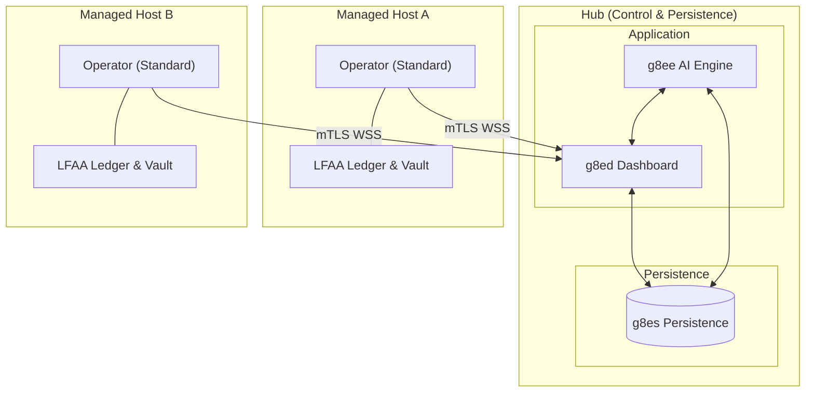

# g8e Operator

Last Updated: 5-6-2026
Version: v.0.2.0

The Operator is the platform's data plane, execution engine, and persistence layer. It is implemented as a statically compiled Go binary (~4 MB) that provides the substrate for all g8e operations.

## Core Principles

- **Single Binary, Multi-Mode**: The same binary runs as the Hub (g8es), Target (Standard), and Fleet Utility (Stream).
- **Outbound-Only**: Target operators initiate all connections via mTLS; no inbound ports are required.
- **Local-First Audit (LFAA)**: The host is the single source of truth for command history and file mutations, stored in a tamper-evident ledger.
- **Zero Trust execution**: Every command and file edit is analyzed by the Sentinel before execution.
- **No Backwards Compatibility**: Stale keys or malformed data structures are rejected immediately to prevent integrity drift.

## Architecture Overview

The Operator functions as the data plane for the platform. In **Listen Mode (g8es)**, it provides persistence, messaging, and CA services. In **Standard Mode**, it executes tasks on target hosts while maintaining local audit logs.

## Operating Modes

### 1. Standard Mode (Target)
The default mode for execution on target hosts. The operator initiates an outbound connection, authenticates, and waits for commands.

**Bootstrap Lifecycle:**
1. **Discovery**: Resolves environment and local CA certificates (checks `/ssl/ca.crt`, `/data/ssl/ca.crt`).
2. **Fingerprinting**: Generates a hardware-bound machine ID (CPU, OS, MachineID).
3. **Auth**: Authenticates via `POST /api/auth/operator` using an API key or Device Token.
4. **Vault Unlock**: If local storage is enabled, the API key is used to unlock the **Encryption Vault** and retrieve the Data Encryption Key (DEK).
5. **Upgrade**: Receives a per-operator mTLS certificate and upgrades the transport.
6. **Claim**: `g8ee` marks the pre-provisioned slot as `ACTIVE` and binds it to the current session.
7. **Steady State**: Connects to `g8es` via WSS and subscribes to `cmd:{operator_id}:{session_id}`.

### 2. Listen Mode (g8es)
Transforms the operator into the platform's persistence layer.

- **Storage**: SQLite-backed document store and TTL-aware KV store.
- **Messaging**: WebSocket-based Pub/Sub broker.
- **CA**: Acts as the platform's root Certificate Authority.
- **Secret Manager**: Manages platform-level encrypted secrets.

### 3. Stream Mode (Fleet)
A utility for concurrent deployment over SSH. It streams itself into memory on remote hosts, injects a temporary binary, and manages the remote lifecycle via SSH.

### 4. OpenClaw Mode
Connects to an OpenClaw Gateway as a standalone capability provider, allowing g8e operators to be consumed by external OpenClaw-compliant orchestrators.

## Local Storage & Persistence

The Operator maintains two distinct local SQLite databases on target hosts:

### 1. LFAA Audit Vault (`g8e.db`)
An append-only, tamper-evident ledger of every action.
- **Events**: Records `USER_MSG`, `AI_MSG`, `CMD_EXEC`, and `FILE_MUTATION`.
- **Encryption**: Sensitive fields (`content_text`, `stdout`, `stderr`) are encrypted at rest using the DEK from the Vault.
- **File Ledger**: Uses a git-backed version control system to track exact file mutations and generate diffs.
- **Chaining**: Each event contains a SHA-256 hash of the previous entry, creating a cryptographic audit trail.

### 2. Local State (`local_state.db`)
Used for operational metadata and caching.
- **Execution Records**: Stores command execution results, exit codes, and durations.
- **File Diffs**: Stores Sentinel-scrubbed versions of file mutations for quick retrieval.
- **Pruning**: Automatically managed based on `RetentionDays` and `MaxDBSizeMB`.

## Operator Status & Lifecycle

The lifecycle is orchestrated by `g8ee` and stored in `g8es`.

| Status | Meaning |
|---|---|
| `AVAILABLE` | Pre-provisioned slot ready for a new operator connection. |
| `ACTIVE` | Operator is connected and heartbeating. |
| `STALE` | Heartbeat missed for >60 seconds. |
| `OFFLINE` | Confirmed disconnection or prolonged staleness. |
| `TERMINATED` | Slot closed and reclaimed. |

**Reconciliation**: The `HeartbeatStaleMonitor` in `g8ee` continuously monitors telemetry and triggers state transitions.

## Security & Invariants

### 1. Sentinel Protection
- **Pre-execution**: Commands and file edits are analyzed against MITRE ATT&CK patterns (e.g., Reverse Shell, Privilege Escalation) before execution.
- **Post-execution**: Output is scrubbed of PII and credentials before transmission.

### 2. Cryptographic Binding
- **Fingerprint Invariant**: Once an API key is used, it is permanently bound to the hardware fingerprint.
- **Vault Invariant**: The local encryption vault can only be unlocked by the original API key that initialized it.

### 3. Zero Standing Privileges (ZSP)
Cloud Operators run with minimal ambient permissions. Privileges are granted dynamically via **Intents** for specific task durations and revoked immediately.

## CLI Reference

| Flag | Description |
|---|---|
| `-k` | API key for authentication and Vault unlocking. |
| `-D` | Device link token for automated registration. |
| `-e` | Hub endpoint address. |
| `-s` | Enable local LFAA storage and auditing. |
| `--listen` | Start in Listen Mode (g8es). |
| `--cloud` | Enable cloud provider specific integrations. |

## Exit Codes

| Code | Meaning |
|---|---|
| `0` | Success / Graceful Shutdown |
| `2` | Auth Failure (Invalid/Expired Key) |
| `7` | **mTLS Trust Failure**: Certificate verification failed. |
| `10` | **Vault Error**: Failed to unlock or initialize the local audit vault. |

---

*For detailed security specifications, see [Security Architecture](security.md).*
