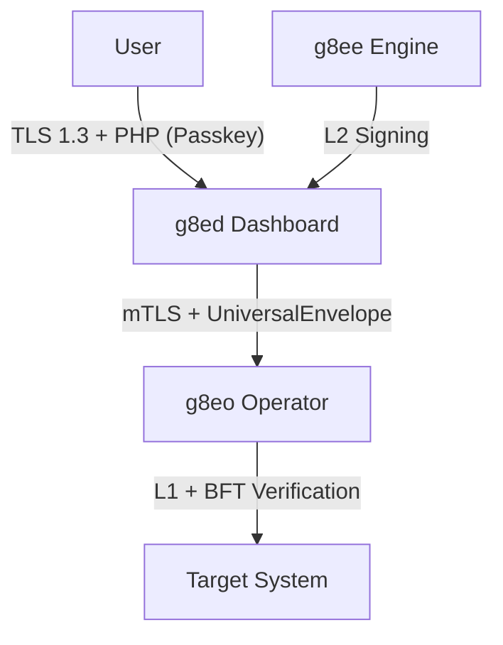

# Security Architecture

Last Updated: 2026-05-10
Version: v0.2.2

g8e is a local-only, air-gapped platform designed for high-stakes environments. Security is not an "add-on" but the core constraint: the platform assumes the AI control plane is potentially adversarial or error-prone and enforces safety at the infrastructure level through a 3-layer governance hierarchy and a Protobuf-first architecture.

## Bedrock Principles

1.  **Proof of Human Presence (PHP)**: The AI proposes; the human signs. No state-changing operation executes without an explicit, hardware-bound signature (Passkey) appended to the transaction envelope.
2.  **Zero Trust & Protocol-First**: No component or connection is implicitly trusted. Every request is carried by a `UniversalEnvelope` that binds identity, context, and cryptographic governance evidence.
3.  **Local-First Sovereignty**: Sensitive data stays on the Operator host. The Operator (`g8eo`) is the final arbiter of execution, enforcing hard gates before any command hits the shell.
4.  **Fail-Closed Invariants**: Malformed envelopes, invalid signatures, or stale state roots result in immediate rejection. The system never "fails open" to a default-allow state.

## Technical Positioning

-   **vs. SSH**: SSH is a secure pipe; g8e is a **governor**. g8e uses the pipe to enforce a governance model (scrubbing, consensus) that SSH cannot.
-   **vs. Teleport / Boundary**: These manage **human** access. g8e manages **AI-powered automation** acting on behalf of humans.
-   **vs. Ansible / Terraform**: These are deterministic. g8e is for **non-deterministic** investigation where the AI reasons about real-time state before proposing actions.

## 3-Layer Governance Hierarchy

Every transaction must pass through three distinct governance layers before execution.

### L1: Technical Bedrock (Hard Gates)
L1 provides hardcoded, non-negotiable safety invariants enforced at the Operator (`g8eo`) boundary.
-   **Forbidden Patterns**: Global rejection of dangerous shell patterns (e.g., `sudo`, `su`, `rm -rf /`).
-   **Protobuf Reflection**: `g8eo` uses reflection over the `forbidden_patterns` custom option in `operator.proto` to validate typed payloads before dispatch.
-   **Allowlist/Denylist**: Configurable filters for binary names and substrings.

### L2: Consensus (The Tribunal)
The Tribunal converts intent into executable commands using an ensemble of five independent agents.
-   **Tribunal Signature**: `g8ee` signs the `event_type` and `payload_bytes` with the `auditor_hmac_key`.
-   **Verification**: `g8eo` rejects any command with a missing or invalid L2 signature when L2 verification is enabled.
-   **Reputation Staking**: Agent performance is tracked and bound to the Merkle-signed reputation scoreboard.

### L3: Authorization (PHP Gate)
L3 involves human authorization, governed by the **Auditor-User Partition**.
-   **Proof of Human Presence (PHP)**: Hardware-bound Passkey signatures for the audited command.
-   **Auto-Approval**: Benign diagnostic commands (e.g., `uptime`, `df`) can be auto-approved, but only *after* passing L1 and L2. Auto-approval **NEVER** bypasses hard gates.

## The Universal Envelope (v0.2.0)

The `UniversalEnvelope` is the canonical BFT transaction container for all cross-component communication.

| Field | Purpose |
|---|---|
| `id` | Unique UUID v4 for tracking and correlation. |
| `state_merkle_root` | Binds the command to a specific fleet state; `g8eo` rejects commands based on stale state. |
| `governance` | Carries L1 status, L2 Tribunal signatures, and L3 Human signatures. |
| `payload` | Serialized bytes of the typed Protobuf message (e.g., `CommandRequested`). |
| `identity` | Binds the `operator_id`, `session_id`, `case_id`, and `task_id`. |

## Platform Architecture

### 1. Component Boundaries
-   **g8ed (Dashboard)**: The Governance Gateway. Handles user auth (Passkeys), session management, and UI.
-   **g8ee (Engine)**: The Reasoning Plane. Orchestrates the Tribunal, signs L2 commitments, and builds envelopes.
-   **g8eo (Operator)**: The Execution Plane. Runs on the target host, enforces L1/BFT gates, and scrubs output.

### 2. Secrets & Bootstrap
Authoritative secrets are generated on first boot and stored in `/home/bob/g8e/.g8e/ssl`:
-   `internal_auth_token`: For component-to-component authentication.
-   `auditor_hmac_key`: For L2 Tribunal signature generation and verification.
-   `session_encryption_key`: For AES-256 encryption of sensitive session fields.

Tamper evidence is provided by `bootstrap_digest.json`, which contains SHA-256 hashes of all secrets. Services abort startup if on-disk secrets drift from the manifest.

## Sovereignty & Audit

### Encrypted Audit Vault
Every action is recorded in an encrypted SQLite database on the Operator host. Sensitive fields (stdout/stderr) are encrypted at rest using **AES-256-GCM**.

### Git Ledger
Every file mutation is mirrored into a hidden `.g8e/ledger` Git repository. This provides a verifiable, diffable history of all AI-driven edits, enabling full rollbacks.

### Output Scrubbing (Sentinel)
`g8eo` scrubs terminal output for credentials, PII, and tokens before it leaves the host. Only "scrubbed" metadata is returned to the Engine and Dashboard.

## Network Security

-   **mTLS Everywhere**: All component communication is secured via TLS 1.3 with mutual authentication.
-   **Private CA**: `g8e` operates its own internal CA (ECDSA P-384) for issuing short-lived certificates.
-   **Outbound-Only**: Operators initiate connections to the gateway; they do not listen on inbound ports (unless in `--listen` mode for local dev).
-   **Air-Gapped**: Zero external connectivity required. No phone-home or cloud dependencies.

