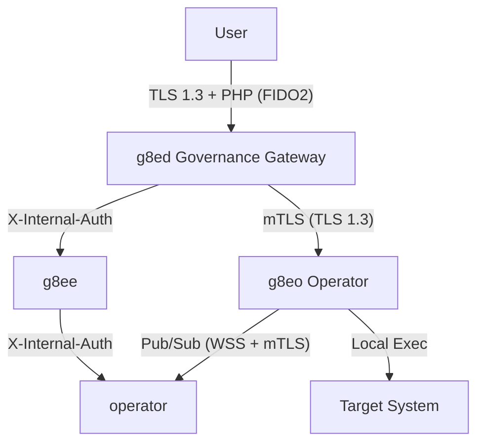

# Security Architecture

Last Updated: 2026-05-10
Version: v0.2.2

g8e is a local-only, air-gapped platform designed for high-stakes environments. Security is not an "add-on" but the core constraint: the platform assumes the AI control plane is potentially adversarial or error-prone and enforces safety at the infrastructure level.

## Bedrock Principles

1.  **Proof of Human Presence (PHP)**: The AI proposes; the human signs. No state-changing operation executes without an explicit, hardware-bound signature appended to the transaction envelope.
2.  **Zero Trust**: No component or connection is implicitly trusted. Every request is authenticated, every payload validated, and every data stream scrubbed.
3.  **Local-First Sovereignty**: Sensitive data stays on the Operator host. Only scrubbed metadata crosses component boundaries.
4.  **Defense in Depth**: Multiple overlapping layers (Sentinel, Tribunal, mTLS, LFAA) ensure that a failure in one control does not compromise the system.

---

## Technical Positioning

- **vs. SSH**: SSH is a secure pipe; g8e is a **governor**. g8e uses the pipe to enforce a governance model (scrubbing, consensus) that SSH cannot.
- **vs. Teleport / Boundary**: These manage **human** access. g8e manages **AI-powered automation** acting on behalf of humans.
- **vs. Ansible / Terraform**: These are deterministic. g8e is for **non-deterministic** investigation where the AI reasons about real-time state before proposing actions.

---

## Platform Flow & Boundaries

### 1. User to Gateway (g8ed)
- **Proof of Human Presence (PHP)**: FIDO2/WebAuthn hardware-bound signatures. No passwords.
- **Sessions**: `HttpOnly`, `Secure`, `SameSite=Lax` cookies. Session state stored in `operator` KV.
- **Context Binding**: Sessions are tied to IP and User-Agent; 4+ IP changes trigger a security flag.

### 2. Internal Services (g8ed, g8ee, Operator)
- **Shared Secret**: Authenticated via `X-Internal-Auth` using `internal_auth_token`.
- **Isolation**: Services communicate via localhost HTTPS; only the gateway (443) is exposed to the host.

### 3. Gateway to Operator (g8eo)
- **mTLS**: Every Operator presents a per-device client certificate issued during bootstrap.
- **Outbound-Only**: Operators initiate connections to the gateway; they open no inbound ports.
- **Fingerprinting**: Operators are bound to a permanent system fingerprint (Machine ID + CPU + Hostname) on first auth.

---

## Protection Layers

### Sentinel (Defense & Sovereignty)
Sentinel is the primary guardian on the Operator host. It operates in two phases:
1.  **Pre-Execution (Defense)**: Analyzes commands and file edits against a library of 40+ threat patterns (MITRE ATT&CK mapped). Blocks malicious or destructive actions before they hit the shell.
2.  **Post-Execution (Sovereignty)**: Scrubs terminal output (stdout/stderr) for credentials, PII, and tokens before they leave the host. It preserves operational data (IPs, paths, ARNs) needed for troubleshooting.

### The Tribunal (Governance)
Before a command reaches an Operator, it must pass through the `g8ee` Tribunal:
- **Auditor**: Uses `auditor_hmac_key` to sign reputation commitments and ensure consistency.
- **Warden**: Performs high-level risk assessment and presents the "Warden's Report" for human co-validation and signature.
- **Consensus**: In high-risk modes, multiple models must agree on the proposed action before it is dispatched.

---

## Bootstrap & Secret Management

The platform uses a "Capture and Persist" strategy for its core secrets, managed by the `g8eo` Secret Manager in `--listen` mode.

### Authoritative Secrets (The SSL Volume)
Three critical secrets are generated on first boot and stored in the `operator-ssl` volume (mounted at `/operator`):
- `internal_auth_token`: For `X-Internal-Auth` header validation.
- `session_encryption_key`: For AES-256 encryption of sensitive session fields.
- `auditor_hmac_key`: For signing Tribunal reputation commitments.

### Tamper Evidence
To prevent silent drift between the database and the volume:
1. `g8eo` writes a `bootstrap_digest.json` manifest containing SHA-256 hashes of all secrets.
2. `g8ed` and `g8ee` read the manifest at startup.
3. If the on-disk secret does not match the manifest, the service **aborts startup** (BootstrapSecretTamperError).

---

## Local-First Audit Architecture (LFAA)

LFAA ensures that every action taken by the AI is recorded in a tamper-evident, append-only log on the Operator host.

### Audit Vault (Events)
- **Storage**: Encrypted SQLite database (`g8e.db`).
- **Encryption**: Sensitive fields (command raw, stdout, stderr) are encrypted at rest using **AES-256-GCM**.
- **Keys**: KEK derived from the Operator's API key via HKDF-SHA256; DEK envelope encryption for every record.

### Git Ledger (Versioning)
- **Mechanism**: Every file mutation is mirrored into a hidden `.g8e/ledger` Git repository.
- **Integrity**: Provides a verifiable history of file changes, allowing for diffing and rollback of AI-driven edits.

---

## Network & Infrastructure

- **Air-Gapped by Design**: The platform requires zero external connectivity to function.
- **Port 443 Only**: The only inbound path to the platform is via the Governance Gateway.
- **CA Management**: `g8e` operates its own private CA (ECDSA P-384). All certificates are generated at runtime and survive `platform reset` via the dedicated SSL volume.
