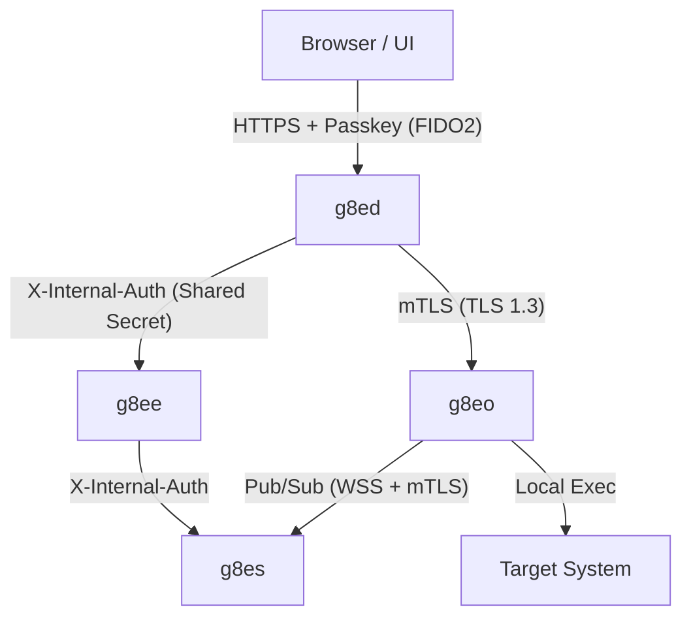

---
title: Security
parent: Architecture
---

# Security Architecture

g8e is a local-only, air-gapped platform designed for high-stakes environments. Security is not an "add-on" but the core constraint: the platform assumes the AI control plane is potentially adversarial or error-prone and enforces safety at the infrastructure level.

## Bedrock Principles

1.  **Human-in-the-Loop (HITL)**: The AI proposes; the human approves. No state-changing operation executes without explicit, informed user consent.
2.  **Zero Trust**: No component or connection is implicitly trusted. Every request is authenticated, every payload validated, and every data stream scrubbed.
3.  **Local-First Sovereignty**: Sensitive data stays on the Operator host. Only scrubbed metadata crosses component boundaries.
4.  **Defense in Depth**: Multiple overlapping layers (Sentinel, Tribunal, mTLS, LFAA) ensure that a failure in one control does not compromise the system.

---

## Technical Positioning

- **vs. SSH**: SSH is a secure pipe; g8e is a **governor**. g8e uses the pipe to enforce a governance model (scrubbing, consensus) that SSH cannot.
- **vs. Teleport / Boundary**: These manage **human** access. g8e manages **AI-powered automation** acting on behalf of humans.
- **vs. Ansible / Terraform**: These are deterministic. g8e is for **non-deterministic** investigation where the AI reasons about real-time state before proposing actions.

---

## Platform Flow & Boundaries



### 1. Browser to Gateway (g8ed)
- **Auth**: FIDO2/WebAuthn passkeys only. No passwords.
- **Sessions**: `HttpOnly`, `Secure`, `SameSite=Lax` cookies. Session state stored in `g8es` KV.
- **Context Binding**: Sessions are tied to IP and User-Agent; 4+ IP changes trigger a security flag.

### 2. Internal Services (g8ed, g8ee, g8es)
- **Shared Secret**: Authenticated via `X-Internal-Auth` using `internal_auth_token`.
- **Isolation**: Services communicate over a private Docker bridge network; only the gateway (443) is exposed to the host.

### 3. Gateway to Operator (g8eo)
- **mTLS**: Every Operator presents a per-device client certificate issued during bootstrap.
- **Outbound-Only**: Operators initiate connections to the gateway; they open no inbound ports.
- **Fingerprinting**: Operators are bound to a permanent system fingerprint (Machine ID + CPU + Hostname) on first auth.

---

## Protection Layers

### Sentinel (Defense & Sovereignty)
Sentinel is the primary guardian on the Operator host. It operates in two phases:
1.  **Pre-Execution (Defense)**: Analyzes commands and file edits against a library of 40+ threat patterns (MITRE ATT&CK mapped). Blocks malicious or destructive actions before they hit the shell.
2.  **Post-Execution (Sovereignty)**: Scrubs terminal output (stdout/stderr) for credentials, PII, and tokens before they leave the host. It preserves operational data (IPs, paths, ARNs) needed for troubleshooting.

### The Tribunal (Governance)
Before a command reaches an Operator, it must pass through the `g8ee` Tribunal:
- **Auditor**: Uses `auditor_hmac_key` to sign reputation commitments and ensure consistency.
- **Warden**: Performs high-level risk assessment and presents the "Warden's Report" to the user for approval.
- **Consensus**: In high-risk modes, multiple models must agree on the proposed action before it is dispatched.

---

## Bootstrap & Secret Management

The platform uses a "Capture and Persist" strategy for its core secrets, managed by the `g8eo` Secret Manager in `--listen` mode.

### Authoritative Secrets (The SSL Volume)
Three critical secrets are generated on first boot and stored in the `g8es-ssl` volume (mounted at `/g8es`):
- `internal_auth_token`: For `X-Internal-Auth` header validation.
- `session_encryption_key`: For AES-256 encryption of sensitive session fields.
- `auditor_hmac_key`: For signing Tribunal reputation commitments.

### Tamper Evidence
To prevent silent drift between the database and the volume:
1. `g8eo` writes a `bootstrap_digest.json` manifest containing SHA-256 hashes of all secrets.
2. `g8ed` and `g8ee` read the manifest at startup.
3. If the on-disk secret does not match the manifest, the service **aborts startup** (BootstrapSecretTamperError).

---

## Local-First Audit Architecture (LFAA)

LFAA ensures that every action taken by the AI is recorded in a tamper-evident, append-only log on the Operator host.

### Audit Vault (Events)
- **Storage**: Encrypted SQLite database (`g8e.db`).
- **Encryption**: Sensitive fields (command raw, stdout, stderr) are encrypted at rest using **AES-256-GCM**.
- **Keys**: KEK derived from the Operator's API key via HKDF-SHA256; DEK envelope encryption for every record.

### Git Ledger (Versioning)
- **Mechanism**: Every file mutation is mirrored into a hidden `.g8e/ledger` Git repository.
- **Integrity**: Provides a verifiable history of file changes, allowing for diffing and rollback of AI-driven edits.

---

## Network & Infrastructure

- **Air-Gapped by Design**: The platform requires zero external connectivity to function.
- **Port 443 Only**: The only inbound path to the platform is via the TLS gateway.
- **CA Management**: `g8e` operates its own private CA (ECDSA P-384). All certificates are generated at runtime and survive `platform reset` via the dedicated SSL volume.

| Fingerprint mismatch (offline) | `FINGERPRINT_MISMATCH` | 403 |
| Slot claim failure | `Failed to claim Operator slot` | 500 |

### Device Link Auth Layer

The Device Link path is a two-phase bootstrap: **registration** then **authentication**. It is handled by `DeviceLinkService.registerDevice` (phase 1) and standard API key authentication (phase 2).

#### Phase 1: Device Registration (`DeviceLinkService.registerDevice`)

Called by g8eo when it first presents a `--device-token dlk_...` token. This phase happens before the bootstrap POST.

**Registration sequence:**
1. Token format validated against `dlk_[A-Za-z0-9_-]{32}`.
2. Token fetched from g8es KV; expiry checked.
3. `REVOKED` → 403; `USED` → 403.
4. `DeviceRegistrationService.registerDevice` called:
   - For multi-use links: atomicity is maintained via distributed lock and use counters.
   - Claims or reconnects an available operator slot.
   - Generates an API key and per-operator mTLS certificate for the device.
5. Token status updated to reflect use/exhaustion.
6. **Response:** returns `{ api_key, operator_cert, operator_cert_key, operator_id }` directly to the Operator.

#### Phase 2: Authentication

Called by g8eo on the subsequent `POST /api/auth/operator` using the API key received in Phase 1. This follows the standard [API Key Auth Layer](#api-key-auth-layer) sequence.

**Why the two-phase design:** The device link token is consumed at registration time (Phase 1), which provisions the long-lived credentials (API key + cert). The subsequent bootstrap request (Phase 2) uses the persistent API key — the token is gone by this point. This means the token never travels over the wire a second time and has zero value after first use.

| Check | Failure | HTTP |
|---|---|---|
| Invalid/expired operator session | `Invalid or expired session` | 401 |
| Session missing identity fields | `Invalid session` | 401 |
| User not found | `User not found` | 404 |

### Web User Authentication (FIDO2/WebAuthn Passkeys)

g8e uses passkey-only authentication. No passwords are stored anywhere in the platform.

**Login flow:**
1. On first platform access with no existing users, a guided setup creates the initial administrative account.
2. The user registers a passkey — the private key stays on their device; only the public key is stored server-side.
3. On login, g8ed generates a cryptographic challenge with a 5-minute TTL. The browser signs it with the device private key. g8ed verifies the signature against the stored public key.
4. A successful verification creates a server-side session. The browser receives an encrypted, `HttpOnly`, `Secure`, `SameSite=lax` session cookie.

**Key security properties:**
- Inherently resistant to credential stuffing, phishing, and brute force — the private key never leaves the device.
- Authenticator signature counters are tracked on every authentication to detect cloned credentials.
- Rate limits enforced on challenge generation and verification endpoints.
- Authentication events logged for anomaly detection.

### CLI Authentication (g8e login)

The `g8e` CLI provides a local credential store for command-line operations, allowing users to authenticate once and reuse their session across multiple CLI commands without repeatedly passing credentials.

**Login flow:**
1. User runs `./g8e login --api-key <key>` or `./g8e login --device-token <token>` (or enters interactively).
2. The CLI authenticates or registers via the platform.
3. On success, the platform returns `api_key`, `user_id`, `operator_id`, and `operator_session_id`.
4. The CLI stores these credentials in `~/.g8e/credentials` with `0600` filesystem permissions.
5. Subsequent CLI commands automatically load and validate the stored credentials.

**Credential Store Security:**
- **Location**: `~/.g8e/credentials` (user home directory).
- **Permissions**: `0600` (read/write by owner only).
- **Contents**: `OPERATOR_SESSION_ID`, `USER_ID`, `OPERATOR_ID`, and `G8E_AUTH_TIMESTAMP`.
- **Format**: Shell script that exports environment variables when sourced.

**Session Validation:**
- On every CLI command execution, the credential store is loaded via `_load_credentials`.
- If the platform is running, the stored `OPERATOR_SESSION_ID` is validated against `/api/auth/operator/validate` endpoint.
- The validation endpoint authenticates via the session ID itself (no internal auth token required).
- Invalid or expired sessions trigger automatic credential clearing with a clear error message.
- Validation uses the platform's self-signed certificate (`-k` flag for curl).

**Logout flow:**
- User runs `./g8e logout`.
- The credential file `~/.g8e/credentials` is deleted.
- Environment variables (`OPERATOR_SESSION_ID`, `USER_ID`, `OPERATOR_ID`, `G8E_AUTH_TIMESTAMP`) are unset.

**Authentication Methods:**
- **API Key**: Long-running operator authentication via `--api-key` or `-k` flag.
- **Device Token**: One-time or multi-use device link token via `--device-token` flag.
- **Interactive**: If no flag is provided, the CLI prompts for the credential and auto-detects format (`dlk_*` for device tokens, `g8e_*` for API keys).

**Fallback Authentication:**
- If the credential store is empty or invalid, CLI commands accept inline `--api-key` or `--device-token` flags.
- Commands requiring authentication (e.g., `operator deploy`, `operator stream`, `security`, `data`, `mcp`) fail with clear instructions if no credentials are available.

**Security Properties:**
- Credentials are never logged or echoed to stdout.
- The credential file is atomically written with restrictive permissions.
- Session validation prevents use of stale or revoked sessions.
- The credential store is local-only — no synchronization with any remote service.

---

## Operator Heartbeat
   
After authentication, the Operator enters an idle state and does exactly one thing autonomously: it sends an authenticated heartbeat to the platform every 10 seconds (interval overridable by bootstrap config). Nothing else runs without user engagement.
   
**What a heartbeat contains:**
- System metrics — hostname, CPU usage, memory usage, disk usage, network info, OS details, uptime.
- Operator session identity (authenticated on every heartbeat over the established mTLS connection).
   
**What a heartbeat does not contain:**
- No command output, no file contents, no sensitive data of any kind.
- No proactive scanning, crawling, or enumeration of the host.
   
A heartbeat from an unauthenticated or fingerprint-mismatched Operator is rejected. The platform uses the continuous heartbeat stream to track operator health — a missed heartbeat chain (60s) triggers a stale status transition.
   
**Heartbeat flow:**
```
g8eo (every 10s)
    │ WebSocket (mTLS)
    ▼
g8es pub/sub → g8ee (OperatorHeartbeatService)
                    │ write latest_heartbeat_snapshot to g8es
                    │ detect staleness, manage operator status transitions
                    │ publish OPERATOR_HEARTBEAT_RECEIVED internal event
                    ▼
                  g8ed (SessionAuthListener)
                    │ broadcast SSE operator.heartbeat.received
                    ▼
                  Browser
```

g8ee is the source of truth for heartbeat data and all operator status transitions. g8ed only invalidates its cache and relays the SSE event — it never writes heartbeat data to g8es directly.

---

## Operator Security Model

### In-Memory Credentials

The Operator's API key is held in process memory for the lifetime of the process. It is never written to disk in a recoverable format. When the process is killed, the key is gone. The per-operator mTLS client certificate is also held in memory and discarded on process exit.

### Outbound-Only Architecture

g8eo Operators open no inbound ports. All communication is Operator-initiated — an outbound WebSocket to g8es on port 443. Operators function behind any NAT, corporate firewall, or VPC without special network configuration.

### Operator Startup Security Sequence

1. Load settings from environment + CLI flags.
2. Load the platform CA certificate using local-first discovery (scan `/ssl/ca.crt`, `/g8es/ca.crt`, `/g8es/ssl/ca.crt`, `/data/ssl/ca.crt`), falling back to an HTTPS fetch from `https://<endpoint>/ssl/ca.crt` if no local file is found. If all paths fail, the operator exits immediately.
3. Authenticate (API key or device token).
4. POST to `/api/auth/operator` — receive bootstrap config (session ID, operator ID, user ID, API key, config, and mTLS certificate).
5. Initialize local storage: scrubbed vault, raw vault, audit vault.
6. Initialize LFAA audit vault and git ledger.
7. Connect to g8es pub/sub over WSS using the retrieved mTLS client certificate.
8. Subscribe to `cmd:{operator_id}:{operator_session_id}` channel.
9. Begin heartbeat telemetry. Enter idle — await binding.

### g8eo Defense Layers (in order)

1. **API Key Authentication** — required for all operations before any bootstrap config is returned.
2. **mTLS** — both sides present certificates; g8eo rejects the connection if the server certificate isn't signed by the pinned CA.
3. **CA Trust Bootstrap** — platform CA fetched from hub at startup via `certs.FetchAndSetCA`; only trusts that exact CA.
4. **TLS Kill Switch** — g8eo self-terminates with exit code 7 (`ExitCertTrustFailure`) on cert verification failure; the connection is never downgraded.
5. **Fingerprint Binding** — system fingerprint permanently locked to the Operator slot on first auth; mismatches rejected.
6. **Replay Protection** — timestamp + nonce validation on every request.
7. **Explicit Session Binding** — Operator cannot receive commands until a user explicitly binds their web session.
8. **Sentinel Pre-Execution** — dangerous commands blocked before execution.
9. **Human Approval** — every state-changing command requires explicit user consent.
10. **LFAA Audit Logging** — all operations logged to the local audit vault.
11. **Process Sovereignty** — the user terminates the process; no platform action can keep a dead Operator alive.

### Hard Stop: Human Control at Every Layer

| Method | What it stops |
|---|---|
| **Cancel button in the UI** | Stops the current AI generation mid-stream; no further commands are proposed or dispatched |
| **Stop Operator in the UI** | Sends a shutdown signal to the Operator via the platform; the process exits |
| **Kill the PID on the remote machine** | Direct OS-level termination — SIGTERM or SIGKILL; the Operator process dies immediately |
| **Reboot the remote machine** | The Operator process does not survive a reboot; no autostart unless explicitly configured |
| **Close the SSH session** (`operator stream`) | The `trap EXIT` handler fires on the remote host, deleting the ephemeral binary |
| **Revoke/Refresh API key in the UI** | Immediately invalidates the Operator's credentials |
| **Unbind in the UI** | Severs the web session binding; the AI can no longer dispatch commands to that Operator |

---

### Sentinel Enforcement Layers

It is important to distinguish between the two distinct layers of Sentinel enforcement:

1.  **Threat Detection (Non-Optional)**: All commands are scanned against MITRE ATT&CK patterns. This layer is always active and cannot be disabled by the user or the AI. Dangerous patterns (e.g., `rm -rf /`) are blocked before the user ever sees them.
2.  **Explicit Constraints (Optional)**: The **Command Allowlist** and **Command Denylist** are user-defined constraints. These are disabled by default and can be enabled for environments requiring strict "known-good" command sets.

---

All commands dispatched to an Operator pass through Sentinel before execution. Sentinel is not optional and cannot be bypassed by the AI.

### Pre-Execution Threat Detection

Before any command executes on the host, Sentinel scans it against MITRE ATT&CK-mapped threat patterns. Dangerous commands are **blocked outright** before reaching the execution layer.

#### Input Threat Detectors (46+ patterns)

Sentinel maintains an extensive set of input threat detectors in `components/g8eo/services/sentinel/sentinel_input.go`. Each detector is mapped to MITRE ATT&CK techniques and tactics.

| Category | Examples | MITRE Technique |
|---|---|---|
| **Data destruction** | `rm -rf /`, `dd of=/dev/sd*`, `mkfs /dev/`, `shred /dev/`, `wipefs`, `fdisk/gdisk/parted` | T1485, T1561.001 |
| **System tampering** | Writing to `/etc/passwd`, `/etc/shadow`, `/etc/sudoers`, `/etc/pam.d/`, `/etc/ssh/sshd_config`, `/etc/hosts`, `/etc/resolv.conf`, `/etc/ld.so.*` | T1136.001, T1548.003, T1556.003, T1098.004, T1565.001, T1574.006 |
| **Security bypass** | `setenforce 0`, `aa-disable`, disabling firewalls (`ufw`, `firewalld`, `iptables`), disabling auditd | T1562.001, T1562.004 |
| **Malware deployment** | `curl ... | bash`, `wget ... | bash`, `eval $(base64 -d)`, Python remote code execution | T1059.004, T1027, T1059.006 |
| **Reverse shells** | `bash -i >& /dev/tcp/`, `nc -e /bin/sh`, `ncat --exec`, Python/Perl/Ruby/PHP/Socat/Telnet reverse shell patterns | T1059.004, T1059.006 |
| **Privilege escalation** | Setting SUID/SGID bits, `setcap` with dangerous capabilities | T1548.001 |
| **Credential access** | Reading `/etc/shadow`, AWS/GCP/Azure/Kubernetes credential files, SSH private keys, copying shadow file | T1003.008, T1552.001, T1552.004 |
| **Persistence** | Cron jobs from remote sources, suspicious `at` jobs | T1053.003, T1053.002 |
| **Exfiltration** | DNS tunneling (`dig ... $()`), ICMP tunneling with hex payloads | T1048.001, T1048.003 |
| **Defense evasion** | Clearing `/var/log/`, clearing shell history, disabling logging services | T1070.002, T1070.003, T1562.001 |
| **Network manipulation** | ARP spoofing, DNS spoofing tools | T1557.002, T1557.001 |
| **Cryptomining** | Downloading miners, stratum+tcp connections, known mining pool domains | T1496 |
| **Container escape** | Privileged containers, mounting host root, mounting Docker socket | T1611 |
| **System tampering** | Loading kernel modules (`insmod`, `modprobe`) | T1547.006 |

#### Critical System Paths

Sentinel maintains a list of critical system paths (`CriticalSystemPaths` and `CriticalSystemDirs` in `sentinel_input.go`) that trigger elevated scrutiny:

- `/etc/passwd`, `/etc/shadow`, `/etc/group`, `/etc/gshadow`, `/etc/sudoers`, `/etc/sudoers.d/`
- `/etc/ssh/sshd_config`, `/etc/ssh/ssh_config`, `/etc/pam.d/`, `/etc/security/`
- `/etc/ld.so.conf`, `/etc/ld.so.preload`, `/etc/hosts`, `/etc/resolv.conf`, `/etc/fstab`
- `/etc/crontab`, `/etc/cron.d/`, `/etc/cron.daily/`, `/etc/cron.hourly/`, `/etc/init.d/`
- `/etc/systemd/system/`, `/etc/rc.local`, `/etc/profile`, `/etc/profile.d/`, `/etc/bash.bashrc`
- `/etc/environment`, `/etc/selinux/`, `/etc/apparmor/`, `/etc/apparmor.d/`, `/boot/`
- `/root/.ssh/`, `/root/.bashrc`, `/root/.bash_profile`, `/root/.profile`
- `/bin`, `/sbin`, `/usr/bin`, `/usr/sbin`, `/usr/local/bin`, `/usr/local/sbin`
- `/lib`, `/lib64`, `/usr/lib`, `/boot`, `/proc`, `/sys`, `/dev`

#### File Edit Analysis

Sentinel also analyzes file operations before they execute via `AnalyzeFileEdit`:

- Checks if the file path is a critical system file
- Analyzes file content for malicious patterns
- Analyzes file path patterns for suspicious operations
- Sets `RequiresApproval` flag for critical system files even if not explicitly blocked

**Blocked threats** are rejected before the approval prompt is shown. **Flagged threats** (elevated risk, potentially legitimate) surface in the approval flow with the specific threat category and MITRE ATT&CK classification shown to the user. Every blocked or flagged attempt is recorded in the LFAA audit vault with tamper-evident logging.

### g8ee AI Safety Analysis (Pre-Dispatch)

Before dispatching any command to the Operator, g8ee runs its own AI-powered safety analysis — separate from Sentinel, operating at the platform level:

- **Command risk classification** — classifies proposed commands as LOW / MEDIUM / HIGH using structured LLM output. Fails closed to HIGH if analysis fails.
- **File operation safety** — automatically blocks writes to system paths (`/etc/`, `/usr/`, `/sys/`, `/proc/`, `/bin/`, `/sbin/`, `/boot/`, `/lib/`), destructive operations on dirty git repositories, and operations that should be backed up first.
- **Error recovery analysis** — on command failure, determines whether to auto-retry (missing deps, permission errors on project files, syntax errors) or escalate to the user (system-level failures, security issues, ambiguous errors). Maximum 2 auto-fix retries.

### Tribunal Command Refinement

Before a command is presented for human approval, it passes through an additional syntactic refinement pipeline in g8ee (`components/g8ee/app/services/ai/generator.py`). The Large LLM is not involved after its initial proposal.

```
Large LLM proposes command via ReAct loop
  │
  ▼
Tribunal — N concurrent generation passes (default: 3, `llm_command_gen_passes`)
  Each pass: same intent + operator OS/shell/working_directory context
  Temperature: model default (via get_model_config)
  Model: resolved via `assistant_model -> primary_model`
  Members: Axiom, Concord, Variance, Pragma, Nemesis
  │
  ▼
Stage 1: Concurrent Generation
  N parallel generation passes using mapped Tribunal member personas.
  Each pass is validated for basic syntax and Sentinel safety.
  │
  ▼
Stage 2: Weighted Majority Voting (`voter.py`)
  Uniform-weighted majority vote across all successful candidates.
  Deterministic tie-breaking ladder:
    1. Shortest command wins (compositional pressure)
    2. Non-Nemesis cluster wins over Nemesis-including cluster
  If Round 2 Peer Review fails to reach consensus, trigger Circuit Breaker (Deadlock)
  │
  ▼
Stage 3: Auditor Verification (Optional)
  Enabled via `llm_command_gen_verifier=true`.
  Uses the primary model to review the winning candidate.
  Auditor can: Approve (OK) or Reject (REJECT).
  │
  ▼
Final command presented to human for approval
```

**Reputation & Stake Resolution:**
After execution, the `ReputationService` resolves stakes for all participating members based on the execution outcome (success vs failure) and any system-detected risk (Warden). Slashing is applied to the agent's reputation standing for faults, which impacts their weight in future Tribunal sessions.

### Command Allowlist, Denylist, and Auto-Approve

Three independent operator-level controls are available as additional constraints. Whitelisting is **disabled by default**, while blacklisting and auto-approve are **enabled by default** to ensure a secure yet efficient operating baseline. They have distinct semantics and **must not be conflated**:

- **Allowlist (whitelist) — HARD ALLOW-LIST.** Restricts the AI to pre-approved commands with validated parameters. When enabled, any command not on the list is rejected at L1 safety validation regardless of human approval.
  - **JSON Mode (default)**: Uses a rich JSON whitelist (`config/whitelist.json`) where each command defines permitted options, regex-validated parameters, and a `max_execution_time`.
  - **CSV Mode (override)**: If a user specifies a comma-separated list of commands (e.g., `uptime,df,free`) in their settings, this entirely replaces the JSON whitelist. Only the base commands in the CSV are permitted, and arguments are validated using basic shell safety checks.
- **Denylist (blacklist) — HARD BLOCK-LIST.** Blocks specific commands, binaries, substrings, and regex patterns across four enforcement layers. **This is enabled by default** as a recommended boundary for system safety. When enabled, a command matching any layer is rejected before the approval prompt — it never reaches the user for consideration.
- **Auto-Approve — SKIP-APPROVAL LIST.** **This is enabled by default** to work in harmony with the built-in reputation staking system. When enabled, commands whose base verb appears in `auto_approved_commands` bypass the human approval prompt (the human has rubber-stamped them in advance as benign). This provides peak signal and peak efficiency by allowing a team of heterogeneous agent personas to stake their reputation on the command along with the built-in reputation engine. 

Auto-approve is **independent** of whitelisting: it does not widen the whitelist and does not bypass the blacklist or hard-coded forbidden patterns. A command must still pass every L1 hard gate before auto-approve can apply.

#### Configuration

Command validation is configured per-user via the `command_validation` field in user settings:

```json
{
  "user_id": "...",
  "settings": {
    "command_validation": {
      "enable_whitelisting": false,
      "enable_blacklisting": false,
      "whitelisted_commands": "",
      "enable_auto_approve": false,
      "auto_approved_commands": ""
    },
    "llm": { ... },
    "search": { ... },
    "eval_judge": { ... }
  }
}
```

- `enable_whitelisting` (bool, default: `false`) — When enabled, only commands in the whitelist are permitted (hard allow-list).
- `enable_blacklisting` (bool, default: `true`) — When enabled, commands matching blacklist patterns are blocked (hard block-list). Recommended for system safety.
- `whitelisted_commands` (string, default: `""`) — Optional comma-separated list of allowed base commands (e.g. `uptime,df,free`).
- `enable_auto_approve` (bool, default: `true`) — When enabled, commands whose base verb is in `auto_approved_commands` skip the human approval prompt. Works in harmony with reputation staking for peak efficiency.
- `auto_approved_commands` (string, default: `""`) — Comma-separated list of base commands the human has rubber-stamped as benign (e.g. `uptime,df,free`). Only consulted when `enable_auto_approve` is `true`.

**Whitelist Mode Semantics:**
- **JSON mode (default):** When `whitelisted_commands` is empty, the system uses a rich JSON whitelist (`config/whitelist.json`) with per-command `safe_options` and `validation` patterns.
- **CSV mode (override):** When `whitelisted_commands` contains a comma-separated list, this list **entirely replaces** the JSON whitelist. Every argument must pass basic shell safety checks (`_is_safe_value`). Rich per-command patterns from the JSON whitelist are NOT used in this mode.

**Independence guarantee:** Whitelisting, blacklisting, and auto-approve are three orthogonal policies. Enabling auto-approve never relaxes a hard gate; disabling whitelisting never grants auto-approval. Each policy must be enabled (and configured) explicitly.

Users can configure these settings through:
1. **Settings UI** — Navigate to Settings → Command Validation to enable/disable whitelist, blacklist, and auto-approve
2. **API** — Update user settings via the `/api/settings/user` endpoint

The AI is informed of active command constraints via the `get_command_constraints` tool, which returns the current whitelist, blacklist, and auto-approve state for Tribunal awareness during command generation. The Tribunal must continue to obey hard gates regardless of auto-approve.

---

## Operator Binding Implementation

Authentication is not the same as authorization to receive commands. After an Operator authenticates and is `ACTIVE`, it cannot receive commands from any user until a web session explicitly binds to it.

**Binding is an explicit user action.** On confirmation, the platform performs the following writes via `BoundSessionsService` (`services/auth/bound_sessions_service.js`):

1. Two **bidirectional g8es KV keys** are written:
   - `sessionBindOperators(operatorSessionId)` → `webSessionId` — authoritative lookup for SSE routing
   - `sessionWebBind(webSessionId)` → `operatorSessionId` (as a SET member) — authoritative lookup for approval routing
2. A **`bound_sessions` document** is created or updated in the g8es document store (keyed by `web_session_id`) as the durable, auditable record.

The KV keys are the authoritative runtime state; the document store is the durable backing store. Partial failures leave the platform in a detectable inconsistent state rather than a silently broken one.

### Binding Contract

- One operator session can be bound to at most one web session at a time.
- One web session can be bound to multiple operator sessions simultaneously.
- All binding mutations go through `BoundSessionsService` — routes call `getBindingService()` from `initialization.js`.
- The `sessionBindOperators` key is the fast-path lookup for SSE routing: `internal_sse_routes.js` and `internal_operator_routes.js` call `getWebSessionForOperator(operatorSessionId)` to resolve where to deliver events.
- The `sessionWebBind` key is the fast-path lookup for approval routing: `operator_approval_routes.js` calls `getBoundOperatorSessionIds(webSessionId)` to find the active operator.

### `buildG8eContext` — Bound Operator Resolution

`buildG8eContext` in `routes/platform/chat_routes.js` is the single point where g8ed resolves bound operators before every chat request. It executes at request time — **no cached result**.

**Resolution steps (per chat request):**
1. `getBindingService().getBoundOperatorSessionIds(webSessionId)` — reads `sessionWebBind` KV key.
2. For each operator session ID: `getOperatorSessionService().validateSession(operatorSessionId)` — confirms the session is live and retrieves `operator_id`.
3. Verify the reverse binding: `getBindingService().getWebSessionForOperator(operatorSessionId)` — confirms `sessionBindOperators` resolves back to this web session. Mismatch → skipped.
4. Fetch the operator document from g8es for current `status`, `operator_type`.
5. Serialize each valid operator as a `BoundOperatorContext` and JSON-encode the array into `X-G8E-Bound-Operators`.

`X-G8E-Bound-Operators` is the **exclusive source of truth** for which operators are available to the AI on any given request. g8ee performs no independent operator lookup to resolve binding state — if `g8e_context.bound_operators` is empty, the session has no bound operators.

---

## File Operations: Raw and Scrubbed Vault

File operation outputs on the Operator follow the LFAA dual-vault model:

### Scrubbed Vault (`.g8e/local_state.db`)

- Stores Sentinel-processed command output — credentials, PII, and sensitive patterns replaced with safe placeholders.
- **AI-accessible on demand** via `fetch_execution_output`. g8ee instructs the AI to call this tool when it receives a `stored_locally=true` metadata response from the Operator.
- The content streams back to g8ee ephemerally and is **never persisted on the platform side**.

### Raw Vault (`.g8e/raw_vault.db`)

- Stores unscrubbed, full command output and file contents.
- **Never transmitted** — remains exclusively on the Operator host.
- 30-day retention, 2 GB maximum.
- Instantiated independently from the audit vault; not part of LFAA audit logging.
- Accessible to the AI only when `sentinel_mode` is set to `raw` on the investigation (user-controlled toggle).

### Sentinel Mode

The `sentinel_mode` field on an investigation controls which vault the AI reads from:
- `scrubbed` (default) — AI sees only Sentinel-scrubbed output; maximum data sovereignty.
- `raw` — AI has access to both vaults, including full unscrubbed output.

Users can toggle this at any time via the Sentinel Toggle in the UI.

### File Operation Safety

Before any file write, g8ee's `AIResponseAnalyzer` blocks:
- Writes to system paths: `/etc/`, `/usr/`, `/sys/`, `/proc/`, `/bin/`, `/sbin/`, `/boot/`, `/lib/`.
- Destructive operations on dirty git repositories.
- Operations that should be backed up first (when no backup exists).

Automatic backups are created by `FileEditService` before any modification.

---

## Ledger Security

The Ledger (`.g8e/data/ledger/`) is a standard Git repository maintained by g8eo. Every file write committed by the AI becomes a Git commit, giving the Operator's file history a cryptographic chain that cannot be silently rewritten.

- Each commit records: exact file state before and after, timestamp, and the audit vault correlation hash.
- `restore_file` (approval-required) uses Ledger commit hashes to revert any file to a previous known state.
- `fetch_file_history` and `fetch_file_diff` give the AI read-only access to the Ledger for reasoning about file changes — no approval required for reads.
- Anyone with access to the `.g8e/data/ledger/` directory can run `git log` and see exactly what the AI changed and when, independent of the platform.
- The Ledger requires a functional `git` binary; disabled via `--no-git` or when `git` is unavailable.

---

### Sentinel Output Scrubbing

After any command executes, before its output reaches g8ee (and therefore any AI provider), Sentinel replaces sensitive patterns with safe placeholders.

**Implementation split:** 
- **g8eo (Go)**: Handles **egress scrubbing** (command stdout/stderr) and **pre-execution threat detection**.
- **g8ee (Python)**: Handles **ingress scrubbing** for user chat messages and terminal input before they are sent to the cloud AI.

### Scrubbing Patterns (applied sequentially)

| Category | What is scrubbed | Placeholder |
|---|---|---|
| Service tokens | g8e API keys, JWT, SendGrid, GitHub, GCP, AWS access keys, Slack, Okta, Azure AD, Twilio, NPM, PyPI, Discord, private keys | `[G8E_API_KEY]`, `[JWT]`, `[GITHUB_TOKEN]`, etc. |
| Config credentials | AWS secrets, Azure secrets, OAuth secrets, Heroku keys | `[AWS_SECRET]`, `[OAUTH_SECRET]`, etc. |
| PII with context | URLs with embedded credentials, connection strings, email addresses | `[URL_WITH_CREDENTIALS]`, `[CONN_STRING]`, `[EMAIL]` |
| Financial / generic PII | Credit card numbers, SSNs, phone numbers, IBANs | `[PII]`, `[PHONE]`, `[IBAN]` |
| Generic credentials | `password`/`secret` config patterns, bearer tokens | `[CREDENTIAL_REFERENCE]`, `[BEARER_TOKEN]` |

**What is preserved (operational data the AI needs):** IP addresses, hostnames, MAC addresses, file paths (including home directories), URLs without credentials, UUIDs, AWS ARNs, AWS account IDs, filenames, hashes, base64 content.

---

## Data Sovereignty and LFAA

### The Core Guarantee

**The g8e platform never stores raw command output or file contents.** The Operator is the system of record. The platform is a stateless relay.

> *"The Platform handles routing. The Operator handles retention."*

When local storage is enabled on an Operator (the default), all tool call outputs are stored in the Operator's working directory (`.g8e/`). g8ee receives only metadata (hashes, sizes) with a `stored_locally=true` flag. The AI retrieves full output on demand via `fetch_execution_output` — content streams back ephemerally and is never persisted on the platform side.

### LFAA Components on the Operator

| Component | Path (relative to working dir) | What it records |
|---|---|---|
| **Scrubbed Vault** | `.g8e/local_state.db` | Sentinel-processed output; AI-accessible via `fetch_execution_output` |
| **Raw Vault** | `.g8e/raw_vault.db` | Unscrubbed full output; never transmitted; 30-day retention, 2 GB max |
| **Audit Vault** | `.g8e/data/g8e.db` | All session events: messages, commands (exit codes, durations), file mutations, AI responses |
| **Ledger** | `.g8e/data/ledger/` (Git) | Cryptographic version history for every file the AI has modified |

### LFAA Vault Encryption

LFAA audit vault fields (`content`, `stdout`, `stderr`) are encrypted at rest using envelope encryption:

1. **KEK derivation** — Key Encryption Key derived on-demand from the Operator's API key using HKDF-SHA256 (no salt; info string `g8e-lfaa-kek-v1`). The KEK is never stored.
2. **DEK wrapping** — Data Encryption Key generated per-vault, wrapped with the KEK using AES-256-KW (RFC 3394). The wrapped DEK is stored alongside the vault.
3. **Field encryption** — Individual sensitive fields encrypted with the DEK using AES-256-GCM with a unique random nonce per operation. AES-GCM provides authenticated encryption (AEAD); any tampering is detected on decryption.
4. **Fingerprint verification** — Before unwrapping the DEK, the platform verifies the API key against a stored fingerprint to detect wrong-key attempts.

**Key security properties:**
- The KEK is never stored — derived fresh on each vault access and cleared from memory immediately after.
- There is no backdoor or recovery mechanism. Loss of the API key means permanent loss of access to encrypted vault data.
- Key rotation (`--rekey-vault`) is atomic — re-wraps the DEK with a new KEK without re-encrypting underlying data.
- A vault reset (`--reset-vault`) permanently destroys all encryption headers and the underlying encrypted stores.

### Dual-Location Auditability

Every action through g8e is auditable from two independent locations:

**1. Platform-side (g8ed console)** — records metadata for all administrative actions, authentication events, session lifecycle events, and operator status changes. Authoritative for platform-level events.

**2. Operator-side (`.g8e/` in the deployment directory)** — the authoritative record for everything that happened on that system:
- Every user message and AI response in every session.
- Every command executed: exact command text, exit code, duration, stdout, stderr.
- Every file mutation: before and after state (via Ledger commit hashes).
- Every `fetch_execution_output` retrieval — AI access to historical data is also logged.

This dual-location design means that even if the platform itself were completely unavailable, the full audit record for every host remains intact in the host's own filesystem.

---

## Human-in-the-Loop Approval Model

The AI operates through a defined set of tools. Each tool is classified at the platform level as either requiring explicit user approval or not. This classification is fixed in the platform — the AI cannot change it.

The user's stated intent in chat is sufficient authorization for read-only activity. Any operation that **changes state** — writing a file, executing a command, modifying cloud permissions — requires an explicit approval action from the user in the UI before it executes.

Automatic Function Calling (AFC) is **permanently disabled** in g8e. The AI cannot chain tool calls through an auto-approve path. Every step of a multi-step operation that touches state surfaces its own approval prompt.

### Function Tool Approval Classification

| Tool | Approval | Scope | Description |
|---|---|---|---|
| `run_commands_with_operator` | **Required** | Gated | Execute shell commands on target systems |
| `file_create_on_operator` | **Required** | Gated | Create new files with content |
| `file_write_on_operator` | **Required** | Gated | Replace entire file contents |
| `file_update_on_operator` | **Required** | Gated | Surgical find-and-replace within a file |
| `grant_intent_permission` | **Required** | Gated | Request AWS intent permissions for cloud operators |
| `revoke_intent_permission` | **Required** | Gated | Revoke AWS intent permissions |
| `file_read_on_operator` | No | Gated | Read file content (with optional line ranges) |
| `list_files_and_directories_with_detailed_metadata` | No | Gated | Directory listing with metadata |
| `fetch_file_history` | No | Gated | Retrieve git version history for a file from the Ledger |
| `fetch_file_diff` | No | Gated | Retrieve Sentinel-scrubbed file diffs from the Operator vault |
| `check_port_status` | No | Gated | Check TCP/UDP port reachability |
| `query_investigation_context` | No | Universal | Retrieve case/investigation context from g8es |
| `get_command_constraints` | No | Universal | Return active whitelist/blacklist/auto-approve state |
| `ssh_inventory` | No | Universal | List discovered SSH targets |
| `stream_operator` | No | Universal | Stream a temporary operator to a remote host |
| `g8e_web_search` | No | Universal | Perform a web search (provider dependent) |

The tool declarations that the AI can actually invoke are built in `AIToolService.__init__` (`components/g8ee/app/services/ai/tool_service.py`). The `restore_file`, `fetch_execution_output`, `fetch_session_history`, and `read_file_content` enum members exist in `OperatorToolName` but are not currently surfaced as AI-callable tool declarations — file restores and execution-output retrieval are driven directly by g8ee services rather than being exposed to the model.

---

## Cloud Operator Security (AWS Zero Standing Privileges)

### Cloud Command Validator

Cloud Operators require pattern-based command routing to ensure cloud-specific commands are only executed by appropriately configured operators. The `CloudCommandValidator` in `components/g8ee/app/services/operator/cloud_command_validator.py` maintains a list of cloud-only command patterns.

Commands matching these patterns require an Operator with `operator_type: cloud`:

| Pattern | Tool |
|---|---|
| `^aws\s` | AWS CLI |
| `^gcloud\s` | Google Cloud CLI |
| `^gsutil\s` | Google Cloud Storage |
| `^bq\s` | BigQuery |
| `^az\s` | Azure CLI |
| `^kubectl\s` | Kubernetes |
| `^helm\s` | Helm package manager |
| `^k9s\b` | Kubernetes terminal UI |
| `^kubectx\b` | Kubernetes context switcher |
| `^kubens\b` | Kubernetes namespace switcher |
| `^terraform\s` | Terraform |
| `^tofu\s` | OpenTofu |
| `^pulumi\s` | Pulumi |
| `^ansible\b` | Ansible |
| `^ansible-playbook\s` | Ansible Playbook |
| `^eksctl\s` | EKS CLI |
| `^sam\s` | AWS SAM |
| `^cdk\s` | AWS CDK |
| `^serverless\s` | Serverless Framework |

The `is_cloud_only_command()` function checks if a command requires a Cloud Operator before dispatch. System operators cannot execute cloud-specific commands.

### Zero Standing Privileges Model

Cloud Operators for AWS implement a Zero Standing Privileges model — the hardest form of least privilege for cloud environments.

### Two-Role Architecture

| Role | Purpose | Cannot Do |
|---|---|---|
| **Operator Role** | Attached to EC2 instance profile or `~/.aws` credentials; executes AWS operations | Modify its own IAM policies |
| **Escalation Role** | Assumed temporarily during permission grants; attaches `Intent-*` prefixed policies | Access any AWS resources directly |

The Escalation Role requires an **external ID** (prevents confused deputy attacks) and is only assumed during the permission escalation window — credentials are cleared immediately after. A compromised AI cannot grant itself arbitrary permissions; it can only attach pre-defined intent policies authored by a human at setup time.

### Auto-Approved Self-Discovery Commands

A small set of read-only IAM introspection commands are auto-approved without user interaction:
- `aws sts get-caller-identity`
- `aws iam get-role`
- `aws iam get-role-policy`
- `aws iam list-role-policies`
- `aws iam list-attached-role-policies`
- `aws iam get-instance-profile`
- `aws iam simulate-principal-policy`

All other AWS operations require either explicit user approval or an intent grant.

### Intent-Based Permission Escalation

When the AI determines it needs AWS permissions, it calls `grant_intent_permission` which surfaces an approval prompt to the user. On approval, the Escalation Role attaches the corresponding pre-defined `Intent-*` IAM policy to the Operator Role. Permissions are revocable at any time via `revoke_intent_permission`.

---

## Out of Scope and Assumptions

To maintain technical integrity, we explicitly state what g8e does **not** protect against and the assumptions made by the security model:

- **Compromised Hub OS**: If the host machine running the g8e platform (the hub) is compromised at the root level, the attacker can access the SSL volume, the database, and the CA key.
- **Compromised Workstation**: If the user's browser or OS is compromised, an attacker could hijack the active session or capture the FIDO2/WebAuthn interaction (though passkeys are resistant to many forms of this).
- **Already-Compromised Operator Host**: If an Operator is deployed to a host that is already root-compromised, the attacker can intercept the binary, its memory, and its local vaults.
- **Denial of Service (DoS)**: g8e is not designed to mitigate high-volume network-level DoS attacks.
- **Physical Access**: The platform assumes that physical access to the hub and the managed hosts is restricted.

---

## Threat Model

### Identity and Access

| Threat | Controls |
|---|---|
| **Session hijacking** | `HttpOnly` + `Secure` cookies; session bound to client IP + user-agent; immediate g8es revocation |
| **Operator impersonation** | Permanent system fingerprint binding; mTLS client certificate required; duplicate sessions rejected |
| **Credential brute force** | Passkeys are inherently immune (private key never leaves device); API keys use high-entropy generation + constant-time comparison; rate limiting on all auth endpoints |
| **Session replay** | Sessions expire; Operator requests require timestamp within ±5 min + optional nonce |

### Operational and Data

| Threat | Controls |
|---|---|
| **Privilege escalation** | Role validated server-side on every request; no self-elevation API; admin middleware on all elevated endpoints |
| **Unauthorized data access** | Resource ownership enforced at service layer; every query filtered by authenticated user identity |
| **MITM / eavesdropping** | TLS 1.3 on all paths; mTLS on Operator connections; certificate pinning; no plaintext fallback |
| **Secrets in logs** | Application-layer log redaction; Sentinel scrubs all data before AI transmission |

### AI and Advanced

| Threat | Controls |
|---|---|
| **Prompt injection** | System-prompt constraints; Sentinel pre-execution blocking; all file/command content treated as untrusted data, never as instructions |
| **Indirect injection** | Content from files and command output scanned for malicious patterns before AI context injection |
| **Credential exfiltration via AI** | Sentinel 27-pattern scrubber runs on all output before it reaches any LLM provider |
| **AI-driven privilege escalation** | Human-in-the-Loop is non-bypassable; AI cannot call approval endpoints directly; every state change requires explicit user consent |
| **Malicious cloud operations** | Zero standing privileges; intent-based JIT permissions; confused deputy protection on Escalation Role |

---

## Container Security Hardening

Every service in the g8e stack runs as a dedicated non-root user (`g8e`, UID/GID 1001:1001) created in the Dockerfile. The `user:` directive in `docker-compose.yml` reinforces this by specifying the numeric UID:GID directly — the compose layer cannot be overridden by the image.

### Non-Root Users

| Service | User | UID | GID |
|---|---|---|---|
| g8ee (`g8ee`) | `g8e` | 1001 | 1001 |
| g8ed (`g8ed`) | `g8e` | 1001 | 1001 |
| g8es (`g8es`) | `g8e` | 1001 | 1001 |
| g8e node | `g8e` | 1001 | 1001 |

No service runs as root. This is the primary container escape mitigation — a container escape from a non-root process lands as UID 1001 on the host, not root.

### Linux Capabilities

g8ee, g8ed, and g8e node use `cap_drop: ALL` and add back only the minimum required. g8es uses default Docker capabilities:

| Service | Added capabilities | Reason |
|---|---|---|
| g8ee | none | No privileged operations |
| g8ed | none | No privileged operations |
| g8es | default | No `cap_drop` directive |
| g8e node | none | No privileged operations |

### Docker Socket Access

g8ed and g8e node mount `/var/run/docker.sock`. The threat — the Docker socket is equivalent to host root — is mitigated by:

- Both services run as UID 1001, not root.
- `group_add: [${DOCKER_GID}]` grants socket access via the `docker` group only; root is not required.
- `no-new-privileges: true` on all services prevents setuid/setgid escalation.
- g8ed's socket interaction is isolated to a single internal service (`G8ENodeOperatorService`) and is never reachable from any unauthenticated request path.

### Secrets Model

No secrets are stored in environment variable files (`.env`), baked into images, or written to the host filesystem. All runtime secrets are managed by g8es:

| Secret | Storage | Injection mechanism |
|---|---|---|
| `internal_auth_token` | `g8es-ssl` volume file (`/g8es/internal_auth_token`), mirrored into `platform_settings` | Read from the volume file at service startup by `BootstrapService` |
| `session_encryption_key` | `g8es-ssl` volume file (`/g8es/session_encryption_key`), mirrored into `platform_settings` | Read from the volume file at service startup by `BootstrapService` |
| LLM API keys and other tenant-configurable secrets | g8es `platform_settings` / `user_settings` documents | Read from g8es at service startup and on settings changes |
| SSL certificates and CA | `g8es-ssl` volume (`/g8es/ca.crt`, `/g8es/ca/ca.crt`, `/g8es/certs/`) | Mounted read-only into g8ed, g8ee, and g8ep |
| Per-operator mTLS client certificates | Issued at slot-claim time and stored in the operator document; held in memory by the running operator | Operator retrieves its cert from the operator document after slot creation |

---

## Security Posture Validation

Security scan scripts live in `components/g8ep/scripts/security/` and are volume-mounted into the container at runtime. The scanning tools (Nuclei, testssl.sh, Trivy, Grype) are lazy-installed on first use by `install-scan-tools.sh`. The scan scripts require network utilities (`wget`, `unzip`, `nmap`, etc.) that are not part of the base image; install them manually inside the container before running scans.

| Scan | Tool | What it validates |
|---|---|---|
| `scan-tls.sh` | testssl.sh | Protocol versions, cipher suites, certificate chain, vulnerability checks |
| `scan-nuclei.sh` | Nuclei | Web vulnerability scanning against the gateway |
| `scan-containers.sh` | Trivy | Container image CVE scanning (HIGH + CRITICAL findings) |
| `scan-dependencies.sh` | Grype | Source tree dependency CVE scanning — fails on CRITICAL findings |
| `run-full-audit.sh` | All of the above + nmap + curl | Full orchestrated web security audit |

```bash
./g8e test security
./g8e test security -- /app/components/g8ep/scripts/security/scan-tls.sh nginx:443
./g8e test security -- /app/components/g8ep/scripts/security/scan-containers.sh
./g8e test security -- /app/components/g8ep/scripts/security/run-full-audit.sh
```

---

## Security Review Checklist

**Authentication and Sessions**
- [ ] New endpoints have mandatory authentication middleware — no unauthenticated access paths.
- [ ] Session identifiers are not logged, not transmitted in URLs, not stored in client-accessible storage.
- [ ] New session-related fields written to g8es are encrypted at the application layer.

**Authorization**
- [ ] Resource IDs are validated against the authenticated user's ownership before any operation.
- [ ] Admin and super-admin routes are protected by role-specific middleware, not just authentication.
- [ ] No client-supplied values are accepted as authorization context (user ID, role, org ID must come from the server-side session).

**Data Handling**
- [ ] No secrets or credentials hardcoded anywhere — all injected via environment variables or loaded from g8es `platform_settings`.
- [ ] Logs do not contain PII, API keys, tokens, or session identifiers.
- [ ] Raw command output is never persisted on the platform side — only metadata with `stored_locally=true`.
- [ ] New wire boundary values are correctly typed — no `JSON.stringify`, `String()`, or inline coercion as a fallback.

**Sentinel and AI Safety**
- [ ] New tools that perform state changes require `approval_required=True`.
- [ ] Any new data fed into the AI that originates from external sources (files, command output, user input) is treated as untrusted data, not instructions.
- [ ] Pre-execution Sentinel patterns cover any new command categories introduced by new tools.

**Infrastructure**
- [ ] New internal API endpoints use `X-Internal-Auth` validation with constant-time comparison.
- [ ] New ports or services are not exposed outside the container network without explicit intent.
- [ ] Certificate lifecycle (issuance, revocation) is accounted for in any changes touching Operator auth.

**Audit**
- [ ] All administrative and security-sensitive operations generate audit log entries with user identity, timestamp, and action detail.
- [ ] New LFAA vault fields containing sensitive content are encrypted with AES-256-GCM.

---

## Security Contact

Report security issues to the platform maintainer per [SECURITY.md](../../SECURITY.md).
