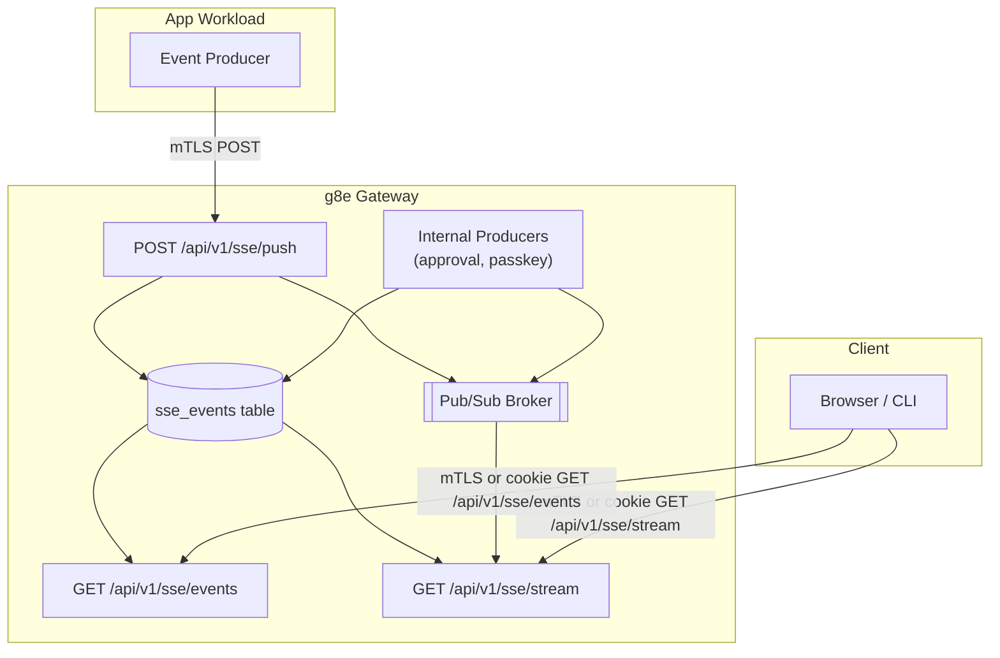

# SSE Streaming

Last Updated: 2026-07-06
Version: v1.3.6

The g8e Gateway includes a built-in Server-Sent Events (SSE) streaming infrastructure that enables real-time event delivery from app workloads to browser and CLI clients. This system allows g8e-compatible agentic ensembles to publish typed events (including audit events) for downstream consumption. The gateway itself also produces SSE events internally for platform workflows such as passkey registration and L3 transaction approval, bypassing the push endpoint and writing directly to the event store and Pub/Sub broker.

---

## Overview

The SSE system provides three endpoints:

- **`POST /api/v1/sse/push`**: App workloads push events (authenticated via mTLS)
- **`GET /api/v1/sse/events`**: Poll for historical events (with `since_id` and `limit` params). Dual auth: mTLS for CLI/operator, web session cookie for browser.
- **`GET /api/v1/sse/stream`**: Real-time SSE stream with live event delivery. Dual auth: mTLS for CLI/operator, web session cookie for browser. All clients (CLI, browser, dashboard) use this single endpoint.

Events are stored in the `sse_events` table and routed by one of three identifiers:
- `web_session_id`: Web UI session events
- `cli_session_id`: CLI / BYO session events
- `user_id`: Background fan-out across every session a user owns

---

## Architecture



---

## Endpoints

### POST /api/v1/sse/push

**Authentication**: mTLS with app workload identity (SPIFFE ID with `/app/` prefix, excluding `g8eo` and `g8eg`)

**Request Body**:
```json
{
  "web_session_id": "string | null",
  "cli_session_id": "string | null",
  "user_id": "string | null",
  "event": {
    "type": "string",
    "data": "any"
  }
}
```

Exactly one of `web_session_id`, `cli_session_id`, or `user_id` must be set.

**Response**:
```json
{
  "success": true,
  "delivered": 1
}
```

**Behavior**:
1. Validates mTLS peer certificate for app workload identity (SPIFFE ID with `/app/` prefix, excluding `g8eo` and `g8eg`).
2. Reads and parses the JSON body; validates that the `event` field is present.
3. Extracts `event.type` for indexing; defaults to `unknown` if absent.
4. Appends the full request body as `payload` to the `sse_events` table with auto-increment ID, `event_type`, and `producer_id` (the caller SPIFFE ID).
5. Enforces producer-to-target ownership. The app identity must be associated with the target session or user. Ownership is verified via `protocol.WorkloadIdentity.MatchesApp` against bound Operator sessions.
6. Publishes the full request body to the Pub/Sub channel for real-time fan-out (channel format: `sse:cli:<id>`, `sse:web:<id>`, or `sse:user:<id>`).
7. Returns success confirmation with delivered count.

### Internal SSE Producers

The gateway itself produces SSE events directly via `SSEEventsAppend` and `pubsub.Publish`, bypassing the push endpoint. These events use `g8eg` as the `producer_id` for attribution. Two internal event types are produced:

- **`approval.completed`**: Emitted by the passkey approval handler in `internal/services/gateway/passkey_service_approvals.go` when a user completes the WebAuthn approval ceremony. Scoped to `user_id` so any waiting CLI client (stdio proxy or approve command) receives real-time notification without polling.
- **`passkey.registered`**: Emitted by the passkey registration handler in `internal/services/gateway/passkey_service_http.go` when a new passkey is enrolled. Scoped to `cli_session_id` so the waiting CLI client receives real-time notification.

Both event types use the `internalSSEPushPayload` wire format for compatibility with the SSE stream handler.

---

### GET /api/v1/sse/events

**Authentication**: Dual auth — mTLS with Operator session (CLI/operator) OR web session cookie (browser). The unified auth middleware classifies this route as `RouteAuthDual`: if a client certificate is present, mTLS auth is used; otherwise, the `web_session` cookie is validated.

**Query Parameters**:
- `web_session_id`: Filter by web session
- `cli_session_id`: Filter by CLI session
- `user_id`: Filter by user
- `since_id`: Return events with ID > since_id (default: 0)
- `limit`: Maximum events to return (default: 200, max: 1000)

**Response**:
```json
{
  "events": [
    {
      "id": 1,
      "web_session_id": "session-123",
      "event_type": "g8e.v1.operator.audit.command.recorded",
      "payload": "{\"type\":\"...\",\"data\":{...}}",
      "created_at": "2026-01-01T00:00:00Z"
    }
  ],
  "count": 1
}
```

Unset routing fields are omitted from the JSON response (the `SSEEventRow` model uses `omitempty` tags on `web_session_id`, `cli_session_id`, and `user_id`).

**Behavior**:
1. Reads auth identity from request context (set by unified auth middleware).
2. Validates authorization for the requested route via `authorizeSSERoute` helper:
   - **mTLS path**: Operator session ownership checks (operator owns the requested `web_session_id` / `cli_session_id` / `user_id`), or CLI user ownership for `cli_session_id` when using CLI mTLS auth.
   - **Cookie path**: Web session ID must match context; for `cli_session_id`, verifies `cliSess.UserID == userID` from context; for `user_id`, verifies `route.UserID == userID` from context.
3. Queries `sse_events` table for events matching route and `since_id`.
4. Returns ordered list (ascending by ID).

---

### GET /api/v1/sse/stream

**Authentication**: Dual auth — mTLS with Operator session (CLI/operator) OR web session cookie (browser). The unified auth middleware classifies this route as `RouteAuthDual`: if a client certificate is present, mTLS auth is used (stronger auth takes precedence); otherwise, the `web_session` cookie is validated. Both auth paths stamp the request context with identity values that the SSE handlers use for authorization. Operator mTLS stamps `ContextKeyOperatorSessionID`; CLI mTLS stamps `ContextKeyUserID` without `ContextKeyOperatorSessionID`; cookie auth stamps `ContextKeyWebSessionID` + `ContextKeyUserID`.

**Query Parameters**:
- `web_session_id`: Filter by web session
- `cli_session_id`: Filter by CLI session
- `user_id`: Filter by user
- `since_id`: Start from event ID (supports `Last-Event-ID` header)

**Response**: SSE stream. Replayed historical events include the `id:` field:
```
id: 1
event: g8e.v1.operator.audit.command.recorded
data: {"type":"...","data":{...}}

id: 2
event: g8e.v1.operator.audit.ai.recorded
data: {"type":"...","data":{...}}
```

Real-time events from Pub/Sub omit the `id:` field:
```
event: g8e.v1.operator.audit.command.recorded
data: {"type":"...","data":{...}}
```

**Behavior**:
1. Reads auth identity from request context (set by unified auth middleware).
2. Validates authorization for the requested route via `authorizeSSERoute` helper (same dual-path ownership checks as events endpoint).
3. Sets SSE response headers: `Content-Type: text/event-stream`, `Cache-Control: no-cache`, `Connection: keep-alive`, `X-Accel-Buffering: no` (for Nginx), and permissive CORS headers based on the request `Origin`.
4. Subscribes to the Pub/Sub channel for real-time events (channel format: `sse:cli:<id>`, `sse:web:<id>`, or `sse:user:<id>`) using a buffered channel of 100 entries. If the buffer is full, incoming events are dropped with a back-pressure warning log.
5. If `since_id` is greater than 0, replays historical events from the `sse_events` table since `since_id` (up to 1000 rows) in SSE format, including the `id:` field for each row. If `since_id` is 0 or absent, no replay occurs and the stream begins with only real-time events.
6. Streams new events as they arrive from Pub/Sub. Real-time events are emitted without an `id:` field; the `event:` field carries the extracted type and the `data:` field carries the full push payload.
7. Sends heartbeat comments every 30 seconds (SSE comment format `: heartbeat\n\n`).

---

## Event Types

The SSE system is generic and supports any event type. Defined audit event types include:

- `g8e.v1.operator.audit.ai.recorded`: AI action audit log.
- `g8e.v1.operator.audit.command.recorded`: Command execution audit log.
- `g8e.v1.operator.audit.direct.command.recorded`: Direct command audit log.
- `g8e.v1.operator.audit.direct.command.result.recorded`: Direct command result audit log.
- `g8e.v1.operator.audit.user.recorded`: User action audit log.
- `g8e.v1.platform.sse.connection.established`: SSE connection established.
- `g8e.v1.platform.sse.connection.opened`: SSE connection opened.
- `g8e.v1.platform.sse.connection.closed`: SSE connection closed.
- `g8e.v1.platform.sse.connection.failed`: SSE connection failed.
- `g8e.v1.platform.sse.connection.error`: SSE connection error.
- `g8e.v1.platform.sse.keepalive.sent`: SSE heartbeat sent.

Gateway-produced event types (not in the protocol catalog):

- `approval.completed`: L3 transaction approval completed. Emitted by the passkey approval handler, scoped to `user_id`.
- `passkey.registered`: Passkey enrollment completed. Emitted by the passkey registration handler, scoped to `cli_session_id`.

See `protocol/constants/events.json` for the complete protocol event type catalog.

---

## Database Schema

The `sse_events` table stores all events:

```sql
CREATE TABLE IF NOT EXISTS sse_events (
    id INTEGER PRIMARY KEY AUTOINCREMENT,
    web_session_id TEXT,
    cli_session_id TEXT,
    user_id TEXT,
    event_type TEXT NOT NULL,
    payload TEXT NOT NULL,
    producer_id TEXT,
    created_at TEXT NOT NULL,
    CHECK (
        (CASE WHEN web_session_id IS NULL THEN 0 ELSE 1 END)
      + (CASE WHEN cli_session_id IS NULL THEN 0 ELSE 1 END)
      + (CASE WHEN user_id        IS NULL THEN 0 ELSE 1 END)
      = 1
    )
);
CREATE INDEX IF NOT EXISTS idx_sse_web ON sse_events(web_session_id, id) WHERE web_session_id IS NOT NULL;
CREATE INDEX IF NOT EXISTS idx_sse_cli ON sse_events(cli_session_id, id) WHERE cli_session_id IS NOT NULL;
CREATE INDEX IF NOT EXISTS idx_sse_user ON sse_events(user_id, id) WHERE user_id IS NOT NULL;
CREATE INDEX IF NOT EXISTS idx_sse_created ON sse_events(created_at);
```

**Constraints**:
- Exactly one of `web_session_id`, `cli_session_id`, or `user_id` must be non-null (enforced by CHECK constraint).
- `producer_id` is the SPIFFE ID of the app workload that produced the event, or `g8eg` for gateway-produced events.
- Events are immutable once written (append-only).

**Important**: SSE event inserts do NOT alter the state root. This is intentional to allow high-frequency event streaming without governance overhead.

---

## Security Model

### Producer Authorization
- Only app workloads with valid mTLS certificates can push events via the `/api/v1/sse/push` endpoint.
- Certificate must have SPIFFE URI SAN with `/app/` prefix.
- Gateway identities (`g8eo`, `g8eg`) are explicitly blocked from pushing via the endpoint.
- Producer identity is recorded in `producer_id` for attribution.
- The app identity must be associated with the target session or user. Ownership is verified via `protocol.WorkloadIdentity.MatchesApp` against bound Operator sessions. The event is appended to the database before the ownership check; if ownership verification fails, the handler returns 403 but the row remains persisted.
- The gateway itself also produces events internally (approval, passkey) by writing directly to the event store and Pub/Sub broker, bypassing the push endpoint. These events use `g8eg` as the `producer_id`.

### Consumer Authorization
- SSE consumer endpoints (`/api/v1/sse/events`, `/api/v1/sse/stream`) support dual auth: mTLS with an authenticated Operator session (CLI/operator) OR web session cookie (browser). The `RouteAuthRegistry` classifies these routes as `RouteAuthDual`.
- When both a client certificate and cookie are present, mTLS takes precedence (stronger auth).
- Authorization is enforced via the `authorizeSSERoute` helper, which reads identity from request context (stamped by the unified auth middleware):
  - **mTLS path** (Operator or CLI session): For `web_session_id`, the Operator session must own the web session. For `cli_session_id`, the Operator session must own the CLI session, or the CLI user must match. For `user_id`, the Operator must belong to the user.
  - **Cookie path** (web session): For `web_session_id`, must match the authenticated session. For `cli_session_id`, verifies `cliSess.UserID == userID` from context. For `user_id`, verifies `route.UserID == userID` from context.
- SSE handlers never extract auth identity from raw TLS state directly; they read from context values stamped by the middleware.
- Multi-tenant isolation is enforced at the database query level.

### Transport Security
- SSE push (`/api/v1/sse/push`) requires mTLS (HTTPS port 8443) with app workload identity.
- SSE consumer endpoints (`/api/v1/sse/events`, `/api/v1/sse/stream`) support dual auth on HTTPS port 8443: mTLS for CLI/operator clients, web session cookie for browser clients.
- Not available on HTTP bootstrap port (8080).
- Pub/Sub channels are scoped to routing targets (format: `sse:cli:<id>`, `sse:web:<id>`, `sse:user:<id>`)

---

## Use Cases

### Real-time Audit Streaming
App workloads can push audit events as they occur, enabling real-time audit log viewers in the web UI or CLI.

```json
POST /api/v1/sse/push
{
  "user_id": "user-123",
  "event": {
    "type": "g8e.v1.operator.audit.command.recorded",
    "data": {
      "command": "ls -la",
      "exit_code": 0,
      "timestamp": "2026-01-01T00:00:00Z"
    }
  }
}
```

### LLM Streaming
g8e-compatible agentic ensembles stream LLM generation chunks to the browser:

```json
POST /api/v1/sse/push
{
  "web_session_id": "session-abc",
  "event": {
    "type": "g8e.v1.ai.llm.chat.iteration.text.chunk.received",
    "data": {
      "chunk": "Hello, "
    }
  }
}
```

### Background Notifications
Fan-out notifications across all user sessions:

```json
POST /api/v1/sse/push
{
  "user_id": "user-123",
  "event": {
    "type": "g8e.v1.platform.notification",
    "data": {
      "message": "Task completed"
    }
  }
}
```

---

## Implementation Details

### Core Files
- `internal/services/gateway/gateway_http_sse.go`: HTTP handlers for SSE endpoints (`handleInternalSSEPush`, `handleInternalSSEEvents`, `handleInternalSSEStream`).
- `internal/services/gateway/sse_event_service.go`: SSE event storage and retrieval service (`SSEEventsAppend`, `SSEEventsListSince`, `SSEEventsListAllSince`, `SSEEventsCleanup`, `SSEEventsWipe`, `SSEEventsCount`).
- `internal/services/gateway/gateway_pubsub.go`: Pub/Sub integration for real-time fan-out (`RegisterHandler`, `Publish`).
- `internal/services/gateway/db_controller.go`: Admin endpoints for SSE event management (`handleSSEEvents`).
- `internal/services/gateway/passkey_service_approvals.go`: Internal SSE producer for `approval.completed` events.
- `internal/services/gateway/passkey_service_http.go`: Internal SSE producer for `passkey.registered` events.
- `internal/services/gateway/db/schema.sql`: Database schema for `sse_events` table.
- `internal/constants/api_paths.go`: API path constants.
- `protocol/constants/events.json`: Protocol event type catalog.
- `internal/models/gateway.go`: SSE event row models (`SSEEventRow`, `SSEPushResponse`, `SSEEventsResponse`, `SSEEventsCountResponse`, `SSEEventsWipeResponse`).
- `internal/cli/sse/client.go`: Reusable SSE client for CLI consumers (`Client`, `NewClient`, `Run`, `ConnectOnce`).

### CLI Consumers

The CLI SSE client in `internal/cli/sse/client.go` connects to the gateway SSE stream, parses frames, and dispatches events to a handler. It supports reconnection with 3-second backoff and custom headers for mTLS session identification. Three CLI consumers use this client:

- `internal/cli/auth/approval_sse.go`: Blocks until an `approval.completed` event with a matching transaction hash arrives, with a 3-minute timeout. Used by the `g8e approve` command and the MCP integration L3 approval flow.
- `internal/cli/auth/passkey_bootstrap.go`: Waits for a `passkey.registered` event during interactive passkey enrollment.
- `internal/cli/tui/adapter.go`: Subscribes to the SSE stream and translates events into TUI messages for the terminal user interface.

### State Root Impact
SSE event inserts are deliberately excluded from state root calculation. The `sse_events` table has no triggers to increment `state_version`, allowing high-frequency event streaming without triggering governance consensus rounds. Events are considered ephemeral telemetry, not governance state.

### Pruning
The `sse_events` table is pruned through two mechanisms:

**Automatic cleanup**: The gateway maintenance loop (`RunMaintenance` in `internal/services/gateway/gateway_db.go`) calls `SSEEventsCleanup` every 30 seconds with a 1-hour retention window. Events older than 1 hour are automatically deleted.

**Manual admin endpoints**:
- `DELETE /api/v1/data/_sse_events`: Admin wipe endpoint (requires mTLS). Deletes all rows and returns the count.
- `GET /api/v1/data/_sse_events/count`: Admin count endpoint (requires mTLS). Returns the total row count.

---

## Best Practices

1. **Event Batching**: For high-frequency events, consider batching before pushing to reduce database load.
2. **Error Handling**: Implement retry logic for failed push operations.
3. **Reconnection**: Clients should support automatic reconnection with `Last-Event-ID` header.
4. **Event Size**: Keep payloads under 1MB to avoid performance issues.
5. **Monitoring**: Monitor `sse_events` table size and growth rate.

---

## See Also
- [Gateway Architecture](./gateway.md): Overall gateway design.
- [Network Architecture](./network.md): mTLS and PKI details.
- [Protocol Constants](../../protocol/constants/events.json): Complete event type catalog.
