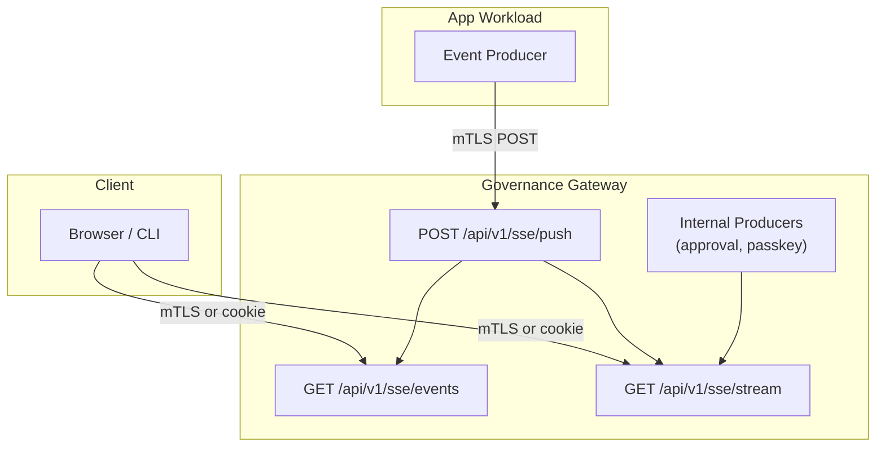

# SSE Streaming

Last Updated: 2026-08-16
Version: v1.7.6

The Governance Gateway provides a Server-Sent Events (SSE) streaming infrastructure that enables real-time event delivery from app workloads to browser and CLI clients. g8e-compatible agentic ensembles publish typed events, including AI chat and lifecycle events, for downstream consumption. The gateway also produces SSE events internally for platform workflows such as passkey registration and L3 transaction approval.

---

## Overview

The SSE system provides three endpoints:

- **`POST /api/v1/sse/push`**: App workloads push events. Requires mTLS with app workload identity.
- **`GET /api/v1/sse/events`**: Poll for historical events. Supports dual auth: mTLS for CLI or operator, web session cookie for browser.
- **`GET /api/v1/sse/stream`**: Real-time SSE stream with live event delivery. Supports dual auth: mTLS for CLI or operator, web session cookie for browser. All clients use this single endpoint.

Every event carries two dimensions: an ownership dimension (`user_id`, always required) and a delivery dimension (exactly one of `web_session_id` or `cli_session_id`). `user_id` alone is not a valid route; it must always be paired with a session identifier.

---

## Architecture

---

## Endpoints

### POST /api/v1/sse/push

**Authentication**: mTLS with app workload identity. The caller certificate must have a SPIFFE URI SAN with an `/app/` prefix. Gateway and Operator identities are blocked from pushing.

**Request**: The body must include `user_id` (required), exactly one of `web_session_id` or `cli_session_id` (required delivery target), and an `event` object containing a `type` string and any payload fields.

**Response**: Returns a success status and a delivered count.

**Authorization**: The app identity must be associated with the target session. Ownership is verified against bound Operator sessions before the event is persisted. If ownership verification fails, the handler returns a 403 Forbidden status and no event is stored.

### Internal SSE Producers

The gateway produces SSE events directly, bypassing the push endpoint. These events use `g8eg` as the producer identifier for attribution. Two internal event types exist:

- **`approval.completed`**: Emitted when a user completes the WebAuthn approval ceremony for an L3 transaction. Scoped to the `cli_session_id` that submitted the transaction, so the waiting CLI client receives real-time notification without polling.
- **`passkey.registered`**: Emitted when a new passkey is enrolled. Scoped to `cli_session_id` so the waiting CLI client receives real-time notification.

### GET /api/v1/sse/events

**Authentication**: Dual auth. If a client certificate is present, mTLS authentication is used. Otherwise, the web session cookie is validated.

**Routing**: The route is built entirely from auth context. For mTLS, `user_id` is derived from the certificate and `cli_session_id` is sent via the `X-G8E-CLI-Session-ID` header. For cookie auth, `web_session_id` is derived from the session cookie. Routing identifiers must not be passed in the URL.

**Query Parameters**:
- `since_id`: Return events with ID greater than this value (default: 0)
- `limit`: Maximum events to return (default: 200, max: 1000)

**Response**: Returns an ordered list of events ascending by ID with count. Unset routing fields are omitted from each event in the response.

**Authorization**: The authenticated identity must own the requested routing target. For mTLS auth, Operator session ownership or CLI user ownership is verified. For cookie auth, the web session ID or CLI session user must match the authenticated identity.

### GET /api/v1/sse/stream

**Authentication**: Dual auth, same as the events endpoint. When both a client certificate and cookie are present, mTLS takes precedence.

**Routing**: Same as the events endpoint. The route is built entirely from auth context, and routing identifiers must not be passed in the URL.

**Query Parameters**:
- `since_id`: Start from event ID (also supports the `Last-Event-ID` header for reconnection)

**Response**: A standard SSE stream (`text/event-stream`). The stream sets `Cache-Control: no-cache`, `Connection: keep-alive`, and `X-Accel-Buffering: no` headers.

**Reconnection**: Clients can resume from a specific cursor using the `Last-Event-ID` header or the `since_id` parameter. A fresh connection without either replays the full backlog. Setting `since_id` to 0 explicitly skips replay and starts with live events only. The stream sends a heartbeat comment every 30 seconds to keep the connection alive. Replayed and live events are deduplicated so a client never receives the same event twice across a reconnect. Replay is capped at 1000 rows; if the backlog exceeds the cap, the gateway emits a `truncated` sentinel so the client can reconnect with a higher cursor.

---

## Event Types

The SSE system is generic and supports any producer-defined event type. The gateway extracts the inner `type` field for indexing and dispatch. The only gateway-defined SSE event type constant is `approval.completed`; `passkey.registered` is emitted by convention. See the [Constants Reference](../../protocol/docs/constants.md) for related platform constants.

---

## Security Model

### Producer Authorization

Only app workloads with valid mTLS certificates can push events. The certificate must have a SPIFFE URI SAN with an `/app/` prefix. Gateway and Operator identities are blocked from pushing. Producer identity is recorded for attribution.

The app identity must be associated with the target session. Ownership is verified against bound Operator sessions before the event is persisted. If ownership verification fails, the handler returns 403 and no event is stored.

### Consumer Authorization

SSE consumer endpoints support dual auth: mTLS with an Operator session or CLI user, or web session cookie for browser access. When both are present, mTLS takes precedence. App workload certificates are rejected from consumer endpoints.

The route is built entirely from auth context, not from URL parameters, so a client cannot read or target another user's event stream. The authenticated identity must own the requested routing target, verified as defense-in-depth on every request.

### Transport Security

- SSE push requires mTLS on HTTPS port 8443 with app workload identity
- SSE consumer endpoints support dual auth on HTTPS port 8443
- Not available on HTTP bootstrap port 8080
- Event delivery channels are scoped to routing targets, preventing cross-session leakage

---

## Use Cases

### Real-time AI Chat Streaming

App workloads push chat and tool-lifecycle events as they occur, enabling real-time viewers in the web UI or CLI. Route to a specific `web_session_id` or `cli_session_id` for targeted delivery.

### L3 Approval Workflow

When a transaction requires L3 notary approval, the gateway suspends it and emits an `approval.completed` event scoped to the `cli_session_id` that submitted the transaction, once the user completes the WebAuthn ceremony. CLI clients subscribe to the SSE stream and resume automatically without polling.

### Passkey Enrollment

During interactive passkey enrollment, the CLI opens the browser console for WebAuthn registration. When enrollment completes, the gateway emits a `passkey.registered` event scoped to `cli_session_id`. The CLI client receives the event in real-time and proceeds.

---

## Event Retention

Events are ephemeral telemetry, not governance state. SSE event inserts do not alter the state root, allowing high-frequency streaming without governance overhead.

**Automatic cleanup**: The gateway maintenance loop prunes events older than 1 hour, running every 30 seconds.

**Admin endpoints**: Administrators can wipe all events or query the total count via authenticated admin endpoints on the data API.

---

## CLI Consumers

The CLI includes a reusable SSE client that connects to the gateway stream, parses frames, and dispatches events to a handler. It supports reconnection with exponential backoff and jitter, capped at 30 seconds, and sends the `Last-Event-ID` header on reconnect for cursor-based replay. Custom headers (such as `X-G8E-CLI-Session-ID`) are set for mTLS session identification.

Three CLI consumers use this client:
- **Approval wait**: Blocks until an `approval.completed` event with a matching transaction hash arrives, with a 3-minute timeout. Used by the `g8e approve` command and the MCP L3 approval flow.
- **Passkey enrollment**: Waits for a `passkey.registered` event during interactive passkey enrollment, with a 5-minute timeout.
- **TUI adapter**: Subscribes to the SSE stream and translates events into terminal UI messages for the dashboard view. Uses a fixed 3-second reconnection interval.

---

## See Also
- [Gateway Architecture](./gateway.md): Overall gateway design.
- [Network Architecture](./network.md): mTLS and PKI details.
- [Constants Reference](../../protocol/docs/constants.md): Platform constant system details.
