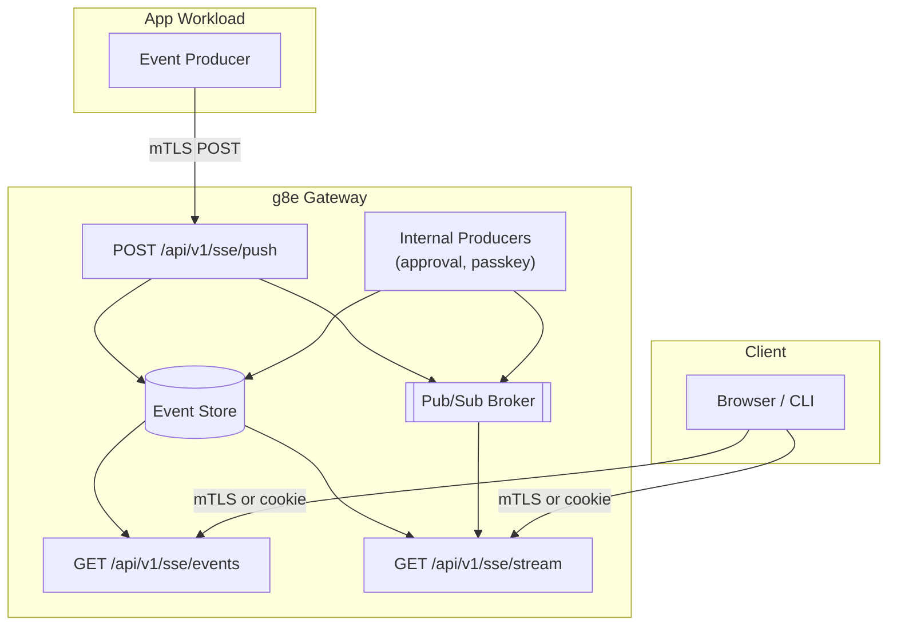

# SSE Streaming

Last Updated: 2026-07-12
Version: v1.3.11

The g8e Gateway provides a Server-Sent Events (SSE) streaming infrastructure that enables real-time event delivery from app workloads to browser and CLI clients. g8e-compatible agentic ensembles publish typed events, including audit events, for downstream consumption. The gateway also produces SSE events internally for platform workflows such as passkey registration and L3 transaction approval.

---

## Overview

The SSE system provides three endpoints:

- **`POST /api/v1/sse/push`**: App workloads push events. Requires mTLS with app workload identity.
- **`GET /api/v1/sse/events`**: Poll for historical events. Supports dual auth: mTLS for CLI/operator, web session cookie for browser.
- **`GET /api/v1/sse/stream`**: Real-time SSE stream with live event delivery. Supports dual auth: mTLS for CLI/operator, web session cookie for browser. All clients (CLI, browser, dashboard) use this single endpoint.

Events are routed by one of three identifiers:
- `web_session_id`: Web UI session events
- `cli_session_id`: CLI or BYO session events
- `user_id`: Background fan-out across every session a user owns

Exactly one routing identifier must be set per event. The gateway enforces this at the type level so a `web_session_id` can never be mis-delivered as a `cli_session_id` or vice versa.

---

## Architecture

---

## Endpoints

### POST /api/v1/sse/push

**Authentication**: mTLS with app workload identity. The caller certificate must have a SPIFFE URI SAN with an `/app/` prefix. Gateway and Operator identities are blocked from pushing.

**Request**: The body must include exactly one routing identifier (`web_session_id`, `cli_session_id`, or `user_id`) and an `event` object containing a `type` string and arbitrary `data`.

**Response**: Returns a success boolean and delivered count.

**Authorization**: The app identity must be associated with the target session or user. Ownership is verified against bound Operator sessions. If ownership verification fails, the event is still persisted but the handler returns 403.

**Pub/Sub**: On success, the full request body is published to the appropriate channel for real-time fan-out.

### Internal SSE Producers

The gateway produces SSE events directly, bypassing the push endpoint. These events use `g8eg` as the producer ID for attribution. Two internal event types exist:

- **`approval.completed`**: Emitted when a user completes the WebAuthn approval ceremony for an L3 transaction. Scoped to `user_id` so any waiting CLI client receives real-time notification without polling.
- **`passkey.registered`**: Emitted when a new passkey is enrolled. Scoped to `cli_session_id` so the waiting CLI client receives real-time notification.

### GET /api/v1/sse/events

**Authentication**: Dual auth. If a client certificate is present, mTLS auth is used. Otherwise, the `web_session` cookie is validated.

**Query Parameters**:
- `web_session_id`, `cli_session_id`, or `user_id`: Filter by routing target (exactly one required)
- `since_id`: Return events with ID greater than this value (default: 0)
- `limit`: Maximum events to return (default: 200, max: 1000)

**Response**: Returns an ordered list of events (ascending by ID) with count. Unset routing fields are omitted from each event in the response.

**Authorization**: The authenticated identity must own the requested routing target. For mTLS auth, Operator session ownership or CLI user ownership is verified. For cookie auth, the web session ID, CLI session user, or user ID must match the authenticated identity.

### GET /api/v1/sse/stream

**Authentication**: Dual auth, same as the events endpoint. When both a client certificate and cookie are present, mTLS takes precedence.

**Query Parameters**:
- `web_session_id`, `cli_session_id`, or `user_id`: Filter by routing target (exactly one required)
- `since_id`: Start from event ID (also supports the `Last-Event-ID` header for reconnection)

**Response**: A standard SSE stream (`text/event-stream`). The stream sets `Cache-Control: no-cache`, `Connection: keep-alive`, and `X-Accel-Buffering: no` headers.

**Replay**: If `since_id` is greater than 0, historical events are replayed from the event store (up to 1000 rows) before live streaming begins. Each replayed event includes an `id:` field. If `since_id` is 0 or absent, the stream starts with only real-time events.

**Live events**: Real-time events from Pub/Sub are emitted without an `id:` field. The `event:` field carries the event type and the `data:` field carries the full push payload.

**Heartbeat**: The stream sends a heartbeat comment every 30 seconds to keep the connection alive.

**Back-pressure**: The stream uses a buffered channel of 100 entries. If the buffer is full, incoming events are dropped with a warning log.

---

## Event Types

The SSE system is generic and supports any event type. Protocol-defined audit event types include:

- `g8e.v1.operator.audit.ai.recorded`: AI action audit log
- `g8e.v1.operator.audit.command.recorded`: Command execution audit log
- `g8e.v1.operator.audit.direct.command.recorded`: Direct command audit log
- `g8e.v1.operator.audit.direct.command.result.recorded`: Direct command result audit log
- `g8e.v1.operator.audit.user.recorded`: User action audit log

Platform SSE lifecycle event types:

- `g8e.v1.platform.sse.connection.established`
- `g8e.v1.platform.sse.connection.opened`
- `g8e.v1.platform.sse.connection.closed`
- `g8e.v1.platform.sse.connection.failed`
- `g8e.v1.platform.sse.connection.error`
- `g8e.v1.platform.sse.keepalive.sent`

Gateway-produced event types (not in the protocol catalog):

- `approval.completed`: L3 transaction approval completed, scoped to `user_id`
- `passkey.registered`: Passkey enrollment completed, scoped to `cli_session_id`

See the [Protocol Event Catalog](../../protocol/constants/events.json) for the complete event type listing.

---

## Security Model

### Producer Authorization

Only app workloads with valid mTLS certificates can push events. The certificate must have a SPIFFE URI SAN with an `/app/` prefix. Gateway and Operator identities are blocked from pushing. Producer identity is recorded for attribution.

The app identity must be associated with the target session or user. The event is appended to the store before the ownership check; if ownership fails, the handler returns 403 but the row remains persisted. The gateway also produces events internally (approval, passkey) by writing directly to the event store and Pub/Sub broker.

### Consumer Authorization

SSE consumer endpoints support dual auth: mTLS with an Operator session, or web session cookie for browser access. When both are present, mTLS takes precedence.

Authorization is enforced per routing target:
- **mTLS path**: For `web_session_id`, the Operator session must own the web session. For `cli_session_id`, the Operator session must own the CLI session, or the CLI user must match. For `user_id`, the Operator must belong to the user.
- **Cookie path**: For `web_session_id`, the session must match. For `cli_session_id`, the CLI session user must match. For `user_id`, the user must match.

Multi-tenant isolation is enforced at the query level.

### Transport Security

- SSE push requires mTLS on HTTPS port 8443 with app workload identity
- SSE consumer endpoints support dual auth on HTTPS port 8443
- Not available on HTTP bootstrap port 8080
- Pub/Sub channels are scoped to routing targets

---

## Use Cases

### Real-time Audit Streaming

App workloads push audit events as they occur, enabling real-time audit log viewers in the web UI or CLI. Route to `user_id` for fan-out across all user sessions, or to a specific session for targeted delivery.

### LLM Streaming

g8e-compatible agentic ensembles stream LLM generation chunks to the browser by pushing events scoped to `web_session_id`. The browser SSE consumer renders chunks as they arrive.

### Background Notifications

Fan-out notifications across all user sessions by routing to `user_id`. Every active stream for that user receives the event in real-time.

### L3 Approval Workflow

When a transaction requires L3 notary approval, the gateway suspends it and emits an `approval.completed` event scoped to `user_id` once the user completes the WebAuthn ceremony. CLI clients subscribe to the SSE stream and resume automatically without polling.

### Passkey Enrollment

During interactive passkey enrollment, the CLI opens the browser console for WebAuthn registration. When enrollment completes, the gateway emits a `passkey.registered` event scoped to `cli_session_id`. The CLI client receives the event in real-time and proceeds.

---

## Event Retention

Events are ephemeral telemetry, not governance state. SSE event inserts do not alter the state root, allowing high-frequency streaming without governance overhead.

**Automatic cleanup**: The gateway maintenance loop prunes events older than 1 hour, running every 30 seconds.

**Admin endpoints**: Administrators can wipe all events or query the total count via mTLS-authenticated admin endpoints on the data API.

---

## CLI Consumers

The CLI includes a reusable SSE client that connects to the gateway stream, parses frames, and dispatches events to a handler. It supports reconnection with 3-second backoff and custom headers for mTLS session identification.

Three CLI consumers use this client:
- **Approval wait**: Blocks until an `approval.completed` event with a matching transaction hash arrives, with a 3-minute timeout. Used by the `g8e approve` command and the MCP L3 approval flow.
- **Passkey enrollment**: Waits for a `passkey.registered` event during interactive passkey enrollment, with a 5-minute timeout.
- **TUI adapter**: Subscribes to the SSE stream and translates events into terminal UI messages for the dashboard view.

---

## Best Practices

1. **Event batching**: For high-frequency events, consider batching before pushing to reduce database load.
2. **Error handling**: Implement retry logic for failed push operations.
3. **Reconnection**: Clients should support automatic reconnection with `Last-Event-ID` header.
4. **Event size**: Keep payloads under 1MB to avoid performance issues.
5. **Monitoring**: Monitor event store size and growth rate.

---

## See Also
- [Gateway Architecture](./gateway.md): Overall gateway design.
- [Network Architecture](./network.md): mTLS and PKI details.
- [Protocol Event Catalog](../../protocol/constants/events.json): Complete event type listing.
