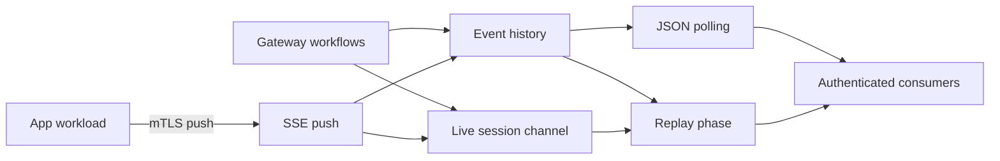

# SSE Streaming

Last Updated: 2026-09-23
Version: v2.1.12

The Governance Gateway provides a Server-Sent Events (SSE) bridge for session-targeted application telemetry and platform workflow notifications. App workloads publish events over authenticated HTTPS, and browser, CLI, Operator, and test clients consume a session-scoped event history by polling or by opening a live stream. The Gateway also publishes completion events for passkey enrollment and L3 approval without calling its public push endpoint.

## Scope

SSE events are delivery telemetry, not governance state. Publishing an event does not create a `GovernanceEnvelope`, run the five-layer interlock, authorize a mutation, or change the Gateway state root. An event may describe a governed workflow, but authoritative outcomes remain in signed receipts and the relevant platform records.

The Gateway exposes three SSE surfaces:

- **`POST /api/v1/sse/push`** accepts an event from an authenticated app workload.
- **`GET /api/v1/sse/events`** returns stored events as a finite JSON response.
- **`GET /api/v1/sse/stream`** replays stored events and then remains open for live delivery.

The Gateway also exposes two observe producer endpoints that accept typed agent and run state projections from mTLS-authenticated app workloads:

- **`POST /api/v1/observe/producer/agent-state`** accepts a typed `ObserveProducerAgentStateRequest`, persists the agent projection, and emits an `app.agent.status.updated` SSE event after successful persistence.
- **`POST /api/v1/observe/producer/run-state`** accepts a typed `ObserveProducerRunStateRequest`, persists the run projection, and emits an `app.run.status.updated` SSE event after successful persistence.

The in-process `ObserveProducerService` emits the live `g8e.v1.ai.eval.*` campaign event family (`ai.eval.cycle.started`, `ai.eval.cycle.completed`, `ai.eval.assignment.started`, `ai.eval.assignment.completed`, `ai.eval.model_role.invoked`, `ai.eval.metric.available`, `ai.eval.verifier.completed`, `ai.eval.proof.available`, `ai.eval.publication.completed`, `ai.eval.heartbeat`, and `ai.eval.stop.requested`). State projection methods persist before publishing; `ai.eval.metric.available` is event-only and its metric projection is not persisted separately. Gateway live tests verify these emissions. Campaign `--publish` additionally exports signed public-safe projections through `POST /api/v1/public-feed/batches` for the anonymous mirror SSE relay; see [Public Spectator Architecture](./public_spectator.md).

Both HTTP producer endpoints require mTLS app-workload authentication (never browser-accessible), enforce strict JSON decoding with unknown-field rejection, validate the supported schema version, required display/role/run-kind fields, recognized lifecycle statuses even on first write, non-negative task counters, completed-tasks-not-exceeding-total, and coherent start/end times. The Gateway derives `user_id` from the mTLS peer certificate; the request body carries no `user_id` field and cannot override the authenticated identity. Exactly one of `web_session_id` or `cli_session_id` is required for routing; supplying both or neither is rejected at the Gateway boundary.

Every accepted event has two routing dimensions: `user_id` identifies the owning user, and exactly one of `web_session_id` or `cli_session_id` identifies the delivery target. A user ID without a session target is not a valid Gateway route, and the Gateway does not provide user-wide fan-out.

## Architecture

The Gateway persists an accepted event before publishing it to the live session channel. A stream subscribes to that channel before reading history, then suppresses a live event when the same row was already emitted during replay. This ordering closes the gap between replay and live subscription for events published while a connection is starting.

## Publishing Events

### Authentication and authorization

The push surface requires a verified mTLS client certificate for an enrolled app workload. The certificate must contain an app SPIFFE URI SAN. The handler accepts app identities under `/app/` except the reserved Gateway and Operator identities (`/app/g8eg` and `/app/g8eo`); Gateway and Operator certificates are not accepted as external producers.

The Gateway authorizes non-ensemble producers against the target session before storing an event. A web target must be bound to an Operator associated with the app identity. A CLI target must resolve to a CLI session whose Operator is associated with the app identity. The first-party ensemble identity, `spiffe://g8e.local/app/g8ee`, acts as the centralized event broker and bypasses this per-Operator target check after normal app authentication succeeds.

The producer supplies `user_id` as part of the route. The push path requires it but does not independently compare it with the user recorded on the target session. Replay queries match both the authenticated user and the session, while live fan-out uses the authorized session channel. Producers must therefore derive both routing dimensions from the same authenticated request context.

### Event envelope and acknowledgement

A push contains the route and an `event` JSON value. Typed producers place a string `type` inside `event`; the Gateway indexes that value as the event type and stores the complete push envelope as the payload delivered to consumers. If the inner type is absent or unreadable, the Gateway accepts the non-empty event value and indexes it as `unknown`.

A successful push returns `success: true` and `delivered: 1`. This count acknowledges one accepted, persisted, and published event. It is not a count of active listeners, and a push succeeds when no consumer is connected because the stored event remains available for replay.

## Consuming Events

### Authentication and routing

The polling and streaming surfaces use the same dual authentication policy:

- A browser presents the secure web-session cookie. The Gateway derives both the user and web session from that cookie.
- A CLI presents its mTLS certificate and sends `X-G8E-CLI-Session-ID`. The Gateway validates the certificate, active CLI session, user, and certificate-to-session binding.
- An Operator presents its mTLS certificate and can select an owned CLI or web target with the corresponding session header. The Gateway verifies the target belongs to that Operator session.

When a request presents both a client certificate and a cookie, mTLS takes precedence. An invalid presented certificate does not fall back to cookie authentication. App certificates cannot consume SSE events.

Routing identifiers in URL query parameters are ignored. The Gateway constructs the route from authenticated context and then verifies user and session ownership before polling history or opening a stream.

### Polling stored events

`GET /api/v1/sse/events` returns rows with IDs greater than `since_id`, ordered by ascending ID. `since_id` defaults to `0`. `limit` defaults to `200`; values at or below zero or above `1000` also use the default.

Each row includes its ID, user ID, populated session target, indexed event type, stored payload, and creation timestamp. The payload is a JSON string containing the complete push envelope. Polling does not delete or acknowledge rows.

### Streaming and framing

`GET /api/v1/sse/stream` responds with `text/event-stream`, disables response caching and proxy buffering, and keeps the connection open until the request is cancelled or a write fails. It flushes response headers immediately and sends a heartbeat comment every 30 seconds.

Each normal event frame contains an `id` field with the persisted row ID and a `data` field with the complete push envelope. The Gateway does not emit an SSE `event` field, so consumers read the application event type from the nested `event.type` value in the JSON data. Heartbeats are comments and do not advance the event cursor.

### Replay and reconnection

The stream chooses its initial replay cursor as follows:

1. `Last-Event-ID` takes precedence when present, including when its value is `0`.
2. Otherwise, a positive `since_id` replays rows after that ID.
3. With neither value present, a new connection replays retained history from the beginning.
4. An explicit `since_id=0` without `Last-Event-ID` requests live-only delivery and skips history.

Replay returns at most 1,000 rows per connection. When a replay returns exactly 1,000 rows, the Gateway sends an unnumbered `truncated` sentinel containing the last emitted ID and replay limit; more retained history may remain. If the history query fails, the Gateway sends an unnumbered `error` sentinel with reason `replay_failed` and continues with live delivery.

The Gateway deduplicates the replay and live phases of one connection by row ID. The reusable Go SSE client also records the last received row ID and sends it as `Last-Event-ID` after a disconnect, which prevents normal reconnects from replaying an already handled event.

### Backpressure

Each live stream has a 100-event in-memory queue. If a connected consumer falls behind, the Gateway drops the oldest queued live event rather than blocking publishers. The persisted copy remains eligible for a later cursor-based replay until retention cleanup removes it, but the Gateway does not automatically backfill a dropped event on the same connection.

## Gateway-Produced Events

The Gateway writes internal events directly to the same history and live-delivery paths. Passkey enrollment and approval events record `g8eg` as the producer. Observe projection events record `g8e-gateway-observe-producer`; HTTP app pushes record the authenticated app SPIFFE ID.

- **`approval.completed`** is emitted after the WebAuthn ceremony resumes an L3 transaction. It targets the CLI session that submitted the transaction and includes the transaction hash and resumed-receipt reference when available.
- **`passkey.registered`** is emitted after CLI-initiated passkey enrollment succeeds. It targets the CLI session associated with the enrollment token.

`approval.completed` is the gateway-defined event type in the constants registry. `passkey.registered` is an implemented convention rather than a registered SSE constant. App workloads may define additional event types; see [Ensemble SSE](../ensemble/sse.md) for the first-party producer pipeline.

## Observe State Producers

The Gateway exposes two mTLS-authenticated producer endpoints that accept typed agent and run state projections from app workloads. These endpoints persist the projection and emit the corresponding SSE event after successful persistence (persist-before-publish ordering). A failed write cannot produce an SSE row or live publication.

### Agent state producer

`POST /api/v1/observe/producer/agent-state` accepts a typed `ObserveProducerAgentStateRequest` containing the schema version, agent ID, display name, role, lifecycle status, optional run ID, optional task ID, optional model, observed-at timestamp, and exactly one routing target (`web_session_id` or `cli_session_id`). The Gateway derives `user_id` from the mTLS peer certificate; the request body carries no `user_id` field.

The controller validates the supported schema version, non-empty display name and role, recognized agent status even on first write, and strict JSON decoding (unknown fields and trailing JSON are rejected). The service validates the transition against the authoritative status map and rejects stale updates. On success, the Gateway persists the agent projection, emits an `app.agent.status.updated` SSE event with the typed payload, and returns `{ "accepted": true }`.

### Run state producer

`POST /api/v1/observe/producer/run-state` accepts a typed `ObserveProducerRunStateRequest` containing the schema version, run ID, run kind, display name, lifecycle status, optional active task ID, completed and total task counts, optional started-at and ended-at timestamps, observed-at timestamp, and exactly one routing target. The Gateway derives `user_id` from the mTLS peer certificate.

The controller validates the supported schema version, non-empty display name, recognized run kind and run status even on first write, non-negative task counters, completed tasks not exceeding total tasks, and end time not preceding start time. The service validates the transition and rejects stale updates. On success, the Gateway persists the run projection, emits an `app.run.status.updated` SSE event with the typed payload, and returns `{ "accepted": true }`.

### First-write validation

A first write (no existing projection) relaxes the source-state requirement but does not relax target enum validation. The transition validator accepts a first write only when the target status is a member of the authoritative status map. This prevents an unknown status string from establishing a projection through the first-write path.

### Ownership and disclosure

Both producer endpoints map ownership mismatch to a non-disclosing 403 response. The agent and run ownership sentinels (`ErrObserveAgentNotFound`, `ErrObserveRunNotFound`) are distinct typed errors internally but map to the same HTTP response so the boundary does not disclose record existence. The request contract contains no `user_id` field; unknown identity fields are rejected by strict decoding.

### Browser read surface

The browser-scoped observe read API (`GET /api/v1/observe/bootstrap`, `GET /api/v1/observe/runs`, `GET /api/v1/observe/evals`, etc.) returns the persisted projections with no ownership field in the wire response. A browser session can read only its own user's projections. The SSE stream carries the nested typed `app.agent.status.updated`, `app.run.status.updated`, and `g8e.v1.ai.eval.*` envelopes to the authenticated session.

### Event dashboard classification

The protocol registry (`protocol/constants/event_dashboard_classification.json`) classifies event families for browser observability. The current registry marks `g8e.v1.app.run` and `g8e.v1.ai.eval` as `produced_to_sse` and `dashboard_safe`. Agent/run HTTP producers and the in-process evaluation observe producer are the registered production paths for those families. Reserved contracts `ai.eval.run.completed` and `ai.eval.metric.recorded` remain typed payloads without a native evaluation producer. See [Protocol Library](./protocol.md) for the full inventory.

## Retention and Administration

The Gateway stores SSE history in its canonical SQLite database. The maintenance loop runs every 30 seconds and removes events older than one hour. This history supports short reconnect windows and is not a durable audit record.

The mTLS-authenticated data API exposes an event count and a full wipe operation under the `_sse_events` collection. These operations act across all routes and are separate from the session-scoped consumer surfaces.

## Client Behavior

The reusable Go SSE client parses `id`, `event`, and `data` fields even though the Gateway currently emits only `id` and `data` for normal events. It reconnects after errors with exponential backoff and jitter capped at 30 seconds, resets accumulated backoff after a connection delivers an event, and sends the last row ID on reconnect.

Current CLI integrations use the stream in these ways:

- **L3 approval** requests live-only delivery, waits up to three minutes for a matching `approval.completed` transaction hash, then verifies the approval status. The `g8e approve` flow, MCP stdio bridge, and agent harness use this pattern; there is no polling fallback in the CLI flow.
- **Passkey enrollment** establishes a live-only stream before opening the browser, filters by event type, user, and CLI session, and waits up to five minutes.
- **TUI telemetry** translates known event families into terminal messages and retries failed connections after a fixed three-second delay while retaining the cursor in the shared SSE client.

### Current dashboard integration constraint

The Gateway stream supports credentialed browser `EventSource` connections through the web-session cookie, including cross-origin credentials when the dashboard origin is allowed by Gateway CORS configuration. The current in-tree dashboard client (`dashboard/public/js/`) does not use that contract correctly: it creates `EventSource` with the relative polling path `/api/v1/sse/events`, while the Gateway's live SSE path is `/api/v1/sse/stream`. It also expects a top-level application `type` and `data`, while Gateway stream frames carry the complete push envelope with the application event nested under `event`.

As a result, the current in-tree dashboard browser client does not establish a functional direct Gateway stream without integration changes. Its relative URL also requires the dashboard origin to proxy the Gateway path or otherwise expose it at the same origin. The audited `g8e-adapter` package at `dashboard/g8e-adapter/` implements the correct contract (absolute configured origin, `/api/v1/sse/stream`, nested envelope parsing, `withCredentials: true`) and is the canonical browser SSE integration core for generated observe frontends. See [Dashboard SSE](../dashboard/sse.md) for the in-tree dashboard connection lifecycle and URL constraint, and [Generator-Neutral Builder Guide](../guides/build_observe_frontend.md) for the audited adapter.

## Security Properties and Limits

- All SSE surfaces are served on the configured HTTPS listener, which defaults to port 8443. Requests for these paths on the plain HTTP listener are redirected to HTTPS.
- TLS verifies a client certificate when one is presented. Route authentication then requires mTLS for producers and accepts either mTLS or a validated web-session cookie for consumers.
- Consumer routes come only from authenticated context, and stored-event queries match both user and session.
- Live channels are scoped by session type and ID, which keeps web and CLI namespaces separate.
- Producer authorization occurs before persistence, so a rejected push cannot later appear through replay.
- SSE delivery is telemetry. It is bounded by retention, live-buffer capacity, and client connectivity, and it does not replace signed receipts or durable application records.

## See Also

- [Gateway Architecture](./gateway.md): Gateway services and protocol surfaces.
- [Authentication and Authorization](./auth.md): mTLS identities, CLI sessions, web sessions, and app policies.
- [Network Architecture](./network.md): TLS listeners, PKI, and cross-component transport.
- [Ensemble SSE](../ensemble/sse.md): First-party event production and application event types.
- [Dashboard SSE](../dashboard/sse.md): Browser connection lifecycle and current integration constraints.
- [Generator-Neutral Builder Guide](../guides/build_observe_frontend.md): The audited g8e-adapter and contract pack for generated observe frontends.
- [Public Spectator Architecture and Threat Model](./public_spectator.md): The separate anonymous public-mirror SSE relay and outbound-only export architecture.
- [AI Agents and the Governance Boundary](./agents.md): Distinction between event telemetry and governed execution.
- [Evaluations](./evals.md): Model campaign evidence and observe publication.
- [Constants Reference](../../protocol/docs/constants.md): Canonical endpoint and event constants.
