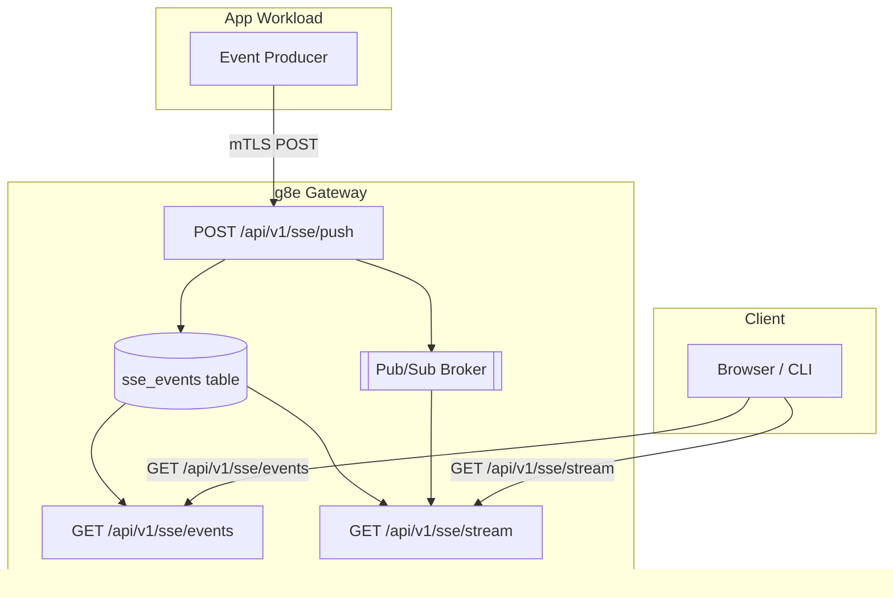

# SSE Streaming

The g8e Gateway includes a built-in Server-Sent Events (SSE) streaming infrastructure that enables real-time event delivery from app workloads to browser and CLI clients. This system is designed for g8e-compatible agentic ensembles to publish typed events (including audit events) for downstream consumption.

---

## Overview

The SSE system provides three core endpoints:

- **`POST /api/v1/sse/push`** - App workloads push events (authenticated via mTLS)
- **`GET /api/v1/sse/events`** - Poll for historical events (with `since_id` and `limit` params)
- **`GET /api/v1/sse/stream`** - Real-time SSE stream with live event delivery

Events are stored in the `sse_events` table and routed by one of three identifiers:
- `web_session_id` - Web UI session events
- `cli_session_id` - CLI / BYO session events
- `user_id` - Background fan-out across every session a user owns

---

## Architecture



---

## Endpoints

### POST /api/v1/sse/push

**Authentication**: mTLS with app workload identity (SPIFFE ID with `/app/` prefix, excluding `g8eo` and `g8eg`)

**Request Body**:
```json
{
  "web_session_id": "string | null",
  "cli_session_id": "string | null",
  "user_id": "string | null",
  "event": {
    "type": "string",
    "data": "any"
  }
}
```

Exactly one of `web_session_id`, `cli_session_id`, or `user_id` must be set.

**Response**:
```json
{
  "success": true,
  "delivered": 1
}
```

**Behavior**:
1. Validates mTLS peer certificate for app workload identity (SPIFFE ID with `/app/` prefix, excluding `g8eo` and `g8eg`)
2. Validates route (exactly one routing target set)
3. Enforces producer-to-target ownership (app identity must be associated with the target session)
4. Appends event to `sse_events` table with auto-increment ID and producer_id
5. Publishes event to Pub/Sub channel for real-time fan-out
6. Returns success confirmation

---

### GET /api/v1/sse/events

**Authentication**: mTLS with Operator session

**Query Parameters**:
- `web_session_id` - Filter by web session
- `cli_session_id` - Filter by CLI session
- `user_id` - Filter by user
- `since_id` - Return events with ID > since_id (default: 0)
- `limit` - Maximum events to return (default: 200, max: 1000)

**Response**:
```json
{
  "events": [
    {
      "id": 1,
      "web_session_id": "session-123",
      "cli_session_id": null,
      "user_id": null,
      "event_type": "g8e.v1.operator.audit.command.recorded",
      "payload": "{\"type\":\"...\",\"data\":{...}}",
      "created_at": "2026-01-01T00:00:00Z"
    }
  ],
  "count": 1
}
```

**Behavior**:
1. Validates Operator session authorization for requested route
2. Queries `sse_events` table for events matching route and since_id
3. Returns ordered list (ascending by ID)

---

### GET /api/v1/sse/stream

**Authentication**: mTLS with Operator session

**Query Parameters**:
- `web_session_id` - Filter by web session
- `cli_session_id` - Filter by CLI session
- `user_id` - Filter by user
- `since_id` - Start from event ID (supports `Last-Event-ID` header)

**Response**: SSE stream with format:
```
id: 1
event: g8e.v1.operator.audit.command.recorded
data: {"type":"...","data":{...}}

id: 2
event: g8e.v1.operator.audit.ai.recorded
data: {"type":"...","data":{...}}
```

**Behavior**:
1. Validates Operator session authorization for requested route
2. Flushes historical events since `since_id` in SSE format
3. Subscribes to Pub/Sub channel for real-time events
4. Streams new events as they arrive
5. Sends keepalive comments every 30 seconds (SSE comment format `: heartbeat\n\n`)

---

## Event Types

The SSE system is generic and supports any event type. Defined audit event types include:

### Operator Audit Events
- `g8e.v1.operator.audit.ai.recorded` - AI action audit log
- `g8e.v1.operator.audit.command.recorded` - Command execution audit log
- `g8e.v1.operator.audit.direct.command.recorded` - Direct command audit log
- `g8e.v1.operator.audit.direct.command.result.recorded` - Direct command result audit log
- `g8e.v1.operator.audit.user.recorded` - User action audit log
- `g8e.v1.operator.audit.mcp.call.recorded` - MCP call audit log

### Platform Events
- `g8e.v1.platform.sse.connection.established` - SSE connection established
- `g8e.v1.platform.sse.connection.opened` - SSE connection opened
- `g8e.v1.platform.sse.connection.closed` - SSE connection closed
- `g8e.v1.platform.sse.connection.failed` - SSE connection failed
- `g8e.v1.platform.sse.connection.error` - SSE connection error
- `g8e.v1.platform.sse.keepalive.sent` - SSE keepalive sent

See `protocol/constants/events.json` for the complete event type catalog.

---

## Database Schema

The `sse_events` table stores all events:

```sql
CREATE TABLE sse_events (
    id INTEGER PRIMARY KEY AUTOINCREMENT,
    web_session_id TEXT,
    cli_session_id TEXT,
    user_id TEXT,
    event_type TEXT NOT NULL,
    payload TEXT NOT NULL,
    producer_id TEXT,
    created_at TEXT NOT NULL
);
```

**Constraints**:
- Exactly one of `web_session_id`, `cli_session_id`, or `user_id` must be non-null
- `producer_id` is the SPIFFE ID of the app workload that produced the event
- Events are immutable once written (append-only)

**Important**: SSE event inserts do NOT alter the state root. This is intentional to allow high-frequency event streaming without governance overhead.

---

## Security Model

### Producer Authorization
- Only app workloads with valid mTLS certificates can push events
- Certificate must have SPIFFE URI SAN with `/app/` prefix
- Gateway identities (`g8eo`, `g8eg`) are explicitly blocked from pushing
- Producer identity is recorded in `producer_id` for attribution

### Consumer Authorization
- Only authenticated Operator sessions can consume events
- Operator must be authorized for the requested route:
  - For `web_session_id`: Must own the web session
  - For `cli_session_id`: Must own the CLI session
  - For `user_id`: Must be the user
- Multi-tenant isolation enforced at the database query level

### Transport Security
- All SSE endpoints require mTLS (HTTPS port 8443)
- Not available on HTTP bootstrap port (8080)
- Pub/Sub channels are scoped to routing targets

---

## Use Cases

### Real-time Audit Streaming
App workloads can push audit events as they occur, enabling real-time audit log viewers in the web UI or CLI.

```json
POST /api/v1/sse/push
{
  "user_id": "user-123",
  "event": {
    "type": "g8e.v1.operator.audit.command.recorded",
    "data": {
      "command": "ls -la",
      "exit_code": 0,
      "timestamp": "2026-01-01T00:00:00Z"
    }
  }
}
```

### LLM Streaming
g8e-compatible agentic ensembles stream LLM generation chunks to the browser:

```json
POST /api/v1/sse/push
{
  "web_session_id": "session-abc",
  "event": {
    "type": "g8e.v1.ai.llm.chat.iteration.text.chunk.received",
    "data": {
      "chunk": "Hello, "
    }
  }
}
```

### Background Notifications
Fan-out notifications across all user sessions:

```json
POST /api/v1/sse/push
{
  "user_id": "user-123",
  "event": {
    "type": "g8e.v1.platform.notification",
    "data": {
      "message": "Task completed"
    }
  }
}
```

---

## Implementation Details

### Core Files
- `internal/services/gateway/gateway_http.go` - HTTP handlers for SSE endpoints (`handleInternalSSEPush`, `handleInternalSSEEvents`, `handleInternalSSEStream`)
- `internal/services/gateway/gateway_db.go` - Database operations (`SSEEventsAppend`, `SSEEventsListSince`, `SSEEventsWipe`, `SSEEventsCount`)
- `internal/services/gateway/gateway_pubsub.go` - Pub/Sub integration for real-time fan-out (`RegisterHandler`, `Publish`)
- `internal/services/gateway/db_controller.go` - Admin endpoints for SSE event management (`handleSSEEvents`)
- `internal/constants/api_paths.go` - API path constants
- `internal/constants/events.go` - Event type constants

### State Root Impact
SSE event inserts are deliberately excluded from state root calculation. This allows high-frequency event streaming without triggering governance consensus rounds. Events are considered ephemeral telemetry, not governance state.

### Pruning
The `sse_events` table can be pruned via:
- `DELETE /api/v1/data/_sse_events` - Admin wipe endpoint (requires mTLS)
- `GET /api/v1/data/_sse_events/count` - Admin count endpoint (requires mTLS)
- Direct database operations (not recommended in production)

Consider implementing time-based retention policies for production deployments.

---

## Best Practices

1. **Event Batching**: For high-frequency events, consider batching before pushing to reduce database load
2. **Error Handling**: Implement retry logic for failed push operations
3. **Reconnection**: Clients should support automatic reconnection with `Last-Event-ID` header
4. **Event Size**: Keep payloads under 1MB to avoid performance issues
5. **Monitoring**: Monitor `sse_events` table size and growth rate

---

## See Also
- [Gateway Architecture](./gateway.md) - Overall gateway design
- [Network Architecture](./network.md) - mTLS and PKI details
- [Protocol Constants](../../protocol/constants/events.json) - Complete event type catalog
