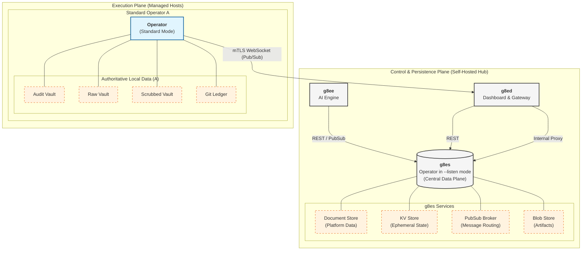

# Data Storage Architecture

This document is the deep-reference storage guide for the g8e platform. It covers exact storage topology, SQLite schemas, document model fields, KV key namespaces, cache-aside mechanics, vault encryption internals, data flows, and retention policies. It is the single authoritative source for all storage implementation details.

For high-level storage summaries, see the component docs and follow the links back here.

---

## Platform Storage Overview

The g8e platform uses an **operator-first** storage philosophy. The Operator (g8eo) is the authoritative system of record for all operational data — command outputs, file mutations, and session history. Platform components (g8ee, g8ed) are **stateless** with respect to persistent data: they hold no databases of their own and rely entirely on g8es for all platform-side storage.

---

## Data Plane Architecture

The Operator is the central data plane for the entire platform. In `--listen` mode (g8es), it provides the persistence and messaging backbone for g8ee and g8ed. On managed hosts, the Operator (Standard mode) maintains the authoritative system of record for all local operations.



---

### Storage Topology

```
┌─────────────────────────────────────────────────────────────────────┐
│                      g8e platform components                    │
│                                                                     │
│  ┌──────────────────────┐      ┌──────────────────────────────────┐ │
│  │         g8ee          │      │              g8ed                │ │
│  │  (stateless)         │      │  (stateless)                     │ │
│  │                      │      │                                  │ │
│  │  DBClient         │      │  G8esDocumentClient             │ │
│  │  (document store)    │      │  (document store)                │ │
│  │                      │      │                                  │ │
│  │  KVClient       │      │  KVClient                   │ │
│  │  (KV + pub/sub)      │      │  (KV store)                      │ │
│  │                      │      │                                  │ │
│  │                      │      │  G8esPubSubClient               │ │
│  │                      │      │  (pub/sub WebSocket)             │ │
│  │                      │      │                                  │ │
│  │                      │      │  g8esBlobClient                 │ │
│  │                      │      │  (binary attachments)            │ │
│  │                      │      │                                  │ │
│  └──────────┬───────────┘      └──────────┬──────────┘             │
│             │  HTTP / WebSocket           │  HTTP                    │
│             └──────────────────┬──────────┘                          │
│                                ▼                                     │
│  ┌─────────────────────────────────────────┐                         │
│  │                 g8es                   │                         │
│  │    g8eo binary in --listen mode          │                         │
│  │    SQLite (g8e.db) at               │                         │
│  │    /data/g8e.db                     │                         │
│  │                                         │                         │
│  │  Document Store  │  KV Store (TTL)  │   │                       │
│  │  ─────────────── │  ──────────────  │   │                       │
│  │  All platform    │  Sessions        │Pub│                       │
│  │  domain data     │  Device tokens   │Sub│                       │
│  │  (JSON docs)     │  Att. index/meta │   │                       │
│  │                  │  Blob metadata   │   │                       │
│  │  ─────────────── │  ──────────────  │   │                       │
│  │  Blob Store      │  SSE Event Buffer│   │                       │
│  │  (Binary data)   │  (Ring buffer)   │   │                       │
│  └─────────────────────────────────────────┘                         │
└─────────────────────────────────────────────────────────────────────┘
                              │
                    Gateway Protocol (WebSocket + mTLS)
                              │
┌─────────────────────────────────────────────────────────────────────┐
│                    OPERATOR (g8eo binary)                             │
│                                                                     │
│  ┌──────────────────┐  ┌──────────────────┐  ┌──────────────────┐  │
│  │   Scrubbed Vault │  │    Raw Vault     │  │   Audit Vault    │  │
│  │  .g8e/       │  │  .g8e/       │  │  .g8e/data/  │  │
│  │  local_state.db  │  │  raw_vault.db    │  │  g8e.db      │  │
│  │                  │  │                  │  │                  │  │
│  │  Sentinel-       │  │  Unscrubbed      │  │  Operator session│  │
│  │  processed       │  │  command output  │  │  history, cmds,  │  │
│  │  output (AI-     │  │  & file diffs    │  │  file mutations  │  │
│  │  accessible)     │  │  (customer-only) │  │  (encrypted)     │  │
│  └──────────────────┘  └──────────────────┘  └──────────────────┘  │
│                                                                     │
│  ┌──────────────────────────────────────────────────────────────┐   │
│  │                      Ledger                                   │   │
│  │            {workdir}/.g8e/data/ledger (Git)              │   │
│  │   Git-backed version control for all operator-modified files │   │
│  │   Every file write is committed to git history               │   │
│  └──────────────────────────────────────────────────────────────┘   │
└─────────────────────────────────────────────────────────────────────┘
```

### Component Storage Summary

| Component | Storage Technology | Volume / Path | Role |
|---|---|---|---|
| **g8es (DB)** | SQLite (via g8eo `--listen`) | `g8es-data` → `/data` | Sole platform persistence layer: document store, KV, blob store, SSE buffer, pub/sub broker. Wiped by `platform reset`. |
| **g8es (SSL)** | TLS certs (auto-generated) | `g8es-ssl` → `/ssl` | Platform CA and server certificates. **Never wiped** — survives `reset`, `wipe`, and `rebuild`. |
| **g8ee** | None (g8es client) | — | Stateless; reads/writes all data via g8ed HTTP API |
| **g8ed** | None (g8es client) | — | Stateless; document/KV data via g8es |
| **g8eo (Scrubbed Vault)** | SQLite | `{workdir}/.g8e/local_state.db` | Sentinel-processed output for AI access |
| **g8eo (Raw Vault)** | SQLite | `{workdir}/.g8e/raw_vault.db` | Unscrubbed output for customer forensics |
| **g8eo (Audit Vault)** | SQLite (encrypted) | `{workdir}/.g8e/data/g8e.db` | LFAA: session history, command logs, file mutations |
| **g8eo (Ledger)** | Git | `{workdir}/.g8e/data/ledger` | LFAA: cryptographic file version history |
| *(none)* | — | — | — |

---

## g8es — Platform Persistence Layer

g8es is the **platform-shared** persistence layer for g8e. It is the g8eo binary (`g8e.operator`) running in `--listen` mode, backing shared state with a single SQLite database at `/data/g8e.db`. g8ee and g8ed are stateless — neither maintains a local SQLite database. All persistent reads and writes go through g8es.

g8ed is the sole external entry point — it binds host ports `443` and `80`. g8es has **no host port bindings**; it is reachable only within the Docker network. Operators dial g8es through g8ed's TLS termination.

### Service Architecture

```
ENTRYPOINT: g8e.operator --listen --data-dir /data --ssl-dir /ssl
            --http-listen-port 9000 --wss-listen-port 9001
```

`--ssl-dir` is a dedicated mount point (`g8es-ssl` volume) separate from `--data-dir` (`g8es-data` volume). This separation means the platform CA and server certificates are never destroyed by a DB volume wipe.

**Authentication:** All HTTP and WebSocket routes provided by `ListenService` (g8es) are strictly authenticated via the `X-Internal-Auth` header (or `token` query parameter for WebSocket upgrades). This shared secret is generated by g8es on first boot and persisted in the SSL volume.

`ListenService` (Go) owns four subsystems. `ListenDBService` provides the SQLite-backed stores and platform initialization; `PubSubBroker` is a separate in-memory struct with no SQLite backing:

```
ListenService
├── ListenDBService
│   ├── Document Store   — collection/id CRUD, data column is JSON NOT NULL
│   ├── KV Store         — key/value with optional TTL expiration
│   ├── Blob Store       — binary data keyed by namespace + id with optional TTL
│   └── SSE Event Buffer — per-session ring buffer for reconnection replay
└── PubSubBroker         — in-memory WebSocket pub/sub (no SQLite persistence)
```

There is no Redis, no Memcached. The pub/sub broker is entirely in-memory — no messages are persisted. The `sse_events` table is used for SSE reconnection replay.

### Platform Initialization

g8es is the authoritative security generator for the platform. During database schema initialization, `ListenDBService.initPlatformSettings()` creates the `settings/platform_settings` document with cryptographically secure secrets:

- `internal_auth_token` — 32-byte hex token for service-to-service authentication
- `session_encryption_key` — 32-byte hex key for session field encryption

**Authoritative Source (The Volume):**
The platform treats the shared SSL volume (`g8es-ssl`) as the absolute source of truth for these bootstrap secrets.
- At startup, g8es ensures these secret files exist on the volume.
- If a file is missing, g8es generates a new random 32-byte hex value and writes it to the volume.
- These secrets are **never stored in the database**. g8ed and g8ee read them directly from the volume at startup.
- This ensures that platform identity and session encryption are decoupled from the database lifecycle, surviving full database resets as long as the SSL volume is preserved.

### SQLite Configuration

Applied via DSN and explicit `PRAGMA` calls in `components/g8eo/services/sqliteutil/db.go`:

```sql
-- DSN parameters
_journal_mode=WAL
_synchronous=NORMAL
_busy_timeout=5000     -- default; configurable via DBConfig.BusyTimeoutMs

-- Explicit pragmas applied after open
PRAGMA journal_mode    = WAL;
PRAGMA synchronous     = NORMAL;
PRAGMA foreign_keys    = ON;
PRAGMA cache_size      = -65536;      -- 64 MB page cache; configurable via DBConfig.CacheSizeMB
PRAGMA auto_vacuum     = INCREMENTAL;
PRAGMA temp_store      = MEMORY;
```

WAL mode enables concurrent readers with a single writer, which is critical for the mixed read/write workload from g8ee and g8ed simultaneously. The connection pool is `MaxOpenConns=1` to match SQLite's single-writer model.

### g8es SQLite Schema

Single database at `/data/g8e.db`. Canonical schema in `components/g8es/schema.sql`. The inline `listenSchema` in `components/g8eo/services/listen/listen_db.go` contains `documents`, `kv_store`, `sse_events`, and `blobs`.

```sql
CREATE TABLE IF NOT EXISTS documents (
    collection TEXT NOT NULL,
    id         TEXT NOT NULL,
    data       JSON NOT NULL,
    created_at TEXT NOT NULL,
    updated_at TEXT NOT NULL,
    PRIMARY KEY (collection, id)
);
CREATE INDEX IF NOT EXISTS idx_documents_collection ON documents(collection);
CREATE INDEX IF NOT EXISTS idx_documents_updated    ON documents(collection, updated_at);

CREATE TABLE IF NOT EXISTS kv_store (
    key        TEXT PRIMARY KEY,
    value      TEXT NOT NULL,
    created_at TEXT NOT NULL,
    expires_at TEXT            -- NULL = no expiration
);
CREATE INDEX IF NOT EXISTS idx_kv_expires ON kv_store(expires_at);

-- SSE reconnection replay buffer
CREATE TABLE IF NOT EXISTS sse_events (
    id                  INTEGER PRIMARY KEY AUTOINCREMENT,
    operator_session_id TEXT NOT NULL,
    event_type          TEXT NOT NULL,
    payload             TEXT NOT NULL,
    created_at          TEXT NOT NULL
);
CREATE INDEX IF NOT EXISTS idx_sse_session ON sse_events(operator_session_id, id);
CREATE INDEX IF NOT EXISTS idx_sse_created ON sse_events(created_at);

-- Raw binary attachments keyed by namespace + id
CREATE TABLE IF NOT EXISTS blobs (
    id           TEXT NOT NULL,
    namespace    TEXT NOT NULL,
    size         INTEGER NOT NULL,
    content_type TEXT NOT NULL,
    data         BLOB NOT NULL,
    created_at   TEXT NOT NULL,
    expires_at   TEXT,
    PRIMARY KEY (namespace, id)
);
CREATE INDEX IF NOT EXISTS idx_blobs_namespace ON blobs(namespace);
CREATE INDEX IF NOT EXISTS idx_blobs_expires   ON blobs(expires_at);
```

**`PUT /db/{collection}/{id}` upsert behavior:** auto-sets `created_at` (if absent) and `updated_at`; injects `id` into the stored JSON; strips `id`, `created_at`, and `updated_at` from the input before storing in `data` to avoid duplication. `PATCH` returns the merged document.

**KV TTL expiry:** expired keys are filtered at read time and purged by a background goroutine every 30 seconds. `ttl: 0` on `PUT /kv/{key}` means no expiration.

**Blob Store limits:** binary blobs have a hard limit of 15 MB at the transport layer. Optional TTL can be set via `X-Blob-TTL` header.

**Schema migrations:** each g8eo-side SQLite database (G8es, Scrubbed Vault, Raw Vault, Audit Vault) uses `sqliteutil.RunMigrations`, which tracks applied versions in a `schema_version` table (`version`, `description`, `applied_at`). Migrations are monotonically versioned and applied in order; already-applied versions are skipped.

---

## Configuration and Platform Settings

g8e uses a persistent configuration model managed via g8es. While initial bootstrap values can be provided via environment variables, the platform captures and persists these values into the database on first boot, ensuring long-term stability and consistency across all components.

### Configuration Precedence

All components (g8ed, g8ee, g8eo) resolve configuration values using a strictly enforced precedence chain (highest priority wins):

1.  **User Settings (DB)**: Individual user overrides stored in the `settings` collection. Document ID is `user_settings_{userId}`. CLI tools support this via the `--user-id` flag.
2.  **Platform Settings (DB)**: Global platform configuration stored in the `settings` collection.
3.  **Environment Variables**: Canonical `G8E_*` variables (defined in `@shared/constants/env_vars.json`) provided at runtime.
4.  **Schema Defaults**: Hardcoded safe defaults defined in each component's configuration service.

### Platform Settings Collection

**Collection:** `settings`
**ID:** `platform_settings`

This collection stores the authoritative source for platform-wide configuration. It is created by g8es on first boot and can be updated via the g8ed Settings UI. Unlike other settings, the core bootstrap secrets (`internal_auth_token`, `session_encryption_key`) are **not** stored here; they live exclusively in the SSL volume.

| Field | Type | Description |
|---|---|---|
| `settings` | object | Flattened map of all platform-wide settings (LLM config, URLs, etc.). |
| `updated_at` | string | ISO 8601 last-update timestamp. |

### Configuration Seeding

On the first start of a new deployment, the platform performs an automatic **seed** operation:
1. g8es generates `internal_auth_token` and `session_encryption_key` on the SSL volume if they don't exist.
2. g8ed reads all `G8E_*` environment variables and writes them into the `settings` field of the `platform_settings` document in the `settings` collection.
3. Subsequent boots use the persisted DB values, even if the environment variables are removed. Core secrets are always read from the volume.

---

## Document Store

The document store provides a Firestore-style `collection/document` interface. Documents are stored as JSON in the `data` column with indexed `collection` and `id` fields. Queries use `json_extract` against the `data` column; supported filter operators are `==`, `!=`, `<`, `>`, `<=`, `>=`.

**Note:** The database `data` column is a storage implementation detail and is distinct from HTTP response model `data` fields. Response models should use explicit fields instead of generic `data` containers (see [g8ed Response Model Architecture](../components/g8ed.md#response-model-architecture)).

### Collections

| Collection | Primary Writer | Contents |
|---|---|---|
| `users` | g8ed | User accounts — email, name, passkey credentials, roles, org, session tracking |
| `web_sessions` | g8ed | Web session documents — see [Session Documents](#session-documents) |
| `operator_sessions` | g8ed | Operator session documents — see [Session Documents](#session-documents) |
| `login_audit` | g8ed | Login attempt history — identifier, method, outcome, IP, timestamp |
| `auth_admin_audit` | g8ed | Admin authentication events |
| `account_locks` | g8ed | Account lockout state — identifier, locked\_until, attempt count |
| `api_keys` | g8ed | API key registry — key hash, owner, operator\_id, permissions |
| `organizations` | g8ed | Organization records — owner\_id, name, team\_members, stats |
| `operators` | g8ed/g8ee | Operator registration and runtime state — see [Operator Document](#operator-document) |
| `operator_usage` | g8ed | Operator usage metrics — last\_used, command\_count |
| `cases` | g8ed/g8ee | Support case records — title, status, owner, investigation list |
| `investigations` | g8ee | AI investigation context — managed by `InvestigationDataService` (Data Layer) |
| `tasks` | g8ee | Task records linked to investigations |
| `memories` | g8ee | AI memory entries — managed by `MemoryDataService` (Data Layer) |
| `settings` | g8ed/g8ee | Platform-wide configuration document (`platform_settings` document) and User-specific application preferences (`user_settings_{user_id}` documents) |
| `bound_sessions` | g8ed | Operator–web session binding records — one document per web session |
| `pending_commands` | g8ee | Tracked commands awaiting results from operators |
| `external-services` | g8ee | External service integration configs (g8ee-internal; not in shared constants) |
| `orgs` | g8ee | Organization alias used internally by g8ee (shared constant name is `organizations`) |

### Session Documents

Session documents are stored in both the document store (durability) and the KV store (fast path, via `CacheAsideService`). Sensitive fields are AES-256-GCM encrypted before storage.

**`web_sessions` document fields:**

| Field | Type | Description |
|---|---|---|
| `id` | string | `session_{timestamp}_{uuid}` |
| `session_type` | string | Always `web` |
| `user_id` | string | Owner user ID |
| `user_data` | object | Full user object snapshot at login time |
| `organization_id` | string | User's org ID |
| `api_key` | string | AES-256-GCM encrypted |
| `user_agent` | string | Browser user-agent string |
| `login_method` | string | Authentication method used |
| `client_ip` | string | IP at session creation |
| `last_ip` | string | Most recent request IP |
| `ip_changes` | number | Count of IP changes observed |
| `suspicious_activity` | boolean | Set after 4+ IP changes |
| `created_at` | string | ISO 8601 timestamp |
| `absolute_expires_at` | string | Hard 24h expiry |
| `idle_expires_at` | string | Idle 8h expiry |
| `last_activity` | string | Timestamp of last request |
| `operator_status` | string | Cached operator binding state |
| `is_active` | boolean | Whether session is active |

**`operator_sessions` document fields:** same base fields as above, plus:

| Field | Type | Description |
|---|---|---|
| `session_type` | string | Always `operator` |
| `operator_id` | string | AES-256-GCM encrypted |

### Operator Document

Stored in the `operators` collection. g8ed writes lifecycle/auth fields; g8ee writes heartbeat data.

| Field | Type | Writer | Description |
|---|---|---|---|
| `id` | string | g8ed | UUID, primary key |
| `operator_type` | string | g8ed | `system` or `cloud` |
| `cloud_subtype` | string | g8ed | `aws`, `gcp`, `azure` (cloud operators only) |
| `status` | string | g8ed/g8ee | `available`, `active`, `bound`, `offline`, `stale`, `stopped`, `unavailable`, `terminated` |
| `user_id` | string | g8ed | Owning user ID |
| `operator_api_key` | string | g8ed | Hashed API key |
| `hostname` | string | g8eo | System hostname from bootstrap |
| `system_info` | object | g8eo | Static system metadata: OS, arch, public/private IP |
| `last_heartbeat` | string | g8ee | Timestamp of most recent heartbeat |
| `heartbeat_history` | array | g8ee | Rolling buffer of last 10 heartbeats |
| `latest_heartbeat_snapshot` | object | g8ee | Most recent metrics: CPU, memory, disk, network |
| `operator_session_id` | string | g8ed | Active session ID |
| `is_g8ep` | boolean | g8ed | Set on g8ep sidecar operators |
| `created_at` | string | g8ed | ISO 8601 creation timestamp |
| `updated_at` | string | g8ed/g8ee | ISO 8601 last-update timestamp |

---

## KV Store

The KV store is used for ephemeral, time-bounded state. Every key has an optional TTL after which it is automatically expired.

### Key Naming

All keys follow the canonical `g8e:{domain}:{...segments}` schema. The `v1` prefix (`CACHE_PREFIX`) allows atomic namespace invalidation by bumping the version. **Never construct key strings manually — always use `KVKey` builders** from `components/g8ed/constants/kv_keys.js` (g8ed) or `components/g8ee/app/constants.py` (g8ee).

Keys fall into two categories: **ephemeral-only** (KV is the sole store; no document store counterpart) and **cache-aside** (KV is a read cache; document store is authoritative).

### Ephemeral-Only Keys

| Key Pattern | Builder | Owner | Contents | TTL |
|---|---|---|---|---|
| `g8e:investigation:{inv_id}:attachment:{att_id}` | `KVKey.attachment(invId, attId)` | g8ed | Attachment metadata record (`AttachmentRecord`) — `object_key`, `filename`, `content_type`, `file_size`, `user_id`. | 1h |
| `g8e:investigation:{inv_id}:attachment.index` | `KVKey.attachmentIndex(invId)` | g8ed | Attachment index list for an investigation | 1h |
| `g8e:user:{id}:web_sessions` | `KVKey.userWebSessions(userId)` | g8ed | Sorted set of active web session IDs | Session TTL (8h) |
| `g8e:user:{id}:memories` | `KVKey.userMemories(userId)` | g8ee | Set of memory IDs for a user | None |
| `g8e:operator:{id}:first.deployed` | `KVKey.operatorFirstDeployed(id)` | g8ed | Persistent first-deployment timestamp | None |
| `g8e:operator:{id}:tracked.status` | `KVKey.operatorTrackedStatus(id)` | g8ed | Ephemeral operator status for SSE keepalive | 5 min |
| `g8e:user:{id}:operators` | `KVKey.userOperators(userId)` | g8ed | Set of operator IDs owned by a user | 1h |
| `g8e:auth:nonce:{nonce}` | `KVKey.nonce(nonce)` | g8ed | Auth nonce for CSRF / replay protection | Short-lived (`NONCE_TTL_SECONDS`) |
| `g8e:auth:token:download:{token}` | `KVKey.downloadToken(token)` | g8ed | One-time binary download token data | Short-lived |
| `g8e:auth:token:device:{token}` | `KVKey.deviceLink(token)` | g8ed | Device link token data | 1h default (configurable 1min–7days) |
| `g8e:auth:token:device:{token}:uses` | `KVKey.deviceLinkUses(token)` | g8ed | Use counter for a device link token | 1h |
| `g8e:auth:token:device:{token}:fingerprints` | `KVKey.deviceLinkFingerprints(token)` | g8ed | Fingerprint dedup set for a device link token | 1h |
| `g8e:auth:token:device:{token}:reg.lock` | `KVKey.deviceLinkRegistrationLock(token)` | g8ed | Distributed registration lock | Short-lived |
| `g8e:auth:device.list:{user_id}` | `KVKey.deviceLinkList(userId)` | g8ed | List of registered device links for a user | None |
| `g8e:auth:login:{identifier}:failed` | `KVKey.loginFailed(identifier)` | g8ed | Failed login attempt counter | Short-lived |
| `g8e:auth:login:{identifier}:lock` | `KVKey.loginLock(identifier)` | g8ed | Account lockout flag | Short-lived |
| `g8e:auth:login:ip:{ip}:accounts` | `KVKey.loginIpAccounts(ip)` | g8ed | Account identifiers seen from a source IP | Short-lived |
| `g8e:auth:passkey:challenge:{user_id}` | `KVKey.passkeyChallenge(userId)` | g8ed | Pending WebAuthn passkey challenge bytes | 5 min |
| `g8e:auth:passkey:pending:{token}` | `KVKey.passkeyPendingRegistration(token)` | g8ed | Pending passkey registration state | 5 min |
| `g8e:execution:{execution_id}:pending.cmd` | `KVKey.pendingCmd(executionId)` | g8ee | Pending command tracking state | Short-lived |
| `g8e:session:operator:{operator_session_id}:bind` | `KVKey.sessionBindOperators(id)` | g8ed | Operator session → bound web session ID | Session TTL |
| `g8e:session:web:{web_session_id}:bind` | `KVKey.sessionWebBind(id)` | g8ed | Web session → bound operator session IDs (newline-delimited set) | Session TTL |

### Cache-Aside Service

The `CacheAsideService` (Hierarchy Level 2) coordinates between the authoritative `DBService` and the `KVService`. It implements a standard cache-aside pattern with strict consistency for writes:

| Call | Behavior |
|---|---|
| `get_document` | **Lazy Load:** Checks KV cache first (HIT); on MISS, reads from DB and warms the cache. |
| `create_document` | **Fail-Fast + Invalidate:** Checks DB for existence (fails if present), writes to DB, then **invalidates** (deletes) the KV cache key. |
| `update_document` | **Write-then-Invalidate:** Writes update to DB, then **invalidates** (deletes) the KV cache key. |
| `delete_document` | **Delete-then-Invalidate:** Deletes from DB, then **invalidates** (deletes) the KV cache key. |
| `query_documents` | **Hashed Query Cache:** MD5 hashes query parameters (filters/sort) to cache result sets with shorter TTLs. |
| `batch_create_documents` | **Batch Invalidate:** Performs a batch write to DB, then **invalidates** all corresponding keys in the KV cache. |

**Key Invariant:** All write operations (`create`, `update`, `delete`, `batch`) **invalidate** the cache. Population only occurs during a `get_document` MISS. This ensures that stale data is never accidentally "warmed" into the cache during a write race.

---

## g8eo — Operator Storage

The g8eo (Virtual Service Agent) is the Operator binary that runs on the target system. It is the **system of record** for all operational data under the LFAA. Raw command output, file contents, and unfiltered telemetry live exclusively on the Operator — the g8e platform only receives Sentinel-scrubbed metadata.

All g8eo SQLite databases use the same WAL-mode pragma configuration as g8es (see [SQLite Configuration](#sqlite-configuration)) and the same `sqliteutil.RunMigrations` framework for schema evolution.

### Storage Summary

| Store | Path | Technology | Consumer |
|---|---|---|---|
| Scrubbed Vault | `{workdir}/.g8e/local_state.db` | SQLite | AI via `fetch_execution_output` (`VaultMode=scrubbed`) |
| Raw Vault | `{workdir}/.g8e/raw_vault.db` | SQLite | Customer forensics only — never transmitted to platform |
| Audit Vault | `{workdir}/.g8e/data/g8e.db` | SQLite (encrypted fields) | LFAA audit system, `fetch_session_history` |
| Ledger | `{workdir}/.g8e/data/ledger` | Git repository | LFAA file history, `fetch_file_history`, `restore_file` |

---

### Scrubbed Vault

**Path:** `{workdir}/.g8e/local_state.db`
**Service:** `LocalStoreService` (`components/g8eo/services/storage/local_store.go`)
**Default config:** `MaxDBSizeMB=1024`, `RetentionDays=30`, `PruneIntervalMinutes=60`

Stores command output blobs (stdout/stderr, gzip-compressed) and file diffs **after** Sentinel scrubbing. Sentinel applies 27+ redaction patterns to remove PII, secrets, and credentials before any data is written here. This is the vault the AI reads from when `VaultMode=scrubbed`.

**Schema (migration v1):**

```sql
CREATE TABLE IF NOT EXISTS execution_log (
    id               TEXT PRIMARY KEY,
    timestamp_utc    TEXT NOT NULL,
    command          TEXT NOT NULL,
    exit_code        INTEGER,
    duration_ms      INTEGER,
    stdout_compressed BLOB,          -- gzip-compressed stdout (post-scrub)
    stderr_compressed BLOB,          -- gzip-compressed stderr (post-scrub)
    stdout_hash      TEXT,           -- SHA-256 of uncompressed stdout
    stderr_hash      TEXT,           -- SHA-256 of uncompressed stderr
    stdout_size      INTEGER DEFAULT 0,
    stderr_size      INTEGER DEFAULT 0,
    user_id          TEXT,
    case_id          TEXT,
    task_id          TEXT,
    investigation_id TEXT,
    operator_id      TEXT
);
CREATE INDEX IF NOT EXISTS idx_execution_timestamp ON execution_log(timestamp_utc);
CREATE INDEX IF NOT EXISTS idx_execution_case      ON execution_log(case_id);
CREATE INDEX IF NOT EXISTS idx_execution_task      ON execution_log(task_id);

CREATE TABLE IF NOT EXISTS file_diff_log (
    id                 TEXT PRIMARY KEY,
    timestamp_utc      TEXT NOT NULL,
    file_path          TEXT NOT NULL,
    operation          TEXT NOT NULL,      -- WRITE | DELETE | CREATE
    ledger_hash_before TEXT,
    ledger_hash_after  TEXT,
    diff_stat          TEXT,
    diff_compressed    BLOB,               -- gzip-compressed unified diff (post-scrub)
    diff_hash          TEXT,
    diff_size          INTEGER DEFAULT 0,
    operator_session_id TEXT,
    user_id            TEXT,
    case_id            TEXT,
    operator_id        TEXT
);
CREATE INDEX IF NOT EXISTS idx_file_diff_timestamp ON file_diff_log(timestamp_utc);
CREATE INDEX IF NOT EXISTS idx_file_diff_path      ON file_diff_log(file_path);
CREATE INDEX IF NOT EXISTS idx_file_diff_session   ON file_diff_log(operator_session_id);
```

**Write behavior:** `StoreExecution` uses `INSERT ... ON CONFLICT(id) DO UPDATE` (upsert). Compression is applied at write time via `sqliteutil.Compress` (gzip); decompression at read time via `sqliteutil.Decompress`. Large outputs are not truncated in the scrubbed vault (truncation applies only in the audit vault).

---

### Raw Vault

**Path:** `{workdir}/.g8e/raw_vault.db`
**Service:** `RawVaultService` (`components/g8eo/services/storage/raw_vault.go`)
**Default config:** `MaxDBSizeMB=2048`, `RetentionDays=30`, `PruneIntervalMinutes=60`

Stores the same command output blobs and file diffs as the Scrubbed Vault, but completely **unmodified** — no Sentinel processing applied. This data never leaves the Operator; it is never transmitted to the platform. Raw vault writes are skipped when `VaultMode=scrubbed`. Intended for customer forensics where full fidelity is required.

**Schema (migration v1) — identical structure to Scrubbed Vault, different table names:**

```sql
CREATE TABLE IF NOT EXISTS raw_execution_log (
    id               TEXT PRIMARY KEY,
    timestamp_utc    TEXT NOT NULL,
    command          TEXT NOT NULL,
    exit_code        INTEGER,
    duration_ms      INTEGER,
    stdout_compressed BLOB,          -- gzip-compressed raw (unscrubbed) stdout
    stderr_compressed BLOB,          -- gzip-compressed raw (unscrubbed) stderr
    stdout_hash      TEXT,
    stderr_hash      TEXT,
    stdout_size      INTEGER,
    stderr_size      INTEGER,
    user_id          TEXT,
    case_id          TEXT,
    task_id          TEXT,
    investigation_id TEXT,
    operator_id      TEXT
);
CREATE INDEX IF NOT EXISTS idx_raw_exec_timestamp    ON raw_execution_log(timestamp_utc);
CREATE INDEX IF NOT EXISTS idx_raw_exec_case         ON raw_execution_log(case_id);
CREATE INDEX IF NOT EXISTS idx_raw_exec_investigation ON raw_execution_log(investigation_id);

CREATE TABLE IF NOT EXISTS raw_file_diff_log (
    id                 TEXT PRIMARY KEY,
    timestamp_utc      TEXT NOT NULL,
    file_path          TEXT NOT NULL,
    operation          TEXT NOT NULL,
    ledger_hash_before TEXT,
    ledger_hash_after  TEXT,
    diff_stat          TEXT,
    diff_compressed    BLOB,               -- gzip-compressed raw (unscrubbed) diff
    diff_hash          TEXT,
    diff_size          INTEGER DEFAULT 0,
    operator_session_id TEXT,
    user_id            TEXT,
    case_id            TEXT,
    operator_id        TEXT
);
CREATE INDEX IF NOT EXISTS idx_raw_diff_timestamp ON raw_file_diff_log(timestamp_utc);
CREATE INDEX IF NOT EXISTS idx_raw_diff_path      ON raw_file_diff_log(file_path);
CREATE INDEX IF NOT EXISTS idx_raw_diff_session   ON raw_file_diff_log(operator_session_id);
```

---

### Audit Vault

**Path:** `{workdir}/.g8e/data/g8e.db`
**Service:** `AuditVaultService` (`components/g8eo/services/storage/audit_vault.go`)
**Default config:** `MaxDBSizeMB=2048`, `RetentionDays=90`, `PruneIntervalMinutes=60`
**Output truncation:** outputs exceeding `OutputTruncationThreshold` (default 100 KB) are truncated to head 50 KB + tail 50 KB with a byte-count marker in between.

The LFAA append-only audit trail. Unlike the Scrubbed and Raw Vaults (which store blobs keyed by execution ID), the Audit Vault stores **structured events** in a normalized relational schema. It is completely independent of `VaultMode`; it is not accessed via `fetch_execution_output` but via the `FETCH_HISTORY` pub/sub protocol.

**Schema (migration v1):**

```sql
CREATE TABLE IF NOT EXISTS sessions (
    id            TEXT PRIMARY KEY,
    title         TEXT,
    created_at    TEXT DEFAULT (strftime('%Y-%m-%dT%H:%M:%f','now')),
    user_identity TEXT
);

CREATE TABLE IF NOT EXISTS events (
    id                   INTEGER PRIMARY KEY AUTOINCREMENT,
    operator_session_id  TEXT,
    timestamp            TEXT DEFAULT (strftime('%Y-%m-%dT%H:%M:%f','now')),
    type                 TEXT NOT NULL,     -- USER_MSG | AI_MSG | CMD_EXEC | FILE_MUTATION
    content_text         BLOB,             -- encrypted when encryption is enabled
    command_raw          TEXT,
    command_exit_code    INTEGER,
    command_stdout       BLOB,             -- encrypted; truncated at 100 KB threshold
    command_stderr       BLOB,             -- encrypted; truncated at 100 KB threshold
    execution_duration_ms INTEGER,
    stored_locally       INTEGER DEFAULT 1,
    stdout_truncated     INTEGER DEFAULT 0,
    stderr_truncated     INTEGER DEFAULT 0,
    encrypted            INTEGER DEFAULT 0,
    FOREIGN KEY(operator_session_id) REFERENCES sessions(id)
);
CREATE INDEX IF NOT EXISTS idx_events_session_id ON events(operator_session_id);
CREATE INDEX IF NOT EXISTS idx_events_timestamp  ON events(timestamp);
CREATE INDEX IF NOT EXISTS idx_events_type       ON events(type);

CREATE TABLE IF NOT EXISTS file_mutation_log (
    id                 INTEGER PRIMARY KEY AUTOINCREMENT,
    event_id           INTEGER NOT NULL,
    filepath           TEXT NOT NULL,
    operation          TEXT NOT NULL,      -- WRITE | DELETE | CREATE
    ledger_hash_before TEXT,
    ledger_hash_after  TEXT,
    diff_stat          TEXT,
    FOREIGN KEY(event_id) REFERENCES events(id)
);
CREATE INDEX IF NOT EXISTS idx_file_mutation_event_id ON file_mutation_log(event_id);
CREATE INDEX IF NOT EXISTS idx_file_mutation_filepath ON file_mutation_log(filepath);
```

**Session auto-creation:** `RecordEvent` uses `INSERT OR IGNORE INTO sessions (id) VALUES (?)` before inserting each event, so direct terminal commands that bypass the normal session-creation path still satisfy the foreign key constraint.

**Encryption:** when the vault is unlocked, `content_text`, `command_stdout`, and `command_stderr` are encrypted via AES-256-GCM envelope encryption before write and decrypted transparently on read. The `encrypted` column records whether a row was written under encryption. See [Audit Vault Encryption](#audit-vault-encryption).

**Access pattern:** `HistoryHandler.HandleFetchHistory` (`components/g8eo/services/storage/history_handler.go`) receives a `FETCH_HISTORY` pub/sub request, calls `AuditVaultService.GetEvents` with pagination (`limit`/`offset`), and for each `FILE_MUTATION` event fetches its `file_mutation_log` rows via `GetFileMutations`. The assembled `FetchHistoryResultPayload` is published back over pub/sub to G8EE.

---

### Ledger

**Path:** `{workdir}/.g8e/data/ledger`
**Service:** `LedgerService` (`components/g8eo/services/storage/ledger.go`)

A git repository providing cryptographic integrity and full version history for every file modified by the Operator. Requires a functional `git` binary; disabled via `--no-git` or when git is unavailable at startup.

Every file write made by the Operator results in a git commit to the ledger. The commit hash is stored in `file_mutation_log.ledger_hash_after` (and the prior hash in `ledger_hash_before`), providing a tamper-evident chain of custody. `fetch_file_history` and `restore_file` operate against this repository.

---

## Sentinel Mode and Vault Mode

These are the same concept at two different abstraction layers.

**`sentinel_mode`** is the investigation-level domain setting — a Python `bool | None` on the `InvestigationModel` that records whether data scrubbing is enabled for a given investigation. It travels through the Python application layer as a plain boolean.

**`VaultMode`** is the wire-protocol string sent in `CommandPayload` to g8eo via pub/sub. It tells g8eo whether the raw vault should be written and, when `fetch_execution_output` is called, which vault the AI reads from.

g8eo **always writes to the scrubbed vault**. The raw vault write is conditional: it is skipped when `VaultMode == "scrubbed"`. `VaultMode` therefore controls both whether the raw vault is written and which vault the AI reads from.

When `VaultMode` is absent from the payload, g8eo defaults to `"raw"`.

The conversion happens at the pub/sub boundary in `_execute_command_internal`:

```python
if sentinel_mode is True:
    wire_sentinel_mode = VaultMode.SCRUBBED
elif sentinel_mode is False:
    wire_sentinel_mode = VaultMode.RAW
else:
    wire_sentinel_mode
```

| `sentinel_mode` (Python) | `VaultMode` (wire) | AI reads from |
|---|---|---|
| `True` | `"scrubbed"` | Scrubbed Vault (`{workdir}/.g8e/local_state.db`) |
| `False` | `"raw"` | Raw Vault (`{workdir}/.g8e/raw_vault.db`) |
| `None` | omitted | g8eo default (`"raw"`) |

The same conversion applies at all wire boundaries in G8EE. The raw bool must never be passed directly to a g8eo payload — `VaultMode` is the only form accepted on the wire.

---

## Cache-Aside Pattern

Both g8ee and g8ed own a `CacheAsideService` instance that **must be used for all backend document reads and writes**. Direct calls to `DBClient` / `G8esDocumentClient` that bypass the cache are only acceptable for operations that are explicitly not cacheable (e.g. append-only audit log writes, one-shot bootstrap reads).

### How It Works

The pattern is: g8es document store is authoritative; g8es KV store is a read cache.

```
READ:   KV get  →  HIT: return cached data
                →  MISS: DB read  →  setex(key, data, ttl)  →  return data

WRITE (create): DB write  →  setex(key, data, ttl)
WRITE (update): DB write  →  del(key)          ← invalidate, not update-in-place
WRITE (delete): DB delete →  del(key)
```

Invalidate-on-update (not update-in-place) is the correct pattern for this platform. g8es is local SQLite over the Docker network at sub-millisecond latency — the round-trip cost of a post-update cache miss is negligible. Update-in-place would couple the cache state to the server's PATCH response serialization, creating a class of stale/partial-data bugs for no meaningful gain.

### Read/Write Operations

| Operation | g8ee (`cache_aside.py`) | g8ed (`cache_aside_service.js`) |
|---|---|---|
| `update_document` | DB write → **invalidate** (del key) | DB write → **invalidate** (del key) |
| `create_document` | DB write → setex | DB write → setex |
| `delete_document` | DB delete → del key | DB delete → del key |
| Cache miss on read | DB read → setex(key, data, ttl) | DB read → setex(key, data, ttl) |

### Per-Collection TTL Strategies

TTLs are defined in `TTL_STRATEGIES` (g8ee) and `CacheTTL` (g8ed). Collections absent from the map use `defaultTTL`.

| Collection | g8ee TTL | g8ed TTL |
|---|---|---|
| `web_sessions` | `None` (no expiry — session TTL managed separately) | `SESSION_TTL_SECONDS` |
| `operator_sessions` | `None` (no expiry) | `SESSION_TTL_SECONDS` |
| `users` | `CACHE_TTL_DEFAULT` | `CacheTTL.USER` |
| `api_keys` | `CACHE_TTL_LONG` | `CacheTTL.API_KEY` |
| `cases` | `CACHE_TTL_MEDIUM` | `CacheTTL.CASE` |
| `investigations` | `CACHE_TTL_MEDIUM` | `CacheTTL.INVESTIGATION` |
| `organizations` | `CACHE_TTL_ORGS` | `CacheTTL.ORGANIZATION` |
| `settings` | `CACHE_TTL_DEFAULT` | `CacheTTL.SETTINGS` |
| `operators` | `CACHE_TTL_MEDIUM` | `CacheTTL.OPERATOR` |
| `memories` | `CACHE_TTL_MEDIUM` | — |
| `pending_commands` | `PENDING_CMD_TTL_SECONDS` | — |
| `orgs` (g8ee-internal alias) | `CACHE_TTL_ORGS` | — |

### Implementation Locations

| Component | File |
|---|---|
| g8ee | `components/g8ee/app/services/cache/cache_aside.py` |
| g8ed | `components/g8ed/services/cache/cache_aside_service.js` |

### Rules

- All document reads and writes go through `CacheAsideService` — never call `DBClient.get_document` or `G8esDocumentClient.getDocument` directly from service logic.
- Never write to the KV store manually for a `g8e:cache:doc:*` key — exclusively managed by `CacheAsideService`.
- g8ee provides `invalidate_document(collection, id)` and `invalidate_collection(collection)` for targeted cache busting when an out-of-band write must occur.
- `STOPPED` operators are not re-cached on miss — they are historical records. g8ee's `get_operator` enforces this explicitly.
- Query results are short-lived (`CACHE_TTL_SHORT` / `CacheTTL.QUERY`, 5 min). Call `invalidate_query_cache(collection)` / `setQueryResult` after any mutation that would affect a cached query.

---

## Storage Data Flows

### User Authentication Flow

1. Browser → g8ed: Passkey auth verify (`POST /api/auth/passkey/auth-verify`)
2. g8ed → g8es Doc: Fetch `users` document via `CacheAsideService`
3. g8ed → g8es Doc: Persist session to `web_sessions` collection
4. g8ed → g8es KV: `setex(g8e:session:web:{id}, session, 8h)`
5. g8ed → g8es KV: `zadd(g8e:user:{id}:web_sessions, ...)`
6. g8ed → Browser: Set `web_session_id` HttpOnly cookie

### Operator Bootstrap / Auth Flow

1. g8eo → g8ed (HTTPS): `POST /api/auth/operator` with API key or device token
2. g8ed → g8es KV: Validate device link token (`g8e:auth:token:device:{token}`)
3. g8ed → g8es Doc: Fetch/create `operators` document
4. g8ed → g8es Doc: Create `operator_sessions` document
5. g8ed → g8es KV: `setex(g8e:session:operator:{id}, session, 8h)`
6. g8ed → g8es KV: Lock fingerprint to slot (`g8e:auth:token:device:{token}:fingerprints`)
7. g8ed → g8eo: Bootstrap config response (operator ID, session ID, mTLS cert, heartbeat interval)

### Session Binding Flow

1. User clicks "Bind" in browser → `POST /api/operators/bind`
2. g8ed `BindOperatorsService`: validates ownership, checks idempotency
3. g8ed → g8es KV: `set(g8e:session:operator:{opSessId}:bind, webSessId)`
4. g8ed → g8es KV: `sadd(g8e:session:web:{webSessId}:bind, opSessId)`
5. g8ed → g8es Doc: Upsert `bound_sessions` document for the web session
6. g8ed → SSE: Push `OPERATOR_STATUS_UPDATED` to browser

### AI Chat Flow (Streaming)

1. Browser → g8ed: `POST /api/chat/send`
2. g8ed → g8es KV: Resolve bound operators via `sessionWebBind` key
3. g8ed → G8EE: `POST /api/internal/chat` with `G8eHttpContext` headers
4. g8ed → g8es KV: Store attachment metadata (`object_key`, filename, type, size) at `g8e:investigation:{id}:attachment:{att_id}`
5. g8ee → g8es Doc: Read/create `cases` and `investigations` documents
6. g8ee → LLM Provider: Stream request with assembled context
7. g8ee → g8ed SSE: Push each `LLM_CHAT_ITERATION_TEXT_CHUNK_RECEIVED` event per text chunk
8. g8ee → g8es Doc: Persist final AI response to `investigations`
9. g8ee → g8es Doc: Dispatch LFAA events via pub/sub to the bound g8eo

### Command Execution Flow

1. g8ee → g8es Pub/Sub: `publish cmd:{operator_id}:{operator_session_id}` with `CommandPayload` (includes `VaultMode`)
2. g8eo ← g8es Pub/Sub: Receive command on subscribed channel
3. g8eo → Sentinel: Pre-execution threat scan (MITRE ATT&CK patterns); block if flagged
4. g8eo: Execute command in subprocess
5. g8eo → Sentinel: Post-execution output scrub (27+ redaction patterns)
6. g8eo → Scrubbed Vault: `StoreExecution(ExecutionRecord)` — `execution_log` row, gzip-compressed
7. g8eo → Raw Vault: `StoreRawExecution(RawExecutionRecord)` — skipped when `VaultMode=scrubbed`
8. g8eo → Audit Vault: `RecordEvent(CMD_EXEC)` — encrypted fields, truncation applied
9. g8eo → Ledger: `git commit` for any file mutations; hash stored in `file_mutation_log`
10. g8eo → g8es Pub/Sub: `publish results:{operator_id}:{operator_session_id}` with result payload
11. g8ee ← g8es Pub/Sub: Receive result; if `stored_locally=true`, instruct AI to call `fetch_execution_output`
12. g8ee → g8es Doc: Update `investigations` metadata

### Fetch Execution Output Flow

1. AI calls `fetch_execution_output(execution_id)` tool
2. g8ee → g8es Pub/Sub: Publish `FETCH_LOGS` request to `cmd:{operator_id}:{session}` channel
3. g8eo: Read from Scrubbed Vault (`execution_log WHERE id = ?`); decompress stdout/stderr
4. g8eo → g8es Pub/Sub: Publish output payload on `results:*` channel
5. g8ee: Receive output ephemerally — content is never persisted on the platform side

### Fetch Session History Flow

1. AI calls `fetch_session_history(operator_session_id, limit, offset)` tool
2. g8ee → g8es Pub/Sub: Publish `FETCH_HISTORY` request
3. g8eo `HistoryHandler`: `GetSession` + `GetEvents` with pagination; `GetFileMutations` for each `FILE_MUTATION` event
4. g8eo → g8es Pub/Sub: Publish `FetchHistoryResultPayload` with decrypted events
5. g8ee: Receive history; content is never persisted on the platform side

---

## Storage Encryption

### In Transit

| Path | Protocol | Notes |
|---|---|---|
| Browser → g8ed | TLS 1.2+ (HTTPS) | External listener; cert served from `g8es-data` volume |
| g8eo → g8ed (auth/bootstrap) | TLS 1.3 + mTLS | After CA bootstrap; g8eo rejects if cert not signed by pinned CA |
| g8eo → g8ed (pub/sub) | TLS 1.3 WebSocket (WSS) | g8ed proxies `/ws/pubsub` upgrade to g8es internally; g8eo never dials g8es directly |
| g8ee, g8ed → g8es | HTTPS/WSS (TLS) | Internal Docker network only; g8es has no external port bindings |

### At Rest — Platform (g8es)

- **Session documents:** `api_key` field (web sessions) and `operator_id` field (operator sessions) encrypted with AES-256-GCM using `SESSION_ENCRYPTION_KEY` before write. Decrypted transparently on read by g8ed session services.
- **Database file permissions:** `chmod 0600` on `/data/g8e.db`; container runs as non-root `appuser`.
- **KV values:** not individually encrypted; rely on network isolation and filesystem permissions for protection.

### Audit Vault Encryption

The Audit Vault uses **envelope encryption** so that sensitive operational data stored on the Operator is readable only by the operator's owner.

**Key derivation:**
- KEK (Key Encryption Key): derived from the operator's API key via HKDF-SHA256. Never stored anywhere — derived on-demand when the vault is unlocked.
- DEK (Data Encryption Key): a random 32-byte key, AES-256-GCM wrapped using the KEK. Held in memory only while the vault is unlocked.

**Encrypted fields** (per `events` row):
- `content_text` — user message or AI response text
- `command_stdout` — command standard output
- `command_stderr` — command standard error

The `encrypted` column (integer `0`/`1`) records whether a row was written under encryption. Rows written before the vault was keyed are stored in plaintext and decrypted as plaintext on read.

**Re-keying:** the `--rekey-vault` / `--old-key` CLI flags re-encrypt all rows with a new DEK wrapped under a new KEK (when the API key rotates).

**CLI operations:**

| Flag | Purpose |
|---|---|
| `--rekey-vault` | Re-encrypt vault with new key |
| `--old-key` | Old API key (required for rekey) |
| `--verify-vault` | Verify vault integrity |
| `--reset-vault` | Destroy all vault data |

---

## Storage Retention Policies

All g8eo-side databases use `sqliteutil.Pruner`, which runs on `PruneIntervalMinutes` (default 60 min) and enforces both time-based and size-based pruning. Records are pruned when either threshold is exceeded — oldest records first.

| Data Layer | Data Type | Default Retention | Size Limit | Pruner Interval |
|---|---|---|---|---|
| **g8es KV** | Web sessions | 8h idle / 24h absolute | — | Background goroutine, 30s |
| | Operator sessions | 8h idle / 24h absolute | — | Background goroutine, 30s |
| | Attachment metadata (KV index) | 1h TTL | — | On read (expired keys filtered) |
| | Device link tokens | 1h default (configurable 1min–7days) | — | On read |
| | Auth nonces | `NONCE_TTL_SECONDS` | — | On read |
| **g8es Doc** | All collections | Until explicit deletion | — | None |
| **g8eo Scrubbed Vault** | `execution_log`, `file_diff_log` | 30 days (`RetentionDays=30`) | 1 GB (`MaxDBSizeMB=1024`) | 60 min |
| **g8eo Raw Vault** | `raw_execution_log`, `raw_file_diff_log` | 30 days (`RetentionDays=30`) | 2 GB (`MaxDBSizeMB=2048`) | 60 min |
| **g8eo Audit Vault** | `events`, `file_mutation_log` | 90 days (`RetentionDays=90`) | 2 GB (`MaxDBSizeMB=2048`) | 60 min |
| **g8eo Ledger** | Git commits | Permanent | None | — |

---

## Related Documentation

- [../components/g8eo.md](../components/g8eo.md) — g8eo component reference
- [../components/g8ee.md](../components/g8ee.md) — g8ee component reference
- [../components/g8ed.md](../components/g8ed.md) — g8ed component reference
- [../components/g8es.md](../components/g8es.md) — g8es component reference
- [../architecture/security.md](security.md) — Full security model: mTLS, Sentinel patterns, LFAA encryption, threat detection
- [../glossary.md](../glossary.md) — Platform terminology
