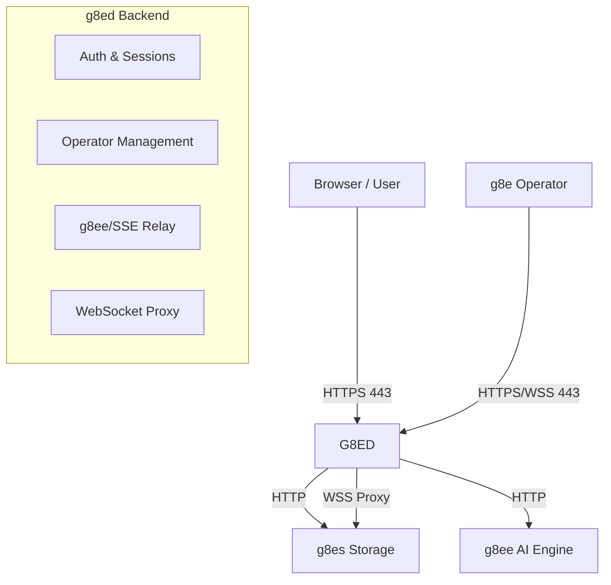

# g8ed — g8e Terminal Backend

Last Updated: 5-6-2026
Version: v.0.2.0

## Overview

g8ed is the primary entry point, authentication gateway, and orchestration backend for the g8e platform. It serves the web UI, manages secure sessions, relays AI interactions to g8ee, and controls the operator lifecycle.

**Core Responsibilities:**
- **Single Entry Point:** All inbound traffic (HTTPS, Operator auth, SSE) enters through g8ed.
- **Authentication:** Owns the Passkey (WebAuthn/FIDO2) and API key authentication flows.
- **Session Management:** Manages WebSessions and OperatorSessions with AES-256-GCM encryption and g8es KV/Doc persistence.
- **Operator Orchestration:** Manages operator slot enrollment (via g8ee), manual binding, and lifecycle command relays (Stop, Relaunch).
- **Chat/AI Proxy:** Relays chat requests to g8ee and delivers streaming responses via Server-Sent Events (SSE).
- **WebSocket Proxy:** Tunnels `/ws/pubsub` upgrade requests directly to g8es for platform-wide eventing.
- **Trust Portal:** Serves workstation CA certificates and automated trust installers over plain HTTP (Port 80).
- **Binary Distribution:** Distributes the `g8e.operator` binary for multiple architectures.

---

## Architecture

g8ed is a stateless Express.js application designed for high-speed relay and secure session isolation.

### Key Design Invariants
- **Zero-Config Runtime:** g8ed reads zero environment variables at runtime. All configuration flows through `SettingsService` (from g8es) and `BootstrapService` (from shared SSL volume).
- **Stateless Relay:** g8ed maintains no local database state; all persistence is delegated to g8es via the `CacheAsideService`.
- **Enforced Context:** Every internal call to g8ee is accompanied by a `G8eHttpContext`, ensuring user identity and session bounds are strictly enforced cross-component.
- **SSE-First Delivery:** All asynchronous AI results, tool events, and operator heartbeats are fanned out to clients via a single long-lived SSE connection.

---

## Service Layer

g8ed is built on a multi-phase initialization model defined in `services/initialization.js`.

| Service | Responsibility |
|:---|:---|
| `WebSessionService` | Lifecycle of browser sessions; manages AES encryption of session-stored API keys. |
| `OperatorDataService` | Authoritative store for operator documents and slot tracking. |
| `BindOperatorsService` | Orchestrates the manual binding between WebSessions and OperatorSessions. |
| `InternalHttpClient` | High-performance cluster-internal HTTP client for g8ee/g8es communication. |
| `SSEService` | Manages the fan-out of real-time events to active browser clients. |
| `G8ENodeOperatorService` | Specifically manages the `g8ep` operator lifecycle on the host node. |
| `DownloadAuthService` | Unified authentication for operator binary downloads (supports DLT, G8eKey, and Operator API keys). |

---

## Data Flow: Chat & Investigation

The chat pipeline is the primary data path in g8ed:

1. **Request:** Browser sends a message to `POST /api/chat/send`.
2. **Context:** `requireOperatorBinding` middleware resolves all `BOUND` operators for the current session.
3. **Relay:** `InternalHttpClient` assembles a `G8eHttpContext` (including the `X-G8E-New-Case` signal if no `case_id` is present) and calls g8ee.
4. **Processing:** g8ee queues the AI task and returns the `case_id` and `investigation_id` immediately.
5. **Streaming:** AI tool events and response chunks are pushed from g8ee to `POST /api/internal/sse/push`, where g8ed fans them out to the browser via SSE.

---

## Operator Lifecycle

g8ed implements a "Slot-Based" operator model to ensure predictable scaling and secure deployment.

### Operator Statuses
- **AVAILABLE:** Slot provisioned but no operator has registered.
- **ACTIVE:** Operator is running and sending heartbeats.
- **BOUND:** Operator is manually linked to a user's web session.
- **STALE:** Heartbeats missed for >60s (monitored by g8ee).
- **OFFLINE:** Operator disconnected or stopped.

### Deployment (Device Link)
`DeviceLinkService` provides the recommended path for deploying new operators:
1. User generates a `dlk_` token with `max_uses`.
2. g8ed serves the deployment script at `GET /g8e`.
3. The script downloads the binary via `OperatorDownloadService`, using the token for authentication.
4. Upon first run, g8ed requests g8ee to assign the operator to an `AVAILABLE` slot and return unique credentials.

---

## Security Model

g8ed enforces several layers of isolation to protect the platform:

- **Cookie Security:** `web_session_id` is an `HttpOnly`, `Secure`, `SameSite=Lax` cookie.
- **Internal Origin Restriction:** All cluster-internal routes are guarded by `requireInternalOrigin`, validating `X-Internal-Auth` using timing-safe equality checks.
- **Sentinel Scrubbing:** Outbound AI responses are processed to prevent the leakage of internal platform identifiers or secrets.
- **Audit Logging:** `AuditService` records all high-impact actions (login, case deletion, command approval) to a persistent document store in g8es.

For deep-reference documentation on the platform's threat model and cryptographic foundations, see [architecture/security.md](../architecture/security.md).